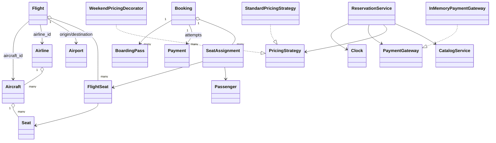

# Airline Reservation Low-Level Design

This is a beginner-friendly, working Python design for airline search,
reservation, payment, check-in, boarding, and flight operations. It covers
airports, airlines, aircraft, physical seats, per-flight seat inventory, cabin
fares, temporary holds, passenger assignments, refunds, boarding passes, and
concurrent protection against selling the same seat twice.

No previous knowledge of low-level design (LLD), object-oriented programming
(OOP), SOLID principles, design patterns, or airline systems is required.

> This is an educational in-memory model, not a production airline Passenger
> Service System. Real systems require durable inventory, ticketing, PNRs,
> multi-leg itineraries, fare rules, taxes, interline/codeshare support, identity
> verification, secure payments, distributed concurrency, and reconciliation.

## 1. The problem in everyday language

A passenger searches for flights between two airports on a date. The system
shows cabins that have enough seats and quotes the total fare. The passenger
selects a seat, begins payment, and temporarily owns that inventory. Successful
payment confirms the booking. A failed payment may be retried while the hold is
valid; timeout or cancellation releases the seat.

Before departure, the passenger checks in and receives a boarding pass. When
the gate opens, checked-in passengers board. The flight then departs and arrives.
If the airline cancels before departure, active bookings are cancelled and paid
reservations are refunded.

The implementation supports:

- Airports with IATA-style codes and timezone metadata.
- Airlines and registered aircraft.
- Economy, premium economy, business, and first-class physical seats.
- Scheduled flight instances and aircraft-overlap prevention.
- Independent seat inventory for every flight occurrence.
- Route/date search with cabin and passenger-count filters.
- Per-flight, per-cabin prices and optional weekend surcharge.
- Multi-passenger bookings with explicit passenger-seat assignments.
- Ten-minute seat holds with configurable duration.
- Automatic release of expired holds.
- Per-flight locking to prevent concurrent double booking.
- Failed-payment retry and idempotent confirmation.
- Passenger cancellation with refund before check-in.
- Configurable online check-in and boarding windows.
- Boarding-pass generation with assigned seat and gate.
- Boarding, departure, arrival, and flight cancellation transitions.
- Airline-initiated refunds for all active paid reservations.
- Passenger booking history and deterministic time tests.

## 2. Start here: run it

Requirements:

- Python 3.10 or newer.
- No third-party packages.

From the repository root:

```powershell
python "Airline Reservation/main.py"
python -m unittest discover -s "Airline Reservation/tests" -t "Airline Reservation" -v
```

Or from inside `Airline Reservation`:

```powershell
python main.py
python -m unittest discover -s tests -v
```

The demo searches a Bengaluru-to-Delhi flight, displays cabin quotes, holds and
pays for seat 1A, checks in, creates a boarding pass, boards, departs, and
arrives. Its injectable demo clock advances instantly through the lifecycle.

## 3. LLD and OOP in two minutes

**Low-level design** translates broad requirements into classes, responsibilities,
interfaces, invariants, and legal state transitions. For this system it asks:

- Is a physical seat the same as inventory on a scheduled flight?
- What combination uniquely identifies something that may be sold?
- Which operations must be atomic?
- What happens when payment fails or a hold expires?
- When may a confirmed passenger check in or board?
- Who handles an airline cancellation and refund?

**Object-oriented programming** groups related state and behavior:

- `Airline` owns `Aircraft`; an `Aircraft` owns physical `Seat` objects.
- `Flight` owns mutable `FlightSeat` inventory for one scheduled occurrence.
- `Booking` owns passenger-seat assignments and its lifecycle.
- `CatalogService` owns stable data and flight scheduling.
- `ReservationService` coordinates inventory and passenger workflows.
- `PricingStrategy` and `PaymentGateway` isolate variable/external behavior.

The objective is clear ownership, not a large class count.

## 4. Scope and simplifying assumptions

- A booking contains one direct flight, not a multi-leg itinerary.
- A booking may contain several registered passengers.
- Every passenger is assigned exactly one selected seat.
- The booking ID acts as the educational reservation reference.
- One currency is used; demo amounts are described as rupees.
- A cabin has one fare per flight; taxes and fees are not itemized.
- A failed payment leaves the hold active until its deadline.
- Passenger cancellation is allowed before check-in and before departure.
- Cancellation receives a full refund.
- Online check-in opens 24 hours and closes 45 minutes before departure.
- Boarding opens 45 minutes before departure.
- A gate must exist before check-in or boarding.
- Aircraft turnaround time is not added to the schedule interval.
- Times are naive `datetime` values in the sample for readability.
- Data, locks, and payment behavior are in-memory and synchronous.

Production aviation uses timezone-aware UTC timestamps, fare families, ticket
coupons, reservation locators, regulatory identity rules, and many exception
flows. Those are explicit advancement areas rather than implied features.

## 5. Domain vocabulary

| Term | Meaning | Example |
|---|---|---|
| Airport | Origin or destination identified by code | BLR |
| Airline | Operator selling/operating a flight | Design Air |
| Aircraft | Physical plane with registration and seat map | VT-LLD |
| Flight instance | One scheduled occurrence | DA101 on 5 January |
| Cabin class | Fare/service area of the aircraft | Economy, business |
| Flight seat | Sellable state of one seat on one occurrence | DA101/1A |
| Hold | Temporary exclusive right to pay | Ten minutes |
| Assignment | Passenger paired with a selected seat | Asha -> 1A |
| Booking | Reservation lifecycle for assignments | Confirmed or checked in |
| Boarding pass | Check-in document containing flight, seat, and gate | Gate A1, seat 1A |
| PNR | Production reservation record/locator | Simplified here as booking ID |

## 6. The most important model: Seat versus FlightSeat

A `Seat` describes a physical position inside an aircraft: number and cabin.
Those properties remain stable across flights. Availability does not.

Seat 1A can be booked on the morning flight and available on the evening flight.
Putting `is_booked` on the physical `Seat` would incorrectly make it unavailable
on every journey made by that aircraft.

Every `Flight` therefore creates fresh `FlightSeat` objects:

```text
Aircraft VT-LLD
  Seat 1A (physical metadata, ECONOMY)
       |----------- Flight DA101 -> FlightSeat 1A: BOOKED
       |----------- Flight DA205 -> FlightSeat 1A: AVAILABLE
       `----------- Flight DA309 -> FlightSeat 1A: HELD
```

The sellable inventory key is conceptually `(flight_id, seat_id)`, not just
`seat_id`. This same modeling idea appears in movie-show seats, train coaches,
event tickets, and scheduled equipment rentals.

## 7. Aircraft scheduling

An aircraft cannot operate overlapping flight intervals. A new flight conflicts
when it uses the same aircraft and:

```python
new_departure < existing_arrival and existing_departure < new_arrival
```

Intervals may touch at an endpoint in this model. A production scheduler would
add taxi, cleaning, maintenance, crew, and minimum-turnaround buffers, so an
aircraft normally cannot arrive and depart again at the same instant.

Cancelled flights stop blocking future schedule creation in this educational
catalog.

## 8. Requirements mapped to responsibilities

| Requirement | Responsible type |
|---|---|
| Protect aircraft seat-map invariants | `Aircraft.add_seat()` |
| Store airlines, airports, aircraft, passengers | `CatalogService` |
| Validate aircraft schedule and build flight inventory | `CatalogService.create_flight()` |
| Find route/date schedules | `CatalogService.find_flights()` |
| Filter live availability and return quotes | `ReservationService.search_flights()` |
| Calculate cabin ticket total | `PricingStrategy` |
| Atomically hold passenger seats | `ReservationService.create_booking()` |
| Expire unpaid holds | `ReservationService.expire_stale_bookings()` |
| Charge and refund | `PaymentGateway` |
| Confirm/cancel/check in/board | `ReservationService` |
| Control flight state | `ReservationService` |
| Supply testable current time | `Clock` |

## 9. Project structure

```text
Airline Reservation/
|-- main.py
|-- models/
|   |-- enums.py
|   |-- money.py
|   |-- airport.py
|   |-- airline.py
|   |-- aircraft.py
|   |-- seat.py
|   |-- flight.py
|   |-- passenger.py
|   |-- booking.py
|   |-- payment.py
|   |-- boarding_pass.py
|   `-- flight_quote.py
|-- strategies/
|   |-- pricing_strategy.py
|   |-- standard_pricing_strategy.py
|   `-- weekend_pricing_decorator.py
|-- services/
|   |-- clock.py
|   |-- catalog_service.py
|   |-- payment_gateway.py
|   |-- in_memory_payment_gateway.py
|   `-- reservation_service.py
`-- tests/
    `-- test_airline_reservation.py
```

Models hold domain state. Strategies implement replaceable calculations.
Services coordinate workflows that span multiple objects and boundaries.

## 10. Class relationships



## 11. State machines

### Booking lifecycle

```text
                         payment succeeds
PENDING_PAYMENT --------------------------------> CONFIRMED
      |                                               |
      | hold expires                                  | valid check-in window
      v                                               v
   EXPIRED                                         CHECKED_IN
                                                      |
                                                      | gate accepts passenger
                                                      v
                                                   BOARDED

PENDING_PAYMENT ---- cancel ----> CANCELLED
CONFIRMED -------- refund -------> CANCELLED

Airline flight cancellation: any active pre-departure booking -> CANCELLED
```

`PENDING_PAYMENT`, `CONFIRMED`, `CHECKED_IN`, and `BOARDED` own their assigned
seats. Terminal `EXPIRED` and `CANCELLED` bookings release them.

### Flight-seat lifecycle

```text
AVAILABLE -> HELD -> BOOKED -> CHECKED_IN -> BOARDED
    ^          |        |
    |          |        +--- passenger/airline cancellation
    +----------+------------ timeout/cancellation
```

`booking_id` records ownership so one cancellation cannot release another
booking's seat.

### Flight lifecycle

```text
SCHEDULED -> BOARDING -> DEPARTED -> ARRIVED
    |            |
    +------------+------> CANCELLED
```

Departure is allowed only from `BOARDING` and at/after scheduled departure.
Arrival is allowed only from `DEPARTED` and at/after scheduled arrival.

### Payment lifecycle

```text
charge -> COMPLETED -> REFUNDED
      `-> FAILED
```

Every retry creates a new payment record rather than overwriting history.

## 12. Workflow walkthroughs

### Search and quote

1. Validate route airports, future date, and passenger count.
2. Find scheduled flight instances for route and date.
3. Lock each flight and expire stale holds.
4. Count available seats by requested cabin.
5. Keep only cabins that can seat the whole party.
6. Calculate a quote using the chosen strategy.
7. Return results sorted by total price and departure.

Without a cabin filter, one eligible quote is returned per cabin per flight.
A quote is informational; `create_booking()` rechecks inventory atomically.

### Hold passenger seats

1. Validate all passenger IDs and unique selected seats.
2. Acquire the flight lock.
3. Expire stale holds and verify the flight is scheduled and in the future.
4. Verify every seat exists and is `AVAILABLE`.
5. Create explicit `SeatAssignment` objects.
6. Price the selected cabins.
7. Create a pending booking and mark the seats `HELD`.

The hold deadline is the earlier of ten minutes and departure time.

### Pay and confirm

1. Recheck hold expiry and flight state while locked.
2. Return the existing successful payment for a repeated confirmation call.
3. Record every payment attempt.
4. Leave a failed attempt pending so the passenger may retry.
5. On success, change seats from `HELD` to `BOOKED` and confirm.

### Check in and board

1. Require a confirmed booking, assigned gate, and open check-in window.
2. Generate one boarding pass per passenger assignment.
3. Store seat number, gate, passenger, booking, flight, and issue time.
4. Change booking and seat state to `CHECKED_IN`.
5. At boarding time, operations move the flight to `BOARDING`.
6. Only checked-in bookings can board; their seats become `BOARDED`.

Repeated check-in returns the existing boarding passes instead of duplicating
them. Repeated boarding also returns the existing booking state.

### Cancel

- Passenger pending booking: release seats without refund.
- Passenger confirmed booking: refund first, then release seats.
- Checked-in or boarded passenger: reject self-service cancellation.
- Airline cancellation: refund every completed payment, cancel all active
  bookings, release inventory, and mark the flight cancelled.

Refunding precedes releasing a paid passenger's seat, so a provider failure does
not falsely report a successful cancellation without returning money.

## 13. Check-in and boarding time boundaries

With default configuration:

```text
Departure - 24h                      Departure - 45m       Departure
       |-----------------------------------|------------------|
       check-in opens                     check-in closes
                                           boarding opens
```

At exactly 45 minutes before departure, online check-in is closed and boarding
may start. At scheduled departure, boarding closes. Injecting `Clock` makes all
boundary tests instant and deterministic.

Real airlines have different domestic/international, airport, passenger, and
document rules. These should become policy objects rather than scattered time
checks when the requirements grow.

## 14. Preventing double booking

An unsafe workflow can sell one seat twice:

```text
Thread A sees 1A available
Thread B sees 1A available
Thread A holds 1A
Thread B holds 1A
```

The service has one `RLock` per flight. Availability checks and seat updates for
the same flight share one critical section. Different flights can progress
independently. A two-thread unit test synchronizes contenders at a barrier and
asserts exactly one winner.

### Production limitation

An in-memory lock protects one application process only. Distributed servers
need durable shared enforcement, for example:

- A database transaction with row locks.
- An atomic conditional update from `AVAILABLE` to `HELD`.
- A unique inventory ownership constraint on `(flight_id, seat_id)`.
- Optimistic versioning with compare-and-set and retry.
- A distributed lease with fencing tokens where appropriate.

The durable inventory store must be authoritative. A cache can improve search
latency but must not independently decide that the last seat was sold.

## 15. Pricing and money

Money uses `Decimal`, normalized to two places with `ROUND_HALF_UP`. Binary
`float` should not represent payable totals.

`StandardPricingStrategy` adds the configured fare for each selected seat's
cabin. A booking can mix cabins because pricing follows actual assignments.

`WeekendPricingDecorator` wraps any strategy and adds a percentage when the
flight departs on Saturday or Sunday:

```python
pricing = WeekendPricingDecorator(StandardPricingStrategy(), "25")
```

Production pricing is substantially richer: fare buckets, booking classes,
inventory controls, taxes, fuel surcharge, airport fee, branded fares, advance
purchase, change/refund rules, loyalty, and price-lock expiry. An itemized
`FareQuote` with its own expiration would be a natural next model.

## 16. Design patterns used

### Strategy

`PricingStrategy` makes fare calculation replaceable without changing the
reservation workflow.

### Decorator

`WeekendPricingDecorator` contains another strategy and adds behavior, allowing
pricing rules to be composed without a subclass for every combination.

### Gateway / Adapter boundary

`PaymentGateway` exposes only `charge` and `refund`. The in-memory fake can be
replaced by a provider adapter that translates to an SDK or HTTP API.

### Dependency injection

`ReservationService` receives catalog, pricing, gateway, clock, and time-window
configuration in its constructor. Tests control time and payment outcomes.

### Service layer

The reservation service coordinates booking state, flight inventory, payment,
boarding passes, locks, and flight operations. Models remain focused and the
demo remains only a client.

## 17. OOP and SOLID lessons

### Encapsulation

`Aircraft.add_seat()` protects unique IDs and seat numbers. `Airline.add_aircraft()`
protects aircraft identity and requires a seat map.

### Abstraction

Reservation policy knows `PaymentGateway`, `PricingStrategy`, and `Clock`
contracts, not payment SDK or system-clock details.

### Composition over inheritance

An airline contains aircraft, an aircraft contains seats, a booking contains
assignments, and a pricing decorator contains another pricing strategy.

### Single Responsibility Principle

- Models represent domain state.
- `CatalogService` handles master data and scheduling.
- `ReservationService` handles transactional passenger workflows.
- Strategies handle fare calculations.
- The gateway handles provider behavior.

### Open/Closed Principle

New pricing and gateway implementations can be introduced without editing the
central workflow.

### Liskov Substitution Principle

Any implementation honoring `PricingStrategy` or `PaymentGateway` can replace
the current concrete implementation.

### Interface Segregation Principle

The abstractions are small. Pricing code does not depend on boarding operations,
and payment code does not depend on airport search.

### Dependency Inversion Principle

High-level booking policy depends on abstractions at external or variable
boundaries.

## 18. Validation and important edge cases

The implementation handles or rejects:

- Invalid and duplicate airport codes.
- Duplicate airlines, aircraft registrations, passengers, and passports.
- Duplicate physical seat IDs and numbers.
- Empty aircraft and non-positive fares.
- Same origin and destination.
- Arrival not after departure.
- Overlapping aircraft schedules.
- Past search dates and non-positive passenger counts.
- Cabins without enough seats for the requested party.
- Unknown passengers, flights, and selected seats.
- Duplicate selected seat assignments.
- Held, booked, checked-in, or boarded seats.
- Payment after hold expiry or flight closure.
- Failed payment retry.
- Repeated confirmation, check-in, boarding, departure, and arrival calls.
- Missing gates, early/late check-in, and early/late boarding.
- Boarding without check-in.
- Illegal flight transition order.
- Passenger cancellation after check-in.
- Flight cancellation after departure.

## 19. Complexity

Let `F` be matching flights, `S` seats per flight, `B` stored bookings, and `P`
passengers in one booking.

| Operation | Time | Extra space |
|---|---:|---:|
| Create flight inventory | `O(S + F)` | `O(S)` |
| Search and quote | `O(F * (B + S))` plus sorting | `O(F * cabins)` |
| Create booking | `O(B + P)` | `O(P)` |
| Confirm/cancel booking | `O(B + P)` | `O(1)` |
| Check in | `O(P)` | `O(P)` boarding passes |
| Board booking | `O(P)` | `O(1)` |
| Cancel flight | `O(B * P)` worst case | `O(B)` affected bookings |
| List available seats | `O(B + S log S)` | `O(S)` |

The in-memory scans favor clarity. Production repositories would index route,
departure, status, flight-seat inventory, booking ownership, passengers, and
hold expiry.

## 20. Test coverage

The 18-test suite verifies:

- Route/date search, sorted cabin quotes, and party capacity.
- Aircraft schedule overlap rejection.
- Independent seat inventory on separate flight instances.
- Multi-passenger and mixed-cabin pricing.
- Duplicate and already-held seat rejection.
- Hold expiry and seat release.
- Successful, failed, retried, and idempotent payment.
- Pending cancellation and confirmed cancellation with refund.
- Check-in opening/closing boundaries and boarding-pass data.
- Boarding prerequisites plus boarding/departure/arrival order.
- Airline cancellation, active booking cancellation, refund, and release.
- Weekend pricing.
- Newest-first passenger history.
- A concurrent same-seat race with exactly one winner.

Tests serve as executable business requirements. Add tests with every new fare,
time-window, state, or refund rule.

## 21. Production evolution

A realistic next architecture could evolve as follows:

1. Add repository interfaces and durable relational storage.
2. Enforce seat ownership atomically with transactions and constraints.
3. Separate schedules, flight legs, operating flights, and marketed codeshares.
4. Model itineraries containing several segments and connecting-time rules.
5. Introduce PNR locators, travelers, tickets, and segment coupons.
6. Add fare quotes with fare basis, taxes, rules, currency, and expiration.
7. Add bags, meals, wheelchairs, infants, and paid ancillary services.
8. Add seat-map restrictions and aircraft-change reassignment.
9. Process signed payment webhooks with idempotency and reconciliation.
10. Publish reliable events through an outbox for notifications and operations.
11. Add delays, gate changes, no-show, denied boarding, and re-accommodation.
12. Add authentication, authorization, encryption, auditing, tracing, and alerts.

### Failures a production system must answer

- Payment succeeded but confirmation response was lost.
- A payment or cancellation request arrived more than once.
- A provider webhook arrived late or out of order.
- The aircraft changed after seats were assigned.
- A flight cancellation must rebook passengers instead of only refunding them.
- One segment of a multi-leg itinerary changed.
- A codeshare partner owns the authoritative inventory.
- The system crashed halfway through refunding a cancelled flight.

These need durable workflows, idempotency keys, sagas/compensation,
reconciliation, and operational tooling—not merely additional model classes.

## 22. Suggested learning exercises

### Beginner

- Validate non-blank passenger and flight fields.
- Filter search by maximum fare or departure window.
- Add aircraft seat rows, columns, and window/aisle preference.
- Print a formatted boarding pass.

### Intermediate

- Add baggage allowance and excess-baggage charges.
- Add itemized taxes and fees.
- Add configurable cancellation/refund strategies.
- Add flight-delay and gate-change notifications using Observer.
- Add meal and special-assistance requests.

### Advanced

- Model multi-leg itineraries, PNRs, and e-ticket coupons.
- Implement PostgreSQL repositories and atomic seat claims.
- Add expiring fare quotes independent of seat holds.
- Handle provider webhooks and idempotent reconciliation.
- Reassign seats after an aircraft swap.
- Load-test a high-demand flight with thousands of simultaneous users.

Start each exercise with an invariant. Example: "At most one active booking may
own `(flight_id, seat_id)` at any instant." Then choose the class, transaction,
database constraint, and test that enforce it.

## 23. Interview discussion guide

A strong explanation usually follows this order:

1. Clarify direct-flight search, booking, payment, check-in, and cancellation.
2. Explain physical `Seat` versus occurrence-specific `FlightSeat`.
3. Describe aircraft schedule overlap.
4. Walk through booking, seat, payment, and flight state machines.
5. State the one-owner-per-flight-seat invariant.
6. Explain timed holds and payment retry/idempotency.
7. Explain check-in/boarding time boundaries and boarding passes.
8. Explain Strategy, Decorator, Gateway, Clock, and dependency injection.
9. Admit that a one-process lock is not distributed protection.
10. Evolve toward transactions, PNRs, itineraries, tickets, and webhooks.

Strong LLD is demonstrated through clear ownership, invariants, transitions,
and failure handling—not by memorizing a class diagram.
