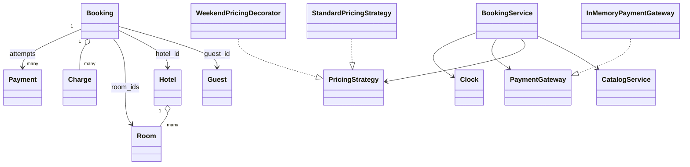

# Hotel Management Low-Level Design

This is a beginner-friendly, working Python design for hotel search,
reservations, payments, and guest stays. It covers hotels and rooms, date-range
availability, temporary booking holds, pricing, concurrent reservation safety,
payment retry and refund, check-in, hotel charges, checkout, and room outages.

No previous knowledge of low-level design (LLD), object-oriented programming
(OOP), SOLID principles, design patterns, or hotel operations is required.

> This is an educational in-memory model, not a production property-management
> system. Real hotels require persistent inventory, identity and access control,
> taxes, rate plans, housekeeping, channel-manager integration, audit trails,
> payment compliance, distributed concurrency control, and failure recovery.

## 1. The problem in everyday language

A guest searches for a room in a city for an arrival and departure date. The
system must show only rooms that are operational, large enough, and not reserved
for an overlapping stay. When the guest begins payment, the selected room is
held temporarily so another guest cannot take it. Successful payment confirms
the reservation; abandoned payment eventually releases it.

At the hotel, staff check the guest in. During the stay, room service, laundry,
or minibar purchases are added to the booking's bill. Checkout succeeds after
the remaining amount is paid.

The implementation supports:

- Guest, hotel, and physical room catalog management.
- Standard, deluxe, and suite rooms with capacity and nightly rate.
- In-service and out-of-service room state.
- Search by city, dates, room type, and minimum capacity.
- Exact quotes for the full stay.
- Check-in-inclusive, check-out-exclusive date ranges.
- Multi-room reservations with total capacity validation.
- Temporary ten-minute holds with configurable duration.
- Automatic expiry and room release for unpaid bookings.
- Per-hotel locking to prevent concurrent double reservation.
- Standard pricing and a composable weekend surcharge.
- Exact decimal money calculations.
- Failed-payment retry and idempotent confirmation.
- Cancellation and full refund before the arrival date.
- Check-in, stay charges, outstanding balance, and checkout settlement.
- Guest booking history and deterministic time-based tests.

## 2. Start here: run it

Requirements:

- Python 3.10 or newer.
- No third-party packages.

From the repository root:

```powershell
python "Hotel Management/main.py"
python -m unittest discover -s "Hotel Management/tests" -t "Hotel Management" -v
```

Or from inside `Hotel Management`:

```powershell
python main.py
python -m unittest discover -s tests -v
```

The demo creates a Bengaluru hotel, quotes three rooms for a two-night stay,
holds and confirms the least expensive room, and displays the APIs used later
for check-in, stay charges, and checkout.

## 3. What LLD and OOP mean

**Low-level design** translates requirements into classes, interfaces, methods,
state transitions, and invariants. It answers questions such as:

- Which object owns physical room information?
- How is date overlap decided?
- Which booking states block availability?
- Where does pricing vary?
- How do payment failures affect the reservation?
- What must be atomic when two guests choose the same room?

**Object-oriented programming** groups related state and behavior into objects:

- `Hotel` owns its physical `Room` objects.
- `Booking` records one guest's reserved rooms and stay interval.
- `CatalogService` owns stable catalog operations.
- `BookingService` coordinates reservation and stay workflows.
- `PricingStrategy` represents a replaceable pricing policy.
- `PaymentGateway` represents the boundary to a payment provider.

Good OOP is not about maximizing the number of classes. It is about giving each
business rule one clear owner and keeping unrelated concerns separate.

## 4. Scope and simplifying assumptions

- A guest selects exact room IDs when booking.
- One booking belongs to one hotel but may include several rooms.
- Total selected capacity must cover the guest count.
- Check-in date is included; check-out date is excluded.
- One currency is used; demo amounts are described as rupees.
- Nightly rate belongs to the physical room.
- The initial payment covers the complete room amount.
- Stay charges are paid at checkout.
- Failed payment leaves the temporary hold active for retry.
- Confirmed cancellation before arrival receives a full refund.
- Confirmed cancellation on or after arrival date is not allowed.
- A guest may check in from arrival date until before departure date.
- The fake gateway processes charge and refund synchronously.
- All data and locks exist only inside one Python process.

Many real hotels sell a **room type** and assign an exact physical room closer
to arrival. That supports room swaps, maintenance recovery, and controlled
overbooking. Exact-room selection is used here because it makes the core
availability invariant concrete and easy to inspect.

## 5. Domain vocabulary

| Term | Meaning | Example |
|---|---|---|
| Guest | Person who owns a reservation | Asha |
| Hotel | Property in a city | Design Inn, Bengaluru |
| Room | Physical room with number, type, capacity, and rate | Room 201, deluxe |
| Stay interval | Nights occupied by a reservation | Jan 10 up to Jan 12 |
| Hold | Temporary unpaid reservation | Valid for ten minutes |
| Booking | Reservation and stay lifecycle | Confirmed or checked in |
| Charge | Additional amount added during a stay | Laundry, INR 250 |
| Folio | Complete bill for the stay | Room price plus all charges |
| Payment | One charge attempt | Failed card or completed UPI |
| Quote | Available room and price for requested dates | Room 101, INR 4,400 |

## 6. The two kinds of room state

A common modeling mistake is a single `RoomStatus.AVAILABLE/OCCUPIED` field.
Availability is not a permanent property of a room: room 101 can be reserved
next weekend and available the weekend after.

This design separates:

1. **Operational state** on `Room`: `IN_SERVICE` or `OUT_OF_SERVICE`.
2. **Date availability**, derived from active bookings and their stay intervals.

```text
Room 101: IN_SERVICE
  Jan 10 -------- Jan 12   Booking A: CONFIRMED
  Jan 12 -------- Jan 14   Booking B: PENDING_PAYMENT
  Jan 14 onward            available
```

An out-of-service room never appears in search and cannot be newly booked. An
in-service room is available only if no blocking booking overlaps the requested
dates.

## 7. Date ranges and the overlap rule

Hotel stays use a half-open interval:

```text
[check_in_date, check_out_date)
```

The left side is included and the right side is excluded. A Jan 10 to Jan 12
booking occupies the nights of Jan 10 and Jan 11. It does not occupy Jan 12, so
another guest can check in that day.

Two stays overlap exactly when:

```python
new_check_in < existing_check_out and existing_check_in < new_check_out
```

Examples:

| Existing | Requested | Result |
|---|---|---|
| Jan 10-12 | Jan 11-13 | Overlap |
| Jan 10-12 | Jan 9-11 | Overlap |
| Jan 10-12 | Jan 12-14 | Allowed; adjacent |
| Jan 10-12 | Jan 8-10 | Allowed; adjacent |

This interval rule is simpler and safer than enumerating special cases.

## 8. Requirements mapped to responsibilities

| Requirement | Responsible type |
|---|---|
| Protect unique room IDs/numbers | `Hotel.add_room()` |
| Store guests, hotels, and rooms | `CatalogService` |
| Mark a room out of service | `CatalogService.set_room_status()` |
| Find operational non-overlapping rooms | `BookingService.search_available_rooms()` |
| Price each night | `PricingStrategy` |
| Atomically hold selected rooms | `BookingService.create_booking()` |
| Expire unpaid holds | `BookingService.expire_stale_bookings()` |
| Charge and refund money | `PaymentGateway` |
| Confirm and cancel reservations | `BookingService` |
| Check in and check out | `BookingService` |
| Build the folio | `Booking` plus `Charge` objects |
| Make time testable | `Clock` |

## 9. Project structure

```text
Hotel Management/
|-- main.py
|-- models/
|   |-- enums.py
|   |-- money.py
|   |-- guest.py
|   |-- room.py
|   |-- hotel.py
|   |-- room_quote.py
|   |-- booking.py
|   |-- charge.py
|   `-- payment.py
|-- strategies/
|   |-- pricing_strategy.py
|   |-- standard_pricing_strategy.py
|   `-- weekend_pricing_decorator.py
|-- services/
|   |-- clock.py
|   |-- catalog_service.py
|   |-- payment_gateway.py
|   |-- in_memory_payment_gateway.py
|   `-- booking_service.py
`-- tests/
    `-- test_hotel_management.py
```

Models express domain state, strategies express interchangeable pricing rules,
and services coordinate use cases involving multiple objects.

## 10. Class relationships



The booking stores IDs for guest, hotel, and rooms. The catalog resolves those
IDs. This avoids copying a large mutable hotel graph into every booking.

## 11. Booking state machine

```text
                            payment succeeds
PENDING_PAYMENT --------------------------------> CONFIRMED
      |                                               |
      | hold expires                                  | arrival validation
      v                                               v
   EXPIRED                                         CHECKED_IN
                                                      |
                                                      | folio settled
                                                      v
                                                  CHECKED_OUT

PENDING_PAYMENT ---- cancel ----> CANCELLED
CONFIRMED -------- refund -------> CANCELLED
```

Important rules:

- `PENDING_PAYMENT`, `CONFIRMED`, and `CHECKED_IN` block overlapping bookings.
- `EXPIRED`, `CANCELLED`, and `CHECKED_OUT` do not block availability.
- A failed payment does not change the booking state, allowing retry.
- Check-in requires a confirmed booking and a valid arrival window.
- Stay charges require `CHECKED_IN`.
- Checkout requires all outstanding money to be paid.

Using one enum prevents contradictory combinations such as "cancelled and
checked in" that can arise from several loosely related boolean flags.

## 12. Payment lifecycle and folio

Every charge attempt creates a separate `Payment`:

```text
charge ---> COMPLETED ---> REFUNDED
       `--> FAILED
```

A retry does not overwrite a failed attempt. The booking keeps all payment IDs,
which is closer to a real audit history.

The booking's total is calculated as:

```text
total = room amount + room service + laundry + minibar + other charges
outstanding = total - completed, non-refunded payments
```

The initial confirmation payment covers `room_amount`. Charges added during the
stay increase `total_amount`. Checkout charges only the outstanding balance. If
that charge fails, the guest remains checked in and can retry another method.

## 13. Workflow walkthroughs

### Search availability

1. Validate that departure is after arrival and arrival is not in the past.
2. Find hotels matching the normalized city.
3. Lock one hotel and expire its stale holds.
4. Filter rooms by operational state, optional type, and capacity.
5. Reject rooms with overlapping blocking bookings.
6. Price every remaining room for every requested night.
7. Return quotes sorted by total price, hotel name, and room number.

### Create a hold

1. Validate guest, hotel, dates, room IDs, and guest count.
2. Acquire the hotel's lock.
3. Expire stale pending bookings.
4. Resolve every selected room and verify combined capacity.
5. Ensure each room is in service and available for the entire range.
6. Calculate the complete room amount.
7. Create `PENDING_PAYMENT` with a ten-minute deadline.

The availability check and insertion happen inside one critical section. This
is the atomic decision that prevents two local threads from both winning.

### Confirm or retry payment

1. Expire stale holds before accepting money.
2. If already confirmed, return the previous successful payment.
3. Create a new gateway charge for the room amount.
4. Record both successful and failed attempts.
5. Confirm only after a completed payment.

### Check in

1. Require `CONFIRMED`.
2. Reject a date before arrival or on/after departure.
3. Verify every assigned room remains in service.
4. Change status to `CHECKED_IN` and record the timestamp.

### Add charges and check out

1. Add positive, described charges only during `CHECKED_IN`.
2. Calculate the outstanding folio.
3. If money remains, attempt one checkout payment.
4. Keep the stay active when payment fails.
5. On full settlement, mark `CHECKED_OUT` and record the timestamp.

## 14. Concurrent booking safety

Without synchronization, this race is possible:

```text
Thread A checks room 101 -> available
Thread B checks room 101 -> available
Thread A creates a hold
Thread B creates a hold
```

`BookingService` uses one reentrant lock per hotel. Operations for the same
hotel serialize around availability and state updates; different hotels can
progress independently. The tests place two threads at a barrier and make both
request room 101 for the same dates. Exactly one succeeds.

### Production limitation

An in-memory lock protects only one process. Two application servers have two
unrelated locks. Production protection belongs in durable shared infrastructure:

- A relational database transaction and row/range locking.
- An atomic conditional insert guarded by an exclusion constraint.
- Optimistic versioning with compare-and-set and retry.
- A distributed lock with lease and fencing-token safety.

PostgreSQL range types and exclusion constraints are especially useful for
preventing overlapping date ranges on the same exact room. The database should
remain the final source of truth even when a cache accelerates search.

## 15. Pricing and exact money

`Decimal` is used instead of binary `float`, and `to_money()` rounds to two
decimal places with `ROUND_HALF_UP`.

`PricingStrategy` exposes `price_for_night(room, stay_date)`. Its shared
`calculate()` walks from arrival through the night before departure. This
night-level design allows different rates on different dates.

`StandardPricingStrategy` returns the room's normal nightly rate.
`WeekendPricingDecorator` wraps another strategy and increases Saturday and
Sunday nights:

```python
pricing = WeekendPricingDecorator(StandardPricingStrategy(), "25")
```

A Friday-to-Monday stay therefore contains one normal and two weekend-priced
nights. Future policies could cover seasons, occupancy, corporate contracts,
promotions, meal plans, or loyalty tiers.

In a production model, rate plans are usually separate entities with currency,
taxes, refund rules, effective dates, included meals, and inventory conditions.

## 16. Design patterns used

### Strategy

`PricingStrategy` makes nightly pricing replaceable without editing reservation
logic. Use Strategy when an algorithm varies independently from its workflow.

### Decorator

`WeekendPricingDecorator` contains another strategy and augments it. Decorators
avoid one subclass for every combination of weekend, tax, coupon, and loyalty
rule.

### Gateway / Adapter boundary

`PaymentGateway` expresses only the domain's `charge` and `refund` needs.
`InMemoryPaymentGateway` is a fake implementation. A real provider adapter would
translate this small contract to an SDK, HTTP request, or payment terminal.

### Dependency injection

`BookingService` receives catalog, pricing, gateway, and clock dependencies in
its constructor. Tests replace real time and payment behavior without changing
the service.

### Service layer

`BookingService` owns workflows spanning availability, booking state, payment,
time, charges, and locks. `main.py` remains a client instead of becoming a
collection of business rules.

## 17. OOP and SOLID lessons

### Encapsulation

`Hotel.add_room()` protects unique room IDs/numbers and valid capacity/rate.
`Booking.total_amount` computes the folio from owned data rather than asking
callers to remember the formula.

### Abstraction

The reservation flow depends on `PaymentGateway`, `PricingStrategy`, and `Clock`
contracts rather than concrete provider or time details.

### Composition over inheritance

A hotel contains rooms, a booking contains charges, and a pricing decorator
contains another pricing strategy. These are natural "has-a" relationships.

### Single Responsibility Principle

- Models represent business state.
- `CatalogService` manages stable catalog data.
- `BookingService` manages transactional reservation/stay behavior.
- Pricing types calculate rates.
- The gateway isolates provider behavior.

### Open/Closed Principle

New pricing and gateway implementations can be added without rewriting the
reservation lifecycle.

### Liskov Substitution Principle

Any correct `PricingStrategy` or `PaymentGateway` implementation can replace
the current one without breaking the service contract.

### Interface Segregation Principle

Interfaces stay small. A pricing policy does not need booking cancellation
methods, and a payment provider does not need hotel-search methods.

### Dependency Inversion Principle

High-level reservation policy depends on abstractions at variable or external
boundaries instead of instantiating concrete mechanisms itself.

## 18. Validation and edge cases

The implementation handles or rejects:

- Duplicate guest IDs and email addresses.
- Duplicate hotel IDs, room IDs, and room numbers.
- Non-positive capacity and nightly rate.
- Departure on or before arrival.
- Arrival in the past.
- Empty or duplicate room selections.
- Unknown guests, hotels, and rooms.
- Insufficient combined room capacity.
- Out-of-service room search and booking.
- Overlapping pending, confirmed, or checked-in stays.
- Expired payment holds.
- Failed confirmation and checkout payment retries.
- Duplicate confirmation and cancellation calls.
- Confirmed cancellation on or after arrival.
- Early or late check-in.
- Charges outside an active stay.
- Non-positive or undescribed charges.
- Checkout before check-in.

## 19. Complexity

Let `H` be matching hotels, `R` rooms, `B` stored bookings, `K` rooms selected,
and `N` nights.

| Operation | Time | Extra space |
|---|---:|---:|
| Search available rooms | `O(H * R * (B + N))` plus sorting | `O(R)` quotes |
| Create booking | `O(B + K * (B + N))` | `O(K)` |
| Price one room | `O(N)` | `O(1)` |
| Expire holds | `O(B)` | `O(B)` result worst case |
| Confirm/cancel | `O(B + payments)` | `O(1)` |
| Add charge | `O(1)` | `O(1)` |
| Calculate outstanding | `O(charges + payments)` | `O(1)` |

The repeated scans favor readability. A production database would index rooms,
hotels, booking status, date ranges, hold deadlines, and guest history. Search
would query those indexes rather than walk every in-memory booking.

## 20. Test coverage

The 18-test suite verifies:

- City/type/capacity search and exact quotes.
- Invalid and past date ranges.
- Number of nights and held-room exclusion.
- Multi-room capacity rules.
- Out-of-service rooms.
- Overlapping versus adjacent stays.
- Expired-hold room release.
- Successful, failed, retried, and idempotent confirmation.
- Pending cancellation and confirmed cancellation with refund.
- Early check-in and arrival-date check-in.
- Arrival-date cancellation policy.
- Stay charges, outstanding balance, and checkout retry.
- Checkout without an unnecessary second payment.
- Per-night weekend pricing.
- Newest-first guest history.
- A two-thread same-room race with one winner.

Tests are executable business requirements. When a policy changes, update or
add the relevant test so its intended behavior remains visible.

## 21. Production evolution

A realistic evolution path is:

1. Introduce repository interfaces and a relational database.
2. Enforce non-overlapping inventory atomically in the database.
3. Separate sellable room-type inventory from physical room assignment.
4. Add rate plans, taxes, fees, currencies, coupons, and cancellation policies.
5. Add idempotency keys to booking, payment, refund, and checkout requests.
6. Process signed asynchronous payment webhooks and reconciliation.
7. Add no-show, amended, partially refunded, and disputed states.
8. Add housekeeping states: dirty, cleaning, inspected, and ready.
9. Add staff roles, authentication, audit logs, and privacy controls.
10. Integrate online travel agencies through a channel manager.
11. Publish reliable events with an outbox for email and SMS notifications.
12. Add occupancy reports, revenue metrics, tracing, alerts, and backups.

### Failures a production system must answer

- Payment succeeded but the confirmation response was lost.
- The same client request arrived several times.
- A refund succeeded remotely but the local update failed.
- Two sales channels sold the last room simultaneously.
- A confirmed physical room became unavailable before arrival.
- A guest shortened or extended a stay.
- A checkout charge was disputed later.
- A hotel changed timezone or daylight-saving rules affected timestamps.

These need durable transactions, idempotency, reconciliation, auditing, and
explicit eventual-consistency behavior—not merely additional classes.

## 22. Suggested learning exercises

### Beginner

- Validate non-blank names, addresses, phone numbers, and room numbers.
- Search by hotel name and maximum price.
- Add amenities such as Wi-Fi, pool, or breakfast.
- Print an itemized checkout receipt.

### Intermediate

- Add tax and fee line items to the folio.
- Support reservation date changes with availability revalidation.
- Add partial-refund cancellation strategies.
- Add housekeeping state and a room-ready check before arrival.
- Add email/SMS observers for confirmation and checkout.

### Advanced

- Sell room-type inventory and assign physical rooms later.
- Implement PostgreSQL repositories and overlap constraints.
- Handle provider webhooks with idempotency and reconciliation.
- Model split payments and partial refunds.
- Integrate a channel manager using an adapter.
- Load-test thousands of competing requests for limited inventory.

For every extension, first write an invariant. Example: "For an in-service exact
room, at most one blocking booking may overlap a given night." Then decide which
class, transaction, database constraint, and test enforce it.

## 23. Interview discussion guide

A clear interview explanation usually follows this order:

1. Clarify search, reservation, payment, stay, and cancellation scope.
2. Explain operational room state versus date-derived availability.
3. Define `[check-in, check-out)` and the overlap formula.
4. Walk through the booking state machine.
5. Explain temporary holds and failed-payment retry.
6. State the no-overlapping-bookings invariant and locking boundary.
7. Explain Strategy, Decorator, Gateway, Clock, and dependency injection.
8. Discuss check-in, folio charges, and checkout settlement.
9. Admit the one-process lock limitation.
10. Evolve toward durable inventory, transactions, room types, and webhooks.

Strong LLD answers are built around clear ownership, invariants, transitions,
and failure behavior—not around memorizing class diagrams.
