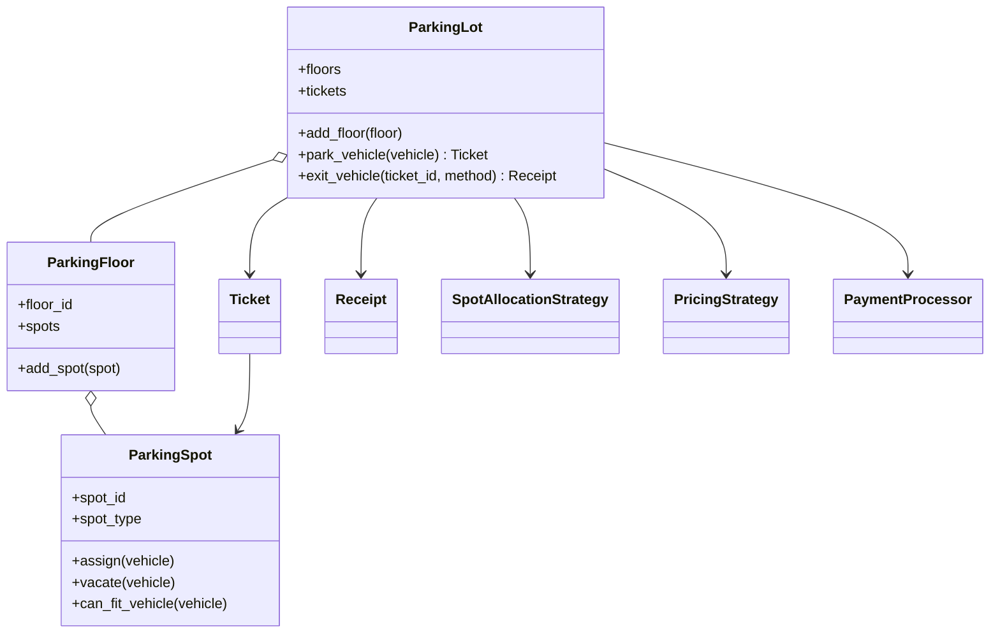
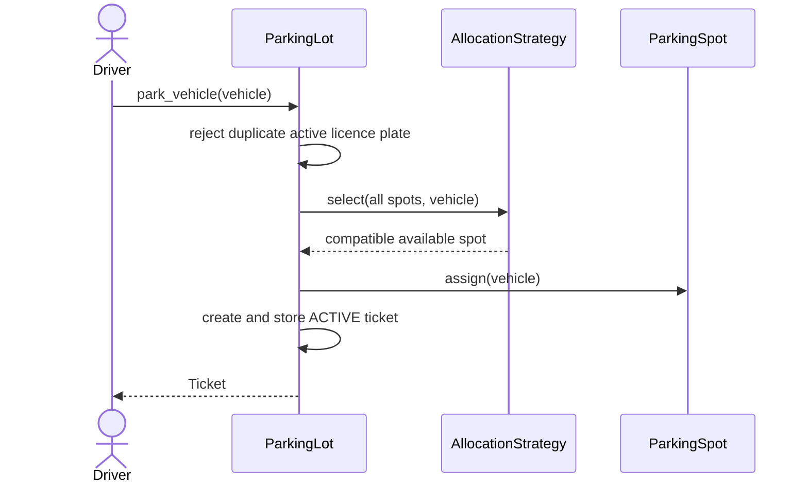
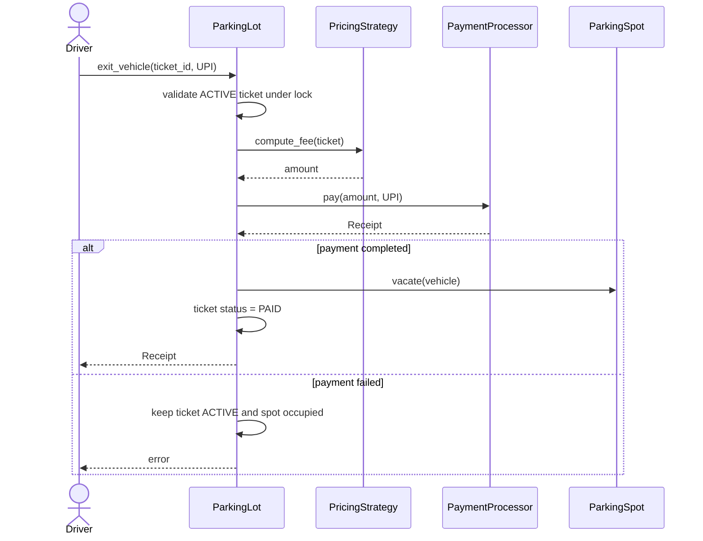

# Parking Lot Low-Level Design

This project is a beginner-friendly, working implementation of a multi-floor
parking lot. It demonstrates how to turn everyday requirements into classes,
relationships, state transitions, algorithms, and tests.

You do not need prior knowledge of LLD, OOP, SOLID, or design patterns. Each
concept is introduced where it appears in the code.

## 1. The problem in everyday language

A parking lot contains floors. A floor contains physical spots. A vehicle
arrives, receives a compatible available spot and an entry ticket, then later
pays a time-based fee and exits. A successful exit frees the spot.

The system currently supports:

- Motorcycles, cars, and trucks.
- Regular, compact, and large spots.
- Multiple parking floors.
- Nearest-first or best-fit spot allocation.
- Hourly or daily pricing.
- An optional weekend surcharge.
- UPI payment processing.
- Thread-safe vehicle entry and exit.
- Validation for duplicates, incompatible spots, invalid tickets, full lots,
  repeat parking, unsupported payments, and failed payments.

This is an in-memory design: restarting the program clears all state.

## 2. Start here: run it

Requirements:

- Python 3.10 or newer.
- No external packages.

From the `Parking lot` directory:

```powershell
python main.py
python -m unittest discover -s tests -v
```

`main.py` builds a floor, adds three spots, parks a car and motorcycle, exits
both, and prints their receipts.

## 3. Domain vocabulary

Before designing classes, understand the real-world nouns and actions.

| Term | Meaning |
|---|---|
| Vehicle | A motorcycle, car, or truck identified by licence plate |
| Parking spot | One physical location with a size, floor, and distance |
| Parking floor | A collection of spots |
| Ticket | Proof of an active parking session |
| Receipt | Proof of completed payment |
| Allocation | Choosing a compatible available spot |
| Pricing | Calculating a fee from vehicle type and duration |
| Payment processor | Completing a payment through a supported method |

One of the most useful LLD habits is separating things that sound related but
have different lifecycles. A `Ticket` represents parking from entry to exit. A
`Receipt` represents one completed payment. They are not the same object.

## 4. Requirements converted into rules

The code implements the following business rules:

1. A motorcycle fits regular, compact, or large spots.
2. A car fits compact or large spots.
3. A truck fits only a large spot.
4. An occupied spot cannot be assigned again.
5. A licence plate cannot have two active tickets.
6. An exit requires an existing active ticket.
7. A spot is freed only after successful payment.
8. A started hour/day is billable, with a minimum charge of one unit.
9. Weekend surcharge applies only when exit occurs on Saturday or Sunday.
10. Floor IDs and spot IDs must be unique within the parking lot.

Turning statements like these into validations is what separates a robust LLD
from a diagram containing only class names.

## 5. Project structure

```text
Parking lot/
|-- main.py                       # Composition root and demonstration
|-- models/
|   |-- enums.py                  # Fixed domain states and categories
|   |-- vehicle.py                # Vehicle data
|   |-- parking_spots.py          # Spot compatibility and occupancy
|   |-- parking_floor.py          # Floor and spot collection
|   |-- ticket.py                 # Parking-session state
|   `-- receipt.py                # Payment result
|-- strategies/
|   |-- allocation.py             # Nearest-first and best-fit algorithms
|   |-- pricing.py                # Hourly and daily pricing
|   `-- decorators.py             # Optional weekend surcharge
|-- services/
|   |-- parking_lot.py            # Main workflow/orchestrator
|   `-- payment_processor.py      # Payment abstraction and UPI implementation
`-- tests/
    `-- test_parking_lot.py       # Executable requirements
```

Separating models, strategies, and services is called separation of concerns.
Each folder has a different reason to change.

## 6. Architecture at a glance



The arrows to strategies/processors mean `ParkingLot` collaborates with those
abstractions. It does not need to know their internal algorithms.

## 7. Models: data plus domain behavior

### Vehicle

`Vehicle` is a dataclass containing a licence plate and `VehicleType`.
Dataclasses automatically generate initialization, equality, and readable
representation methods for data-focused objects.

```python
car = Vehicle("MH12AB1234", VehicleType.CAR)
```

### ParkingSpot and encapsulation

A parking spot owns its occupancy state. Outside code should call `assign()` or
`vacate()` instead of manually changing `is_occupied` and `vehicle`.

This is encapsulation: the object that owns the state also enforces its rules.
For example, `assign()` rejects both an occupied spot and an incompatible
vehicle. This prevents impossible combinations from entering the system.

### Ticket as a stateful entity

A ticket begins as `ACTIVE`, receives an `exit_time`, and becomes `PAID` after
successful payment.

```text
ACTIVE --successful payment--> PAID
```

`EXPIRED` exists in the enum for a possible future policy but is not currently
used. Enums prevent accidental values such as `"done"`, `1`, or `"closed"`
from being mixed into status fields.

## 8. Vehicle entry workflow



The operation is protected by a lock. Without it, two threads could observe the
same spot as available and both assign it.

### Why allocation receives all floors at once

`ParkingLot` flattens all floor spots before calling the strategy. This makes
“nearest” global. Selecting from floor 1 first would incorrectly ignore a much
closer spot on floor 2.

## 9. Vehicle exit workflow



The order matters. Vacating before payment would allow a failed payment to free
the spot and lose the active parking session.

## 10. Strategy Pattern

A strategy represents one interchangeable algorithm behind a common contract.

```python
class PricingStrategy(ABC):
    @abstractmethod
    def compute_fee(self, ticket: Ticket) -> float:
        ...
```

`HourlySlabStrategy` and `DailySlabStrategy` implement that same method. The
parking workflow calls `compute_fee()` without checking which algorithm it was
given. This is polymorphism.

The same idea is used for allocation:

- `NearestFirstStrategy`: smallest entrance distance.
- `BestFitStrategy`: smallest compatible spot, then nearest distance.

### When to use a strategy

Use it when a business rule has multiple algorithms, changes independently, or
must be selected/configured at runtime. Do not create a strategy for every tiny
method; the variation must be meaningful.

### Adding a cheapest-floor strategy

Create a class implementing `SpotAllocationStrategy.select()`, test it, and
inject it into `ParkingLot`. No parking workflow code needs modification.

## 11. Decorator Pattern

`WeekendSurchargeDecorator` wraps another pricing strategy:

```python
pricing = WeekendSurchargeDecorator(
    HourlySlabStrategy(),
    surcharge_percentage=20,
)
```

It first asks the wrapped strategy for a base fee. On Saturday/Sunday it adds
20%; on weekdays it returns the base fee unchanged.

This is composition: the decorator contains a strategy. It avoids subclasses
such as `WeekendHourlyPricing`, `WeekendDailyPricing`, and every future
combination. Additional decorators could add holiday, event, or loyalty rules.

## 12. Pricing examples

Hourly rates are INR 10/20/30 for motorcycle/car/truck. Daily rates are INR
100/200/300.

Examples:

- Car parked 10 minutes: `ceil(10 / 60) * 20 = INR 20`.
- Car parked 1 hour 1 minute: `ceil(3660 / 3600) * 20 = INR 40`.
- Truck parked 25 hours with daily pricing: `ceil(25 / 24) * 300 = INR 600`.
- Weekend car base fee INR 20 with 20% surcharge: `20 + 4 = INR 24`.

The minimum of one billable unit prevents a near-instant exit from costing zero.

## 13. Dependency injection

`ParkingLot` does not construct its own strategies or payment processor. They
are supplied through the constructor:

```python
lot = ParkingLot(
    "My Parking Lot",
    NearestFirstStrategy(),
    HourlySlabStrategy(),
    UPIPaymentProcessor(),
)
```

This is dependency injection. It makes configuration visible and testing easy:
a test can inject a failed payment processor without changing production code.

`main.py` is the composition root: the place where concrete implementations are
chosen and connected.

## 14. SOLID principles in this design

| Principle | Meaning | Example |
|---|---|---|
| Single Responsibility | One main reason to change | Pricing is separate from allocation |
| Open/Closed | Extend behavior without rewriting stable workflow | Add a new pricing strategy |
| Liskov Substitution | Implementations honor their base contract | Any pricing strategy returns a fee |
| Interface Segregation | Prefer focused contracts | Allocation and payment are separate interfaces |
| Dependency Inversion | High-level workflow depends on abstractions | `ParkingLot` accepts `PricingStrategy` |

SOLID is guidance, not a requirement to maximize class count. A design is good
when responsibilities and change boundaries are clear.

## 15. Errors and defensive design

The code raises errors instead of returning `Exception` objects. Raising stops
normal control flow, so callers cannot accidentally treat an error as a ticket.

Examples of rejected operations:

- Parking the same licence plate twice.
- Parking when no compatible spot exists.
- Assigning a truck to a regular spot.
- Exiting with an unknown or already paid ticket.
- Paying through a method unsupported by `UPIPaymentProcessor`.
- Adding duplicate floor/spot identifiers.

In a larger application, domain-specific exception classes could replace
`ValueError` and `RuntimeError` and then map cleanly to API responses.

## 16. Thread safety

Entry and exit mutate shared dictionaries, ticket states, and spot occupancy.
A `threading.Lock` makes each workflow atomic inside this single Python process.

The ticket validation for exit is deliberately inside the lock. Otherwise, two
threads could both see an active ticket and both attempt payment.

Production systems running on multiple processes or servers need database
transactions, row locks, optimistic versioning, or distributed coordination;
an in-process lock is not enough.

## 17. Tests as documentation

The test suite covers:

- Global nearest allocation across floors.
- Best-fit behavior.
- Duplicate vehicles and full lots.
- Vehicle/spot incompatibility.
- Enum-safe payment and ticket states.
- Failed-payment rollback behavior.
- Hourly/daily/weekend calculations.
- Duplicate floor and spot IDs.

Run one test while studying:

```powershell
python -m unittest tests.test_parking_lot.ParkingLotTest.test_failed_payment_keeps_vehicle_parked -v
```

## 18. Complexity

Let `S` be total spots and `T` active/historical tickets.

| Operation | Current complexity | Reason |
|---|---:|---|
| Find a spot | `O(S)` | Strategies scan compatible available spots |
| Duplicate vehicle check | `O(T)` | Tickets are scanned by licence plate |
| Ticket lookup on exit | `O(1)` average | Dictionary indexed by ticket ID |
| Add floor validation | `O(S)` | Existing spot IDs are checked |

A production design might index active tickets by licence plate and maintain
available spots in ordered sets/heaps by type and distance.

## 19. Current trade-offs

This project deliberately omits:

- Database persistence and transaction recovery.
- Reservations and advance booking.
- Entry/exit gates and display boards.
- Lost-ticket handling.
- Multiple payment providers or refunds.
- Dynamic pricing configuration.
- REST APIs and authentication.
- Cross-process concurrency control.

Omitting these keeps the LLD focused. A good design states its boundary instead
of pretending to solve every production concern.

## 20. Advancement exercises

Try these in order:

1. Add a cash payment processor.
2. Add a flat-fee pricing strategy.
3. Add `OUT_OF_SERVICE` spot state.
4. Add an active-ticket index keyed by licence plate.
5. Add display boards showing counts by spot type.
6. Add multiple entrances and distance per entrance.
7. Add lost-ticket pricing.
8. Replace in-memory state with repositories and a database transaction.
9. Expose the workflow through a REST API.
10. Design idempotent payment callbacks for an external payment gateway.

For each exercise, begin with a failing test, decide which class owns the new
state, and identify whether the rule is fixed or interchangeable.

## 21. Interview explanation template

When presenting this design:

1. Clarify supported vehicles, spots, pricing, floors, and payment behavior.
2. Identify entities and their lifecycles.
3. Explain spot compatibility and ticket state transitions.
4. Walk through entry and exit in order.
5. Explain why allocation/pricing are strategies and surcharge is a decorator.
6. Discuss validation and concurrency.
7. State complexity and production extensions.

That narrative shows reasoning—not merely knowledge of pattern names.
