# Topic 4 - UML and Interaction Modeling

[Curriculum index](../README.md) | [Preparation roadmap](../roadmap.md) |
[Previous topic](./03-domain-modeling-and-responsibility-assignment.md)

- **Category:** Visual design communication
- **Difficulty:** Intermediate
- **Priority:** Essential
- **Prerequisites:** Topics 1-3
- **Running example:** Movie Ticket Booking
- **Output:** A small, consistent diagram set that communicates structure,
  lifecycle, workflow, responsibility, and failure behavior

## Outcome

After completing this topic, you should be able to:

- Choose the smallest diagram that answers the current design question.
- Distinguish conceptual, design-level, and implementation-level diagrams.
- Draw readable class diagrams with responsibilities, relationships,
  cardinalities, navigability, and important abstractions.
- Use association, dependency, generalization, realization, aggregation, and
  composition intentionally.
- Draw sequence diagrams that expose message order, responsibility, boundaries,
  alternatives, loops, and failure handling.
- Draw state-machine diagrams with legal transitions, guards, actions, and
  terminal states.
- Use activity-style diagrams for branching workflows, parallel work, and
  business process overview.
- Use object snapshots to validate cardinality and contextual state.
- Keep terminology and behavior consistent across requirements, diagrams,
  code, and tests.
- Convert diagrams into code responsibilities without treating diagrams as
  generated decoration.
- Review diagrams for missing owners, impossible states, partial mutation, and
  misleading relationships.
- Produce an interview-ready diagram set quickly and narrate its trade-offs.

## Core idea

A diagram is a question-specific view of one model.

```text
Class diagram    -> What exists and how is it related?
Sequence diagram -> Who collaborates, in what order, for one scenario?
State machine    -> What can one lifecycle object legally do next?
Activity diagram -> How does a workflow branch, merge, or run in parallel?
Object snapshot  -> Can a concrete runtime example satisfy the model?
```

No single diagram should explain everything. A useful set normally contains:

1. one focused class diagram for structure;
2. one or two sequence diagrams for critical workflows;
3. one state machine for the riskiest lifecycle;
4. an activity diagram only when process branching is clearer than messages.

The diagrams are successful when another engineer can predict important code
responsibilities and tests from them.

## Scope boundary

This topic teaches the UML subset with the highest value in LLD and
machine-coding interviews:

- class diagrams;
- sequence diagrams;
- state-machine diagrams;
- activity-style workflow diagrams;
- small object snapshots;
- minimal package/dependency views when module direction matters.

It does not attempt to teach:

- every UML 2.x symbol;
- formal model-driven code generation;
- high-level deployment, network, or distributed component diagrams;
- C4 architecture notation;
- detailed SOLID/GRASP evaluation;
- named design-pattern catalogues;
- concurrency protocols and database transaction mechanics.

Those subjects either have later topics or low value for a first interview
pass. Use standard UML meaning when drawing by hand. This repository uses
Mermaid as a portable text representation; Mermaid syntax is a tool, not the
design itself.

## 1. Learn

### 1.1 Begin with the design question

Do not begin by selecting a diagram because it is familiar. Write the question
the diagram must answer.

| Design question | Best first view |
|---|---|
| Which domain concepts and relationships exist? | Class diagram |
| Who owns availability and booking state? | Focused class diagram |
| What happens when payment succeeds or fails? | Sequence diagram |
| Can a cancelled booking be confirmed? | State machine |
| Where does a workflow branch or rejoin? | Activity diagram |
| Does one physical seat have independent per-show state? | Object snapshot |
| Are module dependencies pointing inward? | Package/dependency view |

A diagram should have a title that states its scope, such as:

- `Movie booking - core domain structure`;
- `Confirm booking - success, failure, and expiry`;
- `Booking lifecycle`;
- `Cancellation decision workflow`.

Avoid vague titles such as `System Design` or `Complete Architecture`.

### 1.2 Choose the level of detail

The same system can be drawn from three useful perspectives.

#### Conceptual view

Shows domain vocabulary and semantic relationships:

```text
Booking belongs to one User and one Show.
Show has per-show ShowSeat inventory.
```

Use it while discovering and explaining the model. Avoid language-specific
types, repository interfaces, and private helper methods.

#### Design view

Shows responsibilities, important operations, policies, coordinators, and
external boundaries:

```text
Booking.confirm()
SeatHoldService.hold(...)
PricingPolicy.total_for(...)
PaymentGateway.charge(...)
```

Use it to prepare implementation and discuss replaceable collaborators.

#### Implementation view

Shows concrete Python classes, field types, method signatures, modules, and
realized interfaces. Use it when reviewing code or planning a refactor.

Do not mix all three accidentally. A conceptual class diagram containing
database clients, every `__init__` argument, and domain glossary terms becomes
noisy without becoming more precise.

At the top of a diagram, state its perspective and exclusions:

```text
Design-level view; repositories and DTOs omitted; IDs shown as associations.
```

### 1.3 Use a common visual vocabulary

The core UML terms are:

| Term | Meaning |
|---|---|
| Classifier | A class, interface, enum, actor, or other named type |
| Attribute | State known by a classifier |
| Operation | Behavior offered by a classifier |
| Association | Stable semantic relationship between instances |
| Navigability | Which direction needs to know or reach the other |
| Multiplicity | How many instances may participate |
| Dependency | One classifier temporarily uses another |
| Generalization | A subtype is a kind of a more general type |
| Realization | A concrete type implements a contract/interface |
| Aggregation | Weak whole-part association; parts can exist independently |
| Composition | Strong exclusive whole-part ownership and coupled lifetime |

In hand-drawn interview diagrams, clarity is more important than decorative
precision. Still, the symbol must not claim a relationship the model does not
have.

### 1.4 Class diagram anatomy

A class is commonly shown with up to three compartments:

```text
+-----------------------------------+
| Booking                           |
+-----------------------------------+
| - booking_id: str                 |
| - status: BookingStatus           |
| - seat_ids: tuple[str, ...]       |
+-----------------------------------+
| + confirm(): None                 |
| + cancel(): None                  |
| + expire(now: datetime): None     |
+-----------------------------------+
```

Visibility notation:

| Symbol | Meaning | Python interpretation |
|---|---|---|
| `+` | public | supported public API |
| `-` | private | internal implementation, often `_name` by convention |
| `#` | protected | subclass/internal API, often `_name` by convention |
| `~` | package | module/package-visible concept |

Python does not enforce UML visibility exactly. The notation communicates
intended access, not a language guarantee.

An operation signature can show:

```text
+ hold(booking_id: str, until: datetime): None
```

Include only fields and methods that explain a responsibility, invariant, or
collaboration. Omit routine getters, setters, `__repr__`, and unrelated helper
details.

In Mermaid:

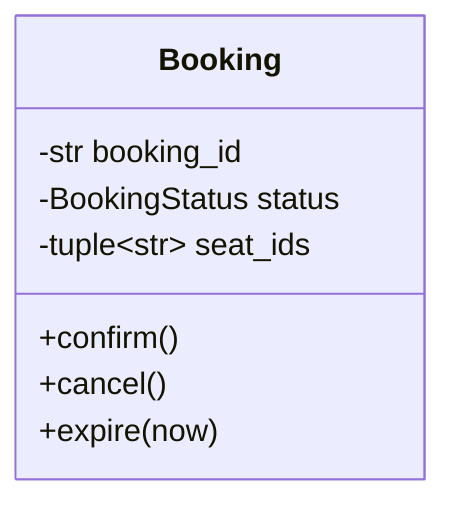

Mermaid's class-member type syntax is less expressive than Python. Optimize the
diagram for human meaning rather than exact parser-level signatures.

### 1.5 Relationship notation

#### Association

Use a solid line for a stable domain relationship:

```text
Booking "0..*" ----> "1" Show
```

Meaning: many bookings may refer to one show, and the booking side needs to
navigate toward the show in this view.

Mermaid:

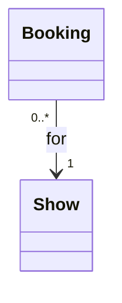

#### Dependency

Use a dashed arrow when one type temporarily uses another without owning a
stable reference/relationship:

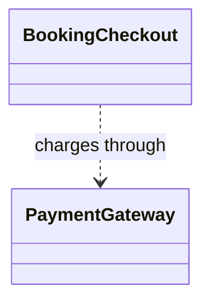

A method parameter, local variable, returned type, or construction dependency
may justify this weaker relationship. Do not use a solid association for every
method call.

#### Generalization

A solid line with hollow triangle means *is a subtype of*:

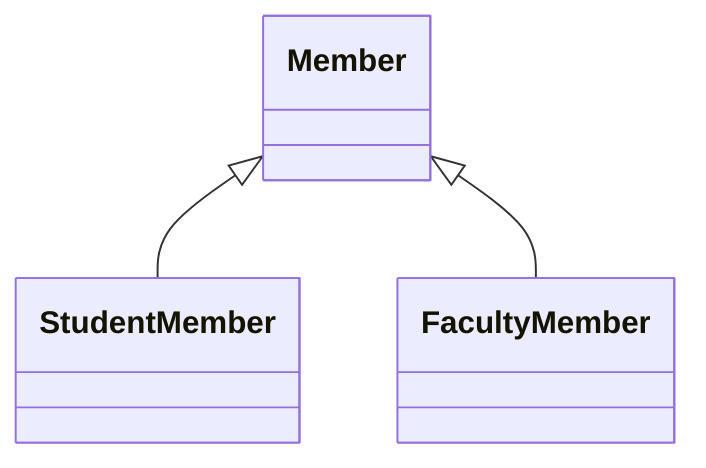

The triangle points to the general type. Use it only when the subtype preserves
the parent's contract and is meaningful in domain language.

#### Interface realization

Standard UML uses a dashed line with hollow triangle:

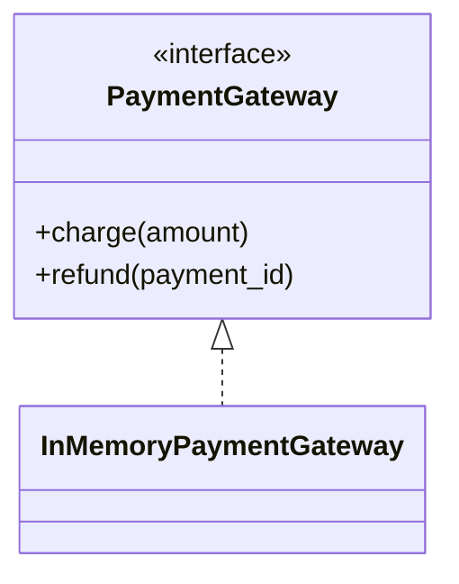

Some existing repository diagrams use generalization arrows for implementation
because they prioritize readability. During an interview, state whether the
relationship is inheritance or contract realization.

#### Aggregation

A hollow diamond at the whole means weak whole-part association:

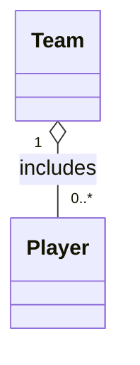

Players can exist independently and may change teams. Aggregation adds little
beyond a named association in many models, so use it sparingly.

#### Composition

A filled diamond at the whole means exclusive ownership and coupled lifetime:

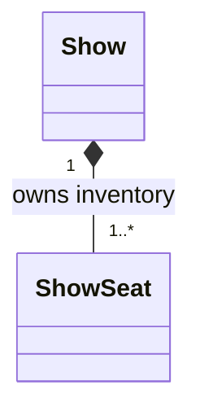

In this bounded model, a `ShowSeat` has no independent meaning outside its
show. Deleting the show would delete that contextual inventory.

A collection field alone does not prove composition. Ask:

- Is the part exclusively owned by one whole?
- Does the whole control creation/removal?
- Does the part's lifecycle depend on the whole?
- Can the part be reassigned or meaningfully exist alone?

When uncertain, use a plain association and explain lifecycle in words.

### 1.6 Multiplicity and role labels

Common multiplicities:

| Notation | Meaning |
|---|---|
| `1` | exactly one |
| `0..1` | optional, at most one |
| `*` or `0..*` | any number |
| `1..*` | one or more |
| `2..10` | bounded range |

Place multiplicity at both ends when it matters.

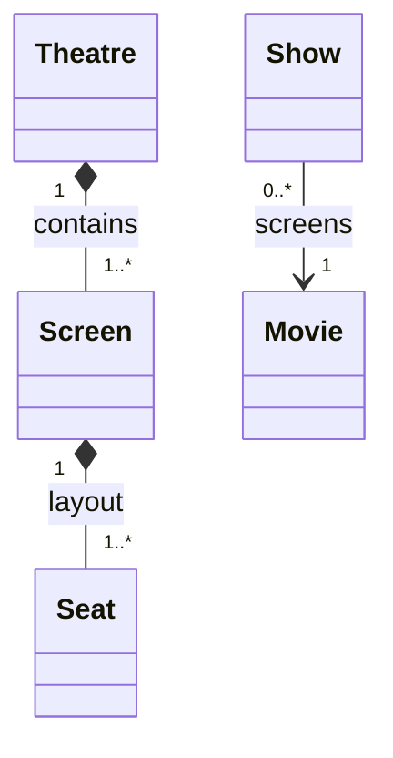

Read a line from both directions:

- one theatre contains one or more screens;
- one screen belongs to exactly one theatre;
- zero or more shows screen one movie;
- each show screens exactly one movie.

Use role labels when the line alone is ambiguous:

```text
Ride --> Location : pickup
Ride --> Location : dropoff
```

Without labels, two associations to the same class do not explain their roles.

Multiplicity describes the model, not current sample data. A demo with one
payment does not mean a booking has exactly one payment if retries are allowed.

### 1.7 Model a contextual relationship explicitly

A many-to-many relationship often owns its own state.

Incorrectly compressed:

```text
Show * -------- * Seat
```

This line cannot own availability, hold owner, expiry, or show-specific price.

Model the relationship as a class:

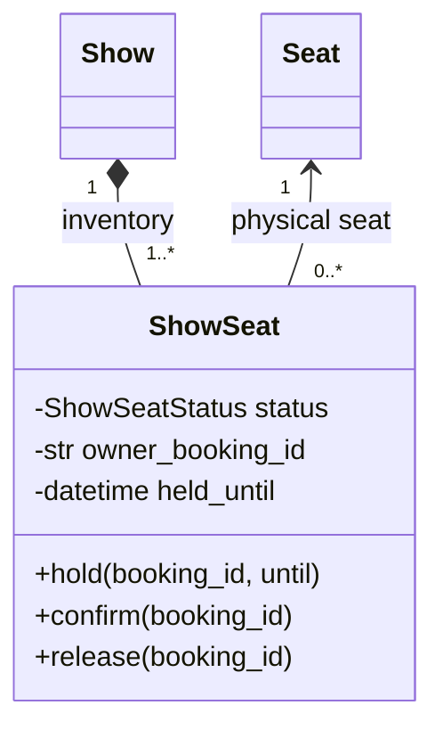

This is the visual equivalent of Topic 3's stable/contextual split. Use the
same technique for `Book`/`BookCopy`, `Course`/`CourseOffering`, and
`Product`/`InventoryItem`.

### 1.8 Show abstractions and replaceable behavior

A design-level class diagram should reveal important boundaries without
listing every implementation.

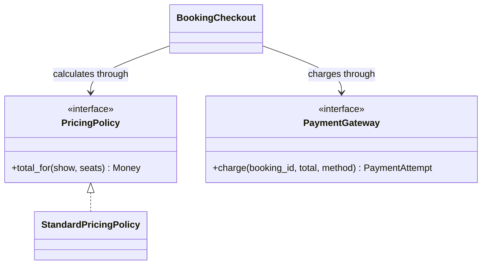

Show the abstraction when substitution is part of the current design. Do not
add interfaces to the diagram merely to make it look sophisticated.

### 1.9 Keep class diagrams readable

Use these limits for an interview diagram:

- 5-12 important classes in the main view;
- 1-5 important members per class;
- relationship labels for ambiguous edges;
- multiplicities on business-important relationships;
- a note for intentional omissions;
- separate views when catalog, booking, and payment become visually tangled.

Group concepts by responsibility:

```text
Catalog: Movie, Theatre, Screen, Seat, Show
Booking: ShowSeat, Booking, PaymentAttempt
Policies/boundaries: PricingPolicy, PaymentGateway, Clock
Coordinator: BookingCheckout
```

Do not solve crossing lines with more crossing lines. Rearrange, reverse the
page direction, or split the view.

### 1.10 Sequence diagram anatomy

A sequence diagram describes one scenario over time. Time flows from top to
bottom. Participants should be domain objects, coordinators, boundaries, or
actors that own meaningful messages.

Core elements:

| Element | Purpose |
|---|---|
| Actor | Human or external initiator |
| Participant/lifeline | Collaborator involved in the scenario |
| Synchronous message | Caller waits for result |
| Return message | Result/control returns |
| Self-message | Object invokes its own responsibility |
| Activation | Period participant is executing, when useful |
| `alt` | Mutually exclusive branches |
| `opt` | Optional behavior |
| `loop` | Repeated behavior |
| `par` | Logically parallel branches |
| Note | Important rule or omission |

Mermaid example:

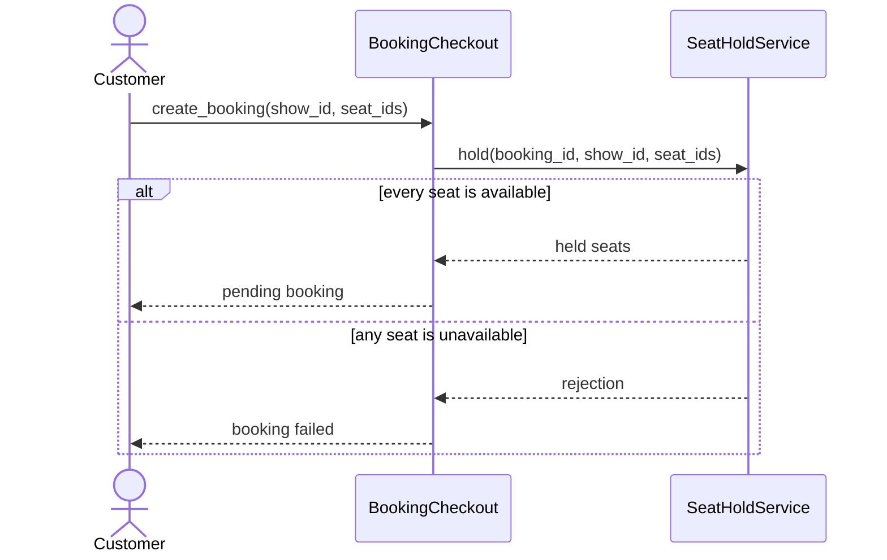

Messages should express intentions, not implementation trivia. Prefer
`hold_selected_seats()` over `iterate_array()` or `set_status_field()`.

### 1.11 Choose sequence participants by responsibility

Include a participant when it:

- owns a domain decision;
- protects state;
- represents a meaningful boundary;
- returns information that changes the scenario;
- helps explain failure ordering.

Usually omit:

- passive DTOs;
- every internal collection;
- logging unless audit behavior is required;
- framework controllers when the diagram focuses on domain collaboration;
- helpers that merely forward a call.

A useful layering vocabulary is:

```text
actor -> boundary/controller -> use-case coordinator -> domain/policy
      -> external boundary/store
```

This is guidance, not a mandatory architecture. The message path should match
the actual responsibility model.

### 1.12 Show alternatives and failures

The happy path rarely reveals the most important design decisions.

Use `alt` for mutually exclusive outcomes:

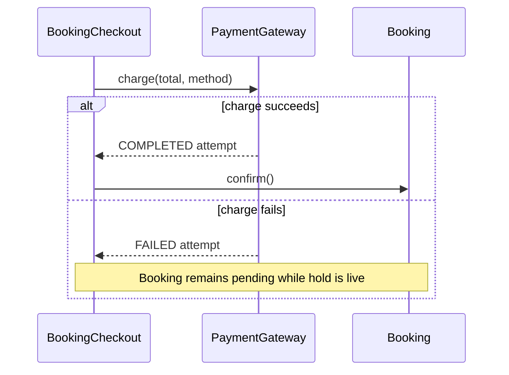

Use nested alternatives only when they materially affect ordering. Too many
nested frames are a signal to create separate scenario diagrams.

Failure diagrams should answer:

- Which checks happen before mutation?
- What state has changed when failure occurs?
- What is preserved for retry?
- Is compensation required?
- Which participant reports the failure?
- Does the public result match domain state?

### 1.13 Show loops, optional behavior, and creation

Use a loop for repeated collaboration:

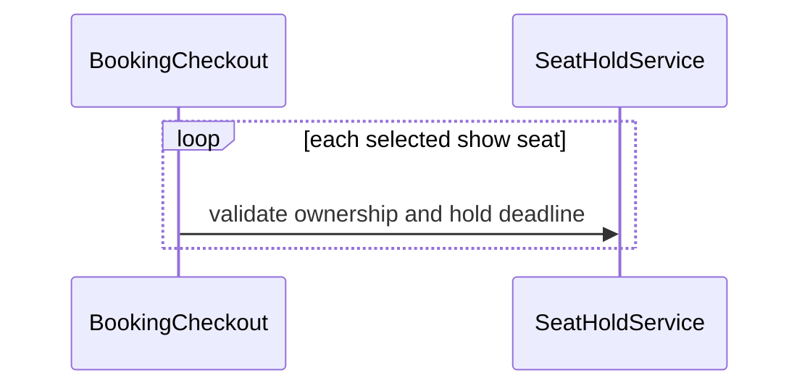

Do not show a loop when the boundary deliberately exposes one atomic
`hold_all()` operation; that would leak its internal implementation. Diagram at
the chosen abstraction level.

Use `opt` for independent optional behavior:

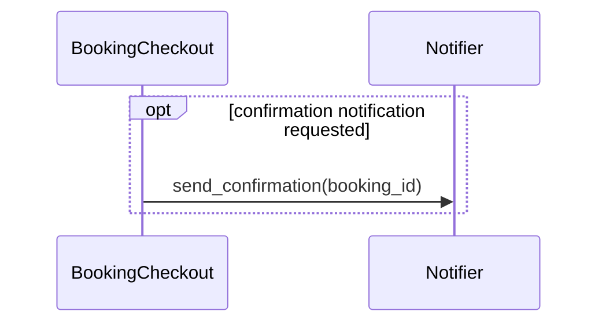

UML can show object creation with a create message. Mermaid supports explicit
participant creation in newer versions, but a portable diagram may use a
message such as `create pending Booking` and a note. Do not make tool-version
syntax more important than collaboration meaning.

### 1.14 Treat return arrows and activations as optional precision

Dashed return arrows improve clarity when the returned information affects a
later choice:

```text
PricingPolicy -->> Checkout: Money total
Gateway       -->> Checkout: PaymentAttempt
```

Omit obvious `None` returns. Do not add one return arrow for every call merely
for symmetry.

Activations can show nested control:

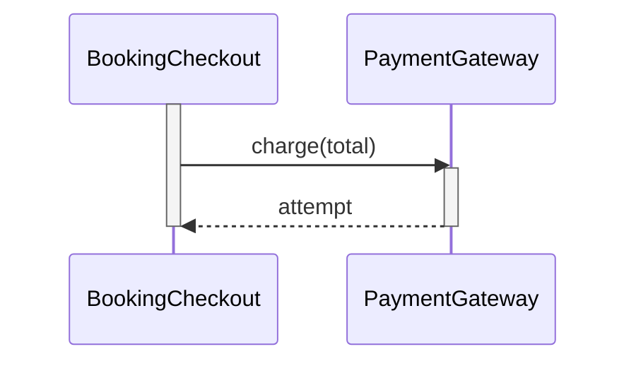

They are useful in detailed reviews but usually unnecessary in a quick
interview sketch.

### 1.15 State-machine diagram anatomy

A state machine models the lifecycle of one stateful concept. It is appropriate
when behavior depends on the current state and illegal transitions matter.

A transition has the conceptual form:

```text
source -- event [guard] / action --> target
```

Example:

```text
PENDING -- confirm [payment succeeded] / book seats --> CONFIRMED
```

Elements:

| Element | Meaning |
|---|---|
| Initial pseudostate | Where lifecycle begins |
| State | Stable phase in which events may be handled |
| Transition | Legal movement from source to target |
| Event/trigger | What requests or causes the transition |
| Guard | Boolean condition required for transition |
| Action/effect | Work performed as part of transition |
| Final pseudostate | Lifecycle ends |

Mermaid:

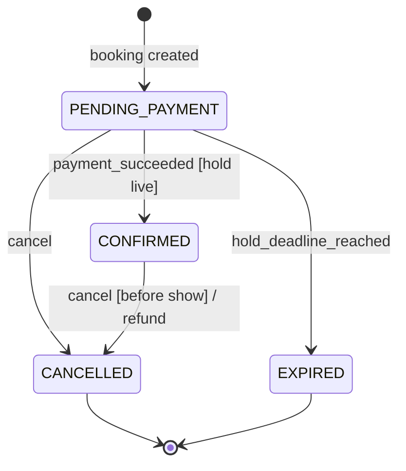

Mermaid renders the label as text; it does not formally parse guard/action
semantics. Retain standard `event [guard] / action` meaning in your narration.

### 1.16 Distinguish state from data and activity

A state is a meaningful phase that changes allowed behavior.

Good states:

- `PENDING_PAYMENT`;
- `CONFIRMED`;
- `CANCELLED`;
- `EXPIRED`.

Usually not states:

- `amount = 500`;
- `seat_count = 2`;
- `user_clicked_button`;
- `validate card`;
- `calculate price`.

The last two are activities or actions. A verb can name a state only if it
represents a durable phase such as `PROCESSING_PAYMENT`, where the system may
remain and handle events.

Do not make every enum a state machine. `SeatType.REGULAR/PREMIUM/RECLINER` is a
classification, not a lifecycle.

### 1.17 Make state transitions complete

Review a state machine with an event/state table:

| Current state | Event | Guard | Next state | Effect/result |
|---|---|---|---|---|
| Pending | payment success | hold live | Confirmed | seats become booked |
| Pending | payment failure | hold live | Pending | append failed attempt |
| Pending | deadline | now >= expiry | Expired | release held seats |
| Pending | cancel | before show | Cancelled | release held seats |
| Confirmed | cancel | before show | Cancelled | refund, release seats |
| Cancelled | confirm | none | rejected | no state change |
| Expired | pay | none | rejected | no state change |

This table exposes events that do not transition, self-transitions, and missing
error behavior more reliably than a pretty picture alone.

Questions:

- Does every public command have behavior in every relevant state?
- Are terminal states actually terminal?
- Is retry a self-transition or simply an event with no state change?
- Is the guard explicit?
- Does an action update another lifecycle that needs its own diagram?
- Are two states indistinguishable in allowed behavior? If so, merge them.

### 1.18 Use composite states only when they reduce complexity

A state may contain substates, such as a broad `ACTIVE` booking phase containing
`PENDING_PAYMENT` and `CONFIRMED`. History pseudostates and orthogonal regions
can express sophisticated behavior.

For most interview LLDs, explicit flat states are easier to implement and test.
Use composite states only when:

- several substates share transitions;
- parallel lifecycle regions genuinely exist;
- the flat diagram becomes repetitive and ambiguous;
- you can explain the implementation mapping.

Do not hide complexity inside nested states simply to demonstrate UML
knowledge.

### 1.19 Activity-style workflow diagrams

An activity diagram emphasizes flow of control/data rather than messages
between objects. Use it for:

- a business workflow with several decisions;
- validation stages;
- parallel branches and a later join;
- a process understandable before class responsibilities are assigned;
- operational or actor handoffs.

Core concepts:

| Activity element | Meaning |
|---|---|
| Initial/final node | Workflow start/end |
| Action | Unit of work |
| Decision | One incoming flow, guarded alternatives |
| Merge | Alternative paths rejoin |
| Fork | One flow begins parallel work |
| Join | Parallel work synchronizes |
| Swimlane | Responsibility/actor partition |
| Object flow | Data moves between actions |

Mermaid has no full UML activity-diagram syntax, so this repository uses a
flowchart to express an activity-style view:

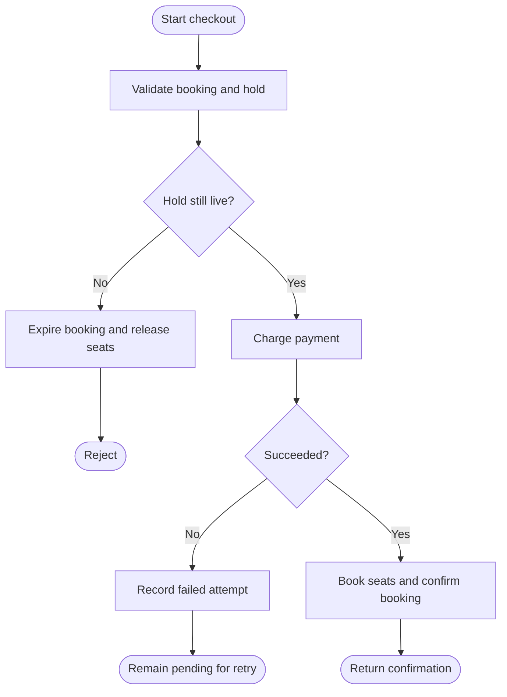

The sequence diagram answers *who sends each message*. The activity view answers
*how control branches*. Do not draw both unless each adds useful information.

### 1.20 Show parallelism carefully

Activity fork/join or a sequence `par` frame says actions may proceed
concurrently or independently. It is a semantic claim, not a layout shortcut.

Example after a durable confirmation:

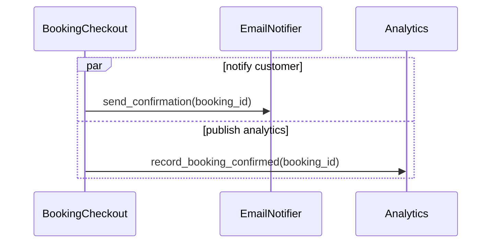

Before drawing this, decide:

- Must either side effect succeed for booking confirmation to succeed?
- Can each retry independently?
- What ordering or consistency is guaranteed?
- Is parallel execution a requirement or merely a possible implementation?

Detailed concurrency design belongs to Topic 11. Topic 4 requires the diagram
not to imply guarantees accidentally.

### 1.21 Use object diagrams as concrete snapshots

An object diagram shows instances and links at one moment. It is a powerful
model-validation tool even when drawn as simple text.

```text
screenS1:Screen
  |
  +-- seatA1:Seat {type=REGULAR}

show3pm:Show -- show3pmA1:ShowSeat {status=BOOKED, owner=B10}
                         |
                         +-- seatA1

show7pm:Show -- show7pmA1:ShowSeat {status=AVAILABLE}
                         |
                         +-- seatA1
```

This snapshot proves:

- one physical A1 instance participates in several contextual objects;
- each `ShowSeat` belongs to exactly one show;
- availability differs by show without contradiction;
- the class-diagram multiplicities are plausible.

Use snapshots to challenge:

- many-to-many relationships;
- optional links;
- shared versus exclusive parts;
- ownership after cancellation;
- derived and authoritative state.

### 1.22 Use a package/dependency view sparingly

When module direction is the question, a small package diagram can prevent
circular dependencies:

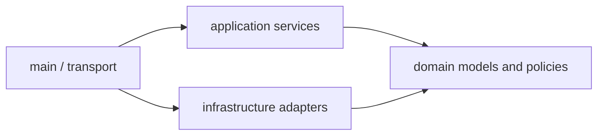

This says high-level application/domain contracts should not import a concrete
payment SDK. It does not describe runtime call order.

Use a sequence diagram for runtime collaboration and a package view for source
dependency. Mixing those arrows creates confusion.

### 1.23 Maintain cross-diagram consistency

All diagrams are projections of one model. Their names and claims must agree.

Consistency checks:

- Every sequence participant exists in the class model or is clearly an actor/
  external system.
- Every message maps to an owned operation or stated responsibility.
- Every state transition invoked by a sequence exists in the state machine.
- Multiplicities agree with workflow behavior.
- A sequence does not mutate a field marked private without calling its owner.
- Activity decisions match sequence alternatives.
- Composition does not contradict independent lifecycle in an object snapshot.
- Terminology matches the requirements glossary and code.
- Failure results match the state left behind.

Trace one scenario vertically:

```text
Requirement: successful payment confirms a live booking
    -> class: Booking owns confirm(); Gateway owns charge()
    -> sequence: charge succeeds before confirm()
    -> state: PENDING_PAYMENT -> CONFIRMED [hold live]
    -> code: guarded Booking.confirm()
    -> test: successful payment confirms exactly once
```

A contradiction is a design defect, not a documentation-only problem.

### 1.24 Use a diagram-first interview workflow

For a 45-60 minute LLD interview:

1. **Requirements, 5-8 minutes:** scope, actors, use cases, invariants.
2. **Domain model, 8-12 minutes:** vocabulary, classes, ownership,
   relationships, multiplicities.
3. **Critical sequence, 5-8 minutes:** main success and one important failure.
4. **Lifecycle, 3-5 minutes:** state machine for the riskiest object.
5. **Implementation, remaining time:** code the core behavior and tests.
6. **Adaptation, final review:** apply the interviewer change to model and code.

Adjust based on the interview format. Do not spend twenty minutes making a
perfect diagram when runnable code is expected.

Narrate decisions while drawing:

```text
"Seat is physical layout state. ShowSeat owns availability per performance, so
the show composes its inventory. Booking stores selected seat IDs, while the
hold service coordinates the all-or-none rule. I will show payment failure in a
sequence because operation ordering matters."
```

### 1.25 Keep diagrams maintainable

Treat text diagrams like code:

- keep one reason/scope per diagram;
- place the title and assumptions beside it;
- prefer stable domain names;
- review diagram changes with code changes;
- delete obsolete diagrams;
- render Mermaid after editing when tooling permits;
- keep source text readable even without rendering;
- avoid colors/styles that carry essential meaning alone.

Diagrams that no longer match implementation are worse than no diagrams
because they create false confidence.

## 2. Recognize

### 2.1 Requirement signals

| Signal | Diagram/view to consider |
|---|---|
| "contains", "belongs to", "many", "optional" | Class diagram with multiplicity |
| "uses", "delegates", "implements" | Dependency/realization in class view |
| "first...then...only after" | Sequence diagram |
| "if payment fails" | `alt` fragment or activity decision |
| "for each selected item" | Loop fragment |
| "may happen independently" | `par`/fork only if semantically valid |
| "pending/confirmed/cancelled" | State machine |
| "only from", "cannot after" | State transition/guard |
| "same seat in two shows" | Object snapshot/contextual class |
| "module must not depend on provider" | Package/dependency view |
| "overall approval process" | Activity diagram |

### 2.2 Choose one view, not every view

Use this decision sequence:

1. Is the question about static vocabulary and relationships? Draw a class
   view.
2. Is order between collaborators the risk? Draw a sequence.
3. Is legal next behavior determined by current phase? Draw a state machine.
4. Is responsibility less important than branching process? Draw an activity
   view.
5. Is the abstract relationship still doubtful? Draw one object snapshot.
6. Is source dependency the issue? Draw a package/dependency view.

### 2.3 Warning signals in diagrams

- A class diagram contains every class, field, and method in the repository.
- Lines have no multiplicities or labels where meaning is ambiguous.
- Hollow/filled diamonds are used because one class has a list field.
- Inheritance arrows point in the wrong direction.
- Interface implementation is shown as ordinary whole-part ownership.
- Sequence messages are named `process()`, `handle()`, and `update()` without
  domain meaning.
- A sequence shows only the happy path despite important failure requirements.
- A service assigns another object's private status field.
- An activity diagram is used where participant ownership is the main question.
- A state machine contains actions such as `validate` as if they were states.
- A state has no entering or outgoing transition explanation.
- A cancelled/expired state still reaches confirmation without rejection.
- Parallel notation is used only to save vertical space.
- Diagram names disagree with code and requirements.
- The diagram is unreadable without verbal corrections from its author.

### 2.4 Questions to ask while reviewing

1. What exact question does this diagram answer?
2. What perspective and scope does it use?
3. Which detail is intentionally omitted?
4. Can every relationship be read in both directions?
5. Are multiplicities domain rules or accidental sample counts?
6. Does a diamond make a lifecycle claim we can defend?
7. Does every message have an owner?
8. Does the failure branch preserve valid state?
9. Does every sequence transition exist in the state machine?
10. Can a concrete object snapshot satisfy the class diagram?
11. What changes in this diagram for the next requirement?
12. Could the same meaning be communicated with fewer elements?

## 3. Model

### 3.1 Running example inputs

Reuse Topic 3's bounded Movie Ticket Booking model:

- a physical `Seat` has stable layout metadata;
- `ShowSeat` owns per-show availability, hold owner, and expiry;
- `Booking` owns selected seat IDs and its lifecycle;
- `PaymentAttempt` preserves retry history;
- `SeatHoldService` coordinates all-or-none seat transitions;
- `PricingPolicy` calculates a total;
- `PaymentGateway` and `Clock` are external boundaries;
- `BookingCheckout` sequences the use case.

The primary risks are contextual state, multi-seat ownership, payment ordering,
expiry, and legal lifecycle transitions. Those risks determine the diagrams.

### 3.2 Core domain class diagram

Perspective: design-level. Repository/storage details and UI DTOs are omitted.
Associations to catalog objects may be implemented with IDs.

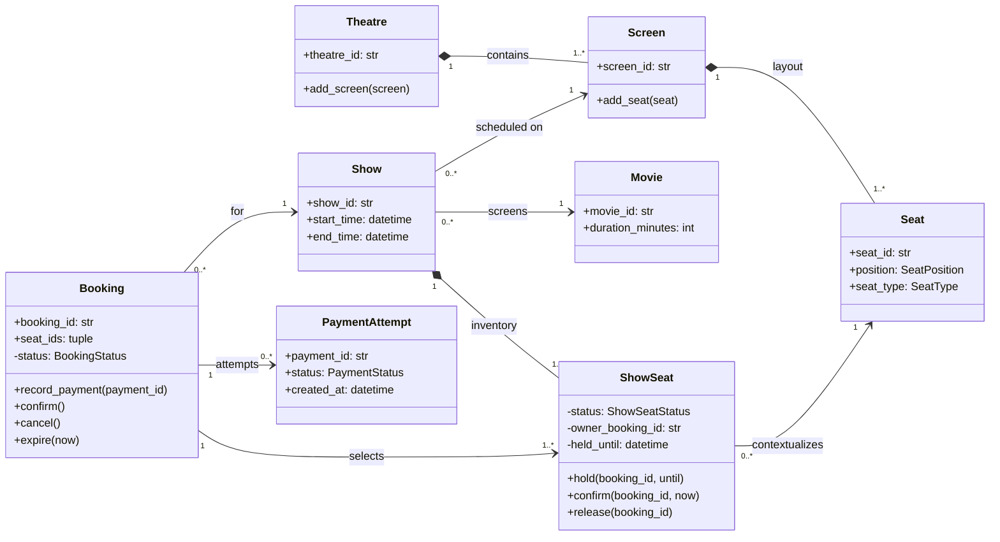

Important readings:

- theatre/screen and screen/seat are compositions only under the bounded
  assumption that their layout parts have exclusive coupled lifecycles;
- show/show-seat is strong composition because contextual inventory exists only
  for that show;
- many show seats may contextualize the same physical seat across shows;
- a booking selects one or more show seats from exactly one show;
- payment multiplicity permits retry history;
- user association is omitted here to keep the risk-focused view small.

### 3.3 Collaboration and boundary class diagram

Perspective: design-level collaboration. Domain catalog detail is collapsed.

```mermaid
classDiagram
    direction LR

    class BookingCheckout {
        +create_booking(user_id, show_id, seat_ids) Booking
        +confirm_booking(booking_id, method) PaymentAttempt
        +cancel_booking(booking_id) Booking
    }
    class SeatHoldService {
        +hold(booking_id, show_id, seat_ids, now, until)
        +confirm_for(booking, now)
        +release_for(booking)
    }
    class PricingPolicy {
        <<interface>>
        +total_for(show, seats) Money
    }
    class PaymentGateway {
        <<interface>>
        +charge(booking_id, total, method) PaymentAttempt
        +refund(payment_id)
    }
    class Clock {
        <<interface>>
        +now() datetime
    }
    class Booking
    class ShowSeat

    BookingCheckout --> SeatHoldService : coordinates holds
    BookingCheckout --> PricingPolicy : calculates through
    BookingCheckout --> PaymentGateway : charges through
    BookingCheckout --> Clock : reads time
    BookingCheckout --> Booking : orchestrates
    SeatHoldService --> ShowSeat : protects selection
```

This view answers dependency and responsibility questions. It does not repeat
the full theatre catalog.

### 3.4 Create-booking sequence

Scenario: all selected seats are held as one unit, or the request fails without
a new partial hold.

```mermaid
sequenceDiagram
    actor Customer
    participant Checkout as BookingCheckout
    participant Catalog
    participant Clock
    participant Pricing as PricingPolicy
    participant Holds as SeatHoldService
    participant Bookings as BookingRegistry

    Customer->>Checkout: create_booking(user_id, show_id, seat_ids)
    Checkout->>Catalog: resolve user, show, and selected seats
    Catalog-->>Checkout: domain objects
    Checkout->>Clock: now()
    Clock-->>Checkout: now
    Checkout->>Pricing: total_for(show, selected seats)
    Pricing-->>Checkout: exact total
    Checkout->>Checkout: create valid PENDING booking
    Checkout->>Holds: hold_all(booking, now, deadline)
    alt every show seat is available
        Holds-->>Checkout: selection held by booking
        Checkout->>Bookings: add(booking)
        Checkout-->>Customer: pending booking
    else unknown, duplicate, held, or booked seat
        Holds-->>Checkout: rejection, no new hold
        Checkout-->>Customer: booking failed
    end
```

Design observations:

- one clock value makes time decisions consistent within the use case;
- pricing is calculated before state mutation;
- `hold_all` expresses the boundary rather than leaking a public per-seat loop;
- the failure branch states the postcondition;
- registration/hold atomicity still needs a transaction decision in later
  topics if either can fail independently.

### 3.5 Confirm-booking sequence

Scenario: a live pending booking may retry payment; successful payment confirms
the seats and booking.

```mermaid
sequenceDiagram
    actor Customer
    participant Checkout as BookingCheckout
    participant Bookings as BookingRegistry
    participant Clock
    participant Holds as SeatHoldService
    participant Gateway as PaymentGateway
    participant Payments as PaymentRegistry
    participant Booking

    Customer->>Checkout: confirm_booking(booking_id, method)
    Checkout->>Bookings: get(booking_id)
    Bookings-->>Checkout: Booking
    Checkout->>Booking: ensure_pending()
    Checkout->>Clock: now()
    Clock-->>Checkout: now
    Checkout->>Holds: ensure_live_and_owned(booking, now)

    alt hold expired or ownership lost
        Holds-->>Checkout: rejection
        Checkout->>Holds: release_for(booking)
        Checkout->>Booking: expire(now)
        Checkout-->>Customer: booking expired
    else hold valid
        Checkout->>Gateway: charge(booking_id, total, method)
        Gateway-->>Checkout: PaymentAttempt
        Checkout->>Payments: add(attempt)
        Checkout->>Booking: record_payment(attempt.payment_id)
        alt payment failed
            Checkout-->>Customer: failed attempt, booking remains pending
        else payment succeeded
            Checkout->>Holds: confirm_for(booking, now)
            Checkout->>Booking: confirm()
            Checkout-->>Customer: confirmed booking
        end
    end
```

The diagram makes ordering review possible. It also exposes a question for
Topics 10-12: what happens if payment succeeds but seat/booking confirmation
cannot be persisted? Topic 4 should reveal the question without pretending to
solve it.

### 3.6 Booking state machine

```mermaid
stateDiagram-v2
    [*] --> PENDING_PAYMENT: booking and holds created
    PENDING_PAYMENT --> PENDING_PAYMENT: payment_failed [hold live] / record attempt
    PENDING_PAYMENT --> CONFIRMED: payment_succeeded [hold live] / book seats
    PENDING_PAYMENT --> CANCELLED: cancel [before show] / release holds
    PENDING_PAYMENT --> EXPIRED: deadline_reached / release holds
    CONFIRMED --> CONFIRMED: confirm_again / return existing success
    CONFIRMED --> CANCELLED: cancel [before show] / refund and release seats
    CANCELLED --> [*]
    EXPIRED --> [*]
```

The self-transitions document two deliberate decisions:

- a failed payment records history but leaves a live booking pending;
- repeated confirmation is idempotent and returns the existing success.

Commands such as `pay` from `CANCELLED` or `EXPIRED` are rejected and need not
be drawn as transitions; the event/state table and tests should list them.

### 3.7 Show-seat state machine

```mermaid
stateDiagram-v2
    [*] --> AVAILABLE: show inventory created
    AVAILABLE --> HELD: hold(booking, deadline)
    HELD --> BOOKED: confirm(owner) [before deadline]
    HELD --> AVAILABLE: release(owner)
    HELD --> AVAILABLE: deadline_reached
    BOOKED --> AVAILABLE: eligible_cancel(owner)
```

Invariant notes:

- `AVAILABLE` has no owner and no deadline;
- `HELD` has one owner and a future deadline;
- `BOOKED` retains the booking owner but no hold deadline;
- a non-owner cannot cause any transition;
- availability after cancellation is allowed only by the bounded requirement.

The booking and show-seat state machines are separate because they model
different concepts. Their transitions must still be coordinated by the use-case
sequence.

### 3.8 Checkout activity view

Use this only when a stakeholder needs control flow more than participant
ownership.

```mermaid
flowchart TD
    Start([Confirmation requested]) --> Resolve[Resolve booking]
    Resolve --> Pending{Pending payment?}
    Pending -- No --> Existing{Already confirmed?}
    Existing -- Yes --> ReturnExisting([Return existing success])
    Existing -- No --> RejectState([Reject current state])
    Pending -- Yes --> Live{Hold live and owned?}
    Live -- No --> Expire[Release holds and expire booking]
    Expire --> RejectExpired([Return expired result])
    Live -- Yes --> Charge[Charge payment method]
    Charge --> Success{Charge succeeded?}
    Success -- No --> RecordFailure[Record failed attempt]
    RecordFailure --> Retry([Remain pending for retry])
    Success -- Yes --> RecordSuccess[Record completed attempt]
    RecordSuccess --> Confirm[Book seats and confirm booking]
    Confirm --> Done([Return confirmation])
```

Compare with the sequence:

- this activity view makes branching compact;
- the sequence names the collaborator responsible for every step;
- drawing both is justified here for teaching, but one may be enough in an
  interview.

### 3.9 Object snapshot: independent seat inventory

```text
theatre1:Theatre
  `-- screen1:Screen
        `-- a1:Seat {position=A1, type=REGULAR}

show3pm:Show {movie=M1}
  `-- show3pmA1:ShowSeat {seat=a1, status=BOOKED, owner=B10}

show7pm:Show {movie=M1}
  `-- show7pmA1:ShowSeat {seat=a1, status=AVAILABLE}

b10:Booking {show=show3pm, seats=[A1], status=CONFIRMED}
```

Audit against the class diagram:

- one screen composes A1;
- each show composes its own contextual A1;
- both contextual objects reference the same physical seat;
- only the 3 PM contextual object is selected by B10;
- no global `Seat.is_booked` fact exists.

### 3.10 Cross-diagram traceability table

| Rule | Class view | Sequence view | State view | Required test |
|---|---|---|---|---|
| Availability is per show | `Show` composes `ShowSeat` | Hold resolves show inventory | ShowSeat lifecycle | Same A1 independent across shows |
| One owner holds a seat | ShowSeat owner field/methods | Holds verifies owner | HELD transitions require owner | Wrong owner rejected |
| Selection is all-or-none | SeatHoldService responsibility | `hold_all` branch | No partial group state | Later unavailable seat leaves earlier available |
| Failed payment is retryable | Booking has attempts | Failure returns pending | Pending self-transition | Fail then succeed before expiry |
| Expired booking cannot confirm | Booking/hold guards | Expiry alternative | Pending -> Expired | Pay at/after deadline rejected |
| Confirmation is idempotent | Booking confirm contract | Existing success branch | Confirmed self-transition | Repeat returns same success |

If a row cannot be traced, the design or documentation is incomplete.

## 4. Implement from diagrams

Diagrams are implementation inputs, not a substitute for code.

### 4.1 Translate class boxes into responsibility skeletons

From:

```text
Booking
- status
+ confirm()
+ cancel()
+ expire(now)
```

Create behavior-protecting code:

```python
from dataclasses import dataclass, field
from datetime import datetime
from enum import Enum, auto


class BookingStatus(Enum):
    PENDING_PAYMENT = auto()
    CONFIRMED = auto()
    CANCELLED = auto()
    EXPIRED = auto()


@dataclass(eq=False)
class Booking:
    booking_id: str
    hold_expires_at: datetime
    _status: BookingStatus = field(
        default=BookingStatus.PENDING_PAYMENT,
        init=False,
        repr=False,
    )

    @property
    def status(self) -> BookingStatus:
        return self._status

    def confirm(self) -> None:
        if self._status is BookingStatus.CONFIRMED:
            return
        if self._status is not BookingStatus.PENDING_PAYMENT:
            raise ValueError("Only a pending booking can be confirmed")
        self._status = BookingStatus.CONFIRMED

    def cancel(self) -> None:
        if self._status not in {
            BookingStatus.PENDING_PAYMENT,
            BookingStatus.CONFIRMED,
        }:
            raise ValueError("Booking cannot be cancelled")
        self._status = BookingStatus.CANCELLED

    def expire(self, now: datetime) -> None:
        if self._status is not BookingStatus.PENDING_PAYMENT:
            raise ValueError("Only a pending booking can expire")
        if now < self.hold_expires_at:
            raise ValueError("Booking hold is still live")
        self._status = BookingStatus.EXPIRED
```

The private field and guarded operations implement the state diagram. Generated
field-wise equality is disabled because this is an entity.

### 4.2 Translate multiplicity into collection and validation choices

Class-diagram claim:

```text
Booking "1" --> "1..*" ShowSeat
```

Implementation consequences:

```python
@dataclass(frozen=True)
class SeatSelection:
    seat_ids: tuple[str, ...]

    def __post_init__(self) -> None:
        if not self.seat_ids:
            raise ValueError("Select at least one seat")
        if len(set(self.seat_ids)) != len(self.seat_ids):
            raise ValueError("Seat selection must be unique")
```

The type and constructor protect `1..*`; a raw mutable list with no validation
would not implement the diagram's claim.

### 4.3 Translate realization into a narrow Python contract

Design diagram:

```text
BookingCheckout --> PaymentGateway
PaymentGateway <|.. FakePaymentGateway
```

Python:

```python
from typing import Protocol


class PaymentGateway(Protocol):
    def charge(self, booking_id: str, amount: int) -> bool:
        ...


class FakePaymentGateway:
    def __init__(self, succeeds: bool = True) -> None:
        self.succeeds = succeeds
        self.calls: list[tuple[str, int]] = []

    def charge(self, booking_id: str, amount: int) -> bool:
        self.calls.append((booking_id, amount))
        return self.succeeds
```

The interface contains what checkout needs, not every provider SDK operation.

### 4.4 Translate a sequence into coordinator ordering

Sequence claim:

```text
validate live hold -> charge -> record attempt -> confirm seats -> confirm booking
```

Implementation skeleton:

```python
def confirm_booking(self, booking_id: str, method: PaymentMethod) -> Booking:
    booking = self._bookings.get(booking_id)
    booking.ensure_pending()
    now = self._clock.now()
    self._holds.ensure_live_and_owned(booking, now)

    attempt = self._gateway.charge(booking.booking_id, booking.total, method)
    self._payments.add(attempt)
    booking.record_payment(attempt.payment_id)

    if attempt.failed:
        return booking

    self._holds.confirm_for(booking, now)
    booking.confirm()
    return booking
```

This focused excerpt relies on types from the surrounding design. Its purpose
is to preserve the message order. If implementation calls `booking.confirm()`
before charging, either the code or diagram is wrong.

### 4.5 Translate state tables into parameterized tests

```python
def test_terminal_booking_states_reject_confirmation(self) -> None:
    for terminal_status in (BookingStatus.CANCELLED, BookingStatus.EXPIRED):
        with self.subTest(status=terminal_status):
            booking = make_booking_in(terminal_status)

            with self.assertRaises(ValueError):
                booking.confirm()

            self.assertIs(terminal_status, booking.status)
```

Every legal transition needs a positive test; every business-important illegal
transition needs a negative test. The state/event table is an effective test
inventory.

### 4.6 Keep implementation feedback bidirectional

Code may reveal a missing concept:

- repeated arguments suggest a value object;
- repeated status branches suggest a missing lifecycle operation;
- a coordinator needs information not shown in the model;
- a failure requires compensation not shown in the sequence;
- persistence requires an identity or boundary not yet represented.

When this happens:

1. confirm it is a domain/design issue rather than local syntax;
2. update the responsibility model;
3. update the smallest affected diagrams;
4. update code and tests;
5. re-run cross-diagram consistency checks.

Do not preserve a knowingly false diagram because it was drawn first.

## 5. Test the diagrams

### 5.1 Class-diagram audit

- [ ] The diagram states its scope and perspective.
- [ ] Every class has a current responsibility.
- [ ] Important entity identities and value roles are distinguishable.
- [ ] Important fields/methods reveal behavior ownership.
- [ ] Multiplicities express domain constraints.
- [ ] Relationship labels disambiguate roles.
- [ ] Navigability matches required use cases.
- [ ] Association and dependency are not confused.
- [ ] Generalization/realization arrows point to the general contract.
- [ ] Aggregation/composition lifecycle claims are defensible.
- [ ] Contextual relationships with state are explicit classes.
- [ ] The main view is readable without showing every implementation detail.

### 5.2 Sequence-diagram audit

- [ ] The title names one scenario.
- [ ] Time/order flows clearly from top to bottom.
- [ ] Every participant has a meaningful role.
- [ ] Messages use domain intentions.
- [ ] The coordinator delegates protected behavior to owners.
- [ ] Returned facts are shown when they affect decisions.
- [ ] Important alternate/failure paths are present.
- [ ] Loops and parallel frames make true semantic claims.
- [ ] Checks occur before risky mutations where required.
- [ ] Failure postconditions are stated.
- [ ] External calls and their ordering are visible.
- [ ] The final response agrees with final domain state.

### 5.3 State-machine audit

- [ ] The machine models exactly one lifecycle concept.
- [ ] Initial and terminal states are clear.
- [ ] States are phases, not actions or arbitrary values.
- [ ] Transitions name triggers.
- [ ] Important guards and effects are stated.
- [ ] All allowed transitions are present.
- [ ] Invalid events have defined rejection/no-change behavior.
- [ ] Retry/idempotency behavior is explicit.
- [ ] No contradictory state combination is possible.
- [ ] Transition names map to domain operations and tests.

### 5.4 Activity-diagram audit

- [ ] The process question justifies an activity view.
- [ ] Start and end outcomes are unambiguous.
- [ ] Decisions have complete, mutually understandable branches.
- [ ] Alternative branches merge correctly when needed.
- [ ] Fork/join semantics are intentional.
- [ ] Actions are phrased as work, not unexplained status labels.
- [ ] Responsibility lanes are added only when ownership matters.
- [ ] The flow agrees with corresponding sequence/state behavior.

### 5.5 Cross-view consistency test

Perform this manually for every critical use case:

1. Select one requirement and acceptance scenario.
2. Locate its state owner in the class diagram.
3. Trace its messages in the sequence diagram.
4. Locate every lifecycle move in the state machine.
5. Compare decision branches with the activity view, if present.
6. Locate the implementation method.
7. Locate the normal and failure tests.

Record any missing or contradictory link as a design defect.

### 5.6 Rendering and source checks

For Mermaid documents:

- every ` ```mermaid ` fence closes;
- the first line names a supported diagram type;
- participant/class/state names are stable and readable;
- identifiers do not rely on ambiguous punctuation;
- relationship direction is visually checked after rendering;
- labels do not contain syntax that changes parsing unexpectedly;
- source remains understandable if rendering is unavailable.

Syntax success does not prove semantic correctness. Rendering is the equivalent
of compilation; the audits are the tests.

## 6. Adapt

### Adaptation A: multiple payment retries

Diagram impact:

- class multiplicity changes or remains `Booking 1 -> 0..* PaymentAttempt`;
- confirmation sequence records every attempt before branching;
- booking state machine adds a pending self-transition for failed payment;
- object snapshot can show two attempts with different methods/outcomes;
- tests verify history is preserved.

If the original diagram said exactly one payment, the change reveals an
incorrect multiplicity or an originally narrower requirement.

### Adaptation B: idempotent confirmation

Diagram impact:

- state machine shows `CONFIRMED -> CONFIRMED` on repeated confirm or documents
  the event table result;
- sequence checks for existing completed payment before charging again;
- tests prove the gateway is called only once.

The change is not complete if only code receives an early return while diagrams
still imply a second charge.

### Adaptation C: waitlist promotion

Likely new views:

- class diagram adds `WaitlistEntry` and perhaps `SeatOffer` only after rules
  are clarified;
- a waitlist-entry state machine shows waiting, offered, accepted, expired, and
  cancelled phases;
- a promotion sequence shows availability event, ordering policy, offer expiry,
  and booking creation;
- avoid overloading the existing booking state machine if a waitlisted request
  owns no seats or payment lifecycle.

### Adaptation D: partial booking cancellation

Likely class impact:

- introduce `BookingItem`/`Ticket` with per-seat price snapshot and lifecycle;
- booking-to-item multiplicity becomes `1` to `1..*`;
- cancellation sequence operates on selected items and refund amount;
- booking state may need `PARTIALLY_CANCELLED` only if that state changes
  behavior; otherwise derive the summary from items;
- object snapshots verify mixed active/cancelled items.

### Adaptation E: production double-booking protection

Topic 4 should update the sequence boundary without pretending a local object
method alone is atomic:

```text
Checkout -> SeatInventory: conditional hold_all(selection, expected=AVAILABLE)
SeatInventory -> durable store: transaction/conditional update
```

Topic 11 chooses locking/concurrency behavior. Topic 12 chooses durable
transaction/persistence behavior. The class and sequence diagrams identify the
state and operation those mechanisms protect.

### Adaptation review

For every changed requirement, answer:

1. Which class responsibility changes?
2. Which relationship or multiplicity changes?
3. Which message or ordering changes?
4. Which lifecycle gains/removes a transition?
5. Which object snapshot proves the new state is possible?
6. Which old diagram remains unaffected, and why?
7. Which normal/failure tests change?

## Common mistakes

### Drawing before bounding requirements

An elegant diagram for the wrong scope is still wrong. Complete the Topic 1
brief and Topic 3 responsibility pass first.

### One giant diagram

A universal diagram mixes vocabulary, code signatures, runtime calls, storage,
and state. Split by question and perspective.

### Diagramming every field and getter

Noise hides responsibilities. Show only members needed to explain rules,
collaboration, or important public contracts.

### Missing multiplicities

Without cardinality, the diagram cannot distinguish one payment from retry
history or one selected seat from a non-empty collection.

### Accidental composition

A filled diamond claims exclusive whole-part ownership and coupled lifetime.
A list attribute alone does not justify it.

### Aggregation everywhere

Hollow diamonds rarely add value over a named association. Use them only when
weak whole-part semantics matter.

### Wrong inheritance direction

The hollow triangle points to the general type/interface, not the concrete
subtype.

### Confusing realization and inheritance

Implementing a contract is a dashed realization relationship in UML. Concrete
class inheritance is generalization. State the intended semantics even if a
tool uses simplified arrows.

### Treating IDs as absence of a relationship

`Booking.show_id` still represents a conceptual booking-to-show association.
The implementation uses an identifier to navigate across a boundary.

### Showing database foreign keys as the domain model

Schema relationships do not reveal behavior ownership, external boundaries, or
legal transitions. Keep conceptual/design and persistence views distinct.

### Sequence diagrams that only show the controller

`Actor -> System -> Database` hides domain responsibilities. Show the objects,
policies, and boundaries that make important decisions.

### Messages that edit another object's fields

`Service -> Booking: status = CONFIRMED` exposes an anemic model. Prefer
`Booking.confirm()` and display the guard in state/sequence views.

### Omitting failure branches

Payment failure, unavailable stock, expiry, cancellation, and hardware failure
often determine correct ordering. Include the risk-relevant alternative.

### Using state names for actions

`VALIDATE_PAYMENT` is an action unless the object genuinely remains in that
phase and handles events. States describe stable behavioral modes.

### Drawing every invalid state transition

A web of arrows to an `ERROR` state becomes unreadable. Show legal transitions
and maintain an event/state table for important rejections.

### Inventing an Error state

A rejected command often leaves the entity in its existing valid state. It does
not automatically transition to `ERROR`.

### Confusing activity and sequence diagrams

Activities emphasize control flow; sequences emphasize participant messages.
Choose based on the question.

### False parallelism

A `par` frame or fork means independence/concurrency is allowed. Do not use it
to compress the drawing.

### Inconsistent names across views

`Reservation`, `Booking`, and `Order` cannot silently name the same concept.
Use the glossary consistently or explain a translation boundary.

### Diagrams that contradict code

Update or delete stale diagrams. Rendering successfully does not make an
incorrect relationship true.

### Spending the interview on notation

Use the smallest standard subset, label uncertain semantics, and continue to
implementation. The model and reasoning matter more than artistic polish.

## Existing repository examples

Read the diagrams beside their code and tests; do not evaluate them as isolated
pictures.

### Movie Ticket Booking: contextual class structure

The [Movie Ticket Booking class diagram](../../solutions/movie-ticket-booking/README.md#8-class-relationships)
shows the key `Show` -> `ShowSeat` -> `Seat` distinction, payment-attempt
multiplicity, service collaborators, policies, gateways, and clock.

Review questions:

- Which hollow-diamond relationships would you retain, replace with plain
  associations, or strengthen to composition after a lifecycle discussion?
- Which arrows represent conceptual associations implemented by IDs?
- Would splitting catalog structure from checkout collaboration improve the
  view?

### Parking Lot: alternative success/failure ordering

- The [entry sequence](../../solutions/parking-lot/README.md#8-vehicle-entry-workflow)
  shows actor, coordinator, allocation policy, state owner, and returned ticket.
- The [exit sequence](../../solutions/parking-lot/README.md#9-vehicle-exit-workflow)
  shows payment success versus failure and deliberately keeps the ticket active
  and spot occupied when payment fails.

Trace those messages into
[`parking_lot.py`](../../solutions/parking-lot/services/parking_lot.py) and the
[tests](../../solutions/parking-lot/tests/test_parking_lot.py).

### ATM: structure, two lifecycles, and nested failure paths

- The [class view](../../solutions/atm/README.md#8-architecture-at-a-glance)
  separates ATM coordination, bank boundary, cash dispenser, selection policy,
  accounts, cards, and transaction records.
- The [session state machine](../../solutions/atm/README.md#9-atm-session-state-machine)
  models device interaction phases.
- The [transaction state machine](../../solutions/atm/README.md#11-transaction-lifecycle)
  separately models business outcomes.
- The [withdrawal sequence](../../solutions/atm/README.md#12-withdrawal-workflow)
  shows no-exact-cash, bank-decline, successful dispense, and hardware-failure
  compensation.

This is the strongest existing example of using different diagrams for
different questions.

### Splitwise: a loop in collaboration

The [expense sequence](../../solutions/splitwise/README.md#9-adding-an-expense-complete-workflow)
shows validation, strategy selection, cent-accurate split calculation, immutable
expense creation, and a loop updating each non-payer debt.

Review whether the loop is appropriate at the diagram's design level and which
ledger fact is authoritative versus derived.

### Library Management: state and behavior consistency

- The [borrowing sequence](../../solutions/library-management/README.md#10-borrowing-workflow)
  shows member checks, catalog lookup, copy selection, copy-state update, and
  loan creation.
- The [reservation state machine](../../solutions/library-management/README.md#12-reservation-state-machine)
  shows waiting, ready, completed, and cancelled phases.

Review critically: replace the sequence message `status = ISSUED; set borrower`
with a behavior such as `copy.issue_to(member)` in your refactoring, then check
that the class diagram and code expose that responsibility.

### Elevator: scheduler collaboration and request state

- The [class view](../../solutions/elevator/README.md#7-architecture-at-a-glance)
  shows replaceable scheduling policies.
- The [hall-request workflow](../../solutions/elevator/README.md#10-hall-request-workflow)
  uses an alternative for an available versus unavailable compatible car.
- The [request state machine](../../solutions/elevator/README.md#9-request-lifecycle)
  shows pending, assigned, and completed states.

Ask whether car motion/door lifecycle needs a separate state machine for a
deeper design and why it was reasonable to omit it from the current guide.

## Practice exercises

Complete the core exercises by hand or in Mermaid. Rendering is recommended,
but semantic scoring matters more than styling.

### Exercise 1 - Core: fixed diagram-selection gate

Choose exactly one best first view for each question:

`class`, `sequence`, `state`, `activity`, `object snapshot`, or `package`.

1. Show room-to-reservation multiplicity.
2. Explain payment, refund, and seat release ordering.
3. Prove a cancelled order cannot be shipped.
4. Explain a loan approval process with several business decisions.
5. Demonstrate A1 is booked at 3 PM and available at 7 PM.
6. Show that application code depends on a gateway contract, not an SDK.
7. Explain which object owns cart lines.
8. Explain nested cash-dispense and compensation calls.
9. List every legal elevator-request phase change.
10. Show two workers may run independently after confirmation.
11. Validate optional driver assignment on a requested ride.
12. Show module direction among UI, application, domain, and adapters.

Scoring key:

1. class;
2. sequence;
3. state;
4. activity;
5. object snapshot;
6. package;
7. class;
8. sequence;
9. state;
10. activity or sequence `par` - score sequence as the primary answer when
    participant collaboration is explicitly being reviewed;
11. object snapshot - class is acceptable only if the question is changed from
    validation of a concrete case to multiplicity definition;
12. package.

Score one point each. Questions 2, 3, 5, 6, 8, and 9 are critical.

### Exercise 2 - Core: relationship-notation gate

Choose the most precise primary relationship:

`association`, `dependency`, `generalization`, `realization`, `aggregation`, or
`composition`.

1. `StudentMember` is a substitutable subtype of `Member`.
2. `StripeGateway` implements `PaymentGateway`.
3. A `BookingCheckout` temporarily calls an injected `Clock`.
4. A `Show` exclusively owns per-show `ShowSeat` objects.
5. A `Team` groups players who can exist and transfer independently.
6. A `Booking` refers to exactly one `User` by ID.
7. A `Screen` exclusively owns seat positions in this bounded layout model.
8. A local formatter method receives `Money` as a parameter only.
9. A `Ride` links to pickup and drop-off `Location` values.
10. `ExactCashStrategy` fulfills `CashSelectionStrategy`.

Scoring key:

1. generalization;
2. realization;
3. dependency;
4. composition;
5. aggregation, though a named association is often sufficient;
6. association;
7. composition under the stated lifecycle assumption;
8. dependency;
9. association with two role labels;
10. realization.

Score one point each. Questions 1-4, 6, and 10 are critical.

### Exercise 3 - Core: Meeting Room class diagram

Use the Topic 3 Meeting Room requirements. Produce a design-level class diagram
with:

- `Office`, `Room`, `Reservation`, `MaintenanceBlock`, `Employee`, and
  `TimeRange`;
- identities/value roles;
- important operations;
- multiplicity and navigability;
- a room-schedule consistency boundary;
- stable room metadata separated from interval availability;
- no repositories/UI/database details.

Twelve-point rubric:

- 2: `TimeRange` is a value object with `overlaps()`.
- 2: reservation and maintenance block are separate interval concepts.
- 2: room availability is derived, not a room boolean.
- 1: all important multiplicities are present.
- 1: relationship labels/directions are readable.
- 1: room schedule boundary owns overlap enforcement.
- 1: composition/association claims have valid lifecycle explanations.
- 1: only responsibility-relevant members are shown.
- 1: view states its level and omissions.

Pass at 10/12 with full points on `TimeRange` and derived interval
availability.

### Exercise 4 - Core: ATM withdrawal sequence

Without copying the repository guide, draw a sequence for:

- authenticated customer requests a withdrawal;
- ATM validates amount and daily limit;
- cash dispenser plans exact notes without mutating inventory;
- bank debit may be declined;
- hardware dispense may fail after debit;
- hardware failure credits the account back;
- cash inventory changes only on successful dispense;
- a transaction record captures completed, declined, or failed outcome.

Fourteen-point rubric:

- 1 each: actor, ATM coordinator, bank boundary, cash dispenser, transaction
  record are meaningful participants (5).
- 2: exact-note planning precedes bank mutation.
- 2: bank decline and hardware failure are distinct branches.
- 2: compensation credit occurs only after debit plus dispense failure.
- 1: success mutates cash inventory exactly once.
- 1: each final response agrees with transaction outcome.
- 1: messages use domain intentions rather than field assignments.

Pass at 12/14. Exact-note-before-debit and compensation ordering are critical.

### Exercise 5 - Core: Food Order state machine

Requirements:

- order begins `PENDING_PAYMENT`;
- successful payment makes it `PLACED`;
- restaurant acceptance makes it `ACCEPTED`;
- preparation moves through `PREPARING` and `READY`;
- partner pickup makes it `OUT_FOR_DELIVERY`;
- delivery makes it `DELIVERED`;
- cancellation is allowed before `OUT_FOR_DELIVERY` under supplied policy;
- payment failure remains retryable while checkout is live;
- terminal orders reject further transitions.

Produce:

1. state diagram;
2. event/state table;
3. one guard/effect for cancellation;
4. twelve positive/negative test names.

Twelve-point rubric:

- 4: all ordered happy-path transitions are correct.
- 2: payment retry and cancellation paths are explicit.
- 2: guards/effects distinguish paid refund from unpaid release.
- 1: states are phases rather than actions.
- 1: terminal behavior is defined.
- 1: event/state table covers invalid early/late events.
- 1: tests map to the table.

### Exercise 6 - Core: checkout activity view

Draw an activity-style flow for an e-commerce checkout:

- validate non-empty cart and item availability;
- calculate price;
- reserve all inventory or none;
- charge payment;
- on charge failure, release reservation;
- on success, create confirmed order;
- notification failure does not undo the order but is recorded for retry.

Required decisions:

- every decision has labeled outcomes;
- inventory failure reaches a rejection without charging;
- payment failure releases inventory before returning;
- notification is after durable confirmation;
- the diagram does not imply notification success is required for order success.

Score one point per required decision and one point each for clear start/end,
action naming, and merge/branch readability. Pass at 7/8.

### Exercise 7 - Core: inconsistency hunt

Review this deliberately inconsistent design:

```text
Class diagram:
  Booking "1" --> "1" Payment
  Seat { is_available }
  Booking { +confirm(), +cancel() }

Sequence:
  Checkout -> Booking: status = CONFIRMED
  Checkout -> Gateway: charge()
  alt failed: return error

State machine:
  PENDING -> CONFIRMED: confirm
  CONFIRMED -> EXPIRED: deadline
  CANCELLED -> CONFIRMED: retry payment

Requirements:
  - failed payments may be retried as new attempts;
  - availability is independent per show;
  - payment must succeed before confirmation;
  - only pending holds expire;
  - cancelled bookings are terminal.
```

Find at least eight defects and repair the smallest affected views.

Answer key:

1. payment multiplicity must allow attempts;
2. per-show availability needs `ShowSeat`;
3. sequence bypasses `Booking.confirm()` responsibility;
4. sequence confirms before charging;
5. failure branch does not state preserved pending state/attempt history;
6. confirmation transition needs payment/hold guard or coordinated effect;
7. confirmed booking must not expire;
8. cancelled booking must not confirm;
9. payment-attempt recording is absent;
10. show-seat lifecycle/ownership is absent.

Pass by finding eight, including defects 2, 3, 4, 7, and 8.

### Exercise 8 - Core: repository code to diagrams

Choose one implementation:

- [Parking Lot](../../solutions/parking-lot/README.md);
- [Elevator](../../solutions/elevator/README.md);
- [Library Management](../../solutions/library-management/README.md).

Without viewing its README diagrams:

1. inspect requirements and code;
2. create a focused class diagram;
3. create one critical sequence with a failure branch;
4. create the riskiest lifecycle state machine;
5. compare with the repository guide;
6. record three differences and decide which representation better matches
   code/current requirements.

Completion requires every message to map to real or explicitly proposed
behavior, every lifecycle transition to map to a test, and no unlabelled
business-critical multiplicity.

### Exercise 9 - Core and timed: Smart Locker System

In 35 minutes, diagram this bounded system:

- A locker bank contains small, medium, and large compartments.
- One package is assigned to one compatible available compartment.
- Assignment generates a one-time pickup code valid until a deadline.
- Correct code before expiry opens the compartment and completes pickup.
- Three wrong attempts block pickup pending operator reset.
- Expiry releases the compartment only after package-removal workflow is
  initiated; do not silently mark an occupied compartment available.
- An operator may mark a compartment out of service.

Deliver:

- 12 minutes: focused class diagram;
- 10 minutes: assignment/pickup sequence with failure alternatives;
- 8 minutes: package-assignment or compartment state machine;
- 5 minutes: cross-view audit and narration.

Fifteen-point rubric:

- 2: compartment and package assignment are separate entities/lifecycles.
- 2: compatibility/availability owner is clear.
- 2: pickup code is protected and expiry-aware.
- 2: three-attempt blocking is represented without contradictory booleans.
- 2: expired occupied compartment is not shown as immediately available.
- 1: class multiplicities are complete.
- 1: sequence validates before state change.
- 1: failure responses agree with lifecycle state.
- 1: external clock/operator boundaries are visible.
- 1: all views use consistent terms and operations.

Pass at 12/15 with full points on compartment/assignment separation and expired
occupied behavior.

### Exercise 10 - Timed change-pressure drill

Apply this change to Exercise 9 in 12 minutes:

> A courier may deposit several packages in one batch, but either every package
> gets a compatible compartment or none is assigned.

Expected diagram impact:

- introduce a batch request only if it owns identity/state;
- class multiplicity allows several requested packages;
- assignment policy/boundary evaluates the complete batch;
- sequence shows validate/plan-all before applying assignments;
- failure branch states no compartment/package assignment changed;
- individual pickup lifecycles remain unchanged;
- add tests for failure on the final package and insufficient size mix.

Pass when changes are localized and every old diagram remains consistent.

## Interview self-check

Answer without notes. Give one point per complete answer.

1. Why is a diagram a view rather than the model itself?
2. Which diagram answers a static relationship question?
3. Which diagram answers an ordering question?
4. Which diagram answers a lifecycle question?
5. When is an activity view preferable to a sequence?
6. Distinguish conceptual, design, and implementation class views.
7. What do `+`, `-`, and `#` communicate?
8. What is association?
9. What is dependency?
10. Distinguish generalization from realization.
11. When is composition justified?
12. Why is aggregation often unnecessary?
13. What do `0..1`, `1..*`, and `0..*` mean?
14. Why place multiplicity at both ends?
15. What is navigability?
16. Why model `ShowSeat` rather than a direct many-to-many line?
17. Which sequence participants should be omitted?
18. What do `alt`, `opt`, `loop`, and `par` mean?
19. When should a return arrow be shown?
20. What should a failure sequence state explicitly?
21. What are trigger, guard, and effect in a state transition?
22. How is a state different from an action or field value?
23. When is a self-transition useful?
24. Why maintain an event/state table beside a state diagram?
25. What semantic claim does a fork or `par` frame make?
26. How can an object snapshot test a class model?
27. How does a package dependency differ from a sequence message?
28. Name four cross-diagram consistency checks.
29. How should code feed changes back into diagrams?
30. What is the minimum useful interview diagram set?

Core questions: 1, 6, 10, 11, 16, 18, 21, 22, 25, and 28.

Expected answer points:

1. Each diagram answers one question/projection; no view contains the entire
   model.
2. Class diagram.
3. Sequence diagram.
4. State-machine diagram.
5. When branching/process flow matters more than participant messages.
6. Domain semantics; responsibility/contracts; concrete code/signatures.
7. Public, private, and protected intent.
8. Stable semantic link between instances.
9. Temporary use without a stable owned relationship.
10. Subtype-of versus implements-contract; solid versus dashed triangle in UML.
11. Exclusive whole ownership, controlled creation/removal, coupled part
    lifetime.
12. A named plain association usually communicates weak whole-part meaning.
13. Optional one; one or more; any number.
14. The rule must be readable from either side.
15. Which side needs to know/reach the other.
16. The contextual relationship owns availability, owner, expiry, and behavior.
17. Passive/unimportant DTOs, collections, helpers, and framework details at
    the chosen level.
18. Mutually exclusive branch, optional block, repetition, parallel/independent
    work.
19. When returned information changes later behavior or improves clarity.
20. Checks, changed/preserved state, retry/compensation, reporter, public result.
21. Cause, required condition, and transition work.
22. State is a durable behavioral phase; action is work; value alone is data.
23. Retry, idempotency, or an event with effects but no phase change.
24. It enumerates legal and rejected event/state combinations precisely.
25. Work may proceed independently/concurrently and later ordering guarantees
    must be defined.
26. Instantiate concrete objects/links and verify multiplicity, ownership, and
    contextual state.
27. Source-code dependency direction versus runtime message order.
28. Any four valid checks from names, participants, operations, transitions,
    multiplicities, failures, or ownership.
29. Update the responsibility model, affected diagrams, code, and tests rather
    than preserving false documentation.
30. Focused class view, critical sequence, and risky state machine; activity only
    when it adds process clarity.

Score at least 26/30 and answer every core question correctly.

## Quick review checklist

- [ ] I choose a diagram from the design question.
- [ ] Every diagram states its scope and perspective.
- [ ] My class diagram shows only responsibility-relevant detail.
- [ ] I distinguish association from dependency.
- [ ] I distinguish generalization from realization.
- [ ] I use aggregation and composition only with defensible lifecycle meaning.
- [ ] Important relationships show multiplicity at both ends.
- [ ] Navigability and role labels match required use cases.
- [ ] Contextual relationships with state are modeled explicitly.
- [ ] My sequence diagram represents one named scenario.
- [ ] Every important message has a responsibility owner.
- [ ] Alternatives, loops, and parallel frames make true semantic claims.
- [ ] Important failure ordering and postconditions are visible.
- [ ] My state machine models one lifecycle concept.
- [ ] States are phases, and transitions show triggers/guards/effects.
- [ ] Retry, idempotency, rejection, and terminal behavior are defined.
- [ ] I use an activity view only when workflow branching adds clarity.
- [ ] Concrete object snapshots can satisfy my multiplicities and ownership.
- [ ] Package arrows describe source dependency, not runtime calls.
- [ ] Names, responsibilities, transitions, and results agree across views.
- [ ] Each important diagram claim maps to code and tests.
- [ ] Mermaid renders, fences balance, and source remains readable.
- [ ] I can draw and narrate the essential set within interview time.
- [ ] A requirement change updates only the affected views and responsibilities.

## Mastery gate

Topic 4 is complete only when all of the following are true:

- [ ] I score at least 26 out of 30 on the self-check without notes and answer
  every designated core question correctly.
- [ ] I score at least 10 out of 12 on the fixed diagram-selection gate,
  including all six critical cases.
- [ ] I score at least 9 out of 10 on the relationship-notation gate, including
  all six critical cases.
- [ ] My Meeting Room class view scores at least 10 out of 12 with both critical
  modeling decisions correct.
- [ ] My ATM withdrawal sequence scores at least 12 out of 14 with correct
  planning, debit, dispense, and compensation order.
- [ ] My Food Order state machine scores at least 10 out of 12 and every
  business-important transition maps to a test.
- [ ] My checkout activity view scores at least 7 out of 8 without implying
  notification is transactional with order success.
- [ ] I find eight inconsistency-hunt defects, including all five critical
  defects, and repair the affected views.
- [ ] I derive class, sequence, and state views from one existing solution
  before comparing them with its README.
- [ ] I complete the Smart Locker diagram set in 35 minutes and score at least
  12 out of 15.
- [ ] I complete the batch-assignment change in 12 minutes without contradicting
  old diagrams or allowing partial assignment.
- [ ] All Mermaid diagrams I produce render successfully.
- [ ] Every diagram uses domain terminology consistently and states important
  omissions.
- [ ] Every important message maps to a responsibility, every lifecycle change
  maps to the state machine, and every critical path maps to tests.
- [ ] I can explain association/dependency, generalization/realization,
  aggregation/composition, and activity/sequence differences using diagrams I
  created.

The readiness sentence for this topic is:

> I can select, draw, verify, and narrate a small consistent set of class,
> sequence, state, and workflow views that exposes the important responsibilities,
> lifecycle rules, failure ordering, and change impact of an LLD.

## Next topic

[**Topic 5 - Design Principles and Heuristics**](./05-design-principles-and-heuristics.md)
uses the responsibility and interaction models from Topics 3-4 to evaluate
cohesion, coupling, SOLID, GRASP-style assignment, composition, change
boundaries, and pragmatic trade-offs.
