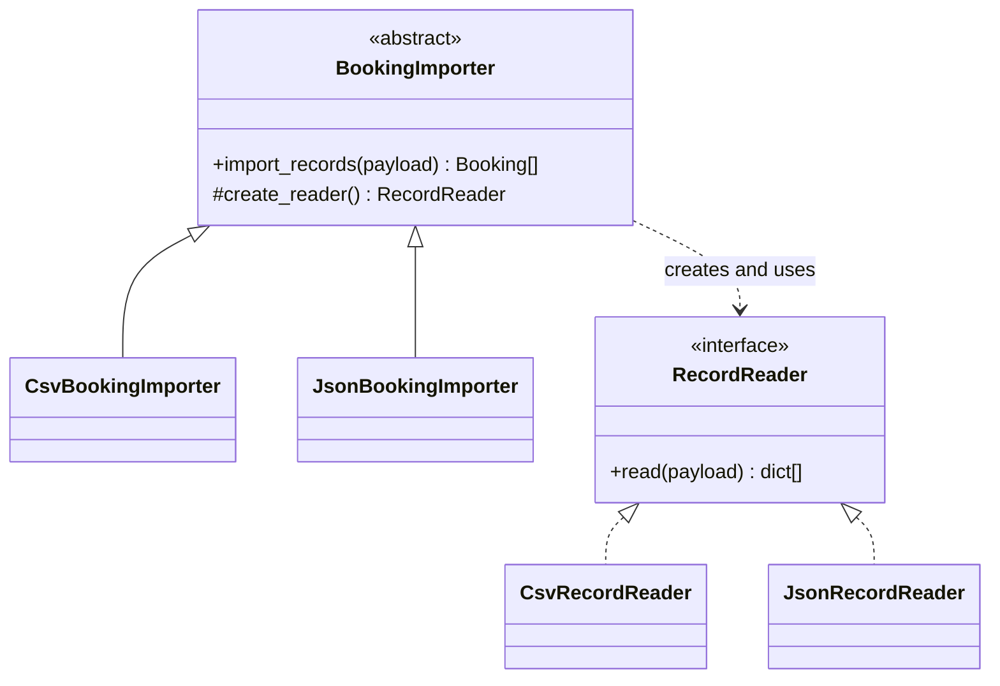
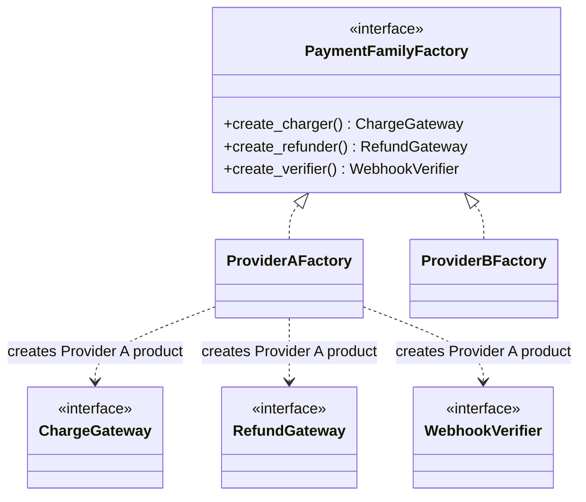
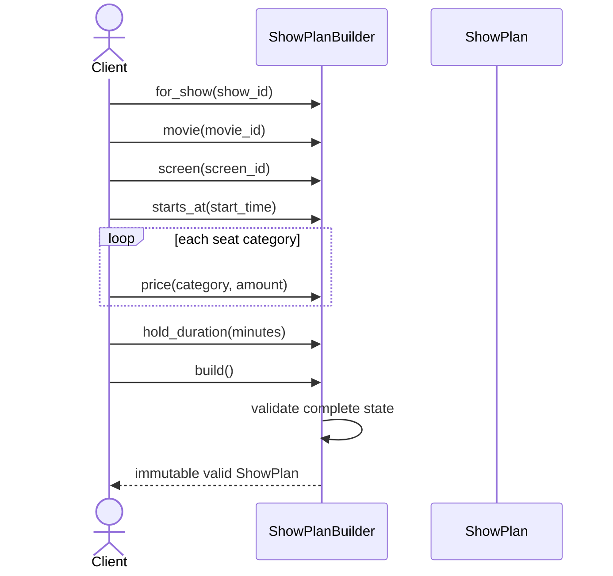
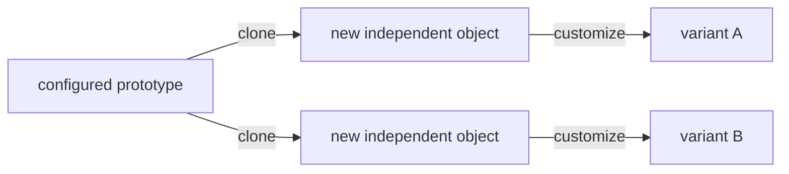
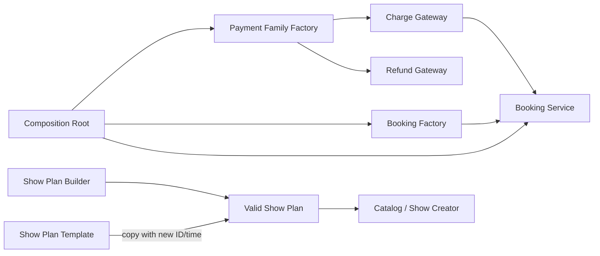

# Topic 6 - Creational Design Patterns

[Curriculum index](../README.md) | [Preparation roadmap](../roadmap.md) |
[Previous topic](./05-design-principles-and-heuristics.md) |
[Next topic](./07-structural-design-patterns.md)

- **Category:** Design patterns and object construction
- **Difficulty:** Intermediate to advanced
- **Priority:** Essential
- **Prerequisites:** Topics 2 and 5; Topics 3-4 recommended
- **Running example:** Movie Ticket Booking construction and payment families
- **Output:** Valid object construction with the simplest justified creation
  mechanism, explicit dependencies, tested variants, and safe identity/lifetime
  semantics

## Outcome

After completing this topic, you should be able to:

- Treat object creation as a responsibility with inputs, rules, ownership, and
  failure behavior.
- Choose direct construction, an alternative constructor, factory function,
  registry, factory object, or a named pattern intentionally.
- Distinguish a simple factory from the GoF Factory Method pattern.
- Implement Factory Method as a subclass-overridable creation hook inside a
  stable workflow.
- Use Abstract Factory for compatible families of related products.
- Use Builder for staged or complex construction without leaking invalid domain
  objects.
- Use Prototype safely with shallow/deep copying, immutable state, and new
  identity decisions.
- Explain Singleton's identity/access/lifetime guarantees and its global-state
  costs.
- Prefer composition-root lifetime management or Python module/cached-factory
  alternatives when they are simpler.
- Keep construction separate from use-case execution and provider-specific
  behavior.
- Test selection, defaults, invalid input, family compatibility, aliasing,
  cloning, and lifecycle behavior.
- Recognize when a creational pattern is unnecessary or actively harmful.
- Apply a requirement change without replacing one giant constructor branch
  with a larger pattern hierarchy.

## Core idea

Creation patterns answer different construction questions:

```text
Which concrete product?          -> factory function/object or Factory Method
Which compatible product family? -> Abstract Factory
How to assemble many steps?      -> Builder
How to copy a configured sample? -> Prototype
How to constrain instance count? -> Singleton, rarely
```

The first decision is always:

> Is a direct constructor, `@classmethod`, or small function already clear and
> sufficient?

Patterns earn their cost only when construction varies, is staged, must produce
compatible families, benefits from cloning, or has a genuine lifetime
constraint.

## Scope boundary

This topic deeply covers the five GoF creational patterns:

- Factory Method;
- Abstract Factory;
- Builder;
- Prototype;
- Singleton.

It also covers Python-native creation tools needed to choose responsibly:

- direct constructors and dataclasses;
- named `@classmethod` constructors;
- factory functions;
- discriminator maps and registries;
- callable factory objects;
- composition roots;
- `copy.copy`, `copy.deepcopy`, and `dataclasses.replace`;
- module-level/cached-factory lifetime alternatives.

It does not deeply cover:

- structural patterns used to compose existing objects; Topic 7 covers them;
- behavioral patterns used to vary collaboration; Topic 8 covers them;
- repositories, dependency-injection containers, or object-relational mapping;
  Topics 9 and 12 cover those boundaries;
- distributed resource coordination or process-wide uniqueness;
- framework-specific plugin systems.

Examples use Python 3.10+. Code fences are focused excerpts; some reference
domain types or imports introduced by nearby text. Standalone implementations
should include all imports and may use
`from __future__ import annotations` for forward references.

## 1. Learn

### 1.1 Creation is a design responsibility

Construction is more than allocating memory. It may decide:

- which concrete type to create;
- which dependencies to inject;
- how raw data is normalized;
- which defaults apply;
- whether related products are compatible;
- how a complex object is assembled;
- whether a template is copied;
- whether identity is new or retained;
- who owns the new object's lifecycle;
- how construction failure is reported.

Creation belongs near an owner with the required information and authority.
Topic 5's Creator heuristic suggests an owner that contains, records, closely
uses, or has the initialization data for the created object.

Do not confuse:

```text
construction: create a valid pending Booking
workflow:     hold seats, charge payment, confirm Booking
```

A factory should not silently perform a complete business transaction merely
because the transaction ends with a new object.

### 1.2 Start with the construction ladder

Move up this ladder only as pressure appears:

| Level | Use when | Example |
|---|---|---|
| Direct constructor | One clear valid creation path | `Money(amount, currency)` |
| Dataclass/defaults | Mostly data with local validation | `Seat(...)` |
| Named classmethod | Same class from another representation | `Money.from_minor_units(...)` |
| Factory function | Small concrete selection or dependency assembly | `make_gateway(config)` |
| Registry/map | Extensible key-to-creator selection | `{kind: creator}` |
| Factory object | Creation needs dependencies/state/policy | `BookingFactory(clock, ids)` |
| Factory Method | Subclasses customize a product inside a stable creator workflow | Importer/exporter hook |
| Abstract Factory | One selection must create a compatible family | Provider charge/refund/verifier suite |
| Builder | Construction is staged, optional, or assembled across steps | Complex show plan |
| Prototype | New object starts as a configured sample | Schedule/campaign template |
| Singleton | Exactly one accessible instance is a true invariant | Rare process-local infrastructure |

Using a lower level is not less object-oriented. It is often more readable and
more Pythonic.

### 1.3 Direct construction and dataclasses

Prefer direct construction when required values and validation are obvious:

```python
from dataclasses import dataclass
from decimal import Decimal


@dataclass(frozen=True)
class Money:
    amount: Decimal
    currency: str

    def __post_init__(self) -> None:
        if not self.amount.is_finite():
            raise ValueError("Amount must be finite")
        if self.amount < 0:
            raise ValueError("Amount cannot be negative")
        normalized_currency = self.currency.strip().upper()
        if len(normalized_currency) != 3:
            raise ValueError("Currency must be a three-letter code")
        object.__setattr__(self, "currency", normalized_currency)
```

Benefits:

- construction is visible at the call site;
- type hints and editor support are direct;
- invariants remain inside the value;
- no extra navigation or naming layer exists.

Do not add `MoneyFactory.create_money()` when it merely forwards the same
arguments to `Money`.

### 1.4 Named alternative constructors

Use a `@classmethod` when one class has a meaningful alternate input form:

```python
from dataclasses import dataclass
from decimal import Decimal


@dataclass(frozen=True)
class Money:
    amount: Decimal
    currency: str

    def __post_init__(self) -> None:
        if not self.amount.is_finite() or self.amount < 0:
            raise ValueError("Amount must be finite and non-negative")
        normalized_currency = self.currency.strip().upper()
        if len(normalized_currency) != 3:
            raise ValueError("Currency must be a three-letter code")
        object.__setattr__(self, "currency", normalized_currency)

    @classmethod
    def from_minor_units(
        cls,
        minor_units: int,
        currency: str,
        digits: int = 2,
    ) -> "Money":
        if minor_units < 0:
            raise ValueError("Minor units cannot be negative")
        if digits < 0:
            raise ValueError("Currency digits cannot be negative")
        scale = Decimal(10) ** digits
        return cls(Decimal(minor_units) / scale, currency)
```

The name explains conversion. It returns the same conceptual type and keeps
normal validation in `Money`.

Use named constructors for:

- parsing a canonical string;
- converting units;
- restoring from trusted data while preserving invariants;
- applying one named default profile.

Do not turn one class into a catalogue of unrelated infrastructure loaders such
as `from_database`, `from_http`, and `from_csv` when those dependencies belong
at adapters.

### 1.5 Factory functions

A factory function is often the best Python answer when selection is small:

```python
from enum import Enum, auto


class GatewayKind(Enum):
    IN_MEMORY = auto()
    SANDBOX = auto()


def make_payment_gateway(kind: GatewayKind) -> PaymentGateway:
    if kind is GatewayKind.IN_MEMORY:
        return InMemoryPaymentGateway()
    if kind is GatewayKind.SANDBOX:
        return SandboxPaymentGateway()
    raise ValueError(f"Unsupported gateway kind: {kind}")
```

This is commonly called a *simple factory*. It centralizes concrete selection,
but it is not the GoF Factory Method pattern.

Use a function when:

- selection is local and stable;
- creation has no long-lived state;
- subclass extension is unnecessary;
- the returned contract is clear;
- a class would only provide a namespace.

The central branch still changes for a new kind. That is acceptable when the
set is controlled and small.

### 1.6 Registry-based creation

A registry replaces repeated branching with a key-to-creator map:

```python
from collections.abc import Callable


GatewayCreator = Callable[[], PaymentGateway]


class GatewayRegistry:
    def __init__(self) -> None:
        self._creators: dict[str, GatewayCreator] = {}

    def register(self, name: str, creator: GatewayCreator) -> None:
        key = name.strip().casefold()
        if not key:
            raise ValueError("Gateway name is required")
        if key in self._creators:
            raise ValueError(f"Gateway already registered: {name}")
        self._creators[key] = creator

    def create(self, name: str) -> PaymentGateway:
        try:
            creator = self._creators[name.strip().casefold()]
        except KeyError as error:
            raise ValueError(f"Unsupported gateway: {name}") from error
        return creator()
```

Registration:

```python
registry = GatewayRegistry()
registry.register("memory", InMemoryPaymentGateway)
registry.register("sandbox", lambda: SandboxPaymentGateway(timeout_seconds=3))
```

Benefits:

- registration can occur at the composition root;
- selection code does not import every concrete type;
- tests can create an isolated registry;
- creators may be classes, functions, or lambdas.

Costs/risks:

- duplicate/unknown key behavior must be defined;
- runtime errors replace some static discoverability;
- global self-registering plugins hide initialization order;
- returning shared instances versus new instances must be explicit;
- arbitrary dynamic loading may be a security/configuration concern.

Do not introduce a registry for two fixed, locally configured choices unless it
actually improves extension or wiring.

### 1.7 Factory objects

Use a factory object when creation itself needs collaborators or configuration:

```python
from datetime import timedelta


class BookingFactory:
    def __init__(
        self,
        clock: Clock,
        id_generator: IdGenerator,
        hold_duration: timedelta,
    ) -> None:
        if hold_duration <= timedelta(0):
            raise ValueError("Hold duration must be positive")
        self._clock = clock
        self._ids = id_generator
        self._hold_duration = hold_duration

    def create(
        self,
        user_id: str,
        show_id: str,
        seat_ids: tuple[str, ...],
        total: Money,
    ) -> Booking:
        now = self._clock.now()
        return Booking(
            booking_id=self._ids.next_id(),
            user_id=user_id,
            show_id=show_id,
            seat_ids=seat_ids,
            total=total,
            created_at=now,
            hold_expires_at=now + self._hold_duration,
        )
```

The factory owns creation-specific dependencies and consistent defaults. It
does not hold seats or charge payment. The application use case remains the
workflow owner.

A callable factory object can implement `__call__` instead of `create`; use the
form that communicates best at the call site.

### 1.8 Factory Method: precise intent

Factory Method defines a creation operation in a creator abstraction and lets
subclasses decide which concrete product to create. The creator commonly owns a
stable workflow that uses the product.

Participants:

| Participant | Responsibility |
|---|---|
| Product | Contract used by creator workflow |
| Concrete Product | Particular product behavior |
| Creator | Stable workflow plus factory method |
| Concrete Creator | Overrides factory method to return concrete product |



The stable `import_records()` workflow validates records and creates bookings.
Subclasses vary only the reader creation hook.

### 1.9 Implement Factory Method

```python
from abc import ABC, abstractmethod
from collections.abc import Iterable
from typing import Protocol


class RecordReader(Protocol):
    def read(self, payload: str) -> Iterable[dict[str, str]]:
        ...


class BookingImporter(ABC):
    def import_records(self, payload: str) -> tuple[Booking, ...]:
        reader = self.create_reader()
        bookings = []
        for raw in reader.read(payload):
            bookings.append(Booking.from_import_record(raw))
        return tuple(bookings)

    @abstractmethod
    def create_reader(self) -> RecordReader:
        raise NotImplementedError


class CsvBookingImporter(BookingImporter):
    def create_reader(self) -> RecordReader:
        return CsvRecordReader()


class JsonBookingImporter(BookingImporter):
    def create_reader(self) -> RecordReader:
        return JsonRecordReader()
```

Use Factory Method when:

- a creator hierarchy already has a meaningful stable workflow;
- subclasses must select/customize one product used by that workflow;
- creation is an overridable step, not the entire reason for an object;
- subclass configuration is preferable to runtime injection.

Prefer injection or a factory function when:

- selection happens at runtime from configuration;
- no meaningful creator subtype exists;
- inheritance would exist only to choose one dependency;
- the client can receive the product directly.

In Python, passing `reader_factory: Callable[[], RecordReader]` to one importer
may be simpler than a creator hierarchy. The pattern's force, not its class
diagram, determines the choice.

### 1.10 Do not confuse factory terms

| Construction form | Is GoF Factory Method? | Why |
|---|---:|---|
| `MemberFactory.create_member(type)` static branch | No | Simple factory selects directly |
| `make_gateway(config)` | No | Factory function |
| `{kind: creator}[kind]()` | No | Registry-based simple factory |
| `Money.from_minor_units(...)` | Usually no | Named alternative constructor |
| `Creator.operation()` calls overridable `create_product()` | Yes | Subclass hook varies product |
| Object with injected creator callable | Usually no | Composition-based factory dependency |

Interviewers and codebases sometimes use "factory method" loosely for any
method that creates an object. State whether you mean the general idiom or the
GoF pattern.

### 1.11 Abstract Factory: precise intent

Abstract Factory creates families of related or dependent products without the
client naming concrete classes.

The essential force is *family compatibility*:

```text
Provider A charge gateway
Provider A refund gateway
Provider A webhook verifier

must not accidentally mix with

Provider B charge/refund/webhook products
```

Participants:

| Participant | Responsibility |
|---|---|
| Abstract Factory | Operations for each product role |
| Concrete Factory | Produces one compatible family |
| Abstract Products | Client-facing contracts |
| Concrete Products | Provider/platform-specific implementations |
| Client | Uses products only through abstract roles |



### 1.12 Implement Abstract Factory

```python
from typing import Protocol


class ChargeGateway(Protocol):
    provider_name: str

    def charge(self, request: ChargeRequest) -> ChargeResult:
        ...


class RefundGateway(Protocol):
    provider_name: str

    def refund(self, request: RefundRequest) -> RefundResult:
        ...


class WebhookVerifier(Protocol):
    provider_name: str

    def verify(self, payload: bytes, signature: str) -> bool:
        ...


class PaymentFamilyFactory(Protocol):
    def create_charger(self) -> ChargeGateway:
        ...

    def create_refunder(self) -> RefundGateway:
        ...

    def create_verifier(self) -> WebhookVerifier:
        ...
```

Concrete family:

```python
class ProviderAFactory:
    def __init__(self, credentials: ProviderACredentials) -> None:
        self._credentials = credentials

    def create_charger(self) -> ChargeGateway:
        return ProviderAChargeGateway(self._credentials)

    def create_refunder(self) -> RefundGateway:
        return ProviderARefundGateway(self._credentials)

    def create_verifier(self) -> WebhookVerifier:
        return ProviderAWebhookVerifier(self._credentials.webhook_secret)
```

Composition root:

```python
family: PaymentFamilyFactory = ProviderAFactory(settings.provider_a_credentials)
checkout = BookingCheckout(charge_gateway=family.create_charger())
cancellation = BookingCancellation(refund_gateway=family.create_refunder())
webhooks = PaymentWebhookHandler(verifier=family.create_verifier())
```

Benefits:

- one provider choice creates compatible products;
- client code depends on product contracts;
- credentials/configuration remain centralized;
- family switching is explicit at wiring time;
- tests can supply an in-memory family.

Costs:

- adding a new *family* is easy;
- adding a new *product role* changes every abstract/concrete factory;
- many product interfaces and wiring steps may be unnecessary for one product;
- family objects can become service locators if passed throughout the domain.

Create products at the composition root and inject the narrow product into each
client. Do not pass a broad abstract factory to every use case unless runtime
family creation is itself a real responsibility.

### 1.13 Abstract Factory versus related alternatives

| Need | Prefer |
|---|---|
| Select one product | Factory function/object |
| Select one algorithm | Inject policy directly |
| Create several compatible roles | Abstract Factory |
| Configure a whole application once | Composition root, possibly helper functions |
| Product variants are independent, not families | Separate factories/registries |
| Construction order/optional parts dominate | Builder |

An Abstract Factory is not a general-purpose dependency container. Its products
form one meaningful family, such as operating-system widgets, database drivers,
cloud-provider clients, or payment-provider capabilities.

### 1.14 Builder: precise intent

Builder separates the construction of a complex object from its final
representation. It is useful when construction is staged, has many optional
parts, or needs a readable fluent process.

Participants in the classic form:

| Participant | Responsibility |
|---|---|
| Product | Final valid object |
| Builder | Operations for constructing parts |
| Concrete Builder | Accumulates state and returns product |
| Director | Optional reusable construction sequence |

Python often needs only a concrete builder. A Director is useful only when the
same ordered recipe creates multiple standard configurations.



### 1.15 Implement a validating Builder

Final product:

```python
from __future__ import annotations

from dataclasses import dataclass
from datetime import datetime, timedelta
from decimal import Decimal


@dataclass(frozen=True)
class ShowPlan:
    show_id: str
    movie_id: str
    screen_id: str
    starts_at: datetime
    duration: timedelta
    prices: tuple[tuple[str, Decimal], ...]
    hold_duration: timedelta

    def __post_init__(self) -> None:
        if not self.show_id or not self.movie_id or not self.screen_id:
            raise ValueError("Show, movie, and screen IDs are required")
        if self.duration <= timedelta(0):
            raise ValueError("Show duration must be positive")
        if self.hold_duration <= timedelta(0):
            raise ValueError("Hold duration must be positive")
        if not self.prices:
            raise ValueError("At least one seat-category price is required")
        categories = [category for category, _ in self.prices]
        if len(set(categories)) != len(categories):
            raise ValueError("Seat categories must be unique")
        if any(not amount.is_finite() or amount <= 0 for _, amount in self.prices):
            raise ValueError("Every price must be finite and positive")
```

Builder:

```python
class ShowPlanBuilder:
    def __init__(self, show_id: str) -> None:
        self._show_id = show_id
        self._movie_id: str | None = None
        self._screen_id: str | None = None
        self._starts_at: datetime | None = None
        self._duration: timedelta | None = None
        self._prices: dict[str, Decimal] = {}
        self._hold_duration = timedelta(minutes=5)

    def movie(self, movie_id: str) -> ShowPlanBuilder:
        self._movie_id = movie_id
        return self

    def screen(self, screen_id: str) -> ShowPlanBuilder:
        self._screen_id = screen_id
        return self

    def starts_at(self, value: datetime) -> ShowPlanBuilder:
        self._starts_at = value
        return self

    def duration(self, value: timedelta) -> ShowPlanBuilder:
        self._duration = value
        return self

    def price(self, category: str, amount: Decimal) -> ShowPlanBuilder:
        normalized = category.strip().upper()
        if not normalized:
            raise ValueError("Seat category is required")
        if normalized in self._prices:
            raise ValueError(f"Duplicate seat category: {category}")
        self._prices[normalized] = amount
        return self

    def hold_duration(self, value: timedelta) -> ShowPlanBuilder:
        self._hold_duration = value
        return self

    def build(self) -> ShowPlan:
        missing = [
            name
            for name, value in (
                ("movie", self._movie_id),
                ("screen", self._screen_id),
                ("starts_at", self._starts_at),
                ("duration", self._duration),
            )
            if value is None
        ]
        if missing:
            raise ValueError(f"Missing required fields: {', '.join(missing)}")

        return ShowPlan(
            show_id=self._show_id,
            movie_id=self._movie_id,
            screen_id=self._screen_id,
            starts_at=self._starts_at,
            duration=self._duration,
            prices=tuple(sorted(self._prices.items())),
            hold_duration=self._hold_duration,
        )
```

Usage:

```python
plan = (
    ShowPlanBuilder("show-1")
    .movie("movie-1")
    .screen("screen-1")
    .starts_at(datetime(2030, 1, 2, 18, 0))
    .duration(timedelta(minutes=150))
    .price("regular", Decimal("200"))
    .price("premium", Decimal("320"))
    .build()
)
```

The final product validates itself. The builder improves assembly readability
but is not the only guard against invalid objects.

### 1.16 Builder design decisions

Decide explicitly:

#### Mutable or immutable builder

- Mutable fluent builders are concise but not thread-safe and may retain state.
- Immutable builders return a new builder per step and are safer to reuse but
  allocate more objects.

#### Reusable or single-use

- Reuse can speed creation of similar products.
- Retained fields can leak from one build into another.
- A single-use builder may mark itself consumed after `build()`.
- A `reset()` must define which defaults survive.

#### Validate per step or at build

- Validate local input such as negative price immediately.
- Validate completeness and cross-field rules in `build()`/product constructor.
- Never return a partially valid domain object.

#### Director or client sequence

- Use a Director for named repeated recipes such as `build_weekend_premium_show`.
- Prefer a function or direct fluent calls for one simple recipe.

#### Builder or parameter object

If all data is already available at once, a validated dataclass with keyword
arguments may be clearer than a builder.

### 1.17 Builders and domain invariants

A builder is allowed to be incomplete internally. The built domain object is
not.

Bad:

```python
booking = Booking()
booking.user_id = user_id
# An exception occurs; an invalid Booking escaped into a collection.
```

Better:

```text
builder/draft accumulates incomplete input
    -> build validates all required/cross-field rules
    -> constructor receives complete data
    -> only valid immutable/entity object escapes
```

Do not use a builder as a back door around constructor validation.

### 1.18 Python alternatives to Builder

Prefer simpler alternatives when they communicate enough:

#### Keyword arguments with defaults

```python
request = BookingRequest(
    user_id="u1",
    show_id="show-1",
    seat_ids=("A1", "A2"),
    coupon_code=None,
)
```

#### Named configuration dataclass

```python
config = HoldConfiguration(duration=timedelta(minutes=5), max_seats=10)
```

#### Factory function

```python
plan = make_standard_show_plan(show_id, movie_id, screen_id, starts_at)
```

#### `dataclasses.replace` for immutable variants

```python
later_plan = replace(plan, show_id="show-2", starts_at=next_start)
```

Use Builder when staged readability and validation benefit outweigh another
mutable construction object.

### 1.19 Prototype: precise intent

Prototype creates a new object by copying an existing configured instance.

Use it when:

- construction from scratch is expensive;
- instances begin from user-configured templates;
- many objects share a complex baseline;
- concrete type selection is encoded by the prototype itself;
- copying is safer/clearer than replaying setup steps.



Prototype is not merely calling `copy()` anywhere. The copy operation is part
of the creation design, with explicit identity and nested-state semantics.

### 1.20 Shallow copy, deep copy, and replacement

Python tools:

| Tool | Behavior | Risk/use |
|---|---|---|
| `copy.copy(x)` | New outer object, nested references shared | Aliasing mutable nested state |
| `copy.deepcopy(x)` | Recursively copies reachable graph | Expensive; may copy resources/locks wrongly |
| `dataclasses.replace(x, ...)` | New dataclass with selected fields changed | Excellent for immutable/value-like configurations |
| Custom `clone`/`copy_as` | Domain-specific identity/state policy | Most explicit for entities/templates |

Shallow-copy hazard:

```python
from copy import copy


template = {"prices": {"REGULAR": Decimal("200")}}
clone = copy(template)
clone["prices"]["REGULAR"] = Decimal("250")

# template changed too because the nested dict is shared.
```

Deep copying is not automatically safe. A graph may contain:

- locks;
- open files/sockets;
- database sessions;
- caches;
- external clients;
- shared identity objects;
- back-references/cycles.

Prefer immutable prototype state or a custom copy that explicitly handles each
field.

### 1.21 Prototype and identity

Cloning a value/configuration may preserve all fields. Cloning an entity usually
requires a new identity and reset lifecycle state.

```python
from dataclasses import replace


def reschedule_plan(
    template: ShowPlan,
    new_show_id: str,
    starts_at: datetime,
) -> ShowPlan:
    if new_show_id == template.show_id:
        raise ValueError("A rescheduled show requires a new identity")
    return replace(template, show_id=new_show_id, starts_at=starts_at)
```

Because `ShowPlan` is immutable and its nested prices are a tuple of immutable
pairs, replacement safely shares values. If prices were a mutable dictionary,
the design would need an immutable wrapper or explicit copy.

For a cloned booking/order entity, decide:

- new ID;
- initial state;
- whether payment/history is cleared;
- whether ownership links are cleared;
- which timestamps reset;
- which values are snapshots versus shared references.

Blind `deepcopy(booking)` could duplicate a confirmed identity and payment
history, which is a domain corruption rather than a technical copy issue.

### 1.22 Prototype registry

A registry of validated prototypes can create named configurations:

```python
class ShowPlanTemplates:
    def __init__(self) -> None:
        self._templates: dict[str, ShowPlan] = {}

    def register(self, name: str, template: ShowPlan) -> None:
        key = name.strip().casefold()
        if not key or key in self._templates:
            raise ValueError("Template name must be new and non-empty")
        self._templates[key] = template

    def create(
        self,
        name: str,
        show_id: str,
        starts_at: datetime,
    ) -> ShowPlan:
        try:
            template = self._templates[name.strip().casefold()]
        except KeyError as error:
            raise ValueError(f"Unknown show template: {name}") from error
        return reschedule_plan(template, show_id, starts_at)
```

The registry owns selection; the prototype owns/configures baseline state; the
custom copy function owns identity rules.

### 1.23 Singleton: precise intent

Singleton ensures a class has one instance within a defined scope and provides
a global access point to it.

Those are two separate concerns:

1. instance-count control;
2. global accessibility.

The pattern is often overused for services, repositories, configuration,
logging, caches, and database connections. It hides dependencies and introduces
shared mutable state.

Classic Python sketch:

```python
from threading import Lock


class ProcessRegistry:
    _instance: "ProcessRegistry | None" = None
    _instance_lock = Lock()

    def __new__(cls) -> "ProcessRegistry":
        if cls._instance is None:
            with cls._instance_lock:
                if cls._instance is None:
                    cls._instance = super().__new__(cls)
        return cls._instance
```

This only controls allocation in one Python process. It does not guarantee:

- one instance across multiple processes/containers/machines;
- safe one-time initialization of mutable fields;
- correct behavior across subclassing, serialization, or module reload;
- isolation between tests;
- thread-safe operations on the singleton's contents.

`__init__` may run on every call unless separately guarded. A lock around
construction does not make the object's business methods thread-safe.

### 1.24 Singleton costs

- Dependencies are retrieved rather than declared.
- Tests influence one another through retained state.
- Initialization order becomes significant.
- Configuration may be frozen too early.
- Parallel tests become difficult.
- Lifetime/disposal is hidden.
- Consumers cannot easily substitute fakes.
- Process-local uniqueness is mistaken for distributed uniqueness.
- Shared mutable data becomes a concurrency hotspot.
- Import cycles and module reloads complicate identity.

Singleton may be defensible when:

- the one-instance invariant is real and process-scoped;
- global access is truly required;
- lifecycle/reset/disposal is controlled;
- shared state is immutable or safely synchronized;
- injection would not communicate the actual invariant better.

Even then, document the scope explicitly: *one per process*, *one per request*,
*one per application container*, or another owner.

### 1.25 Prefer lifetime management at the composition root

Most LLD services need one shared instance in an application, not a Singleton
class.

```python
catalog = CatalogService()
gateway = InMemoryPaymentGateway()
clock = SystemClock()

booking_service = BookingService(catalog, pricing, gateway, clock)
reporting_service = ReportingService(catalog)
```

The composition root creates one catalog and injects it where needed.

Benefits over Singleton:

- dependencies remain visible;
- tests create isolated graphs;
- another application graph may use a different instance;
- lifetime/disposal is owned explicitly;
- no global access API is required;
- the class itself remains ordinary.

This is commonly the right answer in interviews.

### 1.26 Python-native Singleton alternatives

#### Module-level instance

Python modules are cached per interpreter import system:

```python
# settings.py
SETTINGS = Settings.from_environment()
```

Simple, but still global and eager unless carefully designed.

#### Cached factory

```python
from functools import lru_cache


@lru_cache(maxsize=1)
def application_settings() -> Settings:
    return Settings.from_environment()
```

This is a cached provider rather than a strict Singleton class. Tests can call
`application_settings.cache_clear()`, though hidden lookup remains global.

#### Dependency-injection/container scope

An application container creates one instance per declared scope and injects it.
This retains explicit client dependencies but adds framework/container
complexity.

#### Immutable constant/value

A stateless function, enum, or immutable configuration value may eliminate the
need for instance identity entirely.

Choose based on lifetime and access requirements, not the word "global."

### 1.27 Construction and dependency injection

Factories and dependency injection solve related but distinct problems:

| Concern | Primary answer |
|---|---|
| Decide which concrete object | Factory/registry/composition root |
| Supply dependency to consumer | Dependency injection |
| Assemble entire application graph | Composition root/container |
| Create domain entity with IDs/defaults | Domain factory/creator |
| Create family of adapter products | Abstract Factory |
| Change dependency during runtime | Inject factory/provider if required |

Prefer injecting a ready dependency:

```python
checkout = Checkout(payment_gateway=gateway)
```

Inject a factory only when the consumer must create products repeatedly at
runtime:

```python
worker = JobWorker(session_factory=session_factory)
```

Passing a factory everywhere can become a service locator and move composition
decisions into business code.

### 1.28 Creation lifetime and ownership

Every creation mechanism should state:

- Who requests the object?
- Who owns it after creation?
- Is it new each call or shared?
- Who disposes/closes it?
- May it be cached?
- Is it thread-safe?
- Can it cross requests/tests?
- Does it have business identity?

Examples:

| Product | Typical lifetime |
|---|---|
| `Money` value | As long as containing value/entity |
| `Booking` entity | Business lifecycle; persisted later |
| Payment adapter | Application-scoped/shared if safe |
| Database transaction/session | Use-case scoped, explicitly closed |
| Builder | One construction or controlled reuse |
| Prototype template | Registry/application scoped and immutable |
| Parsed DTO | Request/use-case scoped |

Creational patterns do not replace lifecycle design.

### 1.29 Pattern selection matrix

| Pressure | Best first choice | Escalate when |
|---|---|---|
| One valid product | Constructor | Alternate representation appears |
| Same type from named input form | `@classmethod` | External selection/dependencies grow |
| Small type selection | Factory function | Registration/state/extension grows |
| Runtime key-to-creator mapping | Registry | Related family compatibility appears |
| Creation needs clock/IDs/config | Factory object | Subclass creator workflow is required |
| Subclass customizes product in common workflow | Factory Method | Multiple related product roles appear |
| Compatible product suite | Abstract Factory | New product role cost is acceptable |
| Staged many-part assembly | Builder | Direct kwargs remain unreadable/incomplete |
| Configured template copy | Prototype | Copy semantics can be made explicit |
| One process-wide instance | Composition root first | True global access/count invariant remains |

### 1.30 Pattern combination without pattern soup

Patterns can collaborate:

```text
composition root selects Abstract Factory
    -> factory creates compatible adapters
    -> inject adapters into services

builder creates immutable ShowPlan
    -> prototype registry clones standard plan
    -> catalog creates Show from the plan
```

Do not combine patterns merely because they can be combined. Each must answer a
separate construction pressure. If you cannot name that pressure, remove the
pattern.

## 2. Recognize

### 2.1 Requirement signals

| Requirement signal | Candidate mechanism |
|---|---|
| "Create this validated value" | Direct constructor |
| "Create same type from minor units/string" | Named classmethod |
| "Choose implementation from a small config" | Factory function |
| "Plugins register creators by key" | Registry |
| "Creation needs clock, IDs, defaults" | Factory object |
| "Subclasses customize product used by base workflow" | Factory Method |
| "Switch all provider/platform products together" | Abstract Factory |
| "Many optional/staged parts" | Builder |
| "Start from a configured template" | Prototype |
| "Exactly one per process and globally accessed" | Singleton candidate; challenge it |
| "One shared instance in this application" | Composition-root lifetime |
| "Create a fresh session for every job" | Inject factory/provider callable |

### 2.2 Construction smells

- Long constructors with unrelated primitive arguments.
- Optional arguments whose valid combinations are unclear.
- Call sites repeat the same defaults/normalization.
- Type-discriminator branches appear in many consumers.
- Domain code imports every concrete adapter.
- A workflow constructs clocks, gateways, or repositories internally.
- Related products from different providers can be mixed accidentally.
- Partially initialized objects escape before validation.
- Copying duplicates entity IDs or shares mutable child state.
- A global accessor hides business dependencies.
- Builders retain state unexpectedly across builds.
- Factory methods perform network calls and complete workflows without saying so.
- A factory returns shared mutable objects although callers expect fresh ones.

### 2.3 Pattern misuse signals

- A factory class merely calls one constructor with identical arguments.
- A static simple factory is described as GoF Factory Method without a creator
  hook.
- Abstract Factory has one product role.
- Concrete factories produce mix-and-match products with no family invariant.
- Builder exists for a dataclass with three required fields.
- Builder returns an invalid or still-mutable domain object.
- Director duplicates one call-site recipe used once.
- Prototype uses `deepcopy` on entities/resources without a copy contract.
- Clone retains identity and completed history accidentally.
- Singleton is used because "we only need one right now."
- Singleton initialization and business operations are assumed thread-safe.
- Registry is global and order-dependent.
- Pattern names conceal raw configuration branching rather than simplify it.

### 2.4 Decision questions

1. What is difficult about direct construction?
2. Is the variation in one product, a product family, steps, template, or
   lifetime?
3. Who owns the inputs and created object?
4. Is selection compile-time/wiring-time or runtime?
5. Is a function/callable enough?
6. Must every call return a fresh instance?
7. What invariants must hold before the product escapes?
8. What dependencies/configuration does creation need?
9. What failure does an unknown type/incomplete build cause?
10. Are products compatible only within one family?
11. What identity/nested state changes during cloning?
12. Is "one" an actual invariant or only one chosen application lifetime?
13. How will tests isolate and replace creation?
14. What new class/indirection cost does the pattern add?

## 3. Model

### 3.1 Running example construction inventory

Movie Ticket Booking contains several kinds of creation:

| Product | Construction pressure | Recommended mechanism |
|---|---|---|
| `Money` | Validated exact value | Constructor/named conversion |
| `Seat` | Clear required metadata | Direct dataclass constructor |
| `ShowSeat` inventory | One per screen seat with show context | Catalog/domain factory loop |
| `Booking` | Clock, generated ID, hold duration, valid selection | Factory object if repeated |
| Payment gateway | Wiring-time provider selection | Composition root/simple factory |
| Charge/refund/verifier provider suite | Must use one compatible provider family | Abstract Factory if all roles exist |
| `ShowPlan` | Staged schedule/prices/defaults | Builder when input arrives in stages |
| Repeated show schedule | Start from validated plan with new identity/time | Prototype-style replacement |
| Catalog/service | One shared app instance | Composition-root scope, not Singleton |

Not every row needs a named GoF pattern. That is the lesson.

### 3.2 Creation responsibility map



The business service receives constructed collaborators. It does not choose
provider families or retrieve Singleton services.

### 3.3 Payment-family compatibility

Invariant:

```text
charge adapter, refund adapter, and webhook verifier must share provider and
credential family
```

Factory output can make the family explicit:

```python
from dataclasses import dataclass


@dataclass(frozen=True)
class PaymentFamily:
    provider_name: str
    charger: ChargeGateway
    refunder: RefundGateway
    verifier: WebhookVerifier

    def __post_init__(self) -> None:
        products = (self.charger, self.refunder, self.verifier)
        if any(product.provider_name != self.provider_name for product in products):
            raise ValueError("Payment products must belong to one provider family")
```

The concrete factory may return this bundle from one `create_family()` method
instead of three independent operations. This makes compatibility validation
and wiring atomic at the application boundary.

Trade-off:

- separate factory methods match classic Abstract Factory;
- one immutable family bundle makes accidental mixing harder in Python;
- either is valid when the family concept is explicit.

### 3.4 Show plan Builder model

Builder state may be incomplete:

```text
show ID: required at builder creation
movie: missing -> set
screen: missing -> set
start: missing -> set
duration: missing -> set
prices: 0..* -> add unique categories
hold duration: default 5 minutes -> optional override
```

Build postconditions:

- all required IDs and time fields exist;
- duration and hold duration are positive;
- at least one unique category price exists;
- all prices are finite and positive;
- final `ShowPlan` is immutable;
- subsequent builder mutation cannot affect a built plan.

### 3.5 Prototype identity model

Template:

```text
show-1, movie M1, screen S1, 18:00, prices P, hold 5m
```

Prototype operation:

```text
reschedule(new_show_id=show-2, starts_at=21:00)
```

Result:

- new identity `show-2`;
- new start time;
- same immutable movie/screen/duration/prices/hold values;
- no bookings, show-seat states, or payment history copied;
- template remains unchanged.

This is a configuration prototype, not cloning a live `Show` aggregate.

### 3.6 Reject Singleton for the catalog

Requirement says:

> Booking and reporting services use the same catalog in one application.

This does not require `CatalogService.instance()`.

Model:

```text
composition root creates catalog1
booking service -----> catalog1
reporting service ---> catalog1

test A creates isolated catalogA
test B creates isolated catalogB
```

If multiple application graphs or tenants run in one process, Singleton would
be actively incorrect. Instance count belongs to wiring scope, not the catalog
class.

### 3.7 Construction contract table

| Creator | Valid input | Success | Failure/no side effect |
|---|---|---|---|
| `Money.from_minor_units` | non-negative units/digits | normalized valid `Money` | rejects invalid conversion |
| Gateway registry | known normalized key | declared fresh/shared gateway | unknown key rejected |
| `BookingFactory` | valid selection/total/config | new unique pending booking | no registration/hold/payment |
| Payment family factory | valid provider credentials | compatible products | no partial family exposed |
| Show-plan builder | complete valid staged fields | immutable plan | builder may remain; no invalid plan escapes |
| Prototype reschedule | known template, new ID/time | independent valid plan | template unchanged |
| Cached settings provider | valid environment | same immutable settings per cache scope | initialization failure explicit/resettable |

### 3.8 Pattern trade-off record

| Decision | Benefit | Cost | Revisit when |
|---|---|---|---|
| Direct `Seat` constructor | Visible/simple | Repeated defaults possible | Creation rules/dependencies grow |
| `BookingFactory` object | Controls time/IDs/default | Extra collaborator | Creation becomes trivial again |
| Payment Abstract Factory | Compatible provider suite | New product role edits every factory | Only one product remains |
| `ShowPlanBuilder` | Readable staged assembly | Mutable intermediate object | All inputs arrive together |
| Immutable plan prototype | Safe repeated schedule | Explicit new-ID rule | Live aggregate must be copied |
| Composition-root catalog scope | Visible/test-isolated | Wiring passed explicitly | Framework scope truly needed |

## 4. Implement

### 4.1 A Pythonic simple factory with fresh/shared semantics

```python
from collections.abc import Callable


class PricingPolicyFactory:
    def __init__(self) -> None:
        self._creators: dict[str, Callable[[], PricingPolicy]] = {}

    def register(
        self,
        name: str,
        creator: Callable[[], PricingPolicy],
    ) -> None:
        key = name.strip().casefold()
        if not key or key in self._creators:
            raise ValueError("Policy name must be new and non-empty")
        self._creators[key] = creator

    def create(self, name: str) -> PricingPolicy:
        try:
            return self._creators[name.strip().casefold()]()
        except KeyError as error:
            raise ValueError(f"Unknown pricing policy: {name}") from error
```

Register creators, not instances, when callers need fresh mutable policies. A
registry of stateless immutable policy instances may intentionally return shared
objects, but its contract must say so.

### 4.2 Factory Method with an injected-function alternative

Inheritance-based Factory Method:

```python
class JsonBookingImporter(BookingImporter):
    def create_reader(self) -> RecordReader:
        return JsonRecordReader(strict=True)
```

Composition alternative:

```python
from collections.abc import Callable


class ConfigurableBookingImporter:
    def __init__(self, reader_factory: Callable[[], RecordReader]) -> None:
        self._reader_factory = reader_factory

    def import_records(self, payload: str) -> tuple[Booking, ...]:
        reader = self._reader_factory()
        return tuple(
            Booking.from_import_record(raw)
            for raw in reader.read(payload)
        )
```

Choose Factory Method when creator subtypes are meaningful/stable. Choose the
callable when runtime composition and fewer subclasses are clearer.

### 4.3 Abstract Factory as an immutable family bundle

```python
class InMemoryPaymentFactory:
    def create_family(self) -> PaymentFamily:
        ledger = InMemoryPaymentLedger()
        provider_name = "in-memory"
        return PaymentFamily(
            provider_name=provider_name,
            charger=InMemoryChargeGateway(provider_name, ledger),
            refunder=InMemoryRefundGateway(provider_name, ledger),
            verifier=InMemoryWebhookVerifier(provider_name),
        )
```

The shared ledger is a family-internal collaborator. The factory ensures charge
and refund products observe the same payment records. Clients still receive
narrow gateway products.

### 4.4 Builder with single-use protection

If state leakage is risky, consume the builder:

```python
class SingleUseShowPlanBuilder(ShowPlanBuilder):
    def __init__(self, show_id: str) -> None:
        super().__init__(show_id)
        self._consumed = False

    def build(self) -> ShowPlan:
        if self._consumed:
            raise RuntimeError("Builder has already produced a plan")
        plan = super().build()
        self._consumed = True
        return plan
```

This prevents accidental second builds but introduces inheritance solely to add
lifecycle policy. In production, prefer placing the flag directly in the
builder or composing a wrapper unless the subtype is a meaningful supported
variation. The snippet exists to make the trade-off visible, not prescribe a
hierarchy.

### 4.5 Prototype with explicit copy policy

```python
@dataclass(frozen=True)
class CampaignTemplate:
    name: str
    eligible_segments: frozenset[str]
    message_parts: tuple[str, ...]

    def instantiate(self, campaign_id: str, starts_at: datetime) -> CampaignDraft:
        if not campaign_id.strip():
            raise ValueError("Campaign ID is required")
        return CampaignDraft(
            campaign_id=campaign_id,
            starts_at=starts_at,
            name=self.name,
            eligible_segments=self.eligible_segments,
            message_parts=self.message_parts,
        )
```

Immutable nested values may be safely shared. `CampaignDraft` receives new
identity/lifecycle fields. The copy contract is clearer than `deepcopy`.

### 4.6 Replace a Singleton with explicit scope

Before:

```python
class CatalogService:
    _instance = None

    @classmethod
    def instance(cls):
        if cls._instance is None:
            cls._instance = cls()
        return cls._instance
```

After:

```python
@dataclass(frozen=True)
class Application:
    catalog: CatalogService
    booking_service: BookingService
    reporting_service: ReportingService


def build_application() -> Application:
    catalog = CatalogService()
    gateway = InMemoryPaymentGateway()
    booking_service = BookingService(catalog, gateway)
    reporting_service = ReportingService(catalog)
    return Application(catalog, booking_service, reporting_service)
```

Every `build_application()` call creates an isolated graph whose internal
services intentionally share one catalog.

### 4.7 Async construction

Python `__init__` cannot be awaited. When creation requires asynchronous I/O,
use an async factory/classmethod and make the side effect explicit:

```python
class ProviderClient:
    def __init__(self, connection: ProviderConnection) -> None:
        self._connection = connection

    @classmethod
    async def connect(cls, settings: ProviderSettings) -> "ProviderClient":
        connection = await ProviderConnection.open(settings.endpoint)
        return cls(connection)
```

Better still, keep network connection management in an adapter/composition
boundary. Domain entity construction should not require I/O.

### 4.8 Construction failure taxonomy

Use meaningful failures:

| Failure | Example |
|---|---|
| Invalid product input | Negative price |
| Incomplete build | Missing screen/start time |
| Unsupported discriminator | Unknown member type |
| Duplicate registration | Factory key already exists |
| Family configuration | Missing provider credentials |
| Compatibility violation | Provider A charger with Provider B refunder |
| Clone identity conflict | Reused show ID |
| Initialization failure | External adapter cannot connect |

Factories should not swallow errors and return `None` unless absence is part of
the contract. Do not expose a partially created family/product after failure.

## 5. Test creational designs

### 5.1 Direct/named-constructor tests

- valid input creates a valid object;
- normalization occurs once;
- boundary units convert exactly;
- invalid input never creates an invalid instance;
- alternate constructor produces semantics equal to direct construction.

```python
def test_minor_units_constructor_matches_direct_money(self) -> None:
    self.assertEqual(
        Money(Decimal("12.34"), "INR"),
        Money.from_minor_units(1234, "inr"),
    )
```

### 5.2 Factory function/registry tests

- every supported key returns the expected contract implementation;
- aliases/normalization are explicit;
- unknown key raises the documented failure;
- duplicate registration is rejected;
- fresh-versus-shared instance semantics are asserted;
- creator failure is propagated/translated intentionally;
- isolated registries do not leak state between tests.

### 5.3 Factory Method tests

- base workflow executes identically for every creator;
- each concrete creator supplies the correct product;
- product contract tests pass;
- malformed records fail under the documented reader/import rule;
- subclass override changes creation only, not workflow invariants;
- composition alternative is considered when subclassing adds no domain value.

### 5.4 Abstract Factory tests

- every concrete factory produces every required product role;
- all products identify the same family/provider;
- related products interoperate;
- one family can replace another under shared contracts;
- invalid credentials fail before a partial family escapes;
- adding one family does not edit clients;
- adding a product role intentionally fails/updates every family implementation.

```python
def assert_payment_family(
    testcase: unittest.TestCase,
    family: PaymentFamily,
) -> None:
    testcase.assertEqual(family.provider_name, family.charger.provider_name)
    testcase.assertEqual(family.provider_name, family.refunder.provider_name)
    testcase.assertEqual(family.provider_name, family.verifier.provider_name)
```

### 5.5 Builder tests

- minimum complete sequence builds successfully;
- every missing required field is reported;
- invalid local input fails at its step;
- cross-field invalidity fails at build/product construction;
- defaults are correct;
- call order is flexible only where promised;
- duplicate parts are rejected;
- built product is independent of later builder mutation;
- reuse/reset/single-use behavior is explicit;
- fluent methods return the intended builder.

### 5.6 Prototype tests

- prototype remains unchanged;
- clone has required new identity;
- immutable values may be shared safely;
- mutable nested collections are independent;
- lifecycle/history/ownership fields reset appropriately;
- prototype subtype/concrete behavior is preserved if required;
- cloning resources/locks/sessions is prohibited or custom-handled;
- registry unknown/duplicate names fail clearly.

### 5.7 Singleton/lifetime tests

If a Singleton is truly used:

- repeated access within declared scope returns the same identity;
- initialization occurs once;
- concurrent construction is safe;
- business methods protect shared state separately;
- test reset/isolation is defined;
- disposal/reinitialization is defined;
- process boundary limitations are documented;
- serialization/copy/subclass behavior is understood.

For composition-root scope:

```python
def test_each_application_is_isolated_but_internal_catalog_is_shared(self) -> None:
    first = build_application()
    second = build_application()

    self.assertIs(first.catalog, first.booking_service.catalog)
    self.assertIs(first.catalog, first.reporting_service.catalog)
    self.assertIsNot(first.catalog, second.catalog)
```

### 5.8 Creation review checklist

- [ ] Direct construction was considered first.
- [ ] The pattern solves a named construction pressure.
- [ ] Creation and business workflow remain separate.
- [ ] Product invariants hold before the object escapes.
- [ ] Dependencies/defaults are explicit.
- [ ] Fresh/shared lifetime semantics are documented.
- [ ] Unknown/incomplete/incompatible input fails clearly.
- [ ] Simple factory and GoF Factory Method are named accurately.
- [ ] Abstract Factory products form a real compatible family.
- [ ] Builder incompleteness cannot leak into the domain.
- [ ] Prototype identity and nested-state copy rules are explicit.
- [ ] Singleton scope is real, process limitations are stated, and alternatives
  were considered.
- [ ] Tests are isolated and do not depend on global registration order.
- [ ] A new variant changes the intended factory/builder/template boundary only.
- [ ] The added abstraction costs less than the construction problem it solves.

## 6. Adapt

### Adaptation A: add a payment provider

With a simple factory:

- add one branch/registry entry;
- construct one gateway;
- run the gateway contract tests.

With an Abstract Factory:

- implement charge, refund, and verifier products;
- implement concrete family factory;
- run each product contract and family compatibility test;
- wire one new factory at the composition root;
- keep booking/cancellation/webhook clients unchanged.

Do not introduce Abstract Factory if the application still needs only one
gateway product.

### Adaptation B: add taxes to ShowPlan

Question:

- Is tax a construction-time plan field or runtime pricing policy?

If the plan only selects a jurisdiction, Builder adds one validated value.
If tax is calculated during checkout, inject a pricing/tax policy rather than
placing calculation in the Builder. Creation patterns should not absorb
behavioral variation accidentally.

### Adaptation C: recurring shows

Requirement:

> Create eight weekly shows from one configured plan, each with a new identity
> and independent inventory.

Likely solution:

- immutable `ShowPlan` acts as prototype/configuration;
- an ID source creates a new identity per occurrence;
- a recurrence creator replaces start/ID for each plan;
- catalog creates fresh `ShowSeat` inventory from each plan;
- no live `ShowSeat` state is cloned;
- validate all occurrences before registering any if all-or-none is required.

### Adaptation D: builder receives prices from two stages

- stage one supplies required seat categories;
- stage two supplies currency/prices;
- Builder may remain incomplete internally;
- `build()` verifies every required category has exactly one price;
- built tuple/map is copied/immutable;
- stage retries cannot duplicate categories silently.

This is stronger evidence for Builder than a single call site with keyword
arguments.

### Adaptation E: multi-tenant catalogs

A catalog Singleton becomes invalid immediately. Use:

- tenant-keyed application scope;
- injected catalog per tenant/request;
- a factory/provider owned by the boundary;
- explicit lifetime/disposal;
- tests with two tenants in one process.

The change demonstrates why "we only have one today" is not a Singleton
invariant.

### Adaptation review

For each change, answer:

1. Is variation about product, family, steps, template, or lifetime?
2. Can the existing simpler mechanism absorb it?
3. Which construction contract changes?
4. Which product invariants/identity rules change?
5. Does creation require new dependencies?
6. Is every product fresh, shared, cached, or scoped?
7. Which clients remain unchanged?
8. Which tests prove no partial/aliased/incompatible product escapes?

## Common mistakes

### Calling every creator a Factory Method

A static branch or factory function is not the GoF Factory Method. The pattern
uses an overridable creation hook in a creator workflow.

### Factory class as a namespace

If a class has one static method that forwards to one constructor, prefer the
constructor or function.

### Factories with business workflows

`BookingFactory.create_and_hold_and_charge()` mixes construction with a use
case. Keep domain creation and transaction orchestration separate.

### Hidden dependencies inside factories

A factory that reads global time, environment, network, and random IDs without
an explicit contract remains difficult to test. Inject creation dependencies
into a factory object or wire them at the root.

### Returning invalid or partial products

Builders/factories must not publish objects before required invariants hold.

### Returning shared mutable instances unexpectedly

A registry mapping keys to instances behaves differently from one mapping to
creators. Document and test fresh/shared semantics.

### Global self-registering factories

Import-order side effects create hidden configuration and brittle tests. Prefer
explicit registration at the composition root.

### Factory Method hierarchy without a creator workflow

If subclasses only return different dependencies, a factory callable or direct
injection is often simpler.

### Abstract Factory for one product

Use a simple factory when no compatible family exists.

### Product-family mismatch

If provider A charger and provider B refunder can be wired together silently,
the family invariant is not protected.

### Passing Abstract Factory everywhere

This becomes a service locator. Create products at wiring time and inject narrow
contracts unless runtime family creation is required.

### Builder for three arguments

Python keyword arguments already make simple construction readable.

### Builder as mutable domain entity

The incomplete builder is a construction tool; the final object must establish
its own invariants and control domain mutation.

### Builder reuse leakage

Old optional fields may affect later products. Define reset/single-use/immutable
semantics and test them.

### Director without repeated recipe

A Director adds value only for reusable ordered construction workflows.

### Shallow copying mutable children

Clone mutations may change the prototype. Use immutable state, custom copying,
or carefully justified deep copying.

### Blind `deepcopy`

Deep copying resources, locks, sessions, identities, and graphs can be incorrect
or expensive. Define a domain copy policy.

### Duplicating entity identity

A cloned order/booking with the same ID and completed history is not a new
entity. Assign new identity and reset lifecycle fields deliberately.

### Singleton for convenience

"Easy access" means hidden dependency. Pass the collaborator explicitly or
manage one instance at the composition root.

### Singleton mistaken for distributed uniqueness

One object per process cannot ensure one booking, leader, job, or lock across a
cluster.

### Locking construction but not state

Thread-safe Singleton initialization does not make mutable singleton operations
safe.

### Reset methods only for tests

A global reset hook may hide the underlying test-isolation problem. Prefer
isolated application graphs.

### Pattern-first design

Do not ask how to fit all five patterns into one problem. Name the construction
pressure, choose the lowest sufficient mechanism, and justify its cost.

## Existing repository examples

### Library Management: simple member factory

- [`MemberFactory`](../../solutions/library-management/factories/member_factory.py)
  selects `StudentMember` or `FacultyMember`, applies shared fields/defaults,
  and rejects unsupported types.
- The [factory discussion](../../solutions/library-management/README.md#14-factory-pattern-member-creation)
  explains the construction motivation.

Classification: this is a static **simple factory**, not GoF Factory Method.

Review:

- subtype selection and repeated inherited fields justify centralization;
- a function could provide equivalent behavior in Python;
- adding a new member type edits the branch;
- if member creation needs injected policy/IDs, a factory object may become
  useful;
- contract tests should prove every returned member honors `Member` behavior.

### Splitwise: strategy registry/simple factory

- [`SplitStrategyFactory`](../../solutions/splitwise/strategies/split_strategy_factory.py)
  maps each `SplitType` to a strategy.
- The [factory discussion](../../solutions/splitwise/README.md#11-factory-pattern-choosing-the-strategy)
  shows it inside expense creation.

Classification: registry-backed simple factory returning shared stateless
strategy instances.

Review:

- sharing is safe only while strategies remain stateless/immutable;
- a creator map would be safer if strategies gain per-use state;
- explicit mapping makes supported split types clear;
- dynamic plugin registration is unnecessary in the current scope.

### Composition roots: often simpler than factories

- [Movie Ticket Booking `main.py`](../../solutions/movie-ticket-booking/main.py)
  directly assembles catalog, pricing, gateway, and booking service.
- [Elevator `main.py`](../../solutions/elevator/main.py) directly assembles cars,
  scheduling policy, and controller.
- [Parking Lot dependency injection](../../solutions/parking-lot/README.md#13-dependency-injection)
  explains direct wiring.

These are good reminders that concrete choice at one visible composition root
often needs no pattern hierarchy.

### No Builder, Prototype, or Singleton in current solutions

That absence is useful:

- existing constructors/configuration are mostly readable without Builder;
- live entities should not be cloned casually;
- shared services are passed through constructors rather than global Singletons;
- templates/complex staged configuration have not yet created enough pressure.

Introduce these patterns in exercises where requirements justify them, not to
increase pattern coverage in working solutions.

## Practice exercises

### Exercise 1 - Core: fixed construction-selection gate

Choose exactly one best first mechanism:

`constructor`, `classmethod`, `factory function`, `registry`, `factory object`,
`Factory Method`, `Abstract Factory`, `Builder`, `Prototype`, `composition-root
scope`, or `Singleton candidate`.

1. Create validated `Money(amount, currency)`.
2. Create `Money` from integer paise.
3. Choose one of two gateways from startup configuration.
4. Plugins explicitly register parsers by format name.
5. Booking creation needs injected clock, ID generator, and hold duration.
6. Importer subclasses run one shared import workflow but create format-specific
   readers.
7. Switching cloud provider must create compatible storage, queue, and key
   management clients.
8. A report has twenty optional sections assembled over several UI steps.
9. New campaigns start from administrator-saved immutable templates.
10. Booking and reporting services share one catalog inside each application
    test graph.
11. A process-local hardware driver truly permits exactly one open controller
    and its global access/lifecycle has been accepted.
12. Create a `Seat` with four clear required values.
13. Select a stateless split policy from a fixed enum map.
14. Create a fresh transaction session for every worker job using injected
    connection configuration.
15. Create a live booking by copying a confirmed booking including its ID and
    payment history.

Scoring key:

1. constructor;
2. classmethod;
3. factory function;
4. registry;
5. factory object;
6. Factory Method;
7. Abstract Factory;
8. Builder;
9. Prototype;
10. composition-root scope;
11. Singleton candidate, followed by strict scope/thread/test review;
12. constructor;
13. registry/simple factory;
14. factory object/callable injected into worker;
15. reject the proposed cloning; model a new booking command/factory instead.

Score one point each. Questions 3-11 and 15 are critical.

### Exercise 2 - Core: factory terminology gate

Classify each as `direct constructor`, `alternative constructor`, `simple
factory`, `registry`, `factory object`, `Factory Method`, or `not enough
information`.

1. `Money.from_string("INR 10.00")` returns `Money`.
2. `MemberFactory.create(type)` branches on an enum.
3. `ParserRegistry.create("csv")` invokes a registered callable.
4. `BookingFactory(clock, ids).create(request)`.
5. Base `Exporter.export()` calls abstract `create_renderer()` overridden by
   PDF/HTML exporters.
6. A static method named `factory_method()` returns `Seat()`.
7. `Order(...)` validates direct arguments.
8. A method returns an object, but no creator workflow or subclass hook is
   described.

Answer key:

1. alternative constructor;
2. simple factory;
3. registry;
4. factory object;
5. Factory Method;
6. simple factory/method by idiom, not GoF Factory Method;
7. direct constructor;
8. not enough information.

Score one point each. Questions 2, 5, 6, and 8 are critical.

### Exercise 3 - Core: implement a parser registry

Requirements:

- parsers implement `parse(payload: str) -> tuple[Record, ...]`;
- register creators under normalized unique names;
- unknown name raises `ValueError`;
- each `create()` returns a fresh parser because parsers retain per-run metrics;
- registration is explicit, not import-time global behavior;
- parser constructor failure propagates clearly.

Write tests for:

- normalization;
- duplicate/empty key;
- unknown key;
- expected concrete behavior;
- fresh identity per call;
- isolated registry instances;
- creator failure.

Pass when all seven tests succeed and no parser-specific branch exists inside
the registry.

### Exercise 4 - Core: Factory Method versus composition

Implement both versions of a report export workflow:

1. Factory Method: abstract `ReportExporter.export(report)` calls
   `create_renderer()`; PDF/HTML creators override it.
2. Composition: one `ReportExporter` receives
   `renderer_factory: Callable[[], Renderer]`.

The shared workflow must:

- validate report;
- create renderer;
- render bytes;
- calculate checksum;
- return immutable export result.

Compare:

- runtime selection;
- subclass count;
- test setup;
- ability to configure renderer;
- LSP obligations;
- code navigation.

Pass only if you select one for these requirements and explain why. Either can
win with evidence; "Factory Method because the exercise is about patterns" is
not evidence.

### Exercise 5 - Core: payment Abstract Factory

Implement two complete families:

- in-memory charge/refund/verifier;
- sandbox charge/refund/verifier.

Requirements:

- each product exposes a narrow protocol;
- products report `provider_name`;
- charge and refund share family-specific payment state where required;
- verifier uses the same provider's signing semantics;
- invalid configuration exposes no partial family;
- application clients receive products, not the broad factory;
- adding sandbox family does not modify clients.

Twelve-point rubric:

- 3: all three product contracts are narrow and behaviorally consistent.
- 2: each factory produces a complete compatible family.
- 2: shared family state/configuration is intentional and tested.
- 1: mixed-family construction is rejected/impossible at wiring boundary.
- 1: invalid credentials fail before exposure.
- 1: clients depend only on product roles.
- 1: family contract tests run for both factories.
- 1: adding a product role cost is explained.

Pass at 10/12 with full points on contracts and compatible families.

### Exercise 6 - Core: ShowPlan Builder

Implement the chapter's `ShowPlan` and `ShowPlanBuilder`, then add:

- optional language and subtitle flags;
- a required price for every supplied screen seat category;
- maximum hold duration of fifteen minutes;
- a `standard_evening_show(...)` recipe function;
- explicit single-use or safe-reuse semantics.

Required tests:

1. minimum valid plan;
2. every missing required field;
3. duplicate category;
4. missing screen category price;
5. invalid price/duration/hold;
6. default hold/language/subtitle;
7. custom options;
8. built object unaffected by later builder use;
9. reuse/single-use behavior;
10. recipe output remains a valid `ShowPlan`.

Pass when all ten succeed and no invalid `ShowPlan` can escape through direct or
builder construction.

### Exercise 7 - Core: Prototype copy clinic

For each prototype, define shallow/deep/custom/replace/reject and explain
identity/state:

1. frozen `Money` value;
2. frozen `ShowPlan` containing tuple price pairs;
3. campaign template containing mutable `list[str]` message parts;
4. confirmed `Booking` with ID, payments, and held seat references;
5. database client with socket and lock;
6. screen-layout template with immutable seat descriptors;
7. mutable test fixture graph with back-references;
8. cached pricing policy with shared read-only configuration.

Expected core decisions:

- values/immutable configuration can be shared or replaced;
- mutable nested lists require an explicit independent copy or immutability;
- live confirmed booking cloning is rejected/reconstructed with new identity and
  lifecycle;
- resource/client copying is rejected;
- graph deep-copy requires deliberate custom semantics, not blind use;
- read-only configuration may be shared while cache policy is addressed.

Score one point each. Cases 3-5 and 7 are critical.

### Exercise 8 - Core: Singleton decision audit

Evaluate each request:

1. one catalog shared by two services in one app;
2. application configuration loaded once and immutable;
3. logger facade;
4. one database connection;
5. connection pool;
6. process-local physical-device controller;
7. distributed leader across 20 servers;
8. test clock;
9. cache per tenant;
10. stateless money formatter.

For each choose:

- ordinary injected instance/scope;
- immutable module/cached value;
- factory/pool;
- possible Singleton after review;
- distributed coordination (not Singleton);
- stateless function/value.

Expected highlights:

- catalog/test clock/cache are injected/scoped;
- immutable settings may use cached/module value with reset/testing plan;
- database connection should usually be a pool/resource factory, not one
  connection Singleton;
- device controller is the strongest Singleton candidate but still needs
  process/thread/lifecycle analysis;
- distributed leader needs distributed coordination;
- formatter can be a function/value.

Pass at 9/10; cases 1, 4, 6, 7, and 8 are critical.

### Exercise 9 - Core and timed: Notification Campaign construction

In 45 minutes, implement:

- immutable `CampaignPlan` with audience, channel, template, schedule, and
  retry configuration;
- Builder because UI stages provide fields separately;
- channel sender registry returning fresh stateful senders;
- optional prototype templates for common campaign plans;
- composition root wiring;
- no Singleton registry or service locator.

Requirements:

- incomplete plan never escapes;
- email and SMS plans validate different required values;
- retry values are bounded;
- template clone gets new campaign ID and schedule;
- nested audience collection cannot alias builder/template state;
- unsupported channel fails clearly.

Fifteen-point rubric:

- 2: product invariants are protected independently of Builder.
- 2: staged Builder has explicit reuse semantics.
- 2: registry uses creators and fresh sender instances.
- 2: prototype assigns new identity and avoids aliasing.
- 2: channel-specific validation remains cohesive.
- 1: wiring is explicit and test-isolated.
- 1: construction does not send notifications.
- 1: failures expose no partial product.
- 1: simpler alternatives/trade-offs are documented.
- 1: all required tests pass.

Pass at 12/15 with full points on invariants, fresh creation, and prototype
identity/aliasing.

### Exercise 10 - Timed change-pressure drill

Apply this change to Exercise 9 in 15 minutes:

> Add a push-notification family that needs a sender, payload encoder, and
> delivery-receipt parser sharing one provider configuration.

Expected impact:

- introduce Abstract Factory only now that a related compatible product family
  exists;
- keep `CampaignPlan` and Builder independent of provider concrete types;
- create all three compatible products from push factory;
- inject narrow products into runtime clients;
- preserve existing email/SMS construction or adapt them only if they truly form
  equivalent families;
- add family contract/compatibility tests;
- no global factory lookup;
- old tests remain green.

Pass when the new family is localized, product-role compatibility is enforced,
and Abstract Factory does not replace unrelated construction mechanisms.

## Interview self-check

Answer without notes. Give one point per complete answer.

1. What design responsibilities can creation include?
2. What is the construction ladder?
3. When is a direct constructor best?
4. When is a named `@classmethod` appropriate?
5. What is a simple factory?
6. When is a registry preferable to branching?
7. Why register creators rather than instances?
8. When should a factory be an object?
9. State GoF Factory Method precisely.
10. Name its four participant roles.
11. Why is `MemberFactory.create(type)` not GoF Factory Method?
12. When is an injected callable simpler than Factory Method?
13. State Abstract Factory precisely.
14. What is a product-family invariant?
15. What change is easy with Abstract Factory?
16. What change is expensive with Abstract Factory?
17. Why should clients receive products rather than a broad factory?
18. State Builder's intent.
19. When is a Director useful?
20. Where should Builder validation occur?
21. Why must product invariants not depend only on Builder?
22. When are keyword arguments better than Builder?
23. State Prototype's intent.
24. Distinguish shallow copy, deep copy, and `replace`.
25. Why is blind `deepcopy` dangerous?
26. What identity decisions apply when cloning an entity?
27. Why is immutable prototype state valuable?
28. State Singleton's two concerns.
29. Why is a thread-safe `__new__` insufficient?
30. Why does Singleton not provide distributed uniqueness?
31. When is composition-root scope better than Singleton?
32. Name three Python-native Singleton alternatives.
33. Distinguish a factory from dependency injection.
34. When should a client receive a factory rather than a product?
35. What lifetime/ownership questions apply to every created object?

Core questions: 5, 7, 9, 11, 13, 14, 18, 20, 21, 24-26, 28-31, and 34.

Expected answer points:

1. Selection, dependencies, defaults, validation, compatibility, steps, copy,
   identity, lifetime, and failure.
2. Escalation from constructor/classmethod/function through justified patterns.
3. One clear valid path with explicit arguments/local invariants.
4. Same type from a meaningful alternative representation/default profile.
5. Function/static/object operation that directly selects/creates a product;
   not necessarily GoF Factory Method.
6. Runtime normalized key-to-creator extension/registration is required.
7. Fresh mutable products may be needed and instance sharing must be explicit.
8. Creation needs injected state/dependencies/configuration.
9. Creator workflow calls an overridable creation hook that concrete creators
   implement to choose product.
10. Product, Concrete Product, Creator, Concrete Creator.
11. It directly branches in a static simple factory; no creator workflow/subclass
    creation hook exists.
12. Runtime composition is needed and creator subtypes have no meaningful role.
13. Interface creates related/dependent product families without clients naming
    concrete types.
14. Products selected together must share provider/platform/configuration
    compatibility.
15. Add another complete family.
16. Add another product role to every family.
17. Preserve ISP/DIP and avoid service-locator access.
18. Separate complex/staged construction from final product representation.
19. Same ordered recipe is reused to build standard configurations.
20. Local invalid input at steps; completeness/cross-field at build/product; final
    constructor still protects invariants.
21. Callers might bypass Builder and the domain object must always be valid.
22. All fields are available together and combinations/defaults are simple.
23. Create objects by copying configured prototypes under explicit copy policy.
24. Outer-only copy; recursive graph copy; new immutable dataclass with selected
    fields changed.
25. It may copy resources, locks, cycles, identities, shared objects, and large
    graphs incorrectly/expensively.
26. New/preserved ID, lifecycle reset, history, ownership, timestamps, and nested
    reference semantics.
27. Safe sharing/replacement and less aliasing complexity.
28. Constrain instance count and provide global access.
29. `__init__`/mutable operations/lifecycle still require correctness and locking.
30. It creates at most one per process/interpreter, not across machines/processes.
31. When one shared app instance is a wiring choice and tests/graphs need
    isolation/explicit dependencies.
32. Module object, cached factory, container scope, immutable constant (any
    three).
33. Factory decides/creates; injection supplies a dependency to its consumer.
34. Consumer must create fresh/runtime-scoped products repeatedly.
35. Requester, owner, fresh/shared/cache scope, disposal, thread safety, boundary,
    and business identity.

Score at least 30/35 and answer every core question correctly.

## Quick review checklist

- [ ] I identify the exact construction pressure before choosing a pattern.
- [ ] I start with constructor/classmethod/function alternatives.
- [ ] Creation and business workflow are separate.
- [ ] Products are valid before escaping.
- [ ] Creation dependencies/defaults/failures are explicit.
- [ ] Fresh versus shared instance semantics are documented and tested.
- [ ] I distinguish simple factory from GoF Factory Method.
- [ ] Factory Method has a meaningful creator workflow and override hook.
- [ ] I choose callable composition when subclasses add no value.
- [ ] Abstract Factory creates a real compatible product family.
- [ ] Product clients receive narrow contracts rather than a service locator.
- [ ] I understand new-family versus new-product-role trade-offs.
- [ ] Builder is justified by staged/complex construction.
- [ ] Builder reuse/reset/single-use semantics are explicit.
- [ ] The final product independently protects its invariants.
- [ ] Prototype copy depth and nested aliasing are deliberate.
- [ ] Entity cloning assigns/resets identity and lifecycle correctly or is
  rejected.
- [ ] Resources/locks/sessions are not blindly copied.
- [ ] Singleton scope and global access are challenged separately.
- [ ] Thread-safe allocation is not mistaken for thread-safe shared state.
- [ ] Process-local Singleton is not claimed as distributed uniqueness.
- [ ] Composition-root scope is preferred for ordinary shared services.
- [ ] Tests create isolated registries/builders/templates/application graphs.
- [ ] A new construction variant changes only the intended boundary.
- [ ] Every pattern's benefit exceeds its added naming/wiring/testing cost.

## Mastery gate

Topic 6 is complete only when all of the following are true:

- [ ] I score at least 30 out of 35 on the self-check without notes and answer
  every designated core question correctly.
- [ ] I score at least 13 out of 15 on the fixed construction-selection gate,
  including every critical case.
- [ ] I score 8 out of 8 on the factory-terminology gate, including the exact
  GoF Factory Method distinction.
- [ ] My parser registry passes all seven required tests with fresh products and
  isolated explicit registration.
- [ ] I implement Factory Method and callable-composition versions of report
  export and defend one choice using current requirements.
- [ ] My payment Abstract Factory scores at least 10 out of 12 with complete
  compatible families and shared contract tests.
- [ ] My ShowPlan Builder passes all ten required tests and no invalid product
  escapes by any construction path.
- [ ] I score at least 7 out of 8 on the Prototype clinic, including all critical
  aliasing/resource/entity cases.
- [ ] I score at least 9 out of 10 on the Singleton audit, including all critical
  lifetime/distributed/test cases.
- [ ] I build Notification Campaign in 45 minutes and score at least 12 out of
  15.
- [ ] I add the push-provider product family in 15 minutes without coupling plan
  construction to provider types or introducing global lookup.
- [ ] I demonstrate fresh versus shared factory semantics in tests.
- [ ] I demonstrate clone independence and new entity identity in tests.
- [ ] I replace one unjustified Singleton with an isolated composition-root
  application graph.
- [ ] I explain new-family versus new-product-role cost for Abstract Factory.
- [ ] All original and new tests remain green after construction refactoring.

The readiness sentence for this topic is:

> I can identify whether construction varies by product, family, steps,
> prototype, or lifetime; choose the simplest sufficient Python mechanism;
> implement and test the appropriate creational pattern; and reject global or
> ceremonial construction abstractions that do not earn their cost.

## Next topic

**Topic 7 - Structural Design Patterns** will build on composition and contracts
to cover Adapter, Bridge, Composite, Decorator, Facade, Flyweight, Proxy, and
Python-native structural alternatives. Its status is tracked in the
[preparation roadmap](../roadmap.md).
