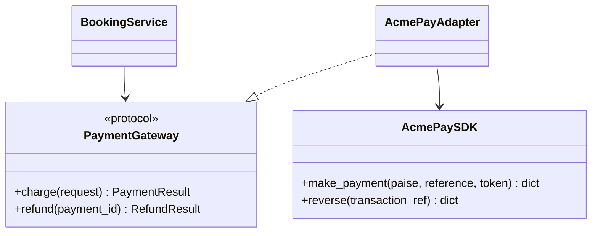
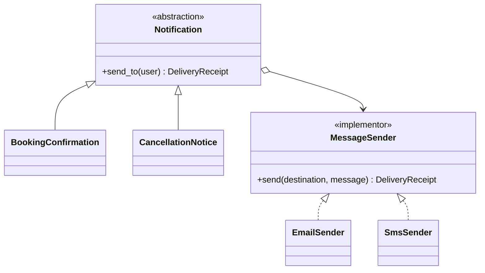
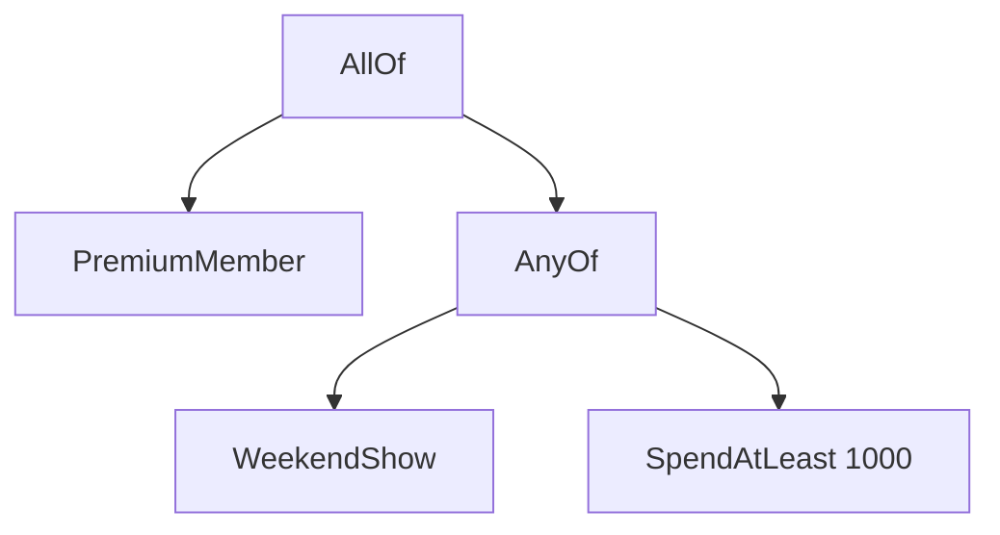
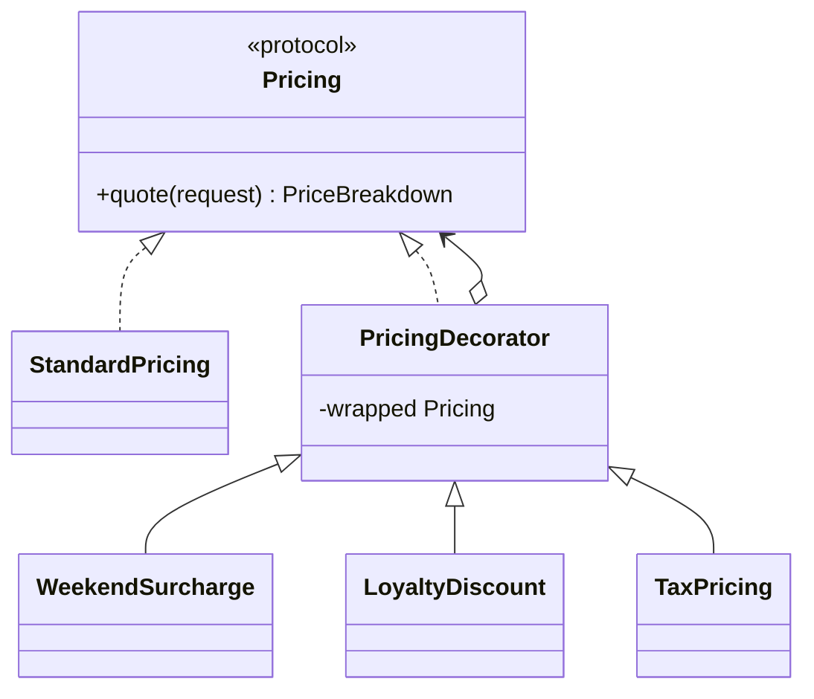
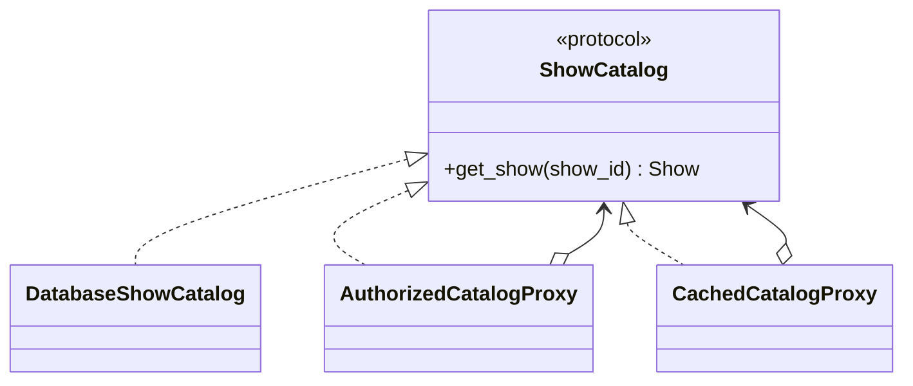
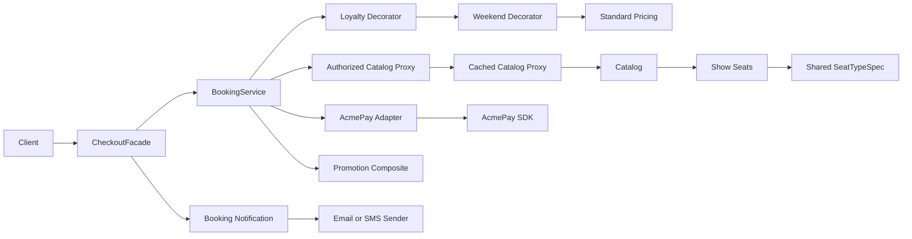

# Topic 7 - Structural Design Patterns

[Curriculum index](../README.md) | [Preparation roadmap](../roadmap.md) |
[Previous topic](./06-creational-design-patterns.md) |
[Next topic](./08-behavioral-design-patterns.md)

- **Category:** Design patterns and object composition
- **Difficulty:** Intermediate to advanced
- **Priority:** Essential
- **Prerequisites:** Topics 2 and 5; Topics 3-4 and 6 recommended
- **Running example:** Movie Ticket Booking integrations, pricing, catalog, and
  customer communication
- **Output:** Small, contract-preserving object structures that integrate
  incompatible code, separate independent dimensions, represent trees, layer
  behavior, simplify subsystems, share immutable state, and control access

## Outcome

After completing this topic, you should be able to:

- Treat object structure as a deliberate design decision rather than accidental
  nesting or inheritance.
- Choose ordinary composition, a function, delegation, or a structural pattern
  at the lowest sufficient complexity.
- Implement Adapter while translating operations, data, errors, units, and
  semantic differences at an external boundary.
- Use Bridge when two dimensions must evolve independently without a subclass
  cross-product.
- Model part-whole trees with Composite while protecting ownership, traversal,
  ordering, and cycle invariants.
- Layer optional behavior with Decorator while preserving the component
  contract and making ordering explicit.
- Design a narrow Facade that exposes a coherent use case without becoming a
  god object or hiding domain rules.
- Use Flyweight only when measurements show that many objects repeat immutable
  intrinsic state.
- Implement protection, caching, virtual, or remote Proxy without silently
  changing the subject's observable contract.
- Distinguish Adapter, Bridge, Composite, Decorator, Facade, Flyweight, Proxy,
  Strategy, and ordinary wrappers precisely.
- Explain identity, equality, mutability, lifecycle, error, concurrency, and
  observability consequences introduced by wrapping and sharing.
- Test both the local object and the seams between structural collaborators.
- Adapt a design to a new provider, channel, rule tree, pricing layer, or access
  policy without broad rewrites.

## Core idea

Structural patterns answer different composition questions:

```text
How can incompatible contracts collaborate?        -> Adapter
How can two dimensions vary independently?          -> Bridge
How can a tree treat leaves and groups uniformly?   -> Composite
How can optional behavior be layered per object?    -> Decorator
How can a subsystem expose one simpler entry point? -> Facade
How can repeated immutable state be shared?         -> Flyweight
How can access to the same contract be controlled?  -> Proxy
```

All seven prefer composition and delegation over a growing inheritance tree.
That does not mean every object containing another object is a pattern.

> Name the structural pressure first. Use the pattern only when its contract
> and trade-off solve that pressure more clearly than direct composition.

## Scope boundary

This topic deeply covers the seven GoF structural patterns:

- Adapter;
- Bridge;
- Composite;
- Decorator;
- Facade;
- Flyweight;
- Proxy.

It also covers Python-native structural tools needed to choose responsibly:

- protocols and abstract base classes;
- delegation and wrapper objects;
- higher-order functions and function decorators;
- immutable dataclasses and value objects;
- mappings, tuples, generators, and tree traversal;
- `functools.wraps`, `cached_property`, and explicit caches;
- module functions as lightweight facades;
- dependency injection and composition-root wiring.

It does not deeply cover:

- Strategy, Command, Observer, State, or other behavioral collaboration;
  Topic 8 covers them;
- repositories, units of work, controllers, dependency-injection containers,
  or application-service architecture; Topic 9 covers them;
- HTTP endpoint design and public error schemas; Topic 10 covers them;
- cache invalidation across processes, distributed authorization, service mesh
  proxies, or network deployment topology;
- performance optimization without measurement.

Examples use Python 3.10+. Code fences are focused excerpts; some reference
domain types introduced by nearby text. Standalone implementations should
include all imports and may use `from __future__ import annotations` for
forward references.

## 1. Learn

### 1.1 Structure is part of behavior

An object graph decides more than where references are stored. Its shape
determines:

- which contract a caller sees;
- which object translates data and failures;
- which dimensions can change independently;
- whether one operation can traverse a whole tree;
- the order in which layered rules execute;
- who can bypass a simplified entry point;
- what state is shared and what remains per occurrence;
- whether access is allowed, delayed, cached, retried, or remote;
- who owns wrapped objects and their cleanup;
- where identity and equality are observed.

Structural design is therefore contract design plus ownership design.

```text
Caller -> visible contract -> structural object -> collaborator(s)
```

For each arrow ask:

1. What data crosses it?
2. Who translates it?
3. Which failures cross it?
4. Is the call transparent, intentionally simplified, or semantically changed?
5. Who owns the dependency's lifetime?

### 1.2 Start with the composition ladder

Escalate only when a smaller mechanism stops expressing the requirement:

1. Direct call.
2. Helper function.
3. Plain object containing a collaborator.
4. Protocol plus one delegated implementation.
5. Explicit wrapper.
6. Small collection/tree of components.
7. Named structural pattern.
8. Framework or infrastructure mechanism.

Example: translating one provider response can be a function. A stateful
provider boundary with charge, refund, idempotency, error mapping, and tests
usually deserves an Adapter object.

### 1.3 Pattern selection map

| Pressure | First candidate | The key proof |
|---|---|---|
| Existing interface does not match our contract | Adapter | Caller is isolated from foreign semantics |
| Two axes create subclass combinations | Bridge | Either axis changes without editing the other |
| Nested parts and groups share operations | Composite | Client handles leaf/group through one contract |
| Optional layers combine at runtime | Decorator | Wrapper remains substitutable and order is deliberate |
| Subsystem is hard to use correctly | Facade | Common use case has one coherent entry point |
| Huge object count repeats stable data | Flyweight | Measurement shows meaningful memory reduction |
| Access must be controlled without changing caller contract | Proxy | Subject semantics remain defined and testable |

If the proof is absent, prefer direct composition.

### 1.4 The wrapper contract

Adapter, Decorator, and Proxy are all wrappers, but their intent differs:

```text
Adapter:   foreign contract -> target contract
Decorator: target contract  -> target contract + layered behavior
Proxy:     target contract  -> controlled access to target contract
```

A wrapper decision must specify:

- visible methods and return types;
- accepted values and normalization;
- exception mapping;
- sync/async behavior;
- identity and equality;
- mutation visibility;
- ordering when wrappers are stacked;
- lifecycle and cleanup;
- thread-safety guarantees;
- logging/metrics attribution.

“Transparent” is a claim to test, not a label to assume.

### 1.5 Adapter: precise intent

**Intent:** convert the interface and semantics of an existing class or system
into the target contract expected by the client.

Participants:

- **Client:** depends on the target contract.
- **Target:** the application-shaped contract.
- **Adaptee:** incompatible SDK, legacy class, file format, or service.
- **Adapter:** translates between target and adaptee.



The Adapter belongs at the boundary. The domain should not import provider
enums, response dictionaries, exception types, minor currency units, or SDK
objects.

### 1.6 Implement an object Adapter

Our application wants rupee `Decimal` values and domain results. A fictional
SDK wants integer paise and returns dictionaries:

```python
from dataclasses import dataclass
from decimal import Decimal, ROUND_HALF_UP
from typing import Protocol


class PaymentDeclined(Exception):
    pass


class PaymentUnavailable(Exception):
    pass


@dataclass(frozen=True)
class PaymentResult:
    provider_reference: str
    approved: bool


class PaymentGateway(Protocol):
    def charge(
        self,
        booking_id: str,
        amount: Decimal,
        payment_token: str,
    ) -> PaymentResult:
        ...


class AcmePayAdapter:
    def __init__(self, sdk: object) -> None:
        self._sdk = sdk

    def charge(
        self,
        booking_id: str,
        amount: Decimal,
        payment_token: str,
    ) -> PaymentResult:
        if amount <= 0 or not amount.is_finite():
            raise ValueError("amount must be finite and positive")

        paise = int(
            (amount * Decimal("100")).quantize(
                Decimal("1"), rounding=ROUND_HALF_UP
            )
        )
        try:
            response = self._sdk.make_payment(
                paise=paise,
                reference=booking_id,
                token=payment_token,
            )
        except TimeoutError as error:
            raise PaymentUnavailable("payment provider timed out") from error

        status = response.get("state")
        if status == "captured":
            return PaymentResult(
                provider_reference=str(response["transaction_ref"]),
                approved=True,
            )
        if status == "declined":
            raise PaymentDeclined(str(response.get("reason", "declined")))
        raise PaymentUnavailable(f"unknown provider state: {status!r}")
```

This translates five things:

1. method name and arguments;
2. rupees to paise;
3. application booking ID to provider reference;
4. provider response to domain result;
5. provider failures to stable application exceptions.

Merely forwarding a call is sometimes enough, but semantic translation is the
real reason an Adapter exists.

### 1.7 Adapter choices

#### Object Adapter versus class Adapter

Prefer an object Adapter using composition:

```python
class CsvInventoryAdapter:
    def __init__(self, legacy_reader: object) -> None:
        self._legacy_reader = legacy_reader
```

Python multiple inheritance can mimic a class Adapter, but it couples the
Adapter to the adaptee hierarchy, constructor, and method-resolution order.
Use it only when inheritance itself is a required extension mechanism.

#### One-way versus two-way Adapter

Most application adapters are one-way: the application calls a provider.
Two-way adapters are rarer and risk coupling both models. Define direction at
each operation rather than promising universal conversion.

#### Thin versus defensive Adapter

A good Adapter may validate provider responses, normalize data, map errors, add
correlation IDs, and reject impossible states. It should not own checkout
policy, seat rules, or complete business workflows.

#### Synchronous versus asynchronous contract

A synchronous SDK cannot honestly implement an asynchronous nonblocking target
just because its call appears inside `async def`. Use a thread boundary or an
actual async client, and document cancellation/timeouts.

### 1.8 Adapter versus related concepts

| Concept | Primary intent | Does visible contract change? |
|---|---|---|
| Adapter | Make incompatible collaborator usable | Yes, adaptee to target |
| Facade | Simplify a coherent subsystem | Usually yes, many APIs to fewer use cases |
| Decorator | Add composable behavior | No, preserves component contract |
| Proxy | Control access to a subject | No, preserves subject contract |
| Mapper | Transform data representation | Data only; may be part of Adapter |
| Gateway/port | Define boundary in application language | Adapter may implement it |

A `PaymentGateway` protocol is a **port**. A provider-specific class translating
Stripe/Acme/legacy calls into it is an **Adapter**. An in-memory fake that
already speaks the port is not automatically an Adapter.

### 1.9 Bridge: precise intent

**Intent:** separate an abstraction from its implementation so the two can
vary independently.

Suppose notifications vary by business abstraction and delivery channel:

```text
Abstractions: BookingConfirmation, CancellationNotice, HoldReminder
Implementors: EmailSender, SmsSender, PushSender
```

Inheritance creates a cross-product:

```text
EmailBookingConfirmation, SmsBookingConfirmation, PushBookingConfirmation,
EmailCancellationNotice, SmsCancellationNotice, ...
```

Bridge composes one dimension inside the other.



“Abstraction” here means the client-facing domain operation, not necessarily an
ABC. “Implementation” means the lower-level operational dimension, not a
private method.

### 1.10 Implement Bridge

```python
from dataclasses import dataclass
from typing import Protocol


@dataclass(frozen=True)
class UserContact:
    name: str
    email: str
    phone: str


class MessageSender(Protocol):
    def send(self, destination: str, message: str) -> str:
        ...


class EmailSender:
    def send(self, destination: str, message: str) -> str:
        return f"email:{destination}:{message}"


class SmsSender:
    def send(self, destination: str, message: str) -> str:
        return f"sms:{destination}:{message}"


class BookingNotification:
    def __init__(self, sender: MessageSender) -> None:
        self._sender = sender

    def send_to(self, user: UserContact, booking_id: str) -> str:
        return self._sender.send(
            self._destination(user),
            f"Booking {booking_id} is confirmed for {user.name}",
        )

    def _destination(self, user: UserContact) -> str:
        if isinstance(self._sender, EmailSender):
            return user.email
        return user.phone
```

The last `isinstance` leaks the implementor dimension back into the
abstraction. Improve the implementor contract so it owns contact selection:

```python
from typing import Protocol


class MessageSender(Protocol):
    def send_to(self, contact: UserContact, message: str) -> str:
        ...


class EmailSender:
    def send_to(self, contact: UserContact, message: str) -> str:
        return f"email:{contact.email}:{message}"


class BookingNotification:
    def __init__(self, sender: MessageSender) -> None:
        self._sender = sender

    def send_to(self, user: UserContact, booking_id: str) -> str:
        message = f"Booking {booking_id} is confirmed for {user.name}"
        return self._sender.send_to(user, message)
```

Now a new notification type edits only the abstraction dimension, and a new
channel edits only the implementor dimension.

### 1.11 Bridge selection and boundaries

Bridge is justified when:

- two dimensions are real and independently extensible;
- the cross-product is already growing or highly likely;
- clients care about one high-level dimension;
- implementations may be selected at construction or runtime;
- inheritance would bind the dimensions too tightly.

Bridge versus Strategy:

- Strategy usually varies one algorithm used by a context.
- Bridge explicitly separates two object hierarchies/dimensions.
- A Bridge implementor can internally use Strategy.
- Do not argue from class shape alone; state the design pressure.

Bridge versus Adapter:

- Bridge is planned separation designed together.
- Adapter commonly connects an existing incompatible collaborator later.
- They can look structurally similar because both delegate.

Python often needs only protocols plus composition, not formal `Abstraction`
and `RefinedAbstraction` base classes.

### 1.12 Composite: precise intent

**Intent:** compose objects into tree structures and let clients treat
individual objects and groups uniformly through a common component contract.

Participants:

- **Component:** common operation.
- **Leaf:** performs the operation directly.
- **Composite:** contains children and combines/delegates the operation.
- **Client:** works through the component contract.

Movie promotions can form a boolean expression tree:



Every node answers the same question: `is_satisfied(context)`.

### 1.13 Implement a safe Composite

```python
from __future__ import annotations

from dataclasses import dataclass
from decimal import Decimal
from typing import Protocol


@dataclass(frozen=True)
class BookingContext:
    is_premium_member: bool
    is_weekend_show: bool
    subtotal: Decimal


class EligibilityRule(Protocol):
    def is_satisfied(self, context: BookingContext) -> bool:
        ...


class PremiumMember:
    def is_satisfied(self, context: BookingContext) -> bool:
        return context.is_premium_member


class WeekendShow:
    def is_satisfied(self, context: BookingContext) -> bool:
        return context.is_weekend_show


@dataclass(frozen=True)
class SpendAtLeast:
    minimum: Decimal

    def is_satisfied(self, context: BookingContext) -> bool:
        return context.subtotal >= self.minimum


class AllOf:
    def __init__(self, *children: EligibilityRule) -> None:
        if not children:
            raise ValueError("AllOf requires at least one child")
        self._children = tuple(children)

    @property
    def children(self) -> tuple[EligibilityRule, ...]:
        return self._children

    def is_satisfied(self, context: BookingContext) -> bool:
        return all(child.is_satisfied(context) for child in self._children)


class AnyOf:
    def __init__(self, *children: EligibilityRule) -> None:
        if not children:
            raise ValueError("AnyOf requires at least one child")
        self._children = tuple(children)

    def is_satisfied(self, context: BookingContext) -> bool:
        return any(child.is_satisfied(context) for child in self._children)
```

Immutable child tuples prevent collection aliasing. Leaves and groups expose
the same narrow query. `AllOf` and `AnyOf` short-circuit in child order; if
rules have side effects, that becomes observable and fragile. Prefer pure
rules.

### 1.14 Composite design decisions

#### Transparent versus safe interface

A transparent Composite puts child-management operations on `Component`, so a
client can call `add()` on any node. A safe Composite exposes `add()` only on
groups, so attempting it on a leaf is impossible or immediately rejected.

In Python, prefer the safe form unless a uniform editing API is a real
requirement.

#### Mutable versus immutable tree

- Immutable tuples make sharing, hashing, and concurrent reads safer.
- Mutable children support editors and dynamic menus but require ownership,
  cycle, version, and synchronization rules.
- Copy-on-write can preserve snapshots while supporting changes.

#### Parent links

Parent links help navigation and removal, but create bidirectional consistency
and possible reference cycles. Add them only when upward traversal is required.

#### Ordering

For UI trees, bills, workflows, and policy explanation, child order may be
observable. Use an ordered collection and test it.

#### Failure aggregation

Decide whether a composite stops on first failure, collects all failures, or
returns an explanation tree. A boolean alone may be insufficient for an
interview requirement such as “tell the user why the coupon failed.”

### 1.15 Composite traversal, ownership, and cycles

Separate business evaluation from structural traversal when clients need both:

```python
from collections.abc import Iterator


def walk_preorder(root: EligibilityRule) -> Iterator[EligibilityRule]:
    yield root
    children = getattr(root, "children", ())
    for child in children:
        yield from walk_preorder(child)
```

For a mutable general graph, this function can recurse forever. A true
Composite promises a tree or acyclic ownership graph. Enforce it when adding a
child:

- reject self-insertion;
- reject an ancestor as a descendant;
- define whether one child can have multiple parents;
- define who owns removal and disposal;
- make bulk changes atomic if observers can see the tree.

Do not use Composite just because `ParkingLot` contains floors and floors
contain spots. It becomes Composite only when leaf and group share a meaningful
operation that clients invoke uniformly.

### 1.16 Decorator: precise intent

**Intent:** attach responsibilities to an object dynamically by wrapping it in
another object implementing the same component contract.

Participants:

- **Component:** shared contract.
- **Concrete component:** base behavior.
- **Decorator:** stores a component and delegates.
- **Concrete decorator:** adds behavior before/after/around delegation.



The component and every decorator must agree on the meaning of input, output,
and failure—not merely have the same method name.

### 1.17 Implement composable pricing Decorators

Use an itemized immutable result so each layer can preserve auditability:

```python
from dataclasses import dataclass
from decimal import Decimal, ROUND_HALF_UP
from typing import Protocol


CENT = Decimal("0.01")


def money(value: Decimal) -> Decimal:
    return value.quantize(CENT, rounding=ROUND_HALF_UP)


@dataclass(frozen=True)
class QuoteRequest:
    base_amount: Decimal
    weekend: bool
    loyalty_member: bool


@dataclass(frozen=True)
class PriceBreakdown:
    items: tuple[tuple[str, Decimal], ...]

    @property
    def total(self) -> Decimal:
        return money(sum((amount for _, amount in self.items), Decimal("0")))

    def append(self, label: str, amount: Decimal) -> "PriceBreakdown":
        return PriceBreakdown(self.items + ((label, money(amount)),))


class Pricing(Protocol):
    def quote(self, request: QuoteRequest) -> PriceBreakdown:
        ...


class StandardPricing:
    def quote(self, request: QuoteRequest) -> PriceBreakdown:
        if request.base_amount < 0 or not request.base_amount.is_finite():
            raise ValueError("base amount must be finite and non-negative")
        return PriceBreakdown((("base", money(request.base_amount)),))


class WeekendSurcharge:
    def __init__(self, wrapped: Pricing, rate: Decimal) -> None:
        if rate < 0 or not rate.is_finite():
            raise ValueError("rate must be finite and non-negative")
        self._wrapped = wrapped
        self._rate = rate

    def quote(self, request: QuoteRequest) -> PriceBreakdown:
        current = self._wrapped.quote(request)
        if not request.weekend:
            return current
        return current.append("weekend surcharge", current.total * self._rate)


class LoyaltyDiscount:
    def __init__(self, wrapped: Pricing, rate: Decimal) -> None:
        if rate < 0 or rate > 1 or not rate.is_finite():
            raise ValueError("rate must be between zero and one")
        self._wrapped = wrapped
        self._rate = rate

    def quote(self, request: QuoteRequest) -> PriceBreakdown:
        current = self._wrapped.quote(request)
        if not request.loyalty_member:
            return current
        return current.append("loyalty discount", -(current.total * self._rate))
```

Composition is explicit:

```python
from decimal import Decimal


pricing = LoyaltyDiscount(
    WeekendSurcharge(StandardPricing(), Decimal("0.25")),
    Decimal("0.10"),
)
```

The discount applies after the surcharge. Reversing the layers can change both
the item amounts and total. The composition root must own and test the order.

### 1.18 Decorator ordering and transparency

Decorators are not automatically commutative:

```text
Tax(Discount(Base)) != Discount(Tax(Base))
Retry(Timeout(Remote)) != Timeout(Retry(Remote))
Authorize(Cache(Data)) may leak cached data before authorization
Cache(Authorize(Data)) may mix results between principals
```

Document:

- the canonical layer order;
- which layer sees original versus transformed inputs;
- whether failure stops outer layers;
- whether metrics count attempts or logical calls;
- whether caching occurs before or after authorization;
- whether the returned wrapper must expose base-object metadata.

When the wrapper cannot preserve the component's promises, either widen the
contract explicitly or use a differently named pipeline stage.

### 1.19 Decorator versus alternatives

| Alternative | Prefer it when |
|---|---|
| Subclass | Behavior is fixed by type and combinations are few |
| Strategy | One complete algorithm is selected, not layered |
| Chain of Responsibility | Handlers may stop/forward a request through a chain |
| Middleware/pipeline | Stages transform a request/response under a pipeline contract |
| Function decorator | Call behavior of a function/method is being wrapped |
| Plain conditional | One stable optional rule is simplest inline |

Object Decorator is unrelated to Python's `@decorator` syntax by intent,
although a function decorator also wraps a callable:

```python
from functools import wraps
from time import monotonic
from typing import Callable, TypeVar


R = TypeVar("R")


def timed(function: Callable[..., R]) -> Callable[..., R]:
    @wraps(function)
    def wrapper(*args: object, **kwargs: object) -> R:
        started = monotonic()
        try:
            return function(*args, **kwargs)
        finally:
            elapsed = monotonic() - started
            print(f"{function.__name__}: {elapsed:.3f}s")

    return wrapper
```

`functools.wraps` preserves function metadata; it does not prove equivalent
exceptions, latency, retries, or side effects.

### 1.20 Decorator state, identity, and lifecycle

Questions that often expose weak designs:

- Is `decorated is base`? No.
- Should `decorated == base`? Usually avoid cross-type equality unless required.
- Where does mutable state live?
- Can one base object be wrapped by multiple stateful decorators?
- Does closing the outer decorator close the inner object?
- Can callers unwrap and bypass policy?
- Are decorators safe to share across threads?
- How is the active chain displayed for debugging?

A readable `describe()` or construction-time list of layer names can improve
operability without exposing the wrapped object for mutation.

### 1.21 Facade: precise intent

**Intent:** provide a unified, higher-level interface to a set of subsystem
interfaces so common client workflows are easier and safer to invoke.

A Facade changes the client's view from many low-level steps to a coherent use
case:

```text
Without facade:
client -> catalog -> seat hold -> pricing -> payment -> ticket -> notification

With facade:
client -> CheckoutFacade.confirm_purchase(command)
                     -> coordinates subsystem APIs
```

The Facade does not make underlying objects disappear. It defines an intended
entry point for common clients.

### 1.22 Implement a narrow Facade

```python
from dataclasses import dataclass
from decimal import Decimal
from typing import Protocol


@dataclass(frozen=True)
class CheckoutCommand:
    user_id: str
    show_id: str
    seat_ids: tuple[str, ...]
    payment_token: str


@dataclass(frozen=True)
class CheckoutResult:
    booking_id: str
    total: Decimal
    ticket_reference: str


class BookingWorkflow(Protocol):
    def hold(self, user_id: str, show_id: str, seat_ids: tuple[str, ...]) -> object:
        ...

    def confirm(self, booking_id: str, payment_token: str) -> object:
        ...


class TicketIssuer(Protocol):
    def issue(self, booking: object) -> str:
        ...


class CheckoutFacade:
    def __init__(self, booking: BookingWorkflow, tickets: TicketIssuer) -> None:
        self._booking = booking
        self._tickets = tickets

    def checkout(self, command: CheckoutCommand) -> CheckoutResult:
        pending = self._booking.hold(
            command.user_id,
            command.show_id,
            command.seat_ids,
        )
        confirmed = self._booking.confirm(
            pending.booking_id,
            command.payment_token,
        )
        ticket_reference = self._tickets.issue(confirmed)
        return CheckoutResult(
            booking_id=confirmed.booking_id,
            total=confirmed.total,
            ticket_reference=ticket_reference,
        )
```

This excerpt demonstrates shape, not production transaction semantics. A real
design must state what happens if payment succeeds and ticket issuance fails.
The Facade must not disguise missing compensation, idempotency, or transaction
boundaries.

### 1.23 Facade boundaries

A focused Facade:

- represents one client-facing capability or bounded set of use cases;
- accepts application-shaped commands and returns stable results;
- coordinates through narrow subsystem contracts;
- preserves domain invariants in their rightful owners;
- maps low-level details only at the appropriate boundary;
- remains testable with injected collaborators.

A god Facade:

- exposes unrelated catalog, booking, reporting, admin, payment, and user APIs;
- owns every rule and data collection;
- returns internal objects indiscriminately;
- grows one method for every feature;
- becomes the only place any change can be made.

Facade versus application service: they often overlap in real code. “Facade”
emphasizes simplifying a subsystem for clients; “application service”
emphasizes coordinating a use case. Classification matters less than keeping
the boundary cohesive and semantics explicit.

Facade versus Mediator: a Facade gives outside clients a simpler entry point;
a Mediator changes how peer objects communicate internally.

### 1.24 Flyweight: precise intent

**Intent:** support large numbers of fine-grained objects efficiently by
sharing common immutable intrinsic state while clients provide varying
extrinsic state.

Movie shows repeat seat metadata:

```text
Intrinsic, shareable: seat type label, display color, amenities
Extrinsic, per show:   show_id, seat_id, price, availability, hold owner
```

Before choosing Flyweight, measure:

- number of live objects;
- repeated-state size;
- memory retained by the repeated fields;
- lookup/cache overhead;
- allocation and garbage-collection cost;
- whether shared state can truly be immutable.

### 1.25 Implement immutable Flyweights

```python
from dataclasses import dataclass
from threading import RLock


@dataclass(frozen=True, slots=True)
class SeatTypeSpec:
    code: str
    label: str
    color: str
    recliner: bool


class SeatTypeFactory:
    def __init__(self) -> None:
        self._items: dict[tuple[str, str, str, bool], SeatTypeSpec] = {}
        self._lock = RLock()

    def get(
        self,
        code: str,
        label: str,
        color: str,
        recliner: bool,
    ) -> SeatTypeSpec:
        key = (code.strip().upper(), label.strip(), color.strip(), recliner)
        if not all(key[:3]):
            raise ValueError("seat type fields cannot be blank")
        with self._lock:
            existing = self._items.get(key)
            if existing is not None:
                return existing
            created = SeatTypeSpec(*key)
            self._items[key] = created
            return created

    @property
    def size(self) -> int:
        with self._lock:
            return len(self._items)


@dataclass
class ShowSeat:
    show_id: str
    seat_id: str
    seat_type: SeatTypeSpec
    available: bool = True
    held_by: str | None = None
```

The flyweight contains no `show_id`, mutable availability, price, or hold
owner. Shared intrinsic objects are frozen and slotted. Extrinsic context stays
on `ShowSeat` or is passed into an operation.

### 1.26 Flyweight identity, keys, and cache ownership

Flyweight usually implies interning: equal keys return the same instance.

```python
standard_a = factory.get("std", "Standard", "blue", False)
standard_b = factory.get("STD", "Standard", "blue", False)
assert standard_a is standard_b
```

Define:

- canonical key normalization;
- whether identity (`is`) is part of the promise or only an optimization;
- whether the cache is bounded, scoped, or weakly referenced;
- who owns and clears it;
- behavior under concurrent creation;
- whether instances can hold references back to extrinsic objects.

Do not create a global immortal cache by reflex. Application-scoped factories
are easier to test and can be discarded as a unit. Weak references help only
when no other strong references keep flyweights alive, and `WeakValueDictionary`
introduces its own concurrency and lifetime semantics.

### 1.27 Flyweight versus ordinary values and caching

- An immutable value object may be duplicated; a Flyweight deliberately shares
  canonical instances to reduce cost.
- A cache avoids repeated computation or I/O; a Flyweight avoids repeated
  representation of intrinsic state.
- An enum is a useful fixed set of shared values, but not every enum is a
  Flyweight pattern implementation.
- A database identity map preserves one object per database identity in a unit
  of work; its purpose and lifetime differ.
- Python already interns some values. Never rely on incidental string/integer
  identity for domain correctness.

If a normal frozen dataclass is small and object count is modest, stop there.

### 1.28 Proxy: precise intent

**Intent:** provide a surrogate or placeholder that exposes the subject's
contract while controlling access to the real subject.

Common variants:

- **Virtual Proxy:** create/load expensive subject lazily.
- **Protection Proxy:** enforce authorization.
- **Caching Proxy:** reuse safe results.
- **Remote Proxy:** represent a subject across a transport boundary.
- **Logging/monitoring Proxy:** observe access while preserving behavior.
- **Smart reference:** count/lease/lock access, used cautiously.



Like Decorator, Proxy preserves a contract. Proxy's primary intent is access
control to a subject, not freely composing domain responsibilities.

### 1.29 Implement a protection Proxy

```python
from dataclasses import dataclass
from typing import Protocol


@dataclass(frozen=True)
class Principal:
    user_id: str
    permissions: frozenset[str]


class ReportStore(Protocol):
    def get_sales_report(self, theatre_id: str) -> str:
        ...


class Forbidden(Exception):
    pass


class AuthorizedReportProxy:
    def __init__(self, principal: Principal, subject: ReportStore) -> None:
        self._principal = principal
        self._subject = subject

    def get_sales_report(self, theatre_id: str) -> str:
        permission = f"theatre:{theatre_id}:sales:read"
        if permission not in self._principal.permissions:
            raise Forbidden("sales report access denied")
        return self._subject.get_sales_report(theatre_id)
```

Authorization must occur before any cache or subject access that could leak
data. If the proxy is shared, storing a mutable “current user” inside it is
unsafe; prefer a request-scoped proxy or pass an immutable security context.

### 1.30 Implement a bounded caching Proxy

```python
from collections import OrderedDict
from threading import RLock
from typing import Callable, Generic, Protocol, TypeVar


T = TypeVar("T")


class Loader(Protocol[T]):
    def get(self, key: str) -> T:
        ...


class LruCachingProxy(Generic[T]):
    def __init__(self, subject: Loader[T], capacity: int = 128) -> None:
        if capacity <= 0:
            raise ValueError("capacity must be positive")
        self._subject = subject
        self._capacity = capacity
        self._items: OrderedDict[str, T] = OrderedDict()
        self._lock = RLock()

    def get(self, key: str) -> T:
        with self._lock:
            if key in self._items:
                self._items.move_to_end(key)
                return self._items[key]

        loaded = self._subject.get(key)

        with self._lock:
            existing = self._items.get(key)
            if existing is not None:
                self._items.move_to_end(key)
                return existing
            self._items[key] = loaded
            if len(self._items) > self._capacity:
                self._items.popitem(last=False)
            return loaded

    def invalidate(self, key: str) -> None:
        with self._lock:
            self._items.pop(key, None)
```

This prevents map races but may perform the same load concurrently. Whether
single-flight loading is required depends on cost and subject safety. It also
has no time-to-live or mutation notification. A truthful caching contract must
define freshness, invalidation, failure caching, scope, and copy/alias behavior.

### 1.31 Remote and virtual Proxy semantics

A remote proxy cannot be perfectly transparent:

- latency is orders of magnitude higher;
- calls can time out after the remote action succeeded;
- serialization loses some types/identity;
- partial failure and retry appear;
- authentication and tracing cross the boundary;
- pagination or streaming may replace an in-memory collection;
- cancellation and deadlines matter.

Do not make a network call look like a cheap property access. Prefer explicit
methods and async/deadline-aware contracts.

A virtual proxy should define when loading occurs and how loading failure is
remembered:

```python
from functools import cached_property
from pathlib import Path


class Poster:
    def __init__(self, path: Path) -> None:
        self._path = path

    @cached_property
    def bytes(self) -> bytes:
        return self._path.read_bytes()
```

`cached_property` is a lightweight lazy-value alternative. It is not a full
subject Proxy, and concurrent first access may require extra synchronization
depending on the required guarantee and Python version.

### 1.32 Proxy versus related patterns

| Pattern | Wraps same contract? | Main reason |
|---|---:|---|
| Adapter | No | Translate incompatible interface/semantics |
| Decorator | Yes | Add composable responsibility |
| Proxy | Yes | Control access to subject |
| Facade | Usually no | Simplify a subsystem for clients |
| Strategy | N/A | Replace an algorithm used by context |

One class can perform multiple roles, but that increases review burden. An
`AuthorizedCachedRemoteCatalog` mixes protection, cache, and transport
translation. Prefer small layers with explicit order when policies vary or
need independent tests.

### 1.33 Python dynamic proxy alternatives

`__getattr__` can forward unknown attributes:

```python
class ForwardingProxy:
    def __init__(self, subject: object) -> None:
        self._subject = subject

    def __getattr__(self, name: str) -> object:
        return getattr(self._subject, name)
```

This is concise but often too broad:

- special methods such as `len(proxy)` use type lookup and may not forward;
- static type checking loses a clear contract;
- new subject methods may bypass policy accidentally;
- introspection, pickling, equality, and descriptors can surprise;
- typos may leak through to the wrapped object;
- authorization/auditing coverage becomes hard to prove.

Prefer explicit methods for policy-bearing proxies. Dynamic forwarding is more
suitable for tightly controlled infrastructure with strong contract tests.

### 1.34 Pattern comparison by change pressure

| Pattern | What varies? | Client sees | Central risk |
|---|---|---|---|
| Adapter | Foreign interface/semantics | Target contract | Leaky provider model |
| Bridge | Abstraction and implementation axes | Abstraction | Imaginary second dimension |
| Composite | Leaf/group structure | Component | Cycles and unclear ownership |
| Decorator | Optional behavior layers | Component | Order and broken substitutability |
| Facade | Subsystem complexity | Simplified use case | God object/hidden failure |
| Flyweight | Repeated intrinsic state | Shared value + context | Shared mutability/global cache |
| Proxy | Access policy/location/laziness | Subject contract | Semantic surprise/staleness |

### 1.35 Combining structural patterns without pattern soup

A coherent movie-booking graph may use:

```text
CheckoutFacade
  -> BookingService
       -> LoyaltyDiscount(WeekendSurcharge(StandardPricing))  [Decorator]
       -> AuthorizedCatalogProxy(CachedCatalogProxy(Catalog)) [Proxy]
       -> AcmePayAdapter(AcmePaySDK)                           [Adapter]
  -> BookingNotification(EmailSender)                         [Bridge]

Promotion policy -> AllOf(PremiumMember, AnyOf(...))          [Composite]
Show seats ------> shared immutable SeatTypeSpec               [Flyweight]
```

This is not a target pattern count. Each line needs its own requirement and
test. If the system has one payment provider, one notification type, 500 seat
objects, and no access policy, several layers should disappear.

## 2. Recognize

### 2.1 Requirement signals

Adapter signals:

- “Integrate this legacy/third-party API without changing the domain.”
- “Provider uses different units, states, or exceptions.”
- “We may replace vendors but our application contract should stay stable.”

Bridge signals:

- “Notification type and delivery channel both keep expanding.”
- “Avoid one subclass for every device/theme, report/format, or message/channel
  combination.”

Composite signals:

- “Rules/folders/menu items/components can contain other items of the same
  conceptual kind.”
- “Perform, total, render, validate, or evaluate one node or a whole tree
  uniformly.”

Decorator signals:

- “Apply any combination of surcharge, coupon, tax, logging, compression, or
  retry layers at runtime.”
- “Avoid a subclass for every combination.”

Facade signals:

- “Clients repeatedly call five services in a fragile order.”
- “Expose a smaller stable API over a complicated subsystem.”

Flyweight signals:

- “Millions of small objects repeat the same large immutable metadata.”
- “Profiling shows retained memory from duplicated state.”

Proxy signals:

- “Authorize, cache, lazy-load, rate-limit, or remotely access the same subject
  contract.”

### 2.2 Structural smells

- Provider dictionaries and exception types spread through domain services.
- Parallel inheritance trees create class-name combinations.
- Client code recurses with separate leaf and group branches everywhere.
- Optional behaviors produce nested `if` statements or subclass explosions.
- Controllers know a fragile order of low-level subsystem calls.
- Thousands of objects duplicate a large identical configuration.
- Authorization or caching is copied into every subject implementation.
- `__getattr__` wrappers hide what operations are actually controlled.
- A wrapper returns a different meaning while claiming transparency.
- Shared mutable objects leak state between requests or tests.

### 2.3 False positives

- One API-renaming function does not require an Adapter class.
- One context with two algorithms is usually Strategy, not Bridge.
- Ordinary containment is not Composite without a uniform component operation.
- One conditional surcharge need not become a Decorator hierarchy.
- Any service class is not automatically a Facade.
- An object cache is not automatically Flyweight.
- A test fake implementing a port is not automatically Proxy or Adapter.
- Dependency injection is composition, not one of the seven patterns.

### 2.4 Decision questions

Before selecting a structural pattern, answer:

1. What exact structural pressure exists today?
2. What contract does the caller need?
3. Which object owns translation, layering, traversal, sharing, or access?
4. Can a function or ordinary composition express it clearly?
5. What identity/equality behavior is observable?
6. What mutable state is shared?
7. Who owns lifetime and cleanup?
8. What failures are mapped, propagated, aggregated, or retried?
9. Is ordering observable?
10. What happens under concurrent access?
11. How will clients inspect/debug the structure?
12. Which test proves the pattern earns its cost?

## 3. Model

### 3.1 Running example: pressure inventory

Do not begin by drawing seven patterns. Begin with requirements:

| Requirement | Structural pressure | Candidate |
|---|---|---|
| AcmePay SDK uses paise/dictionaries/provider states | Incompatible boundary | Adapter |
| Booking/cancellation messages go through email/SMS | Two independent dimensions | Bridge |
| Promotion rules nest with AND/OR/NOT | Part-whole rule tree | Composite |
| Weekend, loyalty, coupon, tax layers combine | Optional ordered behavior | Decorator |
| Client needs one safe checkout entry point | Subsystem complexity | Facade |
| 500,000 show seats repeat rich type metadata | Measured repeated state | Flyweight |
| Catalog reads require authorization and caching | Controlled subject access | Proxy |

Now challenge each candidate:

- If only AcmePay exists but its contract differs, Adapter remains justified.
- If there is one message type, a `MessageSender` Strategy may be sufficient;
  Bridge has not yet earned two hierarchies.
- If rules never nest, a list with `all()` may be sufficient.
- If pricing has one optional weekend branch, a conditional may be clearer.
- If the client already calls one application service, another Facade is
  redundant.
- If memory is not a problem, immutable values are enough without Flyweight.
- If the catalog is local and public, a direct repository is enough.

### 3.2 Structural context diagram



Mark semantic boundaries on a diagram, not only class names:

- `AcmePayAdapter` owns foreign translation.
- pricing wrappers own a documented order;
- catalog proxies preserve the `ShowCatalog` contract;
- `CheckoutFacade` owns orchestration, not seat or payment invariants;
- `SeatTypeSpec` is immutable intrinsic data;
- rule nodes are pure and safely nestable.

### 3.3 Adapter translation table

Before coding a provider Adapter, write the mapping:

| Application | Provider | Translation owner |
|---|---|---|
| `Decimal("12.34")` INR | `1234` paise | Adapter |
| `booking_id` | idempotency/reference field | Adapter |
| `PaymentMethod.CARD` | token created by client/provider | API boundary + Adapter |
| `captured` | approved result | Adapter |
| `declined` | `PaymentDeclined` | Adapter |
| provider timeout | `PaymentUnavailable` with cause | Adapter |
| unknown state | explicit integration failure | Adapter |

Never map an unknown provider state to success. Decide whether a timeout means
“failed,” “unknown outcome,” or “retryable unavailable.” Payment outcomes often
need a third **unknown/pending reconciliation** state because the provider may
have processed a timed-out request.

### 3.4 Bridge dimension table

| Abstraction dimension | Implementor dimension |
|---|---|
| Booking confirmation content | Email delivery |
| Cancellation content | SMS delivery |
| Hold-expiry reminder content | Push delivery |

Each abstraction owns message meaning and required domain data. Each
implementor owns address selection, provider formatting constraints, transport,
and delivery result mapping.

Check independence:

- Adding `PushSender` changes no notification subclasses.
- Adding `RefundNotification` changes no sender implementations.
- Replacing the SMS vendor changes the SMS-side Adapter, not message content.

### 3.5 Composite rule grammar

Define the allowed tree explicitly:

```text
Rule := PremiumMember
      | WeekendShow
      | SpendAtLeast(amount)
      | AllOf(Rule, Rule, ...)
      | AnyOf(Rule, Rule, ...)
      | Not(Rule)
```

Then define invariants:

- groups contain at least one child;
- `Not` contains exactly one child;
- tree depth and node count may be bounded for user-supplied policies;
- rule nodes are immutable after publication;
- evaluation is deterministic for one context;
- child order controls short-circuiting and explanation order;
- malformed serialized trees are rejected before evaluation;
- evaluation never executes arbitrary code from configuration.

### 3.6 Decorator order table

Price composition should be auditable, not a nest that only the author can
decode:

| Position | Layer | Basis | Example |
|---:|---|---|---:|
| 1 | Standard seat price | selected seats | 1000.00 |
| 2 | Weekend surcharge | current subtotal | +250.00 |
| 3 | Loyalty discount | current subtotal | -125.00 |
| 4 | Fixed coupon | current subtotal, floor at zero | -100.00 |
| 5 | Tax | taxable components under domain rule | +184.50 |

Do not assume this order is legally or commercially correct; obtain the rule.
Record whether discounts reduce the taxable base, how rounding works per line,
and whether the total can become negative.

### 3.7 Facade responsibility map

| Responsibility | Owner |
|---|---|
| Validate request shape/authentication | API/controller boundary |
| Verify seat availability and atomically hold | Booking domain service/aggregate |
| Calculate itemized total | Pricing component chain |
| Translate provider call | Payment Adapter |
| Preserve payment idempotency/state | Payment workflow/domain owner |
| Confirm booking state transition | Booking owner |
| Issue ticket | Ticket issuer |
| Orchestrate common checkout use case | Checkout Facade/application service |
| Compensate/reconcile partial failure | Explicit workflow policy |

The Facade may invoke responsibilities; it does not absorb all of them.

### 3.8 Flyweight state split

Use a table to prevent accidental shared mutation:

| Field | Intrinsic/shareable? | Reason |
|---|---:|---|
| Seat type code | Yes | canonical metadata |
| Display name/color | Yes | stable presentation metadata in scope |
| Recliner capability | Yes | type-level fact |
| Physical seat ID | No | occurrence identity |
| Show ID | No | occurrence context |
| Current price | Usually no | varies by show/time/pricing |
| Availability | No | mutable per show seat |
| Hold owner/expiry | No | mutable transaction state |

If a supposedly intrinsic field changes by theatre or tenant, include that
dimension in the flyweight key or move it to extrinsic state.

### 3.9 Proxy policy table

For each proxy, write what it may change:

| Concern | Must define |
|---|---|
| Authorization | principal source, permission granularity, denial error |
| Cache | key, value aliasing, TTL, invalidation, capacity, tenant scope |
| Lazy load | trigger, failure memory, concurrency, disposal |
| Remote | deadline, retry, idempotency, serialization, error mapping |
| Metrics | logical calls versus attempts, sensitive labels |

Wrapper order is security-sensitive:

```text
request-scoped AuthorizedProxy(
    tenant-scoped CachedProxy(
        DatabaseCatalog()
    )
)
```

This can be correct only if cached values are safe for every authorized user in
the same tenant and authorization occurs before returning them. If row-level
visibility differs per user, the cache must include visibility context or sit
inside the authorization-aware subject.

### 3.10 Contract and ownership ledger

| Object | Visible contract | Owns dependency? | Shared scope | Cleanup |
|---|---|---:|---|---|
| `AcmePayAdapter` | `PaymentGateway` | Usually no | app/request | SDK-specific |
| `BookingNotification` | notification use case | no | transient | none |
| `AllOf` | `EligibilityRule` | immutable children | config/app | none |
| pricing decorator | `Pricing` | usually no | app | none |
| `CheckoutFacade` | checkout use case | no | app/request | none |
| `SeatTypeFactory` | flyweight lookup | yes, cache | app/tenant | discard cache |
| catalog proxy | `ShowCatalog` | explicit | app/request | delegate policy |

“Contains reference” does not always mean “owns lifetime.” State it.

### 3.11 Pattern decision record

Use a short interview-ready record:

```text
Pressure:
Simplest rejected alternative:
Chosen structure:
Visible contract:
Translation/layer/access rules:
Identity and mutability:
Ownership and lifetime:
Failure and concurrency behavior:
Evidence/test:
Removal trigger:
```

The removal trigger matters. For example: “Remove Flyweight if profiling no
longer shows meaningful savings or if metadata becomes occurrence-specific.”

## 4. Implement

### 4.1 Define contracts from client needs

Do not copy a provider SDK into your port:

```python
from decimal import Decimal
from typing import Protocol


class PaymentGateway(Protocol):
    def charge(
        self,
        booking_id: str,
        amount: Decimal,
        idempotency_key: str,
    ) -> str:
        ...
```

The application chooses a stable minimal capability. Each provider Adapter
translates to it. If one provider lacks a required semantic guarantee, do not
hide the mismatch; change provider, emulate deliberately, or widen the contract
truthfully.

### 4.2 Keep provider data at the boundary

Convert eagerly:

```python
from dataclasses import dataclass
from datetime import datetime, timezone
from decimal import Decimal


@dataclass(frozen=True)
class ProviderCharge:
    reference: str
    amount: Decimal
    captured_at: datetime


def map_charge(payload: dict[str, object]) -> ProviderCharge:
    try:
        captured_at = datetime.fromtimestamp(
            int(payload["captured_at"]), tz=timezone.utc
        )
        amount = Decimal(int(payload["amount_paise"])) / Decimal("100")
        reference = str(payload["id"])
    except (KeyError, TypeError, ValueError) as error:
        raise ValueError("invalid provider charge payload") from error
    return ProviderCharge(reference, amount, captured_at)
```

Avoid keeping raw mutable payload dictionaries inside domain entities.

### 4.3 Preserve exception causes

```python
class CatalogUnavailable(Exception):
    pass


def load_show(adapter: object, show_id: str) -> object:
    try:
        return adapter.fetch_show(show_id)
    except TimeoutError as error:
        raise CatalogUnavailable("catalog timed out") from error
```

Exception chaining preserves diagnostics. Map only errors whose semantics the
boundary understands; programming errors should not become generic
“unavailable” failures.

### 4.4 Prefer capabilities over type checks in Bridge

Bad:

```python
def send(notification: object, channel: object) -> None:
    if channel.__class__.__name__ == "EmailSender":
        channel.send(notification.user.email, notification.text)
    else:
        channel.send(notification.user.phone, notification.text)
```

Better: give the implementor an application-shaped contact value and let each
implementation choose/validate its destination. Do not add a new conditional
to the abstraction for every implementor.

### 4.5 Return explanations from policy Composites

A richer component contract can retain tree structure:

```python
from dataclasses import dataclass


@dataclass(frozen=True)
class RuleResult:
    passed: bool
    code: str
    children: tuple["RuleResult", ...] = ()


class AllOf:
    def __init__(self, *rules: object) -> None:
        if not rules:
            raise ValueError("rules cannot be empty")
        self._rules = tuple(rules)

    def evaluate(self, context: object) -> RuleResult:
        results = tuple(rule.evaluate(context) for rule in self._rules)
        return RuleResult(
            passed=all(result.passed for result in results),
            code="all_of",
            children=results,
        )
```

This intentionally evaluates every child to explain all failures. That differs
from short-circuit `all()`. Model the required semantics before optimizing.

### 4.6 Serialize a Composite safely

Use an allowlisted discriminator map, not arbitrary imports/evaluation:

```python
from collections.abc import Callable, Mapping


RuleBuilder = Callable[[Mapping[str, object]], object]


def build_rule(
    data: Mapping[str, object],
    builders: Mapping[str, RuleBuilder],
) -> object:
    kind = str(data.get("type", "")).strip().lower()
    try:
        builder = builders[kind]
    except KeyError as error:
        raise ValueError(f"unsupported rule type: {kind!r}") from error
    return builder(data)
```

Recursive builders should enforce maximum depth/node count and validate fields
at every node.

### 4.7 Make decorator composition readable

Centralize order at the composition root:

```python
from decimal import Decimal


def production_pricing() -> Pricing:
    pricing: Pricing = StandardPricing()
    pricing = WeekendSurcharge(pricing, Decimal("0.25"))
    pricing = LoyaltyDiscount(pricing, Decimal("0.10"))
    return pricing
```

Repeated condition-based construction can move to a small explicit function or
factory. Avoid a global registry that lets arbitrary import order decide
financial behavior.

### 4.8 Preserve immutable return values in decorators

Mutating a wrapped result can corrupt caches or other callers:

```python
def apply_discount_risky(result, discount) -> None:
    # Risky when the wrapped component shares this list.
    result.items.append(("discount", discount))


def apply_discount_safely(result, discount):
    # Safer value-style transformation.
    return PriceBreakdown(result.items + (("discount", -discount),))
```

For mutable outputs, define copy ownership. For large outputs, a persistent
structure or builder may be appropriate, but measure first.

### 4.9 Make Facade commands and results explicit

Avoid long positional methods and raw tuples. Immutable command/result objects:

- make the use case readable;
- give input evolution a named boundary;
- prevent leaking entire subsystem models;
- simplify testing and serialization;
- provide a place for idempotency/correlation metadata.

Do not put domain behavior into data-only commands.

### 4.10 Handle partial Facade failure explicitly

For multi-step work, write the failure table before implementation:

| Last successful step | Next failure | Required outcome |
|---|---|---|
| Seat hold | payment declined | keep/release hold per stated policy |
| Payment captured | booking confirmation persistence | mark reconciliation needed; do not blindly recharge |
| Booking confirmed | ticket rendering | booking stays confirmed; retry ticket generation |
| Ticket issued | notification | do not roll back purchase; retry/record delivery |

A `try/except Exception: undo_everything()` block is rarely correct. Different
effects have different reversibility and ownership.

### 4.11 Separate flyweight lookup from domain decisions

The flyweight factory should canonicalize and share specs; it should not decide
seat pricing or availability:

```python
seat_type = seat_types.get("VIP", "VIP Recliner", "gold", True)
show_seat = ShowSeat(show_id="show-1", seat_id="A1", seat_type=seat_type)
```

If construction requires database I/O, configuration versioning, or tenant
selection, name those dependencies and scope the cache accordingly.

### 4.12 Bound caches and expose observability

Useful operational signals include:

- hit/miss/eviction counts;
- current entry count and capacity;
- load latency and failure count;
- invalidation count;
- key cardinality without logging sensitive raw keys;
- stale-serving decisions.

Do not make metrics part of the domain result. Inject or emit them at the proxy
boundary.

### 4.13 Avoid cache alias leaks

If a proxy caches mutable objects, callers can modify the cached value:

```python
from copy import deepcopy


class CopyingCache:
    def __init__(self, subject: object) -> None:
        self._subject = subject
        self._cache: dict[str, object] = {}

    def get(self, key: str) -> object:
        if key not in self._cache:
            self._cache[key] = deepcopy(self._subject.get(key))
        return deepcopy(self._cache[key])
```

Blind `deepcopy` is not universally safe for locks, sessions, ORM objects, and
large graphs. Prefer immutable snapshots or a deliberate copy method.

### 4.14 Use lock scope deliberately

Never hold a cache lock during slow I/O unless single-flight behavior and
contention cost are intentional. Options:

- allow duplicate concurrent loads and reconcile results;
- keep a per-key lock/future;
- use a mature bounded cache abstraction;
- preload immutable data;
- move caching to infrastructure that owns consistency.

State whether failures are cached. A cached timeout can turn a short outage into
a longer artificial outage.

### 4.15 Async wrappers preserve cancellation and deadlines

```python
import asyncio
from typing import Awaitable, Callable, TypeVar


T = TypeVar("T")


async def with_timeout(operation: Awaitable[T], seconds: float) -> T:
    if seconds <= 0:
        raise ValueError("seconds must be positive")
    async with asyncio.timeout(seconds):
        return await operation
```

Retries must not swallow `CancelledError`, duplicate non-idempotent actions, or
reset the overall deadline on every attempt. Timeout and retry ordering is a
semantic decision, not just wrapper syntax.

### 4.16 Structural composition root

Wire policy visibly:

```python
from decimal import Decimal


def build_checkout(
    sdk: object,
    catalog: object,
    principal: Principal,
    ticket_issuer: TicketIssuer,
) -> CheckoutFacade:
    payment = AcmePayAdapter(sdk)
    protected_catalog = AuthorizedCatalogProxy(principal, catalog)
    pricing = LoyaltyDiscount(
        WeekendSurcharge(StandardPricing(), Decimal("0.25")),
        Decimal("0.10"),
    )
    booking = BookingApplication(protected_catalog, payment, pricing)
    return CheckoutFacade(booking, ticket_issuer)
```

The undefined concrete application classes are intentional placeholders in
this focused wiring excerpt. The important property is that dependencies and
wrapper order are visible in one place rather than hidden in constructors or
global lookups.

## 5. Test structural designs

### 5.1 Test at three levels

1. **Component contract:** every implementation honors the same behavior.
2. **Structural role:** translation, combination, traversal, sharing, or access
   behavior works.
3. **Composition seam:** actual wrapper/order/graph behaves end to end.

Tests that only call each class separately miss most structural failures.

### 5.2 Adapter contract tests

Run the same target-contract tests against the fake and every provider Adapter:

```python
from decimal import Decimal


def assert_gateway_contract(gateway: PaymentGateway) -> None:
    result = gateway.charge("booking-1", Decimal("12.34"), "token")
    assert result.approved
    assert result.provider_reference
```

Provider-specific tests should additionally prove:

- exact unit and rounding conversion;
- normalized identifiers/enums/timestamps;
- success, decline, timeout, malformed response, and unknown state mapping;
- exception cause preservation;
- idempotency/reference propagation;
- secrets and sensitive payloads are not logged;
- sync/async and cancellation promises.

### 5.3 Adapter fake records semantic calls

```python
class RecordingSdk:
    def __init__(self) -> None:
        self.calls: list[dict[str, object]] = []

    def make_payment(self, **values: object) -> dict[str, object]:
        self.calls.append(values)
        return {"state": "captured", "transaction_ref": "pay-1"}


def test_adapter_translates_rupees_to_paise() -> None:
    from decimal import Decimal

    sdk = RecordingSdk()
    gateway = AcmePayAdapter(sdk)

    gateway.charge("booking-1", Decimal("12.34"), "token-1")

    assert sdk.calls == [
        {"paise": 1234, "reference": "booking-1", "token": "token-1"}
    ]
```

Prefer controllable fakes at the SDK boundary; network integration tests belong
in a separate slower layer.

### 5.4 Bridge cross-product tests

Test every abstraction against an implementor contract, then a small matrix of
real combinations:

- booking message content remains correct over email and SMS;
- cancellation content remains correct over both;
- each sender selects/validates the right destination;
- adding push needs no edits to notification classes;
- sender failures return/raise the documented delivery outcome.

Avoid duplicating every low-level sender test for every notification. Contract
tests control matrix growth.

### 5.5 Composite tests

Required cases:

- each leaf true and false;
- nested `AllOf`/`AnyOf`/`Not` evaluation;
- empty-group rejection;
- deterministic child/explanation order;
- short-circuit behavior if promised;
- all-results behavior if explanation is promised;
- immutable child collection or safe mutation API;
- self/ancestor/multiple-parent rejection for mutable trees;
- maximum-depth/node validation for external input;
- serialization round trip using an allowlist.

Property-style identities are useful for pure boolean composites:

```text
AllOf(True, X) == X
AnyOf(False, X) == X
Not(Not(X)) == X
```

Do not assert identities the domain does not guarantee, especially when
explanation trees or side effects are observable.

### 5.6 Decorator contract and order tests

Every decorator should pass the base `Pricing` contract. Then prove order with
numbers chosen to make errors visible:

```python
from decimal import Decimal


def test_weekend_then_loyalty_order() -> None:
    pricing = LoyaltyDiscount(
        WeekendSurcharge(StandardPricing(), Decimal("0.25")),
        Decimal("0.10"),
    )
    request = QuoteRequest(
        base_amount=Decimal("100.00"),
        weekend=True,
        loyalty_member=True,
    )

    quote = pricing.quote(request)

    assert quote.items == (
        ("base", Decimal("100.00")),
        ("weekend surcharge", Decimal("25.00")),
        ("loyalty discount", Decimal("-12.50")),
    )
    assert quote.total == Decimal("112.50")
```

Also test inactive pass-through, validation, rounding, non-negative floors,
exception propagation, immutability, and multiple stack combinations.

### 5.7 Facade interaction tests

Test observable use-case behavior rather than private call order unless order is
part of correctness. Recording fakes can prove critical sequencing:

```python
class RecordingWorkflow:
    def __init__(self, events: list[str], booking: object) -> None:
        self._events = events
        self._booking = booking

    def hold(self, user_id: str, show_id: str, seat_ids: tuple[str, ...]) -> object:
        self._events.append("hold")
        return self._booking

    def confirm(self, booking_id: str, payment_token: str) -> object:
        self._events.append("confirm")
        return self._booking
```

Required Facade cases:

- success result hides internal types;
- invalid command fails before effects;
- each partial-failure boundary follows stated policy;
- retry/idempotency does not repeat irreversible effects;
- Facade does not duplicate subsystem validation incorrectly;
- injected fakes keep tests isolated.

### 5.8 Flyweight tests

Prove both correctness and the optimization claim:

- equivalent normalized keys return the same instance if promised;
- different keys return different values;
- intrinsic objects reject mutation;
- extrinsic mutations do not leak between occurrences;
- concurrent lookup creates one canonical result or an explicitly equivalent
  result;
- factory scopes are isolated in tests;
- cache size/eviction/weak lifetime follows contract;
- a benchmark/profile shows meaningful savings at representative scale.

```python
def test_show_seat_state_is_not_shared() -> None:
    factory = SeatTypeFactory()
    shared = factory.get("VIP", "VIP", "gold", True)
    first = ShowSeat("show-1", "A1", shared)
    second = ShowSeat("show-1", "A2", shared)

    first.available = False

    assert first.seat_type is second.seat_type
    assert second.available is True
```

### 5.9 Proxy contract tests

Run subject contract tests against direct subject and proxy. Add variant tests:

Protection:

- allowed access delegates once;
- denied access never touches subject/cache;
- tenant/user context cannot leak between requests;
- denial contains no sensitive data.

Caching:

- miss loads and stores;
- hit avoids load;
- capacity and eviction order;
- invalidation and freshness;
- mutable result aliasing;
- load failure policy;
- concurrent same-key behavior;
- keys include tenant/authorization dimensions where required.

Remote/virtual:

- timeout/error translation;
- lazy initialization exactly when promised;
- retry only for idempotent safe operations;
- cancellation/deadline propagation;
- resource cleanup.

### 5.10 Wrapper-chain tests

Security and reliability live in the chain, not individual wrappers:

```text
Authorize(Cache(Subject))
Cache(Authorize(Subject))
Metrics(Retry(Subject))
Retry(Metrics(Subject))
```

For each production chain, test:

- exact construction order;
- an unauthorized cache hit;
- an authorized cache miss;
- one logical request with multiple retry attempts;
- timeout around one attempt versus the whole operation;
- error and metrics attribution;
- cleanup through all layers.

### 5.11 Structural review checklist

- [ ] The structural pressure is stated before the pattern name.
- [ ] The visible contract is narrow and client-shaped.
- [ ] Direct composition/function alternatives were considered.
- [ ] Wrapper intent is classified accurately.
- [ ] Translation includes data, errors, units, and semantics.
- [ ] Bridge has two real independent dimensions.
- [ ] Composite has a genuine uniform leaf/group operation.
- [ ] Tree ownership, cycles, ordering, and mutation are defined.
- [ ] Decorators preserve the component contract.
- [ ] Layer order is visible and tested.
- [ ] Facade remains cohesive and does not hide partial failure.
- [ ] Flyweight is backed by measurements and immutable intrinsic state.
- [ ] Proxy access semantics, cache freshness, and context scope are explicit.
- [ ] Identity/equality/aliasing behavior is deliberate.
- [ ] Lifetime, cleanup, concurrency, and observability are covered.
- [ ] Contract and composed-graph tests exist.

## 6. Adapt

### Adaptation A: add a second payment provider

Requirement: use `NovaPay` for UPI while AcmePay handles cards.

Expected response:

1. Keep `BookingService` dependent on `PaymentGateway`.
2. Implement `NovaPayAdapter` with its own request/response/error translation.
3. Select a gateway at the composition/use-case boundary using explicit
   payment-method policy.
4. Run shared gateway contract tests against both adapters.
5. Add provider-specific malformed/timeout/idempotency tests.
6. Do not put `if provider == ...` inside the domain service.

### Adaptation B: add WhatsApp delivery

Requirement: booking and cancellation messages may use WhatsApp.

Expected response:

1. Add a `WhatsAppSender` implementor.
2. Keep notification abstraction classes unchanged.
3. Translate provider-specific formatting and failures in a sender Adapter if
   required.
4. Add sender contract tests and representative message/channel matrix tests.
5. Decide fallback policy outside message rendering.

If notification classes need edits for WhatsApp destination selection, the
Bridge boundary is leaking.

### Adaptation C: explain coupon rejection

Requirement: return every failed rule to the customer.

Expected response:

1. Change the component result from boolean to an explanation value.
2. Make leaves return stable reason codes, not UI prose only.
3. Make composites aggregate ordered child results.
4. Remove short-circuiting when every failure is required.
5. Add localization outside the rule tree.
6. Test nested ordering and sensitive-reason filtering.

### Adaptation D: introduce tax after discounts

Requirement: tax applies to the post-discount taxable base.

Expected response:

1. Add a tax pricing layer with a precise basis.
2. Place it after eligible discounts at the composition root.
3. Preserve itemized immutable breakdown.
4. Test rounding and zero/negative floor behavior.
5. Document which discounts affect taxable value.

Do not assume decorators can be reordered harmlessly.

### Adaptation E: mobile client needs one preview API

Requirement: show availability, price preview, and hold deadline with one call.

Expected response:

1. Add a focused `BookingPreviewFacade` or application query service.
2. Return a dedicated immutable result.
3. Coordinate catalog and pricing through narrow query contracts.
4. Do not mutate/hold seats during a preview.
5. Avoid exposing internal catalog maps or pricing components.

### Adaptation F: memory pressure doubles

Requirement: imported venues create five million show-seat objects.

Expected response:

1. Profile retained memory and duplicated fields.
2. Extract only stable repeated metadata to a frozen/slotted flyweight.
3. Scope the factory per tenant/configuration version if metadata differs.
4. Keep all availability/price/hold state extrinsic.
5. Benchmark savings and lookup overhead.
6. Reject Flyweight if savings are insignificant.

### Adaptation G: catalog updates invalidate cache

Requirement: admins change a show and reads must reflect it within 30 seconds.

Expected response:

1. Define a 30-second staleness bound, not “eventually fresh.”
2. Add TTL and explicit invalidation on local writes.
3. Include tenant and visibility dimensions in cache keys.
4. Decide stale-on-error policy.
5. Test with an injected clock.
6. State that process-local invalidation does not coordinate other instances.

### Adaptation H: protect checkout from retries

Requirement: client may repeat checkout after timeout.

This is not solved by a generic Proxy alone. Add an idempotency contract at the
application boundary, persist or scope results appropriately, pass the key to
the payment Adapter, and define conflict behavior. A proxy may enforce/reuse
results, but business identity and transactional semantics remain explicit.

### Adaptation review

For every change ask:

- Which structural pressure changed?
- Can I add one collaborator/layer/node without editing stable clients?
- Does the visible contract remain truthful?
- Did wrapper ordering change?
- Did identity, ownership, or mutable sharing change?
- Did a new failure or partial-success state appear?
- Did cache/flyweight scope change by tenant or configuration?
- Which existing contract tests should every new implementation pass?

## Common mistakes

### Calling every wrapper an Adapter

Classify by intent: translation is Adapter, added responsibility is Decorator,
access control is Proxy, subsystem simplification is Facade.

### Mechanical forwarding Adapter

Renaming a method while leaking provider dictionaries, statuses, units, and
exceptions does not isolate the application.

### Domain logic inside an Adapter

Provider translation belongs there; seat eligibility, discount policy, and
booking transitions do not.

### Swallowing unknown provider states

Unknown is not success or ordinary decline. Surface an integration/unknown
outcome that supports reconciliation.

### Provider interface as the application port

This makes every service depend on a vendor's concepts. Design ports from
client needs.

### Bridge with one fake axis

Two classes alone do not establish two independently changing dimensions. A
single Strategy or dependency may be enough.

### `isinstance` branches across Bridge implementors

They reconnect the separated dimensions. Move capability to the implementor
contract.

### Composite for ordinary containment

A container hierarchy is not Composite unless leaves and groups share a useful
operation for clients.

### Child mutation without ownership rules

This creates cycles, multiple parents, inconsistent parent links, and unsafe
concurrent traversal.

### Side effects in boolean rule trees

Short-circuit order makes effects unpredictable. Keep eligibility predicates
pure.

### Empty Composite semantics by accident

Python's `all([])` is true and `any([])` is false. Accept that only if it is a
deliberate domain rule; otherwise reject empty groups.

### Decorator changes the contract

A wrapper returning a different type, swallowing expected errors, or requiring
special caller checks is not substitutable.

### Hidden decorator order

Nested one-liners or import-time registration make financial/security behavior
hard to review. Wire order visibly.

### In-place mutation of wrapped results

It can corrupt cached/shared results. Prefer immutable value transformation.

### Decorator subclass explosion

Creating `WeekendLoyaltyTaxPricing` defeats the purpose. Compose independent
layers.

### Confusing object and function decorators

Python syntax is not the GoF definition. State what is wrapped and which
contract is preserved.

### Facade as god service

One entry point for a cohesive workflow is useful; one class owning the whole
system is not.

### Facade hides transactions and compensation

A short method cannot make partial success disappear. Model effect ordering,
idempotency, retry, and recovery.

### Facade leaks subsystem objects

Returning internal mutable entities ties clients back to the subsystem. Return
client-shaped results.

### Flyweight before measurement

It adds lookup, cache, key, concurrency, and lifecycle complexity without
evidence of benefit.

### Mutable intrinsic state

One change then affects every occurrence sharing the flyweight. Intrinsic state
should be immutable.

### Wrong flyweight key

Omitting tenant, locale, or configuration version can share semantically
different state.

### Global unbounded flyweight cache

It may retain every key forever and couple tests. Use explicit scope and bounds
where needed.

### Incidental Python interning as domain identity

String/integer identity is an implementation detail. Use equality or an
explicit factory promise.

### Transparent remote Proxy claim

Network latency, partial failure, retries, and serialization are observable.
Make them part of the contract.

### Authorization after caching

Returning cached data before permission checks leaks information. Test denied
cache-hit paths.

### Cache without freshness semantics

“Faster” is incomplete. Define TTL, invalidation, aliasing, scope, and failures.

### Broad `__getattr__` policy proxy

New methods can bypass policy and special methods behave differently. Use
explicit methods for security-critical contracts.

### Holding a global lock during I/O

This serializes unrelated requests and can cause severe latency. Choose
per-key/single-flight or duplicate-load semantics deliberately.

### Multiple roles in one opaque wrapper

Translation, authorization, caching, retry, and metrics in one class make
ordering and tests obscure. Separate roles when they vary independently.

### Pattern-first interview design

Do not force seven patterns into one problem. Explain the pressure, simplest
alternative, pattern benefit, and cost.

## Existing repository examples

### Movie Ticket Booking: real pricing Decorator

- [`PricingStrategy`](../../solutions/movie-ticket-booking/strategies/pricing_strategy.py)
  is the component contract.
- [`StandardPricingStrategy`](../../solutions/movie-ticket-booking/strategies/standard_pricing_strategy.py)
  is the concrete component.
- [`WeekendPricingDecorator`](../../solutions/movie-ticket-booking/strategies/weekend_pricing_decorator.py)
  wraps any pricing strategy, delegates, and conditionally adds a surcharge.
- The [Decorator discussion](../../solutions/movie-ticket-booking/README.md#decorator)
  explains why combinations should not become subclasses.
- The [weekend-pricing test](../../solutions/movie-ticket-booking/tests/test_movie_ticket_booking.py)
  proves the configured layer is used by the booking workflow.

Classification: genuine object Decorator because wrapper and wrapped object
share the `PricingStrategy` contract and behavior is layered through delegation.

Review:

- `Decimal` and explicit validation protect money behavior;
- the current decorator returns a total, so a future itemized `PriceBreakdown`
  would improve auditability for multiple layers;
- the composition root makes base-plus-weekend wiring visible;
- tests should expand when layer order becomes commercially significant.

### Decorator repeated across four domains

The same structure appears in:

- [Airline `WeekendPricingDecorator`](../../solutions/airline-reservation/strategies/weekend_pricing_decorator.py);
- [Hotel `WeekendPricingDecorator`](../../solutions/hotel-management/strategies/weekend_pricing_decorator.py);
- [Cab `SurgePricingDecorator`](../../solutions/cab-booking/strategies/surge_pricing_decorator.py);
- [Food Delivery `FreeDeliveryDecorator`](../../solutions/food-delivery/strategies/free_delivery_decorator.py);
- [Parking Lot pricing decorators](../../solutions/parking-lot/strategies/decorators.py).

These are structurally similar but belong to different bounded contexts. Do
not prematurely create one universal pricing framework: their inputs, outputs,
rounding, applicability, and business language differ.

### Coupon Platform: real Composite

- [`EligibilityRule`](../../solutions/coupon-management-and-distribution-platform/strategies/eligibility_rule.py)
  is the common component.
- [`AllOfEligibilityRule`](../../solutions/coupon-management-and-distribution-platform/strategies/all_of_eligibility_rule.py)
  contains rules and itself behaves as a rule.
- The [Composite discussion](../../solutions/coupon-management-and-distribution-platform/README.md#composite)
  identifies nested policy composition.
- The [coupon tests](../../solutions/coupon-management-and-distribution-platform/tests/test_coupon_platform.py)
  exercise segment-plus-points eligibility.

Classification: a small, immutable-child Composite. It currently supplies only
`AllOf`, returns a boolean, and relies on pure short-circuit evaluation. `AnyOf`,
`Not`, explanations, serialization, and depth limits should be added only when
requirements demand them.

### PaymentGateway: port prepared for an Adapter

- [`PaymentGateway`](../../solutions/movie-ticket-booking/services/payment_gateway.py)
  expresses application needs.
- [`InMemoryPaymentGateway`](../../solutions/movie-ticket-booking/services/in_memory_payment_gateway.py)
  is a deterministic fake/local implementation.
- The [gateway boundary discussion](../../solutions/movie-ticket-booking/README.md#gateway--adapter-boundary)
  describes how a production provider Adapter would fit.

Classification: the interface is a port and the in-memory implementation
already speaks that port; it is not translating an incompatible external API,
so it should not be presented as a concrete Adapter example. A Stripe/Razorpay
SDK translator would be the Adapter.

### Booking services: facade-like coordination, with caution

- Movie [`BookingService`](../../solutions/movie-ticket-booking/services/booking_service.py)
  coordinates catalog, pricing, holds, payment, expiry, and cancellation.
- Parking [`ParkingLot`](../../solutions/parking-lot/services/parking_lot.py)
  gives clients high-level park/exit operations over floors, allocation,
  pricing, payment, tickets, and spots.

These offer facade-like entry points, but their primary role is domain/application
service coordination. The classification is less important than their cohesive
use cases and explicit injected collaborators. Do not wrap them in another
`SystemFacade` without a client requirement that needs simplification.

### No current Bridge, Flyweight, or Proxy

The repository does not currently need formal examples of these patterns:

- notification variation has not created two independent hierarchies;
- solution object counts do not justify Flyweight optimization;
- in-memory catalogs do not yet require lazy, remote, cached, or protected
  subject access;
- composition and direct injection are simpler in current scopes.

That absence is evidence of restraint, not missing pattern compliance. The
chapter exercises create requirements where these patterns can earn their cost.

## Practice exercises

### Exercise 1 - Core: fixed structural-selection gate

For every case, choose exactly one best **first** mechanism from:

```text
direct call / helper function / ordinary composition / Adapter / Bridge /
Composite / Decorator / Facade / Flyweight / Proxy / Strategy / none yet
```

1. One legacy method returns `{full_name: ...}`; one local function needs a
   `name` string once.
2. A payment SDK uses paise, provider states, provider exceptions, and three
   operations behind an application `PaymentGateway`.
3. A report has three complete sorting algorithms selected one at a time.
4. Three document types must render through three graphics backends and both
   dimensions grow independently.
5. A folder contains files and folders; callers need `total_size()` uniformly.
6. A parking lot contains floors and spots, but callers never invoke one common
   operation on both.
7. Pricing may combine weekend, loyalty, coupon, and tax rules in a specified
   runtime order.
8. A stable calculation has one readable `if is_weekend` branch.
9. Mobile clients repeatedly coordinate six subsystem calls incorrectly and
   need one checkout use case.
10. One existing cohesive application service already exposes checkout.
11. Profiling shows five million objects retain 400 MB of identical immutable
    metadata.
12. Five thousand small objects duplicate two short strings; no memory problem
    exists.
13. Catalog access must check permission while preserving its read contract.
14. A remote product service returns transport DTOs and failures unlike the
    application's catalog contract.
15. A function's execution time should be logged using `@timed`.
16. A local catalog should load its expensive index only on first use while
    preserving its contract.
17. An in-memory fake already implements `PaymentGateway` exactly.
18. A client wants a smaller read-only API over a complex reporting subsystem.

Scoring:

- 1 point for the best first mechanism.
- 1 point for the structural pressure and one rejected alternative.
- Cases 2, 4, 5, 7, 9, 11, 13, 14, and 16 are critical.
- Pass: at least 31/36 and every critical case correct.

Reference choices:

1. helper function;
2. Adapter;
3. Strategy;
4. Bridge;
5. Composite;
6. ordinary composition;
7. Decorator;
8. direct conditional/ordinary implementation;
9. Facade;
10. none yet/direct use;
11. Flyweight;
12. none yet;
13. protection Proxy;
14. Adapter (a remote Proxy may exist beneath/alongside it, but translation is
   the named pressure);
15. function decorator;
16. virtual Proxy or `cached_property`, depending object scope;
17. none—port implementation/fake, not Adapter;
18. Facade.

### Exercise 2 - Core: wrapper classification gate

For each wrapper, classify its **primary** role and state whether the visible
contract should remain the same:

1. Converts `pay(paise)` SDK calls to `charge(Decimal)`.
2. Wraps `Pricing.quote` and appends a discount line.
3. Wraps `Catalog.get_show` and denies unauthorized users.
4. Exposes `checkout()` over hold, payment, and ticket services.
5. Wraps an HTTP client but returns domain `Show` values and maps transport
   failures.
6. Wraps a repository and memoizes results for 30 seconds.
7. Adds gzip to a stream implementing the same stream interface.
8. Provides a smaller module-level API over a compiler subsystem.

Expected primary classifications:

1. Adapter, changes adaptee view to target.
2. Decorator, same `Pricing` contract.
3. protection Proxy, same catalog contract.
4. Facade, simplified use-case contract.
5. Adapter primarily; remote Proxy may describe transport access only if the
   subject contract is preserved.
6. caching Proxy, same repository contract.
7. Decorator, same stream contract if semantics truly remain compatible.
8. Facade, simplified contract.

Pass: 8/8 classifications and at least 7/8 contract explanations.

### Exercise 3 - Core: payment Adapter

Implement `RazorLikeAdapter` for this SDK:

```python
class RazorLikeSdk:
    def capture(
        self,
        amount_minor: int,
        merchant_reference: str,
        idempotency_token: str,
    ) -> dict[str, object]:
        ...

    def reverse(self, provider_id: str) -> dict[str, object]:
        ...
```

Target contract:

```python
from decimal import Decimal
from typing import Protocol


class Gateway(Protocol):
    def charge(
        self,
        booking_id: str,
        amount: Decimal,
        idempotency_key: str,
    ) -> str:
        ...

    def refund(self, provider_reference: str) -> None:
        ...
```

Required tests:

1. `Decimal("12.34")` becomes `1234` minor units.
2. Non-positive, NaN, and infinite amounts are rejected before SDK access.
3. Booking/idempotency fields are forwarded exactly.
4. Captured response returns normalized provider reference.
5. Decline maps to `PaymentDeclined`.
6. Timeout maps to an unknown/reconciliation-safe outcome, not ordinary
   decline.
7. Malformed and unknown responses fail explicitly.
8. Refund success and already-refunded behavior follow a stated contract.
9. Exception causes are preserved.
10. Provider dictionaries/exceptions do not escape.

Pass: 17/20 rubric points, with cases 1, 2, 6, 7, and 10 mandatory.

### Exercise 4 - Core: notification Bridge

Build:

- abstraction dimension: booking confirmation, cancellation, hold reminder;
- implementor dimension: email, SMS, push;
- immutable contact and delivery result values;
- no channel `isinstance`/enum branches inside notification abstractions;
- provider-specific adapters behind senders where translation is required.

Required evidence:

- adding `RefundNotification` changes no sender;
- adding `WhatsAppSender` changes no notification;
- common sender contract tests;
- at least six representative cross-dimension tests;
- invalid destination and provider failure semantics;
- fallback is a separate policy, not embedded in message rendering.

Score 1 point for each item above plus 6 points for contracts, composition,
validation, and tests. Pass: 10/12.

### Exercise 5 - Core: explainable promotion Composite

Implement leaves:

- `PremiumMember`;
- `WeekendShow`;
- `SpendAtLeast`;
- `CategoryIncluded`.

Implement composites:

- `AllOf`;
- `AnyOf`;
- `Not`.

The result must contain stable reason codes and nested ordered child results.
Reject empty groups, malformed external configuration, depth over 20, and more
than 200 nodes.

Required tests:

1. Every leaf pass/fail.
2. Two levels of mixed nesting.
3. Empty group rejection.
4. `Not` exactly-one-child rule.
5. Complete explanation without short-circuiting.
6. Deterministic order.
7. Depth and node limits.
8. Unknown discriminator rejection.
9. No arbitrary import/evaluation from configuration.
10. Immutable published tree.

Pass: 18/20, with cases 3, 5, 7, 8, and 9 mandatory.

### Exercise 6 - Core: itemized pricing Decorators

Build a `PriceBreakdown` and these layers:

1. standard seat pricing;
2. weekend percentage surcharge;
3. loyalty percentage discount;
4. fixed coupon with zero floor;
5. tax on the post-discount taxable base.

Requirements:

- `Decimal`, finite-value validation, and explicit rounding;
- immutable input/output values;
- a visible composition function;
- canonical order documented;
- inactive layers behave as valid pass-through components;
- no in-place mutation;
- each line explains its basis;
- shared component contract tests;
- order-sensitive integration tests;
- all original pricing tests remain green.

Pass: 18/20 and correct totals for at least five deliberately chosen scenarios.

### Exercise 7 - Core: checkout Facade failure map

Design, then implement, a `CheckoutFacade` coordinating:

- seat hold;
- pricing snapshot;
- idempotent payment;
- booking confirmation;
- ticket issuance;
- notification scheduling.

Before code, submit:

- command/result contracts;
- effect-order diagram;
- failure table after every effect;
- retry/idempotency policy;
- ownership map;
- statement of what is transactional and what is compensating/reconciling.

Implementation tests must cover success and a failure after each successful
step. The Facade must remain cohesive and must not reimplement seat/pricing/
payment invariants.

Pass: 13/15 rubric points; payment-captured/local-confirmation-failed handling
and idempotent retry are mandatory.

### Exercise 8 - Core: Flyweight measurement lab

Create 500,000 show-seat records in two implementations:

- duplicated metadata;
- shared frozen/slotted `SeatTypeSpec` flyweights.

Measure with a repeatable method such as `tracemalloc`, documenting Python
version, input distribution, warm-up, and what is included. Then answer:

1. What bytes/percentage were saved?
2. What lookup/allocation time changed?
3. Which fields are intrinsic versus extrinsic?
4. What is the canonical key?
5. What cache scope/lifetime is appropriate?
6. Is identity part of the public contract?
7. What happens under concurrent lookup?
8. Does the measured benefit justify complexity?

Pass: correct state split, immutable sharing, isolated extrinsic mutation,
repeatable measurement, and an evidence-based keep/remove decision. There is
no required savings percentage because object shape and runtime vary.

### Exercise 9 - Core: secure bounded catalog Proxy

Implement a catalog chain with:

- request-scoped authorization;
- tenant-scoped bounded LRU cache;
- injected clock and 30-second TTL;
- explicit invalidation;
- immutable returned snapshots;
- load and cache metrics;
- a stated concurrent same-key policy.

Required tests:

1. unauthorized miss does not load;
2. unauthorized hit does not reveal cached data;
3. authorized miss loads once;
4. hit before TTL avoids load;
5. expiry reloads;
6. invalidation reloads;
7. LRU eviction is deterministic;
8. tenant/user visibility does not leak;
9. subject failure caching policy;
10. mutation cannot corrupt cache;
11. concurrent same-key behavior matches policy;
12. metrics distinguish logical calls and loads.

Pass: 22/24, with cases 1, 2, 8, 10, and 11 mandatory.

### Exercise 10 - Core and timed: Movie Booking structural redesign

In 60 minutes, receive this prompt:

> Extend a working movie-booking service with a provider payment SDK,
> composable pricing, nested promotion eligibility, and one mobile checkout
> entry point. Keep existing behavior green.

Deliver:

- clarified requirements and excluded scope;
- pattern pressure table;
- contracts and one context diagram;
- provider Adapter;
- at least two pricing Decorators with explicit order;
- one nested Composite;
- narrow Facade;
- tests for translation, tree evaluation, order, and partial failure;
- explanation of why Bridge, Flyweight, and Proxy are or are not justified.

Scoring, 20 points:

- 3 requirements/scope;
- 3 precise pattern selection;
- 3 contracts/ownership;
- 3 correct implementation;
- 3 failure behavior;
- 3 tests;
- 2 communication/trade-offs.

Pass: 16/20 with no provider leakage, mutable shared pricing result, or hidden
payment partial-failure flaw.

### Exercise 11 - Timed change-pressure drill

After Exercise 10, apply in 20 minutes:

> Add WhatsApp notifications for confirmation and cancellation, cache catalog
> reads for at most 15 seconds, and return every failed promotion reason.

Expected localized changes:

- add a sender implementor/provider Adapter without editing message
  abstractions;
- wrap catalog with a correctly scoped TTL Proxy;
- evolve the Composite result and traversal deliberately;
- update composition root and focused tests;
- keep payment/pricing/Facade clients stable unless their result contract
  genuinely changes.

Pass: 9/10 change-safety points and all old/new tests green.

## Interview self-check

Answer without notes. Questions marked **Core** must be correct.

1. **Core:** What problem does Adapter solve?
2. What five kinds of translation can an Adapter own?
3. Why is an application port not automatically an Adapter?
4. Why is an in-memory fake that already implements the port not necessarily an
   Adapter?
5. Object Adapter versus class Adapter: which is the usual Python choice and
   why?
6. How should an Adapter handle an unknown provider state?
7. **Core:** What problem does Bridge solve?
8. How is Bridge different from Strategy?
9. How is Bridge different from Adapter despite similar delegation?
10. What proves two Bridge dimensions are independent?
11. **Core:** What problem does Composite solve?
12. What is the Component/Leaf/Composite relationship?
13. Transparent versus safe Composite: what is the trade-off?
14. What rules matter for mutable Composite ownership?
15. Why can boolean short-circuiting conflict with explanations?
16. Why is ordinary containment not automatically Composite?
17. **Core:** What problem does Decorator solve?
18. What must a Decorator preserve?
19. Why is decorator order observable?
20. Decorator versus Strategy: what varies?
21. Object Decorator versus Python function decorator?
22. Why are immutable return values useful in decorator chains?
23. **Core:** What problem does Facade solve?
24. How can a Facade become a god object?
25. Facade versus application service?
26. Why can a Facade not erase partial failure?
27. Facade versus Mediator?
28. **Core:** What problem does Flyweight solve?
29. Intrinsic versus extrinsic state?
30. Why must intrinsic state normally be immutable?
31. Flyweight versus ordinary immutable value object?
32. What evidence is required before Flyweight?
33. What belongs in a flyweight cache contract?
34. **Core:** What problem does Proxy solve?
35. Name four Proxy variants and their access concern.
36. Proxy versus Decorator?
37. Why is a remote Proxy not truly transparent?
38. What makes a caching Proxy correct beyond a dictionary?
39. Why can authorization/cache order leak data?
40. What are the risks of a policy-bearing `__getattr__` proxy?
41. **Core:** Classify Adapter, Decorator, Proxy, and Facade by visible contract
   and intent.
42. What identity/equality questions apply to wrappers?
43. What ownership/lifecycle questions apply to wrappers?
44. Why should slow I/O usually happen outside a global cache lock?
45. What three levels of tests are needed for structural designs?

### Answer guide

1. Translate an incompatible existing interface/semantics into the target
   contract expected by a client.
2. Operations/arguments, data representation, units, states/results, errors;
   timing/sync behavior is another valid answer.
3. A port defines the desired boundary; a provider-specific translator
   implementing it is the Adapter.
4. No incompatible interface or semantic translation exists.
5. Composition/object Adapter; it avoids adaptee inheritance, constructor, and
   MRO coupling.
6. Fail explicitly as integration/unknown outcome and preserve information for
   safe reconciliation; never silently call it success.
7. Separate two independently varying dimensions and avoid their subclass
   cross-product.
8. Strategy generally swaps one algorithm inside a context; Bridge organizes
   two independent abstraction/implementation dimensions.
9. Bridge is planned independent evolution; Adapter connects an incompatible
   existing collaborator.
10. Either dimension can gain an implementation without editing the other.
11. Represent a part-whole tree so leaves and groups can be used through one
    component contract.
12. Leaf implements directly; Composite stores Components and combines/delegates
    the same operation.
13. Transparent gives uniform child editing but permits nonsensical leaf calls;
    safe exposes editing only on groups.
14. Cycle, self/ancestor, parent link, multiple-parent, ordering, atomic mutation,
    lifetime, and concurrency rules.
15. Short-circuit skips children, so it cannot return all failure explanations.
16. Leaves/groups must share a meaningful uniform operation, not just be
    nested.
17. Layer optional responsibilities dynamically while preserving the component
    contract.
18. Input/output meaning, valid behavior, failures, and relevant nonfunctional
    promises—not just method names.
19. Each layer observes/transforms the prior result; many operations do not
    commute.
20. Decorator combines layers; Strategy selects one complete algorithm.
21. Object Decorator wraps an object/component contract; function decorator
    wraps callable behavior using Python syntax.
22. They avoid aliasing and in-place corruption across layers/caches/callers.
23. Give clients a coherent simplified entry point over a subsystem.
24. By absorbing unrelated use cases, rules, data, and every subsystem method.
25. Roles may overlap; Facade emphasizes simplified subsystem view, application
    service emphasizes use-case coordination.
26. Effects remain differently reversible/transactional; ordering,
    compensation, idempotency, and reconciliation must be modeled.
27. Facade simplifies access from outside; Mediator reorganizes communication
    among peers.
28. Reduce cost of huge numbers of objects by sharing repeated intrinsic state.
29. Intrinsic is stable and context-independent/shareable; extrinsic varies per
    occurrence/call.
30. Mutation would affect every occurrence sharing one instance.
31. A value may be duplicated; Flyweight deliberately canonicalizes/shares for
    measured efficiency.
32. Representative profiling/measurement of object count, retained duplicated
    state, and benefit versus lookup cost.
33. Key normalization, scope, bounds/eviction, identity promise, concurrency,
    lifetime, observability, and invalidation/versioning if relevant.
34. Provide the subject contract while controlling access to the real subject.
35. Protection/authorization, caching/reuse, virtual/lazy load, remote/transport;
    logging/smart reference are also valid.
36. Both often preserve a contract; Decorator adds composable responsibility,
    Proxy controls subject access.
37. Network latency, partial failure, timeouts, serialization, retries, and
    cancellation are observable.
38. Correct keys/scope, freshness, invalidation, bounds, aliasing, failure
    behavior, concurrency, and observability.
39. A cache hit returned before the correct permission/context check can expose
    another user's or tenant's data.
40. Policy coverage gaps for new/special methods, weak typing, introspection and
    equality/pickling surprises, and accidental leakage.
41. Adapter changes adaptee view to target for compatibility; Decorator retains
    component contract to add layers; Proxy retains subject contract to control
    access; Facade exposes a simpler subsystem/use-case contract.
42. Wrapper is a different identity; define equality, hashing, unwrapping, and
    base-object observation deliberately.
43. Who creates/closes dependency, whether close cascades, sharing scope,
    cleanup on partial construction, and thread safety.
44. It serializes unrelated requests and magnifies slow/failing I/O contention.
45. Component contract, structural-role behavior, and composed-graph/seam tests.

Score at least 39/45 and answer every Core question correctly.

## Quick review checklist

- [ ] I name the structural pressure before the pattern.
- [ ] I consider a helper, protocol, and ordinary composition first.
- [ ] I distinguish all seven structural patterns by intent.
- [ ] I do not classify solely from a UML shape.
- [ ] Adapter contracts come from application needs.
- [ ] Adapter translates operations, data, units, states, and errors.
- [ ] Foreign DTOs/enums/exceptions do not leak into the domain.
- [ ] Unknown external outcomes remain explicit and reconcilable.
- [ ] Bridge has two real independently changing dimensions.
- [ ] Either Bridge dimension can grow without editing the other.
- [ ] Composite exposes a meaningful uniform leaf/group operation.
- [ ] Composite ownership, cycles, order, mutation, and traversal are defined.
- [ ] Rule-tree short-circuit/explanation behavior is explicit.
- [ ] Decorators preserve component semantics and use delegation.
- [ ] Decorator order is visible, documented, and tested.
- [ ] Decorators avoid corrupting mutable/shared results.
- [ ] I distinguish object Decorator from Python function decorators.
- [ ] Facade exposes cohesive client use cases and stable result values.
- [ ] Facade does not steal domain invariants or hide partial failure.
- [ ] Flyweight follows profiling rather than speculation.
- [ ] Flyweight intrinsic state is immutable and keys are complete.
- [ ] Extrinsic state is never shared accidentally.
- [ ] Flyweight cache scope/lifetime/concurrency are explicit.
- [ ] Proxy preserves a truthful subject contract.
- [ ] Protection occurs before any data-revealing cache access.
- [ ] Cache keys, freshness, bounds, invalidation, aliasing, and failures are
  defined.
- [ ] Remote calls are not disguised as cheap transparent properties.
- [ ] Policy-bearing proxies expose explicit methods rather than broad magic.
- [ ] Wrapper identity, equality, ownership, cleanup, and concurrency are clear.
- [ ] Contract, role, and composed-graph tests all exist.
- [ ] Every selected pattern's benefit exceeds its structural cost.

## Mastery gate

Topic 7 is complete only when all of the following are true:

- [ ] I score at least 39 out of 45 on the self-check without notes and answer
  every Core question correctly.
- [ ] I score at least 31 out of 36 on the structural-selection gate with every
  critical case correct.
- [ ] I pass the wrapper-classification gate with 8/8 classifications and at
  least 7/8 contract explanations.
- [ ] My provider Adapter scores at least 17/20 and correctly handles money,
  malformed states, timeouts/unknown outcomes, and boundary leakage.
- [ ] My notification Bridge scores at least 10/12 and either dimension extends
  without edits to the other.
- [ ] My explainable Composite scores at least 18/20 with safe external parsing,
  deterministic full explanations, and structural limits.
- [ ] My itemized pricing Decorators score at least 18/20 with immutable values,
  explicit order, and correct rounding.
- [ ] My checkout Facade scores at least 13/15 with an honest partial-failure and
  idempotency design.
- [ ] My Flyweight lab demonstrates correct intrinsic/extrinsic separation and
  an evidence-based keep/remove decision.
- [ ] My secure caching Proxy passes at least 22/24 points including all security,
  aliasing, tenant-scope, and concurrency cases.
- [ ] I complete the Movie Booking structural redesign in 60 minutes and score
  at least 16/20.
- [ ] I complete the follow-up change in 20 minutes and score at least 9/10.
- [ ] Shared contract tests run against each Adapter/Bridge implementor/
  Decorator/Proxy where applicable.
- [ ] At least one test proves wrapper order at a security or money boundary.
- [ ] At least one test proves no mutable state leaks through a flyweight/cache/
  decorator result.
- [ ] I can identify genuine Decorator and Composite examples in this repository
  without mislabeling ports, fakes, containment, or service classes.
- [ ] All original and new tests remain green after structural changes.

The readiness sentence for this topic is:

> I can identify compatibility, independent-dimension, tree, layering,
> simplification, sharing, and controlled-access pressures; choose the simplest
> sufficient Python structure; implement the justified structural pattern with
> truthful contracts; and prove translation, ordering, ownership, identity,
> failure, concurrency, security, and composition behavior through tests.

## Next topic

**Topic 8 - Behavioral Design Patterns** will cover Chain of Responsibility,
Command, Interpreter, Iterator, Mediator, Memento, Observer, State, Strategy,
Template Method, Visitor, and Python-native behavioral alternatives. Its status
is tracked in the [preparation roadmap](../roadmap.md).
