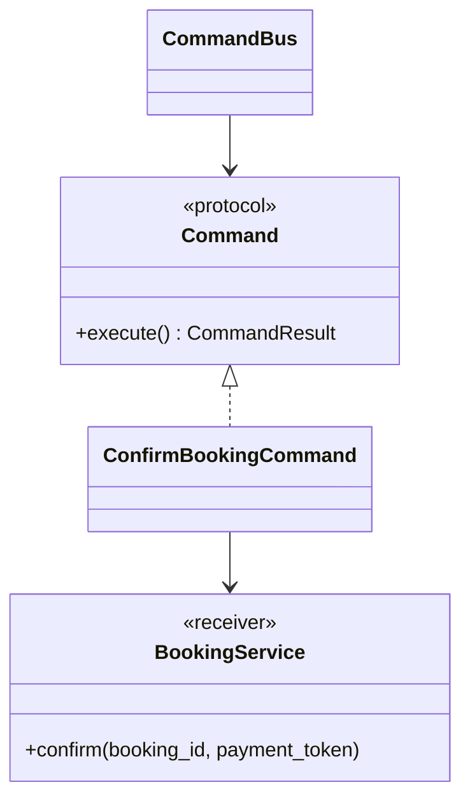
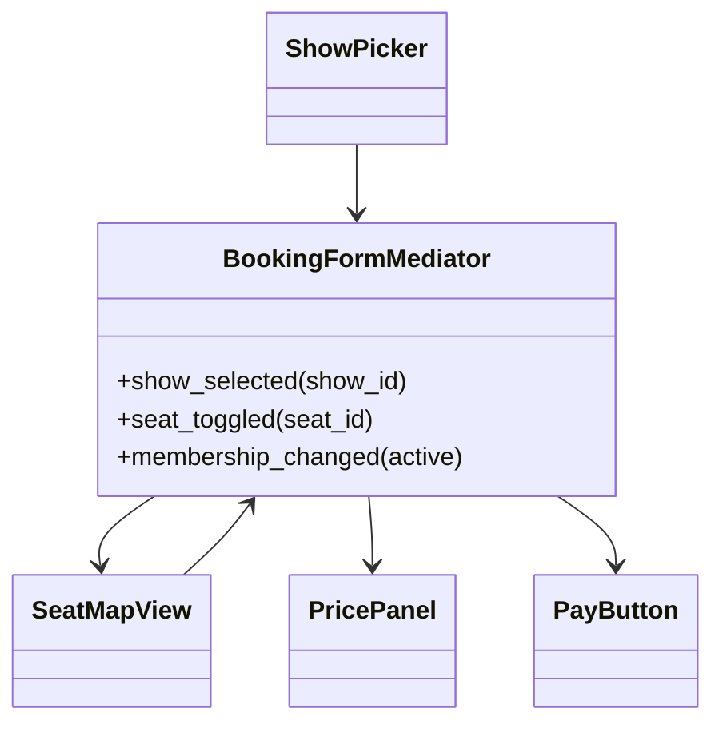
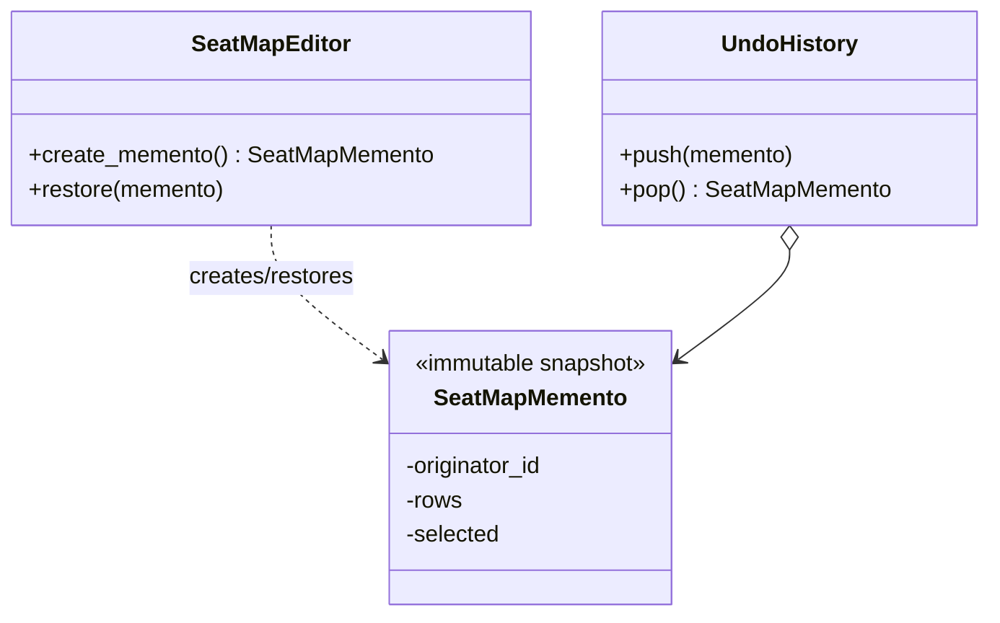
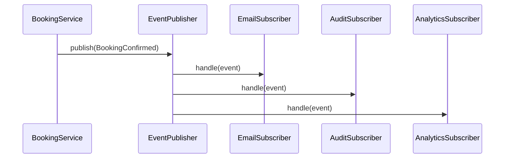
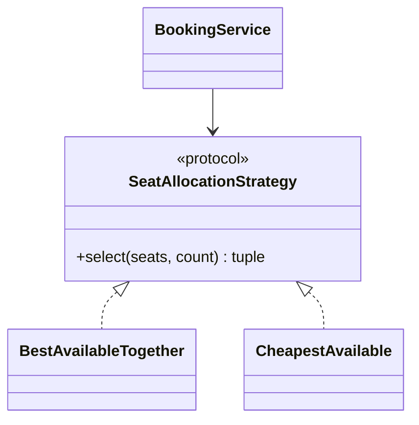
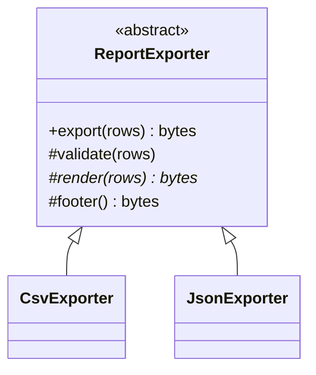
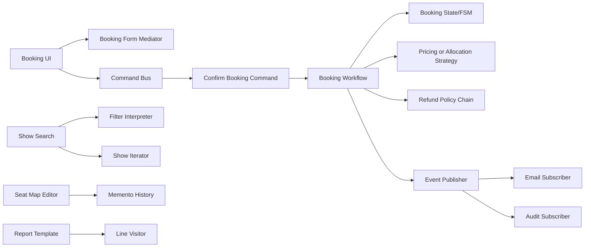

# Topic 8 - Behavioral Design Patterns

[Curriculum index](../README.md) | [Preparation roadmap](../roadmap.md) |
[Previous topic](./07-structural-design-patterns.md) |
[Next topic](./09-application-patterns-and-reusable-building-blocks.md)

- **Category:** Design patterns and object collaboration
- **Difficulty:** Intermediate to advanced
- **Priority:** Essential
- **Prerequisites:** Topics 2 and 5; Topics 3-4 and 6-7 recommended
- **Running example:** Movie Ticket Booking requests, lifecycle, policies,
  notifications, history, queries, and reporting
- **Output:** Explicit, testable collaboration rules for routing work,
  encapsulating actions, evaluating languages, traversing collections,
  coordinating peers, restoring snapshots, publishing change, varying behavior
  by state/algorithm, preserving workflow skeletons, and adding operations over
  stable object structures

## Outcome

After completing this topic, you should be able to:

- Model behavior as messages, decisions, transitions, reactions, and
  collaboration rather than accumulating methods in one service.
- Choose a conditional, loop, mapping, function, enum state machine, callback,
  generator, or named pattern at the lowest sufficient complexity.
- Implement Chain of Responsibility with explicit ordering, handled/unhandled
  semantics, and failure behavior.
- Use Command when an action needs identity, scheduling, retry, history, audit,
  authorization, or undo—not merely because a request has fields.
- Build a tiny Interpreter only for a bounded grammar, with safe parsing,
  validation, and evaluation limits.
- Use Python iterators/generators while stating snapshot, mutation, pagination,
  cleanup, and one-shot/reusable semantics.
- Apply Mediator when peer-to-peer interactions are genuinely tangled while
  avoiding a central god object.
- Capture Mementos without exposing mutable internals and distinguish snapshots
  from event sourcing, persistence, and audit.
- Design Observer contracts with typed events, subscription lifetime, ordering,
  reentrancy, error isolation, delivery guarantees, and transaction timing.
- Choose between enum/table-driven finite-state machines and the GoF State
  pattern based on how much behavior varies by state.
- Implement Strategy with strong semantic contracts, deterministic selection,
  and safe state/lifetime choices.
- Use Template Method only when a stable algorithm skeleton and controlled
  variation points justify inheritance.
- Apply Visitor when many operations must be added over a stable heterogeneous
  structure, and explain its double-dispatch and evolution trade-offs.
- Distinguish all eleven patterns by intent rather than similar class diagrams.
- Test individual participants, interaction protocols, ordering, failure, and
  change pressure.
- Reject pattern soup and defend simpler Python alternatives during an
  interview.

## Core idea

Behavioral patterns answer different collaboration questions:

```text
Who in an ordered set should handle this request?       -> Chain of Responsibility
How can an action become a value/object?                 -> Command
How can a small language be represented and evaluated?  -> Interpreter
How can a collection be traversed without exposing it?  -> Iterator
How can many peers communicate through one coordinator? -> Mediator
How can internal state be captured/restored safely?      -> Memento
How can dependents react to a change?                    -> Observer
How can behavior change with lifecycle state?            -> State
How can one interchangeable algorithm be selected?       -> Strategy
How can a stable algorithm skeleton expose steps?        -> Template Method
How can operations be added over stable element types?   -> Visitor
```

Similar code shapes can have different intent:

- a loop of validators may be enough without a Chain object;
- an immutable request DTO is not automatically Command;
- an enum named `State` is not the GoF State pattern;
- a coordinator is not automatically Mediator;
- a callback list is Observer-like, but delivery semantics still matter;
- a callable dependency may be a Strategy without a class hierarchy.

> Start from the behavioral pressure, define the protocol and failure semantics,
> then choose the smallest mechanism that makes change safer.

## Scope boundary

This topic deeply covers the eleven GoF behavioral patterns:

- Chain of Responsibility;
- Command;
- Interpreter;
- Iterator;
- Mediator;
- Memento;
- Observer;
- State;
- Strategy;
- Template Method;
- Visitor.

It also covers Python-native alternatives and supporting concepts:

- functions, callables, closures, mappings, and `functools.singledispatch`;
- immutable command/event/result dataclasses;
- explicit finite-state transition tables;
- generator functions and the iterator protocol;
- callbacks, event dispatchers, and synchronous in-process publication;
- snapshots, copy policies, and append-only history;
- structural pattern matching;
- composition-root policy selection;
- deterministic clocks, IDs, and test doubles.

It does not deeply cover:

- message brokers, exactly-once myths, outbox/inbox architecture, sagas, or
  distributed workflow engines;
- durable command queues, event sourcing, CQRS, or stream processing;
- parser-generator implementation, compiler construction, or general-purpose
  expression languages;
- database transaction boundaries and persistence mapping; Topic 12 covers
  them;
- concurrency primitives and thread-safety mechanisms; Topic 11 covers them;
- framework-specific signals, ORM hooks, web middleware, or job systems.

Examples use Python 3.10+. Code fences are focused excerpts; some reference
domain types introduced nearby. Standalone implementations should include all
imports and may use `from __future__ import annotations` for forward references.

## 1. Learn

### 1.1 Behavior has a protocol

Every collaboration has more than a method name. Define:

- who initiates it;
- what immutable input crosses the boundary;
- who is allowed to decide or mutate;
- whether zero, one, or many recipients act;
- ordering and short-circuit behavior;
- success, rejection, failure, and partial-success results;
- sync/async and latency expectations;
- retries, idempotency, and duplicate handling;
- ownership and lifetime of participants/subscriptions/history;
- reentrancy and concurrent-call behavior;
- observability and audit requirements.

```text
message -> collaborator protocol -> decision/effect -> result/event/transition
```

A pattern name cannot repair an undefined protocol.

### 1.2 Start with the behavior ladder

Escalate only when a lower level stops expressing the requirement clearly:

1. Direct method or `if` statement.
2. Helper function.
3. Mapping from discriminator/state to function.
4. Loop over callables.
5. Injected callable/protocol.
6. Small coordinator or event dispatcher.
7. Named behavioral pattern.
8. Framework or durable infrastructure.

Examples:

- three validation functions in a fixed list may not need handler classes;
- an enum plus a transition table may beat ten State subclasses;
- one injected pricing function may beat a Strategy ABC;
- one `for` loop may beat a custom Iterator type;
- a mature parser library is safer than a home-grown Interpreter for complex
  syntax.

### 1.3 Pattern selection map

| Pressure | First candidate | The key proof |
|---|---|---|
| Ordered handlers may pass/stop | Chain of Responsibility | request reaches only the correct handlers in defined order |
| Action needs identity/lifecycle | Command | action can be queued/retried/audited/undone independently |
| Bounded grammar drives behavior | Interpreter | grammar maps safely to a composable syntax tree |
| Traversal must hide representation | Iterator/generator | traversal semantics are explicit without exposing storage |
| Peer interactions are many-to-many | Mediator | peers stop knowing one another directly |
| State must be restored | Memento | snapshot restores valid state without exposing internals |
| Many dependents react to change | Observer | publisher is decoupled from reactions with defined delivery |
| Behavior differs substantially by state | State | state-specific objects own transitions/behavior |
| One algorithm varies | Strategy/callable | context remains stable as algorithm changes |
| Skeleton stable, steps vary by subclass | Template Method | inheritance variation points are few and protected |
| Operations grow, element types stable | Visitor | new operation avoids editing every element |

### 1.4 Message vocabulary

Do not blur these:

| Message | Meaning | Typical naming |
|---|---|---|
| Command | Request to perform an action; may be rejected/fail | `ConfirmBooking` |
| Query | Request for information; should avoid business mutation | `GetAvailableSeats` |
| Event | Fact that already happened | `BookingConfirmed` |
| Notification | Delivery intended to inform a recipient | `TicketEmail` |
| Request DTO | Boundary data; may describe command/query but has no pattern role alone | `CheckoutRequest` |

Commands use imperative language. Events use past tense. An event should not be
“rejected” by a subscriber because the publisher has already stated the fact.

### 1.5 Chain of Responsibility: precise intent

**Intent:** pass a request along an ordered chain of potential handlers until
one handles it, or let multiple handlers process it according to an explicit
chain policy.

Participants:

- **Handler:** common handling contract and optional successor.
- **Concrete handler:** checks applicability and handles or forwards.
- **Client:** submits to the chain entry point.

Two common semantics must not be confused:

```text
first-handler-wins: first applicable handler returns a result and stops
pipeline/all-handlers: every handler may transform/check and forward
```

The GoF intent emphasizes giving more than one object a chance to handle while
avoiding sender-to-receiver coupling. Validation pipelines are often described
as Chain, but their “all checks must pass” semantics should be named explicitly.

### 1.6 Implement a first-match Chain

```python
from __future__ import annotations

from dataclasses import dataclass
from decimal import Decimal
from typing import Protocol


@dataclass(frozen=True)
class RefundRequest:
    booking_id: str
    amount: Decimal
    hours_before_show: int
    provider_cancelled: bool = False


@dataclass(frozen=True)
class RefundDecision:
    refundable_amount: Decimal
    reason: str


class RefundHandler(Protocol):
    def handle(self, request: RefundRequest) -> RefundDecision | None:
        ...


class ProviderCancellationHandler:
    def handle(self, request: RefundRequest) -> RefundDecision | None:
        if not request.provider_cancelled:
            return None
        return RefundDecision(request.amount, "show cancelled by provider")


class EarlyCancellationHandler:
    def handle(self, request: RefundRequest) -> RefundDecision | None:
        if request.hours_before_show < 24:
            return None
        return RefundDecision(request.amount, "cancelled at least 24 hours early")


class LateCancellationHandler:
    def handle(self, request: RefundRequest) -> RefundDecision | None:
        if request.hours_before_show < 2:
            return None
        return RefundDecision(request.amount * Decimal("0.50"), "late cancellation")


class RefundPolicyChain:
    def __init__(self, *handlers: RefundHandler) -> None:
        if not handlers:
            raise ValueError("at least one refund handler is required")
        self._handlers = tuple(handlers)

    def decide(self, request: RefundRequest) -> RefundDecision:
        if request.amount < 0 or not request.amount.is_finite():
            raise ValueError("amount must be finite and non-negative")
        for handler in self._handlers:
            decision = handler.handle(request)
            if decision is not None:
                return decision
        return RefundDecision(Decimal("0"), "outside refund window")
```

Order is policy. Provider cancellation must precede time-window handlers or a
late provider-cancelled show may incorrectly receive no refund.

Using an external chain object instead of successor links makes ordering visible,
keeps handlers immutable, and simplifies reuse/testing in Python.

### 1.7 Validation chain with different semantics

For “every check must pass,” a list of functions is often enough:

```python
from collections.abc import Callable, Iterable
from dataclasses import dataclass


@dataclass(frozen=True)
class ValidationError:
    code: str
    field: str | None = None


Validator = Callable[[object], ValidationError | None]


def validate_first_failure(
    value: object,
    validators: Iterable[Validator],
) -> ValidationError | None:
    for validator in validators:
        error = validator(value)
        if error is not None:
            return error
    return None


def validate_all(
    value: object,
    validators: Iterable[Validator],
) -> tuple[ValidationError, ...]:
    return tuple(
        error
        for validator in validators
        if (error := validator(value)) is not None
    )
```

These functions encode different contracts. Do not switch from first failure
to all failures without considering cost, sensitive information, and whether
later checks assume earlier validation.

### 1.8 Chain decisions and pitfalls

Define:

- fixed versus runtime-configurable order;
- first-match, first-failure, all-handlers, or transform-and-forward semantics;
- default behavior when nobody handles;
- whether one handler may call the next more than once;
- whether handlers may mutate the request;
- exception versus rejection result;
- duplicate handler registration;
- async/cancellation behavior;
- observability showing which handlers ran and why processing stopped.

Chain versus related patterns:

- **Decorator:** every wrapper normally delegates along one nested object and
  adds responsibility; Chain selects/flows among handlers.
- **Composite:** represents part-whole trees; Chain represents an ordered route.
- **Pipeline:** typically every stage transforms data; Chain may stop once
  handled.
- **Strategy:** chooses one algorithm before execution; Chain discovers a
  handler through ordered applicability.

### 1.9 Command: precise intent

**Intent:** encapsulate a request as an object so it can be parameterized,
queued, logged, retried, composed, or undone independently of the invoker.

Participants:

- **Command:** execution contract.
- **Concrete command:** action data plus receiver call.
- **Receiver:** owns actual domain behavior.
- **Invoker:** schedules/triggers command without knowing domain details.
- **Client:** constructs/wires command and receiver.



An object named `CreateBookingRequest` is only a DTO until the design treats the
action itself as a value with execution/lifecycle semantics.

### 1.10 Implement a Command and invoker

```python
from dataclasses import dataclass
from typing import Generic, Protocol, TypeVar


R = TypeVar("R")


class Command(Protocol, Generic[R]):
    @property
    def command_id(self) -> str:
        ...

    def execute(self) -> R:
        ...


class BookingReceiver(Protocol):
    def confirm(self, booking_id: str, payment_token: str) -> str:
        ...


@dataclass(frozen=True)
class ConfirmBookingCommand:
    command_id: str
    booking_id: str
    payment_token: str
    receiver: BookingReceiver

    def execute(self) -> str:
        return self.receiver.confirm(self.booking_id, self.payment_token)


class InMemoryCommandBus:
    def __init__(self) -> None:
        self._results: dict[str, object] = {}

    def execute(self, command: Command[R]) -> R:
        if command.command_id in self._results:
            return self._results[command.command_id]  # type: ignore[return-value]
        result = command.execute()
        self._results[command.command_id] = result
        return result
```

This demonstrates idempotent reuse only within one process and only after a
successful result is stored. It is not durable or safe across concurrent
callers. A production command executor needs an explicit persistence,
concurrency, failure, and retry contract.

Also avoid storing secrets such as raw payment tokens in durable command logs.
Separate sensitive execution data from audit metadata.

### 1.11 Command lifecycle and results

If Commands are queued, define states such as:

```text
RECEIVED -> RUNNING -> SUCCEEDED
                    -> RETRYABLE_FAILURE -> RUNNING
                    -> PERMANENT_FAILURE
                    -> UNKNOWN_OUTCOME / RECONCILIATION_REQUIRED
```

Specify:

- command identity and deduplication scope;
- validation before enqueue versus before execution;
- authorization time (request time, execution time, or both);
- maximum attempts and backoff;
- timeout and cancellation;
- result/error storage and retention;
- ordering by aggregate/key;
- poison-command/dead-letter behavior;
- what happens if the effect succeeds but acknowledgment/storage fails.

“Retry the command” is safe only when its receiver operation is idempotent or
deduplicated by a stable key.

### 1.12 Undoable Commands

Undo is not merely calling an opposite method:

```python
from dataclasses import dataclass
from typing import Protocol


class SeatMapEditor(Protocol):
    def rename_row(self, old: str, new: str) -> None:
        ...


@dataclass
class RenameRowCommand:
    editor: SeatMapEditor
    old_name: str
    new_name: str
    _executed: bool = False

    def execute(self) -> None:
        if self._executed:
            raise RuntimeError("command has already executed")
        self.editor.rename_row(self.old_name, self.new_name)
        self._executed = True

    def undo(self) -> None:
        if not self._executed:
            raise RuntimeError("cannot undo before execution")
        self.editor.rename_row(self.new_name, self.old_name)
        self._executed = False
```

This is suitable only if no intervening action invalidates the inverse and row
names are still uniquely owned. Financial settlement, email delivery, and
external effects are not reliably undone by a naive inverse. Use compensation
or reconciliation with explicit business semantics.

Command history may instead store a Memento captured before execution. That
also requires ownership and validity rules.

### 1.13 Command versus related concepts

| Concept | Difference from Command |
|---|---|
| Request DTO | Contains input but need not own execution identity/lifecycle |
| Event | Describes a fact already completed, usually past tense |
| Strategy | Encapsulates interchangeable algorithm, not one requested action |
| Memento | Captures state for restoration; does not request an action |
| Job/task | Operational scheduling concept; may carry a serialized Command |
| Closure/callable | Lightweight command when identity/serialization/introspection are unnecessary |

Python alternative:

```python
from collections.abc import Callable


def execute_later(action: Callable[[], None]) -> None:
    action()
```

Closures are excellent for local callbacks. Named immutable Commands are better
when an action needs typed data, stable identity, logging, persistence, or
cross-process serialization. Do not serialize captured closures casually.

### 1.14 Interpreter: precise intent

**Intent:** represent a grammar using expression objects and interpret sentences
in that language.

Good scope:

- a small, stable rule/filter expression language;
- a bounded grammar with a few expression types;
- evaluation over explicit safe context;
- no arbitrary code, attribute access, imports, or unbounded recursion.

Bad scope:

- a general programming language;
- SQL-like complexity built without mature parser tooling;
- user strings passed to Python `eval()`;
- a rapidly changing grammar with weak diagnostics.

Example grammar for show search:

```text
Expression := Or
Or         := And ("OR" And)*
And        := Unary ("AND" Unary)*
Unary      := "NOT" Unary | "(" Expression ")" | Predicate
Predicate  := "LANG=" Text | "CITY=" Text | "PRICE<=" Number
```

The Interpreter pattern describes the expression tree and evaluation. Lexing
and parsing are separate responsibilities.

### 1.15 Implement expression objects

```python
from __future__ import annotations

from dataclasses import dataclass
from decimal import Decimal
from typing import Protocol


@dataclass(frozen=True)
class ShowFacts:
    language: str
    city: str
    minimum_price: Decimal


class Expression(Protocol):
    def interpret(self, facts: ShowFacts) -> bool:
        ...


@dataclass(frozen=True)
class LanguageIs:
    expected: str

    def interpret(self, facts: ShowFacts) -> bool:
        return facts.language.casefold() == self.expected.casefold()


@dataclass(frozen=True)
class CityIs:
    expected: str

    def interpret(self, facts: ShowFacts) -> bool:
        return facts.city.casefold() == self.expected.casefold()


@dataclass(frozen=True)
class PriceAtMost:
    limit: Decimal

    def interpret(self, facts: ShowFacts) -> bool:
        return facts.minimum_price <= self.limit


@dataclass(frozen=True)
class And:
    left: Expression
    right: Expression

    def interpret(self, facts: ShowFacts) -> bool:
        return self.left.interpret(facts) and self.right.interpret(facts)


@dataclass(frozen=True)
class Or:
    left: Expression
    right: Expression

    def interpret(self, facts: ShowFacts) -> bool:
        return self.left.interpret(facts) or self.right.interpret(facts)


@dataclass(frozen=True)
class Not:
    expression: Expression

    def interpret(self, facts: ShowFacts) -> bool:
        return not self.expression.interpret(facts)
```

These expressions also form a Composite-like tree. Pattern roles can coexist:
Composite describes the part-whole shape; Interpreter describes grammar
meaning and evaluation.

### 1.16 Parsing is not `eval`

For a tiny prefix form, an allowlisted recursive parser is enough:

```python
from collections.abc import Iterator
from decimal import Decimal, InvalidOperation


def parse_prefix(tokens: Iterator[str], depth: int = 0) -> Expression:
    if depth > 20:
        raise ValueError("expression nesting is too deep")
    try:
        token = next(tokens)
    except StopIteration as error:
        raise ValueError("unexpected end of expression") from error

    keyword = token.upper()
    if keyword == "AND":
        return And(
            parse_prefix(tokens, depth + 1),
            parse_prefix(tokens, depth + 1),
        )
    if keyword == "OR":
        return Or(
            parse_prefix(tokens, depth + 1),
            parse_prefix(tokens, depth + 1),
        )
    if keyword == "NOT":
        return Not(parse_prefix(tokens, depth + 1))
    if keyword.startswith("LANG="):
        return LanguageIs(token.split("=", 1)[1])
    if keyword.startswith("CITY="):
        return CityIs(token.split("=", 1)[1])
    if keyword.startswith("PRICE<="):
        raw = token.split("<=", 1)[1]
        try:
            return PriceAtMost(Decimal(raw))
        except InvalidOperation as error:
            raise ValueError("invalid price literal") from error
    raise ValueError(f"unknown expression token: {token!r}")
```

The caller must also reject trailing tokens and bound total token/node count.
Real infix precedence, escaping, source spans, diagnostics, and evolution are
good reasons to use a parser library rather than hand-written splitting.

### 1.17 Interpreter safety and evolution

Define:

- grammar and version;
- canonical text/AST representation;
- token, depth, node, string-length, and evaluation-time limits;
- allowed field names/operators/functions;
- types, null/missing semantics, comparison rules, and locale;
- deterministic evaluation and side-effect policy;
- parse versus validation versus evaluation errors;
- diagnostics without leaking sensitive context;
- forward/backward compatibility for saved expressions.

Interpreter versus alternatives:

- a dictionary of fixed predicates may be enough for one level;
- Composite may model nested business rules already constructed by code;
- Specification is a domain-oriented composable predicate concept;
- mature expression/parser libraries handle richer languages more safely;
- never treat `eval`, `exec`, dynamic imports, or unrestricted attribute access
  as a shortcut for untrusted input.

### 1.18 Iterator: precise intent

**Intent:** provide sequential access to elements of an aggregate without
exposing its internal representation.

Python separates:

- **Iterable:** `__iter__()` returns a new iterator.
- **Iterator:** `__iter__()` returns itself and `__next__()` yields or raises
  `StopIteration`.
- **Generator:** a concise iterator produced by a function containing `yield`.

```python
from collections.abc import Iterator
from dataclasses import dataclass


@dataclass(frozen=True)
class SeatView:
    seat_id: str
    row: str
    number: int
    available: bool


class SeatMap:
    def __init__(self, seats: list[SeatView]) -> None:
        self._seats = {seat.seat_id: seat for seat in seats}

    def __iter__(self) -> Iterator[SeatView]:
        snapshot = tuple(self._seats.values())
        yield from sorted(snapshot, key=lambda seat: (seat.row, seat.number))

    def iter_available(self) -> Iterator[SeatView]:
        return (seat for seat in self if seat.available)
```

The aggregate hides its dictionary and exposes a stable ordering. Because
`SeatView` is immutable and `__iter__` snapshots values, later map mutations do
not change which elements that traversal yields.

### 1.19 Custom Iterator when traversal has state

A class is useful when clients need inspectable traversal state or multiple
operations:

```python
from collections.abc import Iterator, Sequence
from dataclasses import dataclass


@dataclass(frozen=True)
class Show:
    show_id: str
    start_epoch: int


class UpcomingShowIterator(Iterator[Show]):
    def __init__(self, shows: Sequence[Show], after_epoch: int) -> None:
        self._shows = tuple(
            sorted(
                (show for show in shows if show.start_epoch > after_epoch),
                key=lambda show: (show.start_epoch, show.show_id),
            )
        )
        self._index = 0

    def __iter__(self) -> "UpcomingShowIterator":
        return self

    def __next__(self) -> Show:
        if self._index >= len(self._shows):
            raise StopIteration
        result = self._shows[self._index]
        self._index += 1
        return result
```

This iterator is one-shot. Calling `iter(iterator)` does not reset it. The
aggregate/collection should create a new iterator for a new traversal.

### 1.20 Iterator contract decisions

Define:

- traversal order and tie-breakers;
- one-shot versus reusable source;
- snapshot versus live/weakly consistent/fail-fast mutation behavior;
- returned mutable entities versus immutable views/copies;
- filtering and whether errors skip or stop;
- resource ownership and early-stop cleanup;
- whether a second traversal re-runs expensive I/O;
- thread/concurrent mutation behavior;
- cardinality and memory bounds.

Do not expose `self._items.values()` casually if callers can mutate returned
entities or depend on insertion order the domain never promised.

Iterator versus Composite/Visitor:

- Iterator controls **how elements are traversed**.
- Composite defines a **part-whole structure** and uniform operations.
- Visitor defines an **operation across heterogeneous element types**.
- A Visitor may use an Iterator to traverse a Composite.

### 1.21 Pagination, streaming, and async iteration

Database/API pagination is not the same as an in-memory iterator. A page token
contract must define stable sort keys, filters, expiry, and concurrent changes:

```python
from dataclasses import dataclass


@dataclass(frozen=True)
class ShowPage:
    items: tuple[Show, ...]
    next_cursor: str | None
```

Avoid offset pagination for rapidly changing large collections when duplicate/
missing behavior matters; keyset/cursor semantics are often clearer. That is a
data/API concern beyond the GoF mechanics.

Async iteration makes waiting explicit:

```python
from collections.abc import AsyncIterator


async def stream_booking_events(source: object) -> AsyncIterator[object]:
    async for event in source:
        yield event
```

Define cancellation, backpressure, reconnection, checkpointing, duplicates, and
cleanup. An async generator is not automatically a durable event consumer.

### 1.22 Mediator: precise intent

**Intent:** define an object that encapsulates how a set of colleague objects
interact, reducing explicit many-to-many references among them.

Without Mediator:

```text
ShowPicker <-> SeatMap <-> PricePanel <-> PayButton <-> Summary
     ^            |            ^            |           |
     +------------+------------+------------+-----------+
```

With Mediator:



Colleagues know the Mediator contract, not one another. The Mediator owns the
interaction policy: selecting a show reloads the seat view, clears selection,
updates price, and disables payment until valid seats are chosen.

### 1.23 Implement a focused Mediator

```python
from typing import Protocol


class SeatView(Protocol):
    def load_show(self, show_id: str) -> None:
        ...

    def clear_selection(self) -> None:
        ...

    def selected_ids(self) -> tuple[str, ...]:
        ...


class PriceView(Protocol):
    def show_quote(self, show_id: str, seat_ids: tuple[str, ...]) -> None:
        ...


class PayControl(Protocol):
    def set_enabled(self, enabled: bool) -> None:
        ...


class BookingFormMediator:
    def __init__(
        self,
        seats: SeatView,
        price: PriceView,
        pay: PayControl,
    ) -> None:
        self._seats = seats
        self._price = price
        self._pay = pay
        self._show_id: str | None = None

    def show_selected(self, show_id: str) -> None:
        if not show_id.strip():
            raise ValueError("show_id cannot be blank")
        self._show_id = show_id
        self._seats.load_show(show_id)
        self._seats.clear_selection()
        self._pay.set_enabled(False)

    def seat_selection_changed(self) -> None:
        if self._show_id is None:
            raise RuntimeError("select a show before selecting seats")
        selected = self._seats.selected_ids()
        self._price.show_quote(self._show_id, selected)
        self._pay.set_enabled(bool(selected))
```

Typed mediator methods are preferable to a giant `notify(sender, "EVENT",
dict)` when interactions are known; they make valid messages and dependencies
visible.

### 1.24 Mediator boundaries and failure

A focused Mediator:

- coordinates one cohesive collaboration;
- knows colleague contracts, not concrete UI/provider types;
- contains interaction policy, not every colleague's internal behavior;
- preserves one-way dependency from colleagues to Mediator;
- has explicit sync/async and error recovery behavior;
- remains replaceable in colleague tests.

A god Mediator:

- receives every event in the entire system;
- owns unrelated domain rules and persistence;
- branches on every concrete colleague type;
- becomes the only object that can change;
- hides sequencing and failures in one large switch.

If one colleague action fails after another updated, decide whether to roll back
the presentation state, show an error, retry, or recompute from authoritative
state. Mediator does not make partial change disappear.

### 1.25 Mediator versus related concepts

| Concept | Primary relationship |
|---|---|
| Mediator | Coordinates interactions among peer colleagues |
| Facade | Gives outside client a simpler subsystem interface |
| Observer | Broadcasts change to zero/many subscribers |
| Application service | Coordinates a domain use case and boundaries |
| Event bus | Routes messages without necessarily owning collaboration policy |

`ElevatorSystem` coordinates cars, requests, and a strategy, but that alone does
not prove GoF Mediator. The pattern becomes compelling when colleagues would
otherwise directly reference and update one another through tangled many-to-many
interactions.

### 1.26 Memento: precise intent

**Intent:** capture and externalize an object's internal state so it can later
be restored without violating encapsulation.

Participants:

- **Originator:** creates and restores its Memento.
- **Memento:** opaque snapshot value.
- **Caretaker:** stores history but should not edit internal snapshot state.



### 1.27 Implement immutable Mementos

```python
from dataclasses import dataclass
from uuid import uuid4


@dataclass(frozen=True)
class SeatMapMemento:
    originator_id: str
    rows: tuple[tuple[str, tuple[str, ...]], ...]
    selected: frozenset[str]


class SeatMapEditor:
    def __init__(self) -> None:
        self._originator_id = str(uuid4())
        self._rows: dict[str, list[str]] = {}
        self._selected: set[str] = set()

    def add_row(self, name: str, seat_ids: list[str]) -> None:
        if not name.strip() or not seat_ids:
            raise ValueError("row name and seats are required")
        if name in self._rows:
            raise ValueError("row already exists")
        if len(set(seat_ids)) != len(seat_ids):
            raise ValueError("seat IDs must be unique within a row")
        known = {seat for row in self._rows.values() for seat in row}
        if known.intersection(seat_ids):
            raise ValueError("seat ID already exists")
        self._rows[name] = list(seat_ids)

    def select(self, seat_id: str) -> None:
        if not any(seat_id in row for row in self._rows.values()):
            raise ValueError("unknown seat")
        self._selected.add(seat_id)

    def create_memento(self) -> SeatMapMemento:
        rows = tuple(
            (name, tuple(seats))
            for name, seats in sorted(self._rows.items())
        )
        return SeatMapMemento(
            self._originator_id,
            rows,
            frozenset(self._selected),
        )

    def restore(self, memento: SeatMapMemento) -> None:
        if memento.originator_id != self._originator_id:
            raise ValueError("memento belongs to another editor")
        rows = {name: list(seats) for name, seats in memento.rows}
        all_seats = {seat for seats in rows.values() for seat in seats}
        if not memento.selected.issubset(all_seats):
            raise ValueError("memento contains invalid selection")
        self._rows = rows
        self._selected = set(memento.selected)
```

The snapshot deep-converts mutable collections into tuples/frozenset. Restore
rebuilds fresh mutable collections so future edits cannot mutate history.

### 1.28 Caretaker, capacity, and validity

```python
from collections import deque


class UndoHistory:
    def __init__(self, capacity: int = 100) -> None:
        if capacity <= 0:
            raise ValueError("capacity must be positive")
        self._items: deque[SeatMapMemento] = deque(maxlen=capacity)

    def push(self, memento: SeatMapMemento) -> None:
        self._items.append(memento)

    def pop(self) -> SeatMapMemento:
        if not self._items:
            raise LookupError("undo history is empty")
        return self._items.pop()
```

Define:

- snapshot depth/copy policy;
- originator identity and schema/configuration version;
- maximum history entries/memory;
- whether restore itself creates a redo point;
- validity after external facts change;
- encryption/redaction of sensitive state;
- cleanup of resources referenced by history;
- transaction/atomicity of restore.

Do not snapshot locks, open files, sessions, provider clients, or live ORM graphs
blindly.

### 1.29 Memento versus alternatives

| Alternative | Primary purpose |
|---|---|
| Command undo | Reverse an action, possibly using captured prior state |
| Prototype | Create a new object from an existing configured object |
| Database backup | Operational recovery of persisted data |
| Event sourcing | Persist events as source of truth and rebuild state |
| Audit log | Record what happened; may not support restoration |
| Immutable version | New state value with structural sharing/version history |

A Memento is a snapshot, not a proof of every action that produced it. Event
sourcing is not “many Mementos”: events express domain changes and require
versioning/replay semantics.

### 1.30 Observer: precise intent

**Intent:** define a one-to-many dependency so when a subject changes state,
registered observers are notified without the subject naming concrete reactions.

Participants:

- **Subject/publisher:** manages subscriptions and announces change.
- **Observer/subscriber:** reaction contract.
- **Event:** preferably immutable description of the fact.



Observer is not automatically asynchronous, durable, transactional, or
reliable. An in-process loop is usually synchronous unless explicitly designed
otherwise.

### 1.31 Typed events and subscription handles

```python
from __future__ import annotations

from collections import defaultdict
from collections.abc import Callable
from dataclasses import dataclass
from datetime import datetime
from typing import TypeVar
from uuid import uuid4


@dataclass(frozen=True)
class BookingConfirmed:
    booking_id: str
    user_id: str
    occurred_at: datetime


E = TypeVar("E")
Handler = Callable[[object], None]


class Subscription:
    def __init__(self, cancel: Callable[[], None]) -> None:
        self._cancel = cancel
        self._active = True

    def unsubscribe(self) -> None:
        if self._active:
            self._cancel()
            self._active = False


class EventPublisher:
    def __init__(self) -> None:
        self._handlers: dict[type[object], dict[str, Handler]] = defaultdict(dict)

    def subscribe(self, event_type: type[E], handler: Callable[[E], None]) -> Subscription:
        token = str(uuid4())
        handlers = self._handlers[event_type]
        handlers[token] = handler  # type: ignore[assignment]

        def cancel() -> None:
            handlers.pop(token, None)

        return Subscription(cancel)

    def publish(self, event: object) -> None:
        handlers = tuple(self._handlers[type(event)].values())
        for handler in handlers:
            handler(event)
```

Snapshotting the handler tuple makes subscribe/unsubscribe during delivery
affect the next publication, not the current one. The returned handle makes
subscription lifetime explicit.

### 1.32 Observer delivery semantics

Define these before implementation:

- exact event types and immutable payloads;
- publish before or after authoritative state change/commit;
- subscriber order or explicit lack of ordering;
- snapshot versus live subscription changes during delivery;
- fail-fast versus collect/isolate subscriber failures;
- reentrant publication behavior;
- duplicate subscription and delivery rules;
- memory ownership: strong/weak subscriber references;
- synchronous latency budget;
- unsubscribe/lifecycle and resource cleanup;
- observability without sensitive payload leakage.

Failure-isolating publisher example:

```python
from dataclasses import dataclass


@dataclass(frozen=True)
class DeliveryFailure:
    handler_name: str
    error: Exception


def deliver_all(event: object, handlers: tuple[Handler, ...]) -> tuple[DeliveryFailure, ...]:
    failures = []
    for handler in handlers:
        try:
            handler(event)
        except Exception as error:
            failures.append(DeliveryFailure(repr(handler), error))
    return tuple(failures)
```

Isolating failures does not mean ignoring them. Return, record, alert, or retry
according to the event's importance.

### 1.33 Transaction timing and durable publication

Publishing before commit risks notifying about a change that rolls back.
Publishing after commit in application memory risks crashing between commit and
publication. A durable outbox can close this gap, but belongs to persistence and
distributed messaging architecture:

```text
transaction: write domain change + outbox record
after commit: dispatcher reads outbox -> broker/subscribers
subscriber: deduplicate -> apply effect -> acknowledge
```

Delivery is commonly at-least-once, so subscribers should be idempotent. Global
ordering, exactly-once side effects, and instant consistency should never be
claimed from a local Observer list.

### 1.34 Observer versus related concepts

| Concept | Distinction |
|---|---|
| Callback | One callable reaction; may be used to implement Observer |
| Pub/sub broker | Subscribers often decoupled in space/time through infrastructure |
| Mediator | Coordinates peer interaction policy, not merely broadcast |
| Event bus | Routes typed messages; may implement Observer-like publication |
| Domain event | Fact in domain language; can be delivered through several mechanisms |
| Notification service | Performs a delivery use case; not necessarily a subscriber registry |

Avoid using generic string events plus mutable dictionaries when typed events
can make schema, meaning, and compatibility testable.

### 1.35 State: precise intent

**Intent:** allow an object to alter its behavior when its internal state
changes by delegating state-specific behavior to state objects.

Use the GoF State pattern when:

- behavior differs substantially across lifecycle states;
- many methods repeat state conditionals;
- each state has meaningful transition logic;
- adding states is more common than adding operations;
- state-specific rules can form cohesive objects.

Do not start there. An enum plus explicit transition methods/table is usually
clearer for a small lifecycle.

### 1.36 Start with an enum transition table

```python
from enum import Enum, auto


class BookingStatus(Enum):
    PENDING_PAYMENT = auto()
    CONFIRMED = auto()
    CANCELLED = auto()
    EXPIRED = auto()


ALLOWED_TRANSITIONS: dict[BookingStatus, frozenset[BookingStatus]] = {
    BookingStatus.PENDING_PAYMENT: frozenset(
        {BookingStatus.CONFIRMED, BookingStatus.CANCELLED, BookingStatus.EXPIRED}
    ),
    BookingStatus.CONFIRMED: frozenset({BookingStatus.CANCELLED}),
    BookingStatus.CANCELLED: frozenset(),
    BookingStatus.EXPIRED: frozenset(),
}


def ensure_transition(current: BookingStatus, target: BookingStatus) -> None:
    if target not in ALLOWED_TRANSITIONS[current]:
        raise ValueError(f"cannot transition from {current.name} to {target.name}")
```

This is a finite-state machine, not GoF State. It is often the best LLD answer:
state is explicit, transition topology is reviewable, and behavior stays near
the entity/service while modest.

### 1.37 Implement GoF State when behavior grows

```python
from __future__ import annotations

from dataclasses import dataclass
from decimal import Decimal
from typing import Protocol


class InvalidBookingOperation(Exception):
    pass


class BookingState(Protocol):
    name: str

    def pay(self, context: "Booking", payment_reference: str) -> None:
        ...

    def cancel(self, context: "Booking") -> None:
        ...

    def expire(self, context: "Booking") -> None:
        ...


@dataclass
class Booking:
    booking_id: str
    amount: Decimal
    state: BookingState
    payment_reference: str | None = None

    def pay(self, payment_reference: str) -> None:
        self.state.pay(self, payment_reference)

    def cancel(self) -> None:
        self.state.cancel(self)

    def expire(self) -> None:
        self.state.expire(self)

    def transition_to(self, state: BookingState) -> None:
        self.state = state


class PendingPayment:
    name = "PENDING_PAYMENT"

    def pay(self, context: Booking, payment_reference: str) -> None:
        if not payment_reference.strip():
            raise ValueError("payment reference cannot be blank")
        context.payment_reference = payment_reference
        context.transition_to(Confirmed())

    def cancel(self, context: Booking) -> None:
        context.transition_to(Cancelled())

    def expire(self, context: Booking) -> None:
        context.transition_to(Expired())


class Confirmed:
    name = "CONFIRMED"

    def pay(self, context: Booking, payment_reference: str) -> None:
        if payment_reference != context.payment_reference:
            raise InvalidBookingOperation("booking already has another payment")

    def cancel(self, context: Booking) -> None:
        context.transition_to(Cancelled())

    def expire(self, context: Booking) -> None:
        raise InvalidBookingOperation("confirmed booking cannot expire")


class Cancelled:
    name = "CANCELLED"

    def pay(self, context: Booking, payment_reference: str) -> None:
        raise InvalidBookingOperation("cancelled booking cannot be paid")

    def cancel(self, context: Booking) -> None:
        return None

    def expire(self, context: Booking) -> None:
        raise InvalidBookingOperation("cancelled booking cannot expire")


class Expired:
    name = "EXPIRED"

    def pay(self, context: Booking, payment_reference: str) -> None:
        raise InvalidBookingOperation("expired booking cannot be paid")

    def cancel(self, context: Booking) -> None:
        raise InvalidBookingOperation("expired booking cannot be cancelled")

    def expire(self, context: Booking) -> None:
        return None
```

This demonstrates delegation, but a production design should not expose a
public unrestricted `transition_to`. Make it internal or require states to
return transition decisions that the context validates centrally.

Stateless state objects may be safely shared; state objects containing
booking-specific data must not be shared across bookings.

### 1.38 Transition effects and atomicity

State changes often accompany effects:

```text
PENDING --payment captured--> CONFIRMED --publish event--> subscriber
CONFIRMED --refund succeeds--> CANCELLED --release seats--> ...
```

Decide:

- validate before effect;
- effect before or after state persistence;
- what happens when the effect succeeds and transition persistence fails;
- whether entry/exit actions are part of State or application workflow;
- idempotent repeated events/calls;
- concurrency/optimistic version checks;
- unknown external outcome and reconciliation.

Keep external I/O out of entity State objects when it complicates atomicity.
A state can return a decision/effect description; an application service can
perform the boundary operation and commit the transition safely.

### 1.39 State versus related concepts

| Concept | Distinction |
|---|---|
| Enum FSM | State value/table is data; behavior commonly remains in context/service |
| State pattern | Polymorphic state objects own state-specific behavior/transitions |
| Strategy | Client/configuration usually selects algorithm; state changes with context lifecycle |
| Command | Encapsulates one requested action; State decides whether/how action behaves now |
| Memento | Captures state for restore; does not define lifecycle behavior |

State can make adding a state easier but adding an operation harder because
every state must implement it. Use only when this trade-off matches expected
change.

### 1.40 Strategy: precise intent

**Intent:** define a family of algorithms, encapsulate each one, and make them
interchangeable so the context can vary the algorithm independently of the
workflow using it.

Examples:

- seat allocation;
- elevator scheduling;
- Splitwise equal/exact/percentage split;
- pricing;
- driver/restaurant matching;
- ATM note selection.



The context delegates one algorithmic decision and retains workflow/invariants.

### 1.41 Implement Strategy with a semantic contract

```python
from dataclasses import dataclass
from decimal import Decimal
from typing import Protocol, Sequence


@dataclass(frozen=True)
class AvailableSeat:
    seat_id: str
    row: str
    number: int
    price: Decimal


class SeatAllocationStrategy(Protocol):
    def select(
        self,
        seats: Sequence[AvailableSeat],
        count: int,
    ) -> tuple[AvailableSeat, ...]:
        ...


class CheapestAvailable:
    def select(
        self,
        seats: Sequence[AvailableSeat],
        count: int,
    ) -> tuple[AvailableSeat, ...]:
        if count <= 0:
            raise ValueError("count must be positive")
        ordered = sorted(seats, key=lambda seat: (seat.price, seat.row, seat.number))
        if len(ordered) < count:
            return ()
        return tuple(ordered[:count])
```

The contract must define more than types:

- input collection is not mutated;
- output contains unique members of the input;
- output size is `count` or empty when impossible;
- ordering/tie-breakers are deterministic;
- unavailable seats are excluded by caller or strategy, stated explicitly;
- no reservation mutation occurs during selection;
- complexity expectations for representative size;
- empty versus exception semantics.

These rules make implementations substitutable.

### 1.42 Functions are Pythonic Strategies

```python
from collections.abc import Callable, Sequence


SeatSelector = Callable[
    [Sequence[AvailableSeat], int],
    tuple[AvailableSeat, ...],
]


def allocate(
    seats: Sequence[AvailableSeat],
    count: int,
    selector: SeatSelector,
) -> tuple[AvailableSeat, ...]:
    return selector(seats, count)
```

Use a function when the strategy is stateless and has one operation. Use an
object when it needs validated configuration, multiple cohesive operations,
metrics/state with explicit scope, or a named extensibility boundary.

### 1.43 Strategy selection and lifetime

Separate **which algorithm** from **running the algorithm**:

```python
def select_seat_strategy(name: str) -> SeatAllocationStrategy:
    strategies: dict[str, SeatAllocationStrategy] = {
        "cheapest": CheapestAvailable(),
        "together": BestAvailableTogether(),
    }
    try:
        return strategies[name.strip().lower()]
    except KeyError as error:
        raise ValueError(f"unsupported seat strategy: {name!r}") from error
```

The undefined second implementation is a focused selection example. Keep the
registry at a composition/configuration boundary, not in the domain workflow.

Stateful strategies need scope rules. A strategy storing request-specific
scratch data should not be a shared singleton. Prefer local variables or a
fresh instance.

### 1.44 Strategy versus related patterns

- **State:** same delegation shape, but lifecycle state selects behavior and
  usually transitions itself/context.
- **Template Method:** Strategy uses composition and can change at runtime;
  Template Method uses inheritance and subclass steps.
- **Decorator:** combines multiple layers; Strategy selects one algorithm.
- **Bridge:** separates two independently growing dimensions, one of which may
  internally be strategic.
- **Command:** represents an action instance; Strategy represents how a type of
  decision is calculated.

Do not let a Strategy execute the entire use case. A pricing strategy calculates
price; it should not charge payment, persist booking, or send email.

### 1.45 Template Method: precise intent

**Intent:** define the skeleton of an algorithm in a base operation, deferring
selected steps to subclasses without allowing them to change the overall
sequence.

Use it when:

- the sequence and invariants are genuinely stable;
- a few steps vary in a controlled hierarchy;
- inheritance is already an appropriate extension mechanism;
- runtime recombination is not required;
- subclasses can honor documented hook pre/postconditions.



### 1.46 Implement a Template Method

```python
from abc import ABC, abstractmethod
from collections.abc import Sequence


class ReportExporter(ABC):
    def export(self, rows: Sequence[dict[str, object]]) -> bytes:
        self._validate(rows)
        body = self._render(tuple(dict(row) for row in rows))
        footer = self._footer(len(rows))
        return body + footer

    def _validate(self, rows: Sequence[dict[str, object]]) -> None:
        if not rows:
            raise ValueError("report requires at least one row")

    @abstractmethod
    def _render(self, rows: tuple[dict[str, object], ...]) -> bytes:
        raise NotImplementedError

    def _footer(self, row_count: int) -> bytes:
        return b""


class PipeSeparatedExporter(ReportExporter):
    def _render(self, rows: tuple[dict[str, object], ...]) -> bytes:
        keys = tuple(rows[0])
        lines = ["|".join(keys)]
        lines.extend("|".join(str(row.get(key, "")) for key in keys) for row in rows)
        return ("\n".join(lines) + "\n").encode("utf-8")

    def _footer(self, row_count: int) -> bytes:
        return f"rows={row_count}\n".encode("utf-8")
```

`export()` is the template. `_validate` and sequence are stable; `_render` is
required; `_footer` is an optional hook.

The base class calls overridable methods during normal operation, not during
`__init__`. Calling abstract/overridable hooks from a base constructor observes
partially initialized subclasses and is dangerous.

### 1.47 Template hook contracts

Document for every hook:

- inputs are copied/immutable or owned by whom;
- preconditions established by earlier steps;
- return type and encoding;
- exceptions allowed;
- side effects and idempotency;
- whether the hook may skip/short-circuit later steps;
- whether `super()` must be called;
- sync/async contract;
- performance expectations.

Too many hooks, hook-order dependencies, or subclasses overriding the template
itself indicate fragile inheritance.

### 1.48 Prefer composition when steps vary independently

Function composition often expresses the algorithm more directly:

```python
from collections.abc import Callable, Sequence


Renderer = Callable[[tuple[dict[str, object], ...]], bytes]
Footer = Callable[[int], bytes]


def export_report(
    rows: Sequence[dict[str, object]],
    renderer: Renderer,
    footer: Footer = lambda count: b"",
) -> bytes:
    if not rows:
        raise ValueError("report requires at least one row")
    snapshot = tuple(dict(row) for row in rows)
    return renderer(snapshot) + footer(len(snapshot))
```

This resembles Strategy for the rendering step and supports runtime
combination. Choose Template Method when subclassing expresses a stable family;
choose composition when steps change independently or combinatorially.

### 1.49 Visitor: precise intent

**Intent:** represent an operation performed on elements of an object structure,
letting new operations be added without changing the element classes.

Visitor is most useful when:

- element types are heterogeneous and relatively stable;
- many unrelated operations need type-specific behavior;
- operations should not clutter domain element classes;
- double dispatch is worth its complexity.

It is costly when new element types are common: every Visitor must add a method.

### 1.50 Implement double-dispatch Visitor

```python
from __future__ import annotations

from dataclasses import dataclass
from decimal import Decimal
from typing import Protocol


class BookingElement(Protocol):
    def accept(self, visitor: "BookingVisitor") -> None:
        ...


class BookingVisitor(Protocol):
    def visit_ticket(self, ticket: "TicketLine") -> None:
        ...

    def visit_discount(self, discount: "DiscountLine") -> None:
        ...

    def visit_tax(self, tax: "TaxLine") -> None:
        ...


@dataclass(frozen=True)
class TicketLine:
    seat_id: str
    amount: Decimal

    def accept(self, visitor: BookingVisitor) -> None:
        visitor.visit_ticket(self)


@dataclass(frozen=True)
class DiscountLine:
    code: str
    amount: Decimal

    def accept(self, visitor: BookingVisitor) -> None:
        visitor.visit_discount(self)


@dataclass(frozen=True)
class TaxLine:
    jurisdiction: str
    amount: Decimal

    def accept(self, visitor: BookingVisitor) -> None:
        visitor.visit_tax(self)


class TotalVisitor:
    def __init__(self) -> None:
        self.total = Decimal("0")

    def visit_ticket(self, ticket: TicketLine) -> None:
        self.total += ticket.amount

    def visit_discount(self, discount: DiscountLine) -> None:
        self.total -= discount.amount

    def visit_tax(self, tax: TaxLine) -> None:
        self.total += tax.amount
```

Client code performs:

```python
from decimal import Decimal


elements: tuple[BookingElement, ...] = (
    TicketLine("A1", Decimal("200")),
    DiscountLine("LOYAL", Decimal("20")),
    TaxLine("IN-GST", Decimal("32.40")),
)
visitor = TotalVisitor()
for element in elements:
    element.accept(visitor)
assert visitor.total == Decimal("212.40")
```

Dispatch 1 chooses `TicketLine.accept`; dispatch 2 calls
`visitor.visit_ticket(self)`. That is double dispatch.

### 1.51 Visitor result and state design

Visitors may:

- accumulate state, as above;
- return a value from each visit;
- build a new structure;
- validate and collect errors;
- serialize/export;
- gather metrics.

Define reuse: `TotalVisitor` retains accumulated state and should be fresh per
traversal unless `reset()` is explicit. Sharing it across requests is unsafe.

Avoid letting Visitors break aggregate invariants through unrestricted mutation.
Read-only element views or narrow mutation methods are safer.

### 1.52 Python alternatives to Visitor

`singledispatch` moves type-specific operations outside elements:

```python
from functools import singledispatch


@singledispatch
def line_amount(line: object) -> Decimal:
    raise TypeError(f"unsupported line type: {type(line).__name__}")


@line_amount.register
def _(line: TicketLine) -> Decimal:
    return line.amount


@line_amount.register
def _(line: DiscountLine) -> Decimal:
    return -line.amount


@line_amount.register
def _(line: TaxLine) -> Decimal:
    return line.amount
```

Structural pattern matching is concise for a closed local set:

```python
def describe_line(line: object) -> str:
    match line:
        case TicketLine(seat_id=seat_id, amount=amount):
            return f"seat {seat_id}: {amount}"
        case DiscountLine(code=code, amount=amount):
            return f"discount {code}: -{amount}"
        case TaxLine(jurisdiction=place, amount=amount):
            return f"tax {place}: {amount}"
        case _:
            raise TypeError(f"unsupported line: {type(line).__name__}")
```

Trade-offs:

- Visitor makes the supported operation/element matrix explicit and can use
  static contracts.
- `singledispatch` is extensible by type registrations but global registration
  and import order need care.
- pattern matching is simple but every new operation repeats a type switch.
- ordinary polymorphic methods are best when the behavior is core to each
  element rather than an external operation.

### 1.53 Visitor versus related concepts

- **Iterator:** traverses elements; Visitor performs type-specific operation.
- **Composite:** structures nested elements; Visitor may operate over it.
- **Strategy:** swaps a whole algorithm, usually independent of a stable element
  type matrix.
- **Interpreter:** expression elements interpret language meaning; Visitors may
  pretty-print or optimize the AST.
- **Serializer function:** may be enough for a few types and one operation.

Visitor favors adding operations; classic polymorphism favors adding element
types. Choose according to the expected axis of change.

### 1.54 Cross-pattern comparison

| Pattern | Main variation | Who initiates? | Central risk |
|---|---|---|---|
| Chain | applicable ordered handler | sender/chain | hidden order/unhandled request |
| Command | action instances/lifecycle | invoker | unsafe retry/false undo |
| Interpreter | grammar expressions | evaluator/client | unsafe/unbounded language |
| Iterator | traversal | client loop | mutation/resource ambiguity |
| Mediator | peer interaction rules | colleague/client | god coordinator |
| Memento | restorable snapshots | originator/caretaker | stale/huge/leaky snapshot |
| Observer | zero-many reactions | subject/publisher | delivery/lifetime/reentrancy |
| State | lifecycle-specific behavior | context | class explosion/invalid transition |
| Strategy | one algorithm | context/config | weak semantic contract |
| Template Method | selected steps in stable skeleton | base template | fragile inheritance/hooks |
| Visitor | operations over element types | traversal/client | hard new element types |

### 1.55 Combining behavioral patterns without pattern soup

A justified system might contain:

```text
CommandBus executes ConfirmBooking Command
  -> Booking application workflow
       -> current Booking State validates transition
       -> Pricing Strategy calculates total
       -> refund Chain chooses cancellation policy
       -> publish BookingConfirmed to Observers

Search filter Interpreter evaluates Show facts
Available-show Iterator streams results
Booking form Mediator coordinates UI colleagues
Seat-map editor stores Mementos for undo
Report exporter uses Template Method
Booking line Visitor creates tax/audit report
```

This is a teaching inventory, not a recommended requirement to use all eleven.
For each selected pattern, state the independent pressure and removal condition.

## 2. Recognize

### 2.1 Requirement signals

Chain signals:

- “Try handlers in priority order until one can process it.”
- “Run a configurable ordered set of validation/policy checks.”

Command signals:

- “Queue, schedule, retry, audit, authorize, batch, or undo this action.”
- “Invoker must not know which receiver performs the work.”

Interpreter signals:

- “Users configure a small expression/rule language.”
- “Represent grammar rules as composable expressions.”

Iterator signals:

- “Traverse without exposing internal storage.”
- “Provide multiple orders, filters, pagination, lazy or streaming access.”

Mediator signals:

- “Peers directly update many other peers and interaction rules are tangled.”
- “Centralize one cohesive collaboration without exposing colleagues.”

Memento signals:

- “Undo/redo or restore a prior internal state without exposing fields.”
- “Keep bounded editor/session checkpoints.”

Observer signals:

- “Several independent reactions occur after a fact.”
- “Publisher should not know concrete email/audit/analytics subscribers.”

State signals:

- “Many operations behave differently in each lifecycle state.”
- “State conditionals repeat and transition rules are growing.”

Strategy signals:

- “Select one interchangeable pricing, matching, allocation, or scheduling
  algorithm.”

Template Method signals:

- “Algorithm order is fixed but a few subclass steps differ.”

Visitor signals:

- “Many new external operations are added over a stable heterogeneous element
  hierarchy.”

### 2.2 Behavioral smells

- Giant conditional dispatch repeated across methods.
- Handler order emerges from imports or registration timing.
- Retryable actions lack stable identity or idempotency.
- Commands and events use the same ambiguous message type.
- User expressions reach `eval()` or arbitrary attributes.
- Collections return mutable internal storage.
- Every UI/domain colleague directly calls every other colleague.
- Undo history stores shallow aliases to mutable state.
- String event names and untyped dictionaries drift between publisher and
  subscribers.
- Subscriber failure leaves the publisher half-notified without policy.
- State enums trigger large repeated `if status` branches.
- Strategy implementations disagree on empty/failure/tie semantics.
- Base classes expose many order-dependent hooks.
- Every operation repeats `isinstance` across a stable element hierarchy.

### 2.3 False positives

- A list of three validators may be a loop, not a Chain hierarchy.
- A DTO named `SomethingCommand` may still be only boundary data.
- Parsing one fixed configuration field is not Interpreter.
- A normal `for` loop does not require a custom Iterator class.
- One controller coordinating dependencies is not automatically Mediator.
- Copying an object for duplication is Prototype, not Memento.
- Calling one callback is not necessarily a one-to-many Observer design.
- An enum/status field is not GoF State.
- One `if` choosing a calculation may not need Strategy abstraction.
- An abstract base class is not automatically Template Method; the stable
  skeleton must call variation hooks.
- A type switch for two local types may not justify Visitor.

### 2.4 Decision questions

Before choosing a behavioral pattern, answer:

1. What behavior is varying or becoming coupled?
2. What is the simplest direct Python mechanism?
3. What message/contract crosses the collaboration?
4. Who owns ordering and selection?
5. Can zero, one, or many participants act?
6. What is success, rejection, unhandled, failure, and partial success?
7. What is observable under retries or duplicates?
8. Is state/snapshot/event data immutable and appropriately scoped?
9. What is the sync/async, cancellation, and latency contract?
10. Can callbacks reenter or mutate registration/collections?
11. Who owns lifetime, cleanup, history, and subscriptions?
12. What happens concurrently?
13. Which axis is expected to grow: states, operations, element types,
    algorithms, handlers, or grammar?
14. Which test proves the pattern earns its cost?

## 3. Model

### 3.1 Running example: pressure inventory

Start with requirements, not a target pattern count:

| Requirement | Behavioral pressure | Candidate |
|---|---|---|
| Cancellation policy tries provider, early, then late rules | ordered applicability | Chain |
| Checkout actions need deduplication/audit/retry | action identity/lifecycle | Command |
| Admins save bounded show-filter expressions | small grammar | Interpreter |
| Seat/show results need stable lazy traversal | hidden traversal | Iterator |
| Booking form widgets update one another extensively | peer interaction | Mediator |
| Seat-map editor supports bounded undo/redo | restore internal state | Memento |
| Confirmation triggers independent email/audit/analytics | one-to-many reactions | Observer |
| Booking operations vary heavily across lifecycle | state-specific behavior | State or enum FSM |
| Seat allocation algorithm is selectable | algorithm variation | Strategy |
| Export workflow is fixed while rendering varies | stable skeleton/hooks | Template Method |
| Many reports operate on stable heterogeneous price lines | operation variation | Visitor |

Challenge every candidate:

- If cancellation is three stable conditions, one function may be clearer.
- If checkout executes immediately and only once, a command DTO plus application
  method may be enough.
- If filters are fixed fields, use typed query parameters rather than a language.
- If clients only use a list, normal iteration is sufficient.
- If widgets have one-way dependencies, direct calls/callbacks may be enough.
- If undo is unnecessary, do not retain snapshots.
- If only email reacts, inject one notifier directly.
- If a booking has four states and three short operations, an enum FSM is likely
  better than State objects.
- If pricing never varies, direct calculation is enough.
- If export steps vary independently, composition beats Template Method.
- If element types change often, polymorphism/functions may beat Visitor.

### 3.2 Behavioral context diagram



This diagram is a teaching map. Each arrow needs a requirement. Do not reproduce
it blindly in one interview solution.

### 3.3 Message catalog

| Name | Kind | Producer | Consumer/owner | Key semantics |
|---|---|---|---|---|
| `ConfirmBooking` | Command | API | booking handler | imperative, idempotency key |
| `CancelBooking` | Command | API/user | booking handler | reason, expected version |
| `BookingConfirmed` | Event | booking workflow | email/audit/analytics | immutable fact after commit |
| `BookingCancelled` | Event | booking workflow | refund/notification | fact, not a request |
| `GetAvailableSeats` | Query | UI/API | catalog query | no business mutation |
| `TicketEmail` | Notification | email subscriber | delivery provider | channel-specific delivery |

For each message record:

- stable identity/correlation/causation;
- schema version if durable/external;
- timestamp source;
- actor/tenant context without leaking secrets;
- duplicate and ordering expectations;
- retention and privacy;
- success/failure/result owner.

### 3.4 Chain order table

| Priority | Handler | Applicable when | Stops? | Result |
|---:|---|---|---:|---|
| 1 | Provider cancellation | provider cancelled show | Yes | 100% refund |
| 2 | Early cancellation | at least 24 hours | Yes | 100% refund |
| 3 | Late cancellation | at least 2 hours | Yes | 50% refund |
| default | No-refund policy | otherwise | Yes | zero refund |

Add examples at boundaries: exactly 24 hours, exactly 2 hours, negative/unknown
hours, already-started show, duplicated cancellation, and provider cancellation
inside the late window.

### 3.5 Command ledger

| Field | Purpose |
|---|---|
| `command_id` | operational identity/deduplication |
| `booking_id` | target domain identity |
| `expected_version` | reject stale concurrent intent |
| `idempotency_key` | stable retry identity at effect boundaries |
| `requested_by` | authorization/audit context |
| `requested_at` | request metadata from trusted clock |
| payload | minimum immutable action input |

Do not place receiver/service objects in a serialized Command. Two valid styles
exist:

```text
GoF local command: data + receiver reference + execute()
message command:   immutable data handled by registered CommandHandler
```

State which one you are using. The second style is common across process/
persistence boundaries even though it separates the GoF execute method.

### 3.6 Command effect table

| Last durable fact | Crash/failure | Safe next action |
|---|---|---|
| command received | before execution | retry execution |
| payment requested | response timed out | query/reconcile by idempotency key |
| payment captured | booking not confirmed | resume/compensate under workflow policy; never blindly recharge |
| booking confirmed | result not recorded | reload by command/booking identity and return existing result |
| event/outbox stored | notification pending | retry idempotent subscriber delivery |

Command does not itself solve these guarantees. It gives the action identity
and boundary needed to implement them.

### 3.7 Interpreter grammar and limits

Model the language before classes:

```text
Allowed predicates: LANG=text, CITY=text, PRICE<=decimal
Boolean operators:  AND, OR, NOT
Precedence:          NOT > AND > OR
Parentheses:         allowed
Case:                operators insensitive; values normalized per field
Missing field:       validation error
Maximum:             100 tokens, depth 20, 200 AST nodes
Evaluation:          pure, deterministic, no I/O
Version:             show-filter/v1
```

Error taxonomy:

- lexical: invalid token/character;
- syntax: unexpected/missing token;
- semantic: unknown field/operator or invalid typed literal;
- limit: too long/deep/expensive;
- evaluation: context missing/corrupt.

Preserve safe source positions for useful diagnostics; never echo secrets or an
unbounded full input in errors/logs.

### 3.8 Iterator contract card

```text
Source: show catalog snapshot
Order: start_time ASC, show_id ASC
Filter: start_time > query instant; optional city/language
Mutation: traversal sees creation-time snapshot
Element: immutable ShowSummary
Reuse: iterable creates a fresh one-shot iterator
Failure: source snapshot failure occurs before first item
Cleanup: none for memory; explicit close/cancel for remote stream
Complexity: O(n log n) snapshot sort, O(n) iteration
```

For paginated storage, replace snapshot claims with cursor consistency and
staleness semantics.

### 3.9 Mediator interaction table

| Colleague action | Mediator reads | Mediator updates | Failure behavior |
|---|---|---|---|
| show selected | show ID | seat map, price, pay control | retain old model or show error atomically |
| seat toggled | selected IDs | price, pay control | disable pay if quote unavailable |
| membership changed | membership flag + selection | price | show last valid/explicit error |
| checkout completed | result | summary, inputs | freeze completed view |

Avoid generic bidirectional mutation. Each method should express one interaction
and a clear source of truth.

### 3.10 Memento state inventory

| State | Snapshot? | Reason |
|---|---:|---|
| editor row/seat layout | Yes | internal editable value state |
| selected seats | Yes | part of editor session |
| editor origin identity | Yes | prevents cross-origin restore |
| undo history itself | No | caretaker owns it |
| database session | No | external resource |
| live seat availability | No | authoritative external fact; may make old draft invalid |
| subscriber list | No | collaboration/lifetime, not editor state |

Restoration must revalidate against current external constraints if snapshots
can outlive them.

### 3.11 Event catalog and delivery table

| Event | Published when | Ordering key | Duplicate tolerance | Sensitive data |
|---|---|---|---|---|
| `BookingConfirmed` | local state committed | booking ID/version | subscriber idempotent | no payment token |
| `BookingCancelled` | cancellation committed | booking ID/version | refund keyed by event ID | reason policy |
| `HoldExpired` | expiry committed | booking ID/version | release idempotent | none |
| `TicketIssued` | ticket persisted | booking ID/ticket ID | email dedupes | delivery address resolved separately |

Decide whether a subscriber sees events per aggregate in order. Do not imply
global ordering unless infrastructure provides it.

### 3.12 State transition table

| Current | Action | Guard/effect | Next | Repeated action |
|---|---|---|---|---|
| Pending | pay succeeds | record payment | Confirmed | return same payment/result |
| Pending | cancel | release holds | Cancelled | return existing cancelled state |
| Pending | deadline reached | release holds | Expired | no-op after expired |
| Confirmed | cancel before show | refund then release | Cancelled | return existing result |
| Confirmed | expire | invalid | unchanged | same error |
| Cancelled | pay | invalid | unchanged | same error |
| Expired | pay/cancel | invalid | unchanged | same error |

Include actor authorization, time boundary, expected version, and external
failure ordering in the full design. The table is often clearer than immediately
drawing State subclasses.

### 3.13 Strategy contract card

```text
Operation: select(seats, count) -> tuple[seat]
Preconditions: count > 0; candidates already available and unique
Postconditions: output belongs to input; unique; len=count or empty
Mutation: none
Tie order: price, row, number, seat_id
Failure: invalid input raises; impossible selection returns empty
Determinism: same snapshot/config produces same result
Complexity target: document per strategy
Scope: stateless application-scoped or fresh if stateful
```

Contract tests matter more than a shared ABC.

### 3.14 Template hook matrix

| Step | Stable or hook? | May mutate? | Failure |
|---|---|---:|---|
| validate rows | stable | No | `ValueError` |
| normalize/snapshot | stable | creates copy | normalization error |
| render | required hook | No input mutation | format-specific error |
| footer | optional hook | No | format-specific error |
| assemble bytes | stable | No | none expected |

If subclasses need to reorder validation/render/footer, the skeleton is not
stable enough for Template Method.

### 3.15 Visitor evolution matrix

| Element type | Total | Text export | Tax audit | Accessibility report |
|---|---:|---:|---:|---:|
| Ticket line | method | method | method | method |
| Discount line | method | method | method | method |
| Tax line | method | method | method | method |

Adding a new operation adds one Visitor implementing all element methods.
Adding a new element adds one method to every Visitor. Estimate which axis grows
before selecting the pattern.

### 3.16 Behavioral decision record

Use this compact interview artifact:

```text
Pressure:
Simplest rejected alternative:
Pattern/mechanism:
Message or participant contract:
Order/selection/transition rules:
State, identity, and lifetime:
Failure/retry/duplicate behavior:
Sync/async/concurrency behavior:
Test evidence:
Removal trigger:
```

## 4. Implement

### 4.1 Prefer immutable messages and results

```python
from dataclasses import dataclass
from datetime import datetime


@dataclass(frozen=True, slots=True)
class CancelBooking:
    command_id: str
    booking_id: str
    requested_by: str
    requested_at: datetime
    reason_code: str
    expected_version: int


@dataclass(frozen=True, slots=True)
class CancellationResult:
    booking_id: str
    status: str
    refund_reference: str | None
    version: int
```

Validate at creation/boundary, avoid mutable dictionaries, and exclude secrets.
Immutability makes retry, deduplication, publication, and test assertions safer;
it does not make effects idempotent.

### 4.2 Make Chain outcomes explicit

`None` can mean “not handled,” but an enum/result scales better:

```python
from dataclasses import dataclass
from enum import Enum, auto


class HandlingStatus(Enum):
    PASS = auto()
    HANDLED = auto()
    REJECTED = auto()


@dataclass(frozen=True)
class HandlingResult:
    status: HandlingStatus
    code: str
    value: object | None = None
```

The chain runner can assert that a `PASS` has no terminal value and a terminal
result stops. This also separates an inapplicable handler from a handler that
explicitly rejects the request.

### 4.3 Do not let handlers wire successors globally

Bad:

```python
# Import order silently changes global policy.
GLOBAL_CHAIN.add_handler(MyHandler())
```

Better: assemble an immutable handler tuple in the composition root or from
validated configuration. Tests can create isolated chains with exact order.

### 4.4 Separate serialized Command data from handler

```python
from dataclasses import dataclass
from typing import Protocol


@dataclass(frozen=True)
class ConfirmBooking:
    command_id: str
    booking_id: str
    payment_token_reference: str


class ConfirmBookingHandler:
    def __init__(self, bookings: object, payments: object) -> None:
        self._bookings = bookings
        self._payments = payments

    def handle(self, command: ConfirmBooking) -> object:
        booking = self._bookings.get(command.booking_id)
        return self._payments.confirm(
            booking,
            command.payment_token_reference,
            idempotency_key=command.command_id,
        )
```

This message-oriented form is easy to serialize. A dispatcher map can route
exact command types to handlers, but use explicit registration and reject
duplicate handlers.

### 4.5 Validate before irreversible execution

Distinguish:

1. structural validation: required fields/types;
2. authorization: actor may request action;
3. current-state/business validation;
4. external effect preparation;
5. effect and durable state transition;
6. result/event publication.

Revalidate state near execution because queued Commands become stale. Do not
assume validation performed at enqueue time remains true.

### 4.6 Make Interpreter parse completion explicit

```python
def parse_complete(source: str) -> Expression:
    raw_tokens = source.split()
    if not raw_tokens:
        raise ValueError("expression cannot be empty")
    if len(raw_tokens) > 100:
        raise ValueError("expression has too many tokens")
    tokens = iter(raw_tokens)
    expression = parse_prefix(tokens)
    try:
        trailing = next(tokens)
    except StopIteration:
        return expression
    raise ValueError(f"unexpected trailing token: {trailing!r}")
```

Token splitting is sufficient only for the deliberately tiny prefix grammar.
Do not extend it incrementally into an ambiguous infix language without a real
lexer/parser design.

### 4.7 Separate parse, validate, optimize, and evaluate

```text
source -> tokens -> AST -> semantic validation -> optional normalized AST
       -> evaluation against explicit context
```

This separation allows cached validated ASTs, safe diagnostics, schema version
checks, and pure evaluator tests. Never mutate shared AST nodes with
request-specific evaluation data.

### 4.8 Do not hold locks across iterator yields

```python
from collections.abc import Iterator
from threading import RLock


class SafeCollection:
    def __init__(self) -> None:
        self._lock = RLock()
        self._items: list[object] = []

    def __iter__(self) -> Iterator[object]:
        with self._lock:
            snapshot = tuple(self._items)
        yield from snapshot
```

Holding a lock while caller code consumes/yields can block writers indefinitely
and creates reentrancy/deadlock risk. Snapshot cost is the explicit trade-off.

### 4.9 Close resource-backed iterators

For files/cursors/streams, expose a context manager or generator `finally`:

```python
from collections.abc import Iterator


def iter_rows(cursor: object) -> Iterator[tuple[object, ...]]:
    try:
        while batch := cursor.fetchmany(100):
            yield from batch
    finally:
        cursor.close()
```

Callers should explicitly close a partially consumed generator when timely
cleanup matters. A repository API returning materialized immutable pages can be
clearer.

### 4.10 Prevent Mediator feedback loops

If mediator updates a view that emits the same change event, recursion may
occur. Options:

- distinguish user intent from programmatic refresh;
- use an update guard with `try/finally`;
- compare value before emitting;
- queue/coalesce changes;
- enforce one authoritative model and render projections one way.

Do not add a global “ignore events” flag shared across requests.

### 4.11 Keep Mediator messages typed and cohesive

Prefer:

```python
mediator.show_selected(show_id)
mediator.seat_selection_changed()
```

over:

```python
mediator.notify(self, "SOMETHING_CHANGED", {"data": anything})
```

Generic notification is useful for extensible frameworks, but sacrifices
discoverability and type safety. Use it only when open-ended colleague events
are a requirement.

### 4.12 Version durable Mementos

```python
from dataclasses import dataclass


@dataclass(frozen=True)
class VersionedMemento:
    schema_version: int
    originator_id: str
    payload: bytes
```

If snapshots leave process memory, define encoding, schema migration,
integrity/authenticity, encryption, retention, and compatibility. For local
undo, typed immutable values are safer than opaque pickles. Never unpickle
untrusted data.

### 4.13 Capture Memento before mutation

```text
snapshot = editor.create_memento()
try:
    command.execute()
except:
    editor.restore(snapshot)
    raise
else:
    history.push(snapshot)
```

This works only for changes fully owned by the originator. Restoring local
memory cannot reverse an email, payment, database commit, or another actor's
concurrent update.

### 4.14 Publish immutable facts, not live entities

Bad:

```python
publisher.publish(booking)  # subscribers can observe/mutate evolving state
```

Better:

```python
event = BookingConfirmed(
    booking_id=booking.booking_id,
    user_id=booking.user_id,
    occurred_at=clock.now(),
)
publisher.publish(event)
```

Event payloads should carry the facts subscribers need or stable IDs they can
resolve under a defined consistency model.

### 4.15 Define Observer error policy in code

Three valid policies for different use cases:

- fail-fast: first failure aborts publication/caller;
- isolate-and-report: deliver all and return failures;
- enqueue durably: publication records messages; workers retry independently.

Do not accidentally obtain fail-fast because a plain loop was easiest while
claiming observers are independent.

### 4.16 Keep State transitions authorized

A safer state API returns a decision:

```python
from dataclasses import dataclass


@dataclass(frozen=True)
class TransitionDecision:
    target: BookingStatus
    effect: str | None = None


def cancellation_decision(status: BookingStatus) -> TransitionDecision:
    if status is BookingStatus.PENDING_PAYMENT:
        return TransitionDecision(BookingStatus.CANCELLED, "release_hold")
    if status is BookingStatus.CONFIRMED:
        return TransitionDecision(BookingStatus.CANCELLED, "refund_then_release")
    raise ValueError(f"cannot cancel booking in {status.name}")
```

The context/application workflow executes effects and commits the validated
transition. This table/function alternative may be simpler than State objects.

### 4.17 Keep State persistence representation stable

Persist a stable state code/version, not a Python class path. Reconstruct the
appropriate state object at the boundary if using GoF State:

```python
STATE_BY_CODE: dict[str, type[BookingState]] = {
    "pending_payment": PendingPayment,
    "confirmed": Confirmed,
    "cancelled": Cancelled,
    "expired": Expired,
}
```

Use an allowlisted mapping and reject unknown states. Do not dynamically import
classes from stored text.

### 4.18 Enforce Strategy contract outside selection

```python
def allocate_seats(
    candidates: tuple[AvailableSeat, ...],
    count: int,
    strategy: SeatAllocationStrategy,
) -> tuple[AvailableSeat, ...]:
    selected = strategy.select(candidates, count)
    candidate_ids = {seat.seat_id for seat in candidates}
    selected_ids = [seat.seat_id for seat in selected]
    if len(selected_ids) != len(set(selected_ids)):
        raise RuntimeError("strategy returned duplicate seats")
    if not set(selected_ids).issubset(candidate_ids):
        raise RuntimeError("strategy returned a non-candidate seat")
    if selected and len(selected) != count:
        raise RuntimeError("strategy returned partial selection")
    return selected
```

The domain owner may defend critical postconditions even when strategies are
trusted internal code.

### 4.19 Avoid subclass construction hooks in Template Method

Bad:

```python
from abc import ABC


class FragileBase(ABC):
    def __init__(self) -> None:
        self.configure()  # subclass fields may not exist yet

    def configure(self) -> None:
        raise NotImplementedError
```

Complete construction first, then call the public template method. Keep hooks
protected by convention and minimize the overridable surface.

### 4.20 Make Template invariants final by convention

Python cannot prevent a subclass from overriding `export()`. Communicate and
test that contract, or prefer composition if untrusted/extensible subclasses
must not alter sequencing. `typing.final` helps static tools but is not runtime
enforcement.

### 4.21 Keep Visitor traversal separate

```python
def visit_all(
    elements: tuple[BookingElement, ...],
    visitor: BookingVisitor,
) -> None:
    for element in elements:
        element.accept(visitor)
```

Separating traversal allows flat lists, composites, or iterators to define
order while the Visitor defines operations. If operation correctness depends on
order, state it in the visitor contract.

### 4.22 Make unsupported Visitor types fail loudly

A catch-all silently ignoring new element types corrupts totals/audits. Shared
Visitor protocols, exhaustive tests, and explicit `TypeError` for unsupported
types make evolution safer.

### 4.23 Inject nondeterminism

Behavioral participants often need time, IDs, randomness, or external effects.
Inject narrow dependencies:

```python
from datetime import datetime
from typing import Protocol


class Clock(Protocol):
    def now(self) -> datetime:
        ...


class IdGenerator(Protocol):
    def new_id(self) -> str:
        ...
```

Deterministic inputs make boundary timing, events, Commands, retries, and State
tests reliable.

### 4.24 Behavioral composition root

Make policies visible:

```python
from decimal import Decimal


def build_booking_application(
    bookings: object,
    payments: object,
    publisher: EventPublisher,
) -> object:
    refund_policy = RefundPolicyChain(
        ProviderCancellationHandler(),
        EarlyCancellationHandler(),
        LateCancellationHandler(),
    )
    seat_strategy: SeatAllocationStrategy = CheapestAvailable()
    return BookingApplication(
        bookings=bookings,
        payments=payments,
        events=publisher,
        refund_policy=refund_policy,
        seat_strategy=seat_strategy,
    )
```

The undefined application type is a focused wiring excerpt. Chain order and
Strategy choice are visible rather than selected through hidden globals.

## 5. Test behavioral designs

### 5.1 Test at four levels

1. **Participant contract:** every handler/state/strategy/subscriber/visitor
   implementation honors its role.
2. **Protocol behavior:** order, forwarding, transitions, dispatch, traversal,
   restore, or notification semantics.
3. **Failure boundary:** rejection, exception, retry, partial effect, cleanup,
   cancellation, and duplicate behavior.
4. **Composed workflow:** production ordering and interactions behave together.

Testing only each class independently misses most behavioral defects.

### 5.2 Chain tests

Required cases:

- each handler applicable and inapplicable;
- exact priority when several apply;
- first-match stops later handlers;
- default/unhandled behavior;
- boundary values such as exactly 24 and 2 hours;
- invalid request fails before handlers/effects;
- handler rejection differs from pass and failure;
- configured duplicate/empty-chain behavior;
- exceptions do not silently fall through;
- chain instance/order isolation between tests.

```python
from decimal import Decimal


class ExplodingHandler:
    def handle(self, request: RefundRequest) -> RefundDecision | None:
        raise AssertionError("later handler should not run")


def test_first_matching_refund_handler_stops_chain() -> None:
    chain = RefundPolicyChain(
        ProviderCancellationHandler(),
        ExplodingHandler(),
    )
    request = RefundRequest("b-1", Decimal("100"), 0, provider_cancelled=True)

    result = chain.decide(request)

    assert result.refundable_amount == Decimal("100")
```

### 5.3 Command tests

Test Command data separately from execution infrastructure:

- immutable/validated payload;
- correct receiver operation and arguments;
- result mapping;
- stable command/idempotency identity;
- repeated successful execution returns or rejects per contract;
- concurrent duplicate behavior;
- retryable versus permanent versus unknown outcome;
- authorization at stated time;
- stale expected-version rejection;
- no secret leakage in representation/log/audit;
- serialization/versioning if durable;
- failure after effect but before result recording.

```python
class RecordingBookingReceiver:
    def __init__(self) -> None:
        self.calls: list[tuple[str, str]] = []

    def confirm(self, booking_id: str, payment_token: str) -> str:
        self.calls.append((booking_id, payment_token))
        return "confirmed"


def test_command_invokes_receiver_once_for_repeated_id() -> None:
    receiver = RecordingBookingReceiver()
    command = ConfirmBookingCommand("cmd-1", "b-1", "token-ref", receiver)
    bus = InMemoryCommandBus()

    assert bus.execute(command) == "confirmed"
    assert bus.execute(command) == "confirmed"
    assert receiver.calls == [("b-1", "token-ref")]
```

The example bus is not concurrency-safe; a dedicated test should demonstrate
that limitation before claiming deduplication under concurrent calls.

### 5.4 Undo tests

Required:

- cannot undo before execute;
- duplicate execute/undo behavior;
- exact prior state restored;
- intervening changes handled/rejected;
- bounded history drops oldest snapshot deliberately;
- redo semantics if required;
- command failure does not push a false history entry;
- external effects are excluded or compensated explicitly;
- originator identity/version mismatch rejected.

Do not only assert final value. Assert invariants and ownership/alias
independence after subsequent edits.

### 5.5 Interpreter tests

Test by grammar layer:

Lexing/parsing:

- each terminal and operator;
- precedence/associativity;
- parentheses/prefix arity;
- missing, unexpected, and trailing token;
- typed literal errors with safe position;
- case/whitespace/escaping rules.

Semantic validation:

- unknown field/operator;
- invalid comparison type;
- empty values;
- saved grammar-version mismatch.

Limits/security:

- maximum token, depth, node, and value length;
- no Python evaluation/import/attribute access;
- adversarial deeply nested/repeated input returns bounded error;
- error/log does not echo secrets/unbounded source.

Evaluation:

- each expression true/false;
- nested combinations and short-circuit if promised;
- deterministic repeated evaluation;
- immutable AST safe across contexts;
- missing context field semantics.

```python
from decimal import Decimal


def test_nested_interpreter_expression() -> None:
    expression = And(
        LanguageIs("Hindi"),
        Or(CityIs("Pune"), PriceAtMost(Decimal("250"))),
    )
    facts = ShowFacts("hindi", "Mumbai", Decimal("200"))

    assert expression.interpret(facts) is True
```

### 5.6 Iterator tests

Required:

- empty, one, and many elements;
- stable ordering and tie-breaker;
- one-shot iterator exhaustion;
- iterable returns a fresh iterator;
- filter behavior;
- snapshot/live mutation semantics;
- immutable/copy element behavior;
- error propagation;
- early-stop resource cleanup;
- concurrent mutation behavior if supported;
- cursor/pagination no duplicate/missing behavior under stated consistency;
- async cancellation/backpressure/checkpoint behavior where applicable.

```python
def test_seat_map_iteration_uses_snapshot_and_stable_order() -> None:
    seats = SeatMap(
        [
            SeatView("B2", "B", 2, True),
            SeatView("A1", "A", 1, True),
        ]
    )

    first = list(seats)
    second = list(seats)

    assert [seat.seat_id for seat in first] == ["A1", "B2"]
    assert first == second
```

### 5.7 Mediator interaction tests

Use recording colleagues. Test:

- each colleague intent sends the correct typed mediator call;
- mediator updates only required colleagues;
- exact ordering only where correctness requires it;
- missing prerequisite produces defined error/UI state;
- colleague failure leaves/recomputes consistent presentation state;
- programmatic update does not cause recursive feedback;
- mediator contains no concrete colleague type checks;
- independent mediator/form instances do not leak state;
- direct peer references are absent from colleague contracts.

```python
class RecordingSeats:
    def __init__(self) -> None:
        self.events: list[tuple[str, str | None]] = []
        self.selection: tuple[str, ...] = ()

    def load_show(self, show_id: str) -> None:
        self.events.append(("load", show_id))

    def clear_selection(self) -> None:
        self.selection = ()
        self.events.append(("clear", None))

    def selected_ids(self) -> tuple[str, ...]:
        return self.selection
```

Avoid brittle tests of every private mediator call. Assert visible interaction
policy and critical ordering.

### 5.8 Memento tests

Required:

- snapshot contains all restorable state and excludes external resources;
- changing originator after snapshot does not mutate Memento;
- restoring creates fresh mutable collections without aliases;
- wrong-origin snapshot rejected;
- corrupt/incompatible version rejected before mutation;
- invariant validation on restore;
- undo/redo order;
- bounded capacity;
- restore failure is atomic;
- current external constraints revalidated where required;
- sensitive snapshot storage policy.

```python
def test_memento_is_independent_and_restores() -> None:
    editor = SeatMapEditor()
    editor.add_row("A", ["A1", "A2"])
    editor.select("A1")
    snapshot = editor.create_memento()
    editor.add_row("B", ["B1"])

    editor.restore(snapshot)

    assert editor.create_memento() == snapshot
```

### 5.9 Observer publisher tests

Required:

- zero subscribers is valid;
- one and multiple subscribers receive the exact typed event;
- duplicate registration policy;
- unsubscribe is idempotent;
- snapshot registration semantics during publication;
- deterministic order or explicit no-order contract;
- fail-fast versus isolate-and-report behavior;
- reentrant publication behavior;
- slow synchronous subscriber impact recognized/tested;
- strong/weak reference lifetime;
- subscriber idempotency under duplicate delivery;
- publish timing relative to state commit;
- sensitive event data absent;
- durable/outbox tests if infrastructure is introduced.

```python
from datetime import datetime, timezone


def test_unsubscribe_stops_future_delivery() -> None:
    publisher = EventPublisher()
    received: list[BookingConfirmed] = []
    subscription = publisher.subscribe(BookingConfirmed, received.append)
    first = BookingConfirmed("b-1", "u-1", datetime.now(timezone.utc))
    second = BookingConfirmed("b-2", "u-1", datetime.now(timezone.utc))

    publisher.publish(first)
    subscription.unsubscribe()
    subscription.unsubscribe()
    publisher.publish(second)

    assert received == [first]
```

### 5.10 State machine and State-pattern tests

Generate a transition matrix:

- every allowed state/action pair;
- every forbidden pair remains unchanged;
- exact boundary times/guards;
- idempotent repeats;
- entry/exit effects;
- effect failure before transition;
- effect success/local persistence failure reconciliation;
- optimistic version/concurrent competing transitions;
- serialization/reconstruction from stable code;
- unknown persisted state rejection;
- no direct unrestricted state assignment.

```python
from decimal import Decimal


def test_pending_booking_confirms_and_repeat_is_idempotent() -> None:
    booking = Booking("b-1", Decimal("100"), PendingPayment())

    booking.pay("pay-1")
    booking.pay("pay-1")

    assert booking.state.name == "CONFIRMED"
    assert booking.payment_reference == "pay-1"
```

Run the same behavioral table whether implementation uses enums or State
objects. Tests protect domain semantics, not the pattern shape.

### 5.11 Strategy contract tests

Run shared tests against every strategy:

- invalid count;
- insufficient candidates;
- exact count and membership;
- unique output;
- input not mutated;
- deterministic tie order;
- no unavailable candidates if contract includes filtering;
- configuration validation;
- representative complexity/performance;
- isolated state/lifetime;
- exception/result semantics.

```python
from decimal import Decimal


def assert_seat_strategy_contract(strategy: SeatAllocationStrategy) -> None:
    seats = (
        AvailableSeat("A2", "A", 2, Decimal("100")),
        AvailableSeat("A1", "A", 1, Decimal("100")),
    )
    before = tuple(seats)

    chosen = strategy.select(seats, 1)

    assert len(chosen) == 1
    assert chosen[0] in seats
    assert tuple(seats) == before
```

Add strategy-specific tests for its optimization goal, not only the common
contract.

### 5.12 Template Method tests

Test:

- stable validation always runs;
- required hook called with normalized snapshot;
- optional hook default;
- exact step order where contractual;
- hook failure stops later steps;
- subclass cannot mutate caller input;
- every concrete subclass passes shared template tests;
- subclass constructor is complete before hooks run;
- no subclass overrides template sequence if prohibited;
- async/sync and cleanup behavior.

Subclass spy example:

```python
class RecordingExporter(ReportExporter):
    def __init__(self) -> None:
        self.events: list[str] = []

    def _validate(self, rows) -> None:
        self.events.append("validate")
        super()._validate(rows)

    def _render(self, rows) -> bytes:
        self.events.append("render")
        return b"body\n"

    def _footer(self, row_count: int) -> bytes:
        self.events.append("footer")
        return b"footer\n"
```

Test public behavior first; use hook-order spies only when the skeleton order is
the design invariant.

### 5.13 Visitor tests

Required:

- every element dispatches to exactly the matching visit method;
- every Visitor covers every element type;
- totals/exports/audits handle positive/negative/zero values correctly;
- traversal order semantics;
- fresh versus reusable visitor state;
- unsupported type fails explicitly;
- mutation is forbidden or controlled;
- nested Composite traversal if used;
- new operation requires no element edits;
- new element produces deliberate compile/type/test failures across Visitors.

```python
from decimal import Decimal


def test_total_visitor_dispatches_all_line_types() -> None:
    lines: tuple[BookingElement, ...] = (
        TicketLine("A1", Decimal("200")),
        DiscountLine("LOYAL", Decimal("20")),
        TaxLine("GST", Decimal("32.40")),
    )
    visitor = TotalVisitor()

    for line in lines:
        line.accept(visitor)

    assert visitor.total == Decimal("212.40")
```

### 5.14 Cross-pattern interaction tests

Test seams that carry the highest risk:

```text
Command duplicate -> State idempotent repeat -> one external payment
State transition committed -> Observer event exactly as delivery contract
Strategy result -> context postcondition -> atomic seat reservation
Chain decision -> Command effect -> cancellation transition
Interpreter AST -> Iterator filter -> stable ordered result
Command execute -> Memento history only after success
Iterator traversal -> Visitor covers every yielded element
Mediator intent -> Command submitted once despite UI feedback
```

Do not mock everything. Keep at least one small integration graph using real
pattern participants and controlled boundary fakes.

### 5.15 Behavioral review checklist

- [ ] Behavioral pressure is stated before pattern choice.
- [ ] Message kind—command, query, event, notification—is precise.
- [ ] Order, selection, stop/forward, and default behavior are explicit.
- [ ] Commands have identity only when lifecycle requirements need it.
- [ ] Retry and idempotency are not assumed from a Command class.
- [ ] Interpreter grammar, types, diagnostics, and limits are defined.
- [ ] Iteration order, mutation visibility, reuse, and cleanup are defined.
- [ ] Mediator coordinates one cohesive peer collaboration.
- [ ] Mementos are immutable, bounded, origin-specific, and independently copied.
- [ ] Observer delivery, failure, subscription lifetime, and transaction timing
  are explicit.
- [ ] Enum FSM is considered before State objects.
- [ ] Every transition and repeated action has a defined outcome.
- [ ] Strategies share semantic contract tests.
- [ ] Template skeleton and hooks have pre/postconditions.
- [ ] Visitor matches stable element types and growing operations.
- [ ] Nondeterminism and external boundaries are injected.
- [ ] Participant, protocol, failure, and composed-workflow tests exist.

## 6. Adapt

### Adaptation A: add a manual-review refund handler

Requirement: refunds over INR 10,000 require manual review unless the provider
cancelled the show.

Expected response:

1. Insert `ManualReviewHandler` after provider cancellation and before normal
   time-window handlers.
2. Return a typed `REVIEW_REQUIRED` decision, not a zero refund.
3. Keep amount threshold configuration validated and injected.
4. Add overlapping-applicability order tests.
5. Ensure retries do not create duplicate review cases.

### Adaptation B: queue confirmation Commands

Requirement: checkout returns an accepted operation ID and confirmation runs in
the background.

Expected response:

1. Separate serializable Command data from receiver/handler.
2. Persist command lifecycle and stable idempotency identity.
3. Revalidate booking state/authorization as required at execution.
4. Define retryable, permanent, and unknown-outcome behavior.
5. Partition/order Commands per booking if competing actions matter.
6. Provide query/polling/result contract.
7. Remove secrets from durable payload/logs.

### Adaptation C: add `STARTS_BEFORE` to the filter language

Expected response:

1. Update the grammar/version and typed datetime literal rules.
2. Add an expression node and allowlisted parser branch.
3. Define timezone normalization and invalid/ambiguous input.
4. Preserve old saved expression behavior or migrate deliberately.
5. Add parser, validation, evaluator, and limit tests.
6. Do not expose arbitrary datetime/Python method calls.

### Adaptation D: stream shows from remote pages

Expected response:

1. Replace in-memory snapshot claims with an async/page Iterator contract.
2. Define stable cursor/key order and filter snapshot semantics.
3. Add deadline, cancellation, retry, duplicate, and cleanup behavior.
4. Avoid holding open transactions/connections across consumer think time.
5. Add checkpoint/resume only if required.

### Adaptation E: add a promotional-code widget

Expected response:

1. Add a colleague contract and one focused mediator interaction.
2. Requote through existing pricing boundary.
3. Prevent feedback loops when price rendering updates validation state.
4. Keep coupon domain validation outside UI Mediator.
5. Test valid, invalid, removed, and slow-quote behavior.

### Adaptation F: redo and persistent editor drafts

Expected response:

1. Add separate undo/redo stacks with clear push/clear rules.
2. Version and safely encode Mementos; never unpickle untrusted bytes.
3. Bound retention/memory and encrypt sensitive drafts if needed.
4. Revalidate against current venue constraints on restore.
5. Define whether a new edit after undo clears redo history.

### Adaptation G: subscriber failure must not block checkout

Expected response:

1. Do not merely swallow exceptions in synchronous Observer.
2. Persist domain change plus an outbox record atomically.
3. Dispatch after commit with retries/dead-letter/observability.
4. Make subscribers idempotent using event identity.
5. Define ordering per booking and acceptable notification delay.
6. Keep payment token and unnecessary PII out of events.

### Adaptation H: add `REFUND_PENDING` booking state

Expected response:

1. Update the transition table first.
2. Define which operations and repeats are valid in the new state.
3. Define entry after refund request versus provider acknowledgment.
4. Model unknown outcome/reconciliation and timeout.
5. Update enum FSM or add State class according to current implementation.
6. Run every state/action matrix test, persistence mapping, and concurrency test.

### Adaptation I: choose VIP-together seats

Expected response:

1. Add a Strategy satisfying the common selection contract.
2. Define “together,” tie-breakers, and impossible result.
3. Keep availability/reservation atomicity in the booking owner.
4. Configure/select at composition boundary.
5. Run shared contract plus VIP-specific tests.

### Adaptation J: add XML report format

If Template Method is used:

1. Add one exporter subclass implementing `_render`.
2. Reuse stable validation/snapshot/assembly.
3. Validate encoding/escaping and run shared exporter contract tests.

If XML needs different step order, streaming, or schema validation, challenge
the Template skeleton; composition may now fit better.

### Adaptation K: add a fraud-audit operation over price lines

Expected response with Visitor:

1. Add `FraudAuditVisitor` implementing every existing element visit method.
2. Do not edit element classes beyond no change at all.
3. Define fresh visitor scope and finding result.
4. Test every line type and traversal order.

If instead adding a new `FeeLine`, acknowledge the expensive axis: update the
Visitor contract and every concrete Visitor.

### Adaptation review

For each requirement change ask:

- Which behavioral axis changed?
- Does the existing message contract remain truthful?
- Did handler/order/transition/delivery semantics change?
- Does retry introduce duplicate external effects?
- Does state/snapshot/subscription/visitor lifetime change?
- Did sync work become async or durable?
- Did a new unhandled, partial-success, or unknown-outcome state appear?
- Can the change be localized to one participant plus wiring and contract tests?
- Has a simpler mechanism become more appropriate than the pattern?

## Common mistakes

### Pattern selection by class shape

Delegation, inheritance, callbacks, or status classes can support several
patterns. Classify by behavioral pressure and protocol, not UML resemblance.

### Hidden Chain order

Import-time registration or mutable global chains make priority nondeterministic.
Wire an explicit ordered collection and test overlaps.

### Falling through after handler failure

An exception is not “not applicable.” Trying the next handler can duplicate
effects or choose an incorrect fallback.

### Handler calls successor twice

Successor-linked handlers can accidentally duplicate downstream effects. Use a
central runner or make forwarding rules mechanically clear.

### Mutable request through a Chain

Later handlers then observe partially transformed data, and retries differ.
Use immutable input or an explicit pipeline value.

### Command in name only

A dataclass called `CreateBookingCommand` is not the pattern unless action
identity/execution/queue/history/undo decoupling is actually used.

### Command owns all business behavior

Commands should invoke domain/application owners, not duplicate booking
invariants inside every action object.

### Blind Command retry

Timeout may hide a completed effect. Retry with a stable idempotency key or
reconcile; never assume failure means no effect.

### Secrets in durable Commands

Payment tokens, PINs, and credentials can leak through queues, logs, dead-letter
stores, and debug representations. Store references or secure envelopes.

### Fake undo

Calling an opposite method cannot undo external communications, concurrent
changes, or irreversible effects. Model compensation and conflicts.

### Events phrased as Commands

`SendEmailRequested` and `BookingConfirmed` have different semantics. A fact
should not be rejected as if it had not occurred.

### Interpreter built with `eval`

Untrusted expressions must never execute Python code. Use allowlisted tokens,
AST nodes, context fields, and bounded evaluation.

### Grammar creep

A split-based parser gradually gains precedence, escaping, functions, and
diagnostics until it is an unsafe compiler. Adopt a proper parser/tool when the
language grows.

### Interpreter without limits

Deep/wide expressions can exhaust recursion, CPU, or memory even with no code
execution. Bound source, tokens, depth, nodes, and evaluation cost.

### Iterator aggregate returns itself

If a reusable collection's `__iter__` returns the collection as a single
stateful iterator, nested/concurrent traversals interfere. Return a fresh
iterator.

### Iterator leaks mutable storage

Returning an internal list/dictionary view exposes representation and mutation.
Return immutable views/copies or define live semantics deliberately.

### Lock held across `yield`

Caller-controlled iteration time then blocks mutations and can deadlock.
Snapshot under lock or design explicit streaming synchronization.

### Hiding remote I/O behind innocent iteration

Iteration may perform network calls, fail midstream, and hold resources. Name
pagination/async/cleanup behavior explicitly.

### Mediator as global switchboard

One mediator for all application events becomes a god object. Scope by cohesive
collaboration.

### Mediator branches on colleague concrete types

That replaces direct coupling with one giant type switch. Depend on narrow
contracts and typed interactions.

### Mediator feedback recursion

Programmatic updates can emit the same event repeatedly. Separate intent from
rendering and guard/coalesce carefully.

### Shallow Memento aliases

A snapshot referencing mutable originator lists changes with later edits.
Deep-convert deliberately to immutable state.

### Memento captures live resources

Locks, sessions, cursors, clients, and entity graphs cannot be restored safely
from a generic copy.

### Unbounded undo history

Snapshots may retain large graphs and sensitive data indefinitely. Bound,
measure, and expire.

### Memento confused with event sourcing

Snapshots show state at a point; events state what happened. They have different
audit, migration, replay, and source-of-truth semantics.

### Stringly typed Observer

Generic event strings and mutable dictionaries drift silently. Use immutable
typed events and schema/version rules where needed.

### Publish before commit

Subscribers may act on a fact that later rolls back. Publish from committed
state or use an outbox for durability.

### Observer failure policy by accident

A plain loop is fail-fast. If reactions should be isolated, implement and
observe that policy rather than swallowing exceptions.

### Subscriber performs slow I/O synchronously

One email/analytics call can slow or fail the primary use case. Choose sync for
a reason or enqueue durably.

### Subscription memory leak

Long-lived publishers holding bound-method references keep objects alive. Make
unsubscribe/lifetime explicit; weak references require their own semantics.

### Reentrant Observer mutation

A subscriber publishes again or adds/removes subscribers during iteration.
Define snapshot and recursion behavior.

### Enum labeled GoF State

An enum-driven finite-state machine is valuable but not polymorphic State.
Describe it accurately.

### State-class explosion

Dozens of classes with one-line error methods can obscure a small transition
table. Use GoF State only when state-specific behavior is cohesive and growing.

### Public arbitrary state transition

Any caller can bypass guards. Only authorized lifecycle operations should cause
validated transitions.

### External I/O inside entity State

Provider effects and local transition persistence can partially fail. Keep
boundary orchestration explicit.

### Shared stateful State object

A singleton state holding booking-specific fields leaks data. Share only
stateless immutable state objects.

### Strategy contract only names a method

Implementations then disagree on mutation, empty result, ties, filtering, and
failure. Define semantic postconditions and shared contract tests.

### Strategy executes the workflow

An algorithm should not capture payment, persist, send events, and transition
entities. Keep the context/use-case owner responsible.

### Strategy chosen deep inside context

Provider/algorithm conditionals remain coupled. Select at composition/policy
boundary unless the domain context truly owns selection.

### Shared stateful Strategy

Request scratch data creates race/test leakage. Prefer local variables or fresh
instances.

### Template Method without stable skeleton

If subclasses reorder/skip most steps, the base abstraction is fiction. Use
composition.

### Too many Template hooks

Order-dependent hooks create fragile base-class coupling and undocumented
subclass protocols.

### Overridable call from base constructor

Subclass state may be uninitialized. Do not invoke hooks during construction.

### Template Method for runtime combinations

Subclass combinations explode. Inject functions/strategies/steps instead.

### Visitor when element types grow often

Every new element changes every Visitor. Choose polymorphism, singledispatch, or
functions if that axis dominates.

### Stateful Visitor reused accidentally

Totals/findings leak between traversals or threads. Create fresh Visitors or
make reset/lifetime explicit.

### Visitor silently ignores new types

Financial/audit output becomes incomplete. Fail loudly and maintain exhaustive
coverage tests.

### Visitor mutates internals freely

External operations can bypass aggregate invariants. Expose read-only data or
narrow domain operations.

### Pattern soup

Do not answer “booking system” by forcing all eleven patterns into it. A strong
interview answer uses two justified patterns and rejects nine accurately.

## Existing repository examples

### Elevator System: genuine Strategy

- [`SchedulingStrategy`](../../solutions/elevator/strategies/scheduling_strategy.py)
  defines the selection contract.
- [`DirectionAwareNearestStrategy`](../../solutions/elevator/strategies/direction_aware_nearest_strategy.py)
  and [`LeastStopsStrategy`](../../solutions/elevator/strategies/least_stops_strategy.py)
  provide interchangeable scheduling algorithms.
- [`ElevatorSystem`](../../solutions/elevator/services/elevator_system.py)
  delegates elevator selection while retaining request workflow.
- The [Strategy discussion](../../solutions/elevator/README.md#12-strategy-pattern)
  explains runtime injection.

Classification: genuine Strategy. One algorithm varies independently, the
controller depends on a narrow abstraction, and implementations can be replaced
without rewriting dispatch workflow.

Review:

- selection is deterministic through ranking/tie-breakers;
- the controller still validates requests and owns assignment lifecycle;
- both strategy implementations should pass shared eligibility/output tests;
- adding a stateful learning scheduler would require explicit scope and
  concurrency semantics.

### Splitwise: multiple split Strategies

- [`SplitStrategy`](../../solutions/splitwise/strategies/split_strategy.py)
  defines split calculation.
- [`EqualSplitStrategy`](../../solutions/splitwise/strategies/equal_split_strategy.py),
  [`ExactSplitStrategy`](../../solutions/splitwise/strategies/exact_split_strategy.py),
  and [`PercentageSplitStrategy`](../../solutions/splitwise/strategies/percentage_split_strategy.py)
  implement different algorithms.
- The [split Strategy discussion](../../solutions/splitwise/README.md#10-strategy-pattern-split-algorithms)
  explains the variants.

Classification: genuine Strategy selected by expense split type. The service
owns expense workflow and balance updates; strategies calculate allocations.

### Strategy across other solutions

Additional genuine examples include:

- [ATM `CashSelectionStrategy`](../../solutions/atm/strategies/cash_selection_strategy.py)
  with [`ExactCashStrategy`](../../solutions/atm/strategies/exact_cash_strategy.py);
- [Parking allocation and pricing](../../solutions/parking-lot/strategies/);
- [Cab distance, matching, and fare](../../solutions/cab-booking/strategies/);
- [Food Delivery distance, matching, and pricing](../../solutions/food-delivery/strategies/);
- [Coupon discount, eligibility, and distribution](../../solutions/coupon-management-and-distribution-platform/strategies/).

Similar structures remain separate by bounded context because their contracts,
money rules, candidates, and failure semantics differ. Do not create a universal
`Strategy` package.

### Library Management: genuine synchronous Observer

- [`Observer`](../../solutions/library-management/observers/observer.py) defines
  `update(event, data)`.
- [`Subject`](../../solutions/library-management/observers/subject.py) owns
  attach/detach/notify.
- [`EmailObserver`](../../solutions/library-management/observers/email_observer.py)
  and [`LoggerObserver`](../../solutions/library-management/observers/logger_observer.py)
  are independent reactions.
- [`LibraryService`](../../solutions/library-management/services/library_service.py)
  is the subject in the workflow.
- The [Observer discussion](../../solutions/library-management/README.md#15-observer-pattern-domain-events)
  states its synchronous limitation.
- [`RecordingObserver`](../../solutions/library-management/tests/test_library_service.py)
  proves emitted event names.

Classification: genuine in-process synchronous Observer: one subject notifies
multiple replaceable observers without naming concrete email/log types.

Review opportunities:

- replace strings/mutable dictionaries with typed immutable events;
- decide subscriber failure/isolation behavior;
- snapshot observer list during notification;
- return a subscription handle or strengthen lifetime semantics;
- separate post-commit durable events when external reliability is required;
- do not confuse [`NotificationService`](../../solutions/library-management/services/notification_service.py)
  with the Observer registry—it directly records/sends member notifications.

### Enum state machines are deliberately not GoF State

- [ATM session state machine](../../solutions/atm/README.md#9-atm-session-state-machine)
  uses explicit status values and guarded operations. Its README correctly says
  it is an enum-based FSM, not GoF State.
- [`ElevatorCar`](../../solutions/elevator/models/elevator_car.py) uses separate
  elevator, direction, and door enums with behavior in the car.
- The [Elevator SOLID discussion](../../solutions/elevator/README.md#20-solid-principles)
  explicitly rejects State objects at current complexity.

Classification: explicit finite-state machines. This is often simpler and more
appropriate than the GoF State pattern. State objects become candidates only if
state-specific behavior grows substantially.

### Elevator request records are not Command pattern objects

[`HallRequest` and `CarRequest`](../../solutions/elevator/models/request.py)
record intent/lifecycle, but they do not encapsulate receiver execution for an
invoker, queue, history, or undo. `ElevatorSystem` creates and processes them
directly.

Classification: domain request entities/records, not GoF Commands. They could
be carried by a durable dispatcher in a future design, but naming alone does
not establish the pattern.

### Elevator controller is not automatically Mediator

The [controller/orchestrator discussion](../../solutions/elevator/README.md#18-controllerorchestrator-pattern)
shows `ElevatorSystem` coordinating requests, cars, and scheduling. Coordination
alone is not enough to claim Mediator: cars do not hold tangled references to
one another and communicate through it as peer colleagues.

Classification: a controller/orchestrator. A future system with independent
door, display, sensor, car, dispatcher, and alarm colleagues whose interactions
become many-to-many might justify a focused Mediator.

### No formal Chain, Interpreter, Iterator, Mediator, Memento, State, Template Method, or Visitor

No current solution needs formal implementations of these patterns:

- validation/refund decisions remain readable as direct workflow logic rather
  than handler chains;
- no solution exposes a configurable language requiring Interpreter;
- built-in collection iteration/generators are sufficient;
- controllers coordinate use cases without tangled peer colleague references;
- no editor/undo requirement justifies Memento;
- enum FSMs are clearer than State objects at current behavior size;
- stable inheritance algorithm skeletons have not emerged;
- element types/operation growth do not justify Visitor's matrix cost.

Normal `for` loops, list comprehensions, state enums, request records, service
orchestration, and abstract methods solve their current requirements directly.
Do not relabel them merely to increase pattern coverage.

That absence demonstrates restraint: patterns should appear when a real
behavioral pressure earns their lifecycle, protocol, and testing cost.

## Practice exercises

### Exercise 1 - Core: fixed behavioral-selection gate

Choose exactly one best **first** mechanism from:

```text
direct method/conditional / mapping or transition table / loop of functions /
Chain of Responsibility / Command / Interpreter / built-in iterator or generator /
custom Iterator / Mediator / Memento / Observer / enum FSM / State / Strategy /
Template Method / Visitor / singledispatch or match / none yet
```

1. Three stable validators must all pass in a fixed order.
2. Several authentication mechanisms try in priority order; first applicable
   result stops processing.
3. An immediate service method receives an immutable booking input once; no
   queue, history, undo, or invoker decoupling exists.
4. UI actions must be queued, logged, replayed, and undone.
5. Users choose from three fixed filter fields in a typed request.
6. Admins save nested `AND`/`OR`/`NOT` expressions over allowlisted predicates.
7. A private tuple should be traversed in normal order.
8. A tree needs a one-shot depth-first traversal with snapshot semantics and
   resource cleanup.
9. A form's six widgets directly update one another and interaction policy keeps
   growing.
10. One application service calls three injected dependencies for a use case;
    the dependencies do not communicate with one another.
11. A seat-map editor needs bounded undo/redo without exposing mutable internals.
12. A configured object must be duplicated as a new object, not restored later.
13. Booking confirmation should trigger independent email, audit, and analytics
    reactions.
14. One caller invokes one notification service directly.
15. Four lifecycle states and three operations fit a clear transition table.
16. Twelve lifecycle states contain large different behavior across many
    operations.
17. One of several seat-allocation algorithms is injected.
18. Behavior changes because a booking moved from pending to confirmed.
19. Export always validates, snapshots, renders, adds footer; only rendering and
    footer vary in a closed subclass family.
20. Validation, rendering, compression, and upload vary independently at
    runtime.
21. Ten external operations are added over three stable price-line types.
22. New price-line types arrive every sprint while there are two simple
    operations.
23. A function needs timing added with Python `@timed` syntax.
24. Elevator status is stored in an enum while behavior remains cohesive inside
    `ElevatorCar`.

Scoring:

- 1 point for the best first mechanism.
- 1 point for pressure plus one rejected alternative.
- Cases 2, 4, 6, 8, 9, 11, 13, 16, 17, 19, and 21 are critical.
- Pass: at least 41/48 and every critical case correct.

Reference choices:

1. loop of functions;
2. Chain of Responsibility;
3. direct service method/DTO, no Command pattern yet;
4. Command, likely with Memento for snapshot-based undo;
5. typed request/direct predicate mapping, not Interpreter;
6. Interpreter;
7. built-in iterator;
8. custom Iterator/generator with explicit traversal/cleanup;
9. Mediator;
10. ordinary application-service coordination, not Mediator;
11. Memento;
12. Prototype, outside this selection list; answer `none yet` and name the
    creational alternative;
13. Observer;
14. direct call;
15. enum FSM/transition table;
16. State;
17. Strategy;
18. State/enum lifecycle behavior, not Strategy;
19. Template Method;
20. composition of callables/strategies/pipeline, not Template Method;
21. Visitor;
22. polymorphism/singledispatch/match before Visitor;
23. function decorator, outside GoF behavioral patterns;
24. enum FSM, not GoF State.

### Exercise 2 - Core: message and pattern terminology gate

Classify each statement:

1. `ConfirmBooking` asks for an action.
2. `BookingConfirmed` states a completed fact.
3. `GetAvailableSeats` asks for data.
4. `TicketEmail` is content destined for a channel.
5. `HallRequest` stores floor/direction/status but has no `execute`/invoker.
6. A callback list broadcasts one event synchronously.
7. An enum transition table models lifecycle.
8. A class has `execute()` but lacks identity/queue/history/decoupled receiver
   pressure.
9. A provider handler timed out after possibly completing an effect.
10. A subscriber rejects `BookingConfirmed` because it dislikes the booking.

Expected:

1. Command message/action intent.
2. Event.
3. Query.
4. Notification.
5. Domain request record, not automatically Command pattern.
6. In-process Observer mechanism with delivery semantics still to define.
7. FSM, not GoF State.
8. Method name alone does not justify/classify Command; explain pressure.
9. Unknown outcome requiring idempotency/reconciliation, not automatic fallback.
10. The fact remains true; subscriber failure must be handled as delivery/
    reaction failure.

Pass: 10/10 classification and semantics.

### Exercise 3 - Core: refund Chain

Implement:

- provider cancellation: 100%;
- fraud block: explicit rejection;
- manual review above INR 10,000;
- early cancellation at least 24h: 100%;
- late cancellation at least 2h: 50%;
- default: zero.

Requirements:

- immutable request/result values;
- explicit `PASS`, `HANDLED`, `REJECTED`, `REVIEW_REQUIRED` semantics;
- visible immutable order;
- no request mutation;
- validated finite/non-negative money and time;
- first terminal result stops;
- exceptions are not treated as pass;
- reason codes are stable;
- no import-time/global registration;
- exact boundary and overlapping-applicability tests.

Pass: 18/20 points with provider-before-fraud policy explicitly clarified,
manual-review overlap, stop behavior, and default mandatory.

### Exercise 4 - Core: durable-style Command model

Design `ConfirmBooking` and `CancelBooking` message Commands with separate
handlers. Provide:

- command ID, target ID, expected version, actor, requested time;
- idempotency key propagation to payment/refund;
- lifecycle states and result query;
- serialization schema/version without receiver objects;
- authorization and stale-state revalidation;
- retryable/permanent/unknown outcomes;
- per-booking ordering/competing action policy;
- no secrets in payload/log/representation;
- duplicate and concurrent duplicate tests;
- effect-success/result-storage-failure recovery.

Explain how this differs from the local GoF object containing `execute()` and a
receiver reference.

Pass: 18/20, with idempotency, unknown outcome, security, and concurrent
duplicate behavior mandatory.

### Exercise 5 - Core: bounded show-filter Interpreter

Implement grammar:

```text
LANG=text
CITY=text
PRICE<=decimal
STARTS_BEFORE=ISO-8601-instant
AND expression expression
OR expression expression
NOT expression
```

Required:

- immutable AST expression types;
- parse/semantic/evaluation error separation;
- full-consumption validation;
- allowlisted fields/operators only;
- timezone-aware datetime normalization;
- max 100 tokens, depth 20, nodes 200, value length 100;
- no `eval`, `exec`, imports, attributes, or arbitrary callables;
- pure deterministic evaluation;
- grammar version for stored filters;
- safe diagnostic positions.

Required tests include every node, mixed nesting, trailing/missing tokens,
invalid decimals/timezones, all limits, adversarial input, and reuse of one AST
across contexts.

Pass: 22/24; safety and all limits mandatory.

### Exercise 6 - Core: seat/show Iterators

Build:

1. reusable `SeatMap` iterable producing a fresh one-shot iterator;
2. row/number stable order;
3. available-only generator;
4. snapshot mutation semantics;
5. immutable returned views;
6. remote async show-page iterator with explicit cursor and cleanup.

Define and test:

- empty/single/multiple and tie ordering;
- nested traversals do not interfere;
- exhaustion and fresh traversal;
- mutation during traversal;
- early close/cancellation;
- page failure/retry/duplicates;
- cursor stability under concurrent catalog changes;
- no lock held while consumer code runs.

Pass: 17/20 with snapshot, fresh-iterator, cleanup, and cursor semantics
mandatory.

### Exercise 7 - Core: booking-form Mediator

Colleagues:

- show picker;
- seat view;
- membership/promo input;
- price panel;
- pay control;
- error panel.

Requirements:

- colleagues know only a focused Mediator contract;
- typed intent methods, no generic string/dictionary switch;
- domain pricing/eligibility remain in injected services;
- single authoritative form model;
- programmatic render does not recursively emit intent;
- slow/failing quote produces consistent disabled-pay/error state;
- two form instances are isolated;
- no concrete colleague type checks;
- interaction table and sequence tests;
- no new global event bus.

Pass: 18/20 with feedback-loop, failure consistency, and coupling constraints
mandatory.

### Exercise 8 - Core: seat-map Memento and Command undo

Implement editor operations:

- add/remove/rename row;
- add/remove seat;
- select/unselect seats;
- execute changes through undoable Commands;
- bounded undo/redo history of immutable Mementos.

Requirements:

- deep immutable snapshot without mutable aliases;
- originator ID and schema version;
- full invariant validation before atomic restore;
- wrong-origin/corrupt/old-version rejection;
- failed Command creates no history;
- new edit after undo clears redo;
- capacity and memory estimate;
- no sessions, locks, callbacks, or live availability in snapshot;
- restore revalidates external venue constraints if supplied;
- safe persistence format if drafts leave memory.

Pass: 22/24, with alias isolation, atomic invalid restore, history rules, and no
unsafe pickle mandatory.

### Exercise 9 - Core: typed Observer with delivery policy

Implement typed events:

- `BookingConfirmed`;
- `BookingCancelled`;
- `HoldExpired`;
- `TicketIssued`.

Build an in-process publisher with:

- type-based explicit registration;
- idempotent subscription handle;
- snapshot subscriber list;
- documented order;
- isolate-and-report failures;
- recursion/reentrant publication limit;
- no mutable event payloads;
- no payment tokens/unnecessary PII;
- zero/one/many subscriber tests;
- mutation of subscriptions during delivery tests.

Then write a production-evolution note describing transaction commit timing,
outbox, at-least-once delivery, subscriber idempotency, ordering key, retries,
and dead letters. Do not claim the in-memory publisher provides these.

Pass: 22/24; typed immutable events, lifetime, failure reporting, reentrancy,
and production honesty mandatory.

### Exercise 10 - Core: booking enum FSM versus State

Implement the same booking behavior twice:

1. enum plus transition table/methods;
2. GoF State objects.

States:

```text
PENDING_PAYMENT, CONFIRMED, REFUND_PENDING, CANCELLED, EXPIRED
```

Actions:

```text
pay, cancel, refund_succeeded, refund_failed, expire
```

Deliver:

- complete transition/action matrix;
- guard/effect ordering;
- repeated/idempotent behavior;
- unknown provider outcome/reconciliation;
- expected-version concurrency policy;
- stable persistence codes and allowlisted reconstruction;
- shared behavioral tests against both implementations;
- class/branch/complexity comparison;
- evidence-based choice for current requirements.

Pass: 22/25, with every forbidden transition unchanged, refund partial failure,
concurrency, and accurate pattern terminology mandatory.

### Exercise 11 - Core: allocation Strategy contract

Implement:

- cheapest seats;
- best contiguous seats in one row;
- accessibility-first seats;
- configurable VIP preference.

Common contract:

- candidates immutable/unique/available;
- positive count;
- output unique subset;
- exactly count or empty, never partial;
- deterministic tie-breaker;
- no reservation mutation;
- explicit complexity;
- stateless/reentrant or documented fresh scope.

Run shared contract tests against every Strategy plus goal-specific tests. Select
through explicit composition/configuration and reject unsupported names.

Pass: 22/24; all common postconditions and atomic selection-versus-reservation
separation mandatory.

### Exercise 12 - Core: Template Method and composition comparison

Build CSV, JSON, and pipe-separated report exporters using:

1. a Template Method base class;
2. composed validator/renderer/footer callables.

Test stable validation, immutable snapshot, render, optional footer, step order,
hook failure, encoding, and caller-input isolation.

Then add a streaming exporter that cannot snapshot all rows. Decide whether to:

- widen/refactor the template honestly;
- introduce a separate abstraction;
- choose composition.

Score 20 points:

- 6 correct Template implementation;
- 5 hook/shared tests;
- 4 composition version;
- 3 streaming change analysis;
- 2 inheritance trade-off explanation.

Pass: 17/20; no base-constructor hook and no fake stable skeleton mandatory.

### Exercise 13 - Core: booking-line Visitor

Element types:

- ticket;
- discount;
- tax;
- convenience fee.

Visitors:

- total;
- text receipt;
- tax audit;
- fraud findings.

Requirements:

- explicit double dispatch;
- every Visitor covers every element;
- immutable element views;
- fresh visitor scope;
- unsupported type fails;
- traversal separated from operation;
- `Decimal` money and correct sign conventions;
- compare a `singledispatch` implementation;
- demonstrate cost of adding one new Visitor;
- demonstrate cost of adding one new element.

Pass: 18/20 with exhaustive coverage and change-axis comparison mandatory.

### Exercise 14 - Core and timed: behavioral booking extension

In 75 minutes, receive:

> Extend a movie-booking design with selectable seat allocation, explicit
> booking lifecycle, typed confirmation reactions, cancellable refund policy,
> and retry-safe checkout intent. Explain why the remaining behavioral patterns
> are or are not justified.

Deliver:

- clarified scope and behavioral-pressure table;
- message catalog;
- state transition/effect table;
- one Strategy and shared contract;
- enum FSM or State with defended choice;
- Observer events/delivery policy;
- refund Chain only if rule variation/order justifies it;
- Command identity/idempotency if retries/queue justify it;
- focused unit and interaction tests;
- precise rejections of Interpreter, custom Iterator, Mediator, Memento,
  Template Method, and Visitor if no requirements need them.

Scoring, 24 points:

- 3 scope/messages;
- 4 lifecycle/effects;
- 3 pattern precision;
- 4 contracts/implementation;
- 4 retry/failure/concurrency;
- 4 tests;
- 2 communication/trade-offs.

Pass: 19/24 with no unsafe payment retry, pre-commit external event, invalid
transition, or Strategy workflow leakage.

### Exercise 15 - Timed change-pressure drill

After Exercise 14, apply in 25 minutes:

> Queue cancellation, add `REFUND_PENDING`, notify three subscribers after
> commit, add manual review before large refunds, and make the seat stream
> paginated.

Expected localized changes:

- serializable cancellation Command plus handler/idempotency;
- state/action matrix update and persistence mapping;
- outbox-oriented event timing note and idempotent subscribers;
- one correctly ordered Chain handler;
- cursor/page or async Iterator contract;
- focused new tests with all existing tests green.

Pass: 12/14 change-safety points with unknown refund outcome, duplicate Command,
manual-review overlap, and page consistency mandatory.

## Interview self-check

Answer without notes. Questions marked **Core** must be correct.

1. **Core:** What problem does Chain of Responsibility solve?
2. First-match Chain versus all-validator pipeline?
3. What should happen when no handler accepts a request?
4. Why is handler order part of the contract?
5. How is Chain different from Decorator and Strategy?
6. **Core:** What problem does Command solve?
7. Why is a request DTO not automatically Command pattern?
8. Command versus Event?
9. What makes Command retry safe or unsafe?
10. What is an unknown Command outcome?
11. Why is undo often compensation rather than reversal?
12. **Core:** What problem does Interpreter solve?
13. What is represented by expression objects?
14. Why must parsing, validation, and evaluation be separate?
15. What limits are required for untrusted expressions?
16. Why is `eval()` unacceptable here?
17. When should a parser library replace a hand-written Interpreter parser?
18. **Core:** What problem does Iterator solve?
19. Iterable versus Iterator versus generator in Python?
20. Snapshot versus live iteration?
21. Why avoid holding a lock across `yield`?
22. What extra semantics do remote/async iterators require?
23. **Core:** What problem does Mediator solve?
24. How is Mediator different from Facade?
25. How is Mediator different from Observer?
26. What makes a Mediator a god object?
27. How can feedback loops arise and be prevented?
28. **Core:** What problem does Memento solve?
29. What are Originator, Memento, and Caretaker?
30. Why should a Memento be immutable and origin-specific?
31. Memento versus Prototype and event sourcing?
32. What should never be copied blindly into a Memento?
33. **Core:** What problem does Observer solve?
34. What delivery guarantees does an in-process callback loop provide by
    default?
35. Why publish immutable typed events instead of live entities/string maps?
36. What happens if one synchronous subscriber fails?
37. Why does subscription lifetime matter?
38. Why is publishing before commit dangerous, and what gap remains after
    commit?
39. What does an outbox solve, and what does it not guarantee automatically?
40. **Core:** What problem does the GoF State pattern solve?
41. Why is an enum FSM not GoF State?
42. When should enum/table remain preferred?
43. State versus Strategy?
44. Where should external effects around transitions be coordinated?
45. What tests prove a lifecycle rather than class shape?
46. **Core:** What problem does Strategy solve?
47. What belongs in a Strategy's semantic contract?
48. When is a function a sufficient Strategy?
49. Why should Strategy not reserve seats or charge payment?
50. How should strategies be selected and scoped?
51. **Core:** What problem does Template Method solve?
52. What is a required primitive step versus optional hook?
53. Why are overridable calls from base constructors dangerous?
54. Template Method versus Strategy/composition?
55. What signals fragile Template inheritance?
56. **Core:** What problem does Visitor solve?
57. What is double dispatch?
58. What change axis does Visitor favor, and which does it make expensive?
59. Visitor versus Iterator?
60. What Python alternatives can replace Visitor?
61. **Core:** Classify a domain request record, enum FSM, synchronous event
    list, controller, and injected algorithm accurately.
62. What identity/lifetime questions recur across behavioral patterns?
63. What failure categories should a behavioral protocol distinguish?
64. What four levels of testing should a behavioral design receive?
65. How do you avoid pattern soup in an interview?

### Answer guide

1. Decouple a sender from which ordered potential handler accepts/processes a
   request, with explicit forwarding/stop semantics.
2. First-match stops at the first applicable terminal handler; all-validator
   invokes every required check or stops under a separately defined failure
   policy.
3. Return/reject with an explicit default or raise a defined unhandled error;
   never silently lose it unless that is the contract.
4. Overlapping applicability produces different outcomes/effects depending on
   priority.
5. Decorator layers responsibilities through wrappers; Strategy selects one
   algorithm; Chain finds/routes through ordered handlers.
6. Turn an action into an object/value so invocation is decoupled and the action
   can have identity, scheduling, retry, audit, history, composition, or undo.
7. Data alone does not establish an execution/receiver/invoker or action
   lifecycle pressure.
8. Command asks to do something and may be rejected; Event reports a fact that
   already happened.
9. Stable identity, idempotent/deduplicated receiver effects, concurrency-safe
   result recording, and reconciliation make it safe; class name does not.
10. The caller lacks a result but the effect may have succeeded, such as a
    payment timeout after capture.
11. External/concurrent/irreversible effects cannot be erased; a business
    compensating action creates a new fact and may fail.
12. Represent and evaluate sentences in a bounded grammar using expression
    objects.
13. Grammar productions/AST nodes and their interpretation semantics.
14. It isolates syntax, typed/domain rules, and runtime context, improving
    diagnostics, reuse, security, and tests.
15. Source/value length, token count, nesting depth, AST node count, and
    evaluation cost/time; allowlists also constrain capability.
16. It executes arbitrary Python capabilities and breaks the language/security
    boundary.
17. When precedence, escaping, diagnostics, grammar evolution, functions, or
    complexity exceed the deliberately tiny grammar.
18. Traverse aggregate elements without exposing internal representation.
19. Iterable creates iterators; Iterator tracks one traversal and implements
    `__next__`; generator is a concise iterator created by `yield`.
20. Snapshot sees elements captured at traversal creation; live sees some/all
    mutations under explicitly defined consistency.
21. Consumer-controlled duration blocks writers and creates contention,
    reentrancy, and deadlock risk.
22. Cursor/order consistency, page failure/retry, cancellation, backpressure,
    resource cleanup, duplication/checkpoint, and latency.
23. Encapsulate interaction policy among many peers so they do not directly
    reference one another.
24. Mediator coordinates peer-to-peer collaboration; Facade offers an external
    simplified subsystem entry point.
25. Observer broadcasts facts to zero/many reactions; Mediator actively owns
    colleague interaction decisions.
26. It handles unrelated collaborations, owns all domain behavior/persistence,
    branches on concrete peers, and becomes the only change point.
27. Programmatic colleague updates emit the same intent recursively; separate
    intent/render paths, compare changes, guard, queue, or use one-way state.
28. Capture and restore an originator's internal state without exposing mutable
    internals.
29. Originator creates/restores; Memento is opaque snapshot; Caretaker stores
    history without editing snapshot internals.
30. Immutability prevents history aliases; origin identity prevents restoring a
    snapshot into the wrong object.
31. Prototype creates a new object; Memento restores the same originator; event
    sourcing persists changes as source of truth rather than only snapshots.
32. Locks, sessions, cursors, clients, open files, callbacks, and unmanaged live
    entity/resource graphs.
33. Decouple a subject from zero/many subscribers that react to state-change
    facts.
34. Usually synchronous in-process, process-local delivery in loop order, with
    failure/reentrancy semantics determined by implementation; no durability.
35. Stable schemas prevent mutation/temporal coupling and make meaning,
    compatibility, privacy, and tests explicit.
36. Fail-fast may stop later subscribers unless isolation/reporting or durable
    dispatch is intentionally implemented.
37. Long-lived publishers may call dead objects or retain them/memory; explicit
    unsubscribe/ownership controls this.
38. Before commit may announce a rollback; after commit may crash before
    publication.
39. Atomically records change plus pending event for later dispatch; it does not
    automatically give exactly-once side effects or global ordering.
40. Delegate substantially different lifecycle behavior/transitions to
    polymorphic state objects as context state changes.
41. An enum is data inspected by context/service behavior; GoF State delegates
    behavior to state objects.
42. When states/operations are few and a table/guarded methods remain clear.
43. State follows lifecycle and may transition; Strategy is normally selected
    algorithm policy independent of lifecycle.
44. In an explicit application workflow/transaction boundary, often using
    state decisions while keeping provider I/O outside entity state objects.
45. Complete allowed/forbidden state-action matrix, guards/boundaries,
    idempotent repeats, effects/failure, concurrency/version, and persistence
    reconstruction.
46. Encapsulate a family of interchangeable algorithms independently from the
    context workflow.
47. Preconditions, postconditions, mutation, result/failure, ties/order,
    determinism, complexity, configuration, and state scope.
48. When it is stateless, one-operation, local, and needs no richer lifecycle or
    introspection.
49. Those are use-case effects/invariants; the Strategy should only decide or
    calculate its algorithmic result.
50. At composition/configuration/policy boundary with explicit allowlist; share
    stateless immutable instances and scope stateful ones safely.
51. Fix an algorithm skeleton while subclasses customize selected primitive
    steps/hooks.
52. Required primitive step must be implemented; optional hook has a safe
    default extension point.
53. Subclass fields are not fully initialized, so dynamic dispatch observes a
    partial object.
54. Template uses inheritance and a fixed skeleton; Strategy/composition injects
    steps/algorithms and supports runtime independent combinations.
55. Many order-dependent hooks, subclasses overriding skeleton, required
    `super()` rituals, deep hierarchy, or independent step combinations.
56. Add operations over a stable heterogeneous element structure without
    editing each element for every new operation.
57. Runtime dispatch first selects the element's `accept`, then that element
    selects the matching `visit_x(self)` method on the Visitor.
58. It favors new operations; new element types require changes across every
    Visitor.
59. Iterator controls traversal; Visitor performs type-specific operation and
    may be applied during iteration.
60. `singledispatch`, structural pattern matching, ordinary polymorphism, or
    explicit functions/mappings.
61. Request record is data/entity, enum FSM is not GoF State, callback list can
    implement synchronous Observer, controller is ordinary coordination unless
    peer tangling justifies Mediator, injected algorithm is Strategy if it
    represents an interchangeable family.
62. Stable message/command/event identity, per-request versus shared participant
    state, subscription/history/iterator/visitor lifetime, cleanup, and scope.
63. Success, business rejection, unhandled/inapplicable, retryable operational
    failure, permanent failure, cancellation/timeout, partial success, and
    unknown outcome.
64. Participant contract, behavioral protocol, failure boundary, and composed
    workflow/seam.
65. Begin from current requirements/change pressure, choose the smallest
    mechanism, justify each pattern independently, and explicitly reject
    unjustified patterns.

Score at least 56/65 and answer every Core question correctly.

## Quick review checklist

- [ ] I name the behavioral pressure before choosing a pattern.
- [ ] I consider direct conditionals, functions, mappings, loops, generators,
  callbacks, and enum FSMs first.
- [ ] Commands, queries, events, notifications, and request DTOs are distinct.
- [ ] Chain order, applicability, stop/forward, rejection, and default are
  explicit.
- [ ] Chain exceptions are not silently treated as pass.
- [ ] Command identity exists only when execution lifecycle needs it.
- [ ] Command retry is backed by idempotency/deduplication and reconciliation.
- [ ] Secrets do not enter durable command/event/log representations.
- [ ] Undo distinguishes inverse local edits from business compensation.
- [ ] Interpreter grammar, types, version, diagnostics, and limits are written
  before expression classes.
- [ ] Untrusted expressions cannot access Python execution/import/attributes.
- [ ] Iterable/Iterator/generator roles and one-shot behavior are correct.
- [ ] Traversal order, snapshot/live mutation, pagination, and cleanup are
  defined.
- [ ] Locks are not held across caller-controlled iteration without a deliberate
  reason.
- [ ] Mediator coordinates one cohesive set of peer colleagues.
- [ ] Mediator uses typed interactions and prevents feedback loops.
- [ ] Mementos are immutable, deep-enough, origin-specific, validated, and
  bounded.
- [ ] Mementos exclude live resources and are not confused with event sourcing.
- [ ] Observer events are typed immutable facts.
- [ ] Subscription lifetime, order, reentrancy, duplicate, and failure policy
  are explicit.
- [ ] Transaction timing and durability claims are honest.
- [ ] I choose enum/table FSM before GoF State when behavior is modest.
- [ ] GoF State owns cohesive state-specific behavior, not just a status label.
- [ ] All allowed/forbidden/repeated transitions and effects are tested.
- [ ] External effects around transitions have idempotency/reconciliation.
- [ ] Strategies have semantic contract tests, deterministic ties, and safe
  scope.
- [ ] Strategy calculates/decides but does not absorb full workflow.
- [ ] Template Method has a truly stable skeleton and few documented hooks.
- [ ] Base constructors do not call overridable hooks.
- [ ] Composition is preferred when template steps vary independently.
- [ ] Visitor is chosen only when operations grow faster than element types.
- [ ] Visitors cover every element, fail on unsupported types, and have explicit
  traversal/state lifetime.
- [ ] Nondeterminism and external effects are injected behind narrow contracts.
- [ ] Participant, protocol, failure, and composed-workflow tests exist.
- [ ] I can identify repository Strategy/Observer examples and avoid mislabeling
  enums, request records, loops, or controllers.
- [ ] Every pattern's benefit exceeds its collaboration and testing cost.

## Mastery gate

Topic 8 is complete only when all of the following are true:

- [ ] I score at least 56 out of 65 on the self-check without notes and answer
  every Core question correctly.
- [ ] I score at least 41 out of 48 on the behavioral-selection gate with every
  critical case correct.
- [ ] I score 10/10 on the message/pattern terminology gate.
- [ ] My refund Chain scores at least 18/20 with explicit overlap, stop,
  rejection, failure, and default semantics.
- [ ] My durable-style Commands score at least 18/20 with concurrency-safe
  duplicate, idempotency, security, and unknown-outcome behavior.
- [ ] My show-filter Interpreter scores at least 22/24 with every security and
  complexity limit enforced.
- [ ] My Iterator exercise scores at least 17/20 with fresh traversal, snapshot,
  cleanup, and cursor semantics.
- [ ] My booking-form Mediator scores at least 18/20 without direct peer coupling,
  feedback recursion, domain-rule leakage, or inconsistent failure state.
- [ ] My Memento/undo exercise scores at least 22/24 with immutable independent
  snapshots, atomic restore, correct history, and safe persistence.
- [ ] My typed Observer scores at least 22/24 with explicit subscription,
  reentrancy, failure, duplicate, transaction, and durability semantics.
- [ ] My enum-FSM/State comparison scores at least 22/25 and chooses one based on
  measured behavioral complexity rather than pattern preference.
- [ ] All four seat-allocation Strategies pass shared contract tests and the
  exercise scores at least 22/24.
- [ ] My Template Method/composition comparison scores at least 17/20 and handles
  the streaming change honestly.
- [ ] My booking-line Visitor scores at least 18/20 with exhaustive dispatch and
  a correct element-versus-operation evolution analysis.
- [ ] I complete the 75-minute behavioral booking extension and score at least
  19/24.
- [ ] I complete the 25-minute follow-up and score at least 12/14.
- [ ] At least one test proves duplicate Command plus external-effect
  idempotency.
- [ ] At least one test proves Observer subscription mutation/reentrancy behavior.
- [ ] At least one test proves all forbidden state transitions leave state
  unchanged.
- [ ] At least one shared contract suite runs against multiple Strategies.
- [ ] I can explain why the repository's enum state machines and elevator request
  records are not GoF State/Command patterns.
- [ ] All original and new tests remain green after behavioral changes.

The readiness sentence for this topic is:

> I can identify routing, action-lifecycle, language, traversal, peer-
> coordination, restoration, reaction, lifecycle-state, algorithm, skeleton,
> and operation-over-structure pressures; choose the simplest sufficient Python
> mechanism; implement justified behavioral patterns with precise message,
> order, state, lifetime, failure, retry, concurrency, and delivery semantics;
> and prove them through participant, protocol, failure, and integration tests.

## Next topic

**Topic 9 - Application Patterns and Reusable Building Blocks** will cover
application services, repositories, units of work, identity maps, dependency
injection, domain events, specifications, policies, clocks, gateways, and other
reusable LLD collaboration boundaries. Its status is tracked in the
[preparation roadmap](../roadmap.md).
