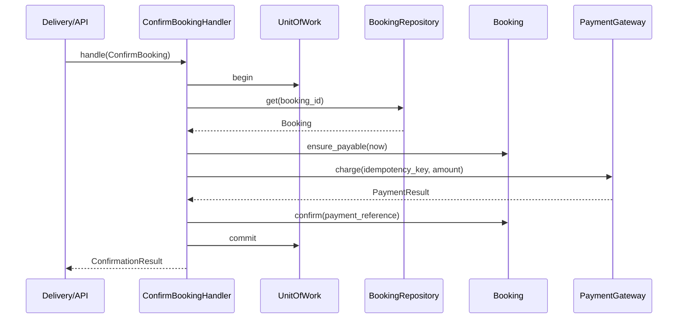
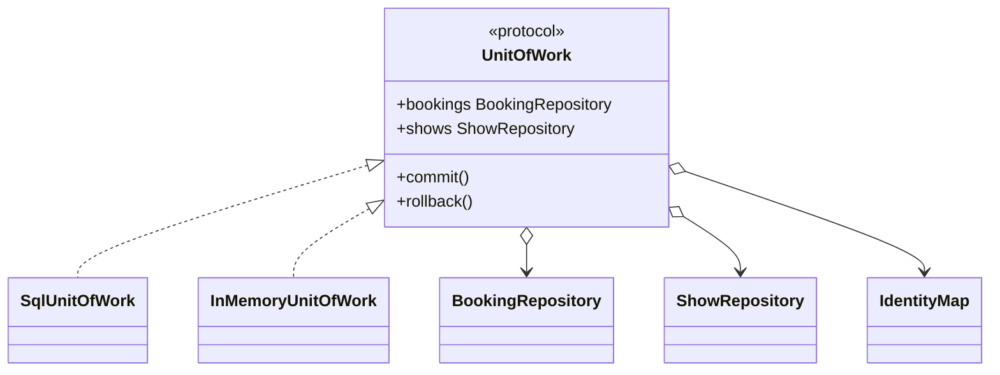
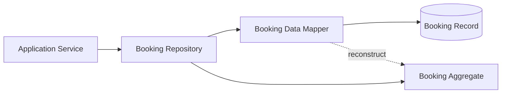
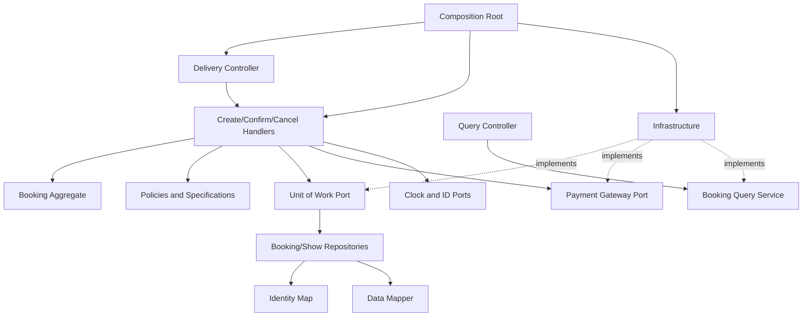

# Topic 9 - Application Patterns and Reusable Building Blocks

[Curriculum index](../README.md) | [Preparation roadmap](../roadmap.md) |
[Previous topic](./08-behavioral-design-patterns.md) |
[Next topic](./10-api-contracts-and-error-modeling.md)

- **Category:** Application architecture and collaboration boundaries
- **Difficulty:** Intermediate to advanced
- **Priority:** Essential
- **Prerequisites:** Topics 3 and 5-8
- **Running example:** Movie Ticket Booking use cases, persistence seams,
  policies, time, identity, events, and external providers
- **Output:** A cohesive application layer with explicit use cases, domain
  ownership, ports, repositories, transaction scope, deterministic utilities,
  stable messages/results, and a visible composition root

## Outcome

After completing this topic, you should be able to:

- Separate delivery, application, domain, and infrastructure responsibilities
  without creating ceremonial layers.
- Design one application service/handler per cohesive use case with explicit
  input, output, authorization, transaction, and failure boundaries.
- Distinguish an application service from a domain service, entity, repository,
  gateway, controller, and facade.
- Define repository contracts around aggregate/domain needs rather than exposing
  database or collection mechanics.
- Use a Unit of Work to make one local transaction boundary explicit, including
  commit, rollback, ownership, and event timing.
- Explain Identity Map guarantees and scope without confusing it with cache,
  repository, or distributed identity.
- Keep data mapping between persistence records and domain objects at an
  infrastructure boundary.
- Design ports/gateways in application language and adapt external providers
  without leaking their models.
- Inject clocks, ID generators, randomness, and other nondeterminism through
  narrow deterministic contracts.
- Use policies, strategies, and specifications precisely for decisions and
  composable predicates.
- Capture typed domain events and publish them only under a truthful transaction
  and delivery contract.
- Apply constructor injection and maintain one visible composition root without
  falling into Service Locator or global registry patterns.
- Separate command/use-case writes from purpose-built queries when one domain
  object graph is a poor read model.
- Use DTOs and mappers deliberately so mutable internal entities do not become
  public contracts.
- Choose Transaction Script, Active Record, direct in-memory collections, or a
  richer domain/application pattern based on current complexity.
- Test contracts across fakes and real implementations, including transaction,
  identity, mapping, event, and dependency-wiring behavior.
- Evolve an in-memory interview solution toward persistence without rewriting
  domain policy or overstating distributed guarantees.

## Core idea

Application patterns answer where coordination and boundaries belong:

```text
What executes one user/system use case?              -> Application Service / Handler
What domain rule spans no natural entity owner?      -> Domain Service / Policy
How does domain code obtain/save aggregates?         -> Repository
What defines one local atomic persistence scope?     -> Unit of Work
How is one in-memory object kept per identity/scope? -> Identity Map
Who translates persistence representation?          -> Data Mapper
How is an external capability represented?          -> Port / Gateway + Adapter
How are time, IDs, and randomness controlled?        -> Injected source abstractions
How is a reusable predicate composed?                -> Specification
How are completed domain facts captured?             -> Domain Event
Where are concrete collaborators assembled?          -> Composition Root
How does application output avoid leaking internals? -> DTO / Result / Mapper
```

These patterns are not mandatory layers. A small interview design may correctly
use one service with in-memory dictionaries and constructor-injected policies.
Introduce a boundary only when it creates an observable benefit: isolation,
atomicity, testability, replaceability, clarity, or controlled evolution.

> A layer is valuable when it owns a clear decision or boundary. A layer that
> only renames and forwards every call adds distance, not design.

## Scope boundary

This topic deeply covers:

- delivery/application/domain/infrastructure responsibility boundaries;
- Application Service and command/query handler roles;
- Domain Service and policy roles;
- Repository;
- Unit of Work;
- Identity Map;
- Data Mapper;
- ports, gateways, adapters, and provider fakes;
- clocks, ID generators, and deterministic sources;
- Specification and policy objects;
- domain-event recording and post-commit dispatch boundaries;
- dependency injection and composition roots;
- DTO/result mapping and purpose-built query services;
- Transaction Script and Active Record as simpler alternatives;
- contract tests and in-memory fakes.

It does not deeply cover:

- concrete SQL schemas, ORM sessions, isolation levels, optimistic/pessimistic
  locking, migrations, or distributed transactions; Topic 12 covers persistence
  and transaction boundaries;
- detailed public API validation/error/status contracts; Topic 10 covers them;
- thread/process safety and synchronization primitives; Topic 11 covers them;
- event sourcing, CQRS infrastructure, sagas, brokers, outbox workers, and
  distributed exactly-once claims;
- dependency-injection frameworks;
- microservice decomposition or deployment architecture.

Examples use Python 3.10+. Code fences are focused excerpts; some reference
domain types introduced nearby. Standalone implementations should include all
imports and may use `from __future__ import annotations` for forward references.

## 1. Learn

### 1.1 Four responsibility zones

Use zones as reasoning boundaries, not a required folder count:

```text
Delivery        -> HTTP/CLI/UI parsing, authentication context, status/format
Application     -> use-case orchestration, authorization call, transaction scope
Domain          -> invariants, lifecycle, calculations, domain decisions
Infrastructure  -> database, provider SDK, filesystem, clock, message transport
```

Dependency direction aims inward:

```text
delivery ------> application ------> domain
                      ^                ^
                      | implements ports
infrastructure -------+----------------+
```

Infrastructure implements contracts owned by the inner consumer. Domain code
should not import controllers, ORM models, provider SDKs, or concrete databases.

Pragmatic exceptions are fine when named. A five-class script may not need four
packages, but the responsibilities should still be explainable.

### 1.2 Responsibility placement test

Ask these questions in order:

1. Is it an invariant of one entity/aggregate? Put it there.
2. Is it a domain calculation/decision spanning concepts with no natural entity
   owner? Consider a Domain Service or Policy.
3. Is it orchestration of one use case across domain objects and boundaries?
   Application Service.
4. Is it loading/saving aggregates? Repository/Unit of Work.
5. Is it a foreign system capability? Port plus infrastructure Adapter/Gateway.
6. Is it delivery formatting/authentication extraction? Delivery boundary.
7. Is it only wiring/lifetime selection? Composition root.

Do not put behavior into a service merely because several classes are involved.
An entity can receive collaborators or value inputs and still own its invariant.

### 1.3 Boundary selection map

| Pressure | First candidate | Proof it earns the cost |
|---|---|---|
| One use case coordinates several owners | Application Service | one clear transaction/result boundary |
| Domain rule lacks entity owner | Domain Service/Policy | pure domain language, no infrastructure |
| Persistence mechanism should be hidden | Repository | domain/application contract survives storage change |
| Several changes commit/rollback together | Unit of Work | tests prove atomic commit/rollback boundary |
| Repeated loads must share object identity in one scope | Identity Map | same identity returns same object in that scope |
| Record/domain representations differ | Data Mapper | translation isolated from both models |
| External service must be replaceable | Port/Gateway | provider types/errors do not escape |
| Time/IDs/randomness make tests flaky | injected source | exact deterministic boundary tests |
| Predicates combine/reuse | Specification | pure explainable predicate composition |
| Independent reactions follow a domain fact | Domain Event | fact recorded with explicit publish timing |
| Concrete choices/lifetimes are scattered | Composition Root | one visible object graph |
| Reads need a different shape/performance | Query Service/read DTO | avoids loading/leaking write model |

### 1.4 Application Service: precise role

An Application Service implements a user/system use case. It typically:

- accepts a command/query value and actor/context;
- validates application-level input and authorization;
- opens or joins one Unit of Work;
- loads aggregate roots through repositories;
- calls domain behavior/policies;
- invokes external ports in an explicit effect order;
- commits or rolls back local changes;
- arranges domain-event delivery;
- maps the result to an application DTO;
- contains little or no core domain calculation itself.



The diagram exposes a hard truth: a database transaction and provider charge
are not one atomic transaction. The handler must define effect ordering,
idempotency, unknown outcomes, and reconciliation rather than hiding them behind
`with uow:`.

### 1.5 Implement a focused Application Service

```python
from __future__ import annotations

from dataclasses import dataclass
from datetime import datetime
from decimal import Decimal
from typing import Protocol


@dataclass(frozen=True)
class ConfirmBooking:
    command_id: str
    booking_id: str
    payment_token_reference: str


@dataclass(frozen=True)
class ConfirmationResult:
    booking_id: str
    status: str
    payment_reference: str


@dataclass(frozen=True)
class ChargeResult:
    reference: str
    approved: bool


class Booking(Protocol):
    booking_id: str
    total: Decimal
    status: str

    def ensure_payable(self, now: datetime) -> None:
        ...

    def confirm(self, payment_reference: str, now: datetime) -> None:
        ...


class BookingRepository(Protocol):
    def get(self, booking_id: str) -> Booking:
        ...


class PaymentGateway(Protocol):
    def charge(
        self,
        booking_id: str,
        amount: Decimal,
        token_reference: str,
        idempotency_key: str,
    ) -> ChargeResult:
        ...


class Clock(Protocol):
    def now(self) -> datetime:
        ...


class UnitOfWork(Protocol):
    bookings: BookingRepository

    def __enter__(self) -> "UnitOfWork":
        ...

    def __exit__(self, exc_type: object, exc: object, traceback: object) -> None:
        ...

    def commit(self) -> None:
        ...


class ConfirmBookingHandler:
    def __init__(
        self,
        uow_factory: object,
        payments: PaymentGateway,
        clock: Clock,
    ) -> None:
        self._uow_factory = uow_factory
        self._payments = payments
        self._clock = clock

    def handle(self, command: ConfirmBooking) -> ConfirmationResult:
        with self._uow_factory() as uow:
            booking = uow.bookings.get(command.booking_id)
            if booking.status == "CONFIRMED":
                return ConfirmationResult(
                    booking.booking_id,
                    booking.status,
                    booking.payment_reference,
                )
            now = self._clock.now()
            booking.ensure_payable(now)
            payment = self._payments.charge(
                booking.booking_id,
                booking.total,
                command.payment_token_reference,
                command.command_id,
            )
            if not payment.approved:
                raise ValueError("payment was declined")
            booking.confirm(payment.reference, now)
            uow.commit()
            return ConfirmationResult(
                booking.booking_id,
                booking.status,
                payment.reference,
            )
```

The handler coordinates; `Booking` owns payability and transition invariants;
the gateway owns external payment translation; the UoW owns local transaction
scope; the clock owns current time.

This excerpt intentionally leaves reconciliation policy open. A charge can
succeed while local commit fails. Topic 12 will model that boundary deeply.

### 1.6 Application Service design decisions

Define for each use case:

- command/query input and result;
- actor/tenant/authorization boundary;
- aggregate roots loaded and modified;
- domain methods/policies called;
- local transaction start/commit/rollback;
- external effect ordering;
- idempotency and duplicate result behavior;
- timeout/cancellation and unknown outcome;
- domain events produced and dispatch timing;
- exception/error mapping owner;
- observability/correlation without leaking sensitive data.

Keep one class per use case when handlers are small and independent. A cohesive
`BookingService` with several closely related methods is also reasonable in an
interview. Avoid both extremes: one god application service and hundreds of
one-line pass-through classes.

### 1.7 Application Service versus related roles

| Role | Primary responsibility |
|---|---|
| Controller/delivery handler | Parse protocol input, authentication context, map response |
| Application Service | Coordinate one use case and boundaries |
| Domain entity/aggregate | Own identity, invariants, lifecycle state |
| Domain Service | Domain decision with no natural entity owner |
| Repository | Retrieve/persist aggregate-oriented abstraction |
| Gateway/port | Expose external capability in application language |
| Facade | Simplify subsystem for clients; may overlap application-service shape |
| Composition root | Choose concrete implementations/lifetimes |

A method may perform two roles in a small solution. Name the trade-off instead
of manufacturing empty wrappers.

### 1.8 Domain Service: precise role

A Domain Service expresses domain behavior that:

- uses domain language;
- is not naturally owned by one entity/value;
- may coordinate several domain values/aggregates for a calculation or decision;
- does not orchestrate infrastructure, transactions, controllers, or transport;
- is preferably stateless and deterministic.

Example: transfer eligibility between two accounts may depend equally on both;
seat adjacency calculation may use a seat-map value and party preferences.

```python
from dataclasses import dataclass


@dataclass(frozen=True)
class SeatPosition:
    seat_id: str
    row: str
    number: int


class AdjacencyService:
    def find_contiguous(
        self,
        seats: tuple[SeatPosition, ...],
        count: int,
    ) -> tuple[SeatPosition, ...]:
        if count <= 0:
            raise ValueError("count must be positive")
        by_row: dict[str, list[SeatPosition]] = {}
        for seat in seats:
            by_row.setdefault(seat.row, []).append(seat)
        for row in sorted(by_row):
            ordered = sorted(by_row[row], key=lambda seat: (seat.number, seat.seat_id))
            for start in range(0, len(ordered) - count + 1):
                candidate = ordered[start : start + count]
                if all(
                    candidate[index].number + 1 == candidate[index + 1].number
                    for index in range(len(candidate) - 1)
                ):
                    return tuple(candidate)
        return ()
```

If the behavior is simply one entity's invariant, keep it on the entity. If it
loads data, opens a transaction, charges payment, and sends email, it is an
Application Service, not a Domain Service.

### 1.9 Commands, queries, DTOs, and results

Application inputs/outputs should be explicit immutable values:

```python
from dataclasses import dataclass
from datetime import datetime
from decimal import Decimal


@dataclass(frozen=True, slots=True)
class CreateBooking:
    command_id: str
    user_id: str
    show_id: str
    seat_ids: tuple[str, ...]


@dataclass(frozen=True, slots=True)
class BookingSummary:
    booking_id: str
    status: str
    amount: Decimal
    hold_expires_at: datetime
```

These values:

- make use-case contracts readable;
- prevent long positional argument lists;
- avoid leaking mutable entities and repositories;
- support validation, mapping, serialization, and versioning at boundaries;
- do not automatically imply the GoF Command pattern or CQRS.

### 1.10 Repository: precise role

**Repository:** a domain-oriented collection abstraction for retrieving and
persisting aggregate roots while hiding storage/query mechanics from the
application/domain.

Good repository methods express current use-case/domain needs:

```text
get(booking_id)
add(booking)
find_pending_for_show(show_id, expires_before)
```

Weak repository interfaces expose persistence mechanics:

```text
execute_sql(...)
query(table, columns, joins, where)
save_any(object)
generic CRUD for every type
```

A repository is not merely a dictionary with a prestigious name. It earns its
boundary when storage replacement, aggregate reconstruction, transaction scope,
or contract testing matters.

### 1.11 Define an aggregate-oriented Repository

```python
from __future__ import annotations

from datetime import datetime
from typing import Protocol


class BookingNotFound(LookupError):
    pass


class BookingRepository(Protocol):
    def add(self, booking: Booking) -> None:
        ...

    def get(self, booking_id: str) -> Booking:
        """Return one tracked aggregate or raise BookingNotFound."""
        ...

    def find_expired_pending(
        self,
        show_id: str,
        as_of: datetime,
    ) -> tuple[Booking, ...]:
        ...
```

Contract decisions:

- missing result: `None`, typed exception, or explicit result;
- aggregate root versus arbitrary child retrieval;
- whether `add` rejects duplicate identity;
- ordering of multi-results;
- snapshot/tracked/mutable return semantics;
- scope and identity guarantee;
- save explicit versus change tracking on UoW commit;
- concurrency/version behavior;
- deletion versus archival lifecycle;
- transaction ownership (usually UoW, not each method).

### 1.12 In-memory Repository as a contract fake

```python
from collections.abc import Iterable


class InMemoryBookingRepository:
    def __init__(self, bookings: Iterable[Booking] = ()) -> None:
        self._items = {booking.booking_id: booking for booking in bookings}
        if len(self._items) != len(tuple(bookings)):
            raise ValueError("booking IDs must be unique")

    def add(self, booking: Booking) -> None:
        if booking.booking_id in self._items:
            raise ValueError("booking already exists")
        self._items[booking.booking_id] = booking

    def get(self, booking_id: str) -> Booking:
        try:
            return self._items[booking_id]
        except KeyError as error:
            raise BookingNotFound(booking_id) from error

    def find_expired_pending(
        self,
        show_id: str,
        as_of: datetime,
    ) -> tuple[Booking, ...]:
        return tuple(
            sorted(
                (
                    booking
                    for booking in self._items.values()
                    if booking.show_id == show_id
                    and booking.status == "PENDING_PAYMENT"
                    and booking.hold_expires_at <= as_of
                ),
                key=lambda booking: (booking.hold_expires_at, booking.booking_id),
            )
        )
```

There is a subtle bug: `bookings` may be a one-shot iterable. It is consumed by
the dictionary before `tuple(bookings)` counts it. Snapshot once first:

```python
from collections.abc import Iterable


class InMemoryBookingRepository:
    def __init__(self, bookings: Iterable[Booking] = ()) -> None:
        snapshot = tuple(bookings)
        self._items = {booking.booking_id: booking for booking in snapshot}
        if len(self._items) != len(snapshot):
            raise ValueError("booking IDs must be unique")
```

Fakes must honor the same missing, ordering, uniqueness, identity, and mutation
contract as production repositories. An unrealistically permissive fake creates
false confidence.

### 1.13 Repository boundaries and query pressure

Prefer one repository per aggregate type/boundary, not one per database table.
A `BookingRepository` may reconstruct Booking plus owned seat-selection/payment
attempt values. Do not expose repositories for every internal child by default.

Avoid returning unbounded `list_all()` merely to filter in application memory.
Add a use-case-shaped query or a dedicated Query Service when data volume and
read shape justify it.

Repository is not authorization. A repository may enforce tenant scope as a
data-safety invariant, but application authorization still needs actor/policy
semantics.

### 1.14 Unit of Work: precise role

**Unit of Work (UoW):** tracks the local work performed during one application
operation and coordinates persistence as one commit or rollback boundary.

It typically owns:

- transaction/session/connection lifetime;
- repositories sharing that transaction;
- Identity Map scope;
- changed aggregate tracking;
- commit/rollback;
- collection of domain events from committed aggregates;
- cleanup in `__exit__`.



One UoW usually corresponds to one application use case/transaction, not one
global application singleton.

### 1.15 Define a Unit of Work contract

```python
from __future__ import annotations

from typing import Protocol


class UnitOfWork(Protocol):
    bookings: BookingRepository

    def __enter__(self) -> "UnitOfWork":
        ...

    def __exit__(self, exc_type: object, exc: object, traceback: object) -> None:
        ...

    def commit(self) -> None:
        ...

    def rollback(self) -> None:
        ...
```

Usage makes commit visible:

```python
def cancel_booking(command: CancelBooking, uow_factory: object) -> BookingSummary:
    with uow_factory() as uow:
        booking = uow.bookings.get(command.booking_id)
        booking.cancel(command.reason_code)
        uow.commit()
        return to_booking_summary(booking)
```

An implicit commit on successful `__exit__` is concise but can persist changes
when a handler accidentally forgets its intended boundary. Explicit `commit()`
is often safer and easier to review. `__exit__` should roll back when no commit
occurred or an exception escapes.

### 1.16 In-memory Unit of Work for use-case tests

```python
from copy import deepcopy


class InMemoryUnitOfWork:
    def __init__(self, initial: dict[str, object]) -> None:
        self._initial = initial
        self.bookings: InMemoryBookingRepository
        self.committed = False
        self.rolled_back = False

    def __enter__(self) -> "InMemoryUnitOfWork":
        working = deepcopy(tuple(self._initial.values()))
        self.bookings = InMemoryBookingRepository(working)
        self.committed = False
        self.rolled_back = False
        return self

    def commit(self) -> None:
        if self.committed:
            raise RuntimeError("unit of work already committed")
        self._initial.clear()
        self._initial.update(self.bookings._items)
        self.committed = True

    def rollback(self) -> None:
        self.rolled_back = True

    def __exit__(self, exc_type: object, exc: object, traceback: object) -> None:
        if exc_type is not None or not self.committed:
            self.rollback()
```

This is a teaching fake, not a database transaction:

- it uses `deepcopy`, unsuitable for arbitrary resources/ORM objects;
- it has no concurrent conflict/version detection;
- commit mutates a shared dictionary non-atomically;
- it reaches into the fake repository's private storage;
- it does not model isolation or durable failure.

Use it to test application commit intent and rollback behavior, not to claim
production transactional equivalence.

### 1.17 Unit of Work rules

Define:

- who creates and closes it;
- which repositories share the transaction;
- nested UoW behavior (usually reject/avoid unless designed);
- explicit versus implicit commit;
- rollback on exception/no commit;
- whether commit may be called twice;
- when generated IDs/versions become available;
- event collection and post-commit dispatch;
- behavior when commit succeeds but response/event dispatch fails;
- timeout/cancellation;
- optimistic conflict/error mapping;
- whether read-only queries need a UoW.

A UoW cannot make a payment provider and local database atomic. Do not keep a
database transaction open during long external I/O without assessing locking,
latency, and failure consequences.

### 1.18 Identity Map: precise role

**Identity Map:** ensures that within one defined scope, each persistent/domain
identity is represented by at most one in-memory object instance.

Why it matters:

```text
load booking B through repository A -> object X
load booking B through repository B -> object X, not conflicting object Y
```

Without this guarantee, two instances can be modified differently and the last
write silently wins. Equality alone does not solve competing mutable state.

Typical scope: one Unit of Work/request. It is not normally a global cache.

### 1.19 Implement a scoped Identity Map

```python
from __future__ import annotations

from typing import Generic, Hashable, TypeVar


K = TypeVar("K", bound=Hashable)
T = TypeVar("T")


class IdentityConflict(RuntimeError):
    pass


class IdentityMap(Generic[K, T]):
    def __init__(self) -> None:
        self._items: dict[K, T] = {}

    def get(self, identity: K) -> T | None:
        return self._items.get(identity)

    def add(self, identity: K, entity: T) -> T:
        existing = self._items.get(identity)
        if existing is not None and existing is not entity:
            raise IdentityConflict(f"identity {identity!r} already has an instance")
        self._items[identity] = entity
        return entity

    def get_or_add(self, identity: K, loader: object) -> T:
        existing = self.get(identity)
        if existing is not None:
            return existing
        loaded = loader()
        return self.add(identity, loaded)

    def clear(self) -> None:
        self._items.clear()
```

In concurrent code, `get_or_add` needs synchronization if one-instance identity
is guaranteed across threads. More commonly, each request/UoW is confined to
one execution flow and never shared.

### 1.20 Identity Map versus cache

| Identity Map | Cache |
|---|---|
| Guarantees one object instance per identity in scope | Reuses data/result for performance |
| Usually UoW/request scoped | May be process/distributed and longer-lived |
| Mutable tracked entity semantics | Often immutable snapshot/value semantics |
| Cleared when UoW ends | TTL/eviction/invalidation policy |
| Correctness of object graph | Performance/freshness trade-off |

Do not keep mutable domain entities in a process-global cache and call it an
Identity Map. Tenant scope, staleness, conflicting transactions, memory, and
thread safety become severe.

### 1.21 Data Mapper: precise role

**Data Mapper:** translates between domain objects and persistence
representations without requiring either model to know the other.



Benefits:

- domain constructors/invariants stay free of ORM/table concerns;
- persistence can flatten, normalize, rename, and version fields;
- legacy schemas do not dictate domain language;
- mapping has focused round-trip/error tests.

Cost: explicit translation and evolution rules. For simple CRUD, Active Record
or direct records may be cheaper.

### 1.22 Implement a deliberate Data Mapper

```python
from dataclasses import dataclass
from datetime import datetime
from decimal import Decimal


@dataclass(frozen=True)
class BookingRecord:
    booking_id: str
    user_id: str
    show_id: str
    seat_ids_csv: str
    amount_minor: int
    currency: str
    status_code: str
    hold_expires_at_iso: str
    version: int


@dataclass
class BookingEntity:
    booking_id: str
    user_id: str
    show_id: str
    seat_ids: tuple[str, ...]
    amount: Decimal
    currency: str
    status: str
    hold_expires_at: datetime
    version: int


class BookingDataMapper:
    _known_statuses = frozenset(
        {"PENDING_PAYMENT", "CONFIRMED", "CANCELLED", "EXPIRED"}
    )

    def to_domain(self, record: BookingRecord) -> BookingEntity:
        if record.status_code not in self._known_statuses:
            raise ValueError(f"unknown booking status: {record.status_code!r}")
        seat_ids = tuple(item for item in record.seat_ids_csv.split(",") if item)
        if not seat_ids or len(set(seat_ids)) != len(seat_ids):
            raise ValueError("persisted booking has invalid seats")
        expires_at = datetime.fromisoformat(record.hold_expires_at_iso)
        if expires_at.tzinfo is None:
            raise ValueError("persisted deadline must be timezone-aware")
        return BookingEntity(
            booking_id=record.booking_id,
            user_id=record.user_id,
            show_id=record.show_id,
            seat_ids=seat_ids,
            amount=Decimal(record.amount_minor) / Decimal("100"),
            currency=record.currency,
            status=record.status_code,
            hold_expires_at=expires_at,
            version=record.version,
        )

    def to_record(self, booking: BookingEntity) -> BookingRecord:
        amount_minor = int(booking.amount * Decimal("100"))
        return BookingRecord(
            booking_id=booking.booking_id,
            user_id=booking.user_id,
            show_id=booking.show_id,
            seat_ids_csv=",".join(booking.seat_ids),
            amount_minor=amount_minor,
            currency=booking.currency,
            status_code=booking.status,
            hold_expires_at_iso=booking.hold_expires_at.isoformat(),
            version=booking.version,
        )
```

Production mapping should validate finite, normalized money and safe round-trip
conversion rather than truncating arbitrary decimals. CSV seat storage is used
only to demonstrate representation change; a normalized child table or encoded
structured column may be more appropriate.

Mapping invalid stored data is an infrastructure/data-integrity failure, not
ordinary user validation.

### 1.23 Mapping and reconstruction rules

Define:

- trusted/untrusted persistence data assumptions;
- stable type/status codes and unknown-value behavior;
- timezone, decimal/minor-unit, locale, and encoding rules;
- aggregate constructor versus rehydration path;
- how invariants are checked without emitting new events during rehydration;
- version/optimistic-concurrency field;
- owned child identity/order;
- optional/null/backward-compatible fields;
- round-trip expectations;
- migration responsibility.

Do not let an ORM bypass critical invariants invisibly, but also do not call
public “create new booking” behavior during every load if it generates new IDs,
timestamps, or events.

### 1.24 Port and Gateway: precise role

A **port** is a contract in the consuming application's language. A **gateway**
often names an outbound port representing a remote/external capability. A
provider-specific Adapter implements it.

```text
Application -> PaymentGateway (port) <- RazorpayAdapter -> SDK/API
Application -> BankGateway    (port) <- BankHostAdapter -> network
```

Good port:

```python
from dataclasses import dataclass
from decimal import Decimal
from typing import Protocol


@dataclass(frozen=True)
class PaymentResult:
    provider_reference: str
    status: str


class PaymentGateway(Protocol):
    def charge(
        self,
        booking_id: str,
        amount: Decimal,
        token_reference: str,
        idempotency_key: str,
    ) -> PaymentResult:
        ...
```

Weak port:

```text
post_to_stripe(path, json, headers) -> StripeResponse
```

The weak port mirrors transport/provider choices, so the application remains
coupled even behind an interface.

### 1.25 Gateway contract decisions

Define:

- operation and application-shaped values;
- sync/async, timeout, cancellation, and latency;
- idempotency key and deduplication scope;
- approved, declined, pending, unknown, and unavailable outcomes;
- retryable versus permanent errors;
- provider reference/correlation;
- money units/currency/rounding;
- sensitive-data handling;
- observability and redaction;
- compensation/reconciliation operations;
- whether the gateway owns client/resource lifetime.

A fake gateway should model failures and duplicates, not only always-success.
Provider-specific exceptions/DTOs should be mapped by an Adapter at this
boundary (Topic 7).

### 1.26 Ports are not all repositories

Both use dependency inversion, but intent differs:

- Repository presents a domain collection of aggregates and participates in a
  Unit of Work.
- Gateway performs a capability against an external boundary.
- Query Service retrieves a purpose-built read projection.
- Clock/ID source supplies nondeterminism.

Do not call `EmailRepository.send()` or `PaymentRepository.charge()` merely to
standardize naming.

### 1.27 Clock as a reusable boundary

Time is an input. Direct `datetime.now()` calls make boundary tests flaky and
scatter timezone policy.

```python
from dataclasses import dataclass
from datetime import datetime, timedelta, timezone
from typing import Protocol


class Clock(Protocol):
    def now(self) -> datetime:
        ...


class UtcSystemClock:
    def now(self) -> datetime:
        return datetime.now(timezone.utc)


@dataclass
class MutableClock:
    current: datetime

    def __post_init__(self) -> None:
        if self.current.tzinfo is None:
            raise ValueError("clock instant must be timezone-aware")

    def now(self) -> datetime:
        return self.current

    def advance(self, delta: timedelta) -> None:
        if delta < timedelta(0):
            raise ValueError("clock cannot move backward in this fake")
        self.current += delta
```

Use instants in UTC internally. Business dates/windows may require an injected
business timezone/calendar; a clock alone does not decide “weekend in theatre
local time.”

### 1.28 ID generators and randomness

```python
from typing import Protocol
from uuid import uuid4


class IdGenerator(Protocol):
    def new_id(self) -> str:
        ...


class UuidGenerator:
    def new_id(self) -> str:
        return str(uuid4())


class SequenceIdGenerator:
    def __init__(self, *values: str) -> None:
        self._values = iter(values)

    def new_id(self) -> str:
        try:
            return next(self._values)
        except StopIteration as error:
            raise RuntimeError("test ID sequence is exhausted") from error
```

ID contracts should define uniqueness scope, opacity, case/normalization, sort
claims, generation timing, collision behavior, and whether clients may supply
an idempotency key separately.

Inject randomness for lottery/allocation/testing through a narrow selector or
random-source contract. Never use predictable test randomness for security
tokens, and never expose a global seed shared by unrelated tests.

### 1.29 Policy objects

A **Policy** names a domain decision in domain language. It may be implemented
as Strategy, function, rule table, or Specification composition.

```python
from dataclasses import dataclass
from datetime import datetime, timedelta
from decimal import Decimal


@dataclass(frozen=True)
class CancellationDecision:
    allowed: bool
    refund_rate: Decimal
    reason_code: str


class CancellationPolicy:
    def decide(
        self,
        show_starts_at: datetime,
        requested_at: datetime,
        provider_cancelled: bool,
    ) -> CancellationDecision:
        if provider_cancelled:
            return CancellationDecision(True, Decimal("1"), "provider_cancelled")
        remaining = show_starts_at - requested_at
        if remaining >= timedelta(hours=24):
            return CancellationDecision(True, Decimal("1"), "early")
        if remaining >= timedelta(hours=2):
            return CancellationDecision(True, Decimal("0.5"), "late")
        return CancellationDecision(False, Decimal("0"), "window_closed")
```

Policy returns a decision; the Application Service/entity applies effects and
transitions. Keep provider calls, persistence, and notifications out of a pure
policy.

### 1.30 Specification: precise role

**Specification:** an explicit, reusable predicate that states whether a
candidate satisfies a business criterion and can often be composed.

```python
from __future__ import annotations

from dataclasses import dataclass
from decimal import Decimal
from typing import Generic, Protocol, TypeVar


T = TypeVar("T")


class Specification(Protocol, Generic[T]):
    def is_satisfied_by(self, candidate: T) -> bool:
        ...


@dataclass(frozen=True)
class BookingCandidate:
    is_premium_member: bool
    subtotal: Decimal


@dataclass(frozen=True)
class MinimumSubtotal:
    amount: Decimal

    def is_satisfied_by(self, candidate: BookingCandidate) -> bool:
        return candidate.subtotal >= self.amount


class PremiumMember:
    def is_satisfied_by(self, candidate: BookingCandidate) -> bool:
        return candidate.is_premium_member


@dataclass(frozen=True)
class AllOf(Generic[T]):
    specifications: tuple[Specification[T], ...]

    def __post_init__(self) -> None:
        if not self.specifications:
            raise ValueError("AllOf requires at least one specification")

    def is_satisfied_by(self, candidate: T) -> bool:
        return all(spec.is_satisfied_by(candidate) for spec in self.specifications)
```

Specification overlaps structurally with Strategy/Composite:

- Specification emphasizes a named business predicate and composition.
- Strategy emphasizes interchangeable complete algorithms.
- Composite describes the tree structure of leaf/group components.

### 1.31 Specification boundaries

Define:

- pure versus I/O-backed evaluation;
- boolean versus explanatory result;
- short-circuit versus collect-all failures;
- immutable configuration;
- composition identities/empty-group behavior;
- time/context supplied explicitly;
- whether it selects a collection or checks one candidate;
- serialization and safe allowlisting if user-configured.

Avoid making one Specification simultaneously evaluate in memory and generate
arbitrary SQL. Translation to a persistence query is a separate infrastructure
concern and not every domain predicate is safely/efficiently translatable.

### 1.32 Domain Events as recorded facts

A domain event describes something meaningful that already happened inside the
domain:

```python
from dataclasses import dataclass
from datetime import datetime


@dataclass(frozen=True, slots=True)
class BookingConfirmed:
    event_id: str
    booking_id: str
    user_id: str
    occurred_at: datetime
    aggregate_version: int
```

An aggregate can record events without publishing them itself:

```python
class RecordsEvents:
    def __init__(self) -> None:
        self._events: list[object] = []

    def _record(self, event: object) -> None:
        self._events.append(event)

    def pull_events(self) -> tuple[object, ...]:
        events = tuple(self._events)
        self._events.clear()
        return events
```

This keeps the domain free of broker/email dependencies. The application/UoW
collects events and dispatches only under a defined transaction policy.

### 1.33 Domain-event timing

Three levels:

1. **Recorded:** aggregate state changed and event sits in memory.
2. **Committed:** authoritative local transaction succeeded.
3. **Published/delivered:** dispatcher/subscribers received or durably queued it.

Do not collapse them into “event sent.” If local commit fails, recorded events
must not escape as facts. If commit succeeds but in-memory dispatch fails, state
is committed and delivery needs retry/recovery. A transactional outbox records
the event alongside state, but at-least-once subscribers still need
idempotency.

### 1.34 Dependency Injection: precise role

**Dependency Injection (DI):** supply an object's collaborators from outside
rather than letting it construct or locate hidden concrete dependencies.

Constructor injection is the default:

```python
class CreateBookingHandler:
    def __init__(
        self,
        uow_factory: object,
        pricing: object,
        clock: Clock,
        ids: IdGenerator,
    ) -> None:
        self._uow_factory = uow_factory
        self._pricing = pricing
        self._clock = clock
        self._ids = ids
```

Benefits:

- required dependencies are visible;
- invalid partially configured objects are harder to create;
- tests provide deterministic fakes;
- lifetimes are controlled at the composition root;
- high-level code depends on narrow contracts.

Method injection fits a dependency needed for one call. Property/setter
injection risks “forgot to configure” states and should be rare.

### 1.35 Composition Root

**Composition Root:** the single outer location where concrete implementations
and lifetimes are selected and assembled.

```python
from dataclasses import dataclass


@dataclass(frozen=True)
class Application:
    create_booking: object
    confirm_booking: object
    booking_queries: object


def build_application(settings: object) -> Application:
    clock = UtcSystemClock()
    ids = UuidGenerator()
    database = Database(settings.database_url)
    uow_factory = lambda: SqlUnitOfWork(database)
    payments = RazorpayAdapter(settings.payment, clock)
    pricing = StandardPricingPolicy()
    return Application(
        create_booking=CreateBookingHandler(uow_factory, pricing, clock, ids),
        confirm_booking=ConfirmBookingHandler(uow_factory, payments, clock),
        booking_queries=SqlBookingQueryService(database),
    )
```

Undefined infrastructure names are placeholders showing dependency direction.
The composition root may know every concrete type; application/domain code
should not.

### 1.36 Dependency lifetimes

| Dependency | Typical scope | Reason |
|---|---|---|
| immutable configuration | application | stable shared values |
| stateless policy/strategy | application | safe reuse |
| HTTP/DB client pool | application | expensive managed resource |
| Unit of Work/session | use case/request | transaction/identity isolation |
| mutable request context | request | actor/tenant isolation |
| command handler | application if stateless; request if contextful | explicit |
| aggregate/domain entity | Unit of Work | mutable identity consistency |
| test clock/ID sequence | test case | isolation/determinism |

Sharing is a design decision, not a container default. Define shutdown/cleanup
for pools/clients and prevent request state from entering application singletons.

### 1.37 Service Locator anti-pattern

```python
def confirm_booking(command: object) -> object:
    repository = GlobalContainer.get("booking_repository")
    payments = GlobalContainer.get("payments")
    clock = GlobalContainer.get("clock")
    ...
```

Problems:

- dependencies are hidden from constructor/signature;
- any code can request anything;
- runtime string/key failures replace type/creation-time checks;
- tests mutate global container state;
- lifetime and ownership are unclear;
- domain code becomes coupled to infrastructure/framework.

A DI container may build objects at the composition root. Passing the container
into business code turns it into Service Locator.

### 1.38 DTO and result mapping

Do not return mutable tracked entities directly across delivery boundaries:

```python
from dataclasses import dataclass
from datetime import datetime
from decimal import Decimal


@dataclass(frozen=True, slots=True)
class BookingDetails:
    booking_id: str
    show_id: str
    seat_ids: tuple[str, ...]
    amount: Decimal
    currency: str
    status: str
    hold_expires_at: datetime | None


def to_booking_details(booking: BookingEntity) -> BookingDetails:
    return BookingDetails(
        booking_id=booking.booking_id,
        show_id=booking.show_id,
        seat_ids=tuple(booking.seat_ids),
        amount=booking.amount,
        currency=booking.currency,
        status=booking.status,
        hold_expires_at=booking.hold_expires_at,
    )
```

An application result is not automatically a public JSON schema. Delivery may
further map timestamps, money, links, localization, and error representation
(Topic 10).

### 1.39 Query Service and read models

Use a purpose-built Query Service when a read:

- spans several aggregates/tables;
- needs projection, filtering, sorting, and pagination;
- should not load mutable write aggregates;
- has different authorization/tenant rules;
- benefits from a denormalized representation.

```python
from dataclasses import dataclass
from datetime import datetime
from decimal import Decimal
from typing import Protocol


@dataclass(frozen=True)
class BookingListItem:
    booking_id: str
    movie_title: str
    theatre_name: str
    starts_at: datetime
    amount: Decimal
    status: str


class BookingQueryService(Protocol):
    def list_for_user(
        self,
        user_id: str,
        cursor: str | None,
        limit: int,
    ) -> tuple[tuple[BookingListItem, ...], str | None]:
        ...
```

This is a local read/write separation, not necessarily full CQRS. Keep
pagination, ordering, authorization, freshness, and snapshot semantics explicit.

### 1.40 Simpler application/data alternatives

#### Transaction Script

One procedure coordinates validation/data/effects for a simple use case. It is
often the right starting point. Refactor when domain rules duplicate and
lifecycle invariants become hard to protect.

#### Active Record

Domain/data object contains persistence methods such as `booking.save()`. It is
productive for CRUD-centered applications but couples model and persistence,
makes aggregate transaction scope less explicit, and can invite hidden I/O.

#### Table Data Gateway

One gateway handles operations for a table/record set. Useful for data-centric
systems; less domain-oriented than Repository.

#### Direct in-memory collection

Perfectly adequate for scoped interview solutions. State that dictionaries are
the persistence boundary and show where a Repository/UoW would be introduced.

### 1.41 Pattern relationship matrix

| Building block | Input/output language | Owns transaction? | Owns domain rules? |
|---|---|---:|---:|
| Application Service | use-case command/result | chooses scope | orchestrates, does not calculate core rules |
| Domain Service/Policy | domain values/decision | No | Yes |
| Repository | aggregate identities/roots | participates | No business workflow |
| Unit of Work | repositories/commit | Yes, local | No |
| Identity Map | identity/entity instance | scoped by UoW | No |
| Data Mapper | record/domain representation | No | validates mapping integrity |
| Gateway | application capability/result | external effect, not local UoW | No domain workflow |
| Specification | candidate/predicate result | No | one business criterion |
| Query Service | query/projection | read scope | read policy only |
| Composition Root | configuration/object graph | creates scopes | No |

### 1.42 Combining building blocks without layer ceremony

```text
Delivery
  -> CreateBookingHandler                         [Application Service]
       -> uow_factory()                           [Unit of Work]
            -> bookings                           [Repository]
                 -> identity map + data mapper    [Infrastructure helpers]
       -> pricing / eligibility / cancellation    [Policies/Specifications]
       -> clock + id generator                    [Deterministic sources]
       -> payment gateway                         [Outbound port]
       -> aggregate records domain events         [Facts]
       -> commit; dispatch/outbox under policy
  <- BookingDetails                               [Application result DTO]

Composition Root chooses concrete SQL/in-memory/provider implementations.
Query Service serves optimized read projections separately when needed.
```

Remove any line whose pressure does not exist. A direct in-memory collection,
one handler, injected clock, and fake gateway can be a complete interview
solution.

## 2. Recognize

### 2.1 Requirement signals

Application Service:

- “Execute checkout/cancellation/check-in as one use case.”
- “Coordinate domain behavior, persistence, and provider boundaries.”

Domain Service/Policy:

- “This business decision spans values but belongs to no one entity.”
- “Cancellation/refund/adjacency eligibility changes independently.”

Repository/UoW/Identity Map/Data Mapper:

- “Replace in-memory dictionaries with persistence without coupling domain.”
- “Several aggregate changes must commit/rollback together.”
- “Repeated loads in one transaction must return one object instance.”
- “Database records and domain model have different shape.”

Gateway:

- “Payment/bank/email/provider behavior must be replaceable/testable.”

Clock/IDs:

- “Expiry/time/identifier tests must be deterministic.”

Specification:

- “Business predicates should be named, reused, and composed.”

Domain Event:

- “Independent reactions occur after a meaningful domain fact.”

DI/Composition Root:

- “Concrete choices and lifetimes should be visible and replaceable.”

Query Service:

- “Read projection spans data and should not hydrate mutable aggregates.”

### 2.2 Application-layer smells

- Controllers contain transactions, domain transitions, provider calls, and
  persistence queries.
- Entities import SDK clients or database sessions.
- Services are named `Manager`/`Helper` and own unrelated behavior.
- Every layer forwards identical parameters without owning a decision.
- Repository exposes generic query builders/ORM objects to application code.
- Each repository method commits independently during one use case.
- Same aggregate identity loads as multiple mutable instances in one UoW.
- Persistence column names/status codes leak throughout domain classes.
- `datetime.now()`, `uuid4()`, or random calls are scattered in core behavior.
- Global container lookups hide dependencies.
- Domain events publish before commit or aggregates call email directly.
- Application returns live mutable entities/lazy ORM relations to delivery.
- Read screens load entire aggregates and filter thousands of rows in memory.
- In-memory fakes do not match real missing/ordering/identity/transaction
  semantics.

### 2.3 False positives

- A class ending in `Service` is not necessarily an Application/Domain Service.
- A dictionary wrapper is not automatically a Repository.
- `with session:` is not enough to prove a coherent UoW contract.
- An ORM session may already provide Identity Map/UoW internally; wrapping it
  without need adds ceremony.
- Any mapping function is not necessarily a Data Mapper pattern.
- Every dependency interface is not a Gateway.
- An in-memory test implementation is not automatically an Adapter.
- A boolean method is not automatically a Specification.
- A callback payload is not automatically a domain event.
- Constructor parameters alone do not guarantee good DI if they accept a giant
  container.
- Separate read/write methods do not automatically mean CQRS.

### 2.4 Decision questions

Before adding an application building block, answer:

1. Which current responsibility/boundary is unclear or coupled?
2. What is the simplest direct alternative?
3. What contract does the inner consumer need?
4. What is the aggregate/transaction boundary?
5. Who owns object identity and mutable lifetime?
6. What representation is translated, and where?
7. Which effect is local versus external?
8. What happens on commit/effect/event partial failure?
9. What is the idempotency/concurrency/version policy?
10. Which nondeterministic inputs must be injected?
11. What data may cross to delivery, logs, events, or providers?
12. Which dependencies are application-, request-, UoW-, or test-scoped?
13. Can reads use a projection instead of tracked aggregates?
14. Which shared contract tests every implementation?
15. What requirement would remove this abstraction?

## 3. Model

### 3.1 Running example: pressure inventory

| Requirement | Pressure | Candidate |
|---|---|---|
| Create/confirm/cancel booking use cases | orchestration boundary | Application Services |
| Booking lifecycle/invariants | identity/state ownership | Booking aggregate |
| Cancellation refund decision | domain policy | CancellationPolicy |
| Premium + minimum subtotal eligibility | reusable predicates | Specifications |
| Storage changes from dictionaries to SQL | persistence isolation | Repositories + Data Mappers |
| Booking/show changes must commit together | local atomic scope | Unit of Work |
| Booking loaded twice in one use case | mutable identity consistency | Identity Map |
| Provider payment call | external capability | PaymentGateway + Adapter |
| Holds expire deterministically | nondeterministic time | Clock |
| IDs stable in tests/retries | identity generation | IdGenerator |
| Email/audit follow confirmation | recorded facts/reactions | Domain Events |
| Client needs booking/movie/theatre list | cross-aggregate read projection | Query Service |
| Concrete SQL/provider/test choices | wiring/lifetimes | Composition Root |

Challenge the candidates:

- In-memory dictionaries may remain simpler than repositories today.
- One aggregate plus one store may not need a formal UoW abstraction.
- An Identity Map is unnecessary when the in-memory dictionary already returns
  the same object and no separate repository scope exists.
- One direct pure predicate may not need Specification classes.
- Direct notification injection may be enough for one required reaction.
- A query can use a repository when it genuinely returns an aggregate-shaped
  result at small scale.

### 3.2 Layer and dependency diagram



The domain aggregate/policies have no arrow to application, delivery, or
infrastructure. Repositories/UoW/gateways are ports used by the application;
concrete implementations point inward by honoring them.

### 3.3 Use-case responsibility table

For `CreateBooking`:

| Step | Owner | Why |
|---:|---|---|
| Parse JSON/CLI fields | delivery | protocol-specific |
| Authenticate/extract actor | delivery/auth boundary | transport/security context |
| Authorize user action | application + policy | use-case permission |
| Open UoW | application | transaction scope |
| Load user/show | repositories | aggregate retrieval |
| Determine price | pricing policy/domain | business calculation |
| Validate seat selection/hold | aggregate/domain owner | invariant |
| Generate booking ID/current time | injected sources | nondeterminism |
| Add booking/change show inventory | repositories through UoW | tracked changes |
| Commit | UoW | local atomic boundary |
| Dispatch committed events | application/UoW dispatcher | reaction boundary |
| Return immutable summary | application mapper | stable use-case result |

### 3.4 Aggregate and Repository boundaries

Possible aggregate choices:

```text
Show aggregate: owns per-show seat availability and hold exclusivity
Booking aggregate: owns booking/payment/cancellation lifecycle
```

Creating a booking may modify both. Model whether they are:

- one transaction in one database/UoW;
- one aggregate owning the reservation while Booking is created from result;
- coordinated with optimistic versions/unique constraints;
- eventually coordinated across distributed boundaries (outside current scope).

Repository ports:

```text
ShowRepository.get(show_id) -> tracked Show
BookingRepository.add(booking)
BookingRepository.get(booking_id) -> tracked Booking
```

Do not create `ShowSeatRepository` if seats are owned children of Show and must
not be modified independently.

### 3.5 Unit of Work boundary table

| Use case | Reads/modifies | UoW scope | External effect |
|---|---|---|---|
| Create booking hold | Show + new Booking | one local commit | none |
| Confirm booking | Booking + Show/seat status | one local commit around explicit payment workflow | payment charge |
| Cancel confirmed | Booking + Show | one local commit around explicit refund workflow | payment refund |
| Expire holds | batches of Show/Booking | bounded UoWs, not one unbounded transaction | events |
| List bookings | projection only | read/query scope | none |

Batch expiry should define page/batch size, per-item/batch commit, retries, and
partial progress. A transaction spanning every show is not automatically safer.

### 3.6 Identity and version ledger

| Type | Identity | UoW identity guarantee | Version owner |
|---|---|---|---|
| Booking | `booking_id` | one mutable instance per UoW | repository/persistence + aggregate expected version |
| Show | `show_id` | one mutable instance per UoW | repository/persistence |
| ShowSeat | `(show_id, seat_id)` within Show | owned instance through Show | Show version |
| Payment attempt | `payment_id`/provider ref | value/entity by policy | provider/local record |
| DTO/result | no domain identity | immutable copy | schema version if external |

ID, object identity (`is`), domain equality, and persistence version are
different concepts.

### 3.7 Gateway outcome table

| Provider observation | Application outcome | Safe next action |
|---|---|---|
| captured with reference | approved | confirm locally; persist reference |
| declined | business decline | leave pending/retry per rules |
| known provider validation error | permanent failure | reject/correct input |
| unavailable before request sent | retryable unavailable | retry under policy |
| timeout after request possibly sent | unknown outcome | query/reconcile by idempotency key |
| malformed/unknown provider state | integration failure/unknown | alert/reconcile; never assume success |

### 3.8 Time and identity table

| Decision | Source | Required semantics |
|---|---|---|
| hold deadline | injected Clock + duration | timezone-aware instant, one captured `now` per decision |
| cancellation window | Clock + show local-zone policy | exact boundary |
| event occurrence | same use-case Clock instant or explicit transition instant | causally meaningful |
| booking ID | IdGenerator | opaque/unique in scope |
| command idempotency | caller/API or application-generated stable key | same logical request retains it |
| payment reference | provider | never generated locally as provider success proof |

Capture `now = clock.now()` once per atomic decision. Multiple calls can cross a
deadline even with a real clock and make one operation inconsistent.

### 3.9 Policy and Specification inventory

| Decision | Mechanism | Input | Output |
|---|---|---|---|
| base price | PricingPolicy/Strategy | show + selected seats | itemized money |
| cancellation | CancellationPolicy | booking/show/request time | decision/refund rate |
| promotion eligibility | Specification tree | immutable booking/customer facts | boolean/explanation |
| seat allocation | Strategy/Domain Service | available seat snapshots + count | selected IDs |
| authorization | Authorization policy | actor + action + resource facts | allow/deny reason |

Avoid passing repositories into pure policies. Application loads required facts
and supplies immutable inputs unless the policy genuinely owns a domain query
contract.

### 3.10 Domain-event catalog

| Event | Recorded by | At transition | Key fields | Subscriber examples |
|---|---|---|---|---|
| `BookingCreated` | Booking/Show workflow | hold created | event/booking/show/user IDs, expiry, version | audit |
| `BookingConfirmed` | Booking | payment confirmed | payment ref, occurred time, version | ticket, email, analytics |
| `BookingCancelled` | Booking | cancellation committed | reason, refund expectation | notification/audit |
| `HoldExpired` | Booking/Show | expiry committed | seats, expiry | availability projection |

Event payloads are facts, not live entities or provider secrets. Define
aggregate/event version, ordering key, retention, and idempotency identity if
events become durable.

### 3.11 Query projection contract

For `list_for_user` define:

- actor/user authorization;
- stable sort `(created_at DESC, booking_id DESC)`;
- opaque cursor encoding those keys;
- maximum limit;
- filters/status/date range;
- immutable projected fields;
- money/timezone representation at application versus delivery;
- freshness/snapshot semantics;
- missing related movie/theatre behavior;
- no lazy-loading after query scope closes.

### 3.12 Dependency/lifetime ledger

| Dependency | Contract owner | Concrete implementation | Scope | Cleanup |
|---|---|---|---|---|
| UoW factory | application | SQL/in-memory factory | application factory; UoW per use case | UoW closes session |
| PaymentGateway | application | provider Adapter/fake | app/client pool | close pool at shutdown |
| Clock | application/domain consumer | UTC system/mutable fake | application/test | none |
| IdGenerator | application/domain consumer | UUID/sequence fake | app/test | none |
| Policies | domain/application | configured pure objects | app/tenant | none |
| Query Service | application/delivery need | SQL projection/fake | app | pool external |
| Actor context | delivery/application | request principal | request | discard |

### 3.13 Boundary failure ledger

| Boundary | Missing/rejection | Operational failure | Unknown/partial |
|---|---|---|---|
| Repository | typed not-found/conflict | unavailable/serialization | commit status uncertain |
| UoW | optimistic conflict | commit/rollback failure | commit response lost |
| Gateway | decline | timeout/unavailable | external effect may have succeeded |
| Mapper | corrupt/unknown record | decode/storage issue | partial record graph |
| Policy | ineligible decision | configuration error | insufficient facts |
| Query | empty page | unavailable | cursor stale/expired |

Topic 10 will formalize error contracts; Topic 12 will deepen persistence and
commit uncertainty. Name them now so use cases do not catch everything as
`ValueError`.

### 3.14 Application decision record

```text
Use case:
Delivery-agnostic command/result:
Aggregate/domain owners:
Application orchestration:
Repositories/UoW and transaction scope:
External ports and effect order:
Policies/specifications:
Clock/ID/other nondeterminism:
Domain events and commit timing:
Identity/version/concurrency:
Read projection needs:
Dependency lifetimes:
Failure/idempotency/reconciliation:
Simplest rejected alternative:
Test evidence:
```

## 4. Implement

### 4.1 Keep the aggregate persistence-ignorant

```python
from dataclasses import dataclass, field
from datetime import datetime
from decimal import Decimal


@dataclass
class Booking:
    booking_id: str
    user_id: str
    show_id: str
    seat_ids: tuple[str, ...]
    total: Decimal
    hold_expires_at: datetime
    status: str = "PENDING_PAYMENT"
    payment_reference: str | None = None
    version: int = 0
    _events: list[object] = field(default_factory=list, repr=False)

    def confirm(self, payment_reference: str, now: datetime) -> None:
        if self.status == "CONFIRMED":
            if self.payment_reference != payment_reference:
                raise ValueError("booking already has another payment")
            return
        if self.status != "PENDING_PAYMENT":
            raise ValueError(f"cannot confirm booking in {self.status}")
        if now >= self.hold_expires_at:
            raise ValueError("booking hold has expired")
        if not payment_reference.strip():
            raise ValueError("payment reference cannot be blank")
        self.status = "CONFIRMED"
        self.payment_reference = payment_reference
        self.version += 1
        self._events.append(("BookingConfirmed", self.booking_id, self.version, now))

    def pull_events(self) -> tuple[object, ...]:
        result = tuple(self._events)
        self._events.clear()
        return result
```

No `save()`, SDK call, global clock, email, or controller response appears. The
Application Service supplies the effect result and time.

In a richer implementation, use typed event values rather than the compact
tuple shown here.

### 4.2 Validate application messages at the boundary

```python
from dataclasses import dataclass


@dataclass(frozen=True, slots=True)
class CreateBooking:
    command_id: str
    user_id: str
    show_id: str
    seat_ids: tuple[str, ...]

    def __post_init__(self) -> None:
        if not self.command_id.strip():
            raise ValueError("command_id cannot be blank")
        if not self.user_id.strip() or not self.show_id.strip():
            raise ValueError("user_id and show_id are required")
        if not self.seat_ids:
            raise ValueError("at least one seat is required")
        if any(not seat_id.strip() for seat_id in self.seat_ids):
            raise ValueError("seat IDs cannot be blank")
        if len(set(self.seat_ids)) != len(self.seat_ids):
            raise ValueError("seat IDs must be unique")
```

This protects the application contract. Domain owners must still protect their
invariants because they may be called through other use cases or reconstruction
paths.

### 4.3 Use a UoW factory, not a shared UoW

```python
from collections.abc import Callable


UnitOfWorkFactory = Callable[[], UnitOfWork]


class CancelBookingHandler:
    def __init__(self, uow_factory: UnitOfWorkFactory, clock: Clock) -> None:
        self._uow_factory = uow_factory
        self._clock = clock

    def handle(self, command: CancelBooking) -> BookingSummary:
        with self._uow_factory() as uow:
            booking = uow.bookings.get(command.booking_id)
            booking.cancel(command.reason_code, self._clock.now())
            uow.commit()
            return to_booking_summary(booking)
```

A factory produces a fresh transaction/session/Identity Map per use case. Do
not inject one mutable UoW as an application singleton.

### 4.4 Keep Repository transaction-neutral

Avoid:

```python
def add(self, booking: Booking) -> None:
    self._session.add(booking)
    self._session.commit()  # steals use-case transaction ownership
```

Prefer repositories that stage changes within the current UoW. Only the UoW
commits. Otherwise modifying Show then Booking can commit halfway.

### 4.5 Connect Repository, Mapper, and Identity Map

```python
class MappedBookingRepository:
    def __init__(self, records: object, mapper: BookingDataMapper) -> None:
        self._records = records
        self._mapper = mapper
        self._identity_map: IdentityMap[str, BookingEntity] = IdentityMap()

    def get(self, booking_id: str) -> BookingEntity:
        tracked = self._identity_map.get(booking_id)
        if tracked is not None:
            return tracked
        record = self._records.find_booking(booking_id)
        if record is None:
            raise BookingNotFound(booking_id)
        booking = self._mapper.to_domain(record)
        return self._identity_map.add(booking_id, booking)

    def add(self, booking: BookingEntity) -> None:
        self._identity_map.add(booking.booking_id, booking)
        self._records.insert_booking(self._mapper.to_record(booking))
```

This focused example does not implement change tracking. A real UoW must decide
whether repositories write immediately within the open transaction or stage
new/dirty/deleted aggregates until commit.

### 4.6 Avoid generic repositories

```python
# Weak: exposes storage language and permits invariant bypass.
repository.update_where(
    entity="booking",
    filters={"status": "PENDING"},
    values={"status": "CONFIRMED"},
)
```

Application code should load an aggregate and call domain behavior, or use an
explicit bulk operation whose invariant/concurrency semantics are designed.
Not every batch update should hydrate every aggregate, but its domain effect
must still be named and protected.

### 4.7 Make optimistic version part of persistence contract

Conceptual update:

```text
UPDATE booking
SET status=?, version=version+1
WHERE booking_id=? AND version=?
```

If zero rows update, report a concurrency conflict; do not silently overwrite.
Application decides retry/reload/reject according to use case. Topic 12 covers
implementation in depth.

### 4.8 Round-trip Mapper tests before repository tests

```python
def assert_booking_round_trip(
    mapper: BookingDataMapper,
    booking: BookingEntity,
) -> None:
    restored = mapper.to_domain(mapper.to_record(booking))
    assert restored == booking
    assert restored is not booking
```

Round trip may intentionally normalize money/time/ordering. Assert the precise
equivalence contract, and separately test corrupt/unknown records.

### 4.9 Capture one clock instant

```python
def expire_booking(booking: Booking, clock: Clock) -> None:
    now = clock.now()
    if now < booking.hold_expires_at:
        raise ValueError("hold has not expired")
    booking.expire(now)
```

Do not call `clock.now()` once for validation and again for event timestamp if
the decision requires one coherent instant.

### 4.10 Keep ID generation and idempotency separate

```text
booking_id:       identity of created Booking
command_id:       identity of logical request/retry
payment_reference: identity of provider effect/result
event_id:         identity of recorded fact/delivery dedupe
```

Reusing one string for all four couples lifecycles and can break retries.

### 4.11 Return policy decisions, apply effects elsewhere

```python
def cancel_with_policy(
    booking: Booking,
    show_starts_at: datetime,
    now: datetime,
    policy: CancellationPolicy,
) -> CancellationDecision:
    decision = policy.decide(show_starts_at, now, provider_cancelled=False)
    if not decision.allowed:
        raise ValueError(decision.reason_code)
    booking.request_cancellation(decision.refund_rate, now)
    return decision
```

The policy does not refund or persist. The workflow uses its decision to order
provider/local effects.

### 4.12 Prefer explanatory Specification results when needed

```python
from dataclasses import dataclass


@dataclass(frozen=True)
class SpecificationResult:
    satisfied: bool
    code: str
    children: tuple["SpecificationResult", ...] = ()
```

Boolean is enough for internal filtering. Customer-visible eligibility often
needs stable reason codes, ordered nested explanations, and localization at the
delivery boundary.

### 4.13 Release domain events only after commit

```python
def execute_and_collect_events(command: object, uow_factory: object) -> tuple[object, ...]:
    with uow_factory() as uow:
        booking = uow.bookings.get(command.booking_id)
        booking.apply(command)
        pending = tuple(booking.pending_events())
        uow.commit()
        booking.clear_events()
        return pending
```

This illustrates timing but still has a crash gap after commit and before the
caller dispatches. A durable outbox stores event records in the same local
transaction. Do not clear events before successful commit.

Also define what happens if `clear_events()` or return mapping fails after
commit; committed state cannot be rolled back by an application exception.

### 4.14 Keep authorization explicit

```python
from dataclasses import dataclass


@dataclass(frozen=True)
class Actor:
    actor_id: str
    tenant_id: str
    permissions: frozenset[str]


class BookingAuthorizer:
    def ensure_can_cancel(self, actor: Actor, booking: Booking) -> None:
        owns_booking = booking.user_id == actor.actor_id
        has_admin_permission = "booking:cancel:any" in actor.permissions
        if not (owns_booking or has_admin_permission):
            raise PermissionError("booking cancellation is not allowed")
```

Authentication extraction belongs to delivery/security infrastructure;
use-case authorization belongs near the Application Service with a policy.
Repository tenant filtering is defense-in-depth, not the whole authorization
model.

### 4.15 Keep result mapping inside active scope

If entities contain lazy relations, map to immutable result before closing the
UoW. Better, avoid hidden lazy loading in domain objects. A response should not
perform database I/O during JSON serialization.

### 4.16 Validate Query Service inputs

```python
def list_user_bookings(
    query_service: BookingQueryService,
    user_id: str,
    cursor: str | None,
    limit: int,
) -> tuple[tuple[BookingListItem, ...], str | None]:
    if not user_id.strip():
        raise ValueError("user_id cannot be blank")
    if not 1 <= limit <= 100:
        raise ValueError("limit must be between 1 and 100")
    return query_service.list_for_user(user_id, cursor, limit)
```

Cursor decoding should be authenticated/validated and never interpolated into
raw queries. Delivery still owns public representation/status mapping.

### 4.17 Keep wiring explicit and boring

```python
def build_test_application(now: datetime) -> Application:
    clock = MutableClock(now)
    ids = SequenceIdGenerator("booking-1", "event-1")
    store: dict[str, object] = {}
    uow_factory = lambda: InMemoryUnitOfWork(store)
    payments = RecordingPaymentGateway()
    pricing = FixedPricingPolicy(Decimal("200"))
    return Application(
        create_booking=CreateBookingHandler(uow_factory, pricing, clock, ids),
        confirm_booking=ConfirmBookingHandler(uow_factory, payments, clock),
        booking_queries=InMemoryBookingQueryService(store),
    )
```

Undefined fake/policy names show the intended graph. Tests may build smaller
graphs directly; avoid one mutable global “test application.”

### 4.18 Async application boundaries

If repositories/gateways are async, contracts and UoW become async explicitly:

```python
from __future__ import annotations

from typing import Protocol


class AsyncUnitOfWork(Protocol):
    async def __aenter__(self) -> "AsyncUnitOfWork":
        ...

    async def __aexit__(self, exc_type: object, exc: object, traceback: object) -> None:
        ...

    async def commit(self) -> None:
        ...
```

Do not wrap blocking database/SDK calls in `async def` and claim nonblocking
behavior. Define cancellation and rollback when tasks are cancelled.

### 4.19 Avoid abstraction leakage in exceptions

Repository should not leak driver errors; gateway should not leak SDK errors;
mapper should distinguish corrupt persisted state. Preserve causes:

```python
class RepositoryUnavailable(RuntimeError):
    pass


def load_booking(repository: BookingRepository, booking_id: str) -> Booking:
    try:
        return repository.get(booking_id)
    except DriverTimeout as error:
        raise RepositoryUnavailable("booking repository timed out") from error
```

Only infrastructure implementations should catch `DriverTimeout`; this focused
snippet shows cause chaining. Do not catch all programming errors and relabel
them unavailable.

### 4.20 Application composition checklist

Before declaring a use case implemented:

- input and output are explicit;
- actor/tenant authorization is explicit;
- aggregate/domain owners protect invariants;
- repositories load roots, not arbitrary tables;
- UoW scope/commit is visible;
- external effects have order/idempotency/unknown-outcome policy;
- time/IDs are injected;
- events are recorded and released under commit policy;
- DTO mapping avoids internal/live objects;
- concrete wiring and lifetimes live at the root;
- fakes match contracts;
- simpler alternatives were considered.

## 5. Test application patterns

### 5.1 Test at five levels

1. **Domain unit:** entity, Domain Service, Policy, Specification.
2. **Port contract:** repositories, gateways, clocks, IDs, query services.
3. **Application use case:** orchestration with deterministic fakes.
4. **Infrastructure integration:** mapper/database/provider Adapter behavior.
5. **Composition smoke:** production-like object graph and lifetime/wiring.

Unit tests prove decisions; contract tests prove substitutability; integration
tests prove boundary translations; composition tests catch wiring errors.

### 5.2 Application Service success test

Use recording fakes to assert observable state/result and critical effects:

```python
from datetime import datetime, timezone
from decimal import Decimal


class FakeBooking:
    def __init__(self) -> None:
        self.booking_id = "b-1"
        self.total = Decimal("100")
        self.status = "PENDING_PAYMENT"
        self.payment_reference: str | None = None
        self.confirmed_at: datetime | None = None

    def ensure_payable(self, now: datetime) -> None:
        return None

    def confirm(self, payment_reference: str, now: datetime) -> None:
        self.payment_reference = payment_reference
        self.confirmed_at = now
        self.status = "CONFIRMED"
```

Assert:

- correct aggregate loaded;
- one coherent clock instant passed;
- exact amount/idempotency key sent to gateway;
- domain transition invoked after approved result;
- UoW committed once;
- immutable result has no repository/provider object;
- no secret appears in result/log representation.

Avoid asserting every private call order unless correctness depends on it.

### 5.3 Application Service failure table tests

For every boundary:

| Failure | Expected local commit | External repeat | Result/state |
|---|---:|---:|---|
| booking missing | No | none | typed not-found |
| authorization denied | No | none | denied before sensitive effect |
| hold expired | No | none | domain rejection |
| payment declined | No confirm | new attempt per policy | pending/declined result |
| payment unavailable before send | No | retry allowed | retryable failure |
| payment unknown after timeout | No blind retry | reconcile same key | unknown outcome |
| domain confirm fails after capture | recovery required | never recharge blindly | partial-failure record |
| UoW commit fails after capture | recovery required | query provider/same key | partial-failure record |
| response mapping fails after commit | already committed | none | reload/return by identity |

Test rollback/no-commit and emitted-event behavior for each.

### 5.4 Repository contract tests

Run the same suite against in-memory and production implementations:

- add then get;
- missing result/error semantics;
- duplicate identity;
- same identity returns same instance within one UoW if promised;
- different UoWs do not share tracked mutable instance;
- deterministic query ordering;
- inclusive/exclusive time boundaries;
- aggregate child reconstruction;
- no cross-tenant access;
- version/conflict behavior;
- staged changes visible within UoW;
- rollback does not persist;
- commit persists exactly once;
- resources close after scope.

```python
def assert_repository_identity_contract(repository: BookingRepository) -> None:
    first = repository.get("b-1")
    second = repository.get("b-1")
    assert first is second
```

Only assert `is` if Identity Map semantics are part of the repository/UoW
contract.

### 5.5 Fake parity tests

Common fake mismatches:

- fake stores live references while database reloads copies/tracked instances;
- fake accepts duplicate IDs real database rejects;
- fake order follows insertion while database order is undefined;
- fake comparisons are case-sensitive while production normalizes;
- fake never raises unavailable/conflict;
- fake auto-persists mutation even after rollback;
- fake shares state between tests;
- fake ignores tenant filter/version.

Use contract tests and intentionally adversarial fake modes. A fake need not
simulate SQL, but it must honor application-visible semantics.

### 5.6 Unit of Work tests

Required:

- fresh repositories/Identity Map per entry;
- all repositories share one transaction/scope;
- explicit commit persists;
- leaving without commit rolls back;
- escaping exception rolls back;
- commit failure triggers cleanup and no false success flag;
- double commit policy;
- rollback idempotency;
- nested-use policy;
- resource close on every path;
- post-commit state/result handling;
- events unavailable for dispatch before commit;
- conflict/timeout/cancellation behavior.

```python
def test_uow_rolls_back_when_handler_does_not_commit() -> None:
    store = {"b-1": FakeBooking()}
    original_status = store["b-1"].status

    with InMemoryUnitOfWork(store) as uow:
        uow.bookings.get("b-1").status = "CONFIRMED"

    assert store["b-1"].status == original_status
    assert uow.rolled_back is True
```

### 5.7 Identity Map tests

Required:

- first load stores instance;
- repeated identity returns same instance;
- different identity returns different instance;
- adding same instance is idempotent;
- adding another instance for same identity raises conflict;
- map clears/discards at UoW end;
- separate UoWs are isolated;
- concurrent behavior matches confinement/locking contract;
- type/tenant key cannot collide.

```python
def test_identity_map_rejects_competing_instances() -> None:
    identities: IdentityMap[str, object] = IdentityMap()
    first = object()
    identities.add("b-1", first)
    assert identities.add("b-1", first) is first

    try:
        identities.add("b-1", object())
    except IdentityConflict:
        pass
    else:
        raise AssertionError("competing identity instance was accepted")
```

### 5.8 Data Mapper tests

Required:

- valid record to domain;
- domain to record;
- round trip with explicit normalization;
- every status/type code;
- unknown status/version;
- timezone-aware conversion and precision;
- money minor-unit/rounding/finite checks;
- child identity/order;
- duplicate/missing/corrupt fields;
- reconstruction emits no new-domain event or ID;
- mapper does not return mutable record aliases;
- backward-compatible/migration fixtures where applicable.

Stored-data corruption should fail loudly with enough safe diagnostics for
operations, not become ordinary empty/not-found.

### 5.9 Gateway contract tests

Run common application-port tests against fake and provider Adapter:

- exact money/currency/idempotency translation;
- approved, declined, pending, unavailable, malformed, unknown;
- stable provider reference;
- timeout/cancellation;
- duplicate same-key behavior;
- conflicting same-key payload;
- retryable/permanent classification;
- sensitive data redaction;
- exception cause preservation;
- refund/compensation idempotency;
- client/resource cleanup.

Provider sandbox tests complement, not replace, deterministic Adapter tests.

### 5.10 Clock and ID tests

```python
from datetime import datetime, timedelta, timezone


def test_mutable_clock_advances_deterministically() -> None:
    start = datetime(2030, 1, 1, tzinfo=timezone.utc)
    clock = MutableClock(start)

    clock.advance(timedelta(minutes=5))

    assert clock.now() == start + timedelta(minutes=5)
```

Test:

- naive time rejected;
- exact deadline boundaries;
- one captured instant per decision;
- DST/local business-date policy separately;
- exhausted/colliding fake ID behavior;
- ID opacity/normalization;
- test instances isolated, not global.

### 5.11 Policy and Specification tests

Policy:

- every branch and exact boundary;
- immutable decision;
- finite money/rates;
- no I/O or mutation;
- same facts produce same decision;
- configuration validation.

Specification:

- leaf true/false;
- nested composition;
- empty-composite behavior;
- short-circuit or full explanation;
- immutable tree/configuration;
- explicit clock/context;
- no repository calls if contract says pure;
- serialization/limits if external.

```python
from decimal import Decimal


def test_composed_specification() -> None:
    specification = AllOf(
        (
            PremiumMember(),
            MinimumSubtotal(Decimal("500")),
        )
    )
    candidate = BookingCandidate(True, Decimal("700"))

    assert specification.is_satisfied_by(candidate) is True
```

### 5.12 Domain-event tests

Required:

- exact event type/payload at transition;
- no event for rejected/idempotent no-op unless specified;
- one event for one logical transition;
- event uses trusted/captured time and correct version;
- no live entity, secret, or unnecessary PII;
- events retained until commit succeeds;
- rollback publishes nothing;
- commit makes events available once;
- dispatch failure after commit does not undo committed state;
- subscriber deduplication by event ID if at-least-once;
- per-aggregate ordering/version.

### 5.13 DI and composition tests

Composition smoke test should prove:

- every required dependency can be built from configuration;
- no global container lookup occurs in application/domain code;
- each use case receives a fresh UoW;
- pools/clients/policies use intended scopes;
- shutdown closes resources once;
- test/prod graphs use the same consumer contracts;
- selected provider/policy configuration is correct;
- circular dependencies do not exist;
- startup validation rejects missing/invalid configuration.

Do not assert private object-graph structure everywhere. One focused smoke test
plus contract tests avoids brittle wiring tests.

### 5.14 Query Service tests

Required:

- authorization/tenant scope;
- empty and populated result;
- projection fields and immutable values;
- stable total ordering/tie-breakers;
- limit min/max;
- valid/invalid/expired/tampered cursor;
- next cursor and no duplicates/missing under stated consistency;
- filter/timezone/money normalization;
- missing related records policy;
- no lazy access after scope;
- representative query/performance integration test.

### 5.15 Cross-boundary application tests

At least one focused graph should prove:

```text
command validation
 -> authorization
 -> fresh UoW
 -> same aggregate identity through repositories
 -> domain policy and transition
 -> gateway with stable idempotency
 -> mapper/versioned commit
 -> post-commit typed event
 -> immutable result DTO
```

Use real domain/policy/mappers and controlled repository/gateway infrastructure
fakes. Mocking every internal call only tests the test arrangement.

### 5.16 Application review checklist

- [ ] Delivery, application, domain, and infrastructure responsibilities are
  distinct enough to explain.
- [ ] Application Service owns a cohesive use case, not core calculations.
- [ ] Domain Service/Policy is domain-focused and infrastructure-free.
- [ ] Repositories are aggregate/use-case oriented and transaction-neutral.
- [ ] UoW scope, explicit commit, rollback, cleanup, and conflict are defined.
- [ ] Identity Map is UoW-scoped, not a global mutable cache.
- [ ] Mapper owns representation, precision, version, and corrupt-data rules.
- [ ] Ports use application language and provider details remain outside.
- [ ] Time, IDs, and randomness are explicit inputs/dependencies.
- [ ] Specifications are pure/composable or document I/O honestly.
- [ ] Domain events are immutable facts released under commit policy.
- [ ] Constructor injection exposes dependencies and root owns lifetimes.
- [ ] Service Locator/global registries are absent from business code.
- [ ] DTOs/projections do not leak tracked mutable entities or lazy I/O.
- [ ] Fakes pass shared application-visible contract tests.
- [ ] External/local partial failure and idempotency are explicit.
- [ ] Simpler Transaction Script/direct-collection options were considered.

## 6. Adapt

### Adaptation A: replace dictionaries with SQL persistence

Expected response:

1. Keep Application Service/domain contracts stable.
2. Implement SQL repositories behind existing aggregate-oriented ports.
3. Add Data Mappers with stable status/money/time/version conversion.
4. Implement one SQL UoW/session/Identity Map scope per use case.
5. Add optimistic version/unique constraints where invariants need them.
6. Run shared repository/UoW tests plus database integration tests.
7. Keep existing in-memory implementations for fast contract/use-case tests.

Do not add `.save()` and SQL imports across entities.

### Adaptation B: add a second payment provider

Expected response:

1. Keep `PaymentGateway` application contract unchanged if semantics fit.
2. Add provider Adapter and contract tests.
3. Select provider by explicit composition/policy.
4. Preserve idempotency/reference/outcome mapping.
5. Model provider-specific unsupported capabilities honestly.
6. Do not inject a generic service container or provider SDK into handler.

### Adaptation C: multi-tenant persistence

Expected response:

1. Add immutable tenant context at delivery/application boundary.
2. Include tenant in repository/query/Identity Map keys or use tenant-scoped
   connections/schemas deliberately.
3. Enforce tenant filtering as defense-in-depth.
4. Keep authorization explicit.
5. Prevent cross-tenant cache/ID collisions and event leakage.
6. Add adversarial contract/integration tests.

### Adaptation D: hold expiry moves to a scheduled worker

Expected response:

1. Reuse an application use case accepting explicit `as_of`/batch command.
2. Query bounded candidate IDs/projections.
3. Use fresh UoW per bounded batch/item according to failure needs.
4. Recheck expiry/version inside transaction.
5. Make processing idempotent.
6. Record/publish `HoldExpired` after commit.
7. Track partial progress/retry rather than one global transaction.

### Adaptation E: booking history page becomes slow

Expected response:

1. Measure query and projection needs.
2. Add/optimize a Query Service returning `BookingListItem`, not aggregates.
3. Define cursor, stable order, limit, tenant/authorization, and freshness.
4. Keep write repositories/aggregate model unchanged.
5. Add representative database query-plan/performance integration tests.

This local read/write separation does not require a message broker or full CQRS.

### Adaptation F: publish events reliably

Expected response:

1. Record typed domain events on aggregates.
2. UoW collects them only for successfully committed changes.
3. Persist an outbox record in the same local transaction.
4. Dispatcher publishes with retries/observability.
5. Subscribers deduplicate by event ID and respect aggregate ordering/version.
6. Keep sensitive fields out of payload.
7. State at-least-once reality; do not promise exactly-once side effects.

### Adaptation G: cancellation policy varies by tenant

Expected response:

1. Resolve validated tenant policy configuration at composition/request scope.
2. Keep pure `CancellationPolicy` contract.
3. Do not let policy load global repositories/config itself.
4. Version policy if decisions must be audited/reproduced.
5. Record decision/reason/policy version in cancellation outcome/event.
6. Test tenant isolation and exact boundaries.

### Adaptation H: domain object is loaded twice through two repositories

Expected response:

1. Confirm aggregate boundaries are not overlapping incorrectly.
2. Share one UoW-scoped Identity Map between repositories.
3. Canonicalize identity keys including tenant/type.
4. Reject competing instances.
5. Ensure separate UoWs remain isolated.
6. Add one-instance and conflicting-modification tests.

### Adaptation I: provider charge succeeds but commit fails

Expected response:

1. Treat outcome as partial/needs reconciliation.
2. Persist or recover stable command/payment idempotency identity where possible.
3. Query provider by same reference/key; never blindly recharge.
4. Retry local confirmation under expected-version/idempotent transition.
5. Compensate/refund only under explicit business workflow.
6. Alert/audit unresolved cases.

UoW cannot roll back the provider effect.

### Adaptation J: split one god service

Expected response:

1. Inventory methods by use case and domain ownership.
2. Move entity invariants/calculations back to aggregates/value objects.
3. Extract pure domain policies only where no entity owns rule.
4. Create cohesive handlers/application services around transaction/effect
   boundaries.
5. Introduce repositories/ports only where replaceable boundaries exist.
6. Keep shared wiring in composition root.
7. Preserve contract tests and behavior during refactor.

### Adaptation review

For each change ask:

- Did the use-case boundary change?
- Did aggregate or transaction ownership change?
- Did a new persistence/external representation need mapping?
- Did identity/version/concurrency scope change?
- Did a local action become an external partial-failure workflow?
- Did domain-event delivery need durability?
- Did tenant/actor scope enter repository/cache/Identity Map keys?
- Did read shape justify a separate projection?
- Did dependency lifetime or cleanup change?
- Can the change remain behind an existing contract with shared tests?

## Common mistakes

### Four folders with no responsibility boundaries

Renaming files `controller/service/repository/model` does not create architecture.
Each boundary must own a distinct decision and dependency direction.

### Controller owns the use case

Transactions, domain rules, provider calls, and mutations in HTTP/CLI code make
the behavior impossible to reuse or test independently of delivery.

### Application Service owns all domain rules

Giant procedural services leave entities as mutable records and duplicate
invariants across use cases. Move cohesive lifecycle/invariant behavior to its
domain owner.

### Domain Service as a miscellaneous helper

`DomainUtils` containing formatting, database access, email, and calculations
has no domain meaning. Name a specific decision/capability.

### Service class for every noun

`BookingService`, `SeatService`, `PaymentService`, `UserService` do not
automatically express use cases or ownership. Design behaviors and boundaries
first.

### Pass-through layer ceremony

Controller calls service calls manager calls repository with identical
parameters and no decision. Remove layers that add no contract or policy.

### Repository per table

It exposes persistence structure and permits independent mutation of aggregate
children. Repositories usually align with aggregate roots or purpose-built
queries.

### Generic base repository

Universal CRUD/query methods leak storage mechanics, weaken domain language,
and invite invariant bypass. Reuse infrastructure internally without forcing
one generic domain port.

### Repository commits itself

Each method steals transaction ownership and causes partial use-case commits.
UoW/application scope should own commit.

### Repository returns ORM query/session

Application then builds database queries, triggers lazy loading, and depends on
infrastructure details. Return domain roots or read projections under explicit
contracts.

### Repository as external-service name

Payments/email/bank calls are capabilities, usually Gateways/ports, not domain
aggregate collections.

### Missing semantics differ across repositories

One returns `None`, one raises `KeyError`, another creates a record. Define and
share one application-visible contract.

### In-memory fake stores references accidentally

Mutation may persist without commit/through rollback while a real database
would not. Match visible UoW/identity semantics deliberately.

### Fake never fails

Always-success fakes hide conflicts, timeouts, duplicate keys, declines,
malformed records, and transaction failure.

### Unit of Work as singleton

Transactions, Identity Maps, dirty state, actor/tenant context, and errors leak
between requests. Create a fresh UoW per use case.

### Implicit commit by accident

Automatic context-manager commit may persist when handler forgot its intended
success boundary. Prefer explicit commit unless convention is very strong.

### UoW around remote network call without analysis

Long I/O holds database locks/connections and still cannot become atomic with
the provider. Design effect order/idempotency/reconciliation.

### Rollback claimed across external effects

Database rollback cannot uncharge a card, unsend email, or retract a broker
message.

### Events published before commit

Subscribers act on a fact that may roll back. Record first; release after commit
or through a transactional outbox.

### Events cleared before commit succeeds

Commit failure then loses the facts needed for retry/recovery.

### Identity Map as global cache

Mutable entities become stale, cross-tenant, thread-unsafe, and conflicting.
Identity Map is normally UoW scoped.

### Identity key omits tenant/type

IDs that are unique only within tenant/type can collide and return another
aggregate.

### Two instances for one identity

Silent replacement lets last write win and breaks graph consistency. Reject or
canonicalize within scope.

### Mapper silently accepts unknown status

Corrupt/future data becomes an incorrect default. Fail loudly or use an
explicit compatibility migration.

### Mapper emits creation events on load

Rehydration is not new business creation. Use a controlled reconstruction path.

### Money/date precision lost in mapping

Float, truncation, naive datetime, locale, and timezone mistakes corrupt domain
meaning. Define exact conversions and round-trip tests.

### Provider-shaped port

The interface merely renames SDK methods and types, so application remains
vendor-coupled. Design ports from consumer needs.

### Boolean Gateway result

`True/False` loses provider reference, decline, pending, unavailable, and
unknown outcomes needed for retries/reconciliation.

### Gateway hides idempotency

The application cannot safely retry an external effect. Make stable logical
identity part of the capability contract when needed.

### Defaulting to concrete dependencies inside handler

`clock or SystemClock()` and hidden gateway creation ease demos but can hide
production/test wiring. Required boundary dependencies should usually be
explicit at the composition root.

### `datetime.now()` scattered through domain

Tests become flaky and one operation can observe inconsistent instants.

### Clock decides business timezone silently

UTC instant source does not answer local weekend/cutoff rules. Inject/derive the
domain timezone/calendar explicitly.

### ID generator mistaken for idempotency

A new UUID on every retry creates a new logical request. Idempotency key must
remain stable across retries.

### Policy performs I/O and mutation

Decision logic becomes nondeterministic and absorbs application workflow. Load
facts before calling a pure policy where practical.

### Specification for every boolean

One local predicate becomes class ceremony. Extract when naming, reuse,
composition, explanation, or change pressure justifies it.

### Specification leaks SQL

Domain predicate imports columns/query builder. Keep persistence translation
separate and acknowledge non-translatable predicates.

### Domain event carries entity

Subscribers observe later mutations, lazy loading, and internal fields. Publish
immutable fact values/IDs.

### Domain event contains secrets

Events spread through logs, queues, storage, and subscribers. Minimize/redact
payloads.

### Domain event confused with notification

`BookingConfirmed` is a fact; `SendConfirmationEmail` is a reaction/command.
Keep domain meaning separate from delivery channel.

### Constructor receives a container

This is Service Locator with dependency injection syntax. Inject narrow actual
dependencies.

### Composition scattered across modules

Concrete providers, clocks, policies, and scopes are created inside use cases.
Centralize at one outer root.

### DI framework before object graph understanding

Annotations/configuration hide lifetime and circular dependency problems.
Wire manually first; add framework only for demonstrated scale.

### Live entity returned to controller

Delivery mutates tracked state or triggers lazy I/O after transaction. Map to an
immutable application result/projection.

### Repository used for every report

Complex read projections hydrate/write-model aggregates and cause N+1 queries.
Use a Query Service/read model when justified.

### CQRS label for two methods

Separate command/query functions are ordinary good design. Full CQRS has larger
model/consistency/infrastructure implications; do not overclaim.

### Abstraction-first design

Writing `IRepository`, `IService`, `IManager`, and `IUnitOfWork` before a use case
produces generic contracts unrelated to domain pressure. Start from scenarios.

## Existing repository examples

### Movie Ticket Booking: application-service coordination

- [`BookingService`](../../solutions/movie-ticket-booking/services/booking_service.py)
  coordinates seat holds, pricing, payments, confirmation, expiry, and
  cancellation.
- The [service-layer discussion](../../solutions/movie-ticket-booking/README.md#service-layer)
  describes cross-object workflow ownership.
- [`CatalogService`](../../solutions/movie-ticket-booking/services/catalog_service.py)
  owns in-memory registration/search/show creation.

Classification:

- `BookingService` combines application-service and some domain-service/
  in-memory-store responsibilities appropriate to a self-contained interview
  solution.
- `CatalogService` is an in-memory catalog/application component, not a formal
  Repository abstraction over independent persistence.

Evolution path:

- keep booking rules/entities stable;
- introduce `BookingRepository`, `ShowRepository`, and UoW only when persistence
  pressure arrives;
- split use-case handlers if service size/change ownership becomes painful;
- use a Query Service for complex search/history projections.

### PaymentGateway: genuine outbound port

- [`PaymentGateway`](../../solutions/movie-ticket-booking/services/payment_gateway.py)
  defines application-shaped charge/refund capabilities.
- [`InMemoryPaymentGateway`](../../solutions/movie-ticket-booking/services/in_memory_payment_gateway.py)
  is a deterministic local fake/implementation.
- The [gateway boundary discussion](../../solutions/movie-ticket-booking/README.md#gateway--adapter-boundary)
  explains provider replacement.

Classification: genuine port/Gateway. The in-memory implementation already
speaks the port and is not a provider Adapter. A production SDK translator would
be the Adapter.

Review:

- current gateway returns domain `Payment` and supports controlled failure;
- production evolution needs idempotency keys, pending/unknown outcomes,
  provider references, timeout/reconciliation, and redaction;
- the application cannot roll back a successful provider effect with local
  state alone.

### ATM BankGateway: broader external capability port

- [`BankGateway`](../../solutions/atm/services/bank_gateway.py) exposes card,
  authentication, balance, debit, credit, and transfer capabilities.
- [`InMemoryBankService`](../../solutions/atm/services/in_memory_bank_service.py)
  implements them for the local design.
- The [Bank Gateway discussion](../../solutions/atm/README.md#18-bank-gateway-and-dependency-inversion)
  explains Dependency Inversion.

Classification: outbound bank-host port. It is intentionally broader than a
Repository because operations represent bank capabilities and atomic host
effects, not a local aggregate collection.

### Clock abstractions: deterministic time boundary

- Movie Ticket Booking [`Clock`](../../solutions/movie-ticket-booking/services/clock.py)
  is injected into hold/payment logic.
- Equivalent clocks exist in
  [Airline Reservation](../../solutions/airline-reservation/services/clock.py),
  [Hotel Management](../../solutions/hotel-management/services/clock.py),
  [Food Delivery](../../solutions/food-delivery/services/clock.py),
  [Cab Booking](../../solutions/cab-booking/services/clock.py), and
  [Coupon Platform](../../solutions/coupon-management-and-distribution-platform/services/clock.py).
- Tests provide mutable/deterministic clock implementations.

Classification: genuine reusable nondeterminism port. Some services default to
`SystemClock()` for convenience; explicit root injection is preferable when
time policy and wiring must be auditable.

### Policies and Specifications through Strategy/Composite

Repository examples already contain reusable decision objects:

- [`PricingStrategy`](../../solutions/movie-ticket-booking/strategies/pricing_strategy.py)
  is a pricing policy boundary.
- [`EligibilityRule`](../../solutions/coupon-management-and-distribution-platform/strategies/eligibility_rule.py)
  acts as a Specification-like predicate.
- [`AllOfEligibilityRule`](../../solutions/coupon-management-and-distribution-platform/strategies/all_of_eligibility_rule.py)
  composes eligibility rules.
- [Coupon design-pattern discussion](../../solutions/coupon-management-and-distribution-platform/README.md#21-design-patterns-used)
  describes eligibility and distribution roles.

Classification: Strategy/Composite by GoF structure and domain policy/
Specification-like building blocks by application intent. Multiple labels can
describe different design dimensions accurately.

### Library domain events through synchronous Observer

- [`LibraryService`](../../solutions/library-management/services/library_service.py)
  emits event names/data through `Subject`.
- The [Observer discussion](../../solutions/library-management/README.md#15-observer-pattern-domain-events)
  explains synchronous observers and production queue evolution.

Classification: Observer-like domain-event notification within one process. The
current implementation publishes mutable dictionaries synchronously and has no
UoW/outbox boundary. Topic 9's typed recorded-event model is the safer
persistence evolution, not a claim about current durability.

### Composition roots through `main.py`

- Movie [`build_demo`](../../solutions/movie-ticket-booking/main.py) constructs
  catalog, pricing, gateway, and booking service.
- Elevator [`main.py`](../../solutions/elevator/main.py) wires cars, scheduling
  Strategy, and controller.
- Parking Lot [dependency-injection discussion](../../solutions/parking-lot/README.md#13-dependency-injection)
  identifies its root.
- Library [dependency-injection discussion](../../solutions/library-management/README.md#16-dependency-injection-and-composition-root)
  explains manual assembly.

Classification: genuine manual Dependency Injection/composition roots. They
make concrete choices visible without a DI framework or Service Locator.

### No formal Repository, Unit of Work, Identity Map, or Data Mapper

Current solutions keep state directly in service/catalog dictionaries and
lists. That means:

- dictionary object identity naturally returns the same instance in process;
- locks protect selected in-memory critical sections;
- there is no independent persistence record/domain mapping;
- there is no commit/rollback transaction abstraction;
- restart durability, multi-process consistency, and database conflicts are out
  of scope.

Do not relabel these dictionaries as full repositories/UoWs merely to add
patterns. Introduce those boundaries when implementing persistence or when
contract/lifecycle isolation creates concrete value.

## Practice exercises

### Exercise 1 - Core: fixed boundary-selection gate

Choose exactly one best **first** mechanism:

```text
direct method / Transaction Script / Application Service / Domain Service /
Policy or Strategy / Specification / direct collection / Repository /
Unit of Work / Identity Map / Data Mapper / Gateway or port / Clock /
ID generator / Domain Event / constructor injection / Composition Root /
Query Service / DTO mapper / Active Record / none yet
```

1. One entity owns a valid lifecycle transition using only its state.
2. One checkout use case loads booking, authorizes, charges, transitions, commits,
   and returns a result.
3. A pure adjacency calculation spans seat values with no natural entity owner.
4. A cancellation decision varies by tenant but performs no I/O.
5. Premium and minimum-subtotal predicates must be reused/composed/explained.
6. A five-class interview demo stores data in one dictionary and has no
   persistence replacement requirement.
7. Domain/application must survive switching from memory to SQL.
8. Booking and Show changes must commit/rollback together locally.
9. The same booking loaded through two paths in one transaction must be the same
   mutable instance.
10. Legacy database rows use minor units/status codes while domain uses
    `Decimal`/enums.
11. Payment provider SDK must remain outside application/domain.
12. Hold expiry tests currently depend on sleeping/current wall time.
13. Tests need predictable unique IDs.
14. Confirmation has independent audit/email/analytics reactions after commit.
15. Concrete SQL, provider, policies, handlers, and lifetimes are assembled in
    several business modules.
16. Controller returns a live ORM aggregate that lazy-loads during serialization.
17. Booking history joins five tables, supports cursor pagination, and should
    not mutate aggregates.
18. CRUD-centered admin tool has thin validation and one record/table per model.
19. One simple procedural import validates a row and inserts it; no reusable
    domain model exists.
20. A handler receives `GlobalContainer` and calls `.get()` for dependencies.

Scoring:

- 1 point for best first mechanism.
- 1 point for pressure and one rejected alternative.
- Cases 2, 5, 7-12, and 14-17 are critical.
- Pass: at least 34/40 and every critical case correct.

Reference choices:

1. direct entity method;
2. Application Service/handler;
3. Domain Service;
4. Policy/Strategy;
5. Specification composition;
6. direct collection;
7. Repository (plus mapper/UoW as transaction pressure arrives);
8. Unit of Work;
9. Identity Map within UoW;
10. Data Mapper;
11. Gateway/port plus provider Adapter;
12. Clock;
13. IdGenerator;
14. Domain Event with explicit post-commit/durable policy;
15. Composition Root plus constructor injection;
16. DTO/result mapper inside active scope;
17. Query Service/read projection;
18. Active Record may be appropriate;
19. Transaction Script;
20. reject Service Locator; constructor-inject actual dependencies.

### Exercise 2 - Core: responsibility classification gate

Assign one primary owner:

1. Parse HTTP timestamp string.
2. Decide whether booking status can confirm.
3. Load Booking by ID.
4. Decide refund rate from show/request facts.
5. Open/commit database transaction.
6. Convert database minor units/status code into domain values.
7. Translate provider timeout/state.
8. Coordinate authorization, aggregate, gateway, commit, result.
9. Create UTC “now.”
10. Build concrete providers/repositories/handlers.
11. Project movie/theatre/booking list efficiently.
12. Convert application `BookingDetails` to public JSON fields.

Expected:

1. delivery mapper/parser;
2. Booking aggregate/domain owner;
3. Repository;
4. Policy/Domain Service;
5. Unit of Work;
6. Data Mapper;
7. provider Adapter implementing Gateway;
8. Application Service;
9. Clock implementation;
10. Composition Root;
11. Query Service;
12. delivery response mapper.

Pass: 12/12.

### Exercise 3 - Core: Create Booking application use case

Implement:

- immutable `CreateBooking` command and `BookingSummary` result;
- actor/tenant authorization;
- fresh UoW from factory;
- Show and Booking repositories;
- injected pricing/seat-allocation policies;
- one captured Clock instant and deterministic IDs;
- Show owns atomic seat hold invariant;
- Booking creation records a typed event;
- explicit commit then post-commit event handoff;
- result mapping before scope closes.

Required failure tests:

- invalid/duplicate seats;
- actor denied;
- missing user/show;
- seat unavailable;
- expired/started show boundary;
- pricing/allocation rejection;
- duplicate command/idempotency;
- optimistic conflict;
- commit failure;
- event-dispatch failure after commit.

Pass: 22/25 with no pre-commit event, hidden clock/ID, or partial seat ownership.

### Exercise 4 - Core: Repository contracts

Define `BookingRepository` and `ShowRepository`, then implement:

- isolated in-memory versions;
- SQLite or another real local persistence version;
- shared contract suites.

Contract must cover:

- add/get/not-found/duplicate;
- aggregate-root boundary;
- deterministic query ordering;
- tenant scope;
- same identity within one UoW;
- fresh instance/tracking across UoWs;
- staged visibility, commit, rollback;
- optimistic conflict;
- child identity/order reconstruction;
- no automatic repository commit;
- resource cleanup.

Pass: 22/24 with fake/real parity, transaction neutrality, identity, tenant, and
conflict mandatory.

### Exercise 5 - Core: Unit of Work and Identity Map

Implement in-memory and persistence-backed UoWs with:

- factory-created fresh scope;
- shared repositories and one Identity Map;
- explicit commit;
- rollback on exception/no commit;
- changed/new aggregate tracking;
- optimistic version checks;
- collected domain events retained until successful commit;
- cleanup on every path;
- nested/double-commit policy;
- request/tenant confinement.

Required tests include competing instances, same identity through two
repositories, two isolated UoWs, commit failure, cancellation, and events before/
after commit.

Pass: 23/25; no singleton UoW/global map and no false external atomicity claim.

### Exercise 6 - Core: Booking Data Mapper

Map between a deliberately awkward persistence record and a clean domain
aggregate:

- minor-unit integer and currency;
- stable status code;
- timezone-aware ISO instant;
- ordered child seat records;
- nullable payment reference;
- optimistic version;
- legacy missing field with explicit default/migration rule.

Required tests:

- all valid statuses;
- exact money round trip and invalid precision;
- naive/invalid timestamp;
- unknown status/schema version;
- duplicate/missing child identity;
- no mutable alias;
- reconstruction emits no new ID/event;
- normalized round trip;
- corrupt data classified separately from not-found/user error.

Pass: 18/20 with precision, timezone, unknown version/status, and no creation
effects mandatory.

### Exercise 7 - Core: Payment Gateway contract

Define application-shaped outcomes:

```text
APPROVED, DECLINED, PENDING, UNAVAILABLE, UNKNOWN
```

Implement a recording fake and one fictional/real SDK Adapter. Test:

- money/currency/unit conversion;
- stable idempotency key and conflicting reuse;
- booking/provider references;
- every outcome and malformed state;
- timeout before send versus unknown after send;
- retry classification;
- refund/reconciliation idempotency;
- exception causes;
- secret/log redaction;
- resource lifetime.

Pass: 22/24 with unknown-outcome handling, idempotency, and no provider leakage
mandatory.

### Exercise 8 - Core: deterministic source kit

Implement:

- UTC system Clock;
- fixed and mutable test Clocks;
- business timezone/calendar policy;
- UUID generator;
- sequence/collision fake ID generator;
- injected random seat tie-breaker with deterministic fake.

Test exact boundaries, one captured instant, DST/business-date examples, naive
time rejection, sequence exhaustion, collision, isolation, and security boundary
for random tokens.

Pass: 17/20 with UTC/timezone distinction, no sleeping, and ID/idempotency
distinction mandatory.

### Exercise 9 - Core: Policy and Specification kit

Implement:

- cancellation policy returning rate/reason/version;
- premium/minimum subtotal/category/time-window Specifications;
- `AllOf`, `AnyOf`, `Not` composition;
- ordered explanatory results;
- immutable configuration;
- no repository/provider/global clock access;
- safe allowlisted configuration parser if externally configured.

Test boundaries, nested results, deterministic repeated decisions, invalid
configuration, depth/node limits, and tenant policy versions.

Pass: 21/24 with pure decisions, explanation, and configuration safety mandatory.

### Exercise 10 - Core: typed domain events and commit boundary

Implement aggregate event recording plus UoW collection for:

- `BookingCreated`;
- `BookingConfirmed`;
- `BookingCancelled`;
- `HoldExpired`.

Prove:

- exact event at exact transition/version/time;
- no event on rejected/idempotent no-op unless specified;
- rollback publishes nothing and retains/rejects event correctly;
- commit exposes event once;
- event dispatch failure cannot roll back committed state;
- immutable/minimal/no-secret payload;
- outbox evolution preserves event ID/order;
- at-least-once subscriber deduplication.

Pass: 21/24 with commit timing, crash-gap explanation, and no exactly-once claim
mandatory.

### Exercise 11 - Core: Composition Root and Query Service

Build production-like and test roots manually:

- validate configuration at startup;
- application-scoped pool/provider clients/stateless policies;
- fresh UoW and actor context per request;
- deterministic test sources per test;
- clean shutdown;
- no container passed into business code;
- no circular dependency.

Add a booking-history Query Service with stable cursor ordering, tenant/
authorization, immutable projection, limit validation, and no lazy loading.

Pass: 18/20 with lifetime isolation, startup validation, cursor contract, and
no Service Locator mandatory.

### Exercise 12 - Core and timed: persistence-ready booking design

In 75 minutes, receive:

> Design Create, Confirm, Cancel, and List Bookings. Start in memory but show a
> clean path to SQL and one external payment provider. Holds expire and
> confirmation triggers independent reactions.

Deliver:

- requirements/scope and four-zone responsibility map;
- commands/results/query projections;
- aggregate/invariant ownership;
- application use-case handlers;
- repositories and whether they are justified now;
- UoW/transaction/effect table;
- gateway with idempotency/unknown outcomes;
- clock/ID injection;
- policy/specification choices;
- domain-event commit timing;
- composition root/lifetime ledger;
- focused unit, contract, and interaction tests;
- explicit current in-memory/distributed limitations.

Scoring, 25 points:

- 3 scope/responsibilities;
- 4 aggregate/domain model;
- 4 application/persistence boundaries;
- 4 external failure/idempotency;
- 3 events/time/identity;
- 3 DI/lifetimes/read model;
- 3 tests;
- 1 simplicity/communication.

Pass: 20/25 with no hidden partial payment failure, global UoW, pre-commit
notification, or repository-per-child design.

### Exercise 13 - Timed change-pressure drill

After Exercise 12, apply in 25 minutes:

> Move to SQL, add multi-tenancy, make history paginated, and publish committed
> events reliably.

Expected localized changes:

- SQL repositories/mappers/UoW behind ports;
- tenant keys/filtering/authorization/Identity Map isolation;
- version checks and database constraints;
- query projection with stable cursor;
- transactional outbox plus idempotent subscribers;
- composition-root configuration changes;
- shared contracts and new integration tests;
- unchanged core domain policies/use-case messages where semantics remain.

Pass: 12/14 change-safety points with cross-tenant, conflict, rollback, cursor,
and outbox cases mandatory.

## Interview self-check

Answer without notes. Questions marked **Core** must be correct.

1. **Core:** What responsibilities belong to delivery, application, domain, and
   infrastructure?
2. What is the inward dependency rule?
3. How do you decide whether behavior belongs on an entity?
4. **Core:** What does an Application Service own?
5. What should an Application Service normally not own?
6. Application Service versus Facade/controller?
7. **Core:** What is a Domain Service, and when is it justified?
8. Domain Service versus Application Service?
9. Why are immutable command/result DTOs useful without implying GoF Command or
   CQRS?
10. **Core:** What is a Repository?
11. Why repository per aggregate rather than per table?
12. Why should repository methods not commit?
13. What belongs in a Repository contract beyond method signatures?
14. Why is a generic repository often weak domain design?
15. Repository versus Gateway and Query Service?
16. **Core:** What is a Unit of Work?
17. Why inject a UoW factory rather than one UoW instance?
18. Explicit versus implicit commit trade-off?
19. What should `__exit__` do on exception or no commit?
20. Why can a UoW not make database and payment atomic?
21. What happens when payment succeeds but commit fails?
22. **Core:** What is an Identity Map?
23. Identity Map versus cache?
24. What scope/key should an Identity Map use?
25. How should competing instances for one identity be handled?
26. **Core:** What is a Data Mapper?
27. Why separate persistence records from domain objects?
28. What mapping rules are essential for money/time/status/version?
29. Why must rehydration differ from creating a new entity?
30. What does a mapper do with unknown/corrupt persisted state?
31. **Core:** What is a port/Gateway?
32. What makes a port application-shaped rather than provider-shaped?
33. Which payment outcomes must a useful Gateway distinguish?
34. Why is idempotency part of an effect boundary?
35. Why is a fake Gateway not automatically an Adapter?
36. **Core:** Why inject a Clock?
37. Why capture `now` once per decision?
38. UTC Clock versus business timezone/calendar policy?
39. What belongs in an ID-generator contract?
40. Domain ID versus command idempotency key versus provider/event reference?
41. **Core:** What is a Policy object?
42. What is a Specification?
43. Specification versus Strategy and Composite?
44. Why should a pure Policy/Specification avoid repositories and global time?
45. When is a direct predicate better than Specification classes?
46. **Core:** What is a Domain Event?
47. Recorded versus committed versus published/delivered event?
48. Why should an event not contain a live entity or secret?
49. Why is pre-commit publication wrong?
50. What crash gap does post-commit in-memory dispatch have, and what does an
    outbox solve?
51. **Core:** What is Dependency Injection?
52. What is a Composition Root?
53. Constructor injection versus Service Locator?
54. Why can a DI container still be used safely at the root?
55. Name typical application, request, UoW, and test lifetimes.
56. Why map entities to immutable application results?
57. When should a Query Service replace aggregate repository reads?
58. Does separate command/query code automatically mean CQRS?
59. Transaction Script versus richer domain/Application Service patterns?
60. Active Record versus Data Mapper/Repository?
61. **Core:** What must shared fake/real contract tests prove?
62. What five levels of application testing are useful?
63. How do you avoid layer ceremony and pattern inflation?

### Answer guide

1. Delivery parses protocol/auth context and maps responses; application
   coordinates use cases/boundaries; domain owns invariants/decisions/lifecycle;
   infrastructure implements database/provider/time/transport mechanisms.
2. Outer layers depend on inner contracts; domain does not import delivery or
   infrastructure, and infrastructure implements ports owned by consumers.
3. Put it on the entity/aggregate when it protects that object's identity,
   state, lifecycle, or invariant with a natural owner.
4. One cohesive use-case orchestration: authorization call, UoW, loading roots,
   domain calls, external-effect order, commit, event/result mapping.
5. Core domain calculations/invariants, provider translation, SQL/transport
   formatting, or global wiring.
6. Controller is delivery-specific; Facade simplifies a subsystem for clients;
   Application Service coordinates an application use case and may resemble a
   Facade.
7. Stateless domain behavior/decision spanning domain concepts with no natural
   entity owner, expressed in domain language and free of infrastructure.
8. Domain Service calculates/decides; Application Service orchestrates
   transactions, repositories, actors, and external ports.
9. They make use-case inputs/outputs explicit, immutable, mappable, and
   non-leaky; those qualities alone do not introduce execution-object or
   separate-model architecture.
10. Domain-oriented collection abstraction for retrieving/persisting aggregate
    roots while hiding storage mechanics.
11. Aggregate boundaries protect consistency/ownership; tables are persistence
    representation and children should not be mutated independently by default.
12. Commit belongs to the use-case UoW so several repository changes can be one
    local transaction.
13. Missing/duplicate/order, identity/tracking, mutation/save, tenant, version/
    conflict, transaction, and resource semantics.
14. Universal CRUD/query language leaks persistence, weakens domain vocabulary,
    and enables invariant bypass.
15. Repository presents aggregates; Gateway performs an external capability;
    Query Service returns a purpose-built read projection.
16. Scope that tracks one local application's changes/repositories/identity and
    coordinates commit, rollback, and cleanup.
17. Each use case needs a fresh transaction/session/Identity Map and isolated
    mutable state.
18. Explicit commit is visible and fails safe when forgotten; implicit success
    commit is concise but may persist unintended changes.
19. Roll back/uncommit staged changes and always close resources; rollback
    failure policy should be explicit.
20. The provider is an independent system/transaction; local rollback cannot
    reverse it.
21. Record/recover a partial/unknown workflow, reconcile using stable
    idempotency/provider reference, and never blindly recharge.
22. UoW-scoped mapping guaranteeing one in-memory object instance per persistent
    identity.
23. Identity Map protects object identity/correctness in one scope; cache trades
    freshness/memory for performance and often stores snapshots longer.
24. Usually UoW/request scope with canonical `(tenant, type, domain_id)` key.
25. Return canonical existing instance or raise explicit conflict; never silently
    replace mutable tracked objects.
26. Infrastructure translator between persistence records and domain objects.
27. Schemas/ORM/legacy representations evolve differently from domain language
    and should not contaminate invariants.
28. Exact minor units/rounding/currency, timezone-aware instants, stable
    allowlisted codes, schema/optimistic version, and child order/identity.
29. Creation may generate IDs/times/events and apply new-object rules;
    rehydration restores an existing fact without replaying those effects.
30. Fail explicitly as data-integrity/compatibility error or migrate under an
    explicit version rule; never silently default unknown meaning.
31. Inner-consumer-owned contract exposing an external capability in
    application language; a provider Adapter implements it.
32. It uses domain/application values, operations, outcomes, and failure meaning
    rather than SDK DTOs, endpoints, and exceptions.
33. Approved, declined, pending, unavailable/retryable, and unknown/may-have-
    succeeded, plus stable reference.
34. Timeouts/retries can duplicate irreversible effects; a stable logical key
    lets the boundary deduplicate/reconcile.
35. It already speaks the target port and may perform no incompatible provider
    translation.
36. Time is a nondeterministic input; injection makes expiry/boundaries exact and
    centralizes instant policy.
37. Multiple reads can cross a deadline, producing inconsistent validation,
    transition, and event timestamps.
38. UTC Clock supplies an instant; business timezone/calendar decides local
    dates, weekends, holidays, and cutoffs.
39. Uniqueness scope, opacity, normalization, ordering claims, generation time,
    collision/failure, and test isolation.
40. They identify different lifecycles: domain entity, logical retry, external
    provider effect, and recorded fact/delivery.
41. Named domain decision in domain language, implemented by a pure object/
    function/strategy/rule table where possible.
42. Explicit reusable/composable business predicate over a candidate/facts.
43. Specification emphasizes predicate meaning; Strategy swaps a complete
    algorithm; Composite describes leaf/group tree shape.
44. Hidden I/O/time makes decisions nondeterministic, slow, hard to test, and
    coupled to application/infrastructure; supply facts/instant explicitly.
45. When the condition is local, stable, uncomposed, and gains no reuse,
    explanation, naming, or extension value.
46. Immutable domain-language fact recording something meaningful that already
    happened.
47. Recorded is pending in aggregate memory; committed means local transaction
    durable; published/delivered means handed to transport/subscriber under its
    own guarantee.
48. Live entities mutate/lazy-load/leak internals; secrets spread through logs,
    stores, transports, and subscribers.
49. Subscribers may act on a fact whose transaction later rolls back.
50. Process can crash after state commit before dispatch; outbox atomically
    stores event record with state for later retry, but not exactly-once side
    effects automatically.
51. Supplying dependencies from outside the consumer rather than constructing/
    locating hidden concrete collaborators.
52. Outer place that validates configuration and assembles concrete object graph
    and lifetimes.
53. Constructor lists actual required collaborators; Service Locator lets code
    pull arbitrary hidden dependencies from a container/global registry.
54. The root is allowed to know infrastructure and use a container purely to
    construct/inject objects; container must not enter business code.
55. Configuration/stateless policies/pools often application; actor context
    request; repositories/session/Identity Map UoW; mutable clocks/ID sequences
    test case.
56. Prevent delivery mutation/lazy I/O/infrastructure leakage and give one
    stable application-shaped result.
57. When reads span aggregates, need projections/filter/sort/pagination, or
    should avoid hydrating tracked write objects.
58. No; it can be ordinary use-case separation. Full CQRS implies distinct
    models and often consistency/infrastructure consequences.
59. Transaction Script is a good simple procedural start; richer patterns pay
    when invariants, reuse, persistence boundaries, and change pressure grow.
60. Active Record couples domain/data objects to persistence and suits CRUD;
    Mapper/Repository keeps domain persistence-ignorant at extra translation/
    boundary cost.
61. Same missing, duplicate, ordering, identity/tracking, tenant, version/
    conflict, transaction, mutation, failure, and cleanup semantics visible to
    consumers.
62. Domain unit, port contract, application use case, infrastructure
    integration, and composition smoke.
63. Begin with scenarios/ownership/current pressure, use the smallest direct
    mechanism, add only boundaries with observable value, and remove pass-through
    abstractions.

Score at least 54/63 and answer every Core question correctly.

## Quick review checklist

- [ ] I separate delivery, application, domain, and infrastructure
  responsibilities by behavior, not merely by folders.
- [ ] Dependencies point inward; domain code does not import delivery,
  persistence, or provider details.
- [ ] I start with the simplest mechanism and introduce a pattern only for an
  observable pressure.
- [ ] An Application Service coordinates one use case without absorbing domain
  invariants or infrastructure details.
- [ ] A Domain Service contains a domain rule only when no entity/value object
  is its natural owner.
- [ ] Commands, queries, results, DTOs, domain objects, and events have distinct
  meanings.
- [ ] Repository contracts use aggregate/application language and define
  missing, duplicate, ordering, tenant, identity, and conflict behavior.
- [ ] Repositories do not expose ORM queries/sessions or commit independently.
- [ ] In-memory fakes match real Repository semantics, including isolation and
  failures that matter.
- [ ] A fresh Unit of Work owns one local transaction/session and has explicit
  commit, rollback, cleanup, and nesting rules.
- [ ] I never claim a local Unit of Work can roll back an external provider.
- [ ] Identity Map scope and canonical key include every identity dimension,
  including tenant and entity type where required.
- [ ] One persistent identity maps to one mutable object instance inside a Unit
  of Work.
- [ ] Data Mappers preserve exact money, timezone-aware instants, stable codes,
  child identity/order, schema version, and optimistic version.
- [ ] Rehydration does not create a new ID, timestamp, or domain event.
- [ ] Ports are owned by their inner consumers and speak application/domain
  language rather than SDK language.
- [ ] Gateway outcomes distinguish decline, retryable unavailability, pending,
  and unknown/may-have-succeeded effects.
- [ ] External retries use stable idempotency keys and an explicit
  reconciliation path.
- [ ] Time, IDs, and meaningful randomness enter through narrow injected
  contracts.
- [ ] One use case captures one Clock instant when consistency matters.
- [ ] Clock instants are distinct from business timezone/calendar policy.
- [ ] Entity ID, command idempotency key, provider reference, and event ID are
  not conflated.
- [ ] Policies and Specifications are named, deterministic, side-effect-free
  domain decisions with explicit inputs.
- [ ] Specifications are introduced for reusable/composable predicates, not
  every boolean expression.
- [ ] Domain events are immutable, minimal, secret-free facts in past tense.
- [ ] Recorded, committed, published, and delivered events are not treated as
  the same state.
- [ ] Post-commit dispatch and crash-gap/durability behavior are explicit; an
  outbox is used when reliable publication is required.
- [ ] Constructor injection exposes real dependencies; business code never
  pulls them from a Service Locator.
- [ ] One Composition Root owns concrete choices, configuration validation,
  lifetimes, assembly, and shutdown.
- [ ] UoWs, repositories/sessions, Identity Maps, actor contexts, mutable test
  clocks, and sequence IDs have safe scopes.
- [ ] Results and DTOs cross boundaries instead of live aggregates or ORM
  objects.
- [ ] A Query Service/read projection is used when reads span aggregates or need
  filter, sort, join, or cursor behavior.
- [ ] Contract tests run against fakes and real Adapters where semantic parity
  matters.
- [ ] Tests cover domain rules, port contracts, use-case interactions,
  persistence/provider integration, and composition smoke.
- [ ] I can identify genuine examples in this repository without relabeling
  every dictionary, service, observer, or strategy as another pattern.
- [ ] I can explain which patterns I deliberately rejected and why their cost
  exceeds current pressure.

## Mastery gate

Topic 9 is complete only when all of the following are true:

- [ ] I score at least 54 out of 63 on the self-check without notes and answer
  every Core question correctly.
- [ ] I score at least 34 out of 40 on the boundary-selection gate with every
  critical case correct.
- [ ] I score 12/12 on the responsibility-classification gate.
- [ ] My Create Booking use case scores at least 22/25 with no pre-commit event,
  hidden clock/ID, or partial seat ownership.
- [ ] My Repository implementations score at least 22/24 and pass the same
  fake/real contract suite, including tenant, identity, conflict, transaction,
  and cleanup behavior.
- [ ] My Unit of Work and Identity Map score at least 23/25 with fresh scopes,
  explicit commit/rollback, optimistic versions, event retention, and no false
  external atomicity claim.
- [ ] My Booking Data Mapper scores at least 18/20 with exact precision,
  timezone, version/status rejection, child identity/order, and side-effect-free
  reconstruction.
- [ ] My Payment Gateway contract scores at least 22/24 with idempotency,
  unknown-outcome/reconciliation behavior, and no provider leakage.
- [ ] My deterministic source kit scores at least 17/20 and separates UTC
  instants, business calendar rules, identity generation, idempotency, and
  security-grade randomness.
- [ ] My Policy and Specification kit scores at least 21/24 with pure decisions,
  explanatory composition, and safe bounded configuration.
- [ ] My domain-event exercise scores at least 21/24 with correct commit timing,
  immutable payloads, crash-gap/outbox reasoning, and no exactly-once claim.
- [ ] My Composition Root and Query Service score at least 18/20 with correct
  lifetimes, startup validation, authorization, stable cursors, and no Service
  Locator or lazy-loading leak.
- [ ] I complete the 75-minute persistence-ready booking design and score at
  least 20/25.
- [ ] I complete the 25-minute change-pressure drill and score at least 12/14.
- [ ] At least one test proves two loads of one identity in one UoW return the
  same instance while separate UoWs remain isolated.
- [ ] At least one test proves rollback/commit failure publishes nothing and
  leaves no partial local state.
- [ ] At least one test proves an unknown external outcome is reconciled without
  blindly repeating the effect.
- [ ] At least one mapper test proves normalized round-trip fidelity and that
  rehydration emits no creation effects.
- [ ] At least one shared contract suite runs against an in-memory fake and a
  persistence-backed Repository or provider Adapter.
- [ ] I can explain why current solution dictionaries are not automatically
  formal Repositories/UoWs and why a direct collection may still be correct.
- [ ] All original and new tests remain green after application-boundary
  changes.

The readiness sentence for this topic is:

> I can place use-case coordination, domain decisions, persistence seams,
> transaction scope, object identity, mapping, external capabilities,
> nondeterministic sources, reusable rules, recorded facts, read projections,
> and dependency assembly in their correct boundaries; choose only the patterns
> justified by current pressure; define their identity, lifetime, failure,
> consistency, retry, and cleanup semantics; and prove them with domain, contract,
> interaction, integration, and composition tests.

## Next topic

**Topic 10 - API Contracts and Error Modeling** will cover public method and
request contracts, validation boundaries, typed failures, exception and result
models, status/error mapping, compatibility, pagination, idempotency, and
contract testing. Its status is tracked in the
[preparation roadmap](../roadmap.md).
