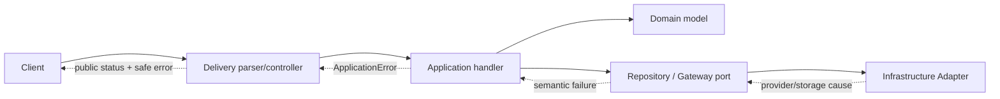
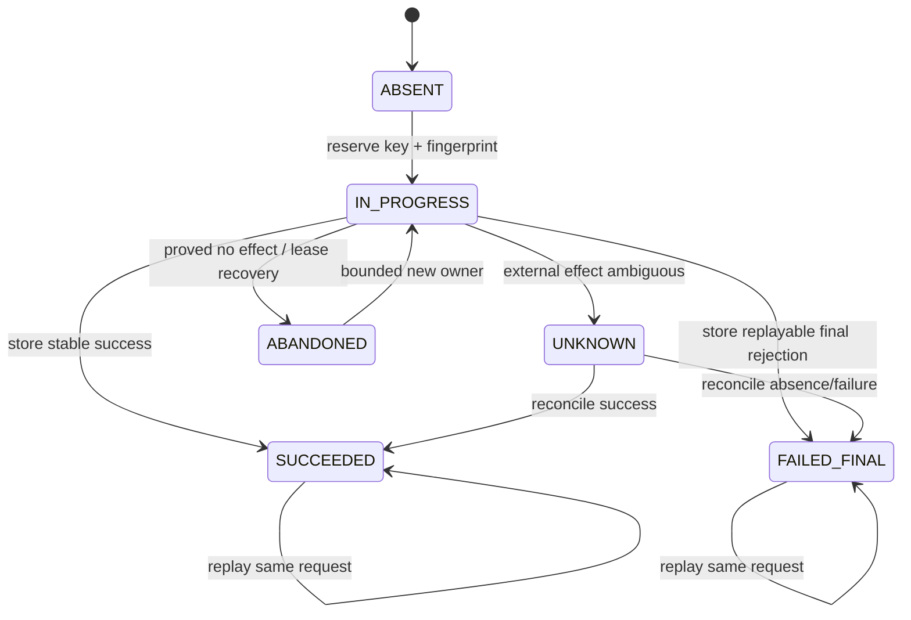
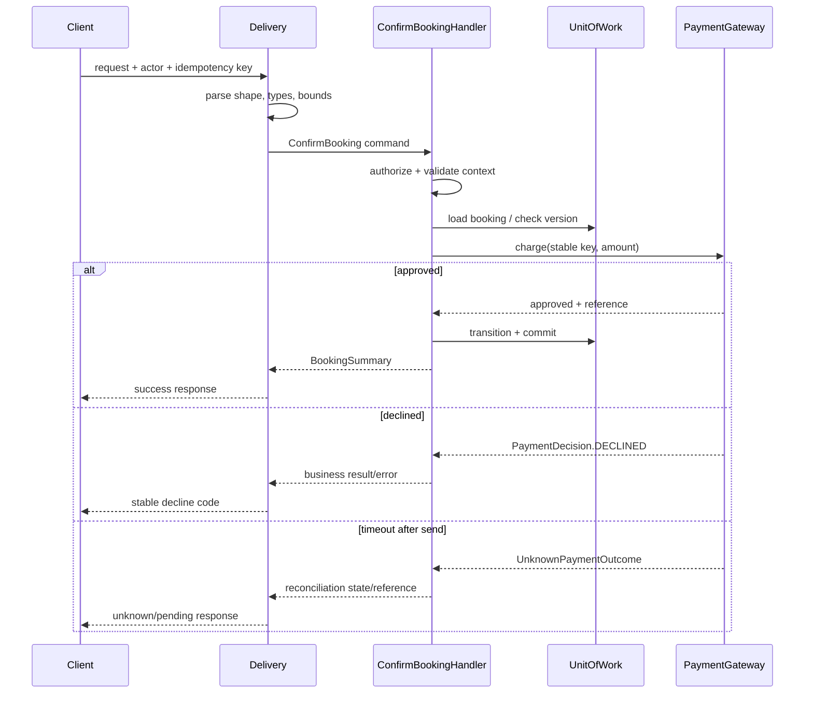

# Topic 10 - API Contracts and Error Modeling

[Curriculum index](../README.md) | [Preparation roadmap](../roadmap.md) |
[Previous topic](./09-application-patterns-and-reusable-building-blocks.md) |
[Next topic](./11-concurrency-and-thread-safety.md)

- **Category:** Public behavior, validation, failure semantics, and evolution
- **Difficulty:** Intermediate to advanced
- **Priority:** Essential
- **Prerequisites:** Topics 3, 5, and 9; Topics 2, 4, and 8 recommended
- **Running example:** Movie Ticket Booking commands, public responses,
  idempotent payment, failure translation, and booking-history pagination
- **Output:** Precise callable/API contracts with explicit input, success,
  failure, retry, idempotency, pagination, security, and compatibility behavior

## Outcome

After completing this topic, you should be able to:

- Define a contract as observable behavior rather than only a method signature.
- Separate untrusted transport parsing from application validation and domain
  invariants.
- Specify preconditions, postconditions, invariants, side effects, atomicity,
  and repeated-call behavior.
- Choose deliberately between exceptions, typed result objects, optional values,
  and status-bearing domain records.
- Build a small stable exception taxonomy without one class per sentence.
- Give failures machine-readable codes while keeping safe human-readable
  messages and structured details.
- Translate internal/domain/provider failures once at a delivery boundary.
- Distinguish invalid input, missing resources, authorization denial, business
  rejection, conflict, transient failure, and unknown external outcome.
- Decide retryability from semantics, not from a generic exception or status
  number alone.
- Design idempotency around one logical operation, a stable key, request
  fingerprint, ownership, lifecycle, and stored outcome.
- Explain why an ID generator, duplicate check, lock, and idempotency key solve
  different problems.
- Define deterministic ordering and correct offset- or cursor-pagination
  contracts.
- Design opaque, validated cursors with scope and filter binding.
- Evolve request, response, enum, and error contracts compatibly and plan
  deprecation when a breaking change is necessary.
- Model omitted, null, empty, default, and unknown values explicitly.
- Keep money, time, identifiers, and enums precise at boundaries.
- Avoid leaking secrets, stack traces, provider details, or resource-existence
  information through public errors.
- Include correlation, safe diagnostics, cancellation, and deadline semantics.
- Write contract, mapping, idempotency, pagination, compatibility, and negative
  tests that prove observable behavior.
- Communicate an interview API design using compact contract and error tables.

## Core idea

A signature tells callers what can be passed syntactically. A contract tells
them what the operation means:

```text
Contract = accepted input and normalization
         + authorization and preconditions
         + success value and side effects
         + failure categories and public representation
         + atomicity and consistency
         + retry, duplicate, and idempotency behavior
         + ordering, pagination, and resource limits
         + compatibility and observability guarantees
```

For every public operation, answer:

```text
Who may call it?                         -> actor and authorization contract
What input is accepted?                 -> syntax, shape, bounds, normalization
What must already be true?              -> preconditions and current state
What becomes true on success?           -> postconditions and returned result
What may change?                         -> side effects and atomicity boundary
How can it fail?                         -> stable failure taxonomy
Can it be repeated or retried?           -> idempotency and unknown outcomes
How is a collection ordered?             -> total order and pagination rules
How can the contract evolve?             -> compatibility and deprecation
How can one attempt be diagnosed safely? -> correlation and internal cause
```

> If a caller cannot predict success, failure, repetition, and ordering from
> the contract, the implementation has an interface but not a dependable API.

An API in this chapter means any boundary used by another component: a Python
method, application command handler, repository port, provider gateway, CLI,
HTTP endpoint, or message consumer. HTTP examples are illustrative mappings;
the semantic model comes first and can be adapted to another transport.

## Scope boundary

This topic deeply covers:

- behavioral contract anatomy and Design by Contract vocabulary;
- request/command/query/result ownership;
- layered validation and canonicalization;
- exceptions versus results versus optional values;
- exception taxonomy, error codes, safe details, and cause chaining;
- delivery error envelopes and illustrative transport mapping;
- authorization, not-found, rejection, conflict, transient, and unknown-outcome
  semantics;
- retryability and idempotency;
- deterministic ordering, offset pagination, keyset/cursor pagination, and
  cursor integrity;
- compatibility, versioning, deprecation, unknown values, null, and omission;
- money, time, ID, enum, and collection boundary rules;
- security, rate/resource limits, observability, deadlines, and cancellation;
- contract and negative testing.

It does not deeply cover:

- locks, condition variables, concurrent collections, race-proof idempotency
  storage, or thread/process memory models; Topic 11 covers concurrency;
- SQL isolation, transaction implementation, schema migrations, durable inbox/
  outbox tables, or database-backed cursor execution; Topic 12 covers
  persistence and transaction boundaries;
- broad refactoring technique and code-smell remediation; Topic 13 covers them;
- full test architecture, property-based tooling, mutation testing, or test
  doubles in depth; Topic 14 covers them;
- network framework selection, OpenAPI tooling, authentication protocols,
  distributed rate limiting, or API gateway products;
- high-level service decomposition or distributed workflow orchestration.

Examples use Python 3.10+. Code fences are focused excerpts; some reference
types introduced nearby. Standalone implementations should include all imports
and may use `from __future__ import annotations` for forward references.

## 1. Learn

### 1.1 A method signature is only the surface

Consider:

```python
def confirm_booking(booking_id: str, payment_token: str) -> BookingSummary:
    ...
```

The annotation does not answer:

- whether blank or malformed IDs are rejected;
- who may confirm the booking;
- whether an expired booking is a validation error or business rejection;
- whether payment happens before or after local mutation;
- what a provider timeout means;
- whether repeating the request can charge twice;
- what exception/result the caller observes;
- whether the returned summary is a snapshot;
- whether a failure leaves state unchanged.

Write the behavioral contract before optimizing the signature.

### 1.2 Contract dimensions

Use this contract card:

| Dimension | Required decision |
|---|---|
| Operation | One domain/application verb and scope |
| Caller | Actor, tenant, trusted boundary |
| Input | Types, required/optional, bounds, normalization |
| Preconditions | State and authorization required before work |
| Success | Return value and postconditions |
| Effects | Local writes, external calls, events |
| Atomicity | What changes together; what cannot |
| Failure | Stable categories/codes/details |
| Retry | Never, safe, conditional, or reconcile first |
| Idempotency | Key, fingerprint, scope, replay, expiry |
| Ordering | Stable total order and tie-breaker |
| Limits | Size, depth, time, page, rate |
| Compatibility | Defaults, unknowns, version/deprecation |
| Diagnostics | Correlation and internal cause policy |

Not every private helper needs the full card. Every public use case, port, and
mutation boundary deserves it.

### 1.3 Preconditions, postconditions, and invariants

- **Precondition:** must be true before the operation owns execution. Example:
  the actor owns the booking and the booking is payable.
- **Postcondition:** must be true after success. Example: a confirmed booking has
  one accepted payment reference and held seats are booked.
- **Invariant:** must remain true before and after every public operation.
  Example: a seat cannot be both available and owned by a booking.

Caller mistakes that violate a documented programming precondition may justify
`TypeError`/`ValueError` in internal code. User/business input normally needs a
modeled application failure that a delivery boundary can translate safely.

### 1.4 Make effects part of the contract

The same return type can hide very different behavior:

```text
quote_booking(...)       -> pure calculation, no stored or external effect
create_booking(...)      -> local state change
confirm_booking(...)     -> local state plus external payment effect
publish_confirmation(...) -> external delivery, possibly asynchronous
```

Specify:

- which state is read and written;
- whether the result is a snapshot or a live object;
- whether an external effect may already have happened on timeout;
- whether events are recorded, committed, or delivered;
- which effects are guaranteed absent after rejection.

### 1.5 Contract ownership by boundary

| Boundary | Owns |
|---|---|
| Delivery parser | wire shape, primitive types, size, encoding |
| Application command/query | use-case-required fields and stable semantics |
| Authorization policy | actor/tenant permission |
| Domain object/policy | business invariant and transition validity |
| Repository | missing/duplicate/conflict/order/transaction semantics |
| Gateway | capability outcomes, retry, idempotency, unknown state |
| Delivery mapper | public error/status/body/header representation |

Do not validate everything in the controller, and do not make the aggregate
parse JSON field names.

### 1.6 Three validation layers

Use three questions:

1. **Can it be represented?** Delivery checks JSON/object shape, primitive type,
   encoding, collection size, and gross format.
2. **Can this use case accept it?** Application checks required combinations,
   actor/tenant context, command bounds, and referenced-resource availability.
3. **Can the domain allow it now?** Domain checks invariants, ownership, state
   transitions, capacity, money, and time rules.

The same fact should have one authoritative owner. Earlier layers may reject
cheaply, but they must not redefine the domain rule differently.

### 1.7 Syntax, semantics, and context

| Check | Example | Typical owner |
|---|---|---|
| Syntax/shape | `seat_ids` is an array of strings | delivery parser |
| Normalization | trim/casefold an email for identity comparison | value object/boundary |
| Local semantics | at least one unique seat | command/value object |
| Domain semantics | seat is currently available | aggregate |
| Context | actor can book for this tenant | application/auth policy |
| External fact | provider accepted payment | Gateway result |

“Valid” without naming the layer is too vague.

### 1.8 Parse once into an immutable application message

Untrusted dictionaries should not flow through the domain:

```python
from dataclasses import dataclass


@dataclass(frozen=True, slots=True)
class CreateBooking:
    request_id: str
    actor_id: str
    show_id: str
    seat_ids: tuple[str, ...]

    def __post_init__(self) -> None:
        if not self.request_id.strip():
            raise ValueError("request_id is required")
        if not self.actor_id.strip() or not self.show_id.strip():
            raise ValueError("actor_id and show_id are required")
        if not self.seat_ids:
            raise ValueError("at least one seat is required")
        if any(not seat_id.strip() for seat_id in self.seat_ids):
            raise ValueError("seat IDs cannot be blank")
        if len(set(self.seat_ids)) != len(self.seat_ids):
            raise ValueError("seat IDs must be unique")
```

Delivery mapping should reject booleans/numbers/nulls where strings are
required, enforce a maximum seat count before allocating large structures, and
then construct this message. The command uses application names, not transport
headers or JSON aliases.

### 1.9 Omitted, null, empty, and default are different

For an update request:

```text
field omitted     -> leave current value unchanged
field = null      -> clear value, if clearing is allowed
field = ""        -> set empty string, usually invalid for names
field = default   -> explicit domain value, not “missing”
```

Collapsing these states with `payload.get("field")` can silently change update
semantics. Use a sentinel or a dedicated patch type:

```python
from dataclasses import dataclass
from typing import Generic, TypeVar


T = TypeVar("T")


@dataclass(frozen=True, slots=True)
class Supplied(Generic[T]):
    value: T


NOT_SUPPLIED = object()


@dataclass(frozen=True, slots=True)
class UpdateProfile:
    display_name: Supplied[str] | object = NOT_SUPPLIED
    phone: Supplied[str | None] | object = NOT_SUPPLIED
```

Do not expose the sentinel outside the process. A wire schema should document
omission and explicit null independently.

### 1.10 Normalize deliberately

Normalization can change identity and meaning. Decide per field:

| Field | Possible rule |
|---|---|
| Email lookup key | trim and Unicode/case normalization under one policy |
| Password/token | never trim or casefold silently |
| Public ID | exact opaque string unless format owns normalization |
| Coupon code | explicit uppercase/case-insensitive policy |
| Human name | preserve display form; validate separately |
| Currency code | allowlisted canonical uppercase code |
| Seat ID | exact catalog identity, not arbitrary casefold |

Return or store the canonical form consistently. Hidden normalization produces
duplicates and confusing signatures/idempotency fingerprints.

### 1.11 Bounds are contract behavior

Bound every attacker- or caller-controlled collection/string/tree:

- maximum request bytes and string length;
- maximum seats, filters, batch items, or sort keys;
- maximum nesting/depth and expression node count;
- page-size minimum/default/maximum;
- timeout/deadline range;
- integer/decimal precision and range;
- decompression, regex, and parsing work where relevant.

Reject excess before expensive I/O or mutation. “The framework will handle it”
is not an application contract.

### 1.12 Exceptions versus result values

Choose based on how the caller should branch:

| Mechanism | Good fit |
|---|---|
| Return domain value | normal success |
| `T | None` | one unsurprising absence with no reason needed |
| Typed result/decision | expected alternatives are part of normal workflow |
| Domain/application exception | operation cannot fulfill its contract |
| Built-in `TypeError`/`ValueError` | local programmer/value misuse at narrow boundary |
| Process failure | invariant bug/resource corruption; do not disguise as user error |

ATM cash unavailability is an expected decline and belongs in a returned
transaction status. A missing booking may be an application exception. A
confirmed booking with no completed payment is an internal invariant failure.

Do not return `Exception` objects. Callers can accidentally treat them as
successful values.

### 1.13 A typed result for expected alternatives

```python
from dataclasses import dataclass
from decimal import Decimal
from enum import Enum


class AuthorizationStatus(Enum):
    APPROVED = "approved"
    DECLINED = "declined"
    PENDING = "pending"


@dataclass(frozen=True, slots=True)
class PaymentDecision:
    status: AuthorizationStatus
    provider_reference: str | None
    reason_code: str | None = None

    def __post_init__(self) -> None:
        if self.status is AuthorizationStatus.APPROVED:
            if not self.provider_reference:
                raise ValueError("approved payment requires provider_reference")
            if self.reason_code is not None:
                raise ValueError("approved payment cannot have a decline reason")
        elif self.status is AuthorizationStatus.DECLINED:
            if not self.reason_code:
                raise ValueError("decline requires a stable reason code")
        elif self.provider_reference is None:
            raise ValueError("pending payment requires provider_reference")
```

The result makes approved/declined/pending explicit. Transport errors,
malformed provider replies, and unknown “may have succeeded” outcomes still need
separate modeled failures.

### 1.14 Build a small semantic exception taxonomy

Start with categories that change caller behavior:

```text
ApplicationError
|-- InvalidRequest          caller must correct shape/value
|-- Unauthorized           identity absent/invalid
|-- Forbidden              identity valid, operation denied
|-- ResourceNotFound       requested visible resource absent
|-- BusinessRuleViolation  current rule/state rejects operation
|-- Conflict               current version/duplicate/state race
|-- RateLimited            retry only under supplied policy
|-- DependencyUnavailable  transient dependency failure
|-- UnknownOutcome         effect may have happened; reconcile first
`-- InternalFailure        safe public fallback, diagnose internally
```

Do not create `SeatA1UnavailableAfterHoldExpiredError`. Prefer a stable category
plus a specific machine code such as `seat_unavailable`.

### 1.15 Implement stable application errors

```python
from __future__ import annotations

from dataclasses import dataclass
from enum import Enum
from types import MappingProxyType
from typing import Mapping


class ErrorKind(Enum):
    INVALID = "invalid"
    UNAUTHORIZED = "unauthorized"
    FORBIDDEN = "forbidden"
    NOT_FOUND = "not_found"
    REJECTED = "rejected"
    CONFLICT = "conflict"
    RATE_LIMITED = "rate_limited"
    UNAVAILABLE = "unavailable"
    UNKNOWN_OUTCOME = "unknown_outcome"
    INTERNAL = "internal"


@dataclass(frozen=True, slots=True)
class ErrorDefinition:
    code: str
    kind: ErrorKind
    public_message: str
    retryable: bool = False


class ApplicationError(Exception):
    definition: ErrorDefinition

    def __init__(
        self,
        definition: ErrorDefinition,
        *,
        details: Mapping[str, object] | None = None,
    ) -> None:
        super().__init__(definition.public_message)
        self.definition = definition
        self.details = MappingProxyType(dict(details or {}))


BOOKING_NOT_FOUND = ErrorDefinition(
    "booking_not_found", ErrorKind.NOT_FOUND, "Booking was not found."
)
SEAT_UNAVAILABLE = ErrorDefinition(
    "seat_unavailable", ErrorKind.CONFLICT, "A selected seat is unavailable."
)
PAYMENT_UNKNOWN = ErrorDefinition(
    "payment_outcome_unknown",
    ErrorKind.UNKNOWN_OUTCOME,
    "Payment status is being reconciled.",
)
```

Definitions can be module constants or an enum/registry. Keep codes stable,
lowercase, transport-independent, documented, and tested. Public details must
be allowlisted; never pass arbitrary exception dictionaries through.

### 1.16 Exception classes versus definitions

Two valid styles:

1. A few subclasses (`NotFound`, `Conflict`, `Forbidden`) with instance codes.
2. One `ApplicationError` carrying a validated `ErrorDefinition`.

Prefer subclasses when callers genuinely catch categories by type. Prefer
definitions when mapping is data-driven and codes are the main branch key.
Avoid hundreds of empty subclasses and avoid one untyped `BusinessException`
whose message must be parsed.

### 1.17 Preserve internal causes

Translate low-level errors at the boundary that understands both languages:

```python
class RepositoryUnavailable(RuntimeError):
    pass


def load_booking(repository: object, booking_id: str) -> object:
    try:
        booking = repository.get(booking_id)
    except TimeoutError as error:
        raise RepositoryUnavailable("booking storage unavailable") from error
    if booking is None:
        raise ApplicationError(
            BOOKING_NOT_FOUND,
            details={"booking_id": booking_id},
        )
    return booking
```

Exception chaining preserves diagnostics without exposing the storage error to
the public response. Catch only failures you can translate. `except Exception`
at every layer destroys taxonomy and can hide programmer bugs.

### 1.18 Translate once at the delivery boundary

The domain should not know HTTP status numbers, JSON field names, or CLI exit
codes. The delivery mapper turns semantic errors into public representation:



One mapping table prevents controllers from disagreeing about the same error.

### 1.19 Public error envelope

An illustrative transport-neutral envelope:

```python
from dataclasses import dataclass
from typing import Mapping


@dataclass(frozen=True, slots=True)
class PublicError:
    code: str
    message: str
    correlation_id: str
    details: Mapping[str, object]
    retryable: bool
```

Useful fields:

- stable `code` for caller branching;
- safe localized or default `message` for humans;
- `correlation_id` for support/diagnostics;
- allowlisted structured `details` such as invalid field codes;
- truthful `retryable`, ideally with an explicit delay/deadline policy where
  relevant.

Do not expose stack trace, SQL, hostname, provider token, full payment data,
secret, or internal class name.

### 1.20 Illustrative transport mapping

For an HTTP delivery layer, one coherent mapping might be:

| Semantic kind | Typical status family | Notes |
|---|---:|---|
| invalid syntax/shape/value | client error | distinguish field issues by code/details |
| unauthenticated | authentication error | challenge behavior belongs to delivery/security |
| forbidden | authorization error | may be masked as not-found to avoid existence leak |
| visible resource missing | not-found | do not use for every rejected state |
| business rejection | client/conflict family | choose consistently by public semantics |
| duplicate/version/state race | conflict | include safe current/version hints if useful |
| rate limited | throttling | include bounded retry guidance |
| dependency unavailable | service failure | only retry when operation semantics allow |
| unknown external outcome | accepted/conflict/service family | force status lookup/reconciliation |
| unexpected bug | server failure | generic public message, rich internal log |

Specific status numbers are delivery decisions. In an interview, state the
semantic kind first, then the chosen mapping and why.

### 1.21 `400` versus semantic validation

Teams differ on whether well-shaped but semantically invalid input uses a
general bad-request status or a distinct validation status. Either can be
coherent. The important contract is:

- malformed/unsupported representation is distinguishable internally;
- field and cross-field issues have stable codes and paths;
- domain rejection is not confused with parsing failure;
- every endpoint maps the same semantic failure consistently;
- clients do not parse prose to decide.

### 1.22 Field validation details

```python
from dataclasses import dataclass


@dataclass(frozen=True, slots=True)
class FieldIssue:
    path: str
    code: str
    message: str


class InvalidRequest(ValueError):
    def __init__(self, issues: tuple[FieldIssue, ...]) -> None:
        if not issues:
            raise ValueError("InvalidRequest requires at least one issue")
        self.issues = tuple(sorted(issues, key=lambda item: (item.path, item.code)))
        super().__init__("request validation failed")
```

Paths should use one documented notation. Issue order must be deterministic.
Decide fail-fast versus collect-all; collect independent cheap issues, but do
not continue into I/O or expose authorization-sensitive facts.

### 1.23 Authentication, authorization, and existence

- **Authentication:** who is the caller?
- **Authorization:** may this caller perform this action on this resource?
- **Existence:** does a resource visible to this caller exist?

Order matters. Loading a cross-tenant resource and returning “forbidden” may
reveal that it exists. A tenant-scoped repository query can safely yield the
same not-found response for absent and invisible resources. Internal audit logs
may retain the true reason under access control.

### 1.24 Business rejection is not system failure

Expected decisions should be visible and stable:

```text
seat unavailable      -> conflict/rejection; client chooses another seat
insufficient balance  -> declined transaction; no blind retry
coupon ineligible     -> business rejection with reason code
provider unavailable  -> operational failure; retry policy may apply
payment unknown       -> reconcile; do not charge again blindly
corrupt booking state -> internal/integrity failure; operator action
```

Do not report all of them as `ValueError("something went wrong")`.

### 1.25 Conflict is a state relationship

Common conflicts:

- requested ID already belongs to another resource;
- idempotency key is reused with a different request;
- optimistic version is stale;
- seat was available when read but claimed before write;
- operation is valid generally but incompatible with current lifecycle state;
- unique business key races with another command.

Return safe conflict details: stable code, resource ID, expected/current version
when disclosure is safe, and the next allowed action. Never promise retry will
succeed unless the conflict type supports it.

### 1.26 Retryability has more than two states

Model at least:

| Classification | Caller action |
|---|---|
| Permanent | correct request/state; same retry will fail |
| Transient, no effect | retry with bounded backoff/deadline |
| Safe replay | retry same logical operation/key |
| Unknown outcome | query/reconcile using stable reference before effect retry |
| Conflict | refresh/recompute; blind retry may repeat conflict |
| Rate limited | wait according to server policy |
| Cancelled/deadline | determine whether work/effect stopped or continued |

`retryable=True` is insufficient for irreversible effects unless the key and
reconciliation contract are also known.

### 1.27 Do not retry every exception

Never blindly retry:

- validation, authorization, or business rejection;
- optimistic conflict without re-reading/recomputing;
- a non-idempotent effect after an ambiguous timeout;
- programming/invariant failures;
- rate limits without bounded delay/deadline;
- cancellation after the caller no longer wants the work.

Retry count, backoff, jitter, total deadline, and terminal outcome belong at the
boundary that owns the operation policy, not hidden inside every Adapter.

### 1.28 Idempotency: precise meaning

An operation is idempotent under a declared scope when repeating the **same
logical request** produces the same externally relevant outcome without
duplicating effects.

It requires decisions for:

- key source and validation;
- actor/tenant/operation scope;
- canonical request fingerprint;
- first-execution ownership and concurrent duplicate behavior;
- pending, completed-success, completed-failure, and unknown states;
- response replay versus resource lookup;
- conflicting key reuse;
- expiry/retention;
- atomic storage with the protected effect where possible;
- downstream propagation and reconciliation.

Returning early because `status == CONFIRMED` is state-level idempotence for one
case. It is not a complete request-idempotency protocol.

### 1.29 ID, duplicate detection, lock, and idempotency differ

| Mechanism | Solves |
|---|---|
| Entity ID generator | gives a new entity identity |
| Unique constraint/check | rejects two resources with same business key |
| Lock/version | coordinates concurrent state mutation |
| Idempotency key | identifies retries of one logical command |
| Provider reference | identifies/reconciles an external effect |
| Event ID | deduplicates one recorded/delivered fact |

One UUID cannot safely stand for every lifecycle.

### 1.30 Canonical request fingerprint

Fingerprint only fields that define the logical effect, after documented
normalization. Exclude transport noise such as correlation ID; include effectful
fields such as amount, currency, seat IDs, and target resource.

```python
import hashlib
import json
from collections.abc import Mapping


def request_fingerprint(payload: Mapping[str, object]) -> str:
    encoded = json.dumps(
        payload,
        sort_keys=True,
        separators=(",", ":"),
        ensure_ascii=False,
        allow_nan=False,
    ).encode("utf-8")
    return hashlib.sha256(encoded).hexdigest()
```

Do not fingerprint raw JSON text if whitespace/key order is irrelevant. Do not
silently ignore new effectful fields when the contract evolves.

### 1.31 Idempotency state machine



Same key plus different fingerprint is a conflict. Same key while in progress
needs a documented wait/poll/in-progress response. Never let two owners execute
the effect merely because both first reads saw no record.

### 1.32 A focused in-memory idempotency model

This example models semantics; Topic 11 adds concurrency-safe ownership and
Topic 12 adds durable atomic storage.

```python
from dataclasses import dataclass
from enum import Enum
from typing import Generic, TypeVar


T = TypeVar("T")


class IdempotencyState(Enum):
    IN_PROGRESS = "in_progress"
    SUCCEEDED = "succeeded"
    FAILED_FINAL = "failed_final"
    UNKNOWN = "unknown"


@dataclass(frozen=True, slots=True)
class IdempotencyRecord(Generic[T]):
    fingerprint: str
    state: IdempotencyState
    outcome: T | None = None


class IdempotencyConflict(RuntimeError):
    pass


class InMemoryIdempotencyStore(Generic[T]):
    def __init__(self) -> None:
        self._records: dict[tuple[str, str, str], IdempotencyRecord[T]] = {}

    def get(
        self,
        tenant_id: str,
        operation: str,
        key: str,
    ) -> IdempotencyRecord[T] | None:
        return self._records.get((tenant_id, operation, key))

    def reserve(
        self,
        tenant_id: str,
        operation: str,
        key: str,
        fingerprint: str,
    ) -> IdempotencyRecord[T]:
        identity = (tenant_id, operation, key)
        current = self._records.get(identity)
        if current is not None:
            if current.fingerprint != fingerprint:
                raise IdempotencyConflict("key reused for another request")
            return current
        record = IdempotencyRecord[T](
            fingerprint=fingerprint,
            state=IdempotencyState.IN_PROGRESS,
        )
        self._records[identity] = record
        return record

    def replace(
        self,
        tenant_id: str,
        operation: str,
        key: str,
        record: IdempotencyRecord[T],
    ) -> None:
        identity = (tenant_id, operation, key)
        current = self._records.get(identity)
        if current is None or current.fingerprint != record.fingerprint:
            raise IdempotencyConflict("record ownership/fingerprint changed")
        self._records[identity] = record
```

This dictionary uses check-then-write and is deliberately single-threaded. Do
not copy it into a concurrent server and claim exactly-once execution.

### 1.33 What should be replayed?

Options:

- store the exact public response snapshot;
- store application outcome and remap using the current delivery version;
- store created resource identity and return its current representation;
- return an operation/status resource for asynchronous work.

Exact replay is predictable but can retain sensitive/old representations.
Current-resource replay may differ from the original response. Choose and
document one. Final validation/business failures may be stored; transient
failures usually should not be cached forever.

### 1.34 External idempotency and unknown outcomes

Pass a stable logical key to a provider that supports it. Persist/provider-map:

```text
local command key -> local attempt -> provider idempotency key/reference
```

If a timeout occurs after sending:

1. record `UNKNOWN`, not “failed/no charge”;
2. query or accept webhook reconciliation by stable reference/key;
3. complete local state when the provider truth is known;
4. avoid creating a new provider key for blind retry.

No local rollback can undo an external effect whose outcome is unknown.

### 1.35 Create, replace, and partial-update semantics

For each mutation define:

- server-generated versus client-chosen identity;
- create-only versus upsert;
- full replacement versus partial update;
- omitted/null semantics;
- expected version/precondition token;
- response on duplicate/current state;
- whether repeated identical calls are idempotent;
- whether unknown fields are rejected or ignored.

Hidden upsert behavior can overwrite an existing resource. Hidden partial
update behavior can retain fields a caller expected to clear.

### 1.36 Bulk and partial-success contracts

For batch input, choose explicitly:

| Mode | Contract |
|---|---|
| Atomic batch | all items commit or none; one failure aborts |
| Independent items | per-item success/failure in input order or by item key |
| Best effort | partial effect allowed; retry/dedup per item required |
| Asynchronous job | accepted operation resource tracks item outcomes |

Bound batch size. Give every item a stable identity. Do not return a bare
“partial success” boolean without item-level outcome and retry semantics.

### 1.37 Collection contracts require total order

`ORDER BY created_at DESC` is not total when timestamps tie. Add an immutable
unique tie-breaker:

```text
ORDER BY created_at DESC, booking_id DESC
```

Document:

- sort keys and direction;
- null ordering and collation/case rules;
- whether order is stable across requests;
- filters and authorization scope;
- snapshot/live mutation behavior;
- page-size bounds;
- duplicate/omission expectations.

Without a total order, pagination cannot be reliable.

### 1.38 Offset pagination

```text
page 1: OFFSET 0  LIMIT 20
page 2: OFFSET 20 LIMIT 20
```

Benefits: simple, direct page numbers, arbitrary jump.

Costs:

- large offsets can become expensive;
- inserts/deletes before the offset can duplicate or skip items;
- a changing dataset has no stable snapshot unless explicitly provided.

Offset is often fine for small admin lists or stable datasets. State its
mutation behavior honestly.

### 1.39 Keyset/cursor pagination

For descending `(created_at, booking_id)` order, the next query continues after
the last item:

```text
WHERE (created_at, booking_id) < (:cursor_time, :cursor_id)
ORDER BY created_at DESC, booking_id DESC
LIMIT :page_size_plus_one
```

Benefits: stable continuation and index-friendly work. Costs: cannot naturally
jump to arbitrary page, cursor schema must evolve, and filter/sort/scope must be
bound to the cursor.

### 1.40 Page result contract

```python
from dataclasses import dataclass
from typing import Generic, TypeVar


T = TypeVar("T")


@dataclass(frozen=True, slots=True)
class Page(Generic[T]):
    items: tuple[T, ...]
    next_cursor: str | None
    has_more: bool

    def __post_init__(self) -> None:
        if self.has_more != (self.next_cursor is not None):
            raise ValueError("has_more and next_cursor disagree")
```

Fetching `limit + 1` items determines `has_more`; return at most `limit`. An
empty page normally has no next cursor. Do not expose a mutable internal list.

### 1.41 Opaque cursor payload

A cursor may contain:

```text
version
tenant/authorization scope hash
filter and sort fingerprint
last immutable sort values
optional snapshot boundary
expiry, if promised
integrity signature/key identifier
```

Opaque does not mean encrypted. Base64 only encodes. Sign the cursor to detect
tampering; encrypt if payload confidentiality is required. Always reapply
authorization server-side.

### 1.42 Implement a signed cursor

```python
from __future__ import annotations

import base64
import hashlib
import hmac
import json
from dataclasses import asdict, dataclass
from datetime import datetime


@dataclass(frozen=True, slots=True)
class BookingCursor:
    version: int
    scope_hash: str
    filter_hash: str
    created_at: str
    booking_id: str


class InvalidCursor(ValueError):
    pass


def encode_cursor(cursor: BookingCursor, secret: bytes) -> str:
    payload = json.dumps(
        asdict(cursor), sort_keys=True, separators=(",", ":")
    ).encode("utf-8")
    signature = hmac.new(secret, payload, hashlib.sha256).digest()
    return base64.urlsafe_b64encode(payload + signature).decode("ascii")


def decode_cursor(token: str, secret: bytes) -> BookingCursor:
    try:
        raw = base64.urlsafe_b64decode(token.encode("ascii"))
        if len(raw) <= hashlib.sha256().digest_size:
            raise InvalidCursor("cursor is too short")
        payload = raw[:-hashlib.sha256().digest_size]
        supplied = raw[-hashlib.sha256().digest_size:]
        expected = hmac.new(secret, payload, hashlib.sha256).digest()
        if not hmac.compare_digest(supplied, expected):
            raise InvalidCursor("cursor signature is invalid")
        data = json.loads(payload)
        if set(data) != {
            "version", "scope_hash", "filter_hash", "created_at", "booking_id"
        }:
            raise InvalidCursor("cursor fields are invalid")
        cursor = BookingCursor(**data)
        if cursor.version != 1 or not cursor.booking_id:
            raise InvalidCursor("cursor version or identity is invalid")
        instant = datetime.fromisoformat(cursor.created_at)
        if instant.tzinfo is None:
            raise InvalidCursor("cursor time must be timezone-aware")
        return cursor
    except InvalidCursor:
        raise
    except (ValueError, TypeError, KeyError, json.JSONDecodeError) as error:
        raise InvalidCursor("cursor is malformed") from error
```

Production decoding must also cap token/payload size, rotate keys/version
deliberately, validate exact value types/lengths, and compare the scope/filter
hashes to the current request. Signing prevents modification, not replay.

### 1.43 Mutation during pagination

Choose the promise:

- **Live keyset view:** new items before the cursor are not injected into later
  pages; updates to sort keys can move items.
- **Snapshot boundary:** cursor includes a fixed upper bound/version/time; later
  inserts are excluded, but updates still need policy.
- **Database snapshot:** consistent view under a transaction/session, often
  impractical across client round trips.

Immutable sort keys make keyset behavior much easier. Never claim “no duplicate
or missing items under arbitrary mutation” without a mechanism that proves it.

### 1.44 Compatibility is observable behavior

A change may be source-, binary-, wire-, behavior-, or data-compatible. For
LLD/API interviews, focus on caller observations:

| Change | Usually safe? | Conditions |
|---|---|---|
| Add optional request field | Often | old default preserves semantics |
| Add response field | Often | clients ignore unknown fields |
| Add required request field | Breaking | needs version/migration/default |
| Rename/remove field | Breaking | dual-read/write or version plan |
| Tighten validation | Potentially breaking | previously accepted input fails |
| Change default/order | Breaking behavior | even if types unchanged |
| Add enum output value | Potentially breaking | clients may assume exhaustive set |
| Change error code/category | Breaking | callers branch on it |
| Change idempotency replay | Breaking | duplicates/results differ |
| Change pagination tie-breaker | Breaking | cursors/order become invalid |

“The code still compiles” is not sufficient compatibility.

### 1.45 Requests and responses evolve differently

Servers can often accept both old and new request forms during migration.
Clients may fail when a response adds an enum variant or changes nullability.

Rules:

- new request fields should usually be optional with explicit old semantics;
- new response fields need clients that tolerate unknown fields;
- do not reuse a field with a new meaning/type;
- do not silently change units, timezone, precision, order, or defaults;
- treat error codes and cursor versions as contract data;
- maintain conformance tests for supported versions.

### 1.46 Unknown fields and enum values

Decide by boundary:

- Reject unknown command fields when typos/security matter and clients can
  coordinate tightly.
- Ignore/preserve unknown fields when forward compatibility requires it.
- Producers must never send enum values outside their documented version.
- Consumers should have an explicit `UNKNOWN`/unsupported path when future
  values are possible, but must not invent unsafe business behavior.

An unknown payment status should not default to `DECLINED`; it may mean an effect
exists and requires reconciliation.

### 1.47 Versioning and deprecation

Prefer compatible evolution first. When breaking change is necessary:

1. define the old and new semantics precisely;
2. choose version scope (operation/message/schema), not arbitrary duplication;
3. support both for a measured window where required;
4. instrument old-version usage;
5. publish migration examples and deadline;
6. reject unsupported versions explicitly;
7. remove old code/tests only after the contract ends.

Do not fork the whole domain per API version. Map both delivery versions to
stable application messages when meaning is shared.

### 1.48 Money contract

Specify:

- decimal string versus integer minor units;
- currency and allowed codes;
- scale/precision and rounding owner;
- negative/zero policy;
- fees/taxes line-item meaning;
- overflow and non-finite rejection;
- representation in errors and idempotency fingerprint.

Never accept binary float silently for exact financial contracts. Never change
major units to minor units without versioning the field.

### 1.49 Time contract

Specify:

- instant versus local date/time;
- required timezone offset and UTC normalization;
- accepted format/precision;
- inclusive/exclusive boundaries;
- business timezone/calendar owner;
- Clock capture moment;
- daylight-saving ambiguous/nonexistent local time policy;
- cursor/idempotency timestamp use and expiry.

“Timestamp” is not a complete contract.

### 1.50 Identifier contract

Specify:

- opacity and whether clients may parse/order it;
- case sensitivity and normalization;
- scope: global, tenant, aggregate, or operation;
- client- or server-generation;
- allowed length/characters;
- information leakage/order claims;
- reuse and retention;
- difference from idempotency/provider/event IDs.

If IDs are opaque, tests must not depend on their internal UUID shape unless
that shape is part of the contract.

### 1.51 Security-safe failures

Public errors must not leak:

- password/PIN/token/card/secret values;
- signatures, raw provider bodies, or credentials;
- SQL/schema/host/path/stack details;
- another tenant's resource existence;
- internal fraud/risk rules that enable bypass;
- full request bodies in logs.

Use stable safe messages externally and structured restricted diagnostics
internally. Redact before serialization/logging; do not depend on a human to
remember.

### 1.52 Correlation and diagnostics

One operation may need:

```text
correlation/request ID -> traces one inbound attempt
idempotency key        -> groups retries of one logical command
entity ID              -> identifies business object
provider reference     -> reconciles external effect
event ID               -> deduplicates recorded fact
```

Log semantic error code, operation, safe actor/tenant identifiers, duration,
dependency outcome, and correlation ID. Keep internal exception/cause under
controlled access. Do not expose internal trace ID as proof of authorization.

### 1.53 Deadlines and cancellation

Define:

- whether a deadline is absolute or relative;
- where it begins and how remaining budget propagates;
- minimum/maximum accepted timeout;
- whether cancellation is cooperative;
- which local/external effects may continue after caller cancellation;
- terminal status and reconciliation path;
- cleanup/rollback responsibility.

A client disconnect does not prove a payment request stopped. Cancellation and
failure are not synonymous.

### 1.54 Synchronous versus asynchronous contract

For fast local work, return the final result. For long/uncertain work, an
operation resource may be clearer:

```text
submit -> operation_id + accepted state
status -> PENDING | SUCCEEDED | FAILED_FINAL | UNKNOWN | CANCELLED
result -> available only after success
```

Define polling interval/backoff, retention, cancellation, idempotent submission,
terminal error, and webhook/event delivery separately. “Accepted” does not mean
business success.

### 1.55 Protocol contracts need semantics too

```python
from typing import Protocol


class BookingRepository(Protocol):
    def get(self, tenant_id: str, booking_id: str) -> object | None:
        """Return one visible booking or None; never raise KeyError."""
        ...


class PaymentGateway(Protocol):
    def charge(
        self,
        booking_id: str,
        amount_minor: int,
        currency: str,
        idempotency_key: str,
    ) -> PaymentDecision:
        """Return a decision or raise a documented operational failure."""
        ...
```

Annotations do not specify timeout, unknown outcome, duplicate key, thread
safety, resource lifetime, or exception behavior. Put those in contract tests
and concise documentation.

### 1.56 Cross-boundary contract matrix

| Concern | Command | Domain | Repository | Gateway | Delivery |
|---|---|---|---|---|---|
| Primitive shape | No | No | No | No | Yes |
| Use-case field combinations | Yes | Sometimes | No | No | maps |
| Invariants/transitions | No | Yes | No | No | maps rejection |
| Missing semantics | No | No | Yes | capability-specific | maps |
| Conflict/version | carries expected | decides state | detects storage | key conflict | maps |
| External unknown | No | No | No | Yes | maps/reconcile link |
| Idempotency | carries key | state no-op may help | durable record | propagates key | accepts/replays |
| Public status/body | No | No | No | No | Yes |
| Internal cause | may translate | raises semantic | chains storage | chains provider | logs, hides |

The contract stays cohesive when each boundary owns only what it can know.

## 2. Recognize

### 2.1 Requirement signals

Listen for:

- “Expose create/confirm/cancel/list operations.”
- “The client may retry after timeout.”
- “Do not charge twice.”
- “Return useful validation errors.”
- “Different failures need different caller actions.”
- “Support multiple clients/versions.”
- “Add pagination/filtering/sorting.”
- “Prevent cross-tenant access.”
- “The provider might time out after accepting the request.”
- “Make errors observable but do not leak internals.”
- “This command can be processed from HTTP and a queue.”
- “Old mobile clients must keep working.”
- “Handle bulk items with partial success.”
- “Calls have deadlines or may be cancelled.”

These signal contract work before implementation detail.

### 2.2 Contract smells

Warning signs:

- every failure is `ValueError` with free-form prose;
- callers compare exception messages;
- `None` means missing, forbidden, unavailable, and provider timeout;
- public methods return live mutable entities;
- one controller validates domain rules duplicated elsewhere;
- unknown provider status defaults to failure or success;
- all exceptions are retried three times;
- a retry creates a fresh payment/provider key;
- idempotency is claimed because an entity uses UUIDs;
- a duplicate key with different request data replays old success;
- list results have no explicit order or tie-breaker;
- cursors are raw database offsets or unsigned caller-editable JSON;
- page size is unbounded;
- adding an enum value is called non-breaking automatically;
- missing and null collapse into one value accidentally;
- public errors include raw provider/SQL/stack details;
- a client disconnect is treated as proof of rollback;
- tests assert only happy return values.

### 2.3 False positives

Do not add machinery when simpler behavior is enough:

- A private pure helper may use `ValueError` without a public error registry.
- A small fixed in-memory list may return all items instead of pagination.
- A read-only lookup can use `T | None` when absence is the only alternative.
- An idempotent pure calculation needs no idempotency store.
- An internal tool with coordinated callers may reject unknown fields strictly
  and make breaking releases together.
- A state transition that returns its existing result on repetition may need no
  separate key if there is no ambiguity or external duplicate effect.
- A simple method need not imitate HTTP response objects.

The goal is precise observable behavior, not maximum infrastructure.

### 2.4 Decision questions

Before designing an operation, ask:

1. Is this a private helper, in-process public method, port, message, or external
   delivery contract?
2. Who owns the input vocabulary?
3. Which input is untrusted and where is it parsed?
4. Which validation is syntactic, application-contextual, or domain-owned?
5. What exact postcondition proves success?
6. What changes locally and externally, and in what order?
7. Which alternatives are expected results versus exceptional failure?
8. Which stable code should a caller branch on?
9. Which details are safe to disclose?
10. Is the outcome permanent, transient, conflicting, or unknown?
11. Can a retry duplicate an effect?
12. What identifies one logical operation and fingerprints its meaning?
13. How do concurrent duplicates behave?
14. What is the total collection order and page continuation rule?
15. What mutation can occur between pages?
16. What old callers/data/messages must remain supported?
17. What are the limits, deadline, and cancellation semantics?
18. What tests prove the entire contract, including negative space?

## 3. Model

### 3.1 Running example: pressure inventory

Model these Movie Ticket Booking operations:

```text
POST-like Create Booking
POST-like Confirm Booking with payment
POST-like Cancel Booking
GET-like Booking Details
GET-like Booking History with cursor
GET-like Payment/Operation Status for reconciliation
```

Pressures:

- delivery input is untrusted;
- actor and tenant visibility matter;
- seats race and booking versions can conflict;
- payment can decline, fail before send, or become unknown after send;
- client retries must not double-charge;
- confirmations/cancellations have repeated-call semantics;
- history ordering must survive equal timestamps;
- mobile/client versions evolve independently;
- public errors must be useful without leaking provider or tenant information.

### 3.2 Boundary and failure flow



The diagram must be paired with an effect table; arrows alone do not define
atomicity or retry.

### 3.3 Operation contract card: Create Booking

| Dimension | Decision |
|---|---|
| Caller | authenticated actor within tenant |
| Input | request key, show ID, 1-10 unique seat IDs |
| Normalization | IDs exact/trim policy; input order preserved |
| Authorization | actor may book for self in tenant |
| Preconditions | show exists/visible and has not started |
| Domain rule | Show atomically owns seat availability/hold |
| Success | immutable summary; seats held until one instant |
| Local effect | booking + seat holds in one UoW |
| External effect | none |
| Failures | invalid, not-found/masked, forbidden, seat conflict, version conflict |
| Idempotency | actor/tenant/operation/key + canonical request fingerprint |
| Repeat | same completed key replays declared snapshot/resource behavior |
| Limits | 10 seats, bounded strings, one captured Clock instant |

### 3.4 Operation contract card: Confirm Booking

| Dimension | Decision |
|---|---|
| Caller | booking owner/authorized support actor |
| Input | booking ID, expected version, payment method/token reference, key |
| Preconditions | pending, hold active, amount/currency fixed |
| Success | confirmed summary + stable payment reference |
| Effects | external authorization plus local state commit |
| Atomicity | provider and local UoW are not one transaction |
| Repeated call | same key/outcome replay; confirmed state returns same effect |
| Decline | stable business code; no confirmation |
| Before-send failure | safe bounded retry with same key |
| Unknown after send | persist unknown; query/reconcile; no blind new charge |
| Local commit failure after approval | reconciliation/repair required |

### 3.5 Validation ownership table

| Rule | Owner | Public failure |
|---|---|---|
| Body is an object | delivery parser | `invalid_body` |
| `seat_ids` is list of strings | delivery parser | field issues |
| 1-10 unique IDs | command/value | `invalid_seat_selection` |
| Actor present | authentication boundary | `unauthenticated` |
| Actor owns booking | authorization/application | forbidden or masked not-found |
| Show exists in tenant | tenant-scoped repository/application | `show_not_found` |
| Show has not started | Show/domain | `show_started` |
| Seat available at mutation | Show/domain | `seat_unavailable` conflict |
| Expected version matches | Repository/UoW | `version_conflict` |
| Provider token format | delivery/provider Adapter boundary | safe invalid-payment detail |

This prevents duplicated rules and inconsistent messages.

### 3.6 Success result contract

Return an immutable application snapshot:

```text
BookingSummary
- booking_id: opaque string
- status: stable application enum/code
- seat_ids: immutable ordered tuple
- total_minor: integer
- currency: allowlisted code
- hold_expires_at: timezone-aware instant or null after confirmation
- version: optimistic/public version when supported
- payment_status: stable application status
```

Decide whether fields reflect the original outcome or current resource when an
idempotency result is replayed. Do not return an aggregate with live locks,
repositories, events, or mutable payment history.

### 3.7 Error catalog

| Code | Kind | Safe details | Retry/recovery |
|---|---|---|---|
| `invalid_request` | invalid | deterministic field issues | correct input |
| `unauthenticated` | unauthorized | none | authenticate |
| `booking_not_found` | not-found | booking ID only if safe | correct/refresh |
| `operation_forbidden` | forbidden | none | do not retry unchanged |
| `booking_not_payable` | rejected | current safe status | change workflow |
| `seat_unavailable` | conflict | unavailable seat IDs if visible | choose again |
| `version_conflict` | conflict | expected/current version if safe | reload |
| `idempotency_key_conflict` | conflict | key, no stored payload | new/correct key |
| `operation_in_progress` | conflict/pending | status link/retry delay | poll/wait |
| `payment_declined` | rejected | stable decline family, no secrets | change method |
| `payment_unavailable` | unavailable | correlation/reference | bounded same-key retry |
| `payment_outcome_unknown` | unknown | reconciliation reference | query, no blind charge |
| `rate_limited` | rate-limited | bounded retry time | wait |
| `internal_error` | internal | correlation ID | support/operator |

Catalog ownership, documentation, and tests matter more than the number of
exception classes.

### 3.8 Failure/effect matrix

| Failure point | Local state | External effect | Idempotency state | Next action |
|---|---|---|---|---|
| Parse/validation | unchanged | none | absent/final invalid policy | correct input |
| Authorization | unchanged | none | usually not reserved | authenticate/stop |
| Booking missing | unchanged | none | optional final result | correct ID |
| Version/seat conflict | unchanged | none | final or retry-after-refresh | reload |
| Provider declines | unchanged/persist attempt | declined only | final decline | new method |
| Provider unavailable before send | unchanged | proved none | retryable | same-key retry |
| Provider timeout after send | pending/unknown record | maybe | unknown | reconcile |
| Provider approves, commit succeeds | confirmed | charged | succeeded | replay |
| Provider approves, commit fails | repair/unknown | charged | unknown | reconcile/repair |
| Response lost after success | confirmed | charged once | succeeded | replay |

If you cannot fill this table, retry semantics are not ready.

### 3.9 Idempotency contract card

```text
Operation: confirm_booking
Key supplied by: trusted client/caller
Required: yes for effectful external confirmation
Scope: (tenant_id, actor_id, operation_name, key)
Fingerprint: booking_id, expected amount/currency, payment method semantics
Reservation: atomic first owner
Concurrent duplicate: return/poll in-progress; never execute second charge
Completed success: replay immutable original summary
Final decline: replay for same request under retention policy
Transient before send: release/retry same key under bounded policy
Unknown: retain and reconcile by provider key/reference
Different fingerprint: conflict
Retention: at least maximum client/provider retry window; documented
```

### 3.10 Public mapping table

Create one table in the delivery module, for example:

| Error kind | Public status | Public code | Retry metadata |
|---|---:|---|---|
| Invalid | client validation | definition code | none |
| Unauthorized | authentication | `unauthenticated` | none |
| Forbidden | authorization/masked missing | definition/masked code | none |
| Not found | missing | definition code | none |
| Rejected | semantic rejection | definition code | domain next action |
| Conflict | conflict | definition code | refresh/poll if applicable |
| Rate limited | throttled | definition code | retry-after |
| Unavailable | service unavailable | definition code | bounded retry-after |
| Unknown outcome | operation pending/unknown | definition code | status link |
| Internal | server error | `internal_error` | correlation ID only |

Tests should enumerate every registered definition and prove it maps exactly
once.

### 3.11 Booking-history pagination card

```text
Scope: authenticated tenant + actor authorization
Filters: status, show_id, created range
Order: created_at DESC, booking_id DESC
Sort keys: immutable
Default/max limit: 20/100
Cursor: signed v1, scope/filter hash, last time + ID
Continuation: strictly less than last tuple
Page construction: fetch limit + 1, emit at most limit
Mutation promise: live keyset; newer inserts do not appear in later pages
Empty result: items=(), next_cursor=None, has_more=False
Invalid/expired/wrong-scope cursor: stable invalid_cursor failure
```

### 3.12 Compatibility decision record

For adding `locale` and itemized fees:

```text
Current: request has no locale; summary has total only
New request: optional locale, default preserves current behavior
New response: additive fee_lines; total meaning unchanged
Old readers: confirmed to ignore unknown response fields
Enum impact: no new booking status
Idempotency fingerprint: include locale only if it changes charged/displayed effect
Cursor impact: none unless locale changes filter/order
Rollout: server dual behavior -> client adoption -> measure
Rollback: omit new field; old semantics remain
Tests: old fixture, new fixture, mixed-version replay
```

### 3.13 Security and observability ledger

| Data | Public error | Restricted log | Never log |
|---|---|---|---|
| Correlation ID | yes | yes | - |
| Error code | yes | yes | - |
| Booking ID | if authorized/safe | hashed or safe ID | cross-tenant details |
| Actor/tenant | usually no | safe identifiers | credentials |
| Provider reference | status flow if safe | yes | provider secret/token |
| Payment token/card/PIN | no | no/redacted | full value |
| Stack/SQL/raw body | no | protected diagnostic | public/body logs |

Also decide metrics labels: use bounded error codes, never arbitrary messages or
user IDs as high-cardinality labels.

### 3.14 API decision record

Before coding, write:

```text
Context:
Callers and trust boundary:
Operation and postcondition:
Validation owners:
Success snapshot:
Failure catalog:
Local/external effect order:
Retry and unknown-outcome policy:
Idempotency key/fingerprint/scope/lifecycle:
Ordering/pagination:
Compatibility promise:
Limits/deadline/cancellation:
Security/diagnostics:
Rejected alternatives:
Contract tests:
```

The record should fit on one page per important operation.

## 4. Implement

### 4.1 Keep transport DTOs at the edge

Parse untrusted input into an application message. Do not pass request objects,
headers, ORM objects, or provider DTOs to the domain.

```python
from collections.abc import Mapping


def require_string(
    body: Mapping[str, object],
    field: str,
    *,
    maximum: int,
) -> str:
    value = body.get(field)
    if not isinstance(value, str):
        raise ValueError(f"{field} must be a string")
    normalized = value.strip()
    if not normalized or len(normalized) > maximum:
        raise ValueError(f"{field} length is invalid")
    return normalized


def require_string_list(
    body: Mapping[str, object],
    field: str,
    *,
    maximum_items: int,
) -> tuple[str, ...]:
    value = body.get(field)
    if not isinstance(value, list):
        raise ValueError(f"{field} must be a list")
    if not 1 <= len(value) <= maximum_items:
        raise ValueError(f"{field} item count is invalid")
    if any(not isinstance(item, str) or not item.strip() for item in value):
        raise ValueError(f"{field} must contain non-blank strings")
    return tuple(item.strip() for item in value)
```

In production, collect deterministic `FieldIssue` objects rather than expose
these prose messages directly.

### 4.2 Reject unknown request fields deliberately

```python
def reject_unknown_fields(
    body: dict[str, object],
    allowed: frozenset[str],
) -> None:
    unknown = tuple(sorted(set(body) - allowed))
    if unknown:
        raise ValueError(f"unknown fields: {', '.join(unknown)}")
```

Strict input catches typos but can reduce forward compatibility. Make it a
versioned contract choice, not a framework accident.

### 4.3 Map parse issues without duplicating domain rules

A delivery parser may check duplicate seat IDs because it is cheap, but the
aggregate remains the authority at mutation time. The controller must not
assume early availability checks prevent a race.

```text
parse -> immutable command -> authorize -> load -> domain transition -> commit
```

Never mutate before all cheap validation and authorization checks that can
safely occur first.

### 4.4 Raise semantic errors near their owner

```python
def require_payable(booking: object, now: object) -> None:
    if booking.status == "CONFIRMED":
        return
    if booking.status != "PENDING_PAYMENT":
        raise ApplicationError(
            ErrorDefinition(
                "booking_not_payable",
                ErrorKind.REJECTED,
                "Booking cannot be paid in its current state.",
            ),
            details={"status": booking.status},
        )
    if now >= booking.hold_expires_at:
        raise ApplicationError(
            ErrorDefinition(
                "booking_hold_expired",
                ErrorKind.REJECTED,
                "Booking hold has expired.",
            )
        )
```

In real code, reuse module-level definitions instead of constructing them on
every call.

### 4.5 Translate infrastructure failures narrowly

```python
class PaymentUnavailable(RuntimeError):
    pass


class PaymentOutcomeUnknown(RuntimeError):
    def __init__(self, reconciliation_reference: str) -> None:
        super().__init__("payment outcome is unknown")
        self.reconciliation_reference = reconciliation_reference


def charge_through_adapter(client: object, request: object) -> object:
    try:
        response = client.charge(request)
    except client.TimeoutBeforeSend as error:
        raise PaymentUnavailable("provider unavailable before send") from error
    except client.TimeoutAfterSend as error:
        raise PaymentOutcomeUnknown(error.request_reference) from error
    return map_provider_response(response)
```

Real SDK exception types vary. The Adapter must decide whether send/effect is
proved absent, proved present, or unknown; a generic `TimeoutError` often lacks
enough information.

### 4.6 Centralize public mapping

```python
from dataclasses import dataclass


@dataclass(frozen=True, slots=True)
class ErrorResponse:
    status: int
    body: PublicError


STATUS_BY_KIND = {
    ErrorKind.INVALID: 400,
    ErrorKind.UNAUTHORIZED: 401,
    ErrorKind.FORBIDDEN: 403,
    ErrorKind.NOT_FOUND: 404,
    ErrorKind.REJECTED: 422,
    ErrorKind.CONFLICT: 409,
    ErrorKind.RATE_LIMITED: 429,
    ErrorKind.UNAVAILABLE: 503,
    ErrorKind.UNKNOWN_OUTCOME: 202,
    ErrorKind.INTERNAL: 500,
}


def map_application_error(
    error: ApplicationError,
    correlation_id: str,
) -> ErrorResponse:
    definition = error.definition
    body = PublicError(
        code=definition.code,
        message=definition.public_message,
        correlation_id=correlation_id,
        details=error.details,
        retryable=definition.retryable,
    )
    return ErrorResponse(STATUS_BY_KIND[definition.kind], body)
```

This is an illustrative HTTP-style status mapping. Validate `details` against
an allowlist before reaching this function.

### 4.7 Use one unexpected-failure fallback

At the outermost delivery boundary:

```python
def handle_request(call: object, correlation_id: str) -> object:
    try:
        return call()
    except ApplicationError as error:
        return map_application_error(error, correlation_id)
    except Exception as error:
        record_internal_failure(error, correlation_id)
        return safe_internal_error(correlation_id)
```

The broad catch is acceptable only as the final containment boundary after
known errors have been modeled. It logs safely, returns a generic response, and
does not reinterpret a bug as validation failure.

### 4.8 Do not catch and rethrow without value

Avoid:

```python
try:
    service.confirm(command)
except Exception as error:
    raise Exception(str(error))
```

It loses type, traceback context, stable code, and safe/public separation. Let
the error propagate or translate to a meaningful boundary type with `raise ...
from error`.

### 4.9 Keep idempotency outside domain invariants

The application handler owns logical request replay; the aggregate owns whether
a repeated transition is a no-op or rejection.

```text
idempotency lookup/reserve
    -> authorize/load/domain decision
    -> external/local effects
    -> store stable outcome
    -> map response
```

Authorization must still be applied to replays. Do not allow possession of an
idempotency key to reveal another actor's cached response.

### 4.10 Handle each idempotency state explicitly

```python
def classify_replay(record: IdempotencyRecord[object]) -> str:
    if record.state is IdempotencyState.SUCCEEDED:
        return "replay_success"
    if record.state is IdempotencyState.FAILED_FINAL:
        return "replay_final_failure"
    if record.state is IdempotencyState.UNKNOWN:
        return "reconcile"
    if record.state is IdempotencyState.IN_PROGRESS:
        return "wait_or_poll"
    raise RuntimeError("unsupported idempotency state")
```

Exhaustive branching makes future states visible. Do not use a default success
or retry path.

### 4.11 Validate fingerprint before replay

The sequence is:

1. validate key format and scope;
2. canonicalize effectful request;
3. compute fingerprint;
4. atomically reserve or load;
5. reject different fingerprint;
6. authorize current caller for replayed resource;
7. handle state explicitly.

Do not compare secrets in error messages or return the stored fingerprint/body
to the caller.

### 4.12 Keep provider and public codes separate

```text
Provider `DO_NOT_HONOR`, `05`, `issuer_declined`
             -> Adapter mapping
Application `payment_declined`
             -> Delivery mapping/localization
Public code `payment_declined`
```

Store restricted raw provider data only when required for reconciliation/audit.
Application callers should not depend on provider codes that change when the
provider changes.

### 4.13 Build pages from `limit + 1`

```python
from dataclasses import dataclass
from datetime import datetime


@dataclass(frozen=True, slots=True)
class BookingListItem:
    booking_id: str
    created_at: datetime


def page_items(
    ordered_candidates: tuple[BookingListItem, ...],
    limit: int,
) -> tuple[tuple[BookingListItem, ...], BookingListItem | None]:
    if not 1 <= limit <= 100:
        raise ValueError("limit must be between 1 and 100")
    window = ordered_candidates[: limit + 1]
    has_more = len(window) > limit
    items = window[:limit]
    return items, items[-1] if has_more else None
```

The query must already apply authorization, filters, cursor continuation, and
the total order. Encode the returned last item only when there is another item.

### 4.14 Validate cursor scope and filter

After signature/version parsing:

```text
expected_scope_hash == cursor.scope_hash
expected_filter_hash == cursor.filter_hash
requested_sort       == cursor version's fixed sort
```

Mismatch is `invalid_cursor`, not an invitation to reuse sort values under a
different tenant/filter. Reapply tenant and authorization predicates to the
query even when the signed cursor contains a scope hash.

### 4.15 Use immutable sort keys

If `updated_at` changes between pages, an item can move across the cursor and
repeat/disappear. Prefer immutable `(created_at, booking_id)` for history. If
business ordering must use mutable fields, declare weaker live-view semantics
or introduce a snapshot/version mechanism.

### 4.16 Keep a versioned cursor decoder

Decode by a small version registry:

```text
v1 -> created_at + booking_id, fixed descending order
v2 -> snapshot_id + sequence
```

Support only documented versions, cap retention, and fail explicitly when an
old cursor expires. Never reinterpret an old payload as the newest schema.

### 4.17 Adapt old delivery versions to one application message

```python
def command_from_v1(body: dict[str, object], actor_id: str) -> CreateBooking:
    return CreateBooking(
        request_id=require_string(body, "request_id", maximum=100),
        actor_id=actor_id,
        show_id=require_string(body, "show_id", maximum=100),
        seat_ids=require_string_list(body, "seat_ids", maximum_items=10),
    )


def command_from_v2(body: dict[str, object], actor_id: str) -> CreateBooking:
    # v2 may rename/reshape delivery fields, but shared meaning maps inward.
    return CreateBooking(
        request_id=require_string(body, "idempotency_key", maximum=100),
        actor_id=actor_id,
        show_id=require_string(body, "show", maximum=100),
        seat_ids=require_string_list(body, "seats", maximum_items=10),
    )
```

If semantics truly differ, use different application messages/handlers rather
than hidden flags throughout one command.

### 4.18 Make batch outcomes addressable

```python
from dataclasses import dataclass


@dataclass(frozen=True, slots=True)
class ItemOutcome:
    item_key: str
    succeeded: bool
    result_id: str | None = None
    error_code: str | None = None

    def __post_init__(self) -> None:
        if self.succeeded == (self.error_code is not None):
            raise ValueError("success/error outcome is inconsistent")
```

Preserve input order or document keyed order. Reject duplicate item keys. A
retry must identify which item effects already succeeded.

### 4.19 Propagate deadline budget

Capture one monotonic deadline at the application edge and pass remaining
budget to blocking dependencies. Do not reset a 5-second total deadline to 5
seconds at every retry/hop. Stop starting new attempts when the remaining budget
cannot satisfy the minimum useful timeout.

Wall-clock instants remain necessary for business timestamps; monotonic time is
better for elapsed timeout measurement inside one process.

### 4.20 Redact before logging

```python
SENSITIVE_FIELDS = frozenset(
    {"authorization", "password", "pin", "token", "payment_token", "card_number"}
)


def redact(mapping: dict[str, object]) -> dict[str, object]:
    return {
        key: "[REDACTED]" if key.casefold() in SENSITIVE_FIELDS else value
        for key, value in mapping.items()
    }
```

This is a minimum example. Nested structures, aliases, free text, provider
payloads, and exception messages need an allowlist-first production policy.

### 4.21 Keep public messages stable enough, but branch on codes

Human messages may change for clarity/localization. Callers must branch on
documented codes and structured fields. Snapshot tests should focus on the
contracted structure/code, not freeze every punctuation choice unless exact
message text is intentionally public.

### 4.22 Document behavior beside the contract

For each public Protocol/handler/endpoint, document:

- valid input and normalization;
- output snapshot and order;
- documented semantic failures;
- mutation/external effects;
- idempotency/retry;
- blocking/deadline/cancellation;
- thread safety/lifetime if relevant;
- compatibility/version.

Examples supplement the contract; they do not replace edge-case rules.

### 4.23 Implementation review checklist

Before calling an API implementation ready:

1. Every input has type, omission/null, normalization, and bounds.
2. Validation ownership is not duplicated inconsistently.
3. Authorization precedes sensitive disclosure/effects.
4. Success returns a stable snapshot.
5. Every known failure maps to a stable semantic kind/code.
6. Internal causes are chained/logged and hidden publicly.
7. Effects and transaction order match the contract.
8. Retry classification includes unknown outcomes.
9. Idempotency scope/fingerprint/state/concurrency/retention are specified.
10. Collection order is total and page size bounded.
11. Cursor is integrity-protected and bound to scope/filter/version.
12. Compatibility impact covers defaults, enums, errors, order, and cursors.
13. Secrets and existence information do not leak.
14. Deadline/cancellation behavior is honest.
15. Contract and negative tests cover observable behavior.

## 5. Test API contracts and failures

### 5.1 Test at six levels

| Level | Proves |
|---|---|
| Value/command unit | type-independent invariants, normalization, bounds |
| Domain unit | transition/rejection/postcondition and no partial mutation |
| Port contract | missing/conflict/outcome semantics across implementations |
| Application interaction | authorization, effect order, commit, replay |
| Delivery mapping | request parsing and public success/error representation |
| End-to-end contract | wiring, serialization, persistence/provider boundary |

Negative tests are first-class; failure behavior is part of the API.

### 5.2 Table-test command validation

```python
import unittest


class CreateBookingContractTest(unittest.TestCase):
    def test_rejects_invalid_seat_selections(self) -> None:
        cases = (
            (),
            ("",),
            ("A1", "A1"),
        )
        for seat_ids in cases:
            with self.subTest(seat_ids=seat_ids):
                with self.assertRaises(ValueError):
                    CreateBooking("request-1", "actor-1", "show-1", seat_ids)

    def test_preserves_declared_seat_order(self) -> None:
        command = CreateBooking(
            "request-1", "actor-1", "show-1", ("B2", "A1")
        )
        self.assertEqual(command.seat_ids, ("B2", "A1"))
```

Also test maximum sizes, wrong primitive types at delivery, unknown fields,
Unicode/case policy, and omitted/null behavior.

### 5.3 Test every error definition mapping

Build a registry-driven test that proves:

- every public definition has a unique code;
- every kind maps to one allowed transport status;
- retryable is permitted only for selected kinds/codes;
- public details use allowlisted keys/types;
- internal kind always becomes generic public code/message;
- correlation ID is present and no stack/cause is serialized.

A new error that lacks mapping should fail a test immediately.

### 5.4 Test cause translation

For each Adapter/Repository boundary:

- low-level missing becomes declared absence/not-found;
- duplicate/constraint becomes declared conflict;
- timeout before send becomes unavailable where provable;
- timeout after send becomes unknown outcome;
- malformed provider data becomes dependency/integrity failure;
- programmer bugs are not caught as user validation;
- `__cause__` is retained for internal diagnostics.

### 5.5 Test no partial mutation on rejection

Snapshot all relevant state, invoke each failure path, and assert:

- aggregate status/version unchanged unless contract says otherwise;
- seats/inventory/balances unchanged;
- no event recorded/published;
- no external call made for pre-effect failures;
- UoW not committed;
- resources closed.

Testing only the raised code misses corrupted state.

### 5.6 Idempotency contract table

Required cases:

| First attempt | Duplicate | Expected |
|---|---|---|
| success | same fingerprint | replay one stable success, one effect |
| final decline | same fingerprint | declared final replay behavior |
| in progress | same fingerprint | wait/poll/in-progress, no second owner |
| unknown | same fingerprint | reconcile, no blind effect |
| any record | different fingerprint | key conflict, no data leak |
| tenant A success | tenant B same key | isolated scope |
| expired record | retry | documented retention/expiry behavior |
| response lost after commit | retry | recover stored success |

Count provider calls and durable/local effects, not only returned equality.

### 5.7 Concurrent duplicate tests

Topic 11 implements the synchronization, but the Topic 10 contract must state
and test the observable promise:

- release two callers on a barrier with the same key/fingerprint;
- assert exactly one execution owner/external effect;
- assert the other receives replay or in-progress behavior;
- test owner crash/lease expiry/unknown state;
- test different fingerprints racing on one key;
- avoid timing-only sleeps; use barriers/events/fakes.

An in-memory sequential test cannot prove concurrent idempotency.

### 5.8 Gateway outcome contract tests

Run the same suite against recording fake and real/fictional Adapter:

- approved/declined/pending/unavailable/unknown/malformed;
- stable request units and idempotency key;
- same-key replay and conflicting reuse;
- timeout before versus after send;
- reference propagation and reconciliation;
- no provider enum/exception escapes;
- secret redaction;
- resource cleanup/deadline propagation.

### 5.9 Pagination contract tests

Prove:

- exact total order including equal timestamps;
- first, middle, final, and empty pages;
- limit 1, default, maximum, zero/negative/too-large rejection;
- no duplicate/omission on a fixed dataset;
- cursor points strictly after last emitted item;
- tampered, truncated, malformed, unknown-version cursor rejection;
- wrong tenant/actor/filter/sort cursor rejection;
- `has_more` and `next_cursor` consistency;
- immutable result items/tuple.

### 5.10 Pagination mutation tests

Under the declared live-keyset promise:

1. fetch page one;
2. insert a newer item;
3. fetch page two and prove the newer item is not injected after the cursor;
4. insert an older item and prove behavior according to the contract;
5. attempt mutation of a sort key if permitted and document the consequence;
6. delete the cursor item and prove continuation still works from cursor values.

Do not assert stronger snapshot guarantees than the implementation provides.

### 5.11 Compatibility fixture tests

Keep representative old/new fixtures:

- old request still parses to old semantics;
- new optional fields default correctly when absent;
- explicit null differs from omission;
- old response reader ignores new field where promised;
- unknown enum takes explicit unsupported/unknown path;
- old and new error codes remain mapped as documented;
- old cursor versions decode during supported window and fail clearly after;
- idempotency fingerprint remains stable or is versioned deliberately.

### 5.12 Property and metamorphic checks

Useful properties:

- cursor encode/decode round trip preserves exact payload;
- any one-byte cursor mutation fails signature validation;
- canonical JSON key order does not change fingerprint;
- changing any effectful field changes fingerprint;
- error code registry is unique and bounded;
- page concatenation equals the fixed ordered dataset exactly once;
- money parse/serialize round trip preserves minor units;
- rejected commands do not change a state fingerprint.

Property-based tools are optional; bounded generated loops can still prove
these properties.

### 5.13 Security contract tests

Use sentinel secrets in:

- request fields;
- provider error bodies;
- chained exception messages;
- nested details;
- authorization headers/tokens.

Assert the sentinel appears in neither public response nor captured logs. Test
cross-tenant absent/forbidden responses for indistinguishable public shape when
that is the chosen anti-enumeration policy.

### 5.14 Deadline and cancellation tests

Use controllable fakes to prove:

- remaining budget decreases across attempts;
- no new attempt begins after deadline;
- local rollback/cleanup occurs on cooperative cancellation;
- cancellation after an external send becomes unknown/reconciling if needed;
- response timeout does not falsely claim provider rollback;
- no real sleeps are required.

### 5.15 Contract review checklist

- [ ] Input shape, bounds, omission/null, normalization, and unknown fields.
- [ ] Authorization and anti-enumeration behavior.
- [ ] Preconditions, postconditions, invariants, and effects.
- [ ] Success snapshot immutability and exact representation.
- [ ] Every semantic error kind/code and public mapping.
- [ ] Cause chaining and unexpected-failure containment.
- [ ] No partial state/event/external call after rejection.
- [ ] Retry classification and unknown-outcome path.
- [ ] Idempotency scope, fingerprint, all states, conflict, and concurrency.
- [ ] Total order, page limits, cursor integrity/scope/filter/version.
- [ ] Mutation-between-page semantics.
- [ ] Compatibility fixtures and deprecation behavior.
- [ ] Secret redaction, safe diagnostics, and bounded metrics.
- [ ] Deadlines, cancellation, cleanup, and resource lifetime.
- [ ] Fake/real Adapter contract parity.

## 6. Adapt

### Adaptation A: add HTTP delivery

Keep commands/results/errors transport-neutral. Add:

- body/header/path parsing and limits;
- authentication context mapping;
- centralized status/error envelope mapping;
- success DTO serialization;
- correlation/deadline extraction;
- delivery contract tests.

Do not add status codes to domain exceptions.

### Adaptation B: consume the same command from a queue

Map the message schema to `CreateBooking`, using message ID/logical command key
for inbox/idempotency semantics. Define ack/retry/dead-letter behavior by error
kind. Validation/rejection is normally final; transient dependency failure may
retry; unknown external outcome reconciles. Do not reuse HTTP status as queue
control flow.

### Adaptation C: add multi-tenancy

Change:

- actor/tenant context required by commands/queries;
- repositories scoped by tenant;
- authorization before disclosure;
- idempotency identity includes tenant/actor as required;
- cursor scope hash and every query include tenant;
- logs/audit use safe tenant identifier;
- cross-tenant contract tests.

Do not trust tenant ID solely from the body.

### Adaptation D: provider adds `REQUIRES_ACTION`

Do not default to decline. Extend the application payment outcome deliberately,
include a safe continuation/action token or status resource, update exhaustive
branches, delivery mapping, idempotency state, webhook/reconciliation behavior,
and compatibility tests for old clients.

### Adaptation E: payment becomes asynchronous

Return an operation/payment status snapshot with `PENDING`; keep confirmation
unsettled until verified callback/poll result. Make callback idempotent, validate
provider authenticity, handle duplicate/out-of-order events, and retain unknown
state. “Request accepted” is not “booking confirmed.”

### Adaptation F: history grows to millions of rows

Replace full scan/offset with indexed keyset query behind the same page contract.
Keep `(created_at, booking_id)` total order, signed scoped cursor, `limit + 1`,
and mutation promise. Add integration tests against persistence and query-plan/
performance evidence in Topic 12.

### Adaptation G: clients need arbitrary page numbers

Choose offset for that endpoint or provide a separate bounded admin/search
contract. Explain large-offset/mutation trade-offs. Do not fake page numbers on
top of a cursor by replaying every earlier page invisibly.

### Adaptation H: add batch cancellation

Choose atomic versus independent items. For independent mode, require per-item
key/outcome, preserve deterministic ordering, bound batch size, and retry only
failed/unknown items without repeating completed refunds. For atomic local mode,
do not claim atomic rollback of already-issued external refunds.

### Adaptation I: tighten seat-ID validation

Treat rejection of previously accepted IDs as potentially breaking. Measure
stored/caller data, normalize/migrate if semantics allow, support old/new forms
during a window, and update idempotency canonicalization consistently. Do not
change fingerprint behavior accidentally mid-retry.

### Adaptation J: add localized error messages

Keep stable codes/details as the machine contract. Select localized public
message at delivery using an allowlisted locale/fallback. Do not localize log
codes or require clients to parse translated prose.

### Adaptation K: require optimistic versions

Add `expected_version` to the application command, define omission behavior for
old versions, detect mismatch at the persistence/domain boundary, map to
`version_conflict`, return safe current version if useful, and require reload/
recompute instead of blind retry.

### Adaptation L: deprecate API version 1

Instrument v1 use, publish migration and end date, run v1/v2 fixtures, adapt
both to stable application messages while meanings overlap, reject unsupported
versions with a stable code after the window, and remove only then. Cursor and
idempotency retention may outlive request-version deprecation.

### Adaptation review

For every change, state:

1. which observable contract changes;
2. which callers/messages/data are affected;
3. whether the change is compatible;
4. which mapping/registry/version changes;
5. how idempotency, retry, cursor, and error behavior change;
6. which old/new negative tests prove the migration;
7. what remains unchanged in domain/application meaning.

## Common mistakes

### Signature-only design

Types and method names exist, but success, failure, effects, retry, and order are
unstated. Write a contract card.

### Transport vocabulary in the domain

Entities raise `Http409Exception` or accept JSON/header objects. Translate at
delivery boundaries.

### One `ValueError` for every failure

Callers cannot distinguish correction, rejection, conflict, unavailable, or
unknown outcome. Add a small semantic taxonomy.

### Exception class per message

Hundreds of subclasses encode wording instead of caller action. Use stable codes
within a small category set.

### Parsing exception messages

Messages change and localize. Branch on type/kind/code and structured details.

### Returning exception objects

They travel through the success path and may be ignored. Raise modeled failure
or return a typed result union.

### `None` means everything

Missing, unauthorized, declined, timeout, and unknown collapse. Use `None` only
for one unsurprising absence contract.

### Broad catch at every layer

Programmer bugs become fake user errors and causes disappear. Translate narrowly
and contain unexpected errors once at the outer edge.

### Rethrow without chaining

`raise NewError(str(error))` loses diagnostic relationship. Use stable safe
meaning and `raise ... from error`.

### Raw infrastructure exception escapes

SQL/SDK types become public contract and leak details. Map inside the Adapter or
repository boundary.

### Provider decline treated as exception-only outage

Expected decline is a business result; outage/unknown is operational. Model
them separately.

### Unknown outcome treated as decline

A charge may exist. Record unknown and reconcile using stable key/reference.

### Retry every timeout

Timeout does not prove absence of effect. Distinguish before-send and after-send
or default ambiguous effects to reconciliation.

### Fresh key on retry

The provider sees a new operation and may repeat the effect. Reuse the logical
idempotency key.

### UUID mistaken for idempotency

A new UUID on every retry guarantees different identities. Store logical key,
fingerprint, state, and outcome.

### Key without fingerprint

Different requests replay the first result silently. Reject conflicting reuse.

### Key not scoped by tenant/operation

Unrelated callers or operations collide and may leak results. Use canonical
scope.

### Check-then-act idempotency

Two concurrent callers both see absence and execute. Reserve atomically; Topic
11/12 implements the concurrency/durability.

### In-progress duplicate starts another attempt

That defeats ownership. Wait, poll, or return stable in-progress behavior.

### Caching transient failure forever

Temporary outage becomes permanent replay. Define which final failures are
stored and retention for each state.

### Authorization skipped on replay

Possessing a key returns another actor's cached response. Recheck current
visibility/ownership safely.

### Hidden upsert

Create unexpectedly overwrites. State create-only, replace, patch, or upsert
semantics explicitly.

### `payload.get` for patch fields

Omitted and null collapse, clearing or retaining fields accidentally. Use a
presence-aware representation.

### Secret normalization

Trimming/casefolding passwords or tokens changes security meaning. Normalize
only fields with an explicit policy.

### Unbounded request or page size

A correct domain rule still permits memory/CPU abuse. Bound before expensive
work.

### Sort without tie-breaker

Equal values reorder across pages and cause duplicates/omissions. Use a total
order with immutable unique tie-breaker.

### Cursor is only an offset

It inherits offset instability and leaks implementation. Use keyset values when
that is the chosen contract.

### Unsigned cursor trusted

Callers alter tenant/filter/sort/position. Sign and validate; reapply
authorization.

### Base64 called encryption

Encoded payload remains readable. Sign for integrity and encrypt separately if
confidentiality is needed.

### Cursor not bound to filters

A cursor from one query continues another query unpredictably. Bind scope,
filter, sort, and version.

### Mutable pagination sort key

Items move across the boundary. Prefer immutable keys or state weaker/snapshot
semantics.

### `has_more` guessed from page length

A full page does not prove another item. Fetch `limit + 1` or query explicitly.

### Additive enum assumed safe

Consumers may have exhaustive branches. Provide unknown behavior/versioning and
compatibility tests.

### Tightened validation called non-breaking

Previously successful input now fails. Treat observable acceptance changes as
contract changes.

### Default changes silently

Omitted old requests acquire new meaning. Preserve default or version/migrate.

### Error code renamed casually

Callers branch on it. Version/alias/deprecate like any public field.

### Public error exposes internal message

Stack, SQL, provider data, and secrets leak. Use allowlisted definitions/details
and correlation ID.

### Metrics label uses raw message/user ID

Cardinality and sensitive exposure explode. Use bounded semantic codes.

### Forbidden reveals existence

Cross-tenant callers enumerate resources. Choose and test masking/tenant-scoped
lookup.

### Client cancellation means rollback

Work/provider effect may continue. Define cooperative cancellation and unknown
outcome honestly.

### Deadline reset on every retry

Total latency exceeds caller budget. Propagate remaining budget.

### Exact public prose frozen accidentally

Clients parse human text and localization becomes breaking. Branch on stable
codes/details.

### Contract tests cover only success

Most ambiguity lives in failure/retry/repetition/order. Test negative space and
effects.

## Existing repository examples

### ATM: strongest failure-category example

The [ATM error-handling discussion](../../solutions/atm/README.md#21-error-handling-and-compensation)
explicitly separates:

- invalid operations, which raise and create no transaction;
- business declines, which return a `DECLINED` transaction and reason;
- operational failures after partial work, which return `FAILED` and attempt
  compensation.

[`Transaction`](../../solutions/atm/models/transaction.py) carries
`PENDING`/`COMPLETED`/`DECLINED`/`FAILED` states, and
[`ATM.withdraw`](../../solutions/atm/services/atm.py) demonstrates different
caller-visible paths. This is genuine result-versus-exception modeling.

Limitations: failure reasons are free-form strings, generic `ValueError` still
covers many causes, generated times/IDs are hidden, and there is no durable
idempotency/unknown-outcome protocol.

### ATM `AuthenticationError`: a small typed exception

[`AuthenticationError`](../../solutions/atm/models/errors.py) is a genuine
specialized error with an `end_session` flag used by the ATM. It proves a type
can carry structured handling information.

Production evolution should prefer stable semantic codes/details and examine
whether session-ending policy belongs in the exception or application workflow;
public callers should not parse its prose.

### Movie Ticket Booking: validation and `KeyError` translation

[`CatalogService`](../../solutions/movie-ticket-booking/services/catalog_service.py)
translates internal dictionary `KeyError` into caller-facing `ValueError` using
exception chaining. [`BookingService`](../../solutions/movie-ticket-booking/services/booking_service.py)
validates empty/duplicate seats, missing resources, lifecycle, and availability.
The [validation discussion](../../solutions/movie-ticket-booking/README.md#16-validation-and-important-edge-cases)
documents the cases.

Classification: good boundary validation and cause chaining for a compact demo;
not yet a stable public error taxonomy because unrelated failures share
`ValueError` and prose.

### Repeated calls as state-level idempotence

Movie booking confirmation/cancellation, airline confirmation/check-in,
food-delivery payment/assignment, cab payment, and coupon redemption contain
repeated-call behavior that returns an existing successful state rather than
duplicating work.

Classification: useful idempotent state transitions under current in-memory
scope. They are not full request idempotency because there is no caller key,
request fingerprint, concurrent reservation record, retention, or external
unknown-outcome recovery.

### Payment status results

[`Payment`](../../solutions/movie-ticket-booking/models/payment.py) and the
[`InMemoryPaymentGateway`](../../solutions/movie-ticket-booking/services/in_memory_payment_gateway.py)
represent completed/failed/refunded outcomes as data. This supports expected
payment alternatives without throwing every decline.

Limitations: the Gateway contract does not define unavailable versus unknown,
provider idempotency keys, pending/action-required outcomes, or exception
translation.

### Money normalization

[`to_money`](../../solutions/movie-ticket-booking/models/money.py) uses
`Decimal`, rejects non-finite values, quantizes to cents, and chains conversion
errors. Equivalent helpers appear across several solutions.

Classification: genuine value-boundary normalization. A public API still needs
to define accepted representation, currency, scale/rounding, range, and whether
rounding rather than rejection is intended.

### Generic exceptions are a deliberate educational trade-off

The Parking Lot [error discussion](../../solutions/parking-lot/README.md#15-errors-and-defensive-design),
Library [validation discussion](../../solutions/library-management/README.md#18-validation-and-defensive-design),
Elevator [validation discussion](../../solutions/elevator/README.md#21-validation-and-defensive-design),
and Splitwise [error discussion](../../solutions/splitwise/README.md#19-error-handling-and-defensive-design)
all acknowledge that larger applications could replace generic errors with
domain-specific exceptions/public mappings.

Topic 10 supplies that evolution. Do not retrofit dozens of classes into the
small demos unless a real delivery contract requires them.

### Deterministic ordering but no pagination contract

Several services return sorted histories/search results, often newest-first.
This is a good start, but many use only a timestamp and return all matches. The
repository currently has no formal `Page`, opaque cursor, filter fingerprint,
or mutation-between-page promise.

Do not claim cursor pagination exists. Use the chapter model when an exercise
adds it.

### No public HTTP/JSON API layer

The solution projects expose Python services and demos, not a web framework,
HTTP status mapper, OpenAPI document, or versioned JSON schema. Therefore:

- repository exceptions are in-process behavior;
- method returns are domain/application objects, not public wire DTOs;
- there is no shared error envelope or status-code registry;
- authentication, rate limits, cursor signing, and request-size enforcement are
  mostly out of scope.

This absence is deliberate evidence, not a gap to relabel. Topic 10 teaches how
to add a delivery contract while preserving the existing domain designs.

## Practice exercises

### Exercise 1 - Core: fixed contract-mechanism gate

Choose exactly one best **first** mechanism from:

```text
built-in exception / semantic application exception / typed result / None /
immutable command / delivery parser / domain invariant / authorization policy /
error mapper / idempotency record / provider reconciliation / direct list /
offset pagination / keyset cursor / version adapter / operation resource /
batch item outcome / deadline budget / none yet
```

1. A private pure helper rejects a negative internal configuration value.
2. A lookup has one unsurprising absence and callers need no reason.
3. Cash withdrawal is valid but the bank declines insufficient funds.
4. An untrusted request body says `seat_ids` is a number.
5. Booking confirmation input must be immutable after boundary parsing.
6. The caller is authenticated but cannot access another tenant's booking.
7. A booking cannot transition from `CANCELLED` to `CONFIRMED`.
8. Controllers must turn `booking_not_found` into one consistent public shape.
9. A client retries a create request after losing the response.
10. Payment may have succeeded before the provider timeout.
11. A 30-item admin list needs page numbers and changes rarely.
12. A million-row live history needs stable forward continuation.
13. Old request field `show_id` is renamed to `show` in a new wire version.
14. Video export completes minutes after submission.
15. A 100-item independent import must identify each failed item.
16. Three provider attempts must share a total five-second limit.
17. A five-element fixed enum list is returned locally in one process.
18. Public callers need to distinguish version conflict from invalid input.
19. A payment Adapter receives an SDK-specific declined response.
20. An existing confirmed booking returns the same payment on repeated call but
    no network ambiguity or separate retry identity exists.

Scoring:

- 1 point for the best first mechanism.
- 1 point for the pressure and one rejected alternative.
- Cases 3-10, 12-16, 18, and 19 are critical.
- Pass: at least 34/40 and every critical case correct.

Reference choices:

1. built-in exception;
2. `None`;
3. typed result;
4. delivery parser;
5. immutable command;
6. authorization policy;
7. domain invariant;
8. error mapper;
9. idempotency record;
10. provider reconciliation;
11. offset pagination;
12. keyset cursor;
13. version adapter;
14. operation resource;
15. batch item outcome;
16. deadline budget;
17. direct list;
18. semantic application exception;
19. typed result after Adapter translation;
20. none yet beyond the existing state-level idempotence.

### Exercise 2 - Core: failure-classification gate

Classify each as exactly one primary kind:

```text
invalid / unauthenticated / forbidden-or-masked / not-found / rejected /
conflict / rate-limited / unavailable-before-effect / unknown-outcome /
internal-integrity
```

1. JSON field has the wrong primitive type.
2. Authentication credential is missing.
3. Valid actor requests another tenant's opaque booking.
4. Visible booking ID does not exist.
5. Coupon is valid but actor is not eligible.
6. Expected version 4, current version 5.
7. Same idempotency key, different amount.
8. Seat was claimed between read and write.
9. Request quota is exhausted with a supplied retry delay.
10. Provider connection fails before any bytes are sent.
11. Provider times out after accepting a charge request.
12. Stored booking has an unknown persisted status.
13. Confirmed booking has no completed payment record.
14. Payment is declined for insufficient funds.
15. Booking is already cancelled and contract defines cancellation as a no-op.
16. Cursor signature is invalid.

Expected:

1. invalid;
2. unauthenticated;
3. forbidden-or-masked;
4. not-found;
5. rejected;
6. conflict;
7. conflict;
8. conflict;
9. rate-limited;
10. unavailable-before-effect;
11. unknown-outcome;
12. internal-integrity;
13. internal-integrity;
14. rejected;
15. normal idempotent success, not an error kind;
16. invalid.

Pass: 16/16, including recognizing case 15 as success.

### Exercise 3 - Core: Create Booking request boundary

Implement a parser and immutable command for:

```text
request_id: required opaque string, 1-100 characters
show_id: required opaque string, 1-100 characters
seat_ids: required array of 1-10 unique non-blank strings, each <= 50
expected_show_version: optional non-negative integer, but bool is invalid
metadata: omitted in v1; unknown fields rejected
```

Requirements:

- distinguish missing, null, wrong type, blank, and too long;
- report deterministic `FieldIssue(path, code, safe_message)` entries;
- collect independent cheap issues without domain I/O;
- cap body/collection/string work before allocation;
- preserve seat order after trimming under the declared policy;
- actor/tenant come from trusted context, not the body;
- build the command only if no issue exists;
- no raw input dictionary reaches application/domain code.

Required tests include booleans as integers, mixed list element types, duplicate
after normalization, Unicode boundary, unknown field, 11 seats, issue order,
and input mutation after parsing.

Pass: 20/22 with type/bounds/presence/order/immutability and trusted actor/tenant
mandatory.

### Exercise 4 - Core: semantic exception and public-error kit

Build:

- 8-12 semantic error definitions across all important kinds;
- either a small subtype hierarchy or one validated `ApplicationError`;
- unique stable codes and immutable allowlisted details;
- internal cause chaining;
- centralized delivery mapping;
- safe `PublicError(code, message, correlation_id, details, retryable)`;
- generic containment for unexpected bugs;
- restricted diagnostic logging with redaction.

Tests must enumerate all definitions and prove unique codes, total mapping,
retry restrictions, deterministic detail order, cause preservation, no secret/
stack/provider leakage, and generic internal response.

Pass: 22/24 with stable code, safe details, total mapping, cause chaining, and
unexpected-error containment mandatory.

### Exercise 5 - Core: Confirm Booking contract and handler

Define and implement:

- immutable command/result;
- actor/tenant authorization and anti-enumeration decision;
- expected booking version;
- one captured Clock instant;
- booking payable precondition/domain transition;
- typed Gateway outcomes;
- local Unit of Work boundary;
- postcondition and immutable result mapping;
- explicit effect/failure matrix;
- post-commit response-loss behavior.

Required failures:

- invalid input;
- unauthenticated/forbidden/masked missing;
- visible missing booking;
- expired/cancelled booking;
- stale version;
- declined payment;
- unavailable before send;
- unknown after send;
- approved payment plus local conflict/commit failure;
- unexpected invariant failure.

Pass: 22/25 with no provider exception leak, false rollback claim, or blind retry
after unknown outcome.

### Exercise 6 - Core: idempotency lifecycle

Implement an idempotency store/handler for Create or Confirm Booking with:

- validated key;
- `(tenant, actor, operation, key)` scope;
- canonical versioned fingerprint;
- atomic reserve/one owner;
- `IN_PROGRESS`, `SUCCEEDED`, `FAILED_FINAL`, `UNKNOWN`, and recoverable
  abandoned/lease behavior;
- same-request replay;
- different-request conflict;
- authorization on replay;
- stable response or declared current-resource replay;
- state-specific retention/expiry;
- provider key propagation and reconciliation.

Required tests:

- lost response after success;
- two concurrent identical callers produce one effect;
- concurrent different fingerprints produce no leak/second effect;
- owner crash before effect and after ambiguous send;
- final rejection versus transient failure caching;
- tenant isolation;
- expiry boundary;
- contract-version/fingerprint evolution.

Pass: 23/25 with atomic ownership, fingerprint conflict, unknown reconciliation,
and exactly one observed external effect mandatory. Do not claim globally
exactly-once delivery.

### Exercise 7 - Core: Payment Gateway error contract

Model:

```text
APPROVED / DECLINED / PENDING or REQUIRES_ACTION
UNAVAILABLE_BEFORE_SEND / UNKNOWN_AFTER_SEND / MALFORMED_RESPONSE
```

Implement a recording fake and provider Adapter. Define request units,
currency, stable logical key, provider reference, timeout/deadline, retry,
conflicting key reuse, status lookup, and resource cleanup.

Test every outcome, raw provider-code translation, same-key replay, malformed
body/status, timeout position, nested cause, secret redaction, deadline budget,
and reconciliation.

Pass: 22/24 with decline versus outage versus unknown separation, stable key,
and no provider vocabulary leakage mandatory.

### Exercise 8 - Core: Booking History cursor API

Implement:

- immutable `BookingListItem` and `Page`;
- tenant/authorization and allowlisted filters;
- `(created_at DESC, booking_id DESC)` total order;
- default 20, maximum 100;
- fetch `limit + 1`;
- signed opaque versioned cursor;
- scope/filter/sort fingerprint;
- exact cursor type/length/time validation;
- stable invalid-cursor error;
- declared live-keyset mutation behavior.

Tests must cover equal timestamps, every page boundary, fixed-dataset exact-once
concatenation, tampering, wrong scope/filter/version, delete cursor item, insert
newer/older item, empty/final pages, limit bounds, and immutable results.

Pass: 23/25 with total order, strict continuation, signing, scope/filter binding,
and no duplicate/omission on fixed data mandatory.

### Exercise 9 - Core: compatibility evolution kit

Start from v1 Create Booking and evolve v2 with renamed wire fields, optional
locale, fee-line responses, one new provider/payment status, and a stricter seat
format.

Deliver:

- change classification table;
- v1/v2 delivery adapters into stable application messages where meaning agrees;
- old default and omitted/null decisions;
- unknown enum behavior;
- error-code alias/deprecation policy;
- cursor/idempotency-fingerprint impact;
- rollout, observation, rollback, and removal plan;
- old/new/mixed fixture tests.

Pass: 18/20 with no silent unit/default/error/fingerprint change and an explicit
plan for previously accepted seat IDs mandatory.

### Exercise 10 - Core: security and diagnostics boundary

Implement/test:

- authenticated actor/tenant context from trusted input;
- visible missing versus masked cross-tenant behavior;
- allowlisted public error details;
- recursive or allowlist-first redaction;
- safe bounded correlation IDs;
- internal cause/trace recording under restricted access;
- bounded metric labels by semantic code;
- safe provider reconciliation reference;
- request/body/log size limits.

Seed unique sentinel secrets in tokens, PIN/card data, raw provider response,
exceptions, nested mappings, and request body. Prove none reaches public output
or captured logs.

Pass: 18/20 with cross-tenant non-disclosure and zero sentinel leakage mandatory.

### Exercise 11 - Core: reusable contract-test suite

Build shared suites for:

- two Repository implementations' absence/conflict semantics;
- two Payment Gateway implementations' typed outcomes;
- every error-definition delivery mapping;
- v1/v2 request fixtures;
- idempotency store behavior;
- cursor codec round trips and rejection;
- fixed-dataset pagination.

Include state/effect assertions, not just returned values. Document which
concurrency/durability properties an in-memory fake cannot prove.

Pass: 20/22 with fake/real parity, negative behavior, cause/error mapping, and
no overstated guarantee mandatory.

### Exercise 12 - Core and timed: contract-ready booking API

In 75 minutes, receive:

> Design Create, Confirm, Cancel, Get, and List Bookings for mobile and web
> clients. Requests may be retried, payment can time out ambiguously, histories
> are large, and old clients must continue working.

Deliver:

- actors/trust boundary and scope;
- contract cards for five operations;
- immutable commands/results;
- validation ownership and limits;
- error taxonomy/catalog and delivery mapping;
- authorization/non-disclosure behavior;
- effect/failure/retry matrix;
- idempotency state and fingerprint contract;
- payment reconciliation/status flow;
- total ordering and cursor contract;
- compatibility/deprecation record;
- security/observability/deadline rules;
- focused contract and failure tests;
- explicit concurrency/persistence limitations deferred to Topics 11-12.

Scoring, 25 points:

- 3 scope/trust/contracts;
- 3 validation/types/limits;
- 4 errors/public mapping/security;
- 4 effects/retry/unknown outcome;
- 4 idempotency;
- 3 pagination;
- 2 compatibility;
- 2 tests/communication.

Pass: 20/25 with no message parsing, provider leakage, blind ambiguous retry,
unscoped idempotency key, non-total order, or secret exposure.

### Exercise 13 - Timed change-pressure drill

After Exercise 12, apply in 25 minutes:

> Add multi-tenancy, asynchronous payment action, batch cancellation, and v1
> deprecation while preserving in-flight retries and cursors.

Expected localized changes:

- trusted tenant context and scoped repository/idempotency/cursor queries;
- masked cross-tenant behavior;
- `PENDING/REQUIRES_ACTION/UNKNOWN` operation status;
- authenticated idempotent callback/reconciliation;
- per-item batch outcomes and keys or explicit atomic rejection;
- version adapters/deprecation metrics;
- old idempotency and cursor retention/version decoding;
- new security, concurrency, mixed-version, and partial-effect tests;
- unchanged domain invariants where semantics remain.

Pass: 12/14 change-safety points with tenant isolation, no duplicate external
effect, in-flight version retention, cursor compatibility, and per-item retry
mandatory.

## Interview self-check

Answer without notes. Questions marked **Core** must be correct.

1. **Core:** What is an API contract beyond a method signature?
2. Why can a fully typed method still have an ambiguous contract?
3. **Core:** Define precondition, postcondition, and invariant.
4. **Core:** Which side effects must a mutation contract describe?
5. What does it mean for a returned object to be a snapshot?
6. **Core:** What are the three validation layers in this chapter?
7. Who should parse wire/transport shape?
8. **Core:** Who owns a booking lifecycle invariant?
9. Why may cheap validation appear at two boundaries without moving authority?
10. **Core:** How do omitted, null, empty, and default differ?
11. When is normalization dangerous?
12. Which values should normally never be trimmed or casefolded silently?
13. **Core:** Why are collection/string/depth/page limits part of the contract?
14. **Core:** When is a typed result better than an exception?
15. When is `T | None` an appropriate return type?
16. Why should code not return an `Exception` object?
17. **Core:** Name the main semantic failure categories used in this chapter.
18. Why use a small category set plus stable error codes?
19. **Core:** What properties should a public error code have?
20. What belongs in a safe public error envelope?
21. **Core:** What information must never be copied from an internal exception to
    a public error automatically?
22. Why preserve exception causes with `raise ... from error`?
23. **Core:** Where should provider/storage errors be translated?
24. When is a broad `except Exception` acceptable?
25. **Core:** Distinguish authentication, authorization, and existence.
26. Why might an API map cross-tenant forbidden to not-found?
27. **Core:** Distinguish business rejection, conflict, dependency unavailable,
    and internal-integrity failure.
28. Give three examples of conflict.
29. **Core:** What retry classifications are more useful than one boolean?
30. Why is retrying every timeout unsafe?
31. **Core:** What is an unknown external outcome?
32. What should a caller do after an unknown payment outcome?
33. **Core:** Define idempotency precisely.
34. **Core:** What must an idempotency contract specify?
35. Why is an entity UUID not an idempotency key?
36. How does a unique constraint differ from an idempotency record?
37. **Core:** Why does an idempotency record need a request fingerprint?
38. Which request fields belong in the fingerprint?
39. **Core:** What should happen when the same key has a different fingerprint?
40. **Core:** How should an idempotency key be scoped?
41. What states should an effectful idempotency lifecycle represent?
42. **Core:** Why is check-then-act not enough for concurrent duplicates?
43. What should a duplicate observe while the first owner is in progress?
44. Should authorization be skipped for a replay? Why?
45. What are the trade-offs among exact-response, original-outcome, and current-
    resource replay?
46. **Core:** What key should a provider retry use after a lost response?
47. Which failures should usually not be cached forever?
48. **Core:** Why does pagination require a total order?
49. Give a correct tie-breaker for newest-first booking history.
50. **Core:** Contrast offset and keyset pagination.
51. What should a page query fetch to calculate `has_more` truthfully?
52. **Core:** What should an opaque cursor contain or bind to?
53. Does signing a cursor provide confidentiality?
54. **Core:** Why must authorization/filter predicates be reapplied even with a
    signed cursor?
55. What mutation promise can a live keyset cursor reasonably make?
56. **Core:** Name five observable changes that may be breaking despite compiling.
57. Is adding an optional request field always compatible?
58. **Core:** Why can adding an output enum value break clients?
59. How should old/new delivery versions share application code?
60. **Core:** What must money, time, and ID contracts specify?
61. How do correlation ID, idempotency key, entity ID, provider reference, and
    event ID differ?
62. **Core:** Why does caller cancellation not prove rollback?
63. What is the difference between accepted asynchronous work and successful
    business completion?
64. **Core:** Which tests prove an API/error contract?
65. **Core:** How do you avoid overengineering API contracts in an interview?

### Answer guide

1. Accepted input/normalization, authorization/preconditions, success and
   postconditions, side effects/atomicity, failure, retry/idempotency, ordering/
   limits, compatibility, and diagnostics.
2. Types do not define state requirements, authorization, effects, failure
   categories, retries, duplicate behavior, order, or compatibility.
3. A precondition must hold before execution; a postcondition must hold after
   success; an invariant must remain true across every public operation.
4. All local writes, external calls, events/messages, their order, atomicity,
   and what may already have happened on failure/timeout.
5. It is an immutable detached representation of one observed result, not a
   live mutable entity/ORM object that changes or lazy-loads later.
6. Delivery syntax/shape/bounds; application use-case context/authorization/
   combinations; domain invariants and current-state transitions.
7. The delivery parser/mapper at the untrusted boundary.
8. The Booking aggregate/domain owner, not the controller or error mapper.
9. Early rejection saves work, but the domain still rechecks at mutation because
   state can race and it is the authoritative invariant owner.
10. Omitted means no supplied instruction; null explicitly clears/has null
    meaning; empty is a supplied value; default is a defined semantic value.
11. When it changes identity/security/meaning, is hidden, differs across
    boundaries, or changes idempotency/signature behavior.
12. Passwords, PINs, secrets, authentication/payment tokens, signatures, and
    opaque identifiers unless their format explicitly says otherwise.
13. They bound CPU/memory/parsing/I/O exposure and define which inputs the API
    accepts before expensive work.
14. When expected alternatives are normal caller workflow and callers should
    branch explicitly, such as approved/declined/pending.
15. When one unsurprising absence is the only alternative and no reason or
    recovery category is needed.
16. It travels through success control flow and can be mistaken for valid data;
    raise it or return a typed failure/result.
17. Invalid, unauthenticated, forbidden, not-found, business rejected, conflict,
    rate-limited, unavailable, unknown outcome, and internal/integrity.
18. Categories represent caller behavior; codes represent specific stable
    reasons without a class explosion or prose parsing.
19. Stable, unique, documented, machine-readable, transport-independent,
    bounded, safe, and tested.
20. Stable code, safe human message, correlation ID, allowlisted structured
    details, and truthful retry metadata.
21. Stack trace, SQL/schema/host/path, provider raw body/code unless allowlisted,
    secret/token/card/PIN, internal class name, and cross-tenant facts.
22. It retains the diagnostic relationship/traceback while exposing a new
    semantic boundary type.
23. In the Adapter/repository boundary that understands both low-level and
    application languages; public mapping then happens at delivery.
24. Once at the outermost containment boundary to log safely and return a
    generic internal error after known semantic exceptions are handled.
25. Authentication establishes identity; authorization decides permission;
    existence concerns a resource visible under that permission/scope.
26. To prevent resource enumeration/existence leakage; internal audit can retain
    the actual reason.
27. Rejection is an expected rule decision; conflict is incompatible current/
    concurrent state; unavailable proves/assumes no completed dependency result
    under its contract; integrity is corrupt/impossible internal state.
28. Stale optimistic version, seat claimed after read, duplicate business ID,
    or same idempotency key with a different fingerprint.
29. Permanent, transient before/no effect, safe replay, conflict/refresh,
    rate-limited/wait, unknown/reconcile, and cancelled/deadline.
30. A timeout may occur after an irreversible effect; retry with a new/no key can
    duplicate it.
31. A request was sent or may have taken effect, but the caller cannot prove
    success or absence of effect.
32. Persist/return reconciling status, query by stable key/reference or accept a
    verified callback, and do not blindly issue a new charge.
33. Within a declared scope, repeats of the same logical request yield the same
    externally relevant outcome without duplicating effects.
34. Key, validation, scope, canonical fingerprint, atomic owner, lifecycle
    states, duplicate behavior, replay representation, conflict, retention,
    downstream key, failure, and reconciliation.
35. An entity ID identifies a business object; a retry key identifies one
    logical command. Generating another UUID on retry creates another identity.
36. A unique constraint rejects duplicate stored keys; an idempotency record
    owns execution and stores fingerprint/state/outcome for replay/reconciliation.
37. It proves a reused key still means the same logical effect and prevents a
    different amount/resource/request from receiving the old result.
38. Canonical normalized fields that define the effect: target, amount/currency,
    items/seats, method semantics, expected version where relevant; exclude
    correlation/transport noise.
39. Return a stable idempotency-key conflict without executing or leaking the
    stored request/result.
40. At least tenant and operation, and actor/client when ownership semantics
    require it, plus the key.
41. Absent, in-progress, succeeded, final failure, unknown/reconciling, and a
    carefully defined abandoned/lease-recovery state if supported.
42. Two callers can both read absence and execute; the reservation/ownership
    transition must be atomic.
43. A documented wait, poll/status, or in-progress response; never independent
    ownership of the same effect.
44. No. Current caller must still be allowed to see the resource/outcome; a key
    is not authorization.
45. Exact response is predictable but retains old/sensitive representation;
    stored application outcome can remap by version; current resource can differ
    from original. Choose one explicitly.
46. The same logical/provider idempotency key and reconciliation reference, not
    a new key.
47. Transient dependency failures and states that should be retried/recovered;
    store final rejection only under an explicit retention/replay policy.
48. The cursor/offset needs an unambiguous next position; ties otherwise reorder
    and duplicate/omit items.
49. `(created_at DESC, booking_id DESC)` where booking ID is unique and both sort
    values are immutable.
50. Offset is simple/page-addressable but expensive/unstable under mutation;
    keyset continues from sort values efficiently/stably but cannot naturally
    jump and needs a cursor contract.
51. `limit + 1`, returning at most `limit`.
52. Version, last total-order values, scope and filter/sort binding, optional
    snapshot/expiry, and integrity protection/key version.
53. No. A signature provides integrity/authenticity; base64 is encoding. Encrypt
    separately if confidentiality is required.
54. A signature proves the server issued unchanged data, not that the current
    actor remains authorized or that tenant/filter predicates can be omitted.
55. Continuation after the last immutable key; newer inserts before the cursor
    do not enter later pages. State weaker behavior for mutable keys/deletes.
56. Tightened validation, changed default/order/null meaning, renamed error code,
    new output enum, changed retry/idempotency replay, changed cursor/tie-breaker,
    or removed/required field.
57. No. Its default must preserve old semantics, old servers/clients and
    fingerprints must handle it, and effectful meaning may require versioning.
58. Clients may branch exhaustively and crash/default unsafely; unknown output
    values need an explicit compatibility path.
59. Version-specific delivery parsers/mappers adapt to one stable application
    message/handler where semantics match; split messages when meaning differs.
60. Money: representation/currency/scale/rounding/range; time: instant/local,
    zone/format/precision/boundaries; ID: opacity/scope/case/generation/reuse.
61. Correlation traces one attempt; idempotency groups logical retries; entity
    identifies business object; provider reference reconciles external effect;
    event ID deduplicates one fact/delivery.
62. Cancellation is often cooperative and a provider/local effect may already
    have happened or continue after disconnect; cleanup and reconciliation are
    separate guarantees.
63. Accepted means work was recorded/queued; success is a later terminal
    business postcondition. Pending/failed/unknown/cancelled remain possible.
64. Value/domain unit, port contracts across implementations, application
    interaction/effect, delivery mapping, idempotency/concurrency, pagination/
    mutation, compatibility, security/leak, deadline, and end-to-end tests.
65. Start from callers and observable scenarios, write compact contract/error/
    effect tables, use built-ins/direct lists/state no-ops where sufficient, and
    add only boundaries needed by real failure, retry, scale, or evolution
    pressure.

Score at least 56/65 and answer every Core question correctly.

## Quick review checklist

- [ ] Every public operation has accepted input, preconditions, success,
  postconditions, effects, failure, retry, and compatibility behavior.
- [ ] Method annotations are supplemented by observable semantics.
- [ ] Delivery, application, and domain validation responsibilities are clear.
- [ ] Untrusted shapes are bounded and parsed into immutable messages.
- [ ] Omitted, null, empty, default, and unknown fields are distinct.
- [ ] Normalization is field-specific, documented, and consistent.
- [ ] Passwords/tokens/signatures are not normalized silently.
- [ ] Strings, collections, nesting, pages, numbers, and timeouts are bounded.
- [ ] Expected workflow alternatives use typed results where appropriate.
- [ ] `None` represents only one unsurprising absence contract.
- [ ] A small semantic failure taxonomy drives caller behavior.
- [ ] Error codes are stable, unique, safe, transport-independent, and tested.
- [ ] Public errors contain only allowlisted details and a correlation ID.
- [ ] Callers never parse human error messages.
- [ ] Infrastructure/provider causes are translated narrowly and chained.
- [ ] Unexpected errors are contained once at the outer boundary.
- [ ] Authentication, authorization, existence, and masking order are explicit.
- [ ] Business rejection, conflict, unavailable, unknown, and integrity failure
  remain distinct.
- [ ] Retry behavior includes permanent, transient, conflict, rate-limit,
  unknown, deadline, and cancellation cases.
- [ ] Ambiguous external effects are reconciled, not blindly retried.
- [ ] Idempotency has a logical key, canonical fingerprint, scope, lifecycle,
  atomic owner, replay, conflict, retention, and downstream key.
- [ ] Authorization is reapplied to idempotent replays.
- [ ] Entity, idempotency, provider, correlation, and event IDs are distinct.
- [ ] Every collection has a documented deterministic total order.
- [ ] Pagination has limit bounds and truthful `limit + 1` continuation.
- [ ] Cursor values are opaque, integrity-protected, versioned, and bound to
  authorization scope, filters, sort, and position.
- [ ] Pagination mutation/snapshot behavior is honest.
- [ ] Compatibility analysis includes input, output, enum, error, default,
  order, cursor, and idempotency behavior.
- [ ] Old/new version adapters share application semantics only where meaning
  truly agrees.
- [ ] Money, time, IDs, enums, and nullability have precise wire contracts.
- [ ] Secrets, stack traces, SQL/provider bodies, and cross-tenant facts never
  leak through responses or logs.
- [ ] Metrics use bounded semantic codes rather than raw messages/IDs.
- [ ] Deadline budget propagates and cancellation does not imply rollback.
- [ ] Asynchronous acceptance is distinguished from terminal success.
- [ ] Contract tests cover success, failure, effects, replay, order, mutation,
  compatibility, and non-disclosure.
- [ ] I can explain which simpler mechanisms are sufficient today.
- [ ] I can accurately classify repository examples and current limitations.

## Mastery gate

Topic 10 is complete only when all of the following are true:

- [ ] I score at least 56 out of 65 on the self-check without notes and answer
  every Core question correctly.
- [ ] I score at least 34 out of 40 on the contract-mechanism gate with every
  critical case correct.
- [ ] I score 16/16 on the failure-classification gate.
- [ ] My Create Booking boundary scores at least 20/22 with trusted context,
  exact presence/type/bounds, deterministic issues, and immutability.
- [ ] My semantic error/public mapping kit scores at least 22/24 with unique
  codes, safe details, total mapping, chaining, and containment.
- [ ] My Confirm Booking contract scores at least 22/25 with truthful local/
  external effects, version conflict, decline/unavailable/unknown separation,
  and no blind ambiguous retry.
- [ ] My idempotency lifecycle scores at least 23/25 with atomic ownership,
  canonical fingerprint, scope, every state, conflict, retention, one observed
  effect, and reconciliation.
- [ ] My Payment Gateway contract scores at least 22/24 with application-shaped
  outcomes, stable keys/references, timeout position, deadlines, and no provider
  leakage.
- [ ] My Booking History API scores at least 23/25 with total order, bounded
  `limit + 1`, signed/scoped/filter-bound cursor, strict continuation, and
  declared mutation behavior.
- [ ] My compatibility kit scores at least 18/20 with old/new/mixed fixtures and
  no silent default, unit, enum, error, cursor, or fingerprint break.
- [ ] My security/diagnostics boundary scores at least 18/20 with masked tenant
  behavior, allowlisted details, bounded diagnostics, and zero sentinel leakage.
- [ ] My reusable contract suites score at least 20/22 across fakes/Adapters and
  state which concurrency/durability claims they cannot prove.
- [ ] I complete the 75-minute contract-ready booking design and score at least
  20/25.
- [ ] I complete the 25-minute change-pressure drill and score at least 12/14.
- [ ] At least one test proves every error definition maps exactly once and no
  unexpected cause/secret reaches the public response.
- [ ] At least one concurrent test proves duplicate logical requests create one
  execution owner/effect.
- [ ] At least one test proves unknown payment outcome reconciles without a new
  provider key.
- [ ] At least one pagination test concatenates every fixed-dataset item exactly
  once despite equal timestamps.
- [ ] At least one test proves tampered/wrong-tenant/wrong-filter cursors fail.
- [ ] At least one compatibility suite runs old request/response fixtures against
  the evolved boundary.
- [ ] All original and new tests remain green after contract changes.

The readiness sentence for this topic is:

> I can define public behavior through accepted input, validation ownership,
> preconditions, success snapshots, postconditions, local and external effects,
> semantic failures, safe mappings, retry and unknown-outcome policy,
> idempotency lifecycle, total ordering, cursor pagination, compatibility,
> limits, security, deadlines, and diagnostics; implement each concern at its
> correct boundary; choose simpler mechanisms when sufficient; and prove the
> contract through unit, port, interaction, delivery, replay, pagination,
> compatibility, security, and end-to-end tests.

## Next topic

**Topic 11 - Concurrency and Thread Safety** will cover shared mutable state,
race conditions, atomicity, locks, lock ordering, condition variables,
thread-safe collections, optimistic techniques, cancellation, deadlocks,
liveness, and deterministic concurrency testing. Its status is tracked in the
[preparation roadmap](../roadmap.md).
