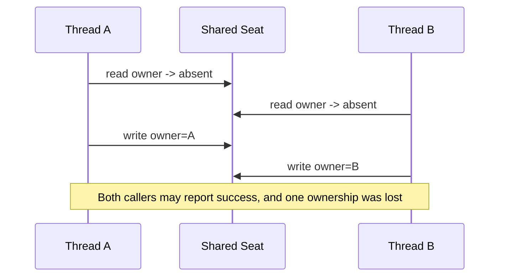
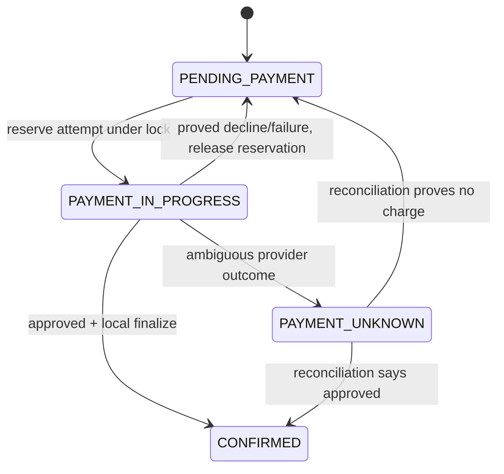
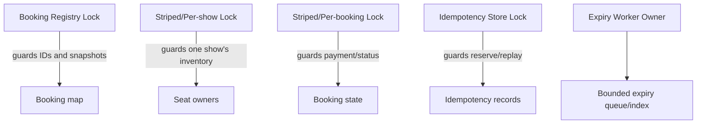

# Topic 11 - Concurrency and Thread Safety

[Curriculum index](../README.md) | [Preparation roadmap](../roadmap.md) |
[Previous topic](./10-api-contracts-and-error-modeling.md) |
[Next topic](./12-persistence-and-transaction-boundaries.md)

- **Category:** Shared-state correctness, coordination, and liveness
- **Difficulty:** Advanced
- **Priority:** Essential
- **Prerequisites:** Topics 2-3 and 10; Topics 5 and 9 recommended
- **Running example:** Concurrent Movie Ticket Booking seat holds, keyed locking,
  idempotent payment ownership, background expiry, and safe shutdown
- **Output:** Explicit concurrency invariants and synchronization protocols that
  preserve safety, liveness, failure, timeout, and cancellation behavior

## Outcome

After completing this topic, you should be able to:

- Identify shared mutable state and state the invariant that concurrent access
  must preserve.
- Explain why the GIL or a thread-safe dictionary operation does not make a
  compound workflow thread-safe.
- Recognize check-then-act, read-modify-write, lost-update, stale-read, duplicate-
  effect, iterator, and lifecycle races.
- Define an operation's atomic boundary and linearization point.
- Use `Lock` and `RLock` deliberately with ownership, scope, and failure-safe
  release.
- Choose coarse, per-resource, striped, or optimistic coordination based on the
  invariant and contention domain.
- Design safe keyed-lock registries and explain their creation and cleanup
  hazards.
- Avoid holding locks across slow I/O, callbacks, blocking waits, iteration
  yields, or unknown code.
- Split workflows with explicit reservation/pending states when external effects
  cannot remain inside a critical section.
- Prevent deadlocks with one lock order, limited lock nesting, and bounded
  acquisition policy.
- Distinguish deadlock, livelock, starvation, convoying, and poor throughput.
- Use condition variables with predicate loops and correct notification rules.
- Choose `Event`, `Barrier`, `Semaphore`, `Queue`, or executor/futures for the
  coordination semantics they actually provide.
- Prefer immutability, snapshots, confinement, message passing, and partitioning
  before shared-memory locking when they simplify ownership.
- Implement optimistic version/compare-and-set retry without hiding conflicts or
  external effects.
- Coordinate idempotency ownership so concurrent duplicate requests cannot both
  execute.
- Define worker lifecycle, exception propagation, backpressure, cancellation,
  deadline, and shutdown behavior.
- Distinguish thread safety inside one process from process/database/distributed
  correctness.
- Write deterministic concurrency tests using barriers, events, bounded joins,
  captured exceptions, invariant checks, and controlled interleavings.
- Explain which stress tests increase confidence and which guarantees they
  cannot prove.

## Core idea

Concurrency design starts with an invariant and an interleaving, not a lock:

```text
1. Name the shared state.
2. State the invariant across that state.
3. List every operation that reads or mutates it.
4. Find compound read-decide-write sequences.
5. Choose one ownership/atomicity protocol.
6. Define the linearization point.
7. Define waiting, timeout, failure, cancellation, and shutdown behavior.
8. Test hostile interleavings and final invariants.
```

For a show seat:

```text
Shared state: ShowSeat.status and held_by_booking_id
Invariant: at most one active booking owns one seat for one show
Unsafe workflow: read AVAILABLE -> decide -> write HELD
Atomic boundary: recheck and claim under the show/seat coordination mechanism
Linearization point: the successful AVAILABLE -> HELD ownership change
Loser behavior: explicit seat-unavailable conflict, no partial booking/effect
```

> A lock is an implementation mechanism. The design is the invariant, ownership,
> critical section, order, and liveness contract around it.

## Scope boundary

This topic deeply covers:

- threads, tasks, processes, and concurrency vocabulary;
- safety, atomicity, linearizability, visibility, ordering, and liveness;
- data races and higher-level race conditions;
- `threading.Lock`, `RLock`, lock scope, granularity, ordering, and registries;
- deadlock, livelock, starvation, convoying, and contention;
- condition variables, events, barriers, semaphores, queues, and executors;
- immutability, copy-on-write, confinement, actors/message passing, partitioning,
  and optimistic versioning;
- concurrent idempotency ownership and external-effect boundaries;
- worker errors, backpressure, timeouts, cancellation, and shutdown;
- deterministic concurrency and liveness testing.

It does not deeply cover:

- SQL isolation levels, row/range locks, optimistic persistence, constraints,
  durable transactions, distributed locks, leases, or fencing tokens; Topic 12
  covers persistence and transaction boundaries;
- full `asyncio` API design, structured-concurrency libraries, multiprocessing,
  actor frameworks, or reactive-stream implementations;
- CPU/cache memory models in C/C++/Java or lock-free algorithm proofs;
- operating-system scheduler internals;
- distributed consensus, leader election, or high-level service coordination;
- general testing architecture beyond concurrency-specific techniques; Topic 14
  covers testing more broadly.

Examples use Python 3.10+ and the standard library. Code fences are focused
excerpts; some reference types introduced nearby. Standalone implementations
should include all imports and may use `from __future__ import annotations`.

## 1. Learn

### 1.1 Concurrency versus parallelism

- **Concurrency:** multiple units of work can make progress over overlapping
  time; their steps may interleave.
- **Parallelism:** multiple units literally execute at the same time on different
  execution resources.

Threaded I/O programs are concurrent even when Python bytecode execution is
serialized at moments. Correctness must handle interleaving regardless of how
much parallel execution happens.

### 1.2 Thread, task, and process are different boundaries

| Unit | Memory | Typical coordination | Important limit |
|---|---|---|---|
| Thread | shares process objects | locks/conditions/queues | one process only |
| Async task | shares event-loop objects | async locks/queues/await discipline | blocking call stalls loop |
| Process | separate normal memory | IPC/shared store/process primitives | thread lock is unrelated |
| Machine/service instance | separate memory/failure | database/broker/distributed protocol | local lock proves nothing globally |

Always state which execution model and failure boundary your guarantee covers.

### 1.3 The GIL is not a business invariant

Do not say “Python has a GIL, so this is thread-safe.”

- A workflow contains multiple bytecode and method steps.
- Execution can switch between steps and around blocking operations.
- Library/C-extension behavior may release interpreter execution control.
- A single dictionary operation being memory-safe does not make a compound
  check-then-update atomic.
- Correct code should depend on explicit synchronization/ownership, not an
  interpreter accident.

The GIL does not protect “one seat has one owner,” “balance never goes negative,”
or “one idempotency key has one executor.”

### 1.4 Safety, liveness, and performance

Evaluate separately:

| Property | Question |
|---|---|
| Safety | Can an invalid state/effect occur? |
| Liveness | Can requested work eventually complete or fail? |
| Performance | Is progress sufficiently concurrent and bounded? |

A global lock can preserve safety but cause a convoy and unacceptable latency.
A spin/retry loop can avoid blocking but livelock. A fast unlocked design can
corrupt state.

### 1.5 Race condition versus data race

A **data race** usually means unsynchronized concurrent accesses to the same
memory where at least one writes, under a language memory model. A **race
condition** is broader: correctness depends on timing/interleaving.

Python interviews commonly mean the broader race condition. Examples include:

- two safe dictionary calls composed unsafely;
- a file/provider result arriving after cancellation;
- timeout racing with completion;
- callback unsubscribing while publication iterates;
- stale availability read racing with an atomic database claim.

### 1.6 Check-then-act race

```python
class UnsafeSeatInventory:
    def __init__(self) -> None:
        self._owner_by_seat: dict[str, str] = {}

    def hold(self, seat_id: str, booking_id: str) -> None:
        if seat_id in self._owner_by_seat:
            raise ValueError("seat is unavailable")
        self._owner_by_seat[seat_id] = booking_id
```

Unsafe interleaving:



The compound operation, not each dictionary access, must be atomic.

### 1.7 Read-modify-write and lost update

```text
Thread A reads balance 100
Thread B reads balance 100
Thread A writes 80
Thread B writes 70
Expected after -20 and -30: 50
Observed: 70 (A's update lost)
```

Other forms:

- `counter += 1`;
- append plus separate count/index update;
- check capacity then increment issued count;
- read status then perform effect then write status;
- load version, compute, and save without compare-and-set.

### 1.8 Time-of-check to time-of-use

TOCTOU occurs when a fact changes between validation and use:

```text
check seat available -> price -> call provider -> claim seat
```

Even if the first check used a lock, releasing it before the claim makes the
decision stale. Either keep the relevant read-decide-write atomic or create a
reservation state that preserves ownership while slow work occurs.

### 1.9 Atomicity is semantic

An operation is atomic with respect to an observer when it appears to occur
entirely before or entirely after another operation, not partially interleaved.

Atomicity scope may be:

- one field transition;
- one aggregate invariant;
- one in-memory workflow;
- one database transaction;
- one compare-and-set;
- never a local lock plus independent remote provider automatically.

Write exactly what participates.

### 1.10 Linearization point

The **linearization point** is the instant an operation logically takes effect
within its invocation/response interval.

Examples:

- seat hold: assignment of owner under the coordination lock;
- bounded coupon claim: increment after eligibility/supply recheck;
- queue enqueue: successful `put`;
- optimistic update: successful version compare-and-set;
- idempotency execution: atomic transition from absent to in-progress owner.

Naming it makes one-winner and retry behavior testable.

### 1.11 Start with one owner

The simplest concurrency design is often ownership:

```text
one aggregate/partition -> one lock or serial executor -> all mutations
immutable snapshots     -> readers
messages/commands        -> request changes
```

If only one unit mutates a state and others communicate through a queue, many
shared-memory races disappear. Ownership must still define backlog,
exceptions, shutdown, and process scope.

### 1.12 `Lock`: basic mutual exclusion

```python
from dataclasses import dataclass
from threading import Lock


@dataclass(frozen=True, slots=True)
class Hold:
    seat_id: str
    booking_id: str


class SeatInventory:
    def __init__(self) -> None:
        self._owner_by_seat: dict[str, str] = {}
        self._lock = Lock()

    def hold(self, seat_id: str, booking_id: str) -> Hold:
        with self._lock:
            if seat_id in self._owner_by_seat:
                raise ValueError("seat is unavailable")
            self._owner_by_seat[seat_id] = booking_id
            return Hold(seat_id, booking_id)

    def owner_of(self, seat_id: str) -> str | None:
        with self._lock:
            return self._owner_by_seat.get(seat_id)
```

`with` releases the lock on success or exception. Protect reads too when they
must observe a consistent value/protocol.

### 1.13 Lock the invariant, not a line

For multiple seats in one booking, this is insufficient:

```text
lock A1 -> hold A1 -> unlock
lock A2 -> discover unavailable -> unlock
```

If the contract promises all-or-none holds, the critical section must recheck
all selected seats and claim all of them as one atomic invariant boundary, or
use a reservation/rollback protocol whose partial states are explicit.

### 1.14 Encapsulate the lock with the state

Good ownership:

```text
SeatInventory owns _owner_by_seat and _lock.
All public reads/writes go through SeatInventory methods.
Callers never acquire inventory._lock directly.
```

Public locks leak ordering and correctness responsibilities to every caller.
Returning mutable internal objects can let callers mutate after the lock is
released.

### 1.15 Document the synchronization policy

For each guarded component state:

```text
Guarded state:
Invariant:
Lock/owner:
Methods requiring lock:
Linearization points:
May block/call external code while held?:
Nested locks/order:
Read snapshot semantics:
Scope: thread/process/machine:
Timeout/cancellation:
```

A comment saying `# thread safe` is not a policy.

### 1.16 `Lock` versus `RLock`

- `Lock` cannot be acquired twice by the same thread without blocking.
- `RLock` tracks owning thread and recursion count; the same owner may acquire it
  repeatedly and must release equally.

Prefer `Lock` when possible because accidental recursive locking reveals design
problems sooner. Use `RLock` when a deliberate public method under the lock calls
another method that follows the same lock protocol, or callbacks/reentrancy are
carefully designed.

Do not choose `RLock` as a generic deadlock fix; it only helps same-thread
reacquisition, not cycles across different locks/threads.

### 1.17 Public and `_locked` methods

A clear pattern:

```python
from threading import RLock


class Counter:
    def __init__(self) -> None:
        self._value = 0
        self._lock = RLock()

    def increment(self) -> int:
        with self._lock:
            return self._increment_locked()

    def add_two(self) -> int:
        with self._lock:
            self._increment_locked()
            return self._increment_locked()

    def _increment_locked(self) -> int:
        self._value += 1
        return self._value
```

The suffix documents a precondition. Keep locked helpers private and call them
only while owning the correct lock.

### 1.18 Coarse-grained locking

One service lock is simple:

- one obvious order;
- easy whole-workflow invariants;
- low deadlock risk;
- useful for small in-memory interview solutions.

Costs:

- unrelated work serializes;
- slow code creates a convoy;
- external calls under lock amplify latency/failure;
- one hot request blocks every tenant/resource.

Start coarse for correctness, measure contention, then partition using invariant
boundaries rather than splitting locks arbitrarily.

### 1.19 Fine-grained and per-resource locking

Per-show/flight/hotel locks allow unrelated inventory to progress independently.
They are correct only if every guarded invariant is contained by that key.

Questions:

- Does a command touch two shows/resources?
- Is there global state such as booking ID uniqueness or history?
- Can a read iterate a dictionary while another keyed lock mutates it?
- How is the lock object created exactly once per key?
- When is an unused lock removed without racing a waiter?

Finer locks reduce contention but increase protocol complexity.

### 1.20 Safe keyed-lock registry

```python
from contextlib import contextmanager
from threading import Lock
from typing import Iterator


class KeyedLocks:
    def __init__(self, stripes: int = 64) -> None:
        if stripes <= 0:
            raise ValueError("stripes must be positive")
        self._locks = tuple(Lock() for _ in range(stripes))

    @contextmanager
    def for_key(self, key: str) -> Iterator[None]:
        lock = self._locks[hash(key) % len(self._locks)]
        with lock:
            yield
```

Lock striping avoids an unbounded registry and atomic create/remove problem.
Unrelated keys can collide on a stripe, reducing concurrency but not safety.
Python hash distribution is process-specific; that is fine for local striping,
not durable partition identity.

### 1.21 Dynamic lock registries are shared state too

If exact per-key locks are stored in a dictionary, the registry needs its own
coordination and reference lifecycle:

```text
registry lock -> find/create entry and increment users
release registry lock
acquire key lock
...
release key lock
registry lock -> decrement users/remove only when no owner/waiter can use it
```

Naively deleting an unlocked entry can create two locks for one key while a
waiter still holds the old reference. A never-cleaned registry avoids that race
but can leak memory. Striping is often the interview-friendly trade-off.

### 1.22 Keep critical sections small but complete

Good critical section:

```text
acquire
recheck guarded predicate
perform bounded in-memory state transition
capture immutable work/result
release
```

“Small” must not split a compound invariant. First make it correct and complete;
then move unrelated pure computation outside or use explicit reservation state.

### 1.23 Avoid unknown code under a lock

Do not hold a lock across:

- provider/network/database calls unless the bounded protocol demands it;
- observer callbacks/plugin hooks/user functions;
- logging handlers that may block/reenter;
- `Future.result()` or thread join;
- queue operations that may block indefinitely;
- iterator `yield` controlled by the caller;
- sleep/backoff;
- acquiring an unordered foreign lock.

Unknown code can block, call back into the component, or acquire locks in an
opposite order.

### 1.24 External effects require reservation states

If payment is slow, do not simply release the lock after checking and later
assume state is unchanged. Introduce ownership:



Protocol:

1. lock and recheck payable state;
2. record one attempt/key/`PAYMENT_IN_PROGRESS` owner;
3. unlock;
4. call provider;
5. lock, verify same owner/version, and finalize result;
6. use unknown/reconciliation state when the effect is ambiguous.

### 1.25 Never wait for yourself

Deadlock can occur even with one non-reentrant lock:

```text
public A acquires lock -> calls public B -> B tries same Lock -> waits forever
```

Fix the call structure (`_b_locked`) or use deliberate `RLock` if reentrancy is
part of the design. Do not use timeout and ignore failure as the primary fix.

### 1.26 Multiple locks and global order

Transfers or multi-resource bookings may need two locks. Define one canonical
order:

```python
from contextlib import ExitStack
from threading import Lock


def acquire_accounts(
    first_id: str,
    first_lock: Lock,
    second_id: str,
    second_lock: Lock,
) -> ExitStack:
    ordered = sorted(
        ((first_id, first_lock), (second_id, second_lock)),
        key=lambda item: item[0],
    )
    stack = ExitStack()
    try:
        for _, lock in ordered:
            stack.enter_context(lock)
        return stack
    except BaseException:
        stack.close()
        raise
```

Usage: `with acquire_accounts(...): ...`. Reject/self-handle the same account so
the same non-reentrant lock is not acquired twice. Every path must use the same
stable order.

### 1.27 Deadlock conditions

Classic deadlock needs all four:

1. mutual exclusion;
2. hold and wait;
3. no forced preemption;
4. circular wait.


Break circular wait with a global lock order; reduce hold-and-wait by acquiring
all needed locks in order or redesigning ownership; avoid nesting where
possible.

### 1.28 Timeout is not a deadlock design

Timed acquisition can bound waiting and support recovery, but it does not prove
state is safe. If a later lock cannot be acquired:

- release all earlier locks;
- roll back/reserve nothing partial;
- use monotonic remaining deadline;
- retry with bounded backoff/jitter only if semantics allow;
- surface overload/conflict rather than loop forever.

Consistent order is the primary prevention technique.

### 1.29 Deadlock, livelock, starvation, and convoy

| Problem | Symptom |
|---|---|
| Deadlock | participants wait forever in a cycle |
| Livelock | participants keep reacting/retrying but no useful progress |
| Starvation | one participant repeatedly fails to obtain service |
| Lock convoy | many participants serialize behind a slow holder |
| Priority inversion | important work waits behind lower-priority holder |

Safety tests can all pass while liveness fails.

### 1.30 Condition variables represent state predicates

A `Condition` combines a lock with wait/notification. Waiters sleep until shared
state may satisfy a predicate:

```python
from collections import deque
from threading import Condition
from typing import Generic, TypeVar


T = TypeVar("T")


class BoundedBuffer(Generic[T]):
    def __init__(self, capacity: int) -> None:
        if capacity <= 0:
            raise ValueError("capacity must be positive")
        self._items: deque[T] = deque()
        self._capacity = capacity
        self._condition = Condition()
        self._closed = False

    def put(self, item: T) -> None:
        with self._condition:
            self._condition.wait_for(
                lambda: len(self._items) < self._capacity or self._closed
            )
            if self._closed:
                raise RuntimeError("buffer is closed")
            self._items.append(item)
            self._condition.notify()

    def get(self) -> T | None:
        with self._condition:
            self._condition.wait_for(lambda: self._items or self._closed)
            if not self._items:
                return None
            item = self._items.popleft()
            self._condition.notify()
            return item

    def close(self) -> None:
        with self._condition:
            self._closed = True
            self._condition.notify_all()
```

Production methods also need timeout/deadline behavior and a clear drain versus
discard policy.

### 1.31 Always wait in a predicate loop

Notifications mean “state may have changed,” not “your condition is now true.”
Another waiter can consume the resource first, and wakeups may occur without the
predicate becoming true.

Use:

```text
with condition:
    while not predicate():
        condition.wait(remaining_timeout)
    change state
```

`Condition.wait_for` encodes the loop. The predicate and change are evaluated
while holding the condition's lock.

### 1.32 `notify` versus `notify_all`

- `notify()` wakes one waiter; useful when one state change enables at most one
  equivalent waiter.
- `notify_all()` wakes all; needed for shutdown or when different predicates
  may now be true.

Notifications are not queued permits. Notify while following the condition lock
protocol and update state before notifying. Woken threads still reacquire the
lock and recheck.

### 1.33 `Event`: one-bit level-triggered signal

```python
from threading import Event, Thread


class Worker:
    def __init__(self) -> None:
        self._stop = Event()
        self._thread = Thread(target=self._run, name="expiry-worker")

    def start(self) -> None:
        self._thread.start()

    def stop(self) -> None:
        self._stop.set()
        self._thread.join(timeout=2)
        if self._thread.is_alive():
            raise RuntimeError("worker did not stop within deadline")

    def _run(self) -> None:
        while not self._stop.wait(timeout=0.1):
            self.expire_once()

    def expire_once(self) -> None:
        ...
```

An Event stays set until cleared and does not count multiple notifications. Use
a Queue/Semaphore/Condition when counts or payloads matter.

### 1.34 `Barrier`: phase alignment, especially in tests

A barrier releases a fixed number of participants after all arrive. It is useful
for starting contenders near the same point, but a start barrier alone does not
force the critical read/write interleaving.

Always use timeouts and handle a broken barrier in robust tests. Do not use a
barrier when participant count can change dynamically.

### 1.35 `Semaphore`: capacity, not ownership identity

```python
from contextlib import contextmanager
from threading import BoundedSemaphore
from typing import Iterator


class ProviderCapacity:
    def __init__(self, maximum: int) -> None:
        if maximum <= 0:
            raise ValueError("maximum must be positive")
        self._permits = BoundedSemaphore(maximum)

    @contextmanager
    def acquire(self, timeout: float) -> Iterator[None]:
        if not self._permits.acquire(timeout=timeout):
            raise TimeoutError("provider capacity unavailable")
        try:
            yield
        finally:
            self._permits.release()
```

A semaphore limits concurrent work; it does not protect a compound invariant by
resource ID. `BoundedSemaphore` detects over-release.

### 1.36 `Queue`: message passing plus backpressure

`queue.Queue` provides synchronized `put`/`get`, optional capacity, and task
tracking. Define:

- item ownership and immutability;
- maximum size/backpressure behavior;
- producer timeout/cancellation;
- consumer exception handling;
- `task_done()` exactly once per `get()`;
- drain/discard shutdown;
- sentinel collision and number of consumers;
- retry/dead-letter/poison-item behavior.

An unbounded queue converts overload into memory growth.

### 1.37 A queue worker with explicit result/error channel

```python
from dataclasses import dataclass
from queue import Queue
from threading import Thread
from typing import Callable, Generic, TypeVar


T = TypeVar("T")
R = TypeVar("R")


@dataclass(frozen=True, slots=True)
class WorkResult(Generic[R]):
    value: R | None = None
    error: BaseException | None = None


def run_one_worker(
    work: Queue[T | None],
    results: Queue[WorkResult[R]],
    operation: Callable[[T], R],
) -> Thread:
    def consume() -> None:
        while True:
            item = work.get()
            try:
                if item is None:
                    return
                try:
                    results.put(WorkResult(value=operation(item)))
                except BaseException as error:
                    results.put(WorkResult(error=error))
            finally:
                work.task_done()

    thread = Thread(target=consume, name="work-consumer")
    thread.start()
    return thread
```

This sentinel works for one consumer and requires input type to exclude `None`.
Production cancellation/fatal-error policy must be stricter than catching every
`BaseException` indefinitely.

### 1.38 Thread pools and futures

`ThreadPoolExecutor` manages worker threads and returns `Future` objects.
Contract decisions remain:

- pool size and queue/backpressure;
- which work may block;
- result/exception collection;
- deadline and cancellation;
- whether submitted work started;
- shutdown wait/cancel policy;
- nested submission/wait deadlock risk.

Calling `future.result()` while holding a lock needed by the future can deadlock.
Submitting more tasks than a bounded dependency can serve can amplify overload.

### 1.39 Cancellation is cooperative

Cancelling a future that has not started may prevent execution. Once running,
Python cannot safely kill an arbitrary thread. The operation must periodically
observe a cancellation Event/deadline at safe points and clean up.

Never leave an aggregate half-mutated merely because cancellation arrived.
Finish/rollback the atomic section, then report cancellation. External effects
may require reconciliation as defined in Topic 10.

### 1.40 Shutdown is part of correctness

Define states:

```text
NEW -> RUNNING -> STOPPING -> TERMINATED
```

Decide:

- repeated `start`/`stop` behavior;
- reject or accept submissions while stopping;
- drain queued work or discard/cancel it;
- how consumers wake;
- bounded join deadline;
- how worker exceptions surface;
- who owns executor/queue cleanup;
- whether restart is supported.

Daemon threads are not a substitute for clean shutdown; process exit may drop
work/resources.

### 1.41 Worker exceptions must not disappear

Exceptions in background threads do not automatically fail the initiating test
or request. Capture them in a result queue/future, set a fatal-error Event, or
provide a supervised worker lifecycle. Tests must join and assert the error
channel.

“The main thread passed” does not prove workers succeeded.

### 1.42 Immutability reduces coordination

Immutable values/messages can be safely shared when their referenced contents
are also immutable. A frozen dataclass containing a mutable list is only shallow
immutability.

Prefer tuples, frozen value objects, copies, or read-only mappings for
cross-thread snapshots. Resource handles, lazy iterators, and domain entities
still have ownership/lifetime concerns.

### 1.43 Snapshot under lock, compute outside

```python
from threading import Lock


class PriceBook:
    def __init__(self) -> None:
        self._prices: dict[str, int] = {}
        self._lock = Lock()

    def replace(self, prices: dict[str, int]) -> None:
        snapshot = dict(prices)
        with self._lock:
            self._prices = snapshot

    def snapshot(self) -> dict[str, int]:
        with self._lock:
            return dict(self._prices)
```

Readers receive an independent snapshot. For read-mostly state, replacing an
immutable mapping/reference under a short lock can reduce contention. Define
whether readers need latest or one coherent version.

### 1.44 Thread confinement

State confined to one thread/task needs no shared lock. Examples:

- UoW/session/Identity Map per request thread;
- parser builder used by one worker;
- mutable aggregation built privately then published immutably;
- actor-owned aggregate mutated only by its mailbox consumer.

Confinement is a contract. Passing the object to another thread or retaining it
after scope ends breaks the guarantee.

### 1.45 Message passing and actor-like ownership

```text
many producers -> bounded command queue -> one owner -> immutable results/events
```

Benefits: sequential invariant reasoning, no caller-held lock, natural audit
order. Costs: queue latency/backpressure, one hot owner, async result handling,
shutdown/error supervision, and process durability.

An actor in one process is not durable/distributed automatically.

### 1.46 Partition by invariant key

Partitioning can assign:

- one show to one lock/worker;
- one driver to one ownership partition;
- one coupon campaign to one counter partition;
- one account to one ordered executor.

Cross-partition operations need a separate protocol/order/transaction. Choose
the key that contains the invariant, not merely one that hashes evenly.

### 1.47 Optimistic versioning

Optimistic coordination lets readers compute without holding a long lock, then
commits only if the version is unchanged:

```python
from dataclasses import dataclass
from threading import Lock


@dataclass(frozen=True, slots=True)
class VersionedValue:
    value: int
    version: int


class AtomicVersionedCounter:
    def __init__(self) -> None:
        self._value = 0
        self._version = 0
        self._lock = Lock()

    def read(self) -> VersionedValue:
        with self._lock:
            return VersionedValue(self._value, self._version)

    def compare_and_set(self, expected_version: int, new_value: int) -> bool:
        with self._lock:
            if self._version != expected_version:
                return False
            self._value = new_value
            self._version += 1
            return True
```

The local lock implements the CAS for this in-memory example. A database CAS
must be enforced by the database, not check-then-save in Python.

### 1.48 Optimistic retry loop

```python
def add_with_retry(
    counter: AtomicVersionedCounter,
    delta: int,
    maximum_attempts: int = 5,
) -> VersionedValue:
    if maximum_attempts <= 0:
        raise ValueError("maximum_attempts must be positive")
    for _ in range(maximum_attempts):
        current = counter.read()
        if counter.compare_and_set(current.version, current.value + delta):
            return counter.read()
    raise RuntimeError("counter remained contended")
```

Retry only a pure/recomputable local decision. Do not repeat external effects
inside an optimistic loop unless idempotency/reconciliation makes it safe.

### 1.49 Pessimistic versus optimistic coordination

| Choice | Strong fit |
|---|---|
| Pessimistic lock | conflicts common, critical section small, one process |
| Per-key lock | invariant partitions cleanly, local process |
| Optimistic version | conflicts rare, computation/read may be longer |
| Queue/owner | ordered mutation and backpressure matter |
| Immutable snapshot | read-heavy, replacement acceptable |
| Database atomic constraint/CAS | multiple processes share durable truth |

Measure conflict/latency. Do not use optimistic retry when starvation or high
contention makes repeated work unbounded.

### 1.50 Concurrent idempotency needs one owner

From Topic 10:

```text
atomic reserve key+fingerprint -> one IN_PROGRESS owner
same fingerprint duplicate    -> wait/poll/replay
different fingerprint         -> conflict
owner success                  -> store success before/with effect contract
ambiguous external result      -> UNKNOWN and reconcile
```

A lock around an in-memory dictionary can prove one owner in one process. It
cannot coordinate other processes or survive a crash. Topic 12 moves ownership
to durable shared storage.

### 1.51 Single-flight duplicate work

For expensive read/cache fill, duplicates may share one in-flight result:

```text
first caller becomes loader
later callers wait on same key
loader publishes immutable value or error
entry is removed under a safe lifecycle rule
```

Define whether errors are shared/cached, waiter cancellation, loader timeout,
and entry cleanup. Single-flight prevents duplicate simultaneous work; it is not
durable mutation idempotency.

### 1.52 Iteration over mutable state

Risks:

- runtime error when dictionary changes size;
- missing/duplicate/mixture of versions;
- returning a generator after releasing the lock;
- holding a lock across caller-controlled yield;
- mutable entity references changing after snapshot.

Options:

- copy keys/values under lock, then iterate snapshot;
- return immutable DTO snapshots;
- use a versioned collection/cursor;
- keep all iteration inside owner thread;
- document weakly consistent behavior only when intentional.

### 1.53 Callbacks and reentrancy

Publishing callbacks under a state lock can:

- reenter the publisher and acquire the same/another lock;
- unsubscribe/mutate the collection during iteration;
- block on I/O;
- call peers with opposite lock order;
- expose half-completed state.

Usually capture immutable events/subscriber snapshot under lock or after commit,
release, then invoke callbacks under an explicit error/reentrancy policy.

### 1.54 Async locks are not thread locks

`asyncio.Lock` coordinates tasks on one event loop, not arbitrary OS threads.
`threading.Lock` blocks the thread and can stall an event loop if contended.
Never `await` while holding a `threading.Lock`; avoid holding an async lock
across slow external work unless the protocol deliberately serializes it.

Choose primitives from the execution model and do not mix them casually.

### 1.55 Process and distributed boundary

An in-process lock cannot coordinate:

- another worker process;
- another application instance;
- provider callbacks;
- database writers outside the process;
- work after process crash/restart.

Production mechanisms include database constraints/transactions/CAS, durable
queues, partition ownership, and carefully designed leases/fencing. Topic 12
covers these. Never say “thread-safe” when the requirement is globally unique
across servers.

### 1.56 Memory visibility and publication

Do not invent a `volatile` flag in Python. Use recognized synchronization:

- lock-protected state;
- `Event` for a boolean signal;
- `Condition` for predicates;
- `Queue` for payload handoff;
- future/result completion;
- immutable object published through a synchronized channel.

This makes ordering/ownership explicit and portable across supported runtimes.
Busy-looping on a plain shared flag wastes CPU and has unclear coordination.

### 1.57 Avoid double-checked locking

```text
if singleton is None:
    acquire lock
    if singleton is None:
        singleton = build()
```

It relies on subtle publication/runtime assumptions and often hides a global
lifetime problem. Prefer construction in the composition root, module import
initialization when appropriate, or always acquire a simple lock when lazy
construction is truly required.

### 1.58 Backpressure is a concurrency contract

When producers outpace consumers, choose:

- block producer with deadline;
- reject/load-shed with explicit error;
- drop newest/oldest under a safe telemetry contract;
- coalesce duplicate updates;
- spill durably;
- scale/partition consumers.

Unbounded threads/tasks/queues postpone failure until memory or dependency
collapse.

### 1.59 Timeout budgets use monotonic time

For a multi-lock/condition/retry workflow:

```python
from time import monotonic


class Deadline:
    def __init__(self, timeout_seconds: float) -> None:
        if timeout_seconds < 0:
            raise ValueError("timeout cannot be negative")
        self._end = monotonic() + timeout_seconds

    def remaining(self) -> float:
        return max(0.0, self._end - monotonic())

    def expired(self) -> bool:
        return self.remaining() == 0.0
```

Wall-clock changes should not extend/shorten elapsed wait budgets. Pass
remaining time to each blocking operation; do not reset the original timeout.

### 1.60 Thread-safety guarantee levels

Document one:

```text
not thread-safe              -> caller confines or synchronizes
thread-compatible            -> separate instances are safe
thread-safe methods          -> public operations safe concurrently
conditionally thread-safe    -> listed methods/state require caller protocol
immutable                    -> safe if referenced graph also immutable
single-thread/owner only      -> all calls dispatched to one owner
```

Also state process scope, reentrancy, blocking, callback, and snapshot behavior.

### 1.61 Concurrency design matrix

| Pressure | First mechanism | Key question |
|---|---|---|
| No shared mutation | immutability/confinement | can ownership remain local? |
| Small compound invariant | one `Lock` | what exactly is guarded? |
| Same-thread nested protocol | `_locked` helper or deliberate `RLock` | is reentrancy required? |
| Independent keyed invariants | striping/per-key lock | any cross-key state? |
| Wait for state predicate | `Condition` | what predicate/notification? |
| Stop/readiness flag | `Event` | level signal sufficient? |
| Limit parallel capacity | semaphore | how many permits/timeout? |
| Transfer payload/work | bounded `Queue` | backpressure/shutdown/errors? |
| Rare conflicts | version/CAS | can work be safely recomputed? |
| Ordered mutations | owner/actor queue | hot partition/lifecycle? |
| Multi-process invariant | durable store protocol | Topic 12 mechanism? |

Choose by invariant and contract, never by primitive familiarity.

## 2. Recognize

### 2.1 Requirement signals

Listen for:

- “Two users may choose the same seat/room/coupon/driver.”
- “Requests arrive concurrently.”
- “Only one winner is allowed.”
- “Do not oversubscribe capacity.”
- “Process work in the background.”
- “Wait until inventory/data becomes available.”
- “Limit provider/database concurrency.”
- “Support cancellation and graceful shutdown.”
- “Avoid blocking unrelated shows/tenants.”
- “Transfer between two accounts/resources.”
- “Retry optimistic conflicts.”
- “Clients can send duplicate requests at the same time.”
- “Read while updates continue.”
- “Callbacks may call back into the service.”
- “Run on several worker processes/servers.”

The last requirement cannot be solved by adding another `threading.Lock`.

### 2.2 Race smells

Look for:

- `if key not in mapping: mapping[key] = ...`;
- `if available: assign()`;
- `if count < limit: count += 1`;
- `balance = balance - amount`;
- reading status, calling a provider, then writing new status;
- checking a version but saving without conditional update;
- two related dictionaries changed in separate lock scopes;
- reading a mutable list/dict while other methods mutate it;
- returning a generator/live entity after unlocking;
- lazy per-key lock creation without registry coordination;
- nested locks without one documented order;
- calling callbacks/I/O while holding a lock;
- waiting on a Future/thread that needs your lock;
- plain boolean stop flags and busy loops;
- unbounded thread creation or queue growth;
- background exceptions nobody observes;
- `join()`/`wait()` without a test/production timeout;
- tests that append outcomes but never capture worker exceptions.

### 2.3 False positives

Synchronization may be unnecessary when:

- state is immutable and deeply safe to share;
- each request/thread owns a separate instance;
- a value is built privately and published once through a safe channel;
- only one event-loop task/actor owns mutation under an enforced protocol;
- the operation is pure and stateless;
- a local variable cannot escape the call;
- sequential interview requirements explicitly exclude concurrency.

Document confinement. “Nobody currently calls it concurrently” is not a stable
ownership rule if the object is shared globally.

### 2.4 Decision questions

Before choosing a primitive, ask:

1. What exact mutable state is shared?
2. What invariant spans which fields/objects?
3. Which operations read/write each part?
4. What hostile interleaving breaks the invariant?
5. Can ownership, immutability, or message passing remove sharing?
6. What is the smallest complete atomic boundary?
7. What is the linearization point?
8. Is one coarse lock sufficient at current scale?
9. If partitioned, does the invariant fit wholly inside the key?
10. Are two or more locks ever needed, and what is their global order?
11. Can any critical section block, call I/O, callback, or unknown code?
12. If the lock is released for slow work, what reservation/version preserves
    ownership?
13. What can wait, for how long, and on which predicate?
14. What happens on timeout, cancellation, worker error, and shutdown?
15. Does the guarantee need to span processes or survive crashes?
16. How will tests force the dangerous interleaving and detect a hang?

## 3. Model

### 3.1 Running example: pressure inventory

For Movie Ticket Booking:

```text
Create Booking    -> multiple seats must be held all-or-none
Confirm Booking   -> one payment attempt owner; provider call is slow/remote
Cancel/Expire     -> release only seats still owned by that booking
Availability Read -> coherent snapshot while holds change
Expiry Worker     -> races with confirmation/cancellation
History Read      -> mutable booking dictionary and entity snapshots
Idempotent Retry  -> one concurrent command owner
Shutdown          -> stop expiry worker without dropping owned work
```

### 3.2 State and invariant inventory

| Shared state | Invariant | Natural owner/key |
|---|---|---|
| Show seat states/owners/deadlines | one active owner per show-seat | Show/`show_id` |
| Booking status/payment attempt | one valid transition/attempt owner | Booking/`booking_id` |
| Booking registry | ID uniqueness and safe iteration | repository/service registry |
| Idempotency records | one owner per scoped key/fingerprint | idempotency store key |
| Expiry schedule | each due hold processed safely/idempotently | scheduler queue/index |
| Provider capacity | at most configured calls in flight | semaphore/pool |
| Worker lifecycle | no submissions after stop; every accepted item resolved | worker service |

If an invariant spans owners, define a higher boundary or multi-owner protocol.

### 3.3 Access matrix

Mark `R`, `W`, and `E` (external/unknown call):

| Operation | Show seats | Booking | Registry | Idempotency | Provider |
|---|---:|---:|---:|---:|---:|
| Create | W | create | W | W | - |
| Confirm reserve | R | W | R | W | - |
| Confirm charge | - | reserved | - | in-progress | E |
| Confirm finalize | W | W | R | W | - |
| Cancel | W | W | R | maybe | refund E |
| Expire | W | W | R/read schedule | - | - |
| Availability | R snapshot | - | - | - | - |
| History | - | R snapshot | R | - | - |

This exposes that one per-show lock alone may not protect a global registry or
booking-level payment ownership automatically.

### 3.4 Unsafe interleaving table

| Step | Thread A: create booking | Thread B: create booking |
|---:|---|---|
| 1 | reads A1 available | - |
| 2 | - | reads A1 available |
| 3 | creates booking A | - |
| 4 | - | creates booking B |
| 5 | writes A1 owner A | - |
| 6 | - | writes A1 owner B |
| Result | reports success | reports success; invariant broken |

Then place the atomic boundary around all requested-seat rechecks plus all claims
and booking registration required by the local invariant.

### 3.5 Linearization ledger

| Operation | Linearization point | Loser observation |
|---|---|---|
| Hold seats | all ownership fields change under show lock | conflict, no partial hold |
| Release hold | owner-checked HELD -> AVAILABLE transition | no-op/rejection per contract |
| Reserve payment | booking attempt owner set | in-progress/replay |
| Finalize payment | matching attempt + booking state transition | stale attempt ignored/conflict |
| Coupon claim | issued count and coupon owner recorded | exhausted/limit rejection |
| Assign driver | AVAILABLE -> RESERVED/ON_TRIP | unmatched/requested |
| Idempotency | absent -> in-progress record | wait/poll/conflict |

### 3.6 Lock and ownership map



Prefer fewer ownership domains in an interview. If using several, explain every
operation crossing them and the global order.

### 3.7 Critical-section card

For Create Booking:

```text
Key/owner: show_id
Guarded state: show seat statuses/owners plus local booking insertion decision
Pre-lock work: parse command, authorize, pure pricing inputs, validate IDs
Under lock: capture now if boundary requires; expire relevant holds; recheck all
            seats; create stable booking ID; claim all seats; register booking
Linearization: last/all claims + registration become visible as one protected step
After lock: map immutable result, dispatch committed events
No lock across: client code, provider, logging callback, response serialization
Failure: exception-safe release; no partial claims
```

### 3.8 Lock order table

Define one total order, for example:

```text
1. registry/configuration lock
2. keyed show lock ordered by show_id
3. keyed booking lock ordered by booking_id
4. idempotency entry lock
```

Better: redesign so ordinary workflows need only one state-owner lock. If a
multi-show operation needs several show locks, sort unique IDs, acquire in that
order, and release in reverse via context managers.

Never acquire a lower-order lock while holding a higher-order one.

### 3.9 Payment reservation protocol

| Phase | Under booking owner lock | Outside lock | On re-entry |
|---|---|---|---|
| Reserve | validate payable; record attempt/key/version | - | - |
| Execute | - | call provider with same key/deadline | - |
| Approved | - | response snapshot | verify attempt, confirm or repair |
| Declined | - | decision | verify attempt, release/finalize decline |
| Unknown | - | ambiguous timeout | record unknown/reconcile |
| Cancel race | mark requested/policy | do not erase in-flight effect | resolve by attempt identity |

This is concurrency plus Topic 10 error/idempotency semantics.

### 3.10 Condition predicate table

For a bounded expiry-work buffer:

| Participant | Wait predicate | State change | Notification |
|---|---|---|---|
| Producer | `size < capacity or closed` | append work | notify consumer |
| Consumer | `items or closed` | remove work | notify producer |
| Shutdown | none | `closed = True` | notify all |

On closed + empty, consumer terminates. On closed + non-empty, decide drain or
discard; the example drains.

### 3.11 Worker lifecycle table

| State | `start` | `submit` | `stop` | Worker behavior |
|---|---|---|---|---|
| NEW | -> RUNNING | reject | -> TERMINATED or reject | none |
| RUNNING | reject/idempotent | accept under bounded policy | -> STOPPING | process |
| STOPPING | reject | reject | idempotent wait | drain/cancel policy |
| TERMINATED | reject unless restart designed | reject | idempotent | none |

Define whether `stop` can be called from a worker thread; joining yourself must
be rejected or handled specially.

### 3.12 Liveness and timeout ledger

| Wait | Bound | Timeout outcome | Cleanup |
|---|---|---|---|
| Lock acquisition | remaining request deadline | busy/conflict/unavailable | release earlier locks |
| Condition wait | remaining deadline | empty/full timeout | no mutation |
| Queue put | bounded | overload/reject | caller retains item |
| Queue get | worker poll/condition | check stop | none |
| Provider semaphore | dependency budget | capacity unavailable | no provider send |
| Worker join | shutdown deadline | unhealthy/alert | do not claim terminated |
| Optimistic retry | attempts + deadline | conflict/contended | no external repeat |

### 3.13 Process-scope truth table

| Guarantee | One thread lock | One process | Multiple processes | Crash survival |
|---|---:|---:|---:|---:|
| One local seat owner | Yes | Yes if all paths share lock | No | No |
| One database seat owner | No | No | needs DB constraint/transaction | durable store |
| One provider charge | No | No | needs provider/idempotency protocol | provider/store |
| Graceful local worker stop | Yes | Yes | each process separately | supervisor/recovery |

State these limitations before proposing production evolution.

### 3.14 Concurrency decision record

Write:

```text
Execution model and scope:
Shared state:
Invariant(s):
Access matrix:
Hostile interleaving:
Owner/primitive and granularity:
Critical section(s):
Linearization point(s):
Lock order/nesting:
External/callback boundary:
Wait predicates/backpressure:
Timeout/cancellation/shutdown:
Failure/exception propagation:
Process/crash limitation:
Deterministic tests:
Rejected alternatives:
```

## 4. Implement

### 4.1 Hold multiple seats atomically

```python
from dataclasses import dataclass
from threading import Lock


@dataclass(frozen=True, slots=True)
class SeatHold:
    booking_id: str
    seat_ids: tuple[str, ...]


class ShowInventory:
    def __init__(self, seat_ids: tuple[str, ...]) -> None:
        if not seat_ids or len(set(seat_ids)) != len(seat_ids):
            raise ValueError("seat IDs must be non-empty and unique")
        self._owners: dict[str, str | None] = {seat_id: None for seat_id in seat_ids}
        self._lock = Lock()

    def hold(self, booking_id: str, seat_ids: tuple[str, ...]) -> SeatHold:
        requested = tuple(seat_ids)
        if not requested or len(set(requested)) != len(requested):
            raise ValueError("requested seats must be non-empty and unique")
        with self._lock:
            unknown = tuple(seat for seat in requested if seat not in self._owners)
            if unknown:
                raise ValueError(f"unknown seats: {unknown!r}")
            unavailable = tuple(
                seat for seat in requested if self._owners[seat] is not None
            )
            if unavailable:
                raise ValueError(f"unavailable seats: {unavailable!r}")
            for seat in requested:
                self._owners[seat] = booking_id
            return SeatHold(booking_id, requested)

    def release(self, hold: SeatHold) -> None:
        with self._lock:
            for seat in hold.seat_ids:
                if self._owners.get(seat) == hold.booking_id:
                    self._owners[seat] = None

    def owners_snapshot(self) -> dict[str, str | None]:
        with self._lock:
            return dict(self._owners)
```

All requested seats are rechecked before any write. Release is ownership-aware,
so a stale release cannot free a seat now owned by another booking.

### 4.2 Keep validation outside, recheck state inside

```text
outside lock: shape, IDs, duplicate input, authorization, pure computation
inside lock: existence in guarded collection, current availability, current
             version/state, capacity, and the mutation
```

Anything that can change concurrently must be rechecked under the winning
coordination mechanism.

### 4.3 Publish immutable results after unlocking

Create the result snapshot while the guarded state is coherent, then release
before serialization/callback:

```text
with lock:
    mutate
    result = immutable_summary_from_guarded_state()
return result
```

Do not return the mutable `Booking` and assume the caller observes the state at
linearization time.

### 4.4 Keep pure expensive work outside carefully

Price computation can happen before the lock only if inputs are immutable or
versioned and its result remains valid. Otherwise:

1. snapshot inputs/version under lock;
2. compute outside;
3. reacquire and verify version/predicate;
4. apply or recompute/reject.

This is optimistic validation, not “unlock and hope.”

### 4.5 Use a reservation for slow provider work

```python
from dataclasses import dataclass
from enum import Enum
from threading import Lock


class PaymentPhase(Enum):
    READY = "ready"
    IN_PROGRESS = "in_progress"
    CONFIRMED = "confirmed"
    UNKNOWN = "unknown"


@dataclass(frozen=True, slots=True)
class PaymentAttempt:
    attempt_id: str
    idempotency_key: str


class PaymentOwnership:
    def __init__(self) -> None:
        self._lock = Lock()
        self._phase = PaymentPhase.READY
        self._attempt: PaymentAttempt | None = None

    def reserve(self, attempt: PaymentAttempt) -> PaymentAttempt:
        with self._lock:
            if self._phase is PaymentPhase.CONFIRMED:
                return self._attempt
            if self._phase is PaymentPhase.IN_PROGRESS:
                if self._attempt == attempt:
                    return self._attempt
                raise RuntimeError("another payment attempt owns the booking")
            if self._phase is PaymentPhase.UNKNOWN:
                raise RuntimeError("payment must be reconciled")
            self._phase = PaymentPhase.IN_PROGRESS
            self._attempt = attempt
            return attempt

    def confirm(self, attempt_id: str) -> None:
        with self._lock:
            self._require_owner(attempt_id)
            self._phase = PaymentPhase.CONFIRMED

    def mark_unknown(self, attempt_id: str) -> None:
        with self._lock:
            self._require_owner(attempt_id)
            self._phase = PaymentPhase.UNKNOWN

    def _require_owner(self, attempt_id: str) -> None:
        if self._attempt is None or self._attempt.attempt_id != attempt_id:
            raise RuntimeError("stale payment attempt")
```

A complete version must handle decline/release, approved-but-local-failure,
result replay, and persistent recovery. This excerpt demonstrates ownership.

### 4.6 Use attempt identity when reentering

After any unlocked external call, verify:

- same aggregate identity;
- same attempt/lease/fencing identity;
- compatible current state;
- expected version;
- idempotency/provider reference.

Never finalize based only on “booking is pending”; a newer attempt may own it.

### 4.7 Avoid lock acquisition inside callbacks

Use:

```text
with lock:
    event = immutable event snapshot
    subscribers = tuple(current subscribers)
release lock
for subscriber in subscribers:
    subscriber(event)
```

Define whether subscription changes affect the current publication and how
callback errors are isolated. Topic 8 covers Observer semantics.

### 4.8 Acquire unique multi-resource locks in sorted order

```python
from contextlib import ExitStack
from threading import Lock


def acquire_many(
    keyed_locks: dict[str, Lock],
    resource_ids: tuple[str, ...],
) -> ExitStack:
    ordered_ids = tuple(sorted(set(resource_ids)))
    stack = ExitStack()
    try:
        for resource_id in ordered_ids:
            stack.enter_context(keyed_locks[resource_id])
        return stack
    except BaseException:
        stack.close()
        raise
```

The lock registry itself must already be stable/safely managed. Sorting a set is
correct only when duplicate resource semantics have been validated separately.

### 4.9 Prefer one transfer owner when possible

For two account locks:

```text
validate source != target
sort canonical account IDs
acquire both in order
recheck balances/status
debit and credit
record transfer
release
```

If an external ledger/database owns atomicity, delegate to its transaction/CAS
instead of duplicating authoritative balances under local locks.

### 4.10 Condition waits with one deadline

```python
from collections.abc import Callable
from threading import Condition
from time import monotonic


def wait_until(
    condition: Condition,
    predicate: Callable[[], bool],
    timeout: float,
) -> bool:
    if timeout < 0:
        raise ValueError("timeout cannot be negative")
    end = monotonic() + timeout
    with condition:
        while not predicate():
            remaining = end - monotonic()
            if remaining <= 0:
                return False
            condition.wait(remaining)
        return True
```

The predicate must read state guarded by the same condition lock. Production
code should validate timeout and define cancellation/shutdown predicates too.

### 4.11 Never sleep while holding a lock

Sleep/backoff blocks all contenders while making no protected progress. Release,
then wait using an Event/Condition/deadline/backoff protocol. If state must stay
reserved, encode that reservation explicitly.

### 4.12 Bound queue submission

```python
from queue import Full, Queue


class WorkQueue:
    def __init__(self, capacity: int) -> None:
        if capacity <= 0:
            raise ValueError("capacity must be positive")
        self._queue: Queue[object] = Queue(maxsize=capacity)

    def submit(self, item: object, timeout: float) -> None:
        try:
            self._queue.put(item, timeout=timeout)
        except Full as error:
            raise RuntimeError("work queue is at capacity") from error
```

Do not catch `Full` and silently drop effectful work. Map it to overload or a
declared drop/coalesce policy.

### 4.13 Pair every `get` with `task_done`

Use `try/finally` so worker exceptions do not leave `Queue.join()` waiting
forever. Call `task_done` for the sentinel too if it was obtained with `get`.
Never call it more times than `get`.

### 4.14 Surface background failures

Prefer Futures or a supervised result/error queue. At shutdown/test end:

- join with a deadline;
- assert no thread remains alive;
- drain/inspect every worker error;
- ensure accepted work has a terminal result;
- close owned resources.

Logging an exception and continuing may be correct for independent items, but
must be explicit and observable.

### 4.15 Do not block a worker pool on itself

Deadlock example:

```text
pool size 2
task A submits child A and waits
task B submits child B and waits
no free worker can run children
```

Avoid nested blocking submissions to the same bounded pool, enlarge/restructure
only with proof, or compose asynchronously at the owner level.

### 4.16 Make stop idempotent and bounded

`stop()` should usually:

1. atomically transition RUNNING -> STOPPING;
2. reject new submissions;
3. signal/wake workers;
4. drain or cancel under declared policy;
5. join with one monotonic deadline;
6. transition to TERMINATED only when all workers ended;
7. surface failure if deadline expires.

Repeated stop should return or continue waiting safely, not enqueue unbounded
sentinels.

### 4.17 Use snapshots for collection reads

```python
def booking_summaries(self) -> tuple[object, ...]:
    with self._registry_lock:
        bookings = tuple(self._bookings.values())
    return tuple(to_summary(booking) for booking in bookings)
```

This only snapshots references. If bookings mutate concurrently, map immutable
summaries under each booking's owner/version protocol or copy stable value state.

### 4.18 Keep state and lock lifetimes aligned

If a component is application-scoped, its lock/registry must live as long as
the guarded state. Creating a new service/lock per request around one shared
dictionary gives no mutual exclusion. Conversely, a global lock around request-
scoped state adds needless contention.

### 4.19 Avoid lock leakage in return values

Do not return:

- mutable internal list/dict/entity;
- a generator that requires the lock to remain held;
- a callback handle that mutates without the owner protocol;
- a condition/lock for callers to coordinate manually.

Return immutable values, commands, snapshots, or scoped context managers with a
carefully documented protocol.

### 4.20 Optimistic retries must recompute

On version conflict:

```text
read latest state/version
re-run pure validation/decision
attempt conditional write
stop after bounded attempts/deadline
```

Do not reuse a decision calculated from stale state. Do not repeat payment/email
inside the loop. Expose conflict when contention remains.

### 4.21 Preserve interrupt/cancellation intent

If a worker notices stop/cancel while waiting:

- do not start new external work;
- finish/rollback an atomic local section;
- release permits/locks in `finally`;
- record unknown if an external effect was already sent;
- signal a terminal cancellation result;
- do not swallow the signal and continue silently.

### 4.22 Add concurrency observability carefully

Useful bounded measurements:

- lock acquisition wait and hold duration by component/operation;
- queue depth and oldest-item age;
- active/maximum permits;
- optimistic conflict/retry/exhaustion counts;
- in-progress/unknown idempotency ages;
- worker alive/failure/restart state;
- timeout/cancellation/shutdown failures.

Do not log every spin/lock attempt or label metrics with resource IDs.

### 4.23 Implementation review checklist

1. Shared state and invariant are named.
2. Every access follows one owner/synchronization policy.
3. Critical sections cover complete read-decide-write transitions.
4. Linearization points are explicit.
5. Lock granularity matches invariant keys.
6. Dynamic lock creation/lifetime is safe or striping is used.
7. All multi-lock paths use one total order.
8. No slow I/O/callback/wait/yield occurs under state locks.
9. Released-lock workflows have reservation/version/attempt ownership.
10. Condition waits use predicate loops and correct notifications.
11. Queues/pools are bounded with backpressure.
12. Worker exceptions, cancellation, and shutdown surface correctly.
13. All waits/joins/retries have bounded deadline behavior.
14. Snapshots do not leak mutable internals.
15. Process/crash limitations are explicit.
16. Deterministic tests force races and detect hangs.

## 5. Test concurrent designs

### 5.1 Test four property classes

| Property | Evidence |
|---|---|
| Safety | invariants/postconditions under hostile interleavings |
| Atomicity/linearization | one-winner and valid operation history |
| Liveness | bounded completion, no deadlock/starvation under declared conditions |
| Lifecycle | worker error, timeout, cancellation, backpressure, shutdown |

One stress loop is not a complete concurrency suite.

### 5.2 Force an unsafe lost update deterministically

```python
from threading import Barrier, Lock, Thread


class ForcedLostUpdate:
    def __init__(self) -> None:
        self.value = 0
        self.after_read = Barrier(2)

    def increment(self) -> None:
        observed = self.value
        self.after_read.wait(timeout=1)
        self.value = observed + 1


def demonstrate_lost_update() -> int:
    counter = ForcedLostUpdate()
    threads = [Thread(target=counter.increment) for _ in range(2)]
    for thread in threads:
        thread.start()
    for thread in threads:
        thread.join(timeout=1)
        if thread.is_alive():
            raise RuntimeError("test thread did not finish")
    return counter.value
```

The barrier is placed between read and write, so the final value is
deterministically 1 instead of 2. This teaches the interleaving; it is not code
to keep in production.

### 5.3 Build a robust one-winner test harness

```python
from queue import Queue
from threading import Barrier, Thread
from typing import Callable


def run_contenders(
    contenders: int,
    action: Callable[[int], object],
) -> tuple[tuple[object, ...], tuple[BaseException, ...]]:
    start = Barrier(contenders)
    successes: Queue[object] = Queue()
    failures: Queue[BaseException] = Queue()

    def run(index: int) -> None:
        try:
            start.wait(timeout=2)
            successes.put(action(index))
        except BaseException as error:
            failures.put(error)

    threads = [Thread(target=run, args=(index,)) for index in range(contenders)]
    for thread in threads:
        thread.start()
    for thread in threads:
        thread.join(timeout=3)
        if thread.is_alive():
            raise AssertionError("contender did not terminate")
    return tuple(successes.queue), tuple(failures.queue)
```

Production tests should not inspect `Queue.queue` without its mutex; here all
threads have joined, but using repeated `get_nowait` is clearer for reusable
helpers. The key improvements are bounded barrier/join and captured worker
failures.

### 5.4 One-winner assertions

For two callers/one seat:

- exactly one success;
- exactly one declared conflict;
- seat has exactly the winner's booking ID;
- exactly one booking/hold/event exists;
- loser has no partial state;
- no unexpected worker exception;
- both threads terminate before deadline.

Do not assert which named thread wins; scheduling order is not the contract.

### 5.5 Multi-item atomicity tests

Race two requests whose sets overlap, for example `(A1, A2)` and `(A2, A3)`.
After completion:

- at most one owns A2;
- each successful request owns all its seats;
- each failed request owns none;
- no seat owner references a missing booking;
- total ownership matches successful holds.

This catches per-item locking that leaves partial claims.

### 5.6 Ownership-aware release race

Force:

1. booking A's hold expires/cancel begins;
2. release pauses before mutation;
3. booking B becomes legitimate owner under the designed protocol;
4. stale A release resumes.

Assert A cannot free B's ownership. Owner/attempt/version must be checked at the
linearization point.

### 5.7 Payment reservation tests

Use Events/fakes to pause the provider call:

- first caller reserves and enters provider;
- second identical call observes in-progress, not second provider call;
- cancellation/expiry races with the in-flight attempt under declared policy;
- approved result finalizes only matching attempt;
- stale provider response cannot overwrite newer state;
- timeout after send records unknown;
- provider call occurs outside state lock, proven by an unrelated safe operation
  completing while it is paused.

### 5.8 Lock-order tests

Run simultaneous transfers `A -> B` and `B -> A` through the same canonical
ordering. Join with a short but realistic deadline and assert:

- both terminate;
- no partial transfer;
- total balance invariant preserved;
- failures captured;
- repeated iterations do not hang.

A timeout detects possible deadlock but does not prove its absence for every
schedule; code review/order invariant provides the proof.

### 5.9 Condition tests without sleep

Use Events/Barriers to prove:

- consumer blocks while predicate false;
- one put wakes and delivers exactly one item;
- spurious/manual notification without item does not let `get` succeed;
- full buffer blocks/rejects producer under timeout policy;
- close wakes every waiter;
- closed+empty terminates;
- drain/discard behavior matches contract.

Avoid “sleep 0.1 and hope the thread is waiting.”

### 5.10 Semaphore tests

Instrument active calls under a lock and assert peak never exceeds permits.
Test timeout, exception-safe permit release, cancellation, and over-release
detection. Ensure one failed operation does not permanently reduce capacity.

### 5.11 Queue and worker lifecycle tests

Prove:

- accepted item gets one result/terminal failure;
- bounded queue applies declared backpressure;
- handler error is surfaced and `task_done` still occurs;
- poison-item policy does not kill/loop silently;
- stop rejects later submissions;
- drain or cancel policy is exact;
- every worker terminates within deadline;
- repeated stop is safe;
- no non-daemon thread leaks after test.

### 5.12 Optimistic concurrency tests

Force two readers to capture the same version, then release both CAS attempts.
Assert:

- one CAS wins;
- loser re-reads/recomputes or reports conflict;
- final value/version match successful operations;
- retry attempts are bounded;
- external fake call count does not repeat inside the loop;
- high contention surfaces exhaustion rather than spinning forever.

### 5.13 Snapshot/read tests

While writers mutate:

- returned collection is immutable/independent;
- no dictionary-size runtime error;
- each summary is internally coherent;
- declared snapshot or weak-consistency semantics hold;
- no lock remains held while caller iterates;
- mutation of returned data cannot change source.

### 5.14 Reentrancy/callback tests

Create a callback that reenters, unsubscribes, blocks, or raises. Prove the
declared policy:

- no state lock is held during callback if that is the design;
- current publication uses snapshot or live subscription semantics explicitly;
- recursive feedback is bounded/rejected;
- one callback failure does not corrupt publisher state;
- callback order/failure behavior is deterministic.

### 5.15 Cancellation and deadline tests

Use a fake monotonic clock or controlled waits where possible:

- remaining deadline shrinks across lock/condition/provider attempts;
- no new work starts after expiry;
- atomic section completes/rolls back before cancellation returns;
- every acquired lock/permit is released;
- external send plus cancellation becomes unknown/reconciling where needed;
- shutdown timeout does not report false termination.

### 5.16 Stress and repetition tests

Run many randomized operations and assert invariants after each batch. Vary
thread counts and use repeated seeds. Stress can reveal bugs but cannot prove
race freedom: a passing schedule may simply miss the interleaving. Pair stress
with deterministic barriers/hooks and protocol review.

### 5.17 Test hooks without production sleeps

Inject a coordination hook/fake at meaningful phases:

```text
after read, before claim
after reservation, before provider
after provider, before finalize
after first lock, before second
before condition wait/notification
```

Hooks must be test-only dependencies or controlled fakes, not global flags that
alter production timing unpredictably.

### 5.18 Concurrency review checklist

- [ ] Shared state and all invariants are enumerated.
- [ ] Hostile interleavings are written explicitly.
- [ ] Atomic boundary and linearization point are asserted.
- [ ] Every read/write uses the same owner/synchronization policy.
- [ ] Multi-item success is all-or-none.
- [ ] Lock order tests terminate and preserve totals.
- [ ] Provider/callback waits do not hold state locks.
- [ ] Attempt/owner/version rejects stale completion/release.
- [ ] Condition predicates survive premature notification.
- [ ] Queue/semaphore backpressure and exception release are tested.
- [ ] Background exceptions reach the test.
- [ ] All waits and joins are bounded.
- [ ] Shutdown/repeated stop and thread leaks are checked.
- [ ] Snapshots are coherent and independent.
- [ ] Optimistic retries are bounded/recomputed/effect-free.
- [ ] Stress supplements deterministic interleavings.
- [ ] Multi-process/crash limitations are stated.

## 6. Adapt

### Adaptation A: one global lock becomes a bottleneck

Measure wait/hold time, identify invariant keys, then partition by show/hotel/
campaign/region or use lock striping. Keep global registry invariants separate
and define cross-key operations/order. Re-run safety plus throughput/convoy
tests; do not split the lock by method name.

### Adaptation B: payment latency blocks parking exits

Replace payment-under-global-lock with a ticket `PAYMENT_IN_PROGRESS` attempt
reservation. Release before provider I/O; on return verify attempt identity and
finalize/vacate. Concurrent exit gets in-progress/replay. Unknown provider result
keeps the vehicle/ticket in reconciling state. Do not vacate before approved
finalization.

### Adaptation C: booking may include seats from two shows

Challenge the requirement first. If retained, acquire unique show locks in
sorted ID order and apply all-or-none local claim, or create a higher aggregate/
transaction protocol. A per-show lock used independently cannot provide cross-
show atomicity.

### Adaptation D: expiry moves to a background worker

Use bounded work/index, Event/Condition wakeup, Clock/deadline, ownership-aware
release, idempotent expiry, supervised errors, and drain/cancel shutdown. Expiry
and confirmation must race under the same booking/show ownership protocol.

### Adaptation E: multiple application processes

Retain local locks only for local structure safety. Move authoritative one-
winner enforcement to database constraint/conditional update/transaction or
partition owner. Add version/conflict semantics, integration tests, and crash
recovery in Topic 12. Do not add a process-global singleton and call it solved.

### Adaptation F: optimistic conflicts become frequent

Measure retry/exhaustion. Reduce critical computation, partition the hot key,
switch hot operations to pessimistic/serial ownership, introduce admission/
queueing, or change the domain batch. Infinite optimistic retry causes livelock/
starvation.

### Adaptation G: callbacks must be slow/networked

Record immutable events under transaction/owner protocol, release state locks,
then deliver via bounded worker/outbox mechanism with retry/deduplication. Define
ordering, failure, backpressure, and shutdown. Do not execute slow subscriber
network calls inside mutation locks.

### Adaptation H: graceful shutdown must finish accepted payments

Transition to STOPPING, reject new commands, allow owned attempts to reach known/
unknown durable states within deadline, stop consumers, reconcile ambiguous
attempts later, and report if workers remain. Never terminate while claiming all
accepted effects completed without evidence.

### Adaptation I: one provider allows only ten calls

Use a 10-permit bounded semaphore/capacity pool with acquisition deadline and
exception-safe release. Combine with request deadline, idempotency, and provider
rate limits. Capacity control alone does not retry or deduplicate calls.

### Adaptation J: read traffic dominates writes

Publish immutable/versioned snapshots or copy-on-write maps under a short lock;
map DTOs from coherent values; accept/document staleness. Do not return live
entities. If latest transactional reads are required, move to Topic 12 storage
semantics.

### Adaptation K: support async delivery

Keep domain/application ownership semantics, replace blocking primitives with
async-compatible owner/locks/queues, move blocking SDK work to a controlled
executor/async client, and never hold thread locks across `await`. Retest
cancellation and unknown external outcomes; async does not remove races.

### Adaptation L: batch coupon claims

Choose atomic batch versus per-item results. For atomic local batch, one campaign
owner must recheck supply/per-user limits for all items before mutation. For
independent items, each claim needs identity/idempotency and exact partial
outcome. Bound batch size and avoid holding a global lock across notifications.

### Adaptation review

For each change, state:

1. new shared state/invariant/ownership scope;
2. changed hostile interleaving;
3. linearization point;
4. lock/partition/order/reservation change;
5. wait/backpressure/timeout/cancellation behavior;
6. process/crash boundary;
7. deterministic safety and liveness tests;
8. measured contention trade-off.

## Common mistakes

### “The GIL makes it safe”

Compound business operations still interleave. Protect the invariant explicitly.

### Lock added after the check

Both contenders can pass the check before locking. Recheck inside the critical
section that performs the mutation.

### Lock only the write

Read-decide-write must be atomic; protecting the assignment alone is too late.

### Different locks guard the same state

Each caller excludes only itself. State needs one shared owner/lock protocol.

### New service instance, new lock, shared store

Per-request locks do not coordinate mutations to shared dictionaries/database.
Align lifetimes.

### Lock every line separately

The invariant spans several operations, so partial visibility/races remain.
Lock the complete semantic transition.

### Global lock for every tenant forever

Correct but convoyed. Start simple, measure, then partition by invariant key.

### Fine-grained locks before an invariant map

Complexity and deadlock rise while cross-key/global state remains unprotected.

### Unsafe `defaultdict(Lock)` assumptions

Dynamic lock creation/lifecycle is shared state and runtime-sensitive. Manage
the registry or use fixed striping.

### Removing keyed locks when merely unlocked

A waiter may still reference the old lock; a new caller gets a second lock for
the key. Track lifecycle safely or do not remove/use stripes.

### `RLock` used to hide unknown reentrancy

It masks same-thread nested calls but not cross-lock cycles/callback hazards.
Document the reason or restructure locked helpers.

### Public method calls public method under `Lock`

The same thread waits for itself. Use a private `_locked` helper or deliberate
`RLock`.

### No global lock order

Opposite acquisition paths deadlock. Define and enforce one stable order.

### Sort locks by object address

The order is not domain-stable/readable and can change with object lifetime.
Sort canonical immutable resource IDs.

### Acquire same non-reentrant lock twice

Duplicate resource IDs/self-transfer can self-deadlock. Deduplicate or reject
before acquisition.

### Timeout called a deadlock fix

Partial ownership/rollback and repeated livelock remain. Order/redesign first.

### Swallow lock-acquisition timeout

Code continues without ownership. Return failure/retry only after releasing all
partial locks.

### Sleep while holding lock

It blocks contenders without protected progress. Encode reservation and wait
outside.

### Provider/database call under a coarse lock

Latency/outage serializes all work and can reenter. Reserve, release, call, then
verify/finalize where semantics allow.

### Release lock and trust stale validation

State may change. Recheck version/attempt/predicate before finalize.

### Callback under state lock

Unknown code can block, reenter, mutate subscriptions, or reverse lock order.
Publish immutable snapshots outside.

### Yield while holding lock

Caller controls duration and may reenter. Snapshot or use a scoped explicit
iterator protocol.

### Plain boolean stop flag

Busy polling/visibility and wakeup are unclear. Use Event/Condition/Queue
shutdown protocol.

### `if` around `Condition.wait`

Wake does not guarantee predicate. Always loop/`wait_for` under the same lock.

### Notify before changing state

Waiters wake and observe the old predicate. Change under lock, then notify.

### Event used as a counter/queue

Multiple signals collapse into one set bit and carry no payload. Use Semaphore/
Queue/Condition.

### Semaphore used for ownership

It caps count but does not say which booking owns which seat. Pair with state
invariant protocol.

### Permit leaked on exception

Capacity shrinks permanently. Release in `finally`/context manager.

### Unbounded queue or thread per request

Overload becomes memory/thread/dependency collapse. Bound and define
backpressure.

### `Queue.task_done` omitted

`join` can wait forever. Pair every `get` in `finally`.

### Sentinel count wrong

Only one of several consumers exits or a valid value collides. Define one
sentinel per consumer or a shared close protocol.

### Background exception ignored

Main flow/tests pass while work failed. Capture via Future/result/supervisor.

### Join without timeout in tests

A deadlock hangs the suite. Use bounded joins and assert no thread alive.

### Daemon thread as graceful shutdown

Process exit can drop work and cleanup. Implement explicit stop/drain/join.

### Future waits under required lock

Worker needs the lock held by waiter: deadlock. Release or restructure
dependencies.

### Nested pool submission and wait

All workers wait for queued children with no free worker. Avoid blocking pool on
itself.

### Optimistic retry repeats external effect

Conflict loops may charge/email twice. Keep retry region pure/local or use
idempotency/reconciliation.

### Infinite optimistic retry

High contention becomes livelock/starvation. Bound attempts/deadline and surface
conflict/overload.

### Version checked then unconditional save

That is still TOCTOU. Compare and update atomically in the authoritative store.

### Shallow frozen object assumed immutable

Nested lists/dicts still mutate. Deeply immutable snapshots are needed.

### Snapshot only dictionary references

Entities can change after unlock, producing mixed summaries. Snapshot value
state under the entity owner/version protocol.

### Thread-safe confused with process-safe

Another process has another lock. Use shared durable authority for cross-process
invariants.

### Local lock claimed to survive crash

Memory and ownership disappear. Persist/recover state in Topic 12.

### Async lock confused with thread lock

They coordinate different schedulers. Blocking a thread lock in an event loop
can stall all tasks.

### Test uses only `sleep`

It is schedule-dependent and flaky/slow. Use barriers, events, hooks, and bounded
joins.

### Start barrier called a forced race

It aligns start but does not force read-before-write. Place coordination at the
dangerous phase when testing an unsafe interleaving.

### Worker failures not captured in test

Thread traceback may print while assertions pass. Return errors through a safe
channel and assert them.

### Stress pass called a proof

The failing schedule may not occur. Combine deterministic interleavings,
invariant reasoning, and stress.

## Existing repository examples

### Parking Lot: one coarse in-process lock

[`ParkingLot`](../../solutions/parking-lot/services/parking_lot.py) owns one
`threading.Lock` around floor mutation, vehicle entry, and exit. The
[thread-safety discussion](../../solutions/parking-lot/README.md#16-thread-safety)
correctly explains that validating the active ticket inside the lock prevents
two local threads from both paying/exiting it.

Classification: genuine coarse mutual exclusion protecting one-process shared
state. It is simple and low-deadlock for the demo.

Trade-off: `exit_vehicle` calls the payment processor while holding the global
lock, so a slow/remote production provider would block every entry/exit. A
payment-reservation state and reconciliation protocol would be required before
moving I/O outside safely.

### Movie Ticket Booking: per-show locking and a one-winner test

[`BookingService`](../../solutions/movie-ticket-booking/services/booking_service.py)
uses an `RLock` keyed by `show_id`. The
[double-booking discussion](../../solutions/movie-ticket-booking/README.md#11-preventing-double-booking)
states the unsafe interleaving and process limitation. Its test starts two
threads at a barrier and asserts one booking succeeds for A1.

Classification: genuine per-resource synchronization; different shows can
progress independently.

Limitations: the `defaultdict(RLock)` registry lifecycle is informal, bookings
are stored in a service-wide dictionary while many writes use different show
locks, and some provider/refund work happens under show locks. The concurrent
test uses unbounded joins and does not capture unexpected worker exceptions
separately. These are acceptable demo trade-offs and useful Topic 11 exercises.

### Airline Reservation and Hotel Management: keyed inventory boundaries

- [Airline double-booking discussion](../../solutions/airline-reservation/README.md#14-preventing-double-booking)
  uses per-flight locks and a same-seat one-winner test.
- [Hotel concurrent-booking discussion](../../solutions/hotel-management/README.md#14-concurrent-booking-safety)
  uses per-hotel locks so overlapping-room checks and booking are atomic locally.

Classification: genuine partitioned locking aligned to flight/hotel inventory
invariants. Both explicitly acknowledge that separate server processes need
database/shared atomic enforcement.

### Cab Booking: coarse reentrant dispatch ownership

[`RideService`](../../solutions/cab-booking/services/ride_service.py) uses one
`RLock` for driver status, ride lifecycle, matching, payment, and ratings. The
[driver-assignment discussion](../../solutions/cab-booking/README.md#13-preventing-one-driver-from-being-assigned-twice)
correctly states “one available driver, one assigned ride” and demonstrates a
two-rider barrier test.

Classification: genuine coarse owner/lock that preserves the local assignment
invariant and permits deliberate nested calls such as a locked public method
calling `get_ride`.

Trade-off: the whole city and payment calls serialize. Production evolution in
the README correctly proposes geographic partitioning and atomic driver claims.

### Coupon Platform: global lock protects supply

[`CouponPlatformService`](../../solutions/coupon-management-and-distribution-platform/services/coupon_platform_service.py)
uses one `RLock`. The [supply discussion](../../solutions/coupon-management-and-distribution-platform/README.md#14-supply-and-per-user-invariants)
and test prove two concurrent claims cannot oversubscribe a supply of one.

Classification: genuine compound check-and-increment protection. The one global
lock is appropriate for a compact demo but serializes independent campaigns;
campaign-keyed/durable atomic counters are a production evolution.

### Food Delivery: global partner-assignment lock

The [partner dispatch discussion](../../solutions/food-delivery/README.md#15-partner-dispatch-and-concurrency)
and concurrent test prove one available delivery partner is assigned to only
one of two orders. `FoodDeliveryService` uses one `RLock` across most workflows.

Classification: genuine one-process ownership with simple reasoning; unrelated
restaurants/cities and provider work contend in the current scope.

### Barrier tests: useful but incomplete

Movie, airline, hotel, cab, coupon, and food-delivery tests use
`threading.Barrier(2)` to start contenders together. They assert important final
one-winner invariants.

Strength: more likely to expose the target race and documents the concurrency
requirement.

Limitations:

- the barrier is only at operation start, not between dangerous read/write;
- `join()` has no timeout, so a regression deadlock can hang;
- several workers append to plain result lists and unexpected exceptions may
  only print rather than fail the main test cleanly;
- two threads/one run is not a broad stress or liveness proof.

Topic 11's harness adds bounded barriers/joins, explicit error channels, phase
hooks, repeated stress, and post-state invariants.

### Splitwise and ATM: concurrency is explicitly not implemented

The [Splitwise concurrency discussion](../../solutions/splitwise/README.md#22-concurrency-and-transactions)
states that ledger updates can race and need atomic durable storage. The
[ATM concurrency discussion](../../solutions/atm/README.md#24-concurrency-and-distributed-consistency)
identifies concurrent account access and uncertain device/provider outcomes.

Classification: honest limitation, not a missing `Lock` to insert casually.
Their invariants span durable/shared or physical/external state, so Topic 12
mechanisms and reconciliation are required.

### No Condition, Queue, Semaphore, executor, or worker lifecycle yet

The current solutions use locks, threads, and barriers but do not implement a
formal Condition-based buffer, bounded work Queue, semaphore capacity boundary,
thread pool, supervised background worker, or graceful shutdown state machine.
Do not relabel synchronous schedulers as background workers. These primitives
belong in exercises only when the new requirement creates waiting, backpressure,
or lifecycle pressure.

## Practice exercises

### Exercise 1 - Core: fixed concurrency-mechanism gate

Choose exactly one best **first** mechanism:

```text
direct sequential code / immutability / thread confinement / Lock / RLock /
striped or per-key lock / canonical multi-lock order / Condition / Event /
BoundedSemaphore / bounded Queue / ThreadPoolExecutor / optimistic version-CAS /
single owner or actor queue / reservation state / durable shared-store atomicity /
none yet
```

1. A private function transforms immutable tuples and has no external state.
2. One in-process show must give seat A1 to at most one booking.
3. Different shows should book independently inside one process.
4. A deliberate locked public workflow calls another method following the same
   lock protocol and restructuring is currently worse.
5. A transfer needs account A and B locks in either direction.
6. A consumer must sleep until a bounded buffer has an item or closes.
7. A worker needs a one-bit cooperative stop signal.
8. At most ten provider calls may be active.
9. Producers submit payload-bearing jobs and must experience backpressure.
10. Ten independent blocking I/O lookups need bounded concurrent execution and
    collected results/errors.
11. A local versioned value has rare conflicts and computation is pure.
12. One hot aggregate requires ordered mutations and natural mailbox semantics.
13. Payment I/O must happen outside the booking lock while retaining one attempt
    owner.
14. Two application servers must enforce one owner for a durable seat row.
15. Read-mostly configuration is replaced as one coherent value.
16. A mutable parser builder is used by exactly one request thread.
17. An interview demo is explicitly single-threaded with no background work.
18. A small in-process idempotency map needs exactly one reserve owner.
19. Arbitrary user keys make a forever-growing exact lock registry undesirable.
20. A wait must wake when either inventory appears or shutdown begins.

Scoring:

- 1 point for the best first mechanism.
- 1 point for the invariant/pressure and one rejected alternative.
- Cases 2-14 and 18-20 are critical.
- Pass: at least 34/40 and every critical case correct.

Reference choices:

1. none yet/direct pure code;
2. `Lock`;
3. striped or per-key lock;
4. deliberate `RLock`;
5. canonical multi-lock order;
6. `Condition`;
7. `Event`;
8. `BoundedSemaphore`;
9. bounded `Queue`;
10. `ThreadPoolExecutor`;
11. optimistic version-CAS;
12. single owner/actor queue;
13. reservation state;
14. durable shared-store atomicity;
15. immutability/copy-on-write snapshot;
16. thread confinement;
17. direct sequential code;
18. `Lock` around atomic idempotency reserve in the declared one-process scope;
19. striped locks;
20. `Condition` with predicate `inventory or shutdown`.

### Exercise 2 - Core: concurrency-failure classification gate

Classify each primary failure:

```text
check-then-act / lost update / TOCTOU-stale validation / partial atomicity /
deadlock / livelock / starvation / lock convoy / permit leak /
condition-predicate bug / hidden worker failure / thread leak /
stale completion / process-scope mismatch
```

1. Two callers both see a seat free and both claim it.
2. Two increments from 10 produce 11.
3. Availability is checked under a lock, lock is released for pricing, and the
   seat is claimed later without recheck.
4. A three-seat request owns the first two after the third fails.
5. Thread A holds account 1 and waits for 2 while B holds 2 and waits for 1.
6. Two contenders repeatedly release/retry in sympathy and neither commits.
7. One writer repeatedly loses an unfair hot-lock/CAS competition.
8. A slow provider call under one global lock blocks unrelated bookings.
9. An exception bypasses semaphore release and capacity falls permanently.
10. A waiter uses `if`, wakes, and consumes from an empty buffer.
11. A background thread raises but the main test reports success.
12. A test ends with a non-daemon worker still running.
13. An old provider response finalizes a newer payment attempt.
14. Two server processes each protect the same seat with their own local lock.

Pass: 14/14.

### Exercise 3 - Core: atomic multi-seat inventory

Implement `ShowInventory` with:

- non-empty unique configured seats;
- atomic all-or-none holds for 1-10 seats;
- explicit booking ownership;
- idempotent same-owner replay policy;
- ownership-aware release/expiry;
- immutable availability/owner snapshot;
- one captured deadline/version where relevant;
- no mutable return leakage.

Required tests:

- unknown/duplicate/unavailable input;
- two callers/one seat, exactly one winner;
- overlapping `(A1, A2)` versus `(A2, A3)` sets;
- failed request owns nothing;
- stale release cannot clear a new owner;
- repeated release/hold policy;
- worker exceptions captured and joins bounded;
- 100-thread stress invariant.

Pass: 21/23 with all-or-none, one owner, stale-release safety, and bounded test
termination mandatory.

### Exercise 4 - Core: keyed-lock and registry design

Implement and compare:

1. one global lock;
2. fixed 64-stripe keyed locks;
3. exact per-key registry with safe creation and either deliberate no-removal or
   reference/waiter-safe cleanup.

Measure/demo:

- same key serializes;
- different stripes can overlap;
- stripe collision safely serializes unrelated keys;
- no two lock objects guard one key;
- registry growth policy;
- exception-safe release;
- process-scope limitation.

Pass: 18/20 with atomic registry creation/lifecycle honesty, same-key exclusion,
and no unsafe cleanup mandatory.

### Exercise 5 - Core: payment reservation and concurrent idempotency

Implement a booking payment protocol with:

- `READY`, `IN_PROGRESS`, `CONFIRMED`, `DECLINED/READY`, and `UNKNOWN` phases;
- attempt ID, scoped idempotency key/fingerprint, owner/version;
- atomic one-owner reservation;
- provider call outside booking/idempotency state lock;
- same-request duplicate wait/poll/replay;
- different-fingerprint conflict;
- owner verification on every finalization;
- cancellation/expiry race policy;
- timeout-before-send versus unknown-after-send;
- approved-but-local-failure repair state;
- reconciliation and stable replay.

Use Events to pause the provider. Prove unrelated work completes while provider
is paused, one provider call occurs, stale result cannot overwrite, and every
lock/permit is released on exceptions.

Pass: 23/25 with one owner/effect, no I/O under state lock, stale-response
rejection, and unknown reconciliation mandatory.

### Exercise 6 - Core: deadlock-safe account transfer

Implement transfers across account locks with:

- canonical stable ID order;
- self-transfer policy;
- validation/recheck under both locks;
- debit, credit, and transfer record as one local atomic step;
- exception-safe reverse release;
- one monotonic deadline for optional timed acquisition;
- no callbacks/I/O inside;
- immutable result.

Tests run `A -> B`, `B -> A`, and cycles across three accounts concurrently,
with bounded joins, captured errors, total-balance/non-negative invariants, and
repetition.

Pass: 20/22 with stable order, termination, no partial transfer, and total
preservation mandatory.

### Exercise 7 - Core: bounded Condition buffer

Implement a generic buffer with:

- positive capacity;
- blocking/timed `put` and `get`;
- predicates checked in loops;
- producer/consumer notifications;
- close wakes all;
- explicit drain-versus-discard policy;
- no put after close;
- closed+empty termination;
- one monotonic deadline;
- snapshot size/closed state.

Tests must force empty/full waits without sleeps, notify without predicate,
multiple producers/consumers, timeout boundaries, close while waiting, exception
cleanup, item exact-once accounting, and no remaining thread.

Pass: 22/24 with predicate loops, close wake-all, bounded deadlines, and exact
item accounting mandatory.

### Exercise 8 - Core: supervised expiry worker

Build a worker service with:

- `NEW/RUNNING/STOPPING/TERMINATED` states;
- bounded Queue/backpressure;
- immutable work items and idempotent expiry operation;
- explicit error result/supervision;
- `task_done` in `finally`;
- reject submissions outside RUNNING;
- drain or cancel shutdown policy;
- Event/Condition wakeup and bounded join;
- repeated start/stop policy;
- no daemon-thread dependency;
- metrics snapshot.

Test handler failure, full queue, stop during blocked/active work, repeated stop,
self-stop policy, accepted-item accounting, error surfacing, and zero thread
leak.

Pass: 22/24 with backpressure, surfaced failures, exact accepted-work outcome,
and bounded clean shutdown mandatory.

### Exercise 9 - Core: optimistic version/CAS kit

Implement a versioned booking/counter repository with atomic `read` and
`compare_and_set`, then a bounded retrying pure update.

Prove:

- two readers of one version yield one first CAS winner;
- loser re-reads and recomputes;
- version increments exactly once per successful update;
- invariant and final value match successes;
- maximum attempts/deadline stop contention;
- external effect fake is never inside retry;
- stale expected version can be surfaced instead of retried by contract;
- multi-process claim is explicitly deferred to a shared store implementation.

Pass: 20/22 with atomic CAS, recomputation, bounded retry, and no repeated effect
mandatory.

### Exercise 10 - Core: snapshots and callback boundary

Implement a thread-safe booking registry/publisher that:

- protects ID uniqueness and registry mutation;
- returns immutable coherent summaries;
- never yields while holding the registry lock;
- captures subscriber/event snapshots;
- invokes callbacks after state lock release;
- defines subscribe/unsubscribe-during-publish semantics;
- defines callback order/reentrancy/failure policy.

Tests mutate/read/publish concurrently, inject a reentrant and failing callback,
attempt return-value mutation, and prove no deadlock/mixed summary/corruption.

Pass: 18/20 with no mutable leakage, callback outside state lock, coherent
snapshots, and explicit reentrancy/failure behavior mandatory.

### Exercise 11 - Core: deterministic concurrency test kit

Create reusable helpers for:

- start and phase barriers with timeouts;
- Events that pause specific read/reserve/effect/finalize steps;
- result and exception channels;
- bounded join/assert-no-live-thread;
- repeated seeded stress;
- invariant snapshots;
- peak-concurrency measurement;
- lock-wait/hold test instrumentation.

Use them to prove seat one-winner, multi-seat atomicity, semaphore capacity,
deadlock-safe transfers, payment single-flight, condition shutdown, and worker
exception propagation.

Pass: 22/24 with no timing-only sleeps, no unbounded wait/join, all worker errors
observed, and deterministic dangerous-phase control mandatory.

### Exercise 12 - Core and timed: concurrent booking design

In 75 minutes, receive:

> Design Create, Confirm, Cancel, Expire, and List Bookings. Many users choose
> the same seats, payment is slow and retryable, expiry runs in the background,
> and the service will later run on multiple processes.

Deliver:

- execution/process scope and assumptions;
- shared-state/invariant/access matrix;
- hostile interleavings;
- ownership/lock/partition decisions;
- critical sections and linearization points;
- lock registry/granularity/order;
- payment reservation/idempotency/unknown protocol;
- expiry worker, buffer, backpressure, errors, shutdown;
- snapshot/list contract;
- timeout/cancellation/liveness behavior;
- deterministic safety/liveness tests;
- explicit local-lock limitation and Topic 12 durable evolution.

Scoring, 25 points:

- 4 invariants/interleavings/scope;
- 4 atomic boundaries/linearization;
- 3 locks/granularity/order;
- 4 payment/external/idempotency;
- 3 worker/backpressure/shutdown;
- 2 snapshots/cancellation/liveness;
- 4 tests;
- 1 simplicity/communication.

Pass: 20/25 with no partial seats, provider-under-global-lock, stale completion,
unordered nested locks, unbounded worker wait, or false multi-process claim.

### Exercise 13 - Timed change-pressure drill

After Exercise 12, apply in 25 minutes:

> Partition by show, allow one booking to transfer seats between shows, run four
> processes, and require graceful rolling shutdown without duplicate payment.

Expected changes:

- per-show ownership/striping with safe registry lifecycle;
- canonical order or redesigned transaction for cross-show transfer;
- database/shared atomic seat/version/idempotency enforcement;
- attempt/fencing identity rejects stale worker/process completion;
- provider key/reconciliation survives process restart;
- STOPPING rejects new local work but drains/persists owned attempts;
- outbox/worker recovery deferred/integrated with Topic 12;
- cross-process integration plus local deterministic tests;
- unchanged domain seat/payment invariants.

Pass: 12/14 change-safety points with cross-show deadlock safety, shared durable
winner, stale-attempt rejection, no duplicate provider effect, and honest rolling
shutdown mandatory.

## Interview self-check

Answer without notes. Questions marked **Core** must be correct.

1. **Core:** Distinguish concurrency from parallelism.
2. Why must you state thread, async-task, process, and machine boundaries?
3. **Core:** Why does the GIL not make a booking workflow thread-safe?
4. **Core:** Distinguish safety, liveness, and performance.
5. Distinguish a broad race condition from a low-level data race.
6. **Core:** What is a check-then-act race?
7. What is a lost update?
8. **Core:** What is TOCTOU, and how is it fixed?
9. **Core:** Define semantic atomicity.
10. **Core:** What is a linearization point? Give a seat example.
11. **Core:** What should you identify before choosing a lock?
12. Why is one-owner/thread confinement often simpler than locking?
13. **Core:** What does a `Lock` guarantee within its declared scope?
14. Why may reads need the same lock as writes?
15. **Core:** What does “lock the invariant, not the line” mean?
16. Why should lock acquisition use a context manager/`finally`?
17. **Core:** Contrast `Lock` and `RLock`.
18. Why is `RLock` not a general deadlock solution?
19. What are coarse-lock benefits and costs?
20. **Core:** When is per-key locking correct?
21. Why is a dynamic lock registry shared state?
22. What does lock striping trade?
23. **Core:** What does “small but complete critical section” mean?
24. **Core:** Which operations should normally not occur under a state lock?
25. **Core:** How do you move a slow payment call outside a booking lock safely?
26. What must be verified when an external result reenters the lock?
27. **Core:** How should multiple locks be acquired?
28. **Core:** Name the four classic deadlock conditions.
29. Why is timed acquisition not the primary deadlock fix?
30. Distinguish deadlock, livelock, starvation, and lock convoy.
31. **Core:** What does a Condition variable represent?
32. **Core:** Why must condition waits use a predicate loop?
33. When should `notify_all` be used instead of `notify`?
34. **Core:** What is an Event good for, and what is it not?
35. What does a Barrier prove in a concurrency test?
36. **Core:** What does a semaphore guarantee, and what does it not?
37. **Core:** What concurrency concerns remain when using `Queue`?
38. Why must every queue `get` pair with `task_done` under task tracking?
39. How can a thread pool deadlock on nested work?
40. **Core:** Why is thread cancellation cooperative?
41. **Core:** What must a graceful shutdown contract define?
42. Why can a background exception be missed by a test?
43. **Core:** How does immutability reduce coordination, and what is shallow
    immutability?
44. What is snapshot-under-lock/compute-outside?
45. **Core:** What is thread confinement?
46. What are the benefits and costs of actor-like single ownership?
47. How should you choose a partition key?
48. **Core:** How does optimistic version/CAS coordination work?
49. Why must external effects stay outside an optimistic retry loop?
50. **Core:** What does concurrent idempotency require beyond a dictionary?
51. Distinguish single-flight from durable idempotency.
52. **Core:** How can iteration over mutable state be made safe?
53. Why are callbacks under a lock dangerous?
54. **Core:** Why are `asyncio.Lock` and `threading.Lock` not interchangeable?
55. **Core:** Why does an in-process lock not solve multi-process correctness?
56. Which primitives provide explicit safe publication/coordination in this
    chapter?
57. **Core:** Why is backpressure part of correctness?
58. Why should elapsed wait deadlines use monotonic time and remaining budget?
59. What should a thread-safety guarantee document?
60. **Core:** Why is a start Barrier not enough to force a specific race?
61. What makes a concurrency test deterministic?
62. **Core:** What must a one-seat/two-caller test assert besides one success?
63. Why can a passing stress test not prove race freedom?
64. **Core:** Which concurrency mechanisms actually exist in this repository,
    and what are their limits?
65. **Core:** How do you avoid overengineering concurrency in an interview?

### Answer guide

1. Concurrency allows overlapping/interleaved progress; parallelism is literal
   simultaneous execution on separate resources.
2. They share memory and synchronize differently; a thread lock covers one
   process and cannot coordinate another process/server or survive crash.
3. The workflow is multiple read/decide/write steps that can interleave; single
   operations/interpreter scheduling do not preserve the seat-owner invariant.
4. Safety prevents invalid states/effects; liveness guarantees progress or
   bounded failure; performance concerns useful latency/throughput/contention.
5. A data race is a language-memory unsynchronized access category; a race
   condition is any correctness dependence on timing, including compound safe
   operations and external completion races.
6. Two participants both observe a predicate such as “seat absent,” then both
   act because check and mutation were not one atomic transition.
7. Two read-modify-write operations derive from the same old value, and a later
   write overwrites the other update.
8. A validated fact changes before use. Keep read-decide-write atomic or reserve/
   version state and recheck at the authoritative mutation.
9. With respect to relevant observers, an operation appears wholly before or
   after another, with no visible invalid partial state.
10. The instant the operation logically takes effect; for a seat, the successful
    available-to-owned change under the show/seat protocol.
11. Shared mutable state, invariants, every access path, hostile interleaving,
    required scope, and ownership/linearization behavior.
12. One mutator plus immutable messages/snapshots eliminates shared write races
    and multi-lock reasoning, though queue/lifecycle/backpressure remain.
13. Mutual exclusion among callers sharing that exact lock object in one
    process; it does not provide process/distributed/durable atomicity.
14. A read may observe partial/mixed state or race with mutation; coherent
    snapshots and predicates need the owner's protocol too.
15. Protect the complete compound read-recheck-decide-write that preserves all
    fields in the invariant, not individual assignments independently.
16. Exceptions/returns/cancellation must not leak the lock and deadlock future
    callers.
17. `Lock` is non-reentrant; `RLock` permits the owning thread to reacquire with
    a recursion count. Prefer Lock unless deliberate reentrancy is required.
18. It only avoids same-thread reacquisition deadlock; different threads/locks
    can still form cycles, and callbacks/unknown code remain dangerous.
19. Coarse is simple, one order, low deadlock; it serializes unrelated work and
    amplifies slow holders/provider latency.
20. When every guarded invariant and operation fits wholly within the canonical
    resource key, with safe registry lifetime and defined cross-key protocol.
21. Concurrent callers may create/remove entries, producing two locks for one
    key or leaks/waiter races unless the registry has its own protocol.
22. Fixed memory/simple creation for possible false contention when different
    keys hash to one stripe.
23. Keep only necessary bounded protected work, but never split the compound
    invariant merely to shorten hold time.
24. Slow/remote I/O, callbacks/user code, sleeps/backoff, blocking queue/future/
    joins, caller-controlled yields, and unordered foreign-lock acquisition.
25. Reserve an attempt/owner/version under lock, release, call with stable key,
    reacquire, verify ownership/state/version, then finalize or record unknown.
26. Aggregate, attempt/lease/fencing identity, idempotency/provider reference,
    current compatible state, and expected version.
27. Acquire unique resources in one canonical total order on stable IDs and
    release exception-safely; every path uses the same order.
28. Mutual exclusion, hold-and-wait, no preemption, and circular wait.
29. Timeout can bound a symptom but leaves partial-lock rollback/retry/livelock
    questions. Global order/ownership redesign prevents the cycle.
30. Deadlock waits in a cycle; livelock changes/retries without progress;
    starvation denies one participant; convoy serializes many behind a slow one.
31. A lock plus a shared-state predicate on which participants wait and notify.
32. Wakeup only means state may have changed; another waiter may consume it and
    wakeups can be premature/spurious. Recheck while holding the lock.
33. Shutdown/close or a change that may satisfy different/all waiter predicates;
    `notify` fits one equivalent waiter enabled by one item/slot.
34. A level-triggered one-bit readiness/stop signal. It is not a counter, permit,
    payload queue, or history of repeated signals.
35. It aligns a fixed phase/start; it does not force read-before-write after the
    barrier or prove every schedule.
36. It caps simultaneous permit holders; it does not protect resource-specific
    ownership, deduplicate requests, or define retries.
37. Capacity/backpressure, put/get timeouts, ownership, worker errors,
    `task_done`, poison/retry policy, drain/discard, sentinels, and shutdown.
38. `Queue.join` counts unfinished tasks; omission hangs join and extra calls
    fail. Use `finally` for every obtained item including sentinel.
39. All bounded workers can submit child tasks and wait for them while no worker
    remains free to execute those children.
40. An arbitrary running thread cannot be killed safely; code must observe a
    signal/deadline at safe points and complete/rollback atomic work.
41. Lifecycle states, repeated start/stop, new-submission policy, drain/cancel,
    wakeup, error propagation, bounded join, termination proof, and restart.
42. Thread exceptions occur outside the main assertion flow; capture them via
    Future/result/error channel and join/assert.
43. Deep immutable values can be shared without write synchronization; a frozen
    wrapper with a mutable list/dict still permits nested mutation.
44. Copy coherent version/value state while locked, release, then do expensive
    pure work; revalidate before mutation if the result depends on current state.
45. A mutable object is accessible/mutated by exactly one thread/scope; sharing
    or retaining it outside that owner breaks the guarantee.
46. Sequential invariant reasoning/order and no caller locks; costs are queue
    latency, backpressure, hot owner, async results, supervision, and lifecycle.
47. Choose a key that contains the invariant/ownership boundary, then evaluate
    hot keys and cross-partition operations rather than hashing arbitrarily.
48. Read state+version, compute, atomically update only if version matches; on
    conflict re-read/recompute or surface conflict under bounded policy.
49. A retry may repeat charge/email; only pure/recomputable local work belongs
    inside unless a separate idempotency/reconciliation protocol makes effects
    safe.
50. Atomic absent-to-in-progress ownership, scoped key+fingerprint, explicit
    states, duplicate wait/replay/conflict, exception recovery, and one effect.
51. Single-flight shares one simultaneous computation and is often ephemeral;
    durable idempotency identifies/replays mutation across retries/process
    failure under retained state.
52. Snapshot keys/immutable DTO values under owner locks, confine iteration to
    the owner, or use a versioned collection; never yield while holding a normal
    state lock unknowingly.
53. They can block, reenter, mutate subscriptions, see partial state, raise, or
    acquire locks in reverse order. Capture immutable work and call outside.
54. Async locks coordinate tasks on one event loop; thread locks coordinate OS
    threads and can block the event loop. Never assume one protects the other.
55. Each process has separate memory/lock; shared durable truth needs database/
    queue/partition/other cross-process atomic protocol and crash recovery.
56. Locks/RLocks, Events, Conditions, Queues, semaphores, Barrier phase control,
    and Future completion/immutable publication through those channels.
57. Without bounded admission, overload creates unbounded memory/threads/
    downstream pressure; the system must block, reject, drop/coalesce safely, or
    persist/scale explicitly.
58. Monotonic time measures elapsed duration despite wall-clock changes; passing
    remaining budget prevents each wait/retry from resetting total timeout.
59. Safety level, guarded state/operations, process scope, blocking, reentrancy,
    callback/snapshot semantics, timeout/cancellation, and caller obligations.
60. It releases contenders near the same start, but the scheduler can still run
    one complete operation first. Put hooks/barriers at the dangerous phases.
61. Controlled barriers/Events/hooks at meaningful phases, bounded waits/joins,
    captured errors, and exact invariant/post-state assertions without sleeps.
62. One declared loser, exact owner/final state, no partial booking/event/effect,
    every worker error observed, and both threads terminated within deadline.
63. It samples schedules; the bad interleaving may never occur. Protocol proof
    and deterministic hostile schedules remain necessary.
64. Coarse `Lock`/`RLock`, per-resource `RLock`, threads, and start Barriers with
    one-winner assertions. They are one-process, sometimes hold provider work,
    have informal lock registries, and do not prove durable/process correctness.
65. Start with the invariant and current execution scope; prefer sequential/
    immutable/confined/coarse ownership; add a primitive only for real sharing,
    waiting, capacity, or liveness pressure; state production limitations.

Score at least 56/65 and answer every Core question correctly.

## Quick review checklist

- [ ] I state the execution model and process/crash scope.
- [ ] Every shared mutable state item and invariant is named.
- [ ] Every read/write operation appears in an access matrix.
- [ ] I can write the hostile interleaving that breaks unsafe code.
- [ ] Safety, liveness, and performance are evaluated separately.
- [ ] I do not rely on the GIL or single dictionary-operation safety.
- [ ] Atomic boundaries cover complete compound invariants.
- [ ] Every operation has a linearization point or explicit multi-phase state.
- [ ] Immutability, confinement, ownership, and message passing were considered
  before shared-memory locks.
- [ ] One lock object/protocol guards each state domain.
- [ ] Reads use the owner protocol when coherent state matters.
- [ ] `with`/`finally` releases every lock and permit.
- [ ] `RLock` has a documented same-thread reentrancy reason.
- [ ] Lock granularity follows invariant keys, not method names.
- [ ] Keyed-lock creation and cleanup are safe, or fixed striping is used.
- [ ] Multi-resource locks use unique stable IDs and one global order.
- [ ] Critical sections are bounded, small, and semantically complete.
- [ ] No provider/I/O/callback/sleep/join/yield/unknown code occurs under state
  locks without a deliberate bounded protocol.
- [ ] Released-lock workflows use attempt/reservation/version ownership.
- [ ] Stale releases and completions cannot mutate newer ownership.
- [ ] Condition waits use a predicate loop under the same lock.
- [ ] Notifications follow state changes; shutdown wakes all required waiters.
- [ ] Event is used only for level signal, not count/payload.
- [ ] Semaphore capacity and resource ownership remain separate concerns.
- [ ] Queues/pools are bounded and backpressure is explicit.
- [ ] Every queue `get` has exactly one `task_done` where tracking is used.
- [ ] Worker errors are surfaced through a result/Future/supervisor.
- [ ] Cancellation is cooperative and does not interrupt atomic state halfway.
- [ ] Worker lifecycle and repeated start/stop behavior are explicit.
- [ ] Shutdown rejects new work and drains/cancels with a bounded join.
- [ ] Snapshots are deep enough and do not leak mutable entities/iterators.
- [ ] Optimistic conflicts atomically compare, re-read, recompute, and stop
  within attempts/deadline.
- [ ] External effects are outside optimistic retry loops.
- [ ] Concurrent idempotency has one atomic owner and explicit duplicate states.
- [ ] Elapsed timeouts use monotonic remaining budget.
- [ ] Metrics bound labels and observe wait/hold/queue/conflict/lifecycle health.
- [ ] Tests control dangerous phases with Barrier/Event/hooks, not only sleeps.
- [ ] Tests capture worker exceptions and bound every wait/join.
- [ ] One-winner tests assert loser, final invariant, no partial effect, and
  termination.
- [ ] Stress testing supplements rather than replaces deterministic/protocol
  evidence.
- [ ] I can identify actual repository locks/tests and state their limitations.

## Mastery gate

Topic 11 is complete only when all of the following are true:

- [ ] I score at least 56 out of 65 on the self-check without notes and answer
  every Core question correctly.
- [ ] I score at least 34 out of 40 on the concurrency-mechanism gate with every
  critical case correct.
- [ ] I score 14/14 on the concurrency-failure classification gate.
- [ ] My atomic multi-seat inventory scores at least 21/23 with all-or-none
  ownership, one winner, stale-release safety, and bounded test termination.
- [ ] My keyed-lock comparison scores at least 18/20 with safe creation/lifetime,
  same-key exclusion, explicit stripe collision, and process-scope honesty.
- [ ] My payment reservation/idempotency protocol scores at least 23/25 with one
  owner/effect, provider outside state lock, attempt verification, unknown
  reconciliation, and exception-safe resource release.
- [ ] My account-transfer protocol scores at least 20/22 with canonical order,
  bounded termination, no partial transfer, and total-balance preservation.
- [ ] My Condition buffer scores at least 22/24 with predicate loops, deadlines,
  close wake-all, exact item accounting, and no live thread after shutdown.
- [ ] My supervised expiry worker scores at least 22/24 with bounded
  backpressure, surfaced failures, exact accepted-work outcome, and clean
  idempotent shutdown.
- [ ] My optimistic version/CAS kit scores at least 20/22 with atomic compare-
  update, recomputation, bounded retry, and no repeated external effect.
- [ ] My snapshot/callback boundary scores at least 18/20 with coherent immutable
  output, callback outside lock, and explicit reentrancy/failure policy.
- [ ] My deterministic concurrency test kit scores at least 22/24 with phase
  control, observed worker errors, bounded waits/joins, and no timing-only sleep.
- [ ] I complete the 75-minute concurrent booking design and score at least
  20/25.
- [ ] I complete the 25-minute change-pressure drill and score at least 12/14.
- [ ] At least one deterministic test forces a read-read-write-write lost update
  in unsafe code and proves the synchronized replacement.
- [ ] At least one overlapping multi-seat race proves every success owns all and
  every failure owns none.
- [ ] At least one test proves a paused provider call does not hold the unrelated
  state lock and a stale provider result cannot finalize.
- [ ] At least one bidirectional multi-lock test terminates and preserves totals.
- [ ] At least one Condition test wakes prematurely and still cannot violate the
  predicate.
- [ ] At least one worker-failure test proves the exception reaches the caller/
  test and all threads terminate.
- [ ] At least one stress test repeatedly checks invariants without being called
  a proof of race freedom.
- [ ] All original and new tests remain green after concurrency changes.

The readiness sentence for this topic is:

> I can identify shared mutable state and invariants, expose hostile
> interleavings, define complete atomic boundaries and linearization points,
> choose ownership, immutability, locks, ordering, conditions, events,
> semaphores, queues, workers, or optimistic versions according to their exact
> semantics, keep slow and external work behind reservation protocols, design
> bounded liveness/cancellation/shutdown behavior, distinguish local thread
> safety from durable multi-process correctness, and prove safety and liveness
> with deterministic phase control, captured failures, bounded waits, invariant
> checks, and supplementary stress tests.

## Next topic

**Topic 12 - Persistence and Transaction Boundaries** will cover persistence
models, repositories and mappers in practice, database constraints, transaction
scope, isolation anomalies, optimistic and pessimistic locking, migrations,
outbox/inbox reliability, external-effect reconciliation, and testing against a
real persistence implementation. Its status is tracked in the
[preparation roadmap](../roadmap.md).
