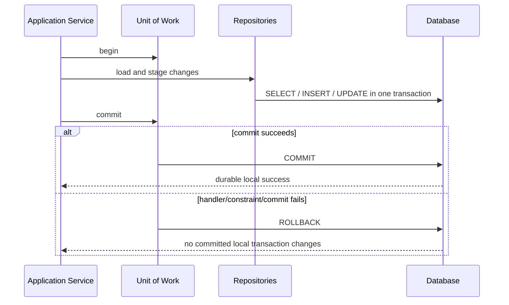
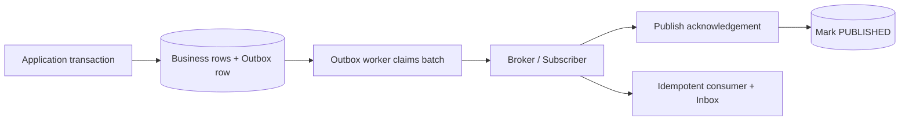
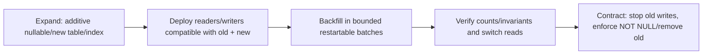
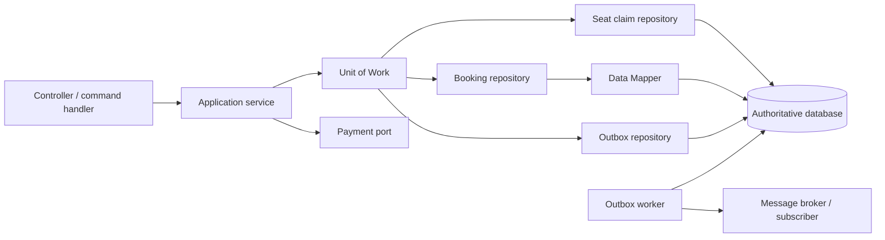

# Topic 12 - Persistence and Transaction Boundaries

[Curriculum index](../README.md) | [Preparation roadmap](../roadmap.md) |
[Previous topic](./11-concurrency-and-thread-safety.md) |
[Next topic](./13-clean-code-and-refactoring.md)

- **Category:** Durable state, integrity, atomicity, and recovery
- **Difficulty:** Advanced
- **Priority:** Essential
- **Prerequisites:** Topics 3 and 9-11; Topics 2 and 5 recommended
- **Running example:** SQLite-backed Movie Ticket Booking repositories, atomic
  seat claims, optimistic booking updates, durable idempotency, and outbox events
- **Output:** A persistence design whose schema, mappings, transactions,
  constraints, conflicts, migrations, and external-effect recovery preserve the
  domain contract across processes and crashes

## Outcome

After completing this topic, you should be able to:

- Decide which state must be durable and which store is authoritative.
- Translate domain aggregates/value objects into normalized persistence records
  without leaking storage concerns inward.
- Design aggregate-oriented Repository implementations on one Unit of Work
  connection/transaction.
- Define explicit transaction begin, commit, rollback, cleanup, nesting, and
  failure behavior.
- Explain atomicity, consistency, isolation, and durability without overstating
  what a database or local transaction guarantees.
- Enforce invariants with primary keys, foreign keys, unique, not-null, check,
  and database-specific range/exclusion mechanisms where appropriate.
- Prefer authoritative constraints/conditional writes over application-only
  check-then-insert logic.
- Recognize dirty read, non-repeatable read, phantom, lost update, write skew,
  and serialization conflict scenarios.
- Choose isolation/locking/constraint techniques based on the anomaly that would
  violate the invariant.
- Implement optimistic locking with an atomic version predicate and precise
  conflict behavior.
- Explain pessimistic row/range locking and why support/semantics are database-
  specific.
- Model exact money, time, enum, child identity/order, tenant, and schema version
  at persistence boundaries.
- Implement durable idempotency ownership and recovery rather than an in-memory
  retry cache.
- Use a transactional outbox to close the database-commit/event-publication
  crash gap, while preserving at-least-once and consumer-idempotency honesty.
- Use an inbox/processed-message record to deduplicate message handling under a
  local transaction.
- Coordinate external payment/hardware effects without holding long database
  transactions or claiming remote rollback.
- Design migrations with expand, backfill, switch, and contract stages that
  support rolling code versions and restartable work.
- Treat query plans/indexes, connection/pool lifetime, lazy loading, and N+1
  behavior as observable persistence design concerns.
- Test Repository/UoW parity, schema constraints, rollback, conflicts, isolation,
  migrations, outbox/inbox, and recovery against a real database implementation.

## Core idea

Persistence design answers three separate questions:

```text
Representation: How is domain meaning stored and reconstructed exactly?
Integrity:      Which authority prevents invalid durable states under races?
Atomicity:      Which reads/writes become durable together, and what is outside?
```

For every write use case, build this ledger:

```text
Authoritative store:
Rows/aggregates read:
Rows/aggregates written:
Constraint(s) enforcing invariants:
Transaction begin and commit point:
Isolation anomaly that could break correctness:
Optimistic/pessimistic conflict behavior:
Domain events/outbox rows written:
External effects before/after transaction:
Idempotency/reconciliation state:
Rollback and crash recovery:
Migration/version compatibility:
```

> A transaction protects only the resources enlisted in that transaction. A
> local database rollback cannot uncharge a payment provider, undispense cash,
> unsend an email, or coordinate a second independent database automatically.

## Scope boundary

This topic deeply covers:

- durable source-of-truth and persistence-model decisions;
- relational schema/constraint design for LLD examples;
- Data Mapper, Repository, Identity Map, and Unit of Work implementation;
- explicit transaction lifecycle and connection ownership;
- ACID vocabulary and isolation anomalies;
- optimistic versioning, pessimistic locking concepts, atomic conditional
  writes, and conflict translation;
- exact mapping of money, time, enums, children, tenants, and versions;
- durable idempotency records;
- transactional outbox and inbox/deduplication patterns;
- external-effect ordering, compensation, and reconciliation;
- schema/data migrations and rolling compatibility;
- query projections, indexes, lazy loading, N+1, caching, and deletion/audit
  trade-offs;
- real persistence contract, migration, failure, and recovery testing.

It does not deeply cover:

- database administration, capacity planning, replication, backup products,
  sharding, consensus, or disaster-recovery infrastructure;
- complete vendor-specific SQL syntax/lock matrices/query optimizers;
- distributed transactions/two-phase commit, sagas, workflow engines, event
  sourcing, or CQRS infrastructure in full;
- security/compliance law, encryption/key management, or data-governance policy;
- ORM/framework selection and configuration;
- broad clean-code/refactoring technique; Topic 13 covers it;
- full testing architecture and tooling; Topic 14 covers it.

SQLite examples use Python's standard `sqlite3` module so they can run without
third-party packages. SQLite is used to teach real constraints/transactions, not
as a claim that its concurrency, types, DDL, isolation, row-locking, or migration
behavior matches PostgreSQL/MySQL/another production database. Verify every
chosen database's documented semantics before relying on them.

## 1. Learn

### 1.1 Persistence is a semantic boundary

Persistence is not “replace the dictionary with SQL.” It changes:

- object identity versus row identity;
- missing/duplicate/conflict behavior;
- transaction visibility and failure;
- concurrency across processes;
- representation precision and schema compatibility;
- lazy/eager loading and query performance;
- restart/crash recovery;
- event/idempotency durability;
- deletion, audit, and retention behavior.

Keep these observable semantics in Repository/UoW contracts and tests.

### 1.2 Durable versus reconstructable state

Classify each value:

| State | Usually durable? | Reason |
|---|---:|---|
| Booking/seat ownership/payment status | Yes | business source of truth |
| Idempotency record/provider reference | Yes | retry/crash recovery |
| Domain event/outbox row | Yes when delivery required | close crash gap |
| Search projection/index | Rebuildable | derived from source truth |
| In-process lock/Identity Map | No | transaction/process coordination only |
| Cache entry | Usually no/derived | performance, not authority |
| Request DTO | No | transient input |
| Audit/ledger fact | Yes under policy | historical/accounting truth |

“Can rebuild” still needs an exact source and a recovery procedure.

### 1.3 Name the source of truth

For one invariant, identify one authoritative decision point:

```text
Seat ownership -> seat_claim/show_seat constraint + transaction
Booking version -> booking row conditional update
Provider charge -> provider reference/status plus local reconciliation record
Notification delivery -> outbox state + consumer dedup contract
Read cache -> never authoritative; refresh/invalidate from durable state
```

Two writable “sources of truth” create split-brain unless a synchronization/
conflict protocol exists.

### 1.4 Persistence model versus domain model

Domain model optimizes meaning/invariants. Persistence model optimizes durable
representation, constraints, joins, indexes, evolution, and query execution.

They may differ:

```text
Domain Money(Decimal, Currency) -> amount_minor INTEGER + currency TEXT
Domain BookingStatus enum       -> stable status_code TEXT
Domain seat tuple               -> booking_seats child rows with position
Domain datetime instant         -> canonical UTC ISO text or DB instant type
Domain event object             -> outbox type/version/payload JSON columns
```

A Data Mapper owns the translation.

### 1.5 Aggregate and transaction boundary

An aggregate is a consistency boundary for domain invariants. Often one command
loads/mutates one aggregate in one local transaction. But:

- a use case may atomically touch multiple aggregates/rows when the local
  invariant requires it;
- an aggregate boundary does not guarantee one table;
- a table row is not automatically an aggregate;
- a database transaction may include outbox/idempotency rows too;
- remote effects remain outside.

Choose from invariants, not folder/table count.

### 1.6 Schema starts from invariants and access paths

Before SQL, write:

1. stable identities and tenant scope;
2. relationships/cardinality/ownership;
3. required/optional fields;
4. exact types/units/codes;
5. uniqueness and state/range checks;
6. concurrency conflicts/version;
7. important reads/filter/order;
8. deletion/audit/retention;
9. evolution/backfill needs.

Then choose tables, keys, constraints, and indexes.

### 1.7 A focused SQLite schema

```sql
CREATE TABLE bookings (
    tenant_id TEXT NOT NULL,
    booking_id TEXT NOT NULL,
    user_id TEXT NOT NULL,
    show_id TEXT NOT NULL,
    status_code TEXT NOT NULL
        CHECK (status_code IN ('PENDING_PAYMENT', 'CONFIRMED', 'CANCELLED', 'EXPIRED')),
    amount_minor INTEGER NOT NULL CHECK (amount_minor >= 0),
    currency TEXT NOT NULL CHECK (length(currency) = 3),
    hold_expires_at TEXT,
    payment_reference TEXT,
    version INTEGER NOT NULL CHECK (version >= 0),
    created_at TEXT NOT NULL,
    PRIMARY KEY (tenant_id, booking_id)
);

CREATE TABLE booking_seats (
    tenant_id TEXT NOT NULL,
    booking_id TEXT NOT NULL,
    position INTEGER NOT NULL CHECK (position >= 0),
    seat_id TEXT NOT NULL,
    PRIMARY KEY (tenant_id, booking_id, seat_id),
    UNIQUE (tenant_id, booking_id, position),
    FOREIGN KEY (tenant_id, booking_id)
        REFERENCES bookings (tenant_id, booking_id)
        ON DELETE CASCADE
);

CREATE TABLE seat_claims (
    tenant_id TEXT NOT NULL,
    show_id TEXT NOT NULL,
    seat_id TEXT NOT NULL,
    booking_id TEXT NOT NULL,
    hold_expires_at TEXT NOT NULL,
    PRIMARY KEY (tenant_id, show_id, seat_id),
    FOREIGN KEY (tenant_id, booking_id)
        REFERENCES bookings (tenant_id, booking_id)
        ON DELETE CASCADE
);

CREATE INDEX ix_bookings_user_history
    ON bookings (tenant_id, user_id, created_at DESC, booking_id DESC);
```

The seat-claim primary key is the durable one-owner invariant. Expired-claim
replacement must happen transactionally after verifying expiry/ownership.

### 1.8 Constraints are executable invariants

| Constraint | Protects |
|---|---|
| Primary key | stable row identity/uniqueness |
| Foreign key | referenced owner exists; lifecycle action explicit |
| Unique | business/durable one-owner rule |
| Not null | required durable value |
| Check | local row domain/range/code rule |
| Database-specific exclusion/range | no overlapping reservations where supported |

Application validation gives good errors. Database constraints remain the final
defense against races, other writers, bugs, and imports. Use both, with one
semantic rule and contract tests.

### 1.9 Not every invariant fits one constraint

Cross-row/business rules may require:

- unique/exclusion constraint;
- transactional conditional update/insert;
- row/range/predicate locking under suitable isolation;
- materialized counter plus atomic check/update;
- serializable transaction with retry;
- redesign so ownership becomes one row/key.

Do not assume `CHECK` can query arbitrary other rows; capabilities differ by
database.

### 1.10 Application check is not enough

Unsafe across two processes:

```text
A SELECTs no seat claim
B SELECTs no seat claim
A INSERTs claim
B INSERTs claim
```

The unique key makes one insert win regardless of the earlier stale checks.
Translate the losing constraint violation into `seat_unavailable`, not an
internal server error.

### 1.11 Open SQLite connections deliberately

```python
from pathlib import Path
import sqlite3


def open_sqlite(path: Path) -> sqlite3.Connection:
    connection = sqlite3.connect(path, isolation_level=None)
    connection.row_factory = sqlite3.Row
    connection.execute("PRAGMA foreign_keys = ON")
    return connection
```

`isolation_level=None` lets examples issue explicit `BEGIN`. Foreign-key
enforcement is enabled per connection in SQLite. A connection context manager
commits/rolls back but does not necessarily mean “close”; connection ownership
must close explicitly.

### 1.12 Unit of Work owns connection and transaction

```python
from pathlib import Path
import sqlite3


class SqliteUnitOfWork:
    def __init__(self, path: Path) -> None:
        self._path = path
        self.connection: sqlite3.Connection | None = None
        self._committed = False

    def __enter__(self) -> "SqliteUnitOfWork":
        if self.connection is not None:
            raise RuntimeError("Unit of Work cannot be re-entered")
        self.connection = open_sqlite(self._path)
        self.connection.execute("BEGIN")
        return self

    def commit(self) -> None:
        if self.connection is None:
            raise RuntimeError("Unit of Work is not active")
        if self._committed:
            raise RuntimeError("Unit of Work already committed")
        self.connection.commit()
        self._committed = True

    def __exit__(self, error_type, error, traceback) -> None:
        if self.connection is None:
            return
        try:
            if error is not None or not self._committed:
                self.connection.rollback()
        finally:
            self.connection.close()
            self.connection = None
```

Explicit commit makes accidental success fail safe. A production UoW must define
commit-failure/rollback-failure translation and construct repositories over this
same active connection.

### 1.13 Repository must use the Unit of Work connection

If each Repository opens/commits its own connection, Booking and Show changes
cannot be one transaction. Inject the UoW connection/session:

```text
with uow_factory() as uow:
    booking = BookingRepository(uow.connection).get(...)
    show = ShowRepository(uow.connection).get(...)
    ... domain changes ...
    BookingRepository(uow.connection).save(...)
    ShowRepository(uow.connection).save(...)
    uow.commit()
```

Repository methods stage/execute SQL; the application service owns commit.

### 1.14 A concrete booking record mapper

```python
from dataclasses import dataclass
from datetime import datetime
from decimal import Decimal
import sqlite3


@dataclass(frozen=True, slots=True)
class BookingRecord:
    tenant_id: str
    booking_id: str
    user_id: str
    show_id: str
    status_code: str
    amount_minor: int
    currency: str
    hold_expires_at: str | None
    payment_reference: str | None
    version: int
    created_at: str


@dataclass(frozen=True, slots=True)
class BookingSnapshot:
    tenant_id: str
    booking_id: str
    user_id: str
    show_id: str
    status: str
    amount: Decimal
    currency: str
    hold_expires_at: datetime | None
    payment_reference: str | None
    version: int
    created_at: datetime


class BookingMapper:
    _statuses = frozenset(
        {"PENDING_PAYMENT", "CONFIRMED", "CANCELLED", "EXPIRED"}
    )

    def from_row(self, row: sqlite3.Row) -> BookingSnapshot:
        record = BookingRecord(**dict(row))
        if record.status_code not in self._statuses:
            raise ValueError("unknown persisted booking status")
        created_at = self._instant(record.created_at)
        expires_at = (
            None if record.hold_expires_at is None
            else self._instant(record.hold_expires_at)
        )
        return BookingSnapshot(
            tenant_id=record.tenant_id,
            booking_id=record.booking_id,
            user_id=record.user_id,
            show_id=record.show_id,
            status=record.status_code,
            amount=Decimal(record.amount_minor) / Decimal("100"),
            currency=record.currency,
            hold_expires_at=expires_at,
            payment_reference=record.payment_reference,
            version=record.version,
            created_at=created_at,
        )

    @staticmethod
    def _instant(value: str) -> datetime:
        instant = datetime.fromisoformat(value)
        if instant.tzinfo is None:
            raise ValueError("persisted instant must be timezone-aware")
        return instant
```

Creation and rehydration remain separate; this mapper creates no ID/time/event.

### 1.15 Exact money persistence

Prefer one explicit representation:

- integer minor units plus currency and scale contract; or
- fixed-precision database decimal with enforced precision/scale.

Validate conversion is exact:

```python
from decimal import Decimal


def to_minor_units(amount: Decimal) -> int:
    scaled = amount * Decimal("100")
    if not amount.is_finite() or scaled != scaled.to_integral_value():
        raise ValueError("amount must have at most two decimal places")
    return int(scaled)
```

Do not store money as binary float or silently truncate extra precision.

### 1.16 Time persistence

Persist instants using the database's real timezone-aware instant type where
available, or one canonical UTC/offset representation with strict mapper tests.

Define:

- timezone awareness and normalization;
- precision/round-trip;
- inclusive/exclusive expiry boundary;
- database/application Clock responsibility;
- created/updated timestamps and source;
- business local date/time separately;
- migration of legacy naive values.

Lexical ordering of text is safe only under a canonical format/offset policy.

### 1.17 Stable enum/status codes

Store explicit stable codes, not Python enum ordinal/`auto()` values or class
names. Unknown stored code is data-integrity/compatibility failure unless an
explicit forward-compatible `UNKNOWN` domain behavior is safe.

Changing a code needs a data migration and rolling-code compatibility plan.

### 1.18 Child identity and order

For booking seats:

- child identity is `(tenant_id, booking_id, seat_id)`;
- `position` preserves declared order;
- unique position prevents ambiguous reconstruction;
- foreign key owns lifecycle/cascade decision;
- mapper rejects missing/duplicate/gapped positions according to contract;
- updates should not delete/reinsert children blindly if their identity/history
  matters.

### 1.19 Identity Map belongs to one Unit of Work

Repository `get` should return the same in-memory aggregate instance for the
same `(tenant, type, ID)` inside one UoW. A new UoW loads a fresh instance/
version. This prevents conflicting in-memory copies and supports change/event
tracking.

It is not a global cache and must clear with transaction/session cleanup.

### 1.20 Change tracking choices

Options:

- explicit `repository.save(aggregate, expected_version)`;
- snapshot comparison/unit-of-work tracking;
- domain events/dirty flag;
- ORM session tracking;
- immutable aggregate replacement.

Make the moment/version predicate visible. Hidden auto-flush can issue SQL at
unexpected query/commit points; understand and test it if using an ORM.

### 1.21 Transaction lifecycle



After a failed commit, do not continue using tracked entities/session as if the
transaction succeeded. Close/discard the UoW and retry from a fresh scope when
semantics allow.

### 1.22 ACID precisely

- **Atomicity:** transaction writes commit together or none become committed.
- **Consistency:** transactions/constraints/application rules move durable state
  between valid states; the database does not invent domain correctness.
- **Isolation:** concurrent transactions observe/interact under a defined model,
  preventing some anomalies depending on level/database.
- **Durability:** committed data survives failures promised by the database/
  configuration; not every downstream effect/cache/replica is included.

ACID says nothing automatic about a payment provider plus database plus broker.

### 1.23 Keep transaction scope cohesive and short

Inside:

- reads needed for the local invariant;
- constraint-enforced inserts/conditional updates;
- related aggregate rows;
- durable idempotency/outbox/inbox records;
- audit/ledger rows required atomically.

Usually outside:

- slow provider/network call;
- email/message publication (outbox row is inside);
- user input/wait;
- large report computation;
- callbacks;
- retry backoff.

Long transactions hold locks/versions/connections and increase contention/
failure scope.

### 1.24 Nested transactions and savepoints

Define whether nested application operations:

- join the outer transaction;
- are forbidden;
- use a savepoint for partial rollback;
- open an independent transaction intentionally.

A savepoint rollback does not undo work already committed in an independent
transaction or external system. An inner `commit()` may commit the entire outer
transaction depending on framework; do not guess.

### 1.25 Commit is a failure point

The handler can run successfully and commit can still fail due to:

- uniqueness/check/foreign-key conflict;
- optimistic version conflict;
- serialization/deadlock victim;
- connection loss/storage failure;
- deferred constraint;
- timeout/cancellation.

Map known conflicts, discard UoW state, and decide retry from semantics. A lost
commit acknowledgment can create an unknown database outcome; idempotency/status
lookup may be needed.

### 1.26 Rollback is not business compensation

Rollback erases uncommitted writes in the same local transaction. Compensation
is a new business action that semantically offsets an already committed/external
effect, such as payment reversal or account credit.

Compensation can fail and needs durable intent/status/retry/reconciliation. It
does not restore history as if nothing happened.

### 1.27 Isolation anomalies

| Anomaly | Example |
|---|---|
| Dirty read | sees another transaction's uncommitted booking |
| Non-repeatable read | booking status differs on second read |
| Phantom | second seat-query returns new matching claim rows |
| Lost update | two writers overwrite from one old booking version |
| Write skew | each transaction sees capacity/on-call rule satisfied, combined writes violate it |
| Serialization failure | database rejects an execution that cannot be ordered safely |

Names and guarantees vary by database/isolation. Model the invariant/anomaly,
then verify the selected engine's behavior.

### 1.28 Read committed is not “all races solved”

Under common read-committed behavior, two transactions may both read available
then attempt writes. Constraints, conditional updates, row locks, or stronger
isolation still decide the winner. Re-reading may observe different committed
state.

Do not infer a vendor's precise behavior from the isolation-level name alone.

### 1.29 Repeatable read and phantoms

Repeatable access to existing rows may not protect a predicate such as “no
overlapping reservation exists” from a new row, depending on database/isolation/
locking. Range/predicate locks, exclusion constraints, serializable execution,
or a redesigned ownership row may be required.

### 1.30 Serializable does not mean retry-free

Serializable aims for results equivalent to some serial order, often by locking
or detecting dangerous cycles. Transactions may abort as serialization victims.
Applications need bounded whole-transaction retry for pure/idempotent local work
and must not repeat external effects blindly.

### 1.31 Lost update prevention choices

- atomic arithmetic update (`SET count = count + 1 ...`);
- optimistic version predicate;
- pessimistic row lock then update;
- serializable transaction with retry;
- unique/conditional insert representing ownership;
- single durable partition owner.

Read in one transaction and write later in another is not protection.

### 1.32 Optimistic locking with a version column

```python
import sqlite3


class OptimisticConflict(RuntimeError):
    pass


def confirm_booking(
    connection: sqlite3.Connection,
    tenant_id: str,
    booking_id: str,
    expected_version: int,
    payment_reference: str,
) -> int:
    cursor = connection.execute(
        """
        UPDATE bookings
           SET status_code = 'CONFIRMED',
               payment_reference = ?,
               version = version + 1
         WHERE tenant_id = ?
           AND booking_id = ?
           AND status_code = 'PENDING_PAYMENT'
           AND version = ?
        """,
        (payment_reference, tenant_id, booking_id, expected_version),
    )
    if cursor.rowcount != 1:
        raise OptimisticConflict("booking changed or is not payable")
    return expected_version + 1
```

The comparison and update are one authoritative statement. If the caller needs
not-found versus state/version conflict, perform a safe follow-up read under the
contract; do not weaken the conditional update.

### 1.33 Optimistic retry policy

Retry when:

- work is local/pure/recomputable;
- conflict is expected and rare;
- the whole transaction restarts from fresh state;
- attempts and total deadline are bounded;
- no external effect is repeated.

Expose conflict when caller intent depends on the exact prior version or
contention persists.

### 1.34 Pessimistic locking

Some databases support row locks such as `SELECT ... FOR UPDATE`, with options
for waiting, no-wait, or skipping locked rows. SQLite does not implement that
syntax/row-lock model; its write coordination differs.

Pessimistic locks are useful when conflicts are common and a short transaction
must protect existing rows. They increase blocking/deadlock risk and do not lock
missing predicate ranges automatically under every database/isolation.

### 1.35 Database deadlocks

Even with row locks, two transactions can acquire rows in opposite order.
Use canonical order where possible. The database may abort a victim; translate
and retry the entire transaction under bounded/idempotent policy. Never retry
only the final statement on stale in-memory state.

### 1.36 Atomic seat claims with constraints

```python
from datetime import datetime
import sqlite3


class SeatUnavailable(RuntimeError):
    pass


def claim_seat(
    connection: sqlite3.Connection,
    tenant_id: str,
    show_id: str,
    seat_id: str,
    booking_id: str,
    expires_at: datetime,
) -> None:
    try:
        connection.execute(
            """
            INSERT INTO seat_claims (
                tenant_id, show_id, seat_id, booking_id, hold_expires_at
            ) VALUES (?, ?, ?, ?, ?)
            """,
            (
                tenant_id,
                show_id,
                seat_id,
                booking_id,
                expires_at.isoformat(),
            ),
        )
    except sqlite3.IntegrityError as error:
        raise SeatUnavailable("seat already has a durable claim") from error
```

Catch at the exact statement whose expected constraint meaning is known. Do not
map every `IntegrityError` globally to seat-unavailable; it might be a foreign-
key, check, or unrelated data bug.

### 1.37 Multi-seat all-or-none claim

Within one transaction:

1. insert Booking row;
2. insert each `booking_seats` row;
3. insert each `seat_claims` row;
4. if any constraint fails, roll back the entire transaction;
5. translate the exact claim conflict;
6. commit once.

No compensating deletes are needed for uncommitted local inserts. Tests must
prove a failed third seat leaves no Booking/child/claim rows.

### 1.38 Expired claim replacement

Avoid “delete every expired claim then insert” without ownership/time policy.
In one transaction:

- capture authoritative `now` policy;
- read/delete only claim whose deadline is expired and/or whose booking state
  permits release;
- insert new owner under unique key;
- update old booking expiry/event if required;
- commit together.

Concurrent confirm/expiry must be serialized by conditional state/version/
locking, not wall-clock checks in separate transactions.

### 1.39 Overlapping date ranges

Hotel rule “one room has no overlapping blocking bookings” is a predicate across
date ranges. Options include:

- database-specific range/exclusion constraint;
- serializable transaction/predicate locking;
- one row per room-night with unique `(room_id, date)` claims;
- serialized room owner/partition.

Application `SELECT overlaps` then `INSERT` is race-prone under insufficient
isolation. State the production database-specific mechanism.

### 1.40 Transactional idempotency table

```sql
CREATE TABLE idempotency_records (
    tenant_id TEXT NOT NULL,
    actor_id TEXT NOT NULL,
    operation_name TEXT NOT NULL,
    idempotency_key TEXT NOT NULL,
    fingerprint TEXT NOT NULL,
    state_code TEXT NOT NULL
        CHECK (state_code IN ('IN_PROGRESS', 'SUCCEEDED', 'FAILED_FINAL', 'UNKNOWN')),
    result_json TEXT,
    resource_id TEXT,
    provider_reference TEXT,
    created_at TEXT NOT NULL,
    updated_at TEXT NOT NULL,
    PRIMARY KEY (tenant_id, actor_id, operation_name, idempotency_key)
);
```

Atomic insert makes one durable owner across processes. Same key requires
fingerprint comparison and state handling. Lease/recovery needs attempt/fencing
identity so a stale owner cannot finalize after takeover.

### 1.41 Idempotency and business write transaction

Where possible, store local business outcome and `SUCCEEDED` idempotency result
in the same database transaction. Then a lost response can replay after restart.

For remote payment:

- reserve durable `IN_PROGRESS` locally;
- commit/release transaction;
- call provider with stable key;
- start fresh transaction to finalize `SUCCEEDED` or `UNKNOWN` under attempt
  identity;
- reconcile ambiguous/provider-success-local-failure cases.

Do not hold one database transaction open across the provider call.

### 1.42 Domain event crash gap

Without outbox:

```text
Option A: publish event -> database commit fails
          subscriber acts on state that never committed

Option B: database commit succeeds -> process crashes before publish
          committed state has no event delivery
```

A transactional outbox stores the event record with the state change.

### 1.43 Transactional outbox schema

```sql
CREATE TABLE outbox_events (
    event_id TEXT PRIMARY KEY,
    aggregate_type TEXT NOT NULL,
    aggregate_id TEXT NOT NULL,
    aggregate_version INTEGER NOT NULL,
    event_type TEXT NOT NULL,
    event_version INTEGER NOT NULL,
    payload_json TEXT NOT NULL,
    occurred_at TEXT NOT NULL,
    status_code TEXT NOT NULL
        CHECK (status_code IN ('PENDING', 'IN_FLIGHT', 'PUBLISHED')),
    attempt_count INTEGER NOT NULL DEFAULT 0 CHECK (attempt_count >= 0),
    available_at TEXT NOT NULL,
    claimed_by TEXT,
    claim_token TEXT,
    claimed_until TEXT,
    published_at TEXT,
    UNIQUE (aggregate_type, aggregate_id, aggregate_version, event_type)
);

CREATE INDEX ix_outbox_pending
    ON outbox_events (status_code, available_at, occurred_at, event_id);
```

The uniqueness rule depends on event semantics; multiple distinct event types/
events at one aggregate version may require event ID/sequence instead.

### 1.44 Outbox flow



If the worker publishes then crashes before marking published, it will publish
again. The contract is normally at-least-once; consumers deduplicate/behave
idempotently. Do not claim exactly-once side effects.

### 1.45 Outbox claim ownership

Multiple workers need an atomic claim protocol using database-supported row
locking/conditional update/lease. Store worker/claim token and deadline. Every
mark/retry must require the current token; expired stale workers cannot overwrite
a new claim.

Exact SQL is database-specific. A plain `SELECT pending` followed by independent
`UPDATE` lets workers publish the same rows concurrently even before crash
replay.

### 1.46 Outbox ordering and poison events

Define:

- global versus per-aggregate ordering;
- batch/order tie-breaker;
- retry/backoff/maximum attempts;
- poison/dead-letter/operator workflow;
- whether later aggregate events may pass a failed earlier event;
- event version/schema compatibility;
- retention/archive after publication;
- shutdown/reclaim of in-flight claims.

Per-aggregate sequence/version helps consumers detect gaps/out-of-order events.

### 1.47 Inbox/processed-message deduplication

```sql
CREATE TABLE inbox_messages (
    consumer_name TEXT NOT NULL,
    message_id TEXT NOT NULL,
    processed_at TEXT NOT NULL,
    outcome_code TEXT NOT NULL,
    PRIMARY KEY (consumer_name, message_id)
);
```

In one local transaction:

1. insert inbox identity (or atomically detect existing);
2. apply idempotent/domain changes;
3. write any outbox events;
4. commit;
5. acknowledge input message after commit.

If acknowledgement is lost, redelivery finds the inbox record. The inbox does
not make arbitrary external subscriber effects exactly once.

### 1.48 External effects and local transactions

Three common orderings:

| Order | Gap |
|---|---|
| Remote effect then local commit | effect succeeds, local commit fails |
| Local commit then remote effect | local state commits, remote effect fails |
| Hold DB transaction during remote call | long locks plus still no atomic remote commit |

Use durable workflow states, idempotency keys, provider references, outbox/
commands, compensation, and reconciliation. Pick order from business risk.

### 1.49 Payment state machine for recovery

```text
READY -> IN_PROGRESS -> SUCCEEDED
                     -> DECLINED
                     -> UNKNOWN -> SUCCEEDED/DECLINED after reconciliation
SUCCEEDED + local finalization missing -> REPAIR_REQUIRED -> finalized
```

Persist attempt ID, logical/provider key, amount/currency, provider reference,
state, timestamps, and last safe error. A new process must resume without the old
memory/lock.

### 1.50 Compensation as durable command/fact

If refund/reversal is required:

- record compensation intent with stable ID/key;
- commit intent/state;
- execute provider command outside transaction;
- record success/unknown/failure;
- retry/reconcile idempotently;
- keep audit of original and compensating facts.

Do not catch an error, attempt one in-memory refund, and forget failed
compensation after restart.

### 1.51 Query Service and write model

Read-heavy history/search may use SQL projections directly instead of hydrating
aggregates. Keep:

- authorization/tenant filters;
- stable total order/cursor contract;
- exact DTO mapping;
- transaction/snapshot semantics;
- index support;
- no mutation through the read model;
- declared replication/projection staleness if separate.

This is application read separation, not automatically full CQRS.

### 1.52 Indexes implement access-path assumptions

Indexes influence observable latency/lock duration and constraint enforcement.
For each important query, record:

- equality prefix and range/order columns;
- tenant/authorization leading scope;
- selectivity/cardinality;
- total-order tie-breaker;
- write/storage cost;
- unique versus non-unique role;
- query-plan evidence on representative data.

Too many indexes slow writes/migrations; missing indexes make transactions hold
resources longer.

### 1.53 Avoid N+1 queries

N+1 occurs when loading a list triggers one parent query plus one child query per
item. Fix with:

- explicit join/batch load;
- query projection;
- eager load for known use case;
- repository method returning aggregate batch under defined limits.

Do not globally eager-load every relationship. Test query count/shape for
important paths.

### 1.54 Lazy loading and transaction scope

A live ORM entity returned after UoW closes may lazy-load and fail or open hidden
I/O during serialization. Map to immutable result DTO while the session/scope is
active. Domain methods should not unexpectedly trigger database queries.

### 1.55 Connection/pool ownership

Define:

- pool/application lifetime;
- one connection/session per UoW;
- transaction begins/ends before release;
- rollback/reset after error;
- maximum pool size and acquisition deadline;
- connection health/retry;
- no connection shared concurrently unless driver explicitly supports/protocol
  requires it;
- clean shutdown.

Pool exhaustion is backpressure, not a reason to create unbounded connections.

### 1.56 Caches are not transactions

Cache decisions:

- key includes tenant/version dimensions;
- source of truth and invalidation/update order;
- TTL/staleness contract;
- negative caching;
- stampede/single-flight;
- serialization/schema version;
- never use cache availability to authorize/claim durable ownership.

Transaction commit does not atomically update an independent cache unless a
separate protocol exists. Often invalidate/update after commit via outbox/event.

### 1.57 Delete semantics

Choose:

- hard delete with foreign-key behavior;
- soft delete/status/tombstone;
- anonymization/redaction under policy;
- immutable audit/ledger retention;
- cascade/restrict/set-null;
- uniqueness among active versus all historical rows;
- event/cache/search cleanup;
- restore behavior.

Soft delete adds a predicate to every relevant query/unique rule and is not a
universal safety solution.

### 1.58 Audit versus mutable status

Mutable current rows answer current state. Audit/ledger rows record who/what/
when transitions happened. For money/inventory:

- use stable event/transaction IDs;
- append facts/reversals rather than erasing history where required;
- tie audit record to actor/correlation/idempotency/provider references safely;
- protect order/integrity;
- keep sensitive data minimal.

An audit log is not automatically event sourcing.

### 1.59 Migration categories

- **Schema migration:** tables/columns/constraints/indexes/types.
- **Data migration/backfill:** transform existing rows.
- **Code compatibility migration:** old/new application versions coexist.
- **Event/message migration:** versions/readers/writers evolve.
- **Operational migration:** traffic cutover, monitoring, rollback.

Treat them as one rollout plan, not only a DDL file.

### 1.60 Expand, migrate, contract



The contract phase happens only after old code/data/message writers are gone and
verification proves the new representation complete.

### 1.61 Adding a required column safely

Safer rollout:

1. add nullable column or safe database default;
2. deploy code that writes old and new/understands absence;
3. backfill in bounded idempotent batches;
4. verify no null/invalid rows and monitor;
5. switch reads to new field;
6. add `NOT NULL`/constraint under database-safe rollout;
7. stop/remove old field in later release.

One locking table rewrite/instant `NOT NULL` assumption may be unsafe on large
production data; vendor/version behavior matters.

### 1.62 Rename without breaking rolling versions

Physical rename can break old code. Prefer:

- add new column;
- new code reads new with old fallback and writes both/uses compatibility layer;
- backfill;
- switch readers;
- stop old writers;
- remove old later.

Dual writes can diverge if not one transaction and monitored. Database triggers
or one canonical write path may reduce risk, with their own complexity.

### 1.63 Backfill design

Backfills should be:

- idempotent/restartable;
- bounded batches with stable cursor/key;
- safe under concurrent writes;
- version/predicate conditional so newer data is not overwritten;
- observable by progress/errors/rate;
- throttled to protect normal traffic;
- verified by invariant/count/checksum samples;
- paired with rollback/forward-fix policy.

Offset batching over mutating data can skip/repeat; keyset by stable primary key
is often safer.

### 1.64 Migration rollback reality

Application rollback may be incompatible after new data is written. Prefer
forward-compatible expands and forward fixes. Before deploy, answer:

- Can old code read rows written by new code?
- Can old code tolerate new enum/status/event versions?
- Will rollback lose new fields/meaning?
- Are destructive changes reversible from backup/dual representation?
- What is the point of no return?

### 1.65 Data repair and quarantine

When mapper finds corrupt/unknown data:

- do not silently default to a valid business state;
- classify data-integrity/compatibility error;
- stop or quarantine affected record/work item;
- retain safe diagnostics/identity;
- repair with audited, idempotent migration/tooling;
- verify invariants afterward.

User validation cannot fix already-corrupt durable rows automatically.

### 1.66 Persistence boundary matrix

| Concern | Mapper | Repository | UoW | Schema/DB | Application |
|---|---|---|---|---|---|
| Type/representation | owns | uses | - | stores/types | stable values |
| Aggregate query | - | owns | shares connection | executes/indexes | requests use case |
| Commit/rollback | - | never owns | owns | performs | chooses success boundary |
| Missing/duplicate | translates | contract | - | constraint/result | semantic mapping |
| Optimistic version | maps | conditional save | transaction | atomic predicate | retry/conflict policy |
| Invariant constraint | validates mapping | maps violation | rollback | authoritative | domain rule/error |
| Events | maps payload | may collect | writes outbox | atomic rows | timing/dispatch policy |
| External effect | - | - | cannot include | cannot roll back remote | workflow/reconcile |
| Migration | supports versions | supports reads/writes | - | schema/data | rollout compatibility |

Every boundary has one job; correctness comes from their composition.

## 2. Recognize

### 2.1 Requirement signals

Persistence becomes a first-class design concern when requirements mention:

- restart/crash survival, audit, history, recovery, or reconciliation;
- more than one process, worker, service instance, or administrator writing;
- unique ownership such as one seat, coupon, username, or request key;
- all-or-none changes across several records;
- concurrent edits, versions, approvals, balances, or inventory;
- retries from clients, queues, providers, or scheduled jobs;
- events/messages that must not disappear after a successful write;
- payment, hardware, email, or another effect outside the database;
- search/filter/sort/pagination/reporting at meaningful scale;
- schema evolution while old and new application versions coexist;
- legal/business retention, reversal, or deletion semantics.

These signals do not prescribe an ORM or database. They require explicit source-
of-truth, integrity, transaction, recovery, and evolution decisions.

### 2.2 Persistence design smells

Investigate when you see:

- process dictionaries described as durable or multi-instance safe;
- `exists()` followed by `insert()` as the only uniqueness protection;
- a repository method that commits independently inside a larger use case;
- one use case opening several unrelated database connections;
- business entities importing SQL/ORM session details;
- floating-point money or locale-dependent time strings;
- broad `except IntegrityError` translated into one business conflict;
- network/provider calls while a database transaction or row lock stays open;
- database commit followed by direct event publication with no durable bridge;
- an idempotency cache that disappears on restart;
- automatic retry around code that charges, emails, or dispenses;
- lazy-loaded entities returned after their session is closed;
- migration scripts that assume an empty database or one application version;
- hard deletes where history/reversal is required;
- indexes chosen by intuition without access paths or query-plan evidence;
- tests that use only mocks/fakes for SQL behavior.

### 2.3 False positives

Do not add durable persistence merely because:

- a small exercise stores objects in memory by design;
- a calculation can be reconstructed cheaply from authoritative input;
- configuration is immutable and shipped with the application;
- a transient view/session/cache may disappear without business loss;
- one isolated interview scope explicitly excludes restart and multiple writers;
- a domain value object needs validation but no identity/history.

Still state the boundary: what is intentionally ephemeral, what would become
authoritative in production, and which later requirement would change the
decision.

### 2.4 Decision questions

Before drawing tables, answer:

1. Which facts must survive restart, and for how long?
2. What is authoritative: database, provider, hardware ledger, event log, or
   another system?
3. What is the aggregate/consistency boundary for each command?
4. Which invariant must remain true under concurrent writers?
5. Can a primary key, unique/check/foreign-key, or range constraint enforce it?
6. Which rows are read and written in one transaction?
7. What anomaly can break the invariant at the chosen isolation level?
8. Should contention wait, fail fast, or produce an optimistic conflict/retry?
9. Which effects are outside the local transaction?
10. What durable attempt/key/state allows retry and recovery?
11. Which events/messages must be atomically recorded with the business write?
12. What do old and new application versions read/write during migration?
13. Which access paths need projections and indexes?
14. How will tests prove constraints, rollback, concurrency, restart, and
    migration compatibility against the real engine?

## 3. Model

### 3.1 Running example: pressure inventory

For Movie Ticket Booking, capture these pressures before implementation:

- bookings and seat ownership survive process restart;
- two processes may attempt the same seat;
- a booking may contain several seats and must claim all or none;
- retries reuse an idempotency key but cannot reuse it for different input;
- payment is remote and may return success, failure, timeout, or unknown;
- a confirmed/cancelled booking publishes events without a commit/publish gap;
- listings filter by customer/show/status/time;
- schema changes roll out while older processes may still run.

### 3.2 Persistence context diagram



The application chooses transaction/effect order. Repositories share the Unit
of Work connection. The payment provider and broker are not enlisted in the
local database transaction.

### 3.3 Source-of-truth table

| Fact | Durable? | Authority | Reconstructable? | Retention/recovery |
|---|---:|---|---:|---|
| Booking status/seats/version | Yes | booking database | No | restore/repair |
| Active seat ownership | Yes | unique seat-claim row | Derived partly | rebuild only with verified rules |
| Payment provider outcome | Yes | provider + local attempt record | Reconcile | retain provider reference |
| Pending integration event | Yes | outbox row | From committed fact only if complete | retry/dead-letter |
| Search result | No | query projection/cache | Yes | invalidate/rebuild |
| Request-local entity object | No | Unit of Work identity map | Yes | discard on close |

### 3.4 Aggregate-to-table map

| Aggregate/value | Table/columns | Identity | Load/save rule |
|---|---|---|---|
| Booking root | `bookings` | `booking_id` | one root per repository call |
| Seat order | `booking_seats` | `(booking_id, position)` | ordered child collection |
| Active ownership | `seat_claims` | `(show_id, seat_id)` | unique authoritative claim |
| Money | `amount_minor`, `currency` | value | integer minor units + code |
| Concurrency token | `bookings.version` | root version | compare-and-increment |
| Request identity | `idempotency_records` | scoped key | key + fingerprint + state/result |
| Domain event | `outbox_events` | event ID | same transaction as business write |
| Consumed message | `inbox_messages` | consumer + message ID | same transaction as handler write |

If aggregate data is split across tables, loading and saving still preserves one
domain boundary. A join table does not automatically create a separate aggregate.

### 3.5 Constraint catalogue

For every invariant, name the last authoritative guard:

| Invariant | Application/domain guard | Database guard | Conflict translation |
|---|---|---|---|
| Booking ID unique | ID generation | primary key | duplicate identity/internal |
| One active owner per show/seat | availability feedback | seat-claim primary key | `SeatUnavailable` |
| No duplicate seat in booking | value validation | unique booking/seat | invalid/corrupt command |
| Valid status | transition method | check/reference constraint | data integrity error |
| Positive amount | Money value object | check amount >= 0 | validation/integrity |
| Existing booking for children | aggregate save | foreign key | persistence integrity |
| No lost aggregate edit | expected version | conditional update | `VersionConflict` |
| Idempotency key has one input | fingerprint check | unique scoped key | replay or key conflict |

Application validation gives helpful errors; the database remains the final
multi-writer authority where it can express the invariant.

### 3.6 Transaction/effect matrix

| Use case | Reads | Local writes in one transaction | External effect | Recovery |
|---|---|---|---|---|
| Create hold | show/booking | booking + seats + claims + outbox | none | rollback all |
| Start payment | booking | payment attempt/status | provider charge after commit | query/reconcile attempt |
| Record payment | attempt/booking | outcome + confirmed booking + outbox | none | optimistic conflict policy |
| Cancel | booking/attempt | cancel/release + refund command + outbox | refund worker later | retry/reconcile |
| Consume event | inbox lookup | inbox + handler business writes | downstream via new outbox | duplicate becomes no-op |

Never hide the remote call inside the “writes” column: it cannot participate in
the same local rollback.

### 3.7 Isolation anomaly ledger

| Workflow | Hostile interleaving/anomaly | Broken invariant | Chosen guard |
|---|---|---|---|
| Two seat claims | both check free, both insert | one seat/two owners | unique claim constraint |
| Two booking edits | both read v3, last update wins | accepted change lost | `WHERE version = 3` |
| Capacity limit | each sees count below limit, both insert | capacity exceeded/write skew | counter row lock/serializable/constraint redesign |
| Hotel range | each sees no overlap, both insert | overlapping reservation | range/exclusion constraint or serialized key |
| Expired claim takeover | old owner releases after new claim | new owner deleted | attempt/owner predicate |
| Report paging | inserts move offset pages | duplicate/missing result | stable keyset snapshot/contract |

The chosen isolation name alone is not the model. Show the interleaving and the
specific authoritative predicate/write that prevents it.

### 3.8 Optimistic conflict card

```text
Aggregate: Booking
Token: version integer, starts at 0
Read: entity state + version in the same snapshot/transaction as required
Write: UPDATE ... SET ..., version = version + 1
       WHERE booking_id = ? AND version = ?
Success: exactly one affected row
Conflict: zero rows when identity still exists
Policy: surface conflict by default; bounded retry only after re-read/recompute
Forbidden retry content: payment, email, message publication, cash dispense
```

Distinguish “missing” from “version conflict” only if the public contract needs
it; doing a second lookup has its own timing semantics.

### 3.9 Durable idempotency record

```text
Scope: operation + caller/tenant
Key: client-supplied stable request key
Fingerprint: canonical hash of meaningfully immutable request fields
States: IN_PROGRESS, SUCCEEDED, FAILED_RETRYABLE/terminal as policy requires
Owner/lease: optional for crash takeover
Result: status/resource ID/response reference, not sensitive arbitrary payload
Expiry: only after the source can no longer retry safely
```

Duplicate behavior:

- same key + same fingerprint + succeeded -> replay stored semantic result;
- same key + different fingerprint -> idempotency conflict;
- same key + in progress -> wait/poll/accepted/conflict by contract;
- abandoned/unknown -> lease takeover or reconciliation, never blind replay.

### 3.10 Outbox/inbox catalogue

For every message type record:

| Field | Decision |
|---|---|
| Event/message ID | stable globally or within named producer |
| Aggregate identity/version | supports ordering/dedup/stale detection |
| Type/schema version | explicit compatibility contract |
| Payload | immutable facts, minimal sensitive data |
| Available/attempt time | retry scheduling |
| Claim/lease owner | worker crash recovery |
| Delivery state | pending/leased/published/dead-letter policy |
| Consumer inbox key | `(consumer_name, message_id)` |

Outbox means “event will be retried after commit,” not exactly-once end-to-end.

### 3.11 Query and index card

For each read endpoint write:

```text
Filters and tenant predicate:
Sort order and deterministic tie-breaker:
Projection columns:
Expected cardinality/selectivity:
Pagination cursor:
Candidate composite index in predicate/order order:
Maximum query count (including children):
Transaction/snapshot consistency promised:
Representative-data query-plan evidence:
```

Example: customer booking history ordered by newest creation may use
`(customer_id, created_at DESC, booking_id DESC)`, subject to actual engine and
query-plan evidence.

### 3.12 Migration plan card

```text
Current and target representation:
Old/new reader compatibility:
Old/new writer compatibility:
Expand DDL and lock risk:
Dual-write/compatibility period:
Backfill cursor, batch size, idempotency, throttle:
Verification invariants/counts/samples:
Read switch and monitoring:
Contract preconditions:
Rollback versus forward-fix point:
Backup/repair/quarantine plan:
```

### 3.13 Failure and recovery ledger

| Failure point | Durable state | Retry/recovery action | Duplicate protection |
|---|---|---|---|
| Before transaction | none | retry command | request key |
| Mid-transaction | rolled back | retry whole local unit | constraints/key |
| Commit returns error | outcome may be uncertain | reconnect/read by stable ID/key | idempotency record |
| After commit, before response | business + outbox durable | replay result | idempotency record |
| After payment request timeout | attempt pending/unknown | provider lookup/reconcile | provider key/reference |
| After publish, before outbox ack | event may be delivered | republish | consumer inbox/idempotency |
| Mid-backfill | prior batches durable | restart from stable cursor | conditional/idempotent update |

### 3.14 Persistence decision record

Record decisions interviewers can challenge:

```text
Decision:
Invariant/access pressure:
Alternatives considered:
Chosen database mechanism and documented scope:
Transaction and external-effect boundary:
Conflict/retry/recovery semantics:
Migration/operational consequence:
Tests/evidence:
What would make us revisit it:
```

## 4. Implement

### 4.1 Initialize an explicit schema

Keep schema creation/migrations separate from repository calls. A focused test
helper may execute versioned SQL deliberately:

```python
from sqlite3 import Connection


SCHEMA_V1 = """
CREATE TABLE IF NOT EXISTS schema_migrations (
    version INTEGER PRIMARY KEY,
    name TEXT NOT NULL,
    applied_at TEXT NOT NULL
);

CREATE TABLE bookings (
    booking_id TEXT PRIMARY KEY,
    customer_id TEXT NOT NULL,
    show_id TEXT NOT NULL,
    status TEXT NOT NULL CHECK (status IN ('HELD', 'CONFIRMED', 'CANCELLED')),
    amount_minor INTEGER NOT NULL CHECK (amount_minor >= 0),
    currency TEXT NOT NULL,
    version INTEGER NOT NULL DEFAULT 0 CHECK (version >= 0),
    created_at TEXT NOT NULL
);

CREATE TABLE booking_seats (
    booking_id TEXT NOT NULL REFERENCES bookings(booking_id) ON DELETE CASCADE,
    position INTEGER NOT NULL CHECK (position >= 0),
    seat_id TEXT NOT NULL,
    PRIMARY KEY (booking_id, position),
    UNIQUE (booking_id, seat_id)
);

CREATE TABLE seat_claims (
    show_id TEXT NOT NULL,
    seat_id TEXT NOT NULL,
    booking_id TEXT NOT NULL REFERENCES bookings(booking_id),
    claim_token TEXT NOT NULL,
    expires_at TEXT NOT NULL,
    PRIMARY KEY (show_id, seat_id)
);

CREATE INDEX booking_history_idx
ON bookings(customer_id, created_at DESC, booking_id DESC);
"""


def initialize_schema(connection: Connection) -> None:
    connection.executescript(SCHEMA_V1)
```

Production migrations need a runner/history/checksum/locking policy rather than
running `CREATE TABLE` from every request.

### 4.2 Keep repositories transaction-neutral

A repository must not silently commit a caller-owned transaction:

```python
from dataclasses import dataclass
from sqlite3 import Connection


@dataclass(frozen=True)
class BookingSummary:
    booking_id: str
    status: str
    version: int


class SqliteBookingRepository:
    def __init__(self, connection: Connection) -> None:
        self._connection = connection

    def get_summary(self, booking_id: str) -> BookingSummary | None:
        row = self._connection.execute(
            """
            SELECT booking_id, status, version
            FROM bookings
            WHERE booking_id = ?
            """,
            (booking_id,),
        ).fetchone()
        return None if row is None else BookingSummary(**dict(row))
```

The application Unit of Work owns commit/rollback. This makes booking, claim,
and outbox writes one controllable atomic unit.

### 4.3 Use one Unit of Work connection

```python
from collections.abc import Callable
from sqlite3 import Connection


class BookingUnitOfWork:
    def __init__(self, connection_factory: Callable[[], Connection]) -> None:
        self._connection_factory = connection_factory

    def __enter__(self) -> "BookingUnitOfWork":
        self.connection = self._connection_factory()
        self.connection.execute("BEGIN")
        self.bookings = SqliteBookingRepository(self.connection)
        self.seats = SqliteSeatClaimRepository(self.connection)
        self.outbox = SqliteOutboxRepository(self.connection)
        return self

    def commit(self) -> None:
        self.connection.commit()

    def rollback(self) -> None:
        self.connection.rollback()

    def __exit__(self, exc_type, exc, traceback) -> bool:
        try:
            if exc_type is not None:
                self.rollback()
        finally:
            self.connection.close()
        return False
```

Require explicit `commit()`. Exiting without it rolls back when the connection
closes in this teaching design; a production implementation should explicitly
track committed state and rollback on every uncommitted exit for clarity.

### 4.4 Map whole aggregates deliberately

Repository load order:

1. load the root row;
2. load children with explicit `ORDER BY position`;
3. decode exact money/time/status values;
4. construct value objects through validated persistence constructors/policy;
5. return one aggregate containing its loaded version;
6. retain it in an optional Unit-of-Work-scoped identity map.

Repository save order respects foreign keys and replacement policy. Do not
delete/reinsert children blindly if child identity/audit/event meaning matters.

### 4.5 Insert an aggregate and claims atomically

```python
from dataclasses import dataclass
from datetime import datetime, timezone
import sqlite3


class SeatUnavailable(Exception):
    pass


@dataclass(frozen=True)
class HoldRequest:
    booking_id: str
    customer_id: str
    show_id: str
    seat_ids: tuple[str, ...]
    claim_token: str
    expires_at: datetime


def create_hold(connection: sqlite3.Connection, request: HoldRequest) -> None:
    connection.execute(
        """
        INSERT INTO bookings(
            booking_id, customer_id, show_id, status,
            amount_minor, currency, version, created_at
        ) VALUES (?, ?, ?, 'HELD', 0, 'INR', 0, ?)
        """,
        (
            request.booking_id,
            request.customer_id,
            request.show_id,
            datetime.now(timezone.utc).isoformat(),
        ),
    )
    try:
        for position, seat_id in enumerate(request.seat_ids):
            connection.execute(
                """
                INSERT INTO booking_seats(booking_id, position, seat_id)
                VALUES (?, ?, ?)
                """,
                (request.booking_id, position, seat_id),
            )
            connection.execute(
                """
                INSERT INTO seat_claims(
                    show_id, seat_id, booking_id, claim_token, expires_at
                ) VALUES (?, ?, ?, ?, ?)
                """,
                (
                    request.show_id,
                    seat_id,
                    request.booking_id,
                    request.claim_token,
                    request.expires_at.astimezone(timezone.utc).isoformat(),
                ),
            )
    except sqlite3.IntegrityError as error:
        # Production code inspects documented vendor error code/constraint name.
        raise SeatUnavailable(request.seat_ids) from error
```

The caller's Unit of Work rolls back the already inserted root/children when any
claim conflicts. Do not catch and commit partial success.

### 4.6 Translate only the exact constraint you expect

`IntegrityError` can mean seat conflict, foreign-key failure, invalid status,
or corrupt code. Production adapters should inspect the database's stable error
code and constraint name. Translate only the named seat-claim uniqueness error;
let unexpected integrity failures surface as persistence faults with safe
diagnostics.

String-matching a vendor error message is at best a documented adapter fallback,
not a portable domain contract.

### 4.7 Save with an optimistic version predicate

```python
class VersionConflict(Exception):
    pass


def change_booking_status(
    connection: sqlite3.Connection,
    booking_id: str,
    expected_version: int,
    status: str,
) -> int:
    cursor = connection.execute(
        """
        UPDATE bookings
        SET status = ?, version = version + 1
        WHERE booking_id = ? AND version = ?
        """,
        (status, booking_id, expected_version),
    )
    if cursor.rowcount != 1:
        raise VersionConflict((booking_id, expected_version))
    return expected_version + 1
```

The version check and mutation are one SQL statement. A preceding version check
would recreate check-then-act.

### 4.8 Re-read and recompute on an allowed retry

An optimistic retry wrapper should:

1. begin a fresh bounded attempt;
2. load current aggregate/version;
3. re-run domain decision against current state;
4. attempt conditional save;
5. commit;
6. retry only classified transient/version conflicts under deadline and budget.

Do not reuse a stale mutated entity. Do not include external effects in this
retry loop.

### 4.9 Release only the claim you own

```python
def release_claim(
    connection: sqlite3.Connection,
    show_id: str,
    seat_id: str,
    booking_id: str,
    claim_token: str,
) -> bool:
    cursor = connection.execute(
        """
        DELETE FROM seat_claims
        WHERE show_id = ? AND seat_id = ?
          AND booking_id = ? AND claim_token = ?
        """,
        (show_id, seat_id, booking_id, claim_token),
    )
    return cursor.rowcount == 1
```

The ownership predicate prevents an expired old worker from deleting a newer
claim.

### 4.10 Write domain facts and outbox together

```python
from json import dumps
from uuid import UUID


def confirm_and_record_event(
    connection: sqlite3.Connection,
    booking_id: str,
    expected_version: int,
    event_id: UUID,
) -> None:
    new_version = change_booking_status(
        connection, booking_id, expected_version, "CONFIRMED"
    )
    connection.execute(
        """
        INSERT INTO outbox_events(
            event_id, aggregate_type, aggregate_id, aggregate_version,
            event_type, payload_json, occurred_at, available_at, state
        ) VALUES (?, 'Booking', ?, ?, 'BookingConfirmed', ?, ?, ?, 'PENDING')
        """,
        (
            str(event_id),
            booking_id,
            new_version,
            dumps({"booking_id": booking_id, "version": new_version}),
            datetime.now(timezone.utc).isoformat(),
            datetime.now(timezone.utc).isoformat(),
        ),
    )
```

Call `commit()` only after both writes. Publish from a separate worker after
commit; never publish inside and assume broker rollback.

### 4.11 Claim outbox work with a lease

Worker protocol:

1. in a short transaction, choose eligible pending/expired-lease rows;
2. atomically mark a bounded batch leased with owner and expiry;
3. commit and publish outside the transaction;
4. in a new short transaction, mark published if lease identity still matches;
5. on failure, increment attempts and schedule backoff/dead-letter by policy.

Different databases support different safe claim syntax (`SKIP LOCKED`, update-
returning, compare-and-set). Do not copy one engine's SQL into another blindly.

### 4.12 Make consumers transactional and idempotent

Within the consumer's local database transaction:

1. insert `(consumer_name, message_id)` into inbox;
2. if its unique key already exists, treat as already processed;
3. apply local business changes;
4. write any new local outbox messages;
5. commit;
6. acknowledge broker delivery after commit.

Crash after commit but before acknowledgement causes redelivery, which the inbox
turns into a no-op. This still does not make arbitrary remote effects exactly
once.

### 4.13 Persist idempotency ownership and result

One transaction reserves an absent key with request fingerprint. Business state
and final semantic result should be committed with the idempotency transition
where practical. If the workflow spans an external effect, persist an attempt/
provider key before the call and reconcile unknown outcomes rather than holding
the transaction open.

Do not expire the record while the client/provider may safely retry the same
operation.

### 4.14 Split payment into recoverable phases

```text
Tx A: validate booking, create payment attempt with provider idempotency key,
      mark booking PAYMENT_PENDING, commit
Remote: call provider outside database transaction
Tx B: record SUCCEEDED/FAILED/UNKNOWN using attempt identity and provider ref,
      transition booking if still compatible, write outbox, commit
Recovery: query provider for durable pending/unknown attempts; apply Tx B
```

If cancellation races with payment completion, the state machine defines
whether to reject completion, confirm then refund, or create a durable refund
command. Attempt identity prevents an older completion from updating a newer
attempt.

### 4.15 Keep after-commit behavior honest

An in-process `after_commit` hook is useful for cache invalidation or wake-up,
but the process can crash immediately after commit. Anything that must happen
eventually needs a durable outbox/work record. Hooks should not turn commit into
“database committed but caller sees failure because email failed.”

### 4.16 Build query projections explicitly

```python
def list_customer_bookings(
    connection: sqlite3.Connection,
    customer_id: str,
    before_created_at: str,
    before_booking_id: str,
    limit: int,
) -> list[BookingSummary]:
    rows = connection.execute(
        """
        SELECT booking_id, status, version
        FROM bookings
        WHERE customer_id = ?
          AND (created_at, booking_id) < (?, ?)
        ORDER BY created_at DESC, booking_id DESC
        LIMIT ?
        """,
        (customer_id, before_created_at, before_booking_id, limit),
    ).fetchall()
    return [BookingSummary(**dict(row)) for row in rows]
```

Tuple comparison support and index direction differ by engine. The important
contract is stable ordering, a unique tie-breaker, bounded results, and an index
verified for the concrete database.

### 4.17 Do not leak lazy persistence

Return a loaded aggregate or immutable query DTO, not a live cursor, generator,
ORM proxy, connection, or entity that will issue hidden queries later. If a
caller needs children, make the load shape explicit.

### 4.18 Bound connection ownership

Open late, close deterministically, and never retain a connection on a singleton
repository. A pool lease belongs to one operation/Unit of Work. Roll back and
return/discard it according to driver rules after any error; restore connection-
local settings before reuse.

### 4.19 Run versioned migrations once

A migration runner should:

- acquire one deployment/database migration lock;
- read ordered applied versions and checksums;
- reject missing/changed historical scripts;
- apply the next migration according to engine transactional-DDL semantics;
- record version/name/checksum/time/tool identity;
- stop on failure with actionable diagnostics;
- never infer version merely from “table exists.”

Large online index/constraint/backfill operations may need operational steps
outside one DDL transaction while still being represented in the rollout record.

### 4.20 Make backfills restartable

Use a stable keyset cursor, bounded batch transaction, conditional update, and
checkpoint/metrics. Re-reading a batch after crash must be harmless. Verify old
and new representations before switching reads, and avoid overwriting rows that
new code has already populated.

### 4.21 Clean up in reverse ownership order

Typical command cleanup:

```text
application finishes decision
-> repository writes finish
-> Unit of Work commits or rolls back
-> cursor/resources close
-> connection returns to pool/closes
-> post-commit best-effort wake-up may run
```

If commit outcome is uncertain, cleanup still occurs, but the request result is
resolved through stable identity/idempotency lookup rather than an unsafe blind
retry.

### 4.22 Implementation review checklist

- [ ] Domain code does not import SQL/session/driver concerns.
- [ ] Mappers decode exact types and reject corrupt/unknown durable values.
- [ ] Repository contracts are aggregate-oriented and implementation-neutral.
- [ ] One Unit of Work owns one transaction and its connection/repositories.
- [ ] Repositories never commit a caller-owned transaction.
- [ ] Constraints authoritatively enforce every expressible invariant.
- [ ] Expected constraint violations are translated precisely.
- [ ] Multi-row changes are all-or-none.
- [ ] Version checks are part of the mutation statement.
- [ ] External effects occur outside local transactions with durable attempts.
- [ ] Business writes and required events share the outbox transaction.
- [ ] Consumers use inbox/idempotent state transitions for redelivery.
- [ ] Results/cursors/entities do not outlive their persistence context secretly.
- [ ] Every connection closes/returns safely after success and failure.
- [ ] Queries are bounded, deterministic, projection-focused, and indexed from
  measured access paths.
- [ ] Migrations support old/new readers and writers, restartable backfill, and
  verified contract preconditions.

## 5. Test persistence designs

### 5.1 Test six evidence levels

1. **Domain unit tests:** invariants/transitions without persistence.
2. **Mapper tests:** exact domain-record round trips and corrupt rows.
3. **Repository contract tests:** one behavioral suite against fake and real
   adapters where their contracts should match.
4. **Database integration tests:** real schema, constraints, transactions,
   isolation, SQL, query plans, and migrations.
5. **Workflow recovery tests:** idempotency, outbox/inbox, provider unknown,
   process/restart boundaries.
6. **Production-engine tests:** vendor version/configuration and concurrency
   semantics that SQLite cannot represent.

Mocks can verify collaboration. They cannot prove a unique constraint, SQL
predicate, isolation outcome, driver error code, or migration behavior.

### 5.2 Use a fresh real database fixture

For SQLite integration tests:

- use a temporary file when separate connections/concurrency matter;
- open every connection with `PRAGMA foreign_keys = ON`;
- choose explicit autocommit/isolation settings;
- apply the same ordered migrations as the application;
- begin/commit/rollback in the code under test;
- close all connections before deleting the temporary directory;
- avoid sharing one connection across threads unless the driver contract and
  test intentionally permit it.

`":memory:"` normally creates a database per connection, so it can accidentally
hide multi-connection behavior.

### 5.3 Share a repository contract suite

Given a repository factory, verify for both fake and SQLite implementations:

- missing identity behavior;
- add then get preserves all domain meaning;
- duplicate identity behavior;
- ordered children and exact money/time/status round-trip;
- save/update and expected version semantics;
- remove/delete/archival contract;
- returned values do not leak mutable stored state;
- Unit of Work visibility before and after commit/rollback.

A fake may not emulate SQL isolation or constraint error ordering. Add real-
database-only tests rather than making the fake pretend to be a database.

### 5.4 Test mapper round trips and corrupt data

Round-trip representative and boundary values:

- zero/large money and supported currencies;
- UTC timestamps with precision policy and DST-originating instants;
- every stable status code;
- empty/minimum/maximum allowed child collections;
- child order and identities;
- optional fields and legacy schema versions.

Insert malformed/unknown rows directly and assert the mapper raises a classified
data-integrity/compatibility error rather than inventing a valid domain default.

### 5.5 Prove constraints directly

Attempt writes that violate each named constraint:

- duplicate root identity;
- duplicate `(show_id, seat_id)` claim;
- duplicate seat within one booking;
- missing foreign-key parent;
- unsupported status;
- negative amount/version/position;
- null required field.

Assert the transaction outcome and exact adapter translation. Do not merely test
the same application validation twice.

### 5.6 Prove rollback and visibility

In one transaction insert a booking, two children, claims, and outbox row. Inject
a failure after each step. After rollback from a fresh connection, assert none
are visible. Then prove the success case makes all visible together.

Also test:

- exception before explicit commit;
- repository accidentally used with wrong connection (design should prevent it);
- savepoint behavior only if it is part of the contract;
- connection cleanup after an error.

### 5.7 Treat commit failure as a distinct test

Inject or simulate driver failure at commit, not only before commit. Assert:

- the use case does not report success prematurely;
- cleanup/rollback attempt occurs as supported;
- no direct event/provider effect was assumed reversible;
- an uncertain outcome uses stable request/business identity for lookup;
- a retry cannot create a duplicate business operation.

Some commit outcomes cannot be determined from the failed connection. The test
must validate recovery behavior, not assume failure means rollback.

### 5.8 Test optimistic conflict deterministically

Use two independent connections/Units of Work:

1. both read booking version 0;
2. first updates with expected 0 and commits;
3. second attempts expected 0;
4. assert second gets `VersionConflict` and changes nothing;
5. assert final version is 1 and first state remains;
6. if retry is allowed, prove it re-reads version 1 and recomputes.

Also distinguish a missing row from stale version according to the repository
contract and prove no provider effect occurs twice.

### 5.9 Test isolation with controlled phases

Coordinate two connections at meaningful read/write/commit phases using events
or barriers and bounded deadlines. Capture every worker exception. Assert exact
invariants/final rows, not a database-vendor-specific blocking duration unless
that duration is itself the contract.

SQLite's writer serialization is useful evidence for SQLite only. Run the same
scenario against the selected production engine to validate row/range locks,
deadlock errors, and isolation semantics.

### 5.10 Prove multi-seat all-or-none behavior

Create overlapping requests such as `{A1, A2}` and `{A2, A3}` through separate
connections. Assert:

- at most one request owns `A2`;
- every successful booking owns every requested seat;
- every failed booking owns no requested seat and leaves no root/children/event;
- exact loser error is a seat conflict;
- both operations terminate within a bounded deadline;
- final rows satisfy referential/unique invariants.

### 5.11 Test stale ownership and expiry

Pause an old expiry/release worker, replace an expired claim transactionally with
a new claim token, then resume the old worker. Its conditional delete/update
must affect zero rows. Test wall-clock boundary semantics with injected UTC time,
not arbitrary sleeps.

### 5.12 Test durable idempotency across restart

Use separate application instances/connections against the same database:

- two simultaneous same-key/same-fingerprint calls produce one owner/result;
- same key/different fingerprint conflicts;
- success committed but response lost replays the result;
- in-progress owner crash follows lease/reconciliation policy;
- terminal failure replay is defined;
- expiry/retention cannot permit an unsafe duplicate provider call;
- sensitive response data is not stored accidentally.

### 5.13 Test outbox atomicity and redelivery

Prove:

- business write rollback leaves no outbox row;
- committed business write always has its required outbox row;
- worker crash before publish leaves retriable work;
- crash after publish but before mark-published causes redelivery;
- lease expiry allows safe reclaim and rejects stale acknowledgements;
- attempts/backoff/dead-letter policy works;
- poison event does not block every unrelated aggregate forever;
- aggregate ordering policy is preserved where promised.

### 5.14 Test inbox deduplication

Deliver the same message concurrently and after a simulated restart. Assert one
inbox identity, one local state transition, and one derived outbox event. Inject
a failure after inbox insert but before business write and prove rollback leaves
neither, allowing a later delivery to succeed.

### 5.15 Test external-effect recovery

For payment or cash dispense, inject failure at every boundary:

1. before attempt commit;
2. after attempt commit, before provider call;
3. provider success returned;
4. provider success but response lost;
5. provider timeout/unknown;
6. after outcome write but before client response;
7. cancellation racing with late success;
8. compensation requested, succeeded, failed, or duplicated.

Assert stable provider keys, legal local states, no blind duplicate effect,
reconciliation convergence, and durable compensation ownership.

### 5.16 Test migrations from real old fixtures

For each supported starting version:

- create/apply the actual old schema and representative boundary/corrupt data;
- deploy/apply expand stage;
- prove old and new readers/writers coexist as promised;
- interrupt and restart the backfill;
- write concurrently during backfill;
- verify counts/invariants/checksums/samples;
- switch reads;
- prove contract preconditions reject premature destructive change;
- verify application rollback or document why only forward-fix is safe.

Testing only “latest schema from empty database” misses most migration failures.

### 5.17 Test queries and indexes

Use representative data distribution and assert:

- bounded deterministic ordering and pagination without duplicate/skip under the
  documented snapshot contract;
- tenant/customer predicates cannot leak another scope;
- query count stays within the budget (no N+1);
- projection contains only contract fields;
- the concrete engine's plan uses or deliberately ignores the intended index;
- slow-query threshold/metric is observable.

Avoid brittle assertions on a complete plan string; assert meaningful operators/
scan behavior appropriate to the chosen engine/version.

### 5.18 Test resource ownership

Instrument connection/cursor/pool adapters to prove:

- success, validation error, SQL error, mapper error, conflict, and cancellation
  all close/return resources exactly once;
- no result iterator/lazy proxy queries after Unit of Work exit;
- a failed transaction is rolled back before a pooled connection is reused;
- pool exhaustion has bounded timeout/error/backpressure;
- connection-local settings are consistently applied.

### 5.19 Persistence review checklist

- [ ] At least one test runs against real schema and driver behavior.
- [ ] Fake and real repositories share the semantic contract where applicable.
- [ ] Mapping round-trips exact values and rejects corrupt durable data.
- [ ] Every authoritative constraint has a direct negative test.
- [ ] Failure at each multi-write step proves full rollback.
- [ ] Commit error and unknown outcome have recovery tests.
- [ ] Two connections force the optimistic/constraint conflict deterministically.
- [ ] Multi-resource writes prove all-or-none ownership.
- [ ] Idempotency survives restart and same-key concurrency.
- [ ] Outbox tests cover both sides of publish/ack crash.
- [ ] Inbox tests cover duplicate delivery and rollback.
- [ ] External-effect tests cover unknown and late outcomes.
- [ ] Migrations begin from old data and support interrupted backfill.
- [ ] Query count, order, pagination, scope, and plan are checked.
- [ ] Connections/cursors/transactions close safely on every path.
- [ ] Production-engine-specific claims are tested on that engine.

## 6. Adapt

### Adaptation A - Move from memory to SQL

Preserve domain/application contracts. Add Data Mapper, SQL Repository, Unit of
Work, migrations, exact type encoding, constraints, and real adapter contract
tests. Replace local IDs/uniqueness only where database authority requires it;
do not spread SQL through entities.

### Adaptation B - Run multiple application processes

Local locks/idempotency dictionaries stop being authoritative. Move unique
ownership to constraints/conditional writes, version mutable aggregates, store
idempotency durably, make workers lease work, and test with separate connections/
processes. Retain local locks only for genuinely local resources/efficiency.

### Adaptation C - Make payment asynchronous

Persist payment attempt and booking `PAYMENT_PENDING`, commit, enqueue via
outbox, and return accepted/pending. A worker calls the provider with stable key;
completion consumer records outcome idempotently. Reads expose pending/unknown,
and reconciliation resolves abandoned attempts.

### Adaptation D - Guarantee eventual event publication

Insert versioned outbox event in the business transaction. Add leased bounded
publisher, retry/backoff, stale-lease recovery, ordering policy, dead-letter/
alerting, consumer inbox, and backlog/age metrics. State at-least-once delivery.

### Adaptation E - Add multi-tenancy

Include tenant in every authoritative identity/unique key, repository/query
predicate, idempotency scope, event, and index as appropriate. Prevent cross-
tenant foreign keys/joins where the engine supports composite enforcement. Add
negative leakage tests and migration/backfill for existing rows.

### Adaptation F - Add hotel date-range reservations

A uniqueness constraint on `(room_id, start_date)` is insufficient. Define
half-open range semantics, then use a database range/exclusion constraint where
supported or serialize on the room/capacity authority with a transaction. Test
touching boundaries, cancellation, concurrent overlaps, and production engine.

### Adaptation G - Add a required column to a large table

Expand with nullable/default-compatible field, deploy compatible writers/readers,
backfill by stable key in bounded idempotent batches, verify, switch reads, and
only then enforce `NOT NULL`/contract. Measure engine-specific lock/rewrite cost.

### Adaptation H - Evolve a persisted enum/status

Use stable stored codes and tolerant rolling-version strategy. Add new value
only when old readers/writers/message consumers will not fail or misinterpret
it; deploy compatibility first, migrate data if needed, then tighten constraint.
Unknown data remains an explicit compatibility error, not a silent default.

### Adaptation I - Add a read projection or replica

Keep command invariants on the authoritative write store. Define projection
lag/staleness, cursor/order, version/watermark, and “read your write” behavior.
Build projection from versioned outbox/events or controlled backfill; make apply
idempotent and reject stale versions.

### Adaptation J - Require deletion and audit

Classify hard delete, soft delete, anonymization, retention, and immutable
ledger needs per data type. Define uniqueness of deleted identities, cascade/
restrict behavior, event/audit record, restoration, and query defaults. Do not
claim a soft-delete flag alone satisfies privacy or audit requirements.

### Adaptation K - Split work across databases/services

A local transaction no longer spans all state. Choose ownership, durable intent,
idempotent commands, outbox/inbox, explicit pending states, compensation, and
reconciliation. Avoid promising immediate global atomicity unless a concrete
supported distributed transaction protocol is deliberately chosen.

### Adaptation L - Handle high contention

Measure conflict/wait/deadlock rates. Consider a serialized owner/counter row,
pessimistic lock, queue/partition, shorter transaction, constraint-based insert,
or bounded optimistic retry. Preserve the invariant and fairness/liveness; do
not merely increase retry counts and amplify load.

## Common mistakes

- Treating persistence as mechanical dictionary replacement.
- Letting table structure dictate a weak/anemic domain model automatically.
- Hiding SQL/ORM sessions inside domain entities.
- Returning ORM proxies/cursors/generators beyond session lifetime.
- Making every repository method commit independently.
- Opening different connections for writes expected to be atomic.
- Catching errors inside a transaction and committing damaged partial state.
- Assuming rollback happens merely because an exception was raised.
- Reporting success before commit completes.
- Assuming a commit error always means nothing committed.
- Confusing local rollback with remote compensation.
- Calling providers, callbacks, or brokers while holding a long DB transaction.
- Retrying an entire transaction that contains non-idempotent external effects.
- Checking availability before insert without a final authoritative guard.
- Treating application validation as a concurrency-safe constraint.
- Translating every integrity violation into the same business error.
- Matching unstable error text without documenting adapter risk.
- Forgetting foreign-key enforcement/configuration in SQLite.
- Using `:memory:` while believing two connections share one database.
- Assuming SQLite concurrency/locking represents the production engine.
- Choosing an isolation level by name without modeling the anomaly.
- Assuming serializable transactions cannot abort/retry.
- Implementing optimistic locking as a separate read then unconditional update.
- Retrying a stale entity without re-reading/recomputing.
- Omitting owner/attempt token from release/finalization predicates.
- Using floating point for durable money.
- Storing local naive timestamps or comparing inconsistent precision.
- Persisting language enum ordinals/names without compatibility strategy.
- Losing child order or replacing meaningful child identity blindly.
- Treating an identity map/cache as durable or globally coherent.
- Publishing events after commit with no outbox.
- Describing outbox delivery as exactly once.
- Marking an outbox row published before broker success.
- Holding DB locks during message publication.
- Omitting lease identity/stale-worker checks.
- Letting one poison event block all future events silently.
- Deduplicating messages outside the business-write transaction.
- Keeping idempotency only in process memory.
- Reusing an idempotency key for a different request without fingerprint check.
- Expiring idempotency records before retries can stop.
- Blindly retrying a provider timeout with a new key.
- Treating compensation as infallible undo rather than durable work.
- Querying one child collection per row (N+1).
- Adding indexes without access paths, selectivity, or plan evidence.
- Ignoring write/storage/migration cost of indexes.
- Using offset pagination while promising stable changing history.
- Sharing one connection across unrelated concurrent operations.
- Leaking failed pooled connections without rollback/reset.
- Running unversioned `CREATE IF NOT EXISTS` as migration history.
- Editing an already-applied migration silently.
- Renaming/dropping a field while old application versions still use it.
- Adding a required column in one risky step on a large table.
- Writing non-restartable offset backfills over mutating data.
- Calling application rollback a database/data rollback plan.
- Testing only mocks/fakes or only an empty latest schema.
- Ignoring corrupt legacy data until production mapping fails.
- Overengineering persistence when durability/multiple writers are out of scope.

## Existing repository examples

The current solution implementations intentionally keep state in process. They
are valuable domain/application examples, but they are not durable persistence
implementations: a fresh `main.py` run builds new dictionaries/objects, and
local locks cannot coordinate another process or survive a crash.

### Movie Ticket Booking

- [`BookingService`](../../solutions/movie-ticket-booking/services/booking_service.py)
  coordinates in-memory booking/payment dictionaries, show state, and payment;
  it has no Repository or shared Unit of Work yet.
- [Preventing double booking](../../solutions/movie-ticket-booking/README.md#11-preventing-double-booking)
  correctly motivates a database transaction/constraint for production.
- [Production evolution](../../solutions/movie-ticket-booking/README.md#19-production-evolution)
  identifies optimistic versioning, outbox, idempotency, and reconciliation as
  the durable next step.

Topic 12 evolves this design toward `bookings`, ordered seats, unique active
claims, expected versions, idempotency records, and outbox rows on one Unit of
Work connection.

### Airline Reservation

[Preventing double booking](../../solutions/airline-reservation/README.md#14-preventing-double-booking)
uses local coordination for the exercise; [production evolution](../../solutions/airline-reservation/README.md#21-production-evolution)
calls for a shared transactional inventory authority. Seat uniqueness, booking
versioning, payment attempts, and events map to the same durable principles.

### Hotel Management

[Concurrent booking safety](../../solutions/hotel-management/README.md#14-concurrent-booking-safety)
exposes the harder overlapping-date invariant. [Production evolution](../../solutions/hotel-management/README.md#21-production-evolution)
mentions database transactions/range or exclusion enforcement and outbox work.
This is the key example where a simple unique column cannot express the domain
rule.

### Food Delivery and Cab Booking

- [Food Delivery production evolution](../../solutions/food-delivery/README.md#23-production-evolution)
  needs durable order/payment/dispatch attempts, idempotency, outbox, and
  reconciliation.
- [Cab Booking production evolution](../../solutions/cab-booking/README.md#23-production-evolution)
  needs durable ride/driver claims, fencing/lease identity, payment recovery,
  and integration events.

Both demonstrate why a provider call and several in-memory repositories are not
one rollback boundary.

### ATM

- [Transfer workflow and atomicity](../../solutions/atm/README.md#17-transfer-workflow-and-atomicity)
  distinguishes multi-account atomic work.
- [Error handling and compensation](../../solutions/atm/README.md#21-error-handling-and-compensation)
  debits before physical dispense and compensates on dispense failure.
- [Concurrency and distributed consistency](../../solutions/atm/README.md#24-concurrency-and-distributed-consistency)
  identifies durable account/hardware/provider ownership limits.

Cash cannot be “rolled back” by a database. Persist attempt/dispense state,
stable transaction identity, device result, reversal command, and reconciliation.

### Splitwise, Library, and Parking Lot

- [Splitwise concurrency and transactions](../../solutions/splitwise/README.md#22-concurrency-and-transactions)
  motivates atomic expense/share/balance updates and version conflicts.
- [Library concurrency considerations](../../solutions/library-management/README.md#21-concurrency-considerations)
  motivates unique copy-loan ownership and durable due/return state.
- [Parking Lot thread safety](../../solutions/parking-lot/README.md#16-thread-safety)
  is process-local; durable ticket/spot/payment state requires database
  constraints and transaction boundaries when the scope expands.

### Honest repository status

At this chapter's creation, the repository contains no database schema,
migration runner, SQL Repository, durable Unit of Work, outbox, inbox, or durable
idempotency implementation. That is intentional: the Bible examples teach the
boundary and provide exercises without pretending the existing in-memory
solutions already satisfy multi-process/crash correctness.

## Practice exercises

### Exercise 1 - Core: persistence-mechanism gate

For each scenario choose the smallest correct mechanism and state its scope:

1. computed route suggestions may disappear on restart;
2. one username across application processes;
3. booking aggregate update must reject a stale editor;
4. one command changes booking, claims, and event atomically;
5. payment succeeds but the client response is lost;
6. event publication must survive process crash after booking commit;
7. the same broker message is redelivered;
8. two hotel reservations overlap a room/date range;
9. ordered booking seats round-trip through storage;
10. customer history pages must be stable and bounded;
11. old/new application versions coexist during a column rename;
12. cash dispense fails after account debit;
13. several Unit-of-Work reads need one in-memory object identity;
14. one query loads 100 bookings then issues 100 child queries;
15. worker dies while owning an outbox batch;
16. a connection errors inside a pooled transaction;
17. a required column is added to millions of existing rows;
18. two processes attempt the same idempotency key;
19. expired seat release races with a new owner;
20. a reporting cache is stale after command commit.

For each identify: durable/reconstructable state, authority, constraint or
protocol, transaction/effect boundary, failure/recovery, and one proof test.

Scoring, 40 points: 2 per scenario. One point for the right mechanism/scope and
one for the decisive boundary/test. Pass: 34/40, with username uniqueness,
stale version, local atomicity, payment unknown, outbox, inbox, overlap,
migration, and stale-owner cases all correct.

### Exercise 2 - Core: anomaly and integrity classification

Classify each and propose one valid fix:

1. both writers see no seat claim, then both create owners;
2. two editors read v4 and one silently overwrites the other;
3. a transaction reads a status twice and sees two values;
4. a range query gains a matching row on its second execution;
5. two doctors each see another doctor on call and both go off call;
6. two transfers lock accounts in opposite order and wait forever;
7. one transaction sees another's uncommitted value;
8. application inserts child whose parent is missing;
9. booking commits but its event is never published after crash;
10. publisher sends then crashes before marking sent;
11. same request key is reused for different payment input;
12. payment returns unknown and code charges again with a new key;
13. old release worker deletes a replacement claim;
14. contract migration drops a column while old writers still use it.

Scoring: 14 points. Pass: 14/14; the anomaly/failure and mechanism must both be
correct. Accept equivalent mechanisms only when their concrete scope and retry/
recovery behavior are stated.

### Exercise 3 - Core: SQLite schema and mapper

Implement SQLite schema and Data Mapper for a booking containing:

- root ID, customer/show, stable status, UTC creation/expiry, version;
- exact Money in minor units/currency;
- ordered, unique seat children;
- foreign-key and check constraints;
- customer-history access index.

Tests must cover every value round-trip, child order, supported boundary values,
duplicate/missing/invalid rows, corrupt status/time/currency, and foreign-key
enforcement on every connection.

Scoring, 24 points:

- 5 schema keys/foreign keys/checks;
- 4 exact money/time/status encoding;
- 3 child identity/order;
- 3 aggregate mapper separation;
- 2 access-path index rationale;
- 5 real SQLite round-trip/corrupt-data tests;
- 2 cleanup/readability.

Pass: 20/24 with exact values, ordered children, foreign keys, corrupt-data
rejection, and no SQL in domain entities mandatory.

### Exercise 4 - Core: Repository and Unit of Work

Build a domain-facing Booking Repository with both in-memory and SQLite adapters,
plus an explicit SQLite Unit of Work. Implement `get`, `add`, and versioned
`save`. The Unit of Work owns one connection, repositories share it, commit is
explicit, and every uncommitted/error path rolls back and closes.

Run one repository contract suite against both adapters and integration-only
tests for transaction visibility, rollback, commit failure/unknown policy, and
connection cleanup.

Scoring, 25 points:

- 4 stable domain-facing contract;
- 5 one-connection Unit of Work ownership;
- 4 explicit commit/rollback/cleanup;
- 3 repository transaction neutrality;
- 3 fake/SQLite semantic parity;
- 4 integration failure/visibility tests;
- 2 communication/types.

Pass: 21/25 with no repository commit, no session leakage, one shared connection,
rollback-on-uncommitted exit, and real database tests mandatory.

### Exercise 5 - Core: atomic multi-seat claims

Implement `create_hold(show_id, seat_ids, ...)` so one booking, ordered children,
all requested claims, and `BookingHeld` outbox event commit together. A conflict
on any seat rolls back everything. Release requires booking and claim token.

Use two independent connections to force overlapping requests and a stale-release
race. Translate only the expected unique claim constraint.

Scoring, 24 points:

- 4 authoritative schema constraint;
- 5 all-or-none transaction;
- 3 ownership-aware release/expiry;
- 3 precise conflict translation;
- 3 outbox atomicity;
- 5 deterministic two-connection tests;
- 1 bounded cleanup.

Pass: 21/24 with one owner, loser owns none, no orphan/event on rollback, stale
release rejection, and bounded termination mandatory.

### Exercise 6 - Core: optimistic locking and isolation

Implement versioned booking update using one conditional SQL statement. Force
two readers of the same version, commit one winner, reject the other, and show a
bounded retry that re-reads/recomputes. Then model one write-skew/capacity case
that versioning a single booking cannot solve and choose a valid database guard.

Scoring, 24 points:

- 5 atomic version predicate/increment;
- 3 exact zero-row conflict behavior;
- 4 deterministic two-connection test;
- 3 fresh re-read/recompute/bounded retry;
- 3 no external effect inside retry;
- 4 write-skew model and valid prevention;
- 2 engine-scope honesty.

Pass: 20/24 with conditional update, deterministic loser, recomputation, and no
external effect retry mandatory.

### Exercise 7 - Core: durable idempotency

Implement scoped durable idempotency for `confirm_booking` with key,
fingerprint, state, attempt/lease, and semantic result. Support same-request
replay, different-request conflict, simultaneous duplicates, crash after commit
before response, and abandoned in-progress recovery.

Scoring, 25 points:

- 4 schema/scope/unique authority;
- 4 canonical fingerprint/conflict;
- 4 atomic owner state machine;
- 3 result replay;
- 3 lease/unknown/recovery policy;
- 5 concurrent restart tests;
- 2 retention/security/observability.

Pass: 22/25 with one durable owner, fingerprint conflict, restart replay, bounded
in-progress policy, and no duplicate business/provider effect mandatory.

### Exercise 8 - Core: outbox and inbox

Create outbox/inbox schema, repositories, a leased publisher, and idempotent
consumer. Business state and outbox commit together; handler state and inbox
commit together. Inject crashes before/after publish and before/after handler
commit.

Scoring, 25 points:

- 4 atomic outbox write;
- 4 lease/claim/stale-worker protocol;
- 3 at-least-once retry/backoff/dead-letter;
- 3 version/order/schema contract;
- 3 inbox atomic deduplication;
- 6 crash/redelivery/concurrency tests;
- 2 metrics/cleanup.

Pass: 22/25 with no commit/publish gap, safe stale lease, redelivery tolerance,
one local handler transition, and honest at-least-once semantics mandatory.

### Exercise 9 - Core: payment recovery workflow

Model and implement booking payment across local transactions and a fake provider
that can return success, decline, timeout-after-charge, duplicate, and delayed
success. Persist stable attempt/provider keys and add reconciliation plus durable
refund/compensation work for cancellation races.

Scoring, 24 points:

- 4 legal durable state machine;
- 4 transaction/remote effect separation;
- 3 stable provider idempotency/attempt identity;
- 4 unknown/late result reconciliation;
- 3 durable compensation/refund;
- 5 failure-boundary/restart tests;
- 1 clear user-visible semantics.

Pass: 21/24 with no long DB transaction around provider, no blind duplicate
charge, unknown state, late-result policy, and retryable compensation mandatory.

### Exercise 10 - Core: migration rollout

Evolve a live `bookings` table from `customer_name` to required `customer_id`
while old/new processes coexist. Deliver versioned expand/backfill/switch/
contract steps, compatibility code, stable-cursor restartable backfill,
verification, observability, and rollback/forward-fix decision.

Scoring, 22 points:

- 4 old/new reader/writer matrix;
- 4 safe expand and later contract;
- 4 idempotent bounded concurrent backfill;
- 3 verification/switch criteria;
- 2 lock/load/throttle awareness;
- 3 old-fixture/interruption tests;
- 2 rollback/point-of-no-return honesty.

Pass: 19/22 with no early drop/rename, safe coexistence, restartable backfill,
verification, and actual old-schema test mandatory.

### Exercise 11 - Query, index, and resource kit

Implement customer booking history and show-seat availability projections with
stable keyset pagination. Define access paths and indexes, enforce a query-count
budget, inspect real query plans, and instrument connection cleanup/pool timeout.

Scoring, 20 points:

- 4 bounded deterministic projection/pagination;
- 3 scope/tenant-safe predicates;
- 3 index rationale and representative plan;
- 3 no N+1/query budget;
- 3 connection/cursor/failed-transaction cleanup;
- 2 pool timeout/backpressure;
- 2 integration tests/readability.

Pass: 17/20 with stable ordering/tie-breaker, no scope leak, bounded query count,
plan evidence, and error-path cleanup mandatory.

### Exercise 12 - Core and timed: durable booking design

In 90 minutes, receive:

> Design Create Hold, Confirm, Cancel, Expire, and List Bookings. Four processes
> may contend for seats. Payment is remote and can time out after charging.
> Every committed status change must eventually reach consumers. Deployments
> cannot stop traffic for schema changes.

Deliver:

- durability/source-of-truth/aggregate/table model;
- schema constraints and exact mappings;
- Repository/Data Mapper/Unit of Work boundaries;
- transaction/effect matrix and isolation anomaly ledger;
- atomic multi-seat and optimistic conflict behavior;
- durable idempotency and payment attempt/reconciliation state;
- transactional outbox/inbox and worker lease policy;
- query projection/index/pagination;
- one expand-migrate-contract change;
- real database, crash, concurrency, and migration test plan;
- explicit production-engine assumptions.

Scoring, 25 points:

- 4 source/schema/invariants;
- 4 repository/UoW/transactions;
- 3 isolation/conflict/seat atomicity;
- 4 idempotency/payment recovery;
- 3 outbox/inbox;
- 2 query/index;
- 2 migration;
- 3 tests/communication.

Pass: 21/25 with unique seat authority, all-or-none transaction, no remote call
inside DB transaction, unknown payment recovery, atomic outbox, and real database
tests mandatory.

### Exercise 13 - Timed change-pressure drill

After Exercise 12, apply in 30 minutes:

> Add tenant isolation, hotel-style date ranges, a read projection that may lag,
> and rename a required field while old workers remain deployed.

Expected changes:

- tenant added to identities, constraints, queries, idempotency, and events;
- half-open date semantics plus production-engine range/serialization guard;
- projection version/watermark, idempotent apply, stated staleness/read-your-write;
- expand/compatibility/backfill/switch/contract rollout;
- old/new reader/writer/message compatibility matrix;
- cross-tenant, overlap, stale projection, and old-fixture migration tests;
- unchanged core booking/payment/outbox guarantees.

Scoring: 14 change-safety points. Pass: 12/14 with no tenant leak, no overlapping
accepted range, explicit projection lag, and rolling-version-safe rename
mandatory.

## Interview self-check

Answer without notes. Questions marked **Core** must be correct.

1. **Core:** Which state should be durable, and what is reconstructable state?
2. **Core:** What does “source of truth” mean?
3. Why should the persistence model differ from the domain model sometimes?
4. **Core:** How are an aggregate boundary and transaction boundary related?
5. What inputs should drive schema design besides object fields?
6. **Core:** Why is application-only check-then-insert unsafe for uniqueness?
7. **Core:** Which common relational constraints enforce invariants?
8. Why can some invariants not be expressed by a simple unique constraint?
9. **Core:** What is a Data Mapper responsible for?
10. What representation rules apply to money, time, enums, and child order?
11. **Core:** What contract should a Repository expose?
12. **Core:** What does a Unit of Work own?
13. Why must repositories in one Unit of Work share a connection/transaction?
14. **Core:** Who should call commit, and why should repositories not hide it?
15. What is an Identity Map, and what is its scope?
16. **Core:** State ACID without overstating it.
17. **Core:** Why should a database transaction stay short?
18. What can go wrong with nested transactions/savepoints?
19. **Core:** Why is commit itself a failure point?
20. **Core:** Distinguish rollback from business compensation.
21. **Core:** Define dirty read, non-repeatable read, and phantom.
22. **Core:** What is a lost update?
23. What is write skew?
24. **Core:** Why does Read Committed not solve every race?
25. What must code expect at Serializable isolation?
26. **Core:** How does optimistic locking work?
27. **Core:** What does zero affected rows mean in a versioned update?
28. Why must an optimistic retry re-read and recompute?
29. **Core:** Why must external effects stay outside optimistic retries?
30. What is pessimistic locking, and why is it database-specific?
31. **Core:** How should database deadlocks be handled?
32. **Core:** How does a unique seat-claim constraint prevent double booking?
33. How do you make a multi-seat hold all-or-none?
34. **Core:** Why must release/finalize include owner or attempt identity?
35. How can overlapping hotel date ranges be protected?
36. **Core:** What makes idempotency durable and concurrency-safe?
37. Why must an idempotency record include a request fingerprint?
38. What should happen to an abandoned `IN_PROGRESS` request?
39. **Core:** What crash gap does a transactional outbox close?
40. **Core:** What guarantee does an outbox provide, and what does it not?
41. Why does an outbox worker need claim/lease identity?
42. How should ordering and poison events be handled?
43. **Core:** What does an inbox/processed-message table do?
44. **Core:** Why can payment not be part of a local database rollback?
45. How should a timeout-after-charge be represented and recovered?
46. **Core:** Why is compensation not guaranteed undo?
47. What should a payment attempt record contain?
48. **Core:** Why are Query Services/projections useful?
49. How should an index be chosen and verified?
50. **Core:** What is the N+1 query problem?
51. Why is lazy loading a transaction/resource-boundary risk?
52. **Core:** What is correct connection/pool ownership?
53. Why is a cache not an integrity/transaction authority?
54. What delete/audit decisions must be explicit?
55. **Core:** Describe expand, migrate, contract.
56. How do you add a required column safely?
57. Why is a direct column rename unsafe during rolling deployment?
58. **Core:** What makes a backfill restartable and safe under live writes?
59. Why may application rollback after a migration be unsafe?
60. **Core:** What should happen when durable data cannot be mapped safely?
61. **Core:** Why are mocks/fakes insufficient for persistence correctness?
62. What must a Repository contract suite prove?
63. **Core:** How do you deterministically test an optimistic conflict?
64. **Core:** How do you test outbox/inbox crash behavior?
65. **Core:** What persistence mechanisms exist in this repository today, and
    what is the honest production boundary?

### Answer guide

1. Durable state is business truth/history needed after restart; reconstructable
   state is safely derivable from an authority and may be discarded/rebuilt.
2. The authority whose accepted value resolves disagreement and on which the
   invariant/recovery decision ultimately relies.
3. Domain objects optimize meaning/behavior/invariants; records optimize durable
   identity, normalization, constraints, queries, compatibility, and migration.
4. One command usually restores one aggregate invariant atomically, so aggregate
   is a default transaction boundary; cross-aggregate invariants require an
   explicit database authority/workflow rather than assuming all aggregates.
5. Invariants, identities/relationships, transaction writes, access paths,
   concurrency/isolation, retention/audit, exact representation, and evolution.
6. Concurrent writers can both observe absence before either insert. A unique
   database constraint/atomic conditional mutation must choose the winner.
7. Primary key, unique, foreign key, not-null, check, and database-specific
   exclusion/range mechanisms, plus atomic conditional statements.
8. They may span rows/ranges/counts or conditional states, such as overlapping
   dates or capacity. Use an appropriate range constraint, serialized authority,
   counter/lock, or isolation mechanism.
9. Convert exact record representations to/from domain aggregates/value objects,
   preserve identity/order/version, and classify incompatible/corrupt data.
10. Integer/decimal exact money plus currency; normalized UTC instant/precision;
    stable status codes; explicit child identity and order column.
11. Domain-oriented aggregate operations and missing/duplicate/conflict semantics,
    independent of SQL/session details and transaction commits.
12. Persistence context/identity map, one connection/transaction, repositories,
    commit/rollback, cleanup, and often collected domain events/outbox writes.
13. Otherwise their writes cannot commit/roll back as one local atomic unit or
    share the intended transaction snapshot/locks.
14. The application/use-case Unit of Work commits after the complete decision;
    hidden repository commits split the atomic business operation.
15. One object instance per durable identity inside one Unit of Work; discard on
    exit, not a global cache or concurrency authority.
16. Atomicity groups local changes; consistency preserves declared rules;
    isolation controls observations/conflicts; durability retains committed data
    under the database guarantee. It does not include arbitrary remote systems.
17. Long transactions hold versions/locks/connections, increase contention,
    deadlocks, abort cost, pool pressure, and stale decisions.
18. Libraries may pretend nesting while committing early; savepoint rollback is
    partial and does not release every lock/effect. Define ownership/propagation.
19. Connection/network/storage failure can occur during commit and outcome can be
    uncertain. Report success only after commit and recover by stable identity.
20. Rollback removes uncommitted enlisted local changes; compensation is a new
    fallible, retryable business action counteracting an already committed/effected
    result.
21. Dirty read sees uncommitted data; non-repeatable read sees one row change
    between reads; phantom sees the result set of a predicate change.
22. Two writers derive from the same old value and a later unconditional write
    silently overwrites the other accepted change.
23. Concurrent transactions read a shared predicate across different rows and
    update disjoint rows so both commits violate the combined invariant.
24. It commonly allows value/predicate changes between statements and lost-update
    patterns unless conditional writes, constraints, locks, or stronger isolation
    protect the exact invariant.
25. Serialization/deadlock aborts are legitimate; classify and retry the entire
    pure local transaction within a bounded budget after fresh reads.
26. Read state plus version, then atomically update only `WHERE version =
    expected` while incrementing it; one writer wins and others conflict.
27. Usually missing identity or stale version. Translate according to the contract,
    possibly using a careful secondary lookup, and do not claim success.
28. Another committed state may make the earlier decision invalid; a retry must
    use the new state/version and bounded policy rather than stale mutations.
29. The database may retry/abort but payment/email/dispense may already occur,
    causing duplicates. Use separate durable attempt/idempotency/reconciliation.
30. The database prevents competing access via row/key/range/table locks until a
    boundary; syntax, scope, gaps, wait/fairness, and isolation differ by engine.
31. Prevent obvious cycles with consistent access/order/short transactions, then
    treat victim abort as a classified bounded whole-transaction retry with fresh
    reads and no repeated remote effect.
32. Both writers may race, but only one insert for `(show_id, seat_id)` can commit;
    the loser gets a precise constraint conflict and rolls back.
33. Insert root, all children/claims, and event in one Unit of Work transaction;
    any conflict raises and rolls back every write before commit.
34. A delayed old worker could delete/finalize a newer owner's state. Conditional
    predicates/fencing reject stale work.
35. Define half-open boundaries; use an exclusion/range constraint where supported
    or serialize operations on a room/capacity authority and test on that engine.
36. A unique durable scoped key atomically selects an owner, stores fingerprint/
    state/result/attempt, and defines duplicate wait/replay/conflict plus crash
    takeover/reconciliation across processes.
37. The same key with different semantic input must conflict, not replay or merge
    an unrelated operation.
38. Use a defined lease/fencing takeover or reconcile durable business/provider
    state. Never wait forever or blindly repeat an unknown external effect.
39. Business commit succeeds but process crashes before direct publication. An
    outbox row in that same transaction leaves durable publish work.
40. Eventual retry with at-least-once delivery under a working publisher; not
    atomic broker delivery, global order, or exactly-once consumer effects.
41. A crashed worker's lease must expire, while its late acknowledgement must not
    mark a newer owner's attempt complete.
42. State per-aggregate/global ordering explicitly, include aggregate version,
    serialize where required, bound retries, and dead-letter/alert poison work
    without silently blocking unrelated progress.
43. It atomically records that a named consumer handled a message alongside its
    local state changes, making redelivery a duplicate no-op.
44. The provider/hardware is not enlisted in the local transaction and may finish
    despite timeout/rollback; model durable phases and reconciliation.
45. Store `UNKNOWN`/pending attempt with stable provider key/reference, query
    provider/webhook/ledger, then idempotently apply the observed outcome.
46. It is a new action that can time out, fail, duplicate, or be impossible; it
    needs identity, durable status, retries, reconciliation, and audit.
47. Attempt ID, booking/operation, amount/currency, provider idempotency key/ref,
    state, timestamps/version, failure/unknown details, and reconciliation data.
48. Reads often need bounded projections, joins, filters, sorting, pagination, and
    staleness semantics without loading/mutating full write aggregates.
49. Derive it from concrete equality/range/order/scope access paths and data
    distribution; inspect representative engine plans and measure reads/writes.
50. Loading N parents and lazily issuing one child query per parent, producing
    unbounded round trips; use explicit join/batch/projection/load strategy.
51. A returned proxy may query after session close, keep transactions open, hide
    N+1 work, or expose inconsistent snapshots. Return fully loaded data/DTOs.
52. One operation/Unit of Work leases a connection, closes cursors, commits or
    rolls back, resets it, and returns/closes it exactly once on every path.
53. It can be stale, evicted, process-local, and non-atomic with the database;
    use it for performance only with explicit invalidation/version/staleness.
54. Hard/soft/anonymize, cascade/restrict, uniqueness after deletion, restoration,
    retention, audit/reversal history, sensitive data, and query default behavior.
55. Add compatible representation first; deploy compatible code and restartable
    backfill/verify/switch; remove/enforce old representation only after every old
    reader/writer is gone.
56. Add nullable/safe default, deploy compatible writes/reads, backfill in bounded
    idempotent batches, verify, switch, then add required constraint later.
57. Old code still references the old physical name. Add new representation and
    compatibility/dual-write/backfill before a later contract removal.
58. Stable keyset cursor, bounded transactions, idempotent conditional writes,
    safe concurrent-writer rule, checkpoints, throttle, metrics, and verification.
59. New code/data/statuses may no longer be readable/writable by old code and
    destructive migration may have crossed a point of no return; use compatible
    expansion and forward-fix planning.
60. Raise a classified integrity/compatibility error, quarantine/stop affected
    work safely, diagnose without leaking data, repair via audited idempotent
    tooling, then verify invariants.
61. They do not execute real SQL/constraints/driver translation/isolation/commit,
    query plans, connection behavior, or migrations; use real database integration
    and production-engine-specific tests.
62. Missing/add/get/save/delete behavior, exact round-trip, identity/order/version,
    duplicate/conflict semantics, mutation isolation, and Unit-of-Work visibility.
63. Two independent connections read the same version; commit one conditional
    update, attempt the other, assert exact conflict/final version/state and bounded
    termination; retry must re-read/recompute.
64. Inject rollback and crash after business commit, before/after publish, before/
    after sent mark, and before/after consumer commit; restart/redeliver and assert
    atomic rows, safe lease, one local effect, and no missing required event.
65. Implementations use in-memory objects/repositories plus process-local locks;
    there is no DB schema/migration/SQL UoW/outbox/inbox/durable idempotency. They
    demonstrate LLD but lose state on restart and cannot enforce multi-process/
    crash correctness without the Topic 12 evolution.

Score at least 56/65 and answer every Core question correctly.

## Quick review checklist

- [ ] I classify durable versus reconstructable state and name its authority.
- [ ] Persistence models do not leak into domain entities.
- [ ] Aggregate, repository, and transaction boundaries are explicit.
- [ ] Every durable invariant maps to an authoritative constraint/protocol.
- [ ] Application validation improves errors but is not claimed as race safety.
- [ ] Money, time, enums, optional fields, identity, order, and versions have
  exact stable representations.
- [ ] Mappers reject rather than silently normalize corrupt durable data.
- [ ] Repository contracts define missing, duplicate, and conflict behavior.
- [ ] One Unit of Work owns the connection, transaction, repositories, and
  cleanup.
- [ ] Repositories do not commit independently.
- [ ] Transaction begin/commit/rollback/nesting/close behavior is explicit.
- [ ] Success is reported only after commit.
- [ ] Unknown commit outcome is recoverable through stable identity/idempotency.
- [ ] Local rollback is never described as remote compensation.
- [ ] Transactions are short and contain no unnecessary provider/callback wait.
- [ ] I can show the dirty/non-repeatable/phantom/lost-update/write-skew
  interleaving relevant to my design.
- [ ] Isolation/locking is chosen for a named anomaly on a named database.
- [ ] Serializable/deadlock/version aborts have bounded whole-transaction retry.
- [ ] Optimistic updates compare and increment version atomically.
- [ ] Optimistic retries re-read/recompute and exclude external effects.
- [ ] Unique ownership uses a database constraint/atomic conditional write.
- [ ] Multi-row/multi-seat operations are all-or-none.
- [ ] Release/finalization predicates include owner/attempt/fencing identity.
- [ ] Constraint translation matches the expected stable code/name precisely.
- [ ] Durable idempotency stores scoped key, request fingerprint, state, owner/
  lease, and result/recovery information.
- [ ] Duplicate same/different/in-progress/abandoned behavior is defined.
- [ ] Required events are inserted into an outbox with the business write.
- [ ] Outbox delivery is honestly at least once.
- [ ] Worker leases, stale acknowledgements, ordering, retry, poison events, and
  dead-letter/alerting behavior are defined.
- [ ] Consumer inbox and business changes share one local transaction.
- [ ] Payment/hardware attempts are durable before remote effects.
- [ ] Timeout/unknown/late success/reconciliation semantics are explicit.
- [ ] Compensation is durable, idempotent, fallible, and observable.
- [ ] Query projections are bounded and do not leak write entities/lazy sessions.
- [ ] Filter/order/tie-breaker/pagination/access path are explicit.
- [ ] Indexes have representative query-plan/measurement evidence.
- [ ] Query-count tests prevent N+1 behavior.
- [ ] Cache staleness/invalidation is explicit and not an integrity authority.
- [ ] Connections/cursors/pool leases close/reset on every success/error path.
- [ ] Delete, history, reversal, audit, and sensitive-data semantics are explicit.
- [ ] Migrations are versioned, ordered, checked, locked, and observable.
- [ ] Rolling old/new readers and writers are compatible during expansion.
- [ ] Backfills are bounded, restartable, idempotent, concurrency-safe, and
  verified.
- [ ] Contract/destructive changes wait for verified preconditions.
- [ ] Rollback versus forward-fix and point of no return are documented.
- [ ] Repository contract tests run against fake and real adapter where useful.
- [ ] Schema/constraint/rollback/commit tests use the real database driver.
- [ ] Two-connection tests deterministically prove conflicts and final state.
- [ ] Idempotency/outbox/inbox tests cross simulated restart/crash boundaries.
- [ ] Migration tests start from actual old schema and data.
- [ ] Production database claims are tested on its version/configuration; SQLite
  results are not generalized.
- [ ] I can identify the current repository's in-memory boundary honestly.
- [ ] The design stays proportional when durability or multiple writers are out
  of interview scope.

## Mastery gate

Topic 12 is complete only when all of the following are true:

- [ ] I score at least 56 out of 65 on the self-check without notes and answer
  every Core question correctly.
- [ ] I score at least 34/40 on the persistence-mechanism gate with all critical
  cases correct.
- [ ] I score 14/14 on the anomaly/integrity classification gate.
- [ ] My SQLite schema/mapper scores at least 20/24 with exact representation,
  ordered children, authoritative constraints, and corrupt-data rejection.
- [ ] My Repository/Unit of Work scores at least 21/25 with one shared connection,
  explicit commit/rollback/cleanup, transaction-neutral repositories, and real
  database tests.
- [ ] My atomic multi-seat design scores at least 21/24 with one authoritative
  winner, loser owns none, no orphan/outbox gap, and stale-release rejection.
- [ ] My optimistic/isolation kit scores at least 20/24 with atomic version
  predicate, deterministic conflict, fresh recomputation, and no repeated effect.
- [ ] My durable idempotency solution scores at least 22/25 with fingerprint,
  ownership/recovery, restart replay, and one business/provider effect.
- [ ] My outbox/inbox solution scores at least 22/25 with atomic writes, safe
  leases, redelivery tolerance, and honest at-least-once semantics.
- [ ] My payment recovery workflow scores at least 21/24 with no remote call
  inside a long transaction, stable key, unknown/late recovery, and compensation.
- [ ] My migration rollout scores at least 19/22 with old/new compatibility,
  restartable backfill, verification, and old-fixture tests.
- [ ] My query/index/resource kit scores at least 17/20 with stable pagination,
  plan evidence, bounded query count, and error-path resource cleanup.
- [ ] I complete the 90-minute durable booking design and score at least 21/25.
- [ ] I complete the 30-minute change-pressure drill and score at least 12/14.
- [ ] At least one real SQLite test proves root, all children/claims, and outbox
  are visible together after commit and absent together after rollback.
- [ ] At least one two-connection test proves one seat winner and no partial loser.
- [ ] At least one stale-version test proves zero-row update becomes a conflict
  and does not overwrite the winner.
- [ ] At least one restart test proves a lost response replays a durable
  idempotent result without repeating the operation.
- [ ] At least one outbox test crashes after publish/before acknowledgement and a
  duplicate consumer delivery creates only one local result.
- [ ] At least one payment test models timeout-after-success and converges by
  reconciliation without a blind second charge.
- [ ] At least one migration test starts from old data, interrupts the backfill,
  restarts it, verifies results, and prevents premature contract.
- [ ] At least one query test proves deterministic keyset order, bounded query
  count, and a meaningful plan/index expectation.
- [ ] Every connection, cursor, transaction, worker, and temporary database is
  closed on success and failure.
- [ ] All original and new tests remain green after persistence changes.

The readiness sentence for this topic is:

> I can classify durable truth, map rich domain aggregates into exact records,
> design constraints and transaction boundaries around concrete invariants and
> isolation anomalies, implement Repository/Data Mapper/Unit of Work adapters
> with correct connection and conflict behavior, use optimistic or pessimistic
> coordination according to the database, preserve multi-row atomicity, bridge
> commit/message and local/remote effect gaps with durable idempotency, outbox,
> inbox, attempts, compensation, and reconciliation, evolve schemas through
> compatible restartable migrations, design measured queries/indexes/resources,
> and prove all of it with real-database, multi-connection, crash, restart, and
> old-data tests without overstating SQLite or exactly-once guarantees.

## Next topic

**Topic 13 - Clean Code and Refactoring** will cover naming and readability,
function/class/module boundaries, code smells, safe behavior-preserving
refactoring, legacy seams, incremental design improvement, complexity control,
and using tests to keep LLD code changeable. Its status is tracked in the
[preparation roadmap](../roadmap.md).
