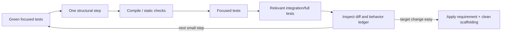
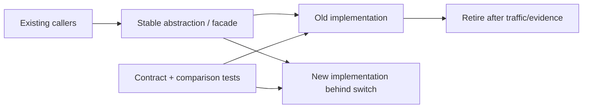
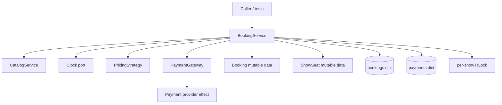
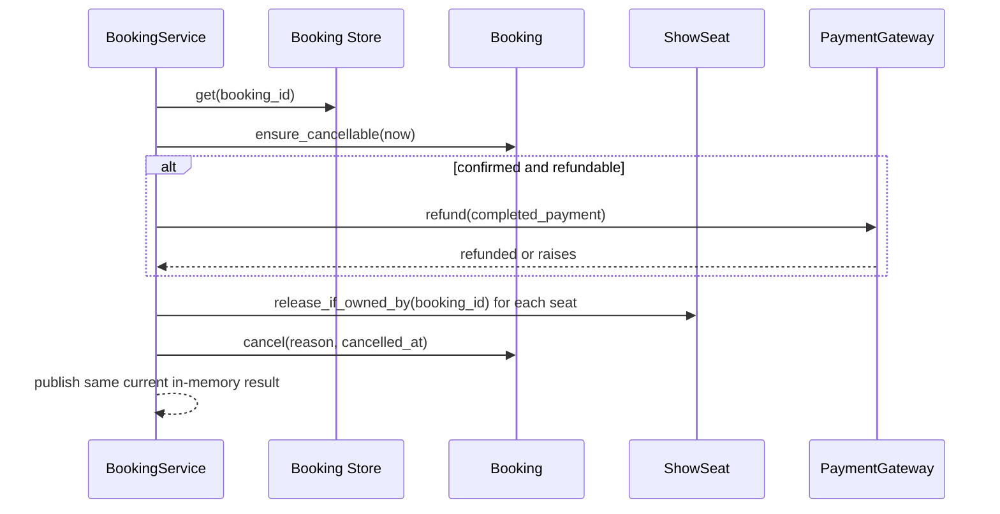

# Topic 13 - Clean Code and Refactoring

[Curriculum index](../README.md) | [Preparation roadmap](../roadmap.md) |
[Previous topic](./12-persistence-and-transaction-boundaries.md) |
[Next topic](./14-testing-low-level-designs.md)

- **Category:** Readability, maintainability, safe change, and design recovery
- **Difficulty:** Intermediate to advanced
- **Priority:** Essential
- **Prerequisites:** Topics 2-12, especially Topics 3, 5, and 9-12; testing
  concepts needed here are introduced before Topic 14 deepens them
- **Running example:** Refactoring Movie Ticket Booking workflows without changing
  their observable booking, payment, seat, concurrency, or error behavior
- **Output:** Evidence-driven, behavior-preserving improvements to names,
  functions, classes, modules, dependencies, and legacy seams through small,
  reversible, tested steps

## Outcome

After completing this topic, you should be able to:

- Explain clean code as code that makes correct change and review easier, not as
  a universal aesthetic or minimum line count.
- Separate essential domain complexity from accidental representation,
  dependency, control-flow, and navigation complexity.
- Choose names that communicate domain meaning, units, state, effect, and
  collection semantics honestly.
- Use comments/docstrings for contracts, reasons, hazards, and decisions rather
  than translating unclear code line by line.
- Design cohesive functions with explicit inputs, outputs, side effects,
  abstraction level, and failure behavior.
- Replace confusing nesting, flags, data clumps, primitives, hidden globals, and
  temporal coupling with the smallest clearer structure.
- Evaluate classes by responsibility/change cohesion and invariant ownership,
  not only by line or method count.
- Define module/package boundaries with small intentional public APIs and
  dependencies pointing toward stable policy.
- Recognize bloaters, change preventers, dispensables, couplers, and object-
  orientation misuse while checking for legitimate context.
- Distinguish refactoring, restructuring, behavior change, migration, and rewrite.
- State the complete observable behavior that a refactor must preserve.
- Build characterization, contract, property, integration, concurrency, and
  performance safety nets proportional to risk.
- Introduce seams around time, randomness, I/O, providers, globals, construction,
  and persistence without redesigning everything at once.
- Apply rename, extract, inline, move, encapsulate, split phase, introduce value/
  request object, replace conditional, and dependency-boundary refactorings.
- Use preparatory refactoring, branch by abstraction, and parallel change to
  evolve widely used code safely.
- Refactor legacy code in small green steps using sprout/wrap techniques where
  direct change is too risky.
- Keep API/error/identity/order/atomicity/concurrency/persistence/performance
  contracts stable unless a requirement explicitly changes them.
- Judge success by reduced change surface, clearer invariants, simpler tests,
  safer review, and successful representative change rather than class count.
- Stop refactoring when the current risk/change is handled and further
  indirection would be speculative.

## Core idea

Clean code minimizes the effort needed to answer three questions correctly:

```text
Meaning: What business rule or workflow does this code express?
Effect:  What state, collaborator, or external system can it change?
Change:  Where should the next requirement be implemented and proven?
```

Refactoring is a controlled transformation:

```text
Current observable behavior + safety net
    -> one small structural change
    -> same observable behavior
    -> simpler target change/review
```

Use this ledger before a meaningful refactor:

```text
Requested change or concrete pain:
Current responsibility/invariant owner:
Observable behavior to preserve:
Hidden dependencies and side effects:
Risky seams and missing tests:
Smell evidence (not only label):
Smallest target structure:
Ordered reversible steps:
Focused verification after each step:
Representative change through new boundary:
Complexity removed and complexity added:
Cleanup/stop condition:
```

> A cleaner design is not the one with the most abstractions. It is the smallest
> design in which the important behavior, effects, and likely changes are easy
> to find, reason about, test, and modify safely.

## Scope boundary

This topic deeply covers:

- naming, domain language, comments, docstrings, types, and local readability;
- cohesive functions, parameters/results, abstraction levels, guard clauses,
  explicit effects, temporal coupling, and pure-core/imperative-shell decisions;
- class responsibility, invariant encapsulation, data clumps/value objects,
  collection ownership, feature envy, and collaboration boundaries;
- module/package public APIs, dependency direction, composition roots, and import
  cycles;
- smell diagnosis and contextual false positives;
- safe refactoring mechanics and sequencing;
- observable-behavior contracts and test safety nets;
- characterization/golden-master/property/contract/integration tests for legacy
  behavior;
- seams, sprout/wrap, preparatory refactoring, branch by abstraction, and
  parallel change;
- Python-specific refactoring hazards and tooling evidence;
- change-surface, cognitive-load, diff, performance, and deletion evidence;
- interview-sized refactoring and communication.

It does not deeply cover:

- teaching SOLID/GRASP/pattern fundamentals again; Topics 5-9 own those;
- changing requirements under the label of cleanup;
- database schema/data migrations; Topic 12 owns them;
- full testing architecture, doubles, coverage strategy, mutation/property tools,
  and test design; Topic 14 deepens them;
- Git branching/release-management products or organization-wide governance;
- automated formatter/linter/type-checker configuration for every Python tool;
- performance optimization without profiling/evidence;
- large system decomposition or service rewrites;
- claiming legacy behavior is correct merely because it is preserved.

The examples target Python 3.10+. Tool names are secondary: formatters, linters,
type checkers, tests, and complexity reports provide evidence, but none can decide
domain responsibility or whether an abstraction makes the next change safer.

## 1. Learn

### 1.1 Clean code optimizes correct change

Code is clean when a maintainer can reliably:

1. locate the behavior;
2. understand the vocabulary and invariant;
3. predict effects and failure;
4. make a focused change;
5. prove existing and new behavior;
6. review the diff without reconstructing the whole system.

Short code can be cryptic; verbose code can be noisy. Judge comprehension and
change risk, not line count alone.

### 1.2 Write for the next reader

The next reader may be:

- the interviewer following a workflow under time pressure;
- a teammate reviewing only the diff and nearby context;
- the future author debugging a failure months later;
- a test author trying to isolate one policy;
- an operator interpreting a state/error without internal knowledge.

Optimize local reasoning: related facts stay together, surprising behavior is
named, dependencies are visible, and a reader need not jump across many files for
one straightforward use case.

### 1.3 Readability needs evidence

Useful evidence includes:

- a representative change touches fewer unrelated places;
- invariants and effects can be explained without tracing mutable fields widely;
- tests construct the unit without global/provider setup;
- duplicate authoritative rules disappear;
- nested/branching paths become explicit states or named decisions;
- public API becomes smaller and harder to misuse;
- errors identify the failed contract consistently;
- the diff contains mostly required behavior rather than navigation/wiring noise.

Personal preference alone is weak evidence. Team conventions break ties.

### 1.4 Four maintainability costs

| Cost | Question |
|---|---|
| Comprehension | How much must a reader hold in working memory? |
| Change | How many unrelated places must change together? |
| Verification | How hard is it to prove behavior/effects/failure? |
| Indirection | How many names/files/calls must be followed for meaning? |

Refactoring may trade one cost for another. Extracting a provider adapter adds
indirection but can sharply reduce change and verification cost. Extracting a
one-line helper used once may add indirection without enough benefit.

### 1.5 Essential versus accidental complexity

Essential complexity comes from the problem:

- booking state and seat ownership;
- payment uncertainty/compensation;
- exact money and time boundaries;
- concurrency and transaction conflicts;
- eligibility rules and lifecycle ordering.

Accidental complexity comes from the implementation:

- duplicated status checks;
- provider dictionaries leaking through the domain;
- boolean flags with unclear combinations;
- hidden construction/time/randomness;
- deep navigation and public mutable collections;
- premature factories/interfaces/hierarchies;
- inconsistent terms and error forms.

Clean code exposes essential complexity and removes accidental complexity; it
does not pretend difficult business rules are simple.

### 1.6 Automate mechanical consistency

Use one formatter/import policy and focused lint/type/test commands so review
attention stays on behavior and design. Avoid manual debates over spacing or
quote style when automation can decide consistently.

Automation cannot decide whether `booking.confirm()` owns a state transition or
whether a payment call belongs outside a lock/transaction. Treat tool warnings
as signals with configured rationale, not infallible design verdicts.

### 1.7 Names reveal intent and contract

Prefer names that answer what the value does/means:

```python
hold_expires_at: datetime
requested_seat_ids: tuple[str, ...]
completed_payment: Payment | None
is_refundable: bool
release_seats_for(booking_id)
```

Avoid names that expose only representation or vagueness:

```python
dt
data
items
flag
process()
handle()
manager
utils
temp
```

Generic words are acceptable when their scope already makes meaning exact, such
as `event` inside a three-line event handler. The wider the scope, the more
specific the name must be.

### 1.8 Use one domain vocabulary

If the requirement says hold, confirm, cancel, expire, refund, and seat claim,
use those words consistently in code, tests, diagrams, errors, and docs. Do not
alternate `reserve`, `lock`, `block`, and `allocate` unless they mean different
operations.

A small glossary prevents synonym drift:

| Term | Exact meaning |
|---|---|
| Hold | temporary ownership before expiry |
| Confirm | successful transition after completed payment |
| Release | remove ownership if current owner matches |
| Cancel | user/system business transition before show policy deadline |
| Expire | time-driven transition of an unpaid hold |

### 1.9 Names must remain honest

- `get_booking` should not charge payment.
- `validate` should not mutate inventory silently.
- `is_available` should not reserve the resource.
- `save` should not publish remotely unless its contract says so.
- `async_` should not block unexpectedly.
- `immutable_snapshot` must not contain a mutable list/dict reference.

When behavior changes, rename or reshape the API; do not preserve a misleading
name for superficial compatibility without a migration plan.

### 1.10 Name collections, units, and state

Make cardinality and units visible:

```python
seat_id: str
seat_ids: tuple[str, ...]
hold_duration: timedelta
distance_km: Decimal
amount_minor: int
attempt_count: int
```

Do not rely on `timeout=5`, `price=500`, or `users` when seconds/minutes,
major/minor currency, or set/list/order semantics affect behavior. A type/value
object is stronger than a suffix when it can enforce the rule.

### 1.11 Boolean names and negative logic

Predicates read as questions: `is_expired`, `can_cancel`, `has_completed_payment`.
Avoid double negatives:

```python
if not booking.is_not_refundable:
    ...
```

Prefer:

```python
if booking.is_refundable:
    ...
```

Several booleans that permit contradictory combinations usually indicate an
explicit enum/state machine or cohesive policy result.

### 1.12 Comments explain why, contract, or hazard

Good comments capture information code cannot state fully:

- why a specific ordering preserves an invariant;
- database/provider semantics and source decision;
- non-obvious precision or boundary rule;
- compatibility workaround and deletion condition;
- lock/transaction ownership;
- complexity accepted for a measured reason.

Bad comments narrate syntax, repeat stale behavior, excuse unclear names, or
leave unowned `TODO` wishes. Improve code first; preserve genuine rationale.

### 1.13 Docstrings describe public semantics

Useful public docstrings state:

- meaning and scope;
- units/timezone/order;
- important preconditions;
- success result;
- failures/side effects/idempotency/thread/process safety;
- caller ownership of returned values/resources.

Do not duplicate type hints word for word. Private helpers with exact names and
obvious local contracts often need no docstring.

### 1.14 Type hints communicate boundaries

Types make invalid ambiguity harder:

```python
from dataclasses import dataclass
from datetime import datetime


@dataclass(frozen=True, slots=True)
class HoldRequest:
    user_id: str
    show_id: str
    seat_ids: tuple[str, ...]
    expires_at: datetime
```

Types do not replace runtime validation for external input or domain invariants.
Avoid `Any`, broad dictionaries, and optional values as shortcuts when a named
result/state makes meaning safer.

### 1.15 A function owns one cohesive job

“One thing” means one responsibility at one useful level, not literally one
statement. A checkout workflow can visibly coordinate validate -> reserve ->
charge -> confirm because ordering is its cohesive job. Extract when independent
policy, representation, or low-level detail obscures that story.

Useful tests:

- Can the function be named without “and”/“or” joining separate purposes?
- Do its lines change for the same reason?
- Can its effect/failure contract be summarized in one sentence?
- Would extraction produce a meaningful reusable/testable concept?

### 1.16 Keep one abstraction level per readable block

Mixed levels force mental context switching:

```python
def confirm_booking(booking_id: str) -> None:
    booking = bookings[booking_id]
    payload = {"amount": str(booking.total_amount), "ref": booking_id}
    response = requests.post(URL, json=payload, timeout=5)
    if response.status_code == 200 and response.json()["state"] == "CAPTURED":
        booking.status = BookingStatus.CONFIRMED
```

The use case, provider protocol, HTTP, serialization, and domain mutation are
mixed. A payment port/adapter and booking transition let the workflow read at one
level while keeping necessary ordering visible.

### 1.17 Guard clauses flatten exceptional paths

Before:

```python
def cancel(booking: Booking, now: datetime) -> None:
    if booking.status is not BookingStatus.CANCELLED:
        if now < booking.show_start:
            if booking.status in {BookingStatus.HELD, BookingStatus.CONFIRMED}:
                booking.status = BookingStatus.CANCELLED
            else:
                raise ValueError("Booking cannot be cancelled")
        else:
            raise ValueError("Show already started")
```

After:

```python
def cancel(booking: Booking, now: datetime) -> None:
    if booking.status is BookingStatus.CANCELLED:
        return
    if now >= booking.show_start:
        raise ValueError("Show already started")
    if booking.status not in {BookingStatus.HELD, BookingStatus.CONFIRMED}:
        raise ValueError("Booking cannot be cancelled")
    booking.status = BookingStatus.CANCELLED
```

Guard clauses clarify prerequisites when order and repeated evaluation semantics
remain correct. They are not a license to scatter duplicated state checks.

### 1.18 Parameters expose or hide a concept

Long parameter lists may indicate:

- a missing request/value object;
- a function doing several jobs;
- caller knowledge of internal assembly;
- a stable group/data clump;
- too many independent policy choices.

Do not bundle unrelated arguments into `options: dict`. Introduce a named object
only when the fields form a cohesive concept and validation/usage benefits.

### 1.19 Avoid boolean flag arguments for different behaviors

```python
process_booking(booking, send_email=True, refund=False, force=True)
```

Call sites are opaque and combinations may be invalid. Prefer separate commands,
an enum/policy, or one request object when the variants genuinely belong together:

```python
cancel_booking(booking_id, reason=CancellationReason.USER_REQUEST)
expire_booking(booking_id, observed_at=now)
```

A boolean is fine for an obvious cohesive property such as `include_cancelled`
on a small query, especially when passed by keyword.

### 1.20 Return named results, not hidden output channels

Avoid mutating input lists/dicts or returning ambiguous tuples/error codes:

```python
from dataclasses import dataclass


@dataclass(frozen=True, slots=True)
class ConfirmationResult:
    booking_id: str
    payment_id: str
    replayed: bool
```

A result object is valuable when several fields travel together and will evolve.
For one stable value, a primitive/value object remains simpler.

### 1.21 Separate queries from modifiers deliberately

A query should usually observe; a command should change state. This makes effects
and tests predictable. Exceptions exist for caches, lazy initialization,
iterator consumption, metrics, or “pop” semantics, but name/document them.

`get_available_seats()` that expires holds is a mixed query/command. It may be a
deliberate convenience in an in-memory exercise, but a production contract should
make time-driven mutation explicit or clearly state it.

### 1.22 Make side effects visible and ordered

For a workflow, list:

```text
Reads:
Local mutations:
Persistence commit:
External calls:
Events/messages:
Cleanup/compensation:
```

Names and structure should reveal the order. Extraction must not accidentally
move payment before availability, publish before commit, or release seats before
refund policy decides.

### 1.23 Prefer a pure core and imperative shell where it fits

Pure logic is easy to test and recompute:

```python
from dataclasses import dataclass
from decimal import Decimal


@dataclass(frozen=True, slots=True)
class RefundDecision:
    amount: Decimal
    release_seats: bool


def plan_cancellation(booking: "Booking") -> RefundDecision:
    amount = booking.total_amount if booking.is_confirmed else Decimal("0.00")
    return RefundDecision(amount=amount, release_seats=True)
```

The shell loads state, invokes providers/persistence, and applies the decision.
Do not force inherently stateful coordination into artificial pure functions that
duplicate the domain model.

### 1.24 Temporal coupling needs a protocol

If callers must invoke `initialize()`, then `load()`, then `validate()`, then
`execute()`, the object permits invalid partial use. Prefer:

- constructor/factory that returns a valid object;
- one cohesive command;
- an explicit state machine/session type;
- a builder only when staged construction adds real clarity;
- context manager for acquire/use/release lifetime.

Tests should prove invalid order is impossible or rejected precisely.

### 1.25 Exceptions are part of readability

Use domain/application errors that identify contract meaning at a boundary. Do
not catch broad `Exception` merely to rethrow `ValueError("failed")`, lose cause,
or continue after partial state. Avoid exception-driven normal lookup where a
clear optional result is the contract.

Keep stack/context for diagnostics, translate once at the owning boundary, and
do not change public exception type/message accidentally during a pure refactor
when callers/tests depend on it.

### 1.26 DRY means one authoritative knowledge owner

Duplicate syntax is not automatically duplicate knowledge. Merge code when the
same business rule must change together. Keep it separate when contexts can
evolve independently.

The repository repeats `models/money.py` across self-contained solution folders.
That is acceptable isolation. If those folders became modules of one product
with one currency policy, a shared money package and contract tests might become
the authoritative owner.

### 1.27 Cohesion follows reasons to change

A class is cohesive when its state and methods collaborate around one meaningful
responsibility. Size is only a signal:

- a 300-line state machine may be cohesive;
- a 40-line “utils” class may mix unrelated parsing, payment, and logging;
- a use-case service may coordinate several steps for one actor/transaction;
- getters/setters spread across an anemic object may hide its real invariant.

Ask which actors/requirements cause changes, which fields each method uses, and
whether splitting creates clearer ownership rather than pass-through fragments.

### 1.28 Encapsulate invariants behind behavior

Before:

```python
if booking.status is BookingStatus.PENDING_PAYMENT:
    booking.status = BookingStatus.CONFIRMED
```

After:

```python
class Booking:
    def confirm(self, payment_id: str) -> None:
        if self._status is not BookingStatus.PENDING_PAYMENT:
            raise InvalidBookingTransition(self._status, BookingStatus.CONFIRMED)
        self._payment_ids.append(payment_id)
        self._status = BookingStatus.CONFIRMED
```

The entity owns single-object transition rules; the application service retains
cross-object/provider/transaction ordering. Do not move I/O into the entity just
to make a service shorter.

### 1.29 Tell, do not interrogate and mutate

Feature envy appears when one method repeatedly pulls another object's data and
decides its invariant. Prefer telling the owner what outcome is requested:

```python
booking.expire_if_due(now)
claim.release_if_owned_by(booking.booking_id, attempt_id)
```

Queries are still valid. A pricing policy may need immutable booking facts; do
not move every calculation into the data holder mechanically.

### 1.30 Replace primitive obsession when behavior exists

Primitive clusters become values when they have validation/equality/operations:

- `Money(amount, currency)`;
- `DateRange(start, end)` with half-open overlap;
- `SeatId`, `BookingId`, or `IdempotencyKey` when type mixing is a real risk;
- `Location(latitude, longitude)`;
- `Percentage` with bounds/scale.

Wrapping every string ID in a class can create noise. Add a value type when it
protects a rule or prevents realistic misuse.

### 1.31 Data classes are not automatically anemic

Immutable records, request DTOs, query projections, domain events, and simple
facts can appropriately contain data only. A mutable entity becomes anemic when
external services own its state rules and callers can create contradictory
states freely.

Judge behavior and ownership, not whether `@dataclass` is present.

### 1.32 Encapsulate mutable collections

Do not expose internal lists/dicts that allow callers to bypass invariants:

```python
class Booking:
    def payment_ids(self) -> tuple[str, ...]:
        return tuple(self._payment_ids)

    def record_payment(self, payment_id: str) -> None:
        if payment_id in self._payment_ids:
            return
        self._payment_ids.append(payment_id)
```

Returning a read-only wrapper over mutable nested values may still leak mutation.
Choose snapshot, immutable value, iterator, or query API deliberately.

### 1.33 Large coordinators need evidence before splitting

The Coupon Platform service is over 500 lines, but line count alone does not say
where to split. Evidence may reveal separate change clusters:

- campaign lifecycle/creation;
- coupon issuance/distribution;
- reservation/redemption;
- expiry scheduling;
- storage/indexing;
- policy lookup.

Extract only when responsibilities can have clear contracts/ownership without
creating cyclic calls or many pass-through services. Keep one application facade
if clients benefit from a cohesive entry point.

### 1.34 Modules create a navigation budget

Split modules when they have distinct responsibility, dependency direction,
ownership, change cadence, or reusable public contract. Keep closely related
small types together when separation would force constant jumping.

A useful package shape might be:

```text
booking/
  domain.py          # aggregate/value rules
  commands.py        # application workflows
  ports.py           # repository/payment/clock contracts
  errors.py          # stable boundary failures
  adapters/          # provider/persistence implementations
  bootstrap.py       # composition root
```

The shape is illustrative, not a mandate to create one file per class.

### 1.35 Make public APIs intentional

Export only what callers need. Keep construction details, mutable stores, helper
functions, and provider models internal. A small API reduces invalid call
sequences and allows internals to move without ripple.

In Python, a leading underscore and `__all__` communicate intent but do not
enforce privacy. Tests should mostly use public behavior; targeted internal tests
are acceptable for complex pure algorithms when coupled consciously.

### 1.36 Dependency direction prevents import cycles

Cycles often signal unclear ownership:

```text
domain -> services -> repositories -> domain
```

Prefer:

```text
adapters/bootstrap -> application -> domain
adapters -> application-owned ports/domain values
domain -> standard library/domain only
```

Resolve cycles by moving shared policy to its owner, extracting a narrow contract,
or changing dependency direction. Moving imports inside functions merely hides
the cycle unless delayed import is genuinely part of the runtime design.

### 1.37 Composition roots may know concrete classes

`main.py`/bootstrap is allowed to construct concrete catalogs, strategies,
gateways, clocks, repositories, and services. That is where decisions meet.
Scattering construction through domain/use-case code creates hidden dependencies;
adding factories for trivial constructor calls everywhere adds accidental
indirection.

### 1.38 Coupling and cohesion are relational

Useful coupling is unavoidable: confirmation must know the Booking contract and
payment port. Aim for:

- semantic/declarative coupling instead of representation coupling;
- stable contracts instead of provider details;
- fewer reasons for unrelated components to change together;
- explicit data/effect flow;
- high internal cohesion around owned knowledge.

Raw import/count metrics cannot tell whether coupling is necessary.

### 1.39 Complexity metrics are smoke alarms

Lines, branches, nesting, parameter count, fan-in/out, churn, duplication, and
coverage can identify review targets. They do not prove a smell or prescribe a
refactor.

Review especially code that combines:

- high branch/nesting complexity;
- frequent change/defects;
- external effects or concurrency;
- low characterization coverage;
- many callers/dependencies;
- unclear invariant ownership.

A stable complex cash-selection algorithm may need excellent tests and naming,
not arbitrary decomposition into tiny functions.

### 1.40 Cognitive complexity follows reader state

Cognitive load grows with deep nesting, interleaved effects, mutable aliases,
long distance between cause and effect, ambiguous states, and frequent context
switches. Reduce it through meaningful names, guards, cohesive phases, immutable
values, explicit states, and local ownership.

Do not optimize for one method being visually tiny if the reader must traverse
ten wrappers to learn what it does.

### 1.41 A smell is a diagnostic clue

A code smell is an observable structure correlated with change risk. It is not a
bug, moral judgment, or automatic refactoring command. Diagnose:

1. which behavior/change is hard;
2. what knowledge/effect is scattered or hidden;
3. which contract must remain stable;
4. what smaller structural move would improve it;
5. what complexity that move adds;
6. which test/change proves value.

### 1.42 Bloaters

| Smell | Evidence | Candidate response |
|---|---|---|
| Long Method | several decisions/levels/effects obscure story | guard, extract, split phase |
| Large Class | distinct state/change clusters | move/extract responsibility |
| Long Parameter List | cohesive group or too many choices | request/value/policy object |
| Data Clumps | same fields travel/change together | value object |
| Primitive Obsession | validation/behavior repeated around scalars | domain value/type |

Long is contextual. A readable linear orchestration may be safer than fragmented
helpers; a six-line nested expression may be harder than a thirty-line workflow.

### 1.43 Change preventers

| Smell | Meaning | Candidate response |
|---|---|---|
| Divergent Change | one unit changes for unrelated actors/reasons | split responsibility |
| Shotgun Surgery | one concept requires edits in many units | centralize knowledge/boundary |
| Parallel Hierarchies | every subtype addition requires matching subtype tree | compose/merge axes |
| Flag-day API Change | every caller must switch simultaneously | parallel change/adapter |
| Scattered Conditional | one policy/status switch copied widely | owner method/policy/state |

Change history and representative change simulation are stronger evidence than a
static file snapshot.

### 1.44 Dispensables

| Smell | Risk | Candidate response |
|---|---|---|
| Duplicate Knowledge | fixes drift between copies | one authority |
| Dead Code | readers maintain impossible paths | delete after usage/evidence |
| Speculative Generality | abstraction predicts no current variation | inline/remove |
| Excess Comment | stale narration hides unclear code | rename/extract, keep rationale |
| Lazy Class | navigation/wiring without owned policy | inline/merge |
| Pure Middle Man | forwards without boundary/policy | remove unless facade protects clients |

Generated compatibility code or a stable facade can look dispensable but own a
real boundary. Document its purpose and deletion/revisit condition.

### 1.45 Couplers

| Smell | Evidence | Candidate response |
|---|---|---|
| Feature Envy | method deeply reads another object's state to decide its rule | move behavior/pass facts |
| Inappropriate Intimacy | components mutate each other's internals | encapsulate/reshape contract |
| Message Chain | caller knows long internal topology | ask nearer owner/facade |
| Global Data | hidden readers/writers/lifetime | inject owner/context |
| Mutable Aliasing | many callers hold same collection/entity | snapshot/encapsulate/ownership |

Do not replace one deep chain with five pass-through wrappers. Put behavior near
the information expert or expose a stable query tailored to the caller.

### 1.46 Object-orientation misuse

| Smell | Evidence | Candidate response |
|---|---|---|
| Repeated Type Switch | variation branches repeat and grow | strategy/polymorphism/dispatch map |
| Refused Bequest | subtype rejects parent operations/invariants | composition/new contract |
| Alternative Interfaces | equivalent implementations cannot substitute | adapter/unified client contract |
| Temporary Field | object invalid/meaningless outside one phase | phase object/result |
| Data Class Misuse | mutable entity rules live everywhere else | move invariant behavior inward |

A one-location `if status` that makes a workflow explicit is often clearer than
a class per state. Pattern names do not automatically remove complexity.

### 1.47 Context can make a “smell” correct

- One broad service may own a cohesive transaction boundary.
- Repeated small validation at different trust boundaries may be defense in depth.
- A long parsing/algorithm function may follow a well-known linear procedure.
- Public data may be an immutable DTO, not an anemic entity.
- A boolean query option may be clearer than two almost identical APIs.
- A facade may deliberately forward to protect clients from subsystem churn.
- Duplication between deployable/bounded contexts may prevent harmful coupling.

Ask whether the structure creates current change risk, not whether it matches a
catalogue label.

### 1.48 Refactoring has a strict meaning

Refactoring changes internal structure while preserving the chosen observable
behavior. Examples:

- rename a private helper;
- extract payment translation into an adapter;
- move a transition guard into the aggregate;
- replace a parameter cluster with a value object;
- split parsing/decision/effect phases;
- encapsulate a collection;
- remove an unused abstraction.

If public behavior intentionally changes, perform a feature/bug fix with tests,
possibly preceded/followed by refactoring. Label the steps honestly.

### 1.49 Define observable behavior broadly

Depending on contract, preservation may include:

- return values/types/identity/mutability;
- exceptions/error codes/messages/timing;
- state transitions and persisted rows;
- call/order/count/idempotency of external effects;
- events/logs/metrics/audit records;
- collection ordering and iteration/laziness;
- transaction/atomicity/lock boundaries;
- thread/process/reentrancy/cancellation behavior;
- performance/resource limits;
- serialized data and public imports/signatures.

Do not preserve accidental details blindly, but classify them before changing
them. Some callers may already depend on them.

### 1.50 Refactor, restructure, optimize, migrate, rewrite

| Activity | Behavior intention | Typical risk |
|---|---|---|
| Refactor | preserve selected behavior | hidden/untested contract |
| Feature | add/change desired behavior | requirement/regression |
| Bug fix | change incorrect behavior | compatibility/diagnosis |
| Optimize | preserve semantics, improve measured resource property | subtle behavior/timing |
| Migrate API/data | support old/new then retire old | compatibility/rollout |
| Rewrite | replace implementation broadly | lost edge cases/long feedback |

Mixing all in one diff makes review and rollback harder. Sequence them when
possible.

### 1.51 Behavior preservation is scoped, not absolute

Private local variable names are not runtime behavior; public keyword parameter
names may be. Logging text may be diagnostic only or an alert parser contract.
Object identity may be irrelevant for DTOs but important inside an Identity Map.
Timing may be nonfunctional until a timeout/SLA test makes it contractual.

Create a preservation matrix instead of saying “no behavior change” vaguely.

### 1.52 Build a proportional safety net

Before changing risky structure, combine as needed:

- focused unit/characterization tests;
- reusable contract tests for replaceable adapters;
- integration tests across persistence/provider seams;
- property/invariant tests over many cases;
- concurrency phase-control tests;
- golden-master/snapshot evidence for large stable outputs;
- performance/query/resource baselines;
- static type/lint/import checks;
- production telemetry or replay in high-risk legacy systems.

Coverage percentage alone does not prove important behavior.

### 1.53 Characterization tests document current behavior

When intent is uncertain:

1. choose one boundary/use case;
2. supply controlled inputs/dependencies;
3. observe outputs, state, effects, failures, and order;
4. encode the behavior without asserting irrelevant internals;
5. name surprising behavior as current, not necessarily correct;
6. get product/domain decision before intentionally changing it.

Characterization creates a change detector. It does not bless bugs.

### 1.54 Golden masters are temporary leverage

Capture a large deterministic output when thousands of fields/paths make manual
assertions impractical. Normalize unstable timestamps/IDs/order only when they
are not contractual. Review and store a small human-inspectable artifact when
possible.

Golden masters can lock in noise and hide meaning. Add targeted semantic tests,
then shrink/remove the broad snapshot as understanding improves.

### 1.55 A seam provides control without editing deep logic

A seam is a place where behavior/dependency can be substituted or observed:

- constructor/function parameter;
- application-owned Protocol/ABC;
- adapter/wrapper;
- factory/composition root;
- repository/Unit of Work;
- Clock/ID generator/random source;
- context manager or callback owned by the caller;
- module boundary temporarily wrapped during migration.

Prefer explicit seams that match a real volatile/effect boundary. Monkey patching
may be tactical in legacy tests but is fragile as a long-term design.

### 1.56 Control time, randomness, and identity

Hidden calls make tests flaky and behavior hard to reproduce:

```python
from datetime import datetime
from typing import Protocol
from uuid import UUID


class Clock(Protocol):
    def now(self) -> datetime:
        ...


class IdGenerator(Protocol):
    def new(self) -> UUID:
        ...
```

Inject at the application boundary when these values control domain results.
Passing `now`/new ID directly into a pure domain method can be even simpler.

### 1.57 Wrap filesystem, network, environment, and providers

Legacy code often mixes decision logic with:

- environment/config lookup;
- file open/parse/write;
- HTTP/SDK calls;
- SQL/session details;
- email/message publication;
- process globals/singletons.

First wrap the smallest used capability with current behavior and contract tests.
Then move decision logic behind/away from the adapter. Do not design a universal
provider framework before understanding one integration.

### 1.58 Sprout and wrap reduce legacy blast radius

- **Sprout function/class:** implement new behavior in a new tested unit, then
  call it from risky legacy code with the smallest insertion.
- **Wrap method/class:** retain old entry point, add a wrapper/decorator that
  performs new policy or delegates to a new implementation.

These techniques are transitional. Remove obsolete routing once callers and
tests establish the new owner.

### 1.59 The micro-refactoring loop



If a step breaks behavior, revert or fix that tiny step before stacking more
changes. A long red period loses localization.

### 1.60 Small and reversible beats clever

Prefer mechanically reviewable steps:

1. add/move characterization test;
2. rename one symbol with callers;
3. extract exact lines without modification;
4. run checks;
5. move responsibility behind same signature;
6. run checks;
7. simplify now-redundant code;
8. apply target behavior;
9. delete transition scaffolding.

Avoid combining rename, reformat, file move, logic change, error change, and
dependency upgrade in one opaque patch.

### 1.61 Preparatory refactoring makes the change easy

When the desired feature is awkward, first create the structure in which it is a
small obvious edit. Example:

```text
Need: add a second payment provider
Prepare: characterize current adapter, extract application-owned PaymentPort,
         move SDK translation into current adapter, inject it
Feature: add/wire second adapter or routing policy
Cleanup: delete old direct SDK path and migration shim
```

Do not speculate several changes ahead; prepare for the concrete requested one.

### 1.62 Rename symbol/domain concept

Safe rename sequence:

1. identify semantic meaning and public compatibility scope;
2. find code, tests, docs, configs, serialized fields, reflection/dynamic access;
3. rename smallest private scope first;
4. use deprecation/adapter/parallel API if external callers need migration;
5. run static/search/tests;
6. remove old alias only when usage evidence permits.

Renaming `reserve()` to `hold()` is not pure if callers interpret different
semantics. Clarify meaning before mechanical rename.

### 1.63 Extract an explaining variable

Before:

```python
if now >= booking.hold_expires_at or now >= show.start_time:
    ...
```

After:

```python
hold_expired = now >= booking.hold_expires_at
show_started = now >= show.start_time
if hold_expired or show_started:
    ...
```

Use when a subexpression has domain meaning, repeats, or needs focused debugging.
Do not name every trivial operation and increase reading distance.

### 1.64 Extract function by cohesive intent

Extract exact behavior first, then improve parameters/names:

```python
def ensure_seats_available(show: "Show", seat_ids: tuple[str, ...]) -> None:
    for seat_id in seat_ids:
        show_seat = show.seats.get(seat_id)
        if show_seat is None:
            raise UnknownSeat(seat_id)
        if not show_seat.is_available:
            raise SeatUnavailable(seat_id)
```

A good extracted function has a meaningful contract and reduces the caller to a
readable workflow. A helper called `_process_data()` merely moves confusion.

### 1.65 Inline unnecessary indirection

Inline when a helper/class/variable:

- only repeats its body/name;
- has one caller and no independent concept;
- forwards without policy/boundary;
- was scaffolding for a completed migration;
- hides order/effect more than it explains.

Do not inline an adapter/facade simply because its method is one line; boundary
ownership may be its value.

### 1.66 Move function/field to the information owner

Move a transition guard toward the entity whose fields/invariant it uses. Move
provider translation toward the adapter. Move a query toward the repository/
Query Service. Move construction to the composition root.

After moving, verify dependency direction and avoid making the new owner depend
on infrastructure it should not know.

### 1.67 Extract class or module by change cluster

Safe extraction:

1. identify cohesive fields/methods and invariants;
2. create new type with tests;
3. delegate old entry points to it;
4. move data/behavior together;
5. remove back-reference/cycle/pass-through calls;
6. migrate callers gradually if public;
7. remove old delegation after proof.

If the extracted class constantly reaches back into the original, the boundary
is likely wrong or incomplete.

### 1.68 Introduce a parameter/request object

```python
from dataclasses import dataclass
from datetime import datetime


@dataclass(frozen=True, slots=True)
class CreateCampaign:
    campaign_id: str
    merchant_id: str
    name: str
    code_prefix: str
    starts_at: datetime
    ends_at: datetime
    total_supply: int
    per_user_limit: int
```

This names one command and can validate stable cross-field rules. Do not let it
become a grab-bag of unrelated optional switches or leak as the domain aggregate.

### 1.69 Preserve whole object only across the right boundary

Passing `Booking` to a domain policy can reduce repeated parameter plumbing if
the policy legitimately depends on booking facts. Passing it to a payment
provider leaks a large mutable domain object and couples the adapter. Pass the
smallest stable value set/request appropriate to the boundary.

### 1.70 Replace primitives/data clumps with a value object

```python
from dataclasses import dataclass
from datetime import datetime


@dataclass(frozen=True, slots=True)
class TimeWindow:
    starts_at: datetime
    ends_at: datetime

    def __post_init__(self) -> None:
        if self.ends_at <= self.starts_at:
            raise ValueError("Window end must be after start")

    def overlaps(self, other: "TimeWindow") -> bool:
        return self.starts_at < other.ends_at and other.starts_at < self.ends_at
```

Migrate callers in small steps; keep old constructor/factory adapter temporarily
if the public API needs compatibility.

### 1.71 Split phase separates transformation from effects

Before: validate, calculate, mutate seats, call provider, and build response are
interleaved.

After:

```text
Phase 1 - resolve and validate input
Phase 2 - build immutable decision/plan
Phase 3 - apply local atomic mutation
Phase 4 - execute external effect through port
Phase 5 - finalize/record result
Phase 6 - map public response
```

The exact order follows Topics 10-12. Splitting phase must preserve transaction,
lock, and failure semantics rather than mechanically moving statements.

### 1.72 Simplify conditionals with named predicates and guards

Use, in increasing structural cost:

1. explaining variable;
2. named predicate;
3. guard clause;
4. consolidate duplicate fragments;
5. decompose condition;
6. explicit decision table/match;
7. policy/strategy/state object for real independent variation.

Preserve short-circuit order if expressions have side effects or exceptions;
prefer removing such effects from predicates first.

### 1.73 Replace conditional with polymorphism only for variation

Good candidate:

- the same `payment_method`/pricing/eligibility type switch repeats;
- each branch owns distinct evolving behavior;
- one stable client contract exists;
- implementations can honor it without flags/refused operations.

Keep a conditional when it is one readable exhaustive lifecycle decision, a
small closed enum mapping, or policies always change together. A dictionary of
functions may be simpler than a hierarchy.

### 1.74 Separate query from modifier carefully

Transition:

```python
available = inventory.available_seats(show_id, now)
```

If that call also expires holds, introduce explicit command then pure query:

```python
inventory.expire_due_holds(show_id, now)
available = inventory.list_available_seats(show_id)
```

During migration, the old method can delegate to both so callers retain behavior.
Remove it after caller transition.

### 1.75 Introduce dependency boundary around volatile effects

```python
from decimal import Decimal
from typing import Protocol


class ChargePort(Protocol):
    def charge(self, booking_id: str, amount: Decimal) -> "ChargeResult":
        ...


class ConfirmationService:
    def __init__(self, charges: ChargePort) -> None:
        self._charges = charges
```

The application owns the contract it needs. An adapter translates SDK input,
output, errors, retries, timeouts, and idempotency. Avoid interfaces around stable
pure concrete helpers with no testing/variation pressure.

### 1.76 Replace shared mutable data with ownership or immutable values

Techniques:

- encapsulate collection mutation;
- return immutable DTO/snapshot;
- copy at boundary;
- make dataclass/value frozen with deeply immutable fields;
- confine mutable aggregate to one Unit of Work/thread/owner;
- send immutable commands/events between owners.

Preserve identity semantics intentionally. Deep-copying entities can break
tracking and stale-version behavior.

### 1.77 Replace invalid flag combinations with explicit state

```python
from enum import Enum, auto


class PaymentState(Enum):
    PENDING = auto()
    SUCCEEDED = auto()
    FAILED = auto()
    UNKNOWN = auto()
    REFUNDED = auto()
```

Centralize legal transitions and associated data. Do not build a State-pattern
class hierarchy when an enum plus methods/transition table is clear and closed.

### 1.78 Branch by abstraction for wide implementation replacement



Sequence: introduce seam around old behavior, route all callers through it, add
new implementation, run both/shadow/compare when safe, switch gradually, then
delete old path and switch. The switch needs owner, observability, and expiry.

### 1.79 Parallel change preserves public compatibility

For a signature/API used widely:

1. **Expand:** add new API/representation while old remains; old delegates or
   both route to one implementation.
2. **Migrate:** change callers in bounded groups with search/telemetry/tests.
3. **Contract:** remove deprecated path after no callers and compatibility window.

This mirrors database expand-contract but applies to code/import/API boundaries.
Avoid permanent dual implementations that can drift.

### 1.80 Delete transitional scaffolding

Every alias, feature flag, adapter, dual-write, shadow path, compatibility
overload, and suppressed warning needs:

- purpose/owner;
- removal condition/date/version;
- usage/telemetry evidence;
- test while it exists;
- explicit cleanup work.

Incomplete refactors often make systems worse by retaining old and new paths.

### 1.81 Python-specific refactoring hazards

- Public keyword argument names are API even if position is unchanged.
- Imports/attribute access may be dynamic or string-based; search is incomplete.
- `from module import name` aliases may not follow monkey-patch expectations.
- Default mutable arguments retain state across calls.
- Closures/lambdas capture variables and lifetime subtly.
- Properties make method work look like field access; avoid surprising I/O.
- Iterators/generators are single-use/lazy and can move failure/resource timing.
- Dict/set iteration order assumptions may be contractual.
- Dataclass equality/hash/frozen/order changes affect collections/tests.
- Broad `except` ordering can change which failure escapes.
- Async/sync extraction can change scheduling/cancellation/context propagation.
- Thread/DB lock scope can change when code is moved across `with` blocks.
- Serialization/pickle/import paths may make class/module moves observable.

Run type/static/import/tests, but also inspect runtime metaprogramming/config/
serialization boundaries.

### 1.82 Keep tests stable at the right boundary

Tests coupled to private helper calls, exact internal object graph, or mock call
sequence unrelated to contract make safe refactoring expensive. Prefer public
outcome/state/effect/invariant assertions. Keep interaction/order assertions when
provider call count/order is genuinely behavior.

It can be correct to update white-box tests during a structural change while
public behavior tests remain unchanged. Do not weaken assertions just to make the
refactor pass.

### 1.83 Review the diff as a design artifact

After each slice ask:

- Is behavior change separated/labeled?
- Did any error/order/atomicity/identity contract drift?
- Are names and dependency direction clearer?
- Is moved code truly gone from the old owner?
- Did an abstraction reduce change surface or only add forwarding?
- Are tests proving behavior rather than the new structure alone?
- Are temporary compatibility paths owned and removable?
- Did formatting/file moves hide semantic changes?
- Can the requested representative change now be made locally?

### 1.84 Know when to stop

Stop when:

- the target change is straightforward and localized;
- the risky behavior has a sufficient safety net;
- invariants/effects are visible at their owners;
- new indirection costs more than current change benefit;
- further work addresses hypothetical rather than requested variation;
- time/risk budget makes the next step disproportionate.

Record remaining debt with evidence/trigger rather than opportunistically
rewriting unrelated code.

### 1.85 Clean-code boundary matrix

| Concern | Name/type | Function | Class/aggregate | Module/boundary | Refactor proof |
|---|---|---|---|---|---|
| Domain meaning | exact vocabulary | one cohesive intent | owns invariant | public capability | behavior test/change |
| Side effect | effectful verb/result | visible order/failure | no hidden I/O | port/adapter | spy/integration |
| State | enum/value/unit | guards/pure decision | legal transitions | persistence mapping | state/invariant tests |
| Dependency | semantic type | injected parameter | stable collaborator | inward direction/root | contract/static graph |
| Complexity | removes ambiguity | controls nesting/levels | cohesive change cluster | navigation budget | diff/metrics/change |
| Compatibility | honest public name | stable signature/result | identity/lifecycle | import/API facade | old/new contract |
| Cleanup | no stale alias | inline dead helper | remove pass-through | retire switch/path | search/telemetry/full tests |

Every refactor should improve one or more columns without silently breaking the
behavior represented in the final column.

## 2. Recognize

### 2.1 Requirement and change signals

Refactoring becomes first-class work when:

- a requested change touches unrelated files/classes repeatedly;
- a rule/fix must be copied to several paths;
- code is correct but reviewers cannot identify effects/order confidently;
- tests require real time, network, filesystem, global state, or broad setup;
- one coordinator accumulates independent actors/lifecycles/stores;
- external provider details leak through domain/application code;
- state combinations are contradictory or transitions are scattered;
- every new variation adds another repeated conditional;
- import cycles/private imports prevent responsibility movement;
- old/new APIs/implementations must coexist during migration;
- defects cluster in high-churn, high-branch, weakly tested code;
- a production incident exposes an unobservable or unrecoverable path.

These signals justify diagnosis and a safety net, not a rewrite by default.

### 2.2 Naming and function smells

Look for:

- vague verbs/nouns (`process`, `handle`, `manager`, `data`, `result`, `flag`);
- a name that hides mutation/I/O or lies about idempotency;
- raw numeric units/codes with no visible meaning;
- double-negative predicates and boolean combinations;
- functions mixing parsing, validation, policy, mutation, I/O, and response;
- deep nesting/large compound conditions;
- many positional scalar parameters or unrelated optional switches;
- input mutation plus ambiguous return;
- queries that unexpectedly modify state;
- required call order encoded only in comments;
- broad catch/translate blocks that erase failure meaning;
- helpers extracted only to reduce line count.

### 2.3 Class and module smells

Look for evidence of:

- public mutable fields/collections bypassing invariants;
- services deciding every entity transition from raw fields;
- one class owning unrelated stores, policies, scheduling, formatting, and I/O;
- extracted classes that constantly call back into the original;
- pass-through layers with no policy, lifecycle, compatibility, or protection;
- model modules importing adapters/frameworks;
- cyclic package imports or service locator/singleton access;
- one change producing shotgun edits across status branches;
- parallel strategy/provider subtype trees;
- large `utils/common/helpers` modules with unrelated callers;
- accidental public symbols/import paths constraining movement.

### 2.4 Legacy and test smells

- No test describes current effect order/failure/edge behavior.
- Tests construct the whole application for one policy decision.
- Hundreds of assertions depend on private methods/fields.
- Mocks assert incidental calls rather than contractual effects.
- Golden files contain unstable IDs/timestamps/order and are blindly updated.
- Sleeps/network/database/provider calls make unit feedback slow/flaky.
- Refactor and requirement change are mixed before baseline is green.
- Coverage is high but critical states/concurrency/rollback paths are absent.
- Dead code is kept because nobody can prove callers do not exist.
- Temporary flags/adapters have no removal evidence.

### 2.5 False positives and restraint signals

Do not refactor solely because:

- a method/class exceeds an arbitrary line threshold;
- a conditional exists;
- two loops look syntactically similar;
- a concrete pure helper has one implementation;
- an immutable DTO has no behavior;
- an application service visibly sequences one cohesive use case;
- a facade forwards deliberately to isolate clients;
- independent solution/bounded contexts duplicate a small value implementation;
- a measured hot algorithm is necessarily complex;
- a private helper lacks a docstring;
- a formatter/linter metric dislikes a justified construct.

Prefer leaving clear working code alone when no current pain, risk, or requested
change justifies additional structure.

### 2.6 Decision questions

Before changing structure, answer:

1. What requested change, defect cluster, or comprehension/testing pain exists?
2. What exact observable behavior must remain?
3. Which behavior is accidental and safe to change?
4. Which invariant/knowledge/effect currently lacks one owner?
5. Which code changes together according to history/requirements?
6. Is the smell real in this context, and what evidence supports it?
7. What is the smallest clearer target boundary?
8. What seam/safety net is missing before movement?
9. What is the smallest reversible first step?
10. Could rename/extract/value/function solve it before a new hierarchy/layer?
11. What new indirection/state/compatibility cost will be introduced?
12. How will old callers/serialized data/imports migrate if public?
13. Which focused check runs after every step, and which full checks before done?
14. Which representative change proves the refactor helped?
15. What scaffolding must be deleted, and when should refactoring stop?

## 3. Model

### 3.1 Running example: pressure inventory

Current Movie Ticket Booking behavior is correct for its in-memory scope. A new
requirement creates refactoring pressure:

> Support cancellation reasons and future partial-seat cancellation, while
> preserving full cancellation, refund-before-release policy, idempotent
> confirmation, expiry, one-winner seat safety, and public error behavior.

Current observations:

- `BookingService` owns booking/payment dictionaries, show locks, workflow, and
  direct mutations of Booking/ShowSeat fields;
- `Booking` and `ShowSeat` are mutable data classes with public state;
- Clock, payment gateway, and pricing policy are already good seams;
- tests cover success, failure retry, cancellation/refund, expiry, pricing,
  history, and concurrent one-winner behavior;
- public tests sometimes retain the returned mutable object and observe identity/
  state directly, making identity/mutability part of current behavior;
- production durability is still deliberately out of scope from Topic 12.

Do not rewrite storage/persistence while performing the clean-code refactor.

### 3.2 Observable-behavior preservation matrix

| Surface | Current behavior to preserve during refactor |
|---|---|
| Create | non-empty unique available seats held all-or-none for one booking |
| Price | exact `Decimal` total from injected strategy |
| Confirmation | completed payment confirms; failed payment remains pending |
| Idempotency | already confirmed returns the same completed `Payment` object |
| Expiry | deadline/show start expires pending booking and releases owned seats |
| Cancellation | pending releases; confirmed refunds then releases; repeat rejects |
| Errors | current public exception class/important message semantics |
| History | user bookings newest first |
| Identity | returned Booking/Payment objects remain those stored/observed by tests |
| Concurrency | same-show lock keeps one winner and no partial holds |
| External order | successful refund occurs before irreversible local cancellation |
| Scope | in-memory, one-process behavior; no new database claim |

If the new requirement deliberately changes one row, label it as feature work
after the structural steps are green.

### 3.3 Dependency and effect map



Refactoring targets domain transition ownership and store encapsulation while
preserving application-service ordering and the existing external seams/lock.

### 3.4 Characterization matrix

Before movement, ensure focused tests cover:

| Scenario | Result/state | Effect/order | Failure/edge |
|---|---|---|---|
| Hold two seats | one pending booking, both held | price called once | duplicate/unavailable owns none |
| Confirm success | confirmed, seats booked | charge once | same call replays payment |
| Confirm failure | pending, failed payment recorded | charge once/attempt | retry can later succeed |
| Expire | expired, owned seats free | no refund | exact deadline/show start |
| Cancel pending | cancelled, seats free | no refund | after start rejects/no mutation |
| Cancel confirmed | cancelled, seats free | refund before release | refund failure preserves booking/seats |
| Concurrency | one booking wins seat | one owner | both threads terminate |
| History | stable newest-first result | no hidden mutation except documented expiry | empty/missing |

Use fakes/spies only for real contracts: clock, pricing, gateway, and perhaps store
after it becomes a boundary.

### 3.5 Change map

| Change | Current likely edits | Desired main owner |
|---|---|---|
| Add cancellation reason | Booking field + service mutation/error/tests | Booking cancellation transition/request |
| Add partial-seat cancel | service loops + booking tuple + refund math | Booking item/selection model + workflow |
| Add new payment provider | adapter/wiring | existing PaymentGateway boundary |
| Change hold expiry rule | several service paths | Booking/hold policy + Clock caller |
| Add seat transition guard | repeated field assignments | ShowSeat behavior |
| Replace dictionaries | service-wide access | repository/store boundary |
| Change lock/database scope | workflow/store implementation | application/persistence boundary |

The target is not “small classes.” It is localized ownership for the concrete
cancellation/seat lifecycle changes.

### 3.6 Smell evidence ledger

| Observation | Smell hypothesis | Why it matters now | Small response |
|---|---|---|---|
| `booking.status = ...` in many paths | scattered transition knowledge | partial cancel adds more branching | move legal transitions to Booking |
| seat status/owner/deadline assigned together | data clump/invariant leakage | partial release risks inconsistent fields | ShowSeat hold/book/release methods |
| public booking/payment dicts | mutable collection exposure | repository change touches callers/service | private store contract/snapshots |
| create/cancel accept scalar clusters | primitive/data clump pressure | reason/seat subset will grow signature | request/value only when feature lands |
| service is 210 lines | size signal only | workflows remain related | do not split solely by length |
| Clock/gateway/strategy abstractions | no smell | real volatility/tests already benefit | preserve them |

### 3.7 Responsibility and invariant map

| Owner | Responsibility after refactor | Must not own |
|---|---|---|
| `Booking` | booking state, selected seats/payment IDs, legal local transitions | gateway, catalog, lock, persistence |
| `ShowSeat` | available/held/booked tuple consistency and owner-aware release | payment/cancellation policy |
| `BookingService` | use-case order, cross-object atomic section, external effects | raw transition field assignments |
| Booking store/repository | lookup/add/query contract | domain transitions/commit unless UoW |
| `PaymentGateway` adapter | provider translation/effect | booking state mutation |
| `Clock` | time source | expiry policy |
| Pricing policy | exact price decision | seat ownership/payment |
| Composition root | concrete wiring/configuration | domain rules |

### 3.8 Target collaboration



The order stays visible: validate -> remote refund -> release local ownership ->
record cancellation. Topic 12 may choose durable intent/compensation differently;
this refactor does not smuggle in that behavior change.

### 3.9 Target public contracts

```text
Booking.cancel(reason, now)
Pre: locally cancellable state and policy time already/also validated as owned
Post: state CANCELLED, reason/time recorded exactly once
Failure: invalid transition changes nothing
Effect: no I/O

ShowSeat.release_if_owned_by(booking_id)
Post: matching held/booked ownership becomes AVAILABLE with owner/deadline clear
Non-owner: returns False, changes nothing
Effect: no I/O

BookingStore.get/add/list_for_user
Effect: current in-memory identity behavior retained
Commit: none; Topic 12 adapter may later use Unit of Work
```

Do not introduce methods until their precise contract is needed by a step.

### 3.10 Risk matrix

| Refactor | Hidden behavior risk | Protection |
|---|---|---|
| Move status guard into Booking | error wording/order/identity | transition + existing workflow tests |
| Encapsulate ShowSeat fields | owner/deadline cleanup | hold/expire/cancel/concurrency tests |
| Make stores private | tests/callers inspect dict | preserve queries/read-only view or migrate tests |
| Extract store contract | same-instance semantics/order | shared contract tests |
| Split cancellation request | keyword/signature compatibility | parallel wrapper/deprecation |
| Extract service/module | lock boundary accidentally shrinks | deterministic concurrency assertions |
| Rename states/methods | dynamic/import/config callers | repository search + compatibility tests |

### 3.11 Ordered refactoring plan

```text
R0 Baseline: all existing tests green; record behavior matrix.
R1 Add focused characterization for refund failure and non-owner release.
R2 Add Booking transition methods; service delegates; no signature change.
R3 Add ShowSeat hold/book/release methods; preserve one show-lock boundary.
R4 Privatize dictionaries behind same service getters/queries.
R5 Introduce in-memory BookingStore only if persistence/change requirement needs it.
R6 Add cancellation request/reason through expand-migrate-contract compatibility.
F1 Implement partial-seat cancellation as separately labeled behavior change.
C1 Remove aliases/delegation/unused direct mutation paths.
V1 Run focused after each step; full tests/search/type/static checks before done.
```

Do not jump directly to R5/R6 if R2-R4 make the requested change sufficiently
safe and clear.

### 3.12 Before/after change-surface target

| Requirement | Before | Target evidence |
|---|---|---|
| cancellation reason | service + raw fields + tests | one Booking transition/request + mapper/test |
| partial seat release | booking tuple + service field loop | owned selection method + ShowSeat method |
| persistence adapter | every direct dict use | store/repository adapter and contract tests |
| payment provider | already gateway/wiring | unchanged Booking/seat logic |

Count changed modules only as a signal. The stronger proof is that each change
lands at the owner without duplicated rules or contract regression.

### 3.13 Refactoring decision record

```text
Requested change/pain:
Current behavior contract and scope:
Evidence/smell:
Owner of affected knowledge:
Target boundary:
Rejected simpler/more complex alternatives:
Safety net added:
Ordered steps and rollback point:
Compatibility plan:
Representative change result:
Complexity removed/added:
Temporary code and removal condition:
Stop/revisit trigger:
```

## 4. Implement

### 4.1 Freeze a green baseline

Before editing, run the smallest relevant suite and the repository suite. Record:

```text
Focused command and result:
Full command and result:
Known pre-existing failures/flakes:
Public entry points/callers searched:
Behavior matrix version/date:
Performance/query/concurrency baseline if relevant:
```

Do not start structural work on an unexplained red baseline. If a failure is
pre-existing, isolate/document it rather than weakening tests.

### 4.2 Add a characterization test at the public boundary

For the cancellation ordering risk, use a spy gateway while asserting public
state:

```python
class RecordingGateway:
    def __init__(self) -> None:
        self.events: list[str] = []
        self.fail_refund = False

    def refund(self, payment: "Payment") -> "Payment":
        self.events.append(f"refund:{payment.payment_id}")
        if self.fail_refund:
            raise RuntimeError("provider unavailable")
        payment.mark_refunded()
        return payment


def test_refund_failure_preserves_confirmed_booking(
    confirmed_booking_service: "BookingService",
    gateway: RecordingGateway,
) -> None:
    gateway.fail_refund = True
    booking = confirmed_booking_service.get_booking("b1")

    try:
        confirmed_booking_service.cancel_booking("b1")
    except RuntimeError:
        pass
    else:
        raise AssertionError("expected refund failure")

    assert booking.is_confirmed
    assert booking.seat_ids == ("A1",)
    assert gateway.events == ["refund:p1"]
```

The concrete test framework/setup may differ. Preserve only the current intended
order after confirming it; if the current code mutates before refund, document
that surprise and decide whether changing it is a separate bug fix.

### 4.3 Rename locally before moving behavior

Before extraction, turn vague temporaries into domain terms:

```python
selected = tuple(ids)
x = self._clock.now()
obj = self._catalog.get_show(sid)
```

After:

```python
requested_seat_ids = tuple(seat_ids)
observed_at = self._clock.now()
show = self._catalog.get_show(show_id)
```

This makes extraction boundaries visible. Rename keyword/public/config/serialized
symbols through parallel change rather than assuming IDE search covers runtime
uses.

### 4.4 Extract input normalization without changing policy

```python
def normalize_seat_ids(seat_ids: list[str] | tuple[str, ...]) -> tuple[str, ...]:
    requested_seat_ids = tuple(seat_ids)
    if not requested_seat_ids:
        raise ValueError("At least one seat must be selected")
    if len(set(requested_seat_ids)) != len(requested_seat_ids):
        raise ValueError("The same seat cannot be selected more than once")
    return requested_seat_ids
```

First copy exact current validation/error/order. Only after tests stay green
should a separate behavior change trim/case-normalize IDs or introduce typed
errors.

### 4.5 Move booking transitions behind methods

```python
from dataclasses import dataclass, field
from datetime import datetime


@dataclass
class Booking:
    booking_id: str
    hold_expires_at: datetime
    status: "BookingStatus"
    payment_ids: list[str] = field(default_factory=list)
    cancellation_reason: str | None = None
    cancelled_at: datetime | None = None

    def expire_if_due(self, observed_at: datetime) -> bool:
        if self.status is not BookingStatus.PENDING_PAYMENT:
            return False
        if observed_at < self.hold_expires_at:
            return False
        self.status = BookingStatus.EXPIRED
        return True

    def record_completed_payment(self, payment_id: str) -> None:
        if self.status is not BookingStatus.PENDING_PAYMENT:
            raise InvalidBookingTransition("booking is not awaiting payment")
        if payment_id not in self.payment_ids:
            self.payment_ids.append(payment_id)
        self.status = BookingStatus.CONFIRMED

    def cancel(self, reason: str, observed_at: datetime) -> None:
        if self.status not in {
            BookingStatus.PENDING_PAYMENT,
            BookingStatus.CONFIRMED,
        }:
            raise InvalidBookingTransition("booking cannot be cancelled")
        self.status = BookingStatus.CANCELLED
        self.cancellation_reason = reason
        self.cancelled_at = observed_at
```

During a pure transition refactor, introduce reason/time only after the old
delegation is green or provide defaults that preserve old callers. Entity methods
must not call gateway, repository, or clock.

### 4.6 Encapsulate the ShowSeat state tuple

```python
from dataclasses import dataclass
from datetime import datetime


@dataclass
class ShowSeat:
    seat_id: str
    status: "ShowSeatStatus" = ShowSeatStatus.AVAILABLE
    held_by_booking_id: str | None = None
    held_until: datetime | None = None

    def hold_for(self, booking_id: str, until: datetime) -> None:
        if self.status is not ShowSeatStatus.AVAILABLE:
            raise SeatUnavailable(self.seat_id)
        self.status = ShowSeatStatus.HELD
        self.held_by_booking_id = booking_id
        self.held_until = until

    def mark_booked_by(self, booking_id: str) -> None:
        if (
            self.status is not ShowSeatStatus.HELD
            or self.held_by_booking_id != booking_id
        ):
            raise SeatOwnershipConflict(self.seat_id)
        self.status = ShowSeatStatus.BOOKED
        self.held_until = None

    def release_if_owned_by(self, booking_id: str) -> bool:
        if self.held_by_booking_id != booking_id:
            return False
        self.status = ShowSeatStatus.AVAILABLE
        self.held_by_booking_id = None
        self.held_until = None
        return True
```

Whether a booked seat retains `held_by_booking_id` as its booking owner is a
domain naming/model decision. Preserve current behavior first; rename to
`owned_by_booking_id` if it represents both held and booked ownership.

### 4.7 Keep the complete lock/transaction boundary

Refactoring a loop into entity methods must not shrink atomicity:

```python
def hold_all(
    self,
    show: "Show",
    booking: Booking,
    seat_ids: tuple[str, ...],
) -> None:
    with self._show_locks[show.show_id]:
        seats = [show.get_seat(seat_id) for seat_id in seat_ids]
        for seat in seats:
            seat.ensure_available()
        for seat in seats:
            seat.hold_for(booking.booking_id, booking.hold_expires_at)
        self._bookings.add(booking)
```

Validation and all mutations that protect the all-or-none invariant remain
inside one show lock. In a SQL adapter, Topic 12 moves authority to one database
transaction/constraint instead of preserving this local lock blindly.

### 4.8 Introduce a request through a compatibility wrapper

```python
from dataclasses import dataclass


@dataclass(frozen=True, slots=True)
class CreateBookingRequest:
    user_id: str
    show_id: str
    seat_ids: tuple[str, ...]


class BookingService:
    def create_booking(
        self,
        user_id: str,
        show_id: str,
        seat_ids: list[str] | tuple[str, ...],
    ) -> "Booking":
        # Compatibility entry point; remove after all callers migrate.
        return self.create(
            CreateBookingRequest(
                user_id=user_id,
                show_id=show_id,
                seat_ids=tuple(seat_ids),
            )
        )

    def create(self, request: CreateBookingRequest) -> "Booking":
        return self._create_booking(request)
```

Keep exactly one implementation path. Search/telemetry/tests determine when the
old method can be removed; never maintain two drifting workflows.

### 4.9 Introduce an explicit command for different behavior

Full cancellation and expiry should not share one boolean-filled function:

```python
from dataclasses import dataclass


@dataclass(frozen=True, slots=True)
class CancelBooking:
    booking_id: str
    reason: str


@dataclass(frozen=True, slots=True)
class ExpireBooking:
    booking_id: str


def cancel_booking(command: CancelBooking) -> "Booking":
    ...


def expire_booking(command: ExpireBooking) -> "Booking":
    ...
```

They have different actor, time, refund, idempotency, and error semantics. Shared
low-level release behavior can remain one method.

### 4.10 Return a semantic result only when needed

```python
from dataclasses import dataclass


@dataclass(frozen=True, slots=True)
class CancellationResult:
    booking_id: str
    released_seat_ids: tuple[str, ...]
    refund_payment_id: str | None
    already_cancelled: bool
```

Do not change an existing return from `Booking` to this result during a pure
refactor unless a compatibility wrapper preserves callers. Add it when the new
partial/idempotent behavior genuinely needs these facts.

### 4.11 Encapsulate the in-memory store contract

```python
from typing import Protocol


class BookingStore(Protocol):
    def add(self, booking: "Booking") -> None:
        ...

    def get(self, booking_id: str) -> "Booking":
        ...

    def list_for_user(self, user_id: str) -> list["Booking"]:
        ...


class InMemoryBookingStore:
    def __init__(self) -> None:
        self._by_id: dict[str, Booking] = {}

    def add(self, booking: "Booking") -> None:
        if booking.booking_id in self._by_id:
            raise DuplicateBooking(booking.booking_id)
        self._by_id[booking.booking_id] = booking

    def get(self, booking_id: str) -> "Booking":
        try:
            return self._by_id[booking_id]
        except KeyError as error:
            raise BookingNotFound(booking_id) from error

    def list_for_user(self, user_id: str) -> list["Booking"]:
        return sorted(
            (booking for booking in self._by_id.values() if booking.user_id == user_id),
            key=lambda booking: booking.created_at,
            reverse=True,
        )
```

This adapter deliberately returns stored identity to preserve current behavior.
A SQL repository may return fresh aggregates per Unit of Work; the contract must
state the difference or callers must stop relying on cross-scope identity.

### 4.12 Extract a store only for a real boundary

The store extraction is justified when replacing dictionaries, constraining
mutation, or sharing contract tests is an imminent change. If the interview
scope remains one 200-line in-memory service and no persistence/change pressure
exists, private dictionaries plus focused getter helpers may be clearer.

Do not create `IBookingStore`, `BookingStoreFactory`, `AbstractBookingStore`, and
`DefaultBookingStoreManager` before one useful contract exists.

### 4.13 Pass observed time into domain behavior

```python
def expire_due_booking(self, booking_id: str) -> bool:
    observed_at = self._clock.now()
    booking = self._bookings.get(booking_id)
    if not booking.expire_if_due(observed_at):
        return False
    self._release_owned_seats(booking)
    return True
```

The application obtains time once so every decision in the operation shares one
instant. The entity owns expiry state logic but not the Clock dependency or
cross-seat mutation.

### 4.14 Split pure cancellation decision from effects

```python
from dataclasses import dataclass


@dataclass(frozen=True, slots=True)
class CancellationPlan:
    requires_refund: bool
    payment_id: str | None
    seat_ids: tuple[str, ...]


def plan_cancellation(booking: "Booking") -> CancellationPlan:
    booking.ensure_cancellable()
    payment_id = booking.completed_payment_id
    return CancellationPlan(
        requires_refund=payment_id is not None,
        payment_id=payment_id,
        seat_ids=booking.seat_ids,
    )
```

The service executes the provider and mutations in the existing order. If state
can change concurrently between plan/apply, both happen inside the same current
lock or use version/reservation revalidation; purity does not remove concurrency.

### 4.15 Translate errors at one owning boundary

```python
class BookingNotFound(LookupError):
    def __init__(self, booking_id: str) -> None:
        super().__init__(f"Booking '{booking_id}' does not exist")
        self.booking_id = booking_id


class InvalidBookingTransition(ValueError):
    pass


def get_booking(self, booking_id: str) -> "Booking":
    try:
        return self._bookings[booking_id]
    except KeyError as error:
        raise BookingNotFound(booking_id) from error
```

Introducing new public exception classes is a behavior change unless they remain
subtypes/are mapped by the old entry point. Plan Topic 10 compatibility rather
than calling every error cleanup a refactor.

### 4.16 Replace repeated strategy branching at one seam

Before:

```python
if pricing_kind == "STANDARD":
    total = standard_total(show, seats)
elif pricing_kind == "WEEKEND":
    total = weekend_total(show, seats)
elif pricing_kind == "MEMBER":
    total = member_total(show, seats, user)
```

After, when branches vary independently and repeat:

```python
from typing import Protocol


class PricingPolicy(Protocol):
    def calculate(self, show: "Show", seat_ids: tuple[str, ...]) -> "Decimal":
        ...


def price_booking(
    policy: PricingPolicy,
    show: "Show",
    seat_ids: tuple[str, ...],
) -> "Decimal":
    return policy.calculate(show, seat_ids)
```

The repository already uses this seam; retain it. Do not add a second policy
layer solely to demonstrate refactoring.

### 4.17 Replace a simple closed dispatch with a map when clearer

```python
from collections.abc import Callable


Transition = Callable[["Booking"], None]


def apply_command(command_name: str, booking: "Booking") -> None:
    transitions: dict[str, Transition] = {
        "confirm": lambda value: value.confirm(),
        "cancel": lambda value: value.cancel("system"),
        "expire": lambda value: value.expire(),
    }
    try:
        transition = transitions[command_name]
    except KeyError as error:
        raise ValueError(f"Unknown command '{command_name}'") from error
    transition(booking)
```

This is illustrative; named functions/method calls are better when signatures,
effects, or errors differ. Do not erase domain-specific command contracts behind
a generic dispatcher.

### 4.18 Extract a campaign creation request from scalar overload

The current Coupon Platform `create_campaign` has many arguments because campaign
creation is rich. A cohesive immutable request can reduce call-site mistakes:

```python
from dataclasses import dataclass
from datetime import datetime


@dataclass(frozen=True, slots=True)
class CampaignDefinition:
    campaign_id: str
    merchant_id: str
    name: str
    code_prefix: str
    starts_at: datetime
    ends_at: datetime
    total_supply: int
    per_user_limit: int

    def __post_init__(self) -> None:
        if self.ends_at <= self.starts_at:
            raise ValueError("Campaign end must be after start")
        if self.total_supply <= 0 or self.per_user_limit <= 0:
            raise ValueError("Supply limits must be positive")
        if self.per_user_limit > self.total_supply:
            raise ValueError("Per-user limit cannot exceed total supply")
```

Strategies/rules may remain separate injected policies rather than becoming data
fields if their lifecycle/ownership differs.

### 4.19 Break import cycles through ownership, not local imports

Suppose `booking.py` imports `BookingService` to send notifications while the
service imports Booking. Fix by defining a notification/payment/event port in
the application boundary or emitting a domain fact; keep domain behavior unaware
of the coordinator.

```text
Before: domain <-> service
After:  service -> domain
        service -> application port <- adapter
```

Run an import smoke test from the public package root after module moves.

### 4.20 Preserve a facade during module extraction

```python
class BookingService:
    def __init__(
        self,
        holds: "HoldService",
        confirmations: "ConfirmationService",
        cancellations: "CancellationService",
    ) -> None:
        self._holds = holds
        self._confirmations = confirmations
        self._cancellations = cancellations

    def create_booking(self, *args, **kwargs):
        return self._holds.create_booking(*args, **kwargs)
```

This facade is useful only if responsibilities truly need independent owners or
callers need compatibility. Replace `*args/**kwargs` with explicit signatures in
real public code so types/contracts stay visible. Remove facade if it becomes
permanent empty forwarding without compatibility value.

### 4.21 Replace global lookup with explicit ownership

Before:

```python
gateway = get_global_container().payment_gateway
```

After:

```python
class ConfirmationService:
    def __init__(self, gateway: "PaymentGateway") -> None:
        self._gateway = gateway
```

Migrate construction to one composition root. Avoid passing a giant container/
service locator as “dependency injection”; it hides the real dependencies again.

### 4.22 Use a context manager for lifetime protocol

```python
from contextlib import contextmanager
from collections.abc import Iterator


@contextmanager
def acquired_show_lock(lock: "Lock") -> Iterator[None]:
    lock.acquire()
    try:
        yield
    finally:
        lock.release()
```

Usually use the lock's built-in `with lock:` directly. A wrapper is useful only
if it adds real ownership/measurement/order semantics. Never extract code outside
the context accidentally and change protected state behavior.

### 4.23 Keep rationale comments next to the constraint

```python
# Refund before releasing seats preserves current user-visible behavior: when
# the provider rejects the refund, the confirmed booking remains owned. Topic 12
# may replace this with a durable refund-pending workflow.
refunded_payment = self._gateway.refund(completed_payment)
self._release_owned_seats(booking)
booking.cancel(reason, observed_at)
```

This comment explains order/trade-off and future boundary. It should be updated
or deleted when the durable workflow changes.

### 4.24 Remove dead paths with evidence

Before deletion:

- search direct, aliased, dynamic string/config/import/serialization references;
- inspect callers/tests/coverage/telemetry where available;
- remove registration/wiring/docs/tests together;
- run import and full behavior checks;
- keep a compatibility deprecation only for a real supported window.

Version control already retains history; commented-out implementations and
`old_` functions are not a rollback strategy.

### 4.25 Keep commits/diffs conceptually separable

Even when work is delivered as one patch, structure it mentally/reviewably:

```text
1. characterization only
2. mechanical rename/extract/move
3. delegation/compatibility
4. requested behavior
5. cleanup/deletion
```

Do not reformat unrelated files during semantic work. A reviewer should be able
to identify where behavior first changes.

### 4.26 Implementation review checklist

- [ ] Baseline and behavior-preservation matrix are recorded.
- [ ] One concrete change/risk justifies the work.
- [ ] Names use one domain vocabulary and expose units/cardinality/effects.
- [ ] Comments/docstrings preserve rationale/contract rather than syntax.
- [ ] Functions have cohesive intent, one readable abstraction level, explicit
  inputs/results/effects/failures.
- [ ] Guard/extraction preserves evaluation and side-effect order.
- [ ] Value/request/result types group real concepts, not arbitrary options.
- [ ] Entities own local invariants; services own cross-boundary coordination.
- [ ] Mutable collections/state cannot bypass the owner accidentally.
- [ ] Store/provider/time/random/I/O seams match real volatility/test pressure.
- [ ] Dependency direction remains inward and import cycles are resolved honestly.
- [ ] Lock/transaction/provider order and identity semantics remain unchanged.
- [ ] Public signatures/keyword names/imports/errors/serialization have a
  compatibility plan.
- [ ] Each step is small, green, and reversible.
- [ ] Old/new implementations share one contract during migration.
- [ ] Temporary wrappers/aliases/flags have removal conditions.
- [ ] Representative change is simpler/local after refactor.
- [ ] Dead code, duplicate paths, and transition scaffolding are removed.
- [ ] Complexity added is named and justified.
- [ ] Refactoring stops when the current outcome is achieved.

## 5. Test refactorings

### 5.1 Test three claims separately

1. **Preservation:** old supported behavior/effects remain equivalent.
2. **Structural improvement:** dependency/ownership/change surface is actually
   better, using contract/static/diff/change evidence.
3. **New requirement:** separately labeled new behavior works.

The second claim is not proven by duplicating tests for every private helper. The
representative change and clearer boundary are primary evidence.

### 5.2 Use a preservation matrix as the test map

Map each observable surface to evidence:

| Surface | Evidence |
|---|---|
| Return/result/identity | public unit/integration assertions |
| State/invariant/order | domain + workflow tests |
| External effect count/order | fake/spy/contract/integration |
| Error type/message/data | negative boundary tests |
| Concurrency/atomicity | deterministic phase/invariant tests |
| Persistence/transactions | real adapter tests from Topic 12 |
| Serialization/import/API | compatibility fixtures/import smoke |
| Performance/resources | representative benchmark/query/resource assertions |

Mark intentional behavior changes explicitly so failed preservation is not
silently accepted as “cleanup.”

### 5.3 Characterize at a stable public boundary

Prefer tests such as:

```python
def test_confirm_success_preserves_booking_payment_and_seat_contract(
    booking_scenario: "BookingScenario",
) -> None:
    booking = booking_scenario.create_hold(("A1", "A2"))
    payment = booking_scenario.service.confirm_booking(booking.booking_id)

    assert payment.is_completed
    assert booking.is_confirmed
    assert booking.payment_ids == (payment.payment_id,)
    assert booking_scenario.owners(("A1", "A2")) == {
        "A1": booking.booking_id,
        "A2": booking.booking_id,
    }
```

Avoid asserting that `_validate()` was called unless that interaction is itself
a public extension/side-effect contract.

### 5.4 Reuse contract tests across old and new implementations

```python
def booking_store_contract(factory: "StoreFactory") -> None:
    store = factory()
    booking = sample_booking("b1", user_id="u1")
    store.add(booking)

    assert store.get("b1") is booking
    assert store.list_for_user("u1") == [booking]
    try:
        store.add(booking)
    except DuplicateBooking:
        pass
    else:
        raise AssertionError("duplicate booking was accepted")
```

Run against the existing wrapper and new store. State where identity or
transaction behavior legitimately differs; do not force a fake/SQL adapter into
false equivalence.

### 5.5 Test domain transitions as state tables

For Booking and ShowSeat, enumerate:

| Starting state | Command | Expected state | Effect/failure |
|---|---|---|---|
| pending | confirm completed payment | confirmed | payment recorded once |
| pending | expire at deadline | expired | seats released by service |
| confirmed | expire | confirmed | false/no mutation |
| confirmed | cancel after refund | cancelled | reason/time recorded |
| cancelled | cancel | current public error/idempotency |
| available seat | hold | held + owner + deadline | success |
| held by B1 | release B2 | unchanged | false/conflict |
| held by B1 | book B1 | booked + owner consistent | success |

This protects invariant movement while allowing service internals to change.

### 5.6 Use property/invariant tests for broad transformations

Examples:

- any successful hold owns exactly the requested unique seats;
- cancellation never leaves an owned available seat or unowned held seat;
- booking seat IDs/order survive request/value-object migration;
- Money normalization remains finite/non-negative/cent-exact;
- DateRange overlap is symmetric and adjacent half-open ranges do not overlap;
- debt simplification preserves every user's net position;
- cash selection sums exactly and never exceeds note inventory.

Property tests complement example tests; they do not validate external effect
ordering automatically.

### 5.7 Spy only on contractual effects

Good interaction assertions:

- payment charged/refunded once with exact identity/amount;
- provider is not called on validation failure;
- refund precedes local release when current contract requires it;
- outbox/event emitted once after accepted transition;
- repository commit/rollback occurs at application boundary.

Brittle interaction assertions:

- exact calls among private helpers;
- exact getter sequence;
- constructor/wiring details unrelated to behavior;
- every log/debug message;
- one implementation's internal query count without a performance contract.

### 5.8 Golden-master safely

For a legacy report/receipt/event payload:

1. freeze clock/ID/order/locale/timezone;
2. capture representative boundary and error cases;
3. review the artifact manually;
4. compare old/new implementation during extraction;
5. add semantic assertions for important fields;
6. remove or narrow snapshot when no longer needed.

Never approve a changed golden file just because the refactor intended “no
behavior change.” Inspect every difference.

### 5.9 Test the seam itself

For an extracted provider adapter:

- shared port contract tests;
- translation of amount/units/IDs/status/errors;
- timeout/idempotency/retry behavior owned by adapter;
- no provider types leak out;
- application fake follows the same semantic contract;
- one integration test uses the real/sandbox SDK when available and safe.

An interface plus a fake can agree on the same wrong invented behavior; adapter
integration evidence remains necessary.

### 5.10 Preserve lock and atomic boundaries

After moving booking/seat methods, rerun deterministic Topic 11 cases:

- two callers for one seat have one winner;
- overlapping multi-seat requests leave no partial loser;
- stale release cannot clear a new owner;
- provider work remains inside/outside the same documented lock phase;
- every thread terminates and errors surface.

Code motion across indentation/`with` scope is behavior change even if sequential
tests stay green.

### 5.11 Preserve persistence boundaries

When extracting repositories/mappers/UoW:

- old/new repository contract parity;
- one shared connection/transaction remains;
- commit/rollback/cleanup timing is unchanged;
- identity/version/ordering/error mapping are explicit;
- constraints/outbox/idempotency still commit atomically;
- no lazy cursor/entity escapes new module boundary.

Run real database tests; mocks do not prove a persistence refactor.

### 5.12 Preserve API and serialization compatibility

Test:

- old positional and keyword calls during compatibility window;
- public import path/exports;
- error type/code/message/data promised to clients;
- JSON/event/row field names and enum codes;
- dataclass equality/order/hash when callers use them;
- pickled/class-path data only if it is deliberately supported;
- deprecation warning/documentation and removal condition.

Private rename tests usually need only static/search and relevant behavior tests.

### 5.13 Baseline performance only where material

A refactor can accidentally:

- turn O(n) into O(n²);
- copy large graphs repeatedly;
- issue N+1 queries;
- hold locks/transactions longer;
- eagerly load a previously lazy stream;
- consume iterators twice;
- add network calls/retries;
- leak connections/tasks.

Use representative input and robust budgets/trends, not nanosecond assertions.
Profile before optimizing; complexity reasoning still catches obvious regression.

### 5.14 Refactor tests without losing protection

When production structure changes:

1. keep public behavior tests unchanged where possible;
2. add tests for newly extracted pure/domain contract;
3. migrate/remove white-box tests tied to deleted internals;
4. ensure the behavior remains covered somewhere stable;
5. avoid duplicating identical assertions at every layer;
6. keep integration tests for seams/ordering;
7. run mutation or deliberate-break checks selectively to assess assertion power.

Do not delete a failing test simply because its setup became inconvenient.

### 5.15 Use static and repository-wide evidence

After structural work:

- search old symbol/import/direct field mutation/dynamic config references;
- compile/import the public modules;
- run formatter/lint/type checks configured by repository;
- check forbidden dependency direction/import cycles if tooling exists;
- inspect unused code/imports and API exports;
- run focused suite, then all solution tests;
- inspect diff/whitespace/links/docs examples.

No single tool proves the refactor, but their combination catches mechanical
regressions quickly.

### 5.16 Test the representative change

The best proof is applying the requirement the refactor prepared for:

- add cancellation reason without editing payment/expiry/catalog internals;
- add partial-seat cancellation through Booking selection and ShowSeat ownership;
- add a store adapter without changing domain transitions;
- add a payment adapter without changing booking/seat code;
- add an eligibility strategy without extending repeated central branches.

Record actual touched owners versus the predicted change map. Unexpected spread
is feedback about the boundary.

### 5.17 Test rollback of the refactoring process

Because steps are small, any failed step should be independently revertible or
fixable without discarding unrelated behavior work. Keep old path functional
during parallel migration, but never allow both paths to mutate independently.

If only a total rewrite can be rolled back, the work is too coarse for a normal
refactor.

### 5.18 Refactoring review checklist

- [ ] Baseline was green and preservation surfaces were named.
- [ ] Characterization tests cover risky success/failure/order/edge behavior.
- [ ] Public behavior tests remain mostly structure-independent.
- [ ] State/invariant tests protect moved domain transitions.
- [ ] Contract tests compare old/new replaceable implementations.
- [ ] External effect count/order/idempotency is asserted where contractual.
- [ ] Concurrency/transaction scopes have deterministic/real-adapter evidence.
- [ ] API/import/keyword/error/serialization compatibility is tested if public.
- [ ] Performance/query/resource baselines protect material properties.
- [ ] Static search finds no unintended old symbol/direct mutation path.
- [ ] Focused checks run after each small step; full repository checks pass.
- [ ] Intentional new behavior is tested/labeled separately.
- [ ] Representative change lands at the intended owner.
- [ ] No assertions were weakened merely to accept drift.
- [ ] Temporary compatibility code has tests and a deletion condition.

## 6. Adapt

### Adaptation A - Add partial-seat cancellation

Preserve full cancellation entry point. Model selected booking items/seat IDs and
refund allocation/rounding explicitly; add `cancel_seats` command, owner-aware
ShowSeat release, Booking invariant, and result. Keep payment/refund ordering and
same-show atomic boundary. Test duplicate/unknown/already-cancelled seats, full-
set equivalence, rounding, refund failure, concurrent confirm/cancel, and history.

### Adaptation B - Replace in-memory dictionaries with repositories

First privatize direct stores and stabilize `get/add/list` semantics. Introduce
repository/UoW ports and contract tests, then add SQL adapter/mappers from Topic
12. Preserve application/domain behavior but explicitly revisit cross-UoW object
identity, transaction conflicts, lazy loading, and error mapping rather than
pretending the adapter is a mechanical swap.

### Adaptation C - Add a second payment provider

Characterize current PaymentGateway contract and adapter errors/results. Keep the
application-owned port, add provider adapter or routing policy at composition
root, run shared contract tests, preserve stable idempotency key/order, and keep
provider models out of Booking. Do not create a general plug-in platform unless
providers really vary that way.

### Adaptation D - Split a 500-line Coupon service

Use change/field/call clusters, not line count. Consider CampaignLifecycle,
CouponIssuance, and Redemption workflows with shared repositories/policies under
one facade. Move one cohesive flow at a time behind delegation; prevent cycles,
retain one lock/transaction owner, run current concurrency/idempotency tests, and
remove facade/pass-through components that add no continuing value.

### Adaptation E - Replace `ValueError` with typed errors

Treat as API behavior migration. Add typed subclasses compatible with current
catching where possible, centralize translation from KeyError/provider/constraint,
preserve public messages/codes during expand phase, migrate controllers/tests/
clients, then tighten/remove broad compatibility. Do not mix the error change
into unrelated file moves invisibly.

### Adaptation F - Add async I/O

Async is behavior change, not a mechanical `async def` refactor. First isolate
provider/I/O ports and pure decisions. Define cancellation/deadline/context,
transaction/lock equivalents, task ownership, backpressure, error propagation,
and sync compatibility. Never hold `threading.Lock` or DB transaction across
await accidentally. Add deterministic async lifecycle tests.

### Adaptation G - Extract a shared Money package

Only do this if solutions/modules become one product with one monetary policy.
Compare all current conversions/errors/rounding/currency assumptions, create a
shared value contract, run every solution's tests, migrate imports in parallel,
and remove local versions. If independent exercises/bounded contexts may evolve
separately, keep duplication and perhaps share tests/documentation instead.

### Adaptation H - Remove a deprecated public method

Search static/dynamic/config/import callers, add usage telemetry where possible,
publish replacement/deprecation, keep old entry delegating to one implementation,
migrate callers, prove zero supported use for the compatibility window, then
remove code/tests/docs/exports. Retain no permanent alias without purpose.

### Adaptation I - Introduce multi-tenancy

This is a cross-cutting feature, not cleanup. Preparatory refactor can centralize
request context, repository query contracts, identity/value types, and public
error mapping. Then add tenant to every authority/constraint/query/idempotency/
event and negative leakage tests. Do not hide tenant in a process-global variable.

### Adaptation J - Optimize a slow search

Characterize result filters/order/errors and establish representative performance
profile. Separate pure criteria from storage/query execution; add index/query
projection/caching only at the correct boundary. Preserve stable ordering,
pagination, freshness, and scope. Keep readable code unless evidence shows the
optimization is needed.

### Adaptation K - Recover a no-test legacy module

Choose one high-value boundary, break time/network/global dependencies with a
tactical seam, capture representative characterization/golden behavior, sprout
new logic, wrap old entry point, and move one decision at a time. Label suspected
bugs, seek domain decision, and avoid broad rewrite until recovered contracts and
observability support replacement.

### Adaptation L - Prepare for a database/outbox rollout

Separate domain transitions from dictionary mutation/provider publication, add
Repository/UoW and event collection contracts, and keep use-case order explicit.
Then implement Topic 12 schema/constraints/outbox as a behavior-changing
production evolution with real DB tests. Refactoring alone cannot claim durability.

## Common mistakes

- Treating clean code as style, brevity, or personal preference only.
- Refactoring without a concrete change, risk, or evidence.
- Starting from a red/unexplained baseline.
- Calling a behavior change, bug fix, optimization, or rewrite a refactor.
- Saying “behavior preserved” without listing observable surfaces.
- Preserving every accidental implementation detail forever.
- Changing error types/messages/order/identity silently.
- Ignoring lock, transaction, external-effect, or resource scope during extraction.
- Combining rename, file moves, formatting, dependency upgrades, and logic changes.
- Staying red through many steps.
- Rewriting a working subsystem instead of creating a seam.
- Using line count/complexity threshold as an automatic design decision.
- Extracting tiny helpers with vague names only to shorten a method.
- Splitting a cohesive workflow until effect order is invisible.
- Moving cross-boundary I/O into entities to make services shorter.
- Adding an interface/factory/manager for every class.
- Replacing every conditional with polymorphism.
- Building State classes for a small closed enum without benefit.
- Building a universal rules engine for a few readable policies.
- Creating parameter dictionaries that erase types/contracts.
- Turning one god service into several mutually dependent mini-services.
- Leaving back-references after an incomplete class extraction.
- Hiding import cycles with local imports rather than fixing ownership.
- Passing a service locator/container instead of explicit dependencies.
- Wrapping a dependency with a contract the client does not actually need.
- Over-DRYing similar syntax from independent domains/change reasons.
- Leaving duplicated authoritative business rules scattered.
- Exposing internal mutable lists/dicts/entities after “encapsulation.”
- Returning shallowly immutable snapshots with mutable nested values.
- Changing generator/lazy/evaluation/short-circuit timing accidentally.
- Forgetting public keyword names, import paths, serialization, dataclass equality,
  and enum codes are observable.
- Moving code outside a lock/transaction/context manager through indentation.
- Retrying/refactoring external effects without idempotency/reconciliation.
- Mocking every internal call and making structure impossible to change.
- Deleting tests instead of migrating protection to stable boundaries.
- Blindly updating snapshots/golden masters.
- Treating high coverage as proof of important behavior.
- Testing only new extracted helpers and not composed workflow.
- Extracting a repository without preserving identity/order/error semantics.
- Claiming an in-memory cleanup adds process/crash durability.
- Keeping old/new paths that can both write and drift.
- Adding a compatibility alias/feature flag with no owner/removal condition.
- Keeping dead/commented code because version control is ignored.
- Optimizing without profile/baseline or changing semantics for speed secretly.
- Cleaning unrelated code opportunistically inside a focused feature.
- Refactoring indefinitely after the target change is already easy.
- Rejecting justified refactoring with YAGNI when a current change/risk exists.
- Using KISS to keep hidden effects or broken invariant ownership.
- Measuring success by number of new classes/pattern names.

## Existing repository examples

### Movie Ticket Booking: primary refactoring laboratory

- [`BookingService`](../../solutions/movie-ticket-booking/services/booking_service.py)
  is a readable, correct application coordinator with current pressure: public
  stores, direct Booking/ShowSeat mutation, workflow plus lock/store ownership.
- [`Booking`](../../solutions/movie-ticket-booking/models/booking.py) and
  [`ShowSeat`](../../solutions/movie-ticket-booking/models/show.py) are compact
  mutable data classes; moving legal local transitions inward is a valuable
  behavior-preserving exercise.
- [`Clock`](../../solutions/movie-ticket-booking/services/clock.py),
  [`PaymentGateway`](../../solutions/movie-ticket-booking/services/payment_gateway.py),
  and [`PricingStrategy`](../../solutions/movie-ticket-booking/strategies/pricing_strategy.py)
  are already justified seams. Preserve them rather than adding duplicate layers.
- [`test_movie_ticket_booking.py`](../../solutions/movie-ticket-booking/tests/test_movie_ticket_booking.py)
  supplies a strong characterization baseline for expiry, payment retry,
  idempotency, cancellation/refund, pricing, history, and one-winner concurrency.

The goal is to improve transition/store ownership without claiming the existing
design is bad or changing its deliberately in-memory scope.

### Coupon Platform: size is a signal, not a verdict

[`CouponPlatformService`](../../solutions/coupon-management-and-distribution-platform/services/coupon_platform_service.py)
is the largest service and contains campaign lifecycle, distribution, claim,
reservation, redemption, expiry, query, storage, and policy lookup. It is a good
change-cluster/class-extraction exercise, but one coarse lock currently protects
compound invariants; an extraction must retain one clear concurrency owner or
replace it deliberately.

Its existing eligibility, discount, and distribution strategies show genuine
variation seams. Do not wrap them in another rules abstraction without a new
requirement.

### ATM: workflow complexity and behavior encapsulation

- [`ATM.withdraw`](../../solutions/atm/services/atm.py) is a readable effect-
  ordered workflow with validation, exact note planning, debit, dispense,
  compensation, and result state. Extraction must keep that ordering visible.
- [`Transaction`](../../solutions/atm/models/transaction.py) already encapsulates
  `complete`, `decline`, and `fail` transitions, a useful contrast with direct
  status mutation in several booking services.
- [`ExactCashStrategy`](../../solutions/atm/strategies/exact_cash_strategy.py)
  is algorithmically branchy; judge it by correctness/complexity/tests rather
  than arbitrary method length.

### Airline, Hotel, Food, and Cab services

- [`ReservationService`](../../solutions/airline-reservation/services/reservation_service.py),
  [`Hotel BookingService`](../../solutions/hotel-management/services/booking_service.py),
  [`FoodDeliveryService`](../../solutions/food-delivery/services/food_delivery_service.py),
  and [`RideService`](../../solutions/cab-booking/services/ride_service.py)
  share application-service strengths and similar growth pressure: direct state
  mutation, public in-memory stores, lifecycle/provider coordination.
- Their repeated structures are useful comparison points, but the solution
  folders are independent exercises. Do not centralize them into a generic
  “booking engine” merely because methods look similar.

### Elevator, Splitwise, Library, and Parking Lot

- [`ElevatorCar`](../../solutions/elevator/models/elevator_car.py) owns substantial
  local movement/door/stop behavior; it demonstrates a cohesive domain object
  whose length is not automatically a Large Class smell.
- [`BalanceSheet`](../../solutions/splitwise/services/balance_sheet.py) isolates
  debt netting/simplification; its invariants/property tests matter more than
  reducing every branch.
- [`LibraryService`](../../solutions/library-management/services/library_service.py)
  exposes reservation/copy state transitions that can be moved toward domain
  owners while retaining queue coordination in the service.
- [`ParkingLot`](../../solutions/parking-lot/services/parking_lot.py) is compact;
  further layering is unlikely to help unless persistence/payment change pressure
  appears.

### Intentional duplication and current tooling boundary

Multiple solutions contain their own `models/money.py`. Today that keeps each
solution runnable and understandable independently. A shared package would add
cross-solution coupling and release/import decisions; extract it only if the
repository goal changes to one product/library.

The repository currently relies mainly on `unittest` and its all-suite script;
there is no central formatter/linter/type-checker configuration. This chapter
teaches the evidence those tools can add without pretending they are already
configured or modifying every solution as part of one documentation chapter.

## Practice exercises

### Exercise 1 - Core: change-classification gate

For each scenario classify the work as refactor, preparatory refactor, feature,
bug fix, optimization, API migration, data migration, rewrite, or mixed work.
State the behavior that must be preserved and the smallest safe sequence:

1. rename a private local variable;
2. rename a public keyword argument;
3. extract current HTTP payment code into an adapter;
4. add a second payment provider after adapter extraction;
5. change cancellation from reject to idempotent success;
6. move a status guard into Booking with same exception behavior;
7. fix an off-by-one expiry boundary;
8. replace offset with keyset pagination;
9. add an index without changing query results;
10. split a large service into delegates behind the same facade;
11. replace all booking code from scratch;
12. add a required database column;
13. introduce a request DTO while old callers remain;
14. remove an unused private helper;
15. delete a deprecated public method after migration;
16. make sync provider calls async;
17. replace repeated scalar money validation with a value object;
18. reorder refund/release to fix a failure inconsistency;
19. add caching that permits stale reads;
20. apply formatting to a file containing a behavior change.

Scoring, 40 points: one for correct classification and one for preservation/
sequence per case. Pass: 34/40 with public rename, behavior change, expiry fix,
pagination, data migration, async, effect reorder, and caching all correct.

### Exercise 2 - Core: smell diagnosis gate

For each observation give: smell hypothesis, evidence question, one likely
false-positive context, and smallest candidate refactor:

1. 500-line service;
2. 60-line workflow;
3. eleven scalar parameters;
4. three booleans controlling behavior;
5. same status branch in six methods;
6. two identical loops in independent domains;
7. public mutable list returned by entity;
8. service reads five fields then sets entity status;
9. five one-line pass-through services;
10. domain imports provider SDK;
11. module cycle hidden by local imports;
12. DTO has no methods;
13. strategy interface has one current implementation;
14. tests mock every private helper;
15. deprecated adapter has no usage/removal evidence;
16. complex exact-cash algorithm has high branch count.

Scoring: 16 points. Pass: 16/16; a label without contextual evidence/false-
positive check/small response earns no point.

### Exercise 3 - Core: characterization safety net

Choose one current booking service and build a behavior-preservation matrix plus
tests for:

- create/hold all-or-none;
- success and failed/retried payment;
- idempotent confirmation identity/effect count;
- pending/confirmed cancellation and refund failure;
- expiry at exact deadline;
- history order;
- same-seat concurrent winner;
- important errors/messages;
- current mutable identity/collection behavior.

Use controlled Clock/gateway/barriers and public assertions. Deliberately break
one transition/order/lock and prove the suite catches it.

Scoring, 24 points:

- 4 preservation matrix/scope;
- 4 success/failure/idempotency;
- 3 cancellation/refund ordering;
- 3 expiry/boundaries/order;
- 3 deterministic concurrency;
- 3 identity/error contract;
- 2 stable public-boundary assertions;
- 2 deliberate-break evidence.

Pass: 21/24 with refund failure, exact expiry, one-winner, idempotent effect, and
deliberate-break detection mandatory.

### Exercise 4 - Core: long-function refactor

Refactor one 40+ line workflow such as ATM withdrawal, campaign creation, flight
creation, or booking creation. Deliver:

- original behavior/effect-order ledger;
- evidence for each extraction/rename/guard/value decision;
- small-step sequence with focused checks;
- final readable top-level workflow;
- no unnecessary helpers/classes;
- unchanged public outcome/error/effect/concurrency behavior;
- representative follow-up change.

Scoring, 22 points:

- 4 behavior/effect preservation;
- 3 names/abstraction levels;
- 3 guard/control flow;
- 3 cohesive extraction/parameter design;
- 3 no fragmented/hidden ordering;
- 4 focused + full tests;
- 2 change-evidence/trade-off.

Pass: 19/22 with effect order, errors, atomic scope, and public tests mandatory.

### Exercise 5 - Core: domain transition ownership

Move Booking and ShowSeat lifecycle mutations from the Movie Ticket service into
domain methods while preserving the service API and lock boundary. Add legal-
transition tables and invariant tests. Prevent non-owner release and duplicate
payment record; expose read-only/deep-enough collection views.

Scoring, 24 points:

- 4 Booking transition contract;
- 4 ShowSeat state-tuple/ownership contract;
- 3 service retains cross-boundary ordering;
- 3 one complete lock boundary;
- 3 mutable collection encapsulation;
- 5 state/workflow/concurrency tests;
- 2 minimal API/clear naming.

Pass: 21/24 with no public raw transition mutation, owner-safe release, complete
lock scope, same idempotent identity/effect, and all existing tests green.

### Exercise 6 - Core: large-class change-cluster extraction

Analyze `CouponPlatformService` using field/method/change/lock/dependency clusters.
Implement one justified extraction (for example campaign creation validation,
redemption decision, or store query), keep old facade/signature, and apply one
representative change through the new owner.

Scoring, 24 points:

- 4 evidence/change map;
- 4 cohesive target contract;
- 3 safe delegation/migration;
- 3 lock/invariant ownership;
- 2 dependency direction/no cycle;
- 5 preservation + representative-change tests;
- 2 cleanup/stop decision;
- 1 complexity trade-off.

Pass: 20/24 with no split-by-line-count, no cyclic/pass-through extraction, same
concurrent supply/redemption invariants, and localized change mandatory.

### Exercise 7 - Core: legacy seam and sprout/wrap

Given a 150-line function that reads environment/config, opens a file, calls an
HTTP provider, uses current time/UUID, mutates a global dictionary, and formats a
response:

1. characterize three representative and three failure cases;
2. introduce minimal seams for nondeterministic/effect dependencies;
3. sprout one new pricing/validation rule;
4. wrap the old public entry point;
5. split parse/decision/effect/response phases incrementally;
6. preserve provider call count/order/errors;
7. remove obsolete path/scaffolding.

Scoring, 24 points:

- 4 boundary characterization;
- 4 minimal time/ID/file/provider/global seams;
- 3 sprout/wrap safety;
- 3 phased pure/effect structure;
- 3 compatibility/deletion plan;
- 5 effect/failure tests;
- 2 restraint/communication.

Pass: 21/24 with deterministic tests, one provider call, no global hidden owner,
one implementation path, and cleanup condition mandatory.

### Exercise 8 - Core: parameter/value/API compatibility

Replace a long scalar command (campaign/flight/booking creation) with a cohesive
immutable request and at least one justified value object. Preserve old public
positional/keyword entry during expand/migrate/contract, validation order/errors,
serialization mapping if present, and policy collaborators outside the request
when appropriate.

Scoring, 22 points:

- 4 cohesive request/value boundaries;
- 3 exact validation/invariants;
- 3 no grab-bag/options/provider leakage;
- 4 old/new compatibility and one implementation path;
- 2 caller migration/search/removal condition;
- 4 contract/boundary tests;
- 2 readability/trade-off.

Pass: 19/22 with keyword compatibility, same errors/behavior, immutable cohesive
data, one implementation, and safe contract removal mandatory.

### Exercise 9 - Core: branch by abstraction

Replace an old payment/store/report implementation used by multiple callers:

- characterize current contract;
- route all callers through a stable application-owned boundary;
- run old/new with shared contract tests;
- optionally shadow/compare only if side effects are safe;
- add explicit switch ownership/telemetry/rollback;
- migrate/switch in bounded slices;
- retire old path and switch.

Scoring, 23 points:

- 4 stable boundary/semantics;
- 3 old implementation first behind seam;
- 4 new adapter parity/integration;
- 3 safe shadow/switch/rollback;
- 3 migration/usage evidence;
- 4 contract/comparison/failure tests;
- 2 complete cleanup.

Pass: 20/23 with no dual side effect, one contract, safe rollback before point of
switch, evidence-based retirement, and no permanent flag mandatory.

### Exercise 10 - Python refactoring hazard kit

Create tiny before/after examples and tests for ten hazards:

- public keyword rename;
- mutable default argument;
- generator laziness/single use;
- dict/set order;
- dataclass equality/hash/frozen change;
- broad exception ordering/cause;
- property hiding I/O;
- module/class move and public import;
- code moved outside lock/context manager;
- sync-to-async cancellation/context behavior.

Scoring: 20 points, two per hazard (correct explanation + regression test/safe
migration). Pass: 18/20 with keyword, generator, dataclass, lock, and async cases
mandatory.

### Exercise 11 - Refactor the tests

Given a suite that mocks private helpers and asserts implementation call order,
refactor it to:

- public behavior/invariant tests;
- domain state-table tests;
- contract tests for real seams;
- effect spies only for contractual count/order;
- one real integration test;
- one property/invariant check;
- stable fixtures/builders with clear defaults;
- deletion of redundant/brittle tests without coverage loss.

Deliberately perform two internal refactors and one behavior bug; the suite should
allow both refactors and reject the bug.

Scoring, 22 points:

- 4 stable boundary focus;
- 3 domain/contract layering;
- 3 meaningful effect interactions;
- 3 fixtures/readability;
- 2 integration/property evidence;
- 5 two-refactor/one-bug proof;
- 2 redundancy/maintenance trade-off.

Pass: 19/22 with refactor tolerance, bug detection, no weakened public assertions,
and real seam integration mandatory.

### Exercise 12 - Core and timed: booking refactor

In 90 minutes, receive:

> The current Movie Ticket Booking solution works. Add cancellation reasons and
> prepare it for partial-seat cancellation. Preserve existing API behavior,
> refund/seat ordering, idempotent payment, expiry, concurrency, and in-memory
> scope. Do not rewrite it.

Deliver:

- behavior-preservation and change maps;
- smell evidence/false-positive check;
- focused missing characterization tests;
- ordered small refactor plan;
- Booking/ShowSeat responsibility moves;
- optional request/result/store boundary only when justified;
- unchanged complete lock/effect ordering;
- cancellation reason feature separated from structural changes;
- compatibility/cleanup/stop plan;
- focused/full test evidence and representative partial-change sketch.

Scoring, 25 points:

- 4 contract/evidence/scope;
- 4 safety net;
- 4 domain ownership/invariants;
- 3 workflow effect/lock preservation;
- 3 small-step compatibility;
- 3 feature separation/change locality;
- 2 cleanup/restraint;
- 2 communication/diff clarity.

Pass: 21/25 with refund failure preservation, one-winner lock, idempotent effect,
same public API, labeled behavior change, and no speculative rewrite mandatory.

### Exercise 13 - Timed change-pressure drill

After Exercise 12, apply in 30 minutes:

> The service must support a SQL repository, a second payment provider, and an
> async controller while old synchronous callers remain. One rollout at a time.

Expected response:

- sequence prerequisites rather than changing all axes at once;
- repository/UoW contract with real persistence parity and identity differences;
- existing PaymentGateway contract tests plus new adapter/routing policy;
- pure/application logic separated before async wrapper;
- sync/async compatibility and cancellation/deadline ownership;
- branch-by-abstraction/parallel-change switches with removal conditions;
- no provider inside optimistic retry/long DB transaction;
- focused contract/integration/concurrency/recovery tests;
- explicit boundary between refactor and production behavior changes.

Scoring: 14 change-safety points. Pass: 12/14 with ordered rollouts, no dual
provider effect, durable transaction honesty, async cancellation semantics, and
complete cleanup plan mandatory.

## Interview self-check

Answer without notes. Questions marked **Core** must be correct.

1. **Core:** What does clean code optimize for?
2. **Core:** Distinguish essential from accidental complexity.
3. What evidence is stronger than personal readability preference?
4. Name the four maintainability costs used in this chapter.
5. What should formatting/lint/type automation decide, and what can it not decide?
6. **Core:** What makes a name intention-revealing?
7. Why should code/tests/errors/docs use one domain vocabulary?
8. **Core:** Give three examples of dishonest method names.
9. How should names/types communicate cardinality, units, and state?
10. **Core:** What belongs in a comment instead of clearer code?
11. What should a public docstring communicate?
12. Why do type hints not replace validation?
13. **Core:** What does it mean for a function to do one cohesive job?
14. **Core:** Why keep one abstraction level in a readable block?
15. When do guard clauses help, and what semantics can they accidentally change?
16. **Core:** What can a long parameter list indicate?
17. Why are boolean behavior flags risky, and when is one acceptable?
18. When is a named result object useful?
19. **Core:** Explain command-query separation and one legitimate exception.
20. What is pure core/imperative shell, and when should it not be forced?
21. What is temporal coupling, and how can it be removed/made explicit?
22. **Core:** Why are exceptions/error forms part of a refactoring contract?
23. **Core:** What does DRY mean beyond removing duplicate syntax?
24. **Core:** How do you judge class cohesion without using only line count?
25. **Core:** Which invariants belong in an entity and which coordination stays in
    an application service?
26. What does Tell, Don't Ask mean without banning queries?
27. When should a primitive/data clump become a value object?
28. Why is a data-only class not automatically anemic?
29. **Core:** How do you encapsulate mutable collections safely?
30. When should code move to a separate module/package?
31. What makes a public API intentional in Python despite weak privacy?
32. **Core:** What dependency direction avoids domain/infrastructure cycles?
33. Why may the composition root depend on concrete implementations?
34. **Core:** How should complexity/coverage/churn metrics be used?
35. **Core:** What is a code smell?
36. Name five bloater smells and one candidate response each.
37. Distinguish divergent change from shotgun surgery.
38. Name four dispensable smells and a false-positive example.
39. Distinguish feature envy, inappropriate intimacy, and message chain.
40. When does a type conditional justify polymorphism?
41. **Core:** Give three cases where an apparent smell may be correct design.
42. **Core:** Define refactoring precisely.
43. **Core:** What observable behavior may a refactor need to preserve?
44. What is preparatory refactoring?
45. **Core:** Why establish a green baseline first?
46. **Core:** What is a characterization test, and what does it not prove?
47. When is a golden master useful and dangerous?
48. **Core:** What is a seam? Name four examples.
49. Distinguish sprout from wrap techniques.
50. **Core:** Describe the small green refactoring loop.
51. Why is a public keyword rename not necessarily a pure private refactor?
52. What makes an extracted function useful rather than fragmented?
53. When should a helper/class be inlined?
54. **Core:** How do you decide where to move behavior?
55. Distinguish parameter object, preserve whole object, and value object.
56. **Core:** What is split phase, and what boundaries must it preserve?
57. Why should not every conditional become a strategy/state hierarchy?
58. **Core:** Describe branch by abstraction and its cleanup obligation.
59. **Core:** Describe parallel change for a public API.
60. Name five Python-specific behaviors a refactor can change accidentally.
61. **Core:** How should tests be structured so they permit refactoring but catch
    bugs?
62. **Core:** What special checks are required when code moves near locks,
    transactions, providers, or persistence?
63. **Core:** What is the strongest evidence that a refactor improved design?
64. **Core:** Identify two good seams and two refactoring pressures in the current
    repository.
65. **Core:** How do you avoid over-refactoring in an LLD interview?

### Answer guide

1. Correct comprehension/change/review: locate meaning, predict effects, make a
   focused change, and prove behavior with minimum justified complexity.
2. Essential complexity is required by domain/failure/concurrency rules;
   accidental complexity comes from representation, duplicated knowledge,
   hidden dependency, ambiguous state, navigation, or speculative structure.
3. Localized representative change, clearer invariant/effect explanation,
   smaller stable API, simpler setup/tests, reduced duplicate knowledge, and
   focused diff with all behavior checks green.
4. Comprehension, change, verification, and indirection costs.
5. Automate mechanical formatting/import/style and useful static checks; tools
   cannot assign domain responsibility, select an invariant owner, or judge an
   abstraction's business value.
6. It states domain meaning, cardinality/unit/state/effect honestly at the needed
   scope and does not require reading implementation to learn basic contract.
7. Consistent ubiquitous language prevents synonym ambiguity, keeps requirement-
   to-code traceability, and makes distinct operations intentionally distinct.
8. Examples: `get` charges, `validate` mutates, `is_available` reserves, `save`
   publishes remotely, or `snapshot` exposes mutable aliases.
9. Singular/plural and collection type show cardinality/order; suffix/value type
   shows seconds/km/minor units/currency; predicate/enum shows legal state.
10. Rationale, contract nuance, hazard/order, external semantics/source,
    compatibility workaround, trade-off, and deletion condition that code cannot
    express fully; not narration of syntax.
11. Meaning/scope, units/order/timezone, key preconditions, success/failures,
    effects/idempotency/safety, and ownership/lifetime of values/resources.
12. External/untyped data and cross-field/domain invariants still need runtime
    checks; annotations may be unenforced/incomplete and cannot validate meaning.
13. Its statements serve one named responsibility/effect contract at a coherent
    level; a workflow may coordinate several steps when ordering is that job.
14. Mixing business orchestration with HTTP/SQL/serialization/field mutation
    forces context switching and hides the workflow; boundaries keep details
    behind semantic contracts.
15. They flatten prerequisite/exceptional paths; preserve validation/error order,
    short-circuiting, repeated evaluation, side effects, and cleanup/lock scope.
16. Missing cohesive request/value, data clump, several responsibilities, caller
    knowledge of assembly, or too many independent policy choices.
17. Call sites/combinations are opaque and invalid combinations grow; one named
    query option such as `include_cancelled=True` can be clear/cohesive.
18. When several result facts travel together, have semantic identity, need
    named fields, or will evolve; not for every single scalar result.
19. Queries normally observe and commands mutate; deliberate `pop`, cache/lazy
    load, iterator consumption, or explicitly documented expire-and-list may mix.
20. Pure functions calculate decisions; shell owns I/O/mutation/order. Do not
    force it when it duplicates a natural stateful domain aggregate/protocol.
21. Correct operation depends on an undocumented call order; construct valid
    objects, expose one command/state machine/builder, or use context-managed
    lifecycle with invalid order impossible/precisely rejected.
22. Callers/tests may catch types and depend on codes/messages/data/cause/timing;
    translating or reordering errors changes observable behavior.
23. One authoritative piece of knowledge changes in one owner; identical syntax
    from independent change reasons may stay separate.
24. Examine fields/method collaboration, invariants, actors/reasons to change,
    change history, and whether a split creates independent ownership without
    cycles/pass-through fragmentation.
25. The entity owns legal transitions involving its local state; application
    owns cross-aggregate, provider, transaction, locking, persistence, and effect
    ordering.
26. Ask the information owner to perform its invariant-bearing behavior; queries
    for immutable facts/policies/read models remain valid when decision ownership
    belongs to the caller.
27. When scalars travel together/repeat validation/operations or realistic type/
    unit mixing causes bugs; avoid wrappers that enforce no rule or clarity.
28. Immutable DTOs, commands, results, events, and projections appropriately hold
    facts; anemic is a mutable entity whose rules are scattered externally.
29. Keep collection private; provide invariant-protecting mutation methods and
    immutable/deep-enough snapshots/tuples/query views without leaking nested
    mutable entities unintentionally.
30. Distinct responsibility, dependency direction, ownership/change cadence,
    public contract, or reuse justifies it; avoid one-file-per-class navigation.
31. Export only supported names via package facade/`__all__`/docs, underscore
    internals, keep helpers/stores hidden, and test stable entry points/imports.
32. Bootstrap/adapters point to application; application points to domain and
    owns ports; adapters implement ports; domain does not import infrastructure.
33. It is the edge where concrete construction/configuration decisions meet and
    is intentionally coupled to implementations while inner policy stays stable.
34. Treat them as smoke alarms/prioritization evidence combined with churn/risk/
    tests, not proof of a smell, quality score, or automatic extraction command.
35. A structural clue correlated with change/comprehension risk that requires
    contextual diagnosis; not necessarily a bug or mandatory refactor.
36. Long Method -> guards/extract/split phase; Large Class -> change-cluster
    move/extract; Long Parameters -> request/value; Data Clumps -> value object;
    Primitive Obsession -> domain value/type.
37. Divergent change means one unit changes for several unrelated reasons;
    shotgun surgery means one concept change edits many scattered units.
38. Duplicate knowledge, dead code, speculative generality, excess comment, lazy
    class/middle man. A compatibility facade/generated adapter may own a valid
    boundary despite forwarding.
39. Feature envy decides another owner's rules from its fields; inappropriate
    intimacy mutates/depends on internals; message chain exposes long topology.
40. The same switch repeats, branches evolve independently, one stable client
    contract exists, and every implementation can substitute; keep small closed
    lifecycle/dispatch conditionals when clearer.
41. Cohesive transaction coordinator, immutable data-only DTO, defensive
    validation at a trust boundary, stable facade, independent-context duplication,
    or necessary complex algorithm.
42. An internal structural transformation that preserves the deliberately named
    observable behavior; intentional behavior change is separate feature/bug/
    optimization/migration work.
43. Results/types/identity/mutability, errors, state/persistence, effects/order/
    count, events/logs, collection order/laziness, locks/transactions/concurrency,
    performance/resources, serialization/imports/signatures.
44. A small behavior-preserving change that creates the structure in which a
    concrete requested feature/fix becomes easy and local.
45. It distinguishes regression from pre-existing failure, localizes each step,
    and provides a trusted rollback/check point.
46. A test that records current boundary behavior when intent/coverage is weak;
    it detects change but does not prove the current behavior is correct/desirable.
47. Useful for large deterministic legacy outputs; dangerous because it locks in
    noise/bugs, hides semantics, and invites blind bulk approval.
48. A substitution/control/observation point: injected Clock/ID generator,
    Protocol/adapter, repository/UoW, factory/composition root, wrapper, context/
    callback, or module facade.
49. Sprout creates new tested behavior beside legacy and inserts one call; wrap
    retains old entry/object while a new wrapper delegates/adds policy.
50. Green focused baseline -> one small structural step -> compile/static check ->
    focused tests -> relevant/full tests -> diff/ledger inspection -> next step;
    never stack unexplained red changes.
51. Keyword names are caller-visible, dynamic/config/reflection callers may use
    them, and rename needs expand/deprecate/migrate/contract compatibility.
52. It has meaningful cohesive intent/contract, reduces caller to readable flow,
    and does not hide important effect/transaction order behind vague fragments.
53. It only repeats/forwards, has no independent concept/boundary/reuse, was
    transitional scaffolding, or adds navigation greater than explanation.
54. Move toward the information/invariant/effect/representation owner while
    preserving dependency direction; domain must not gain infrastructure I/O.
55. Parameter object names a cohesive command/input cluster; preserve whole
    passes an existing appropriate object; value object owns validation/equality/
    behavior of a domain value.
56. Separate parse/validate/decide/apply/effect/respond phases; preserve effect
    order, atomic transaction/lock, failure, identity, and concurrent revalidation.
57. Some are clear closed lifecycle/exhaustive mappings or change together;
    polymorphism adds naming/wiring/classes and must match real independent
    variation/substitutability.
58. Put old implementation behind stable seam, route callers, add/test new,
    shadow/gradually switch safely, then retire old implementation and flag after
    evidence; no permanent dual path.
59. Expand compatible API, migrate callers in slices with search/telemetry/tests,
    then contract/remove old entry only after the support window and zero use.
60. Keyword API, generator laziness/failure timing, dict/set order, dataclass
    equality/hash/frozen/order, exception selection/cause, property I/O, public
    import/class path, context/lock scope, async cancellation/context, serialization.
61. Stable public outcome/state/invariant tests; domain state tables; shared
    contracts for seams; effect spies only for real count/order; real integration;
    limited white-box tests; they allow internal changes but reject behavior bugs.
62. Verify code remains inside/outside the same lock/transaction/context, atomic
    writes and connection identity remain, provider count/order/idempotency is
    unchanged, and use deterministic concurrency plus real persistence tests.
63. The concrete requested representative change becomes localized, safer, and
    simpler with all preservation/new tests green and justified complexity lower.
64. Good seams: Clock, PaymentGateway, pricing/matching/eligibility strategies,
    composition roots. Pressures: public dictionaries, direct status/seat mutation,
    growing coordinators, repeated lifecycle logic; all remain in-memory/local.
65. Start with working requirements and highest-risk smell, state preservation,
    make only the preparatory moves needed for the requested change, keep effects/
    invariants visible, run tests, explain trade-offs, and stop before speculative
    layers/patterns/rewrites.

Score at least 56/65 and answer every Core question correctly.

## Quick review checklist

- [ ] I can state the concrete requested change, risk, or pain justifying work.
- [ ] Essential domain complexity is separated from accidental implementation
  complexity.
- [ ] I judge readability through comprehension/change/test/review evidence, not
  personal style alone.
- [ ] Formatter/linter/type/test automation handles mechanical evidence while
  responsibility decisions remain explicit.
- [ ] Names use one domain vocabulary and expose cardinality, units, state, and
  effect honestly.
- [ ] No `get`/`validate`/`is`/`save` name hides surprising mutation or I/O.
- [ ] Boolean predicates avoid double negatives and contradictory flag states.
- [ ] Comments/docstrings explain contract, reason, hazard, trade-off, or
  compatibility rather than syntax.
- [ ] Types reduce ambiguity but external/domain validation remains.
- [ ] Each function has one cohesive intent/effect contract.
- [ ] Business orchestration and low-level provider/SQL/serialization detail are
  not mixed at one abstraction level.
- [ ] Guards/extractions preserve validation, short-circuit, failure, and effect
  order.
- [ ] Parameter/request/result/value objects represent cohesive concepts, not
  grab-bag options.
- [ ] Boolean flags do not merge materially different commands.
- [ ] Query mutation/laziness/cache behavior is explicit.
- [ ] External/local effects are visible in their required order.
- [ ] Pure decisions are separated where useful without duplicating stateful
  domain behavior.
- [ ] Temporal call ordering is impossible or represented by a clear protocol.
- [ ] Exceptions/errors are translated once with cause and stable public meaning.
- [ ] DRY centralizes shared knowledge, not merely similar syntax.
- [ ] Class cohesion is evaluated by state/invariants/actors/change clusters.
- [ ] Entities own local transitions; application services keep cross-boundary
  provider/transaction/lock ordering.
- [ ] Mutable collections and nested values cannot bypass invariants.
- [ ] Data-only immutable DTOs are not mislabeled as anemic entities.
- [ ] Primitive/value wrappers are introduced only for real rule/type safety.
- [ ] Large coordinators are split only along evidence-backed ownership boundaries.
- [ ] Modules/packages reduce coupling/navigation and have intentional public APIs.
- [ ] Domain/application do not import provider/storage/framework implementations.
- [ ] Composition root owns concrete wiring; no service locator hides dependencies.
- [ ] Metrics/smells are diagnostic signals, not automatic verdicts.
- [ ] Every suspected smell has a context/false-positive check.
- [ ] Refactor, feature, bug fix, optimization, migration, and rewrite are labeled
  honestly.
- [ ] Observable behavior includes result/error/identity/order/effects/state/
  concurrency/persistence/performance/API where relevant.
- [ ] Green baseline and preservation matrix exist before risky movement.
- [ ] Characterization tests record current behavior without blessing suspected
  bugs.
- [ ] Golden masters are deterministic, reviewed, semantic, and temporary/narrow.
- [ ] Seams match real time/random/I/O/provider/storage/global volatility.
- [ ] Sprout/wrap is used tactically with a cleanup plan.
- [ ] Each refactoring step is small, reversible, and returns quickly to green.
- [ ] Preparatory refactoring targets one concrete requested change.
- [ ] Rename/extract/inline/move operations have clear semantic ownership.
- [ ] Split phases preserve lock, transaction, effect, failure, and identity scope.
- [ ] Polymorphism/State replaces only genuine independent repeated variation.
- [ ] Branch by abstraction has contract comparison, safe switch, rollback, and
  old-path deletion.
- [ ] Parallel API change expands, migrates with evidence, then contracts.
- [ ] Python keyword/import/generator/dataclass/exception/context/async/
  serialization hazards are checked.
- [ ] Public behavior tests remain stable; white-box tests do not freeze internals.
- [ ] Effect spies assert only contractual call count/order/identity.
- [ ] Concurrency and persistence refactors use deterministic and real-adapter
  tests respectively.
- [ ] Representative change touches the intended owner and all tests pass.
- [ ] Static search/import/diff checks find no old direct path or unintended drift.
- [ ] Transitional aliases/flags/delegates have owner/removal condition and are
  deleted when done.
- [ ] Unrelated cleanup/formatting is kept out of the focused change.
- [ ] Complexity added is named and worth the change/risk reduction.
- [ ] I stop when the requested change is easy, behavior protected, and further
  abstraction is speculative.
- [ ] I can identify both good seams and honest refactoring pressure in the
  current repository without claiming production durability.

## Mastery gate

Topic 13 is complete only when all of the following are true:

- [ ] I score at least 56/65 on the self-check without notes and answer every Core
  question correctly.
- [ ] I score at least 34/40 on the change-classification gate with all critical
  public/behavior/migration/async/effect cases correct.
- [ ] I score 16/16 on the contextual smell-diagnosis gate.
- [ ] My characterization safety net scores at least 21/24 and catches deliberate
  transition/order/lock regressions.
- [ ] My long-function refactor scores at least 19/22 with public behavior,
  effects, errors, and atomic scope preserved.
- [ ] My Booking/ShowSeat transition ownership scores at least 21/24 with owner-
  safe release, complete lock, encapsulated collections, and all tests green.
- [ ] My Coupon large-class extraction scores at least 20/24 with evidence-backed
  ownership, no cycle/pass-through split, and localized representative change.
- [ ] My legacy seam/sprout-wrap solution scores at least 21/24 with deterministic
  dependencies, exact provider behavior, one path, and cleanup condition.
- [ ] My parameter/value/API migration scores at least 19/22 with cohesive
  immutable data, old keyword compatibility, and one implementation.
- [ ] My branch-by-abstraction rollout scores at least 20/23 with shared contract,
  no duplicated external effect, safe switch/rollback, and complete retirement.
- [ ] My Python hazard kit scores at least 18/20 with keyword, generator,
  dataclass, lock/context, and async cases correct.
- [ ] My refactored test suite scores at least 19/22, tolerates two internal
  refactors, and rejects the injected behavior bug.
- [ ] I complete the 90-minute booking refactor and score at least 21/25.
- [ ] I complete the 30-minute change-pressure drill and score at least 12/14.
- [ ] At least one change-surface comparison proves a representative requirement
  became more local without speculative layers.
- [ ] At least one characterization test captures a surprising current behavior
  and records whether it is preserved or separately fixed.
- [ ] At least one state-table test protects every legal/illegal transition of a
  moved invariant.
- [ ] At least one fake/spy proves external effect count/order/identity, while
  one real integration/contract test protects the adapter seam.
- [ ] At least one deterministic concurrency test proves code motion did not
  shrink the protected invariant.
- [ ] At least one public API change uses expand/migrate/contract and deletes its
  compatibility path after caller evidence.
- [ ] At least one deliberate break proves the preserved behavior suite has real
  assertion power.
- [ ] Static search proves no unintended direct field/global/old symbol path
  remains after the selected refactor.
- [ ] All temporary flags, wrappers, aliases, suppressions, and dead paths created
  by the exercise are removed or have explicit supported removal conditions.
- [ ] All original and new repository tests remain green.

The readiness sentence for this topic is:

> I can distinguish essential from accidental complexity, use domain language,
> types, comments, cohesive functions/classes/modules, explicit effects, and
> invariant ownership to make behavior and change clear; diagnose smells with
> context rather than metrics dogma; define the full observable contract of a
> refactor; recover safety through characterization, contracts, properties,
> integration, concurrency, persistence, and performance evidence; create seams
> around volatile effects; apply rename, extract, inline, move, encapsulate,
> value/request/result, split-phase, conditional, dependency, branch-by-
> abstraction, and parallel-change techniques in small reversible green steps;
> preserve Python/API/identity/order/lock/transaction/provider semantics; prove
> improvement with the requested representative change; delete transition
> scaffolding; and stop before clean-code work becomes speculative architecture.

## Next topic

**Topic 14 - Testing Low-Level Designs** will deepen test strategy and test
architecture: test levels and boundaries, doubles and contract tests, state/
interaction/property/model-based testing, deterministic time/concurrency,
database/integration tests, mutation/coverage evidence, test design smells,
fixtures/builders, and designing LLD code for high-confidence feedback. Its
status is tracked in the [preparation roadmap](../roadmap.md).
