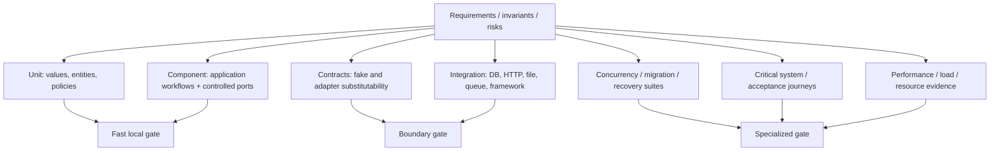
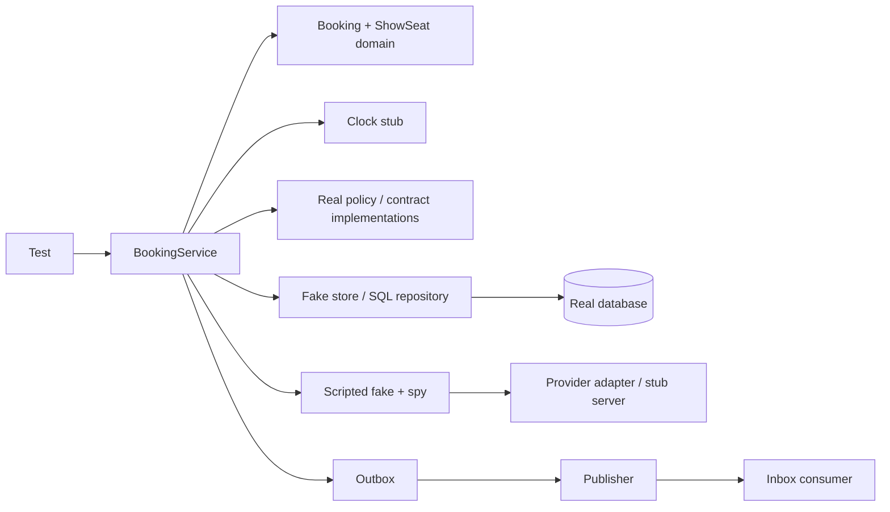

# Topic 14 - Testing Low-Level Designs

[Curriculum index](../README.md) | [Preparation roadmap](../roadmap.md) |
[Previous topic](./13-clean-code-and-refactoring.md) |
[Next topic](./15-interview-execution-problem-practice-and-readiness.md)

- **Category:** Correctness evidence, feedback architecture, and testability
- **Difficulty:** Intermediate to advanced
- **Priority:** Essential
- **Prerequisites:** Topics 1-13, especially requirements/invariants, contracts,
  concurrency, persistence, and refactoring
- **Running example:** A risk-driven test architecture for Movie Ticket Booking
  covering domain state, workflows, payment doubles/contracts, concurrency,
  persistence, idempotency, outbox/inbox, and migrations
- **Output:** A layered, deterministic, maintainable test suite that proves the
  most important LLD behavior and failure properties at the cheapest trustworthy
  boundary

## Outcome

After completing this topic, you should be able to:

- Translate requirements, invariants, state transitions, errors, effects,
  concurrency, persistence, and non-functional risks into a test strategy.
- Distinguish example evidence from proof and explain what a passing test suite
  does and does not establish.
- Select unit, component/service, integration, contract, system/end-to-end, and
  acceptance tests by risk and boundary rather than fixed percentage quotas.
- Define an oracle: the independent source of expected behavior for each test.
- Write clear Arrange-Act-Assert/Given-When-Then tests with diagnostic names,
  focused setup, exact observations, and failure messages.
- Test public behavior/invariants without freezing incidental implementation.
- Choose state-based versus interaction-based assertions according to the
  observable contract.
- Distinguish dummy, stub, fake, spy, and mock roles and use the smallest honest
  double.
- Design faithful fakes and reusable contract suites without pretending a fake
  reproduces database/provider semantics.
- Build readable builders/factories/fixtures that allow important test inputs to
  remain visible and prevent invalid default state.
- Derive equivalence partitions, boundary values, decision tables, transition
  tables, and negative/failure cases systematically.
- Test exact money/time/identity/order/error semantics and verify no unintended
  state/effect after rejection.
- Apply property-based, metamorphic, reference-model, and stateful model-based
  techniques to invariant-heavy LLD algorithms/workflows.
- Test strategies, factories, decorators, observers, commands, states, and other
  design seams through behavioral contracts rather than pattern names.
- Control clocks, IDs, randomness, provider outcomes, files, and environment for
  deterministic tests.
- Test idempotency, retry, timeout, unknown outcome, compensation, and external-
  effect ordering explicitly.
- Build deterministic concurrency tests with phase control, bounded waits, error
  channels, and final invariant/liveness assertions rather than sleep timing.
- Test async task ownership, cancellation, deadlines, cleanup, and context
  propagation.
- Run Repository/Unit of Work/transaction/constraint/migration/outbox/inbox
  evidence against a real database where semantics matter.
- Protect API/error/serialization compatibility and query/order/pagination
  contracts.
- Establish representative performance, complexity, query, resource, load, and
  soak evidence without confusing them with functional unit tests.
- Interpret statement/branch/condition/path coverage as gap-finding signals and
  use mutation testing to evaluate assertion strength selectively.
- Diagnose and remove flaky-test causes rather than normalizing retries/sleeps.
- Recognize test smells including mystery guest, general fixture, assertion
  roulette, over-specification, shared pollution, and tautological expected data.
- Structure fast/slow/specialized suites and failure diagnostics for useful local
  and continuous feedback.
- Design testable LLD boundaries without distorting production design solely for
  a test framework.
- Communicate a prioritized interview test plan and implement the few tests with
  the highest correctness value under time pressure.

## Core idea

Testing is an evidence design problem:

```text
Claim:       What property/behavior do we need confidence in?
Risk:        How could it fail, and what damage/likelihood matters?
Boundary:    Where is the cheapest place that can observe the real semantics?
Oracle:      How do we independently know the expected result/property?
Control:     Which time, randomness, I/O, concurrency, or failure must we drive?
Observation: Which result, state, effect, error, order, or resource proves it?
Limitation:  What does this test still not prove?
```

For each important use case, build this test ledger:

```text
Requirement/invariant:
Preconditions and equivalence partitions:
Boundary values:
State transitions and illegal transitions:
Success result and durable/local state:
Failure/error and no-partial-effect guarantee:
External effect count/order/idempotency:
Concurrency/atomicity/liveness risk:
Persistence/constraint/transaction risk:
Time/random/ID/environment controls:
Primary test level and real boundary required:
Oracle and diagnostic assertions:
Property/model/metamorphic opportunity:
Performance/resource/security expectations:
Remaining limitation:
```

> Test at the lowest level that can faithfully prove the claim. If the claim
> depends on SQL constraints, thread interleavings, HTTP translation, or process
> restart, a pure unit test is too low no matter how fast it is.

## Scope boundary

This topic deeply covers:

- risk-driven test strategy and traceability;
- unit/component/integration/contract/system/acceptance test roles;
- test anatomy, naming, isolation, determinism, diagnostics, and oracles;
- state versus interaction testing;
- dummy/stub/fake/spy/mock selection and faithful fake contracts;
- builders/factories/fixtures/test-data design;
- partitions, boundaries, decision/transition tables, negative and failure tests;
- example, property, metamorphic, reference-model, and stateful model tests;
- testing common LLD patterns and application workflows;
- time, ID, random, provider, file, and environment control;
- idempotency/retry/unknown/compensation effect testing;
- deterministic concurrency, liveness, async, and cancellation testing;
- real persistence, transaction, migration, outbox/inbox, and API compatibility
  testing;
- performance/query/resource/load/soak evidence;
- coverage and mutation evidence;
- flakiness, parallel isolation, test smells, and test-suite architecture;
- interview test planning and implementation prioritization.

It does not deeply cover:

- every framework/plugin command or CI vendor configuration;
- production observability, incident response, chaos engineering platforms, or
  distributed-system verification in full;
- formal proof/model checking, security penetration testing, compliance audit,
  or accessibility/product UX research;
- large-scale load infrastructure/capacity planning;
- replacing Topics 1-13 reasoning: tests derive from requirements, invariants,
  contracts, concurrency, persistence, and maintainability decisions;
- using coverage percentage as a definition of done;
- adding all advanced techniques to every interview solution.

Examples use Python's standard `unittest`, `threading`, `tempfile`, and `sqlite3`
where possible. Property-based, mutation, coverage, async, or container tooling
can improve evidence, but the underlying test design must remain tool-independent.

## 1. Learn

### 1.1 A test is an executable claim

A useful test states:

```text
Under controlled preconditions/input,
when one behavior occurs,
then these observable properties must hold,
and these forbidden effects/states must not occur.
```

Tests are not valuable because they execute lines; they are valuable because a
meaningful regression makes them fail diagnostically.

### 1.2 Passing tests increase confidence, not certainty

Finite examples cannot prove all inputs, schedules, database configurations, or
future environments. Confidence depends on:

- correctness of the oracle;
- relevance/coverage of cases and risks;
- fidelity of the tested boundary/doubles;
- assertion strength;
- deterministic/reproducible execution;
- similarity to production configuration where semantics matter;
- independent reasoning about invariants/algorithms.

State limitations honestly: “proves this constraint on SQLite” is narrower than
“prevents duplicates on every production database.”

### 1.3 Start from risk, not test count

Prioritize by likelihood, impact, complexity, change frequency, and observability:

| Risk | High-value evidence |
|---|---|
| Double booking | constraint/lock + deterministic concurrent one-winner test |
| Duplicate charge | stable key + interaction/restart/reconciliation tests |
| Partial multi-write | rollback/atomicity integration test |
| Illegal state | transition table/invariant tests |
| Money drift | exact boundary/property/reference tests |
| Provider translation | adapter contract + integration test |
| Query leak/order | projection/scope/order/pagination integration test |
| Migration loss | old-fixture/backfill/restart/verification test |

Ten redundant happy-path assertions are weaker than one test at the authoritative
failure boundary.

### 1.4 Build requirement-to-evidence traceability

For each requirement, link:

```text
Requirement -> invariant/contract -> failure mode -> primary test -> limitation
```

Example:

```text
One show-seat has one active owner
-> unique owner invariant
-> two writers both accept same seat
-> two-connection unique-constraint/all-or-none test
-> SQLite result must be repeated on chosen production engine
```

Traceability exposes requirements with no evidence and tests with no meaningful
claim.

### 1.5 The oracle must be independent enough

An oracle decides expected behavior. Sources include:

- explicit requirement/example;
- mathematical/domain invariant;
- hand-computed boundary value;
- simpler trusted reference model;
- prior characterized behavior approved as contract;
- independent provider/database result;
- metamorphic relation between transformations;
- decision/transition table.

Do not calculate expected output with the same production function/algorithm
under test; that creates a tautological test.

### 1.6 Observe the complete contract

Depending on the claim, assert:

- return value/type/identity/order/immutability;
- entity/aggregate/collection state;
- persistence rows/version/constraints;
- external effect count/arguments/order/idempotency;
- events/audit/outbox/inbox state;
- exact error type/code/data and safe message semantics;
- absence of partial mutation/effect;
- thread/task termination and final invariant;
- resource cleanup and bounded latency/query count.

One success assertion may miss a corrupted loser, duplicate provider call, or
orphan durable row.

### 1.7 Testability follows explicit boundaries

Code is testable when:

- dependencies/time/random/IDs are inputs or owned seams;
- effects and results are observable;
- invariants have cohesive owners;
- state can be constructed legally and inspected safely;
- external details live behind application-owned contracts;
- transactions/lifetimes are explicit;
- global/singleton/shared mutable state is controlled;
- units can run without unnecessary infrastructure.

Do not expose private setters solely for tests. Improve the real boundary or test
through supported behavior.

### 1.8 Test levels answer different questions

| Level | Primary question | Typical boundary |
|---|---|---|
| Unit | Does one value/entity/policy/algorithm honor its contract? | one in-memory unit |
| Component/service | Does a cohesive use case work with controlled ports? | application + domain + fakes |
| Integration | Do real collaborators/protocols behave together? | DB/HTTP/file/queue/adapter |
| Contract | Do implementations satisfy one consumer/provider contract? | shared suite per port/API |
| System/end-to-end | Does the deployed/wired flow work across major boundaries? | complete application path |
| Acceptance | Does user/business example satisfy requirement? | externally meaningful scenario |

Names vary across teams. Define boundary/fidelity explicitly instead of arguing
about labels.

### 1.9 Unit tests localize domain logic

Good unit targets:

- Money/DateRange/Location values;
- Booking/Seat state transitions;
- pricing/discount/split/matching/cash-selection policies;
- pure mapping/validation/decision functions;
- retry/backoff calculation;
- serialization of stable value/event payloads.

Unit tests should be fast/deterministic and normally need no network/database/
sleep. They cannot prove integration protocols they replace.

### 1.10 Component/service tests prove workflow semantics

Exercise an application service with real domain objects and controlled ports:

- resolve/validate input;
- coordinate aggregates;
- call provider with correct values/order;
- apply result/state transitions;
- enforce idempotency/error/no-partial-effect behavior;
- return public result.

This is the main style of the repository's current suites. It gives broad LLD
confidence cheaply, while persistence/provider fidelity still needs integration.

### 1.11 Integration tests prove real boundary behavior

Use real implementations when correctness depends on:

- SQL syntax/constraints/isolation/transactions/migrations/query plan;
- HTTP/SDK serialization/status/error/timeout semantics;
- filesystem paths/permissions/encoding/atomic replace;
- message headers/ack/redelivery/ordering;
- framework routing/validation/middleware;
- process environment/configuration/lifecycle.

Keep scope focused: one adapter plus real dependency can be more diagnostic than
a full end-to-end test.

### 1.12 Contract tests preserve substitutability

A reusable suite expresses the client-owned contract for every implementation:

```python
from collections.abc import Callable


def payment_gateway_contract(factory: Callable[[], "PaymentGateway"]) -> None:
    gateway = factory()
    completed = gateway.charge("b1", Decimal("500.00"), PaymentMethod.CARD)

    assert completed.booking_id == "b1"
    assert completed.amount == Decimal("500.00")
    assert completed.status is PaymentStatus.COMPLETED
    assert gateway.refund(completed).status is PaymentStatus.REFUNDED
    assert gateway.refund(completed).status is PaymentStatus.REFUNDED
```

Run against fake/in-memory/provider adapters where cases apply. Integration-
specific timeout/error translation remains additional evidence.

### 1.13 System/end-to-end tests protect wiring and journeys

They catch missing routes/configuration/migrations/serialization/wiring/auth and
cross-boundary assumptions. They are slower, less localized, and more environment-
sensitive, so use a small set of critical journeys rather than duplicating every
unit case through the whole system.

### 1.14 Acceptance examples communicate business meaning

An acceptance test uses business vocabulary and externally meaningful outcomes:

```text
Given show S has seat A1 available and starts at 18:00
When user U holds A1 at 17:55 and completes payment
Then booking is confirmed, A1 is owned by that booking, and confirmation exists
```

It may run at service or end-to-end level. “Acceptance” describes stakeholder
meaning, not necessarily technical size.

### 1.15 The test pyramid is an economic heuristic

Prefer many cheap/local tests, fewer boundary integrations, and a small critical
end-to-end set. But shape follows system risk:

- SQL-heavy repository needs more integration evidence;
- adapter library needs contract/integration focus;
- algorithm library has dense unit/property tests;
- UI workflow may need component/browser checks;
- concurrency requires specialized controlled tests.

Do not enforce fixed percentages or mock every integration to make a pyramid look
correct.

### 1.16 A test portfolio avoids blind spots

For one booking command, consider:

| Dimension | Cases |
|---|---|
| Examples | one/multiple seats, exact price |
| Boundaries | empty, duplicate, deadline, show start |
| State | pending/confirmed/cancelled/expired |
| Failure | unknown seat, unavailable, provider decline/exception |
| Invariant | success owns all; failure owns none |
| Interaction | charge once with exact amount/key |
| Concurrency | overlapping requests one winner |
| Persistence | constraint/rollback/version |
| Recovery | retry/lost response/unknown result |
| Performance | bounded query/lock/provider calls |

One level need not cover every dimension if another level proves it more
faithfully.

### 1.17 Arrange, Act, Assert separates the story

```python
def test_failed_payment_keeps_booking_pending() -> None:
    # Arrange
    scenario = BookingScenario().with_available_seat("A1")
    scenario.gateway.fail_next_charge()
    booking = scenario.hold("A1")

    # Act
    payment = scenario.confirm(booking.booking_id)

    # Assert
    assert payment.status is PaymentStatus.FAILED
    assert booking.status is BookingStatus.PENDING_PAYMENT
    assert scenario.owner_of("A1") == booking.booking_id
```

Comments are optional when spacing/helpers make phases obvious. Avoid multiple
unrelated Act phases in one test unless verifying a state sequence.

### 1.18 One test proves one coherent behavior

One behavior may require several assertions: result, state, effect, and forbidden
partial change. “One assertion per test” is not a useful rule. Split when setup/
act/failure causes differ, not when an invariant needs a group of observations.

### 1.19 Test names state scenario and outcome

Prefer:

```text
test_duplicate_seat_selection_is_rejected_without_hold
test_refund_failure_keeps_confirmed_booking_and_owned_seats
test_same_idempotency_key_replays_completed_payment
test_stale_version_cannot_overwrite_confirmed_booking
```

Avoid `test_booking_1`, `test_error`, or names that merely repeat a method. A
failure should reveal scenario/expected outcome before reading setup.

### 1.20 Determinism means controlled causes

Control inputs affecting result/order:

- clock/timezone/precision;
- random/ID seed/source;
- provider outcomes/latency;
- thread/task phases;
- database contents/schema/isolation;
- filesystem/environment/locale;
- collection order where not guaranteed;
- network/message delivery.

Deterministic does not mean “everything mocked”; it means failures reproduce from
the recorded conditions.

### 1.21 Isolation prevents state pollution

Each test should own/reset:

- domain objects and mutable stores;
- fake/provider histories/failure scripts;
- database/schema/transaction;
- temporary files/directories;
- threads/tasks/executors;
- environment/config/global registries;
- caches/singletons/subscriptions.

Avoid relying on test execution order. Shared immutable expensive fixtures may be
safe; shared mutable fixtures need explicit lifecycle and strong reason.

### 1.22 Repeatability includes failure reproduction

When using generated/concurrent/random/load cases, record:

- seed/example input;
- schedule/phase events if controlled;
- database/vendor/version/config;
- timezone/locale;
- worker count/batch/order;
- failure injection point;
- minimized counterexample.

A failing test that cannot be reproduced is weak diagnostic evidence.

### 1.23 Feedback must be fast enough for its purpose

Target:

- local unit/component suite on each edit;
- focused adapter/integration suite during boundary work;
- all solution tests before completion;
- specialized slow/concurrency/load/production-engine suites at appropriate gates.

Fast wrong tests are not valuable. Optimize setup/isolation and suite selection
before replacing real semantics with unrealistic mocks.

### 1.24 Failures should be diagnostic

Assert domain facts and include identities/versions/states where useful. Compare
complete small values/collections rather than many unrelated booleans. Capture
worker/task errors and timeouts explicitly. Preserve original exception cause.

A failure should answer: what scenario, what was expected, what was observed, and
which boundary likely failed?

### 1.25 Assertions must be exact but not brittle

Assert exact:

- Decimal/time units and boundary policy;
- status/owner/version/order;
- error type/code/structured details;
- external arguments/count/order when contractual;
- no partial mutation/effect;
- immutable snapshot values.

Avoid exact:

- random IDs/timestamps not controlled/contractual;
- private helper sequence;
- object repr or full SQL/query-plan text;
- unordered collection order not promised;
- every field of a large response when only a few are contractually relevant.

### 1.26 Test behavior, not implementation shape

Stable tests call public/domain contracts and observe results/invariants/effects.
They should survive rename/extract/move/private algorithm replacement. White-box
tests are acceptable for complex pure algorithms/internal performance when their
coupling is deliberate and benefit exceeds refactor cost.

### 1.27 Choose state versus interaction evidence

- **State-based:** observe returned/entity/store state; best for domain rules and
  pure outcomes.
- **Interaction-based:** observe collaborator calls; necessary for email/payment/
  publish/commit/caching effect count/order and no-call guarantees.

Do not spy on internal calls just because a mocking library makes it easy. Use
interaction assertions only where interaction itself is behavior.

### 1.28 Test doubles are roles

One object may play more than one role, but name the role used:

| Double | Purpose |
|---|---|
| Dummy | fill unused parameter |
| Stub | return scripted values/errors |
| Fake | working simplified implementation |
| Spy | record calls/effects for later assertion |
| Mock | preprogram expected interactions and verifies them |

Framework “Mock” objects can act as stubs or spies; conceptual role matters more
than class name.

### 1.29 Dummy supplies no behavior

Use for a required dependency the scenario never touches. If the dummy would be
dangerously used, make it fail loudly:

```python
class UnexpectedGateway:
    def charge(self, *args, **kwargs):
        raise AssertionError("payment gateway must not be called")
```

This becomes a no-call guard, stronger than a passive `None` that fails obscurely.

### 1.30 Stub scripts indirect input

```python
class StubClock:
    def __init__(self, current: datetime) -> None:
        self.current = current

    def now(self) -> datetime:
        return self.current
```

Stubs control what the unit receives. Script only relevant cases; avoid a giant
test double reproducing all provider logic.

### 1.31 Fake implements a usable contract

An in-memory Repository or PaymentGateway can support broad service tests. A fake
must model semantic behavior used by clients: identity, duplicates, error states,
idempotency, ordering, or transactions as claimed.

It cannot automatically model SQL isolation/constraints/commit failures or real
provider timeout/serialization. Shared contract plus real integration tests bound
its trust.

### 1.32 Spy records contractual interactions

```python
from dataclasses import dataclass
from decimal import Decimal


@dataclass(frozen=True, slots=True)
class ChargeCall:
    booking_id: str
    amount: Decimal
    idempotency_key: str


class SpyGateway:
    def __init__(self, result: "Payment") -> None:
        self._result = result
        self.calls: list[ChargeCall] = []

    def charge(self, booking_id: str, amount: Decimal, key: str) -> "Payment":
        self.calls.append(ChargeCall(booking_id, amount, key))
        return self._result
```

Assert exact call/count/key only when duplicate/order/argument behavior matters.

### 1.33 Mock verifies an interaction protocol

Use when order/count is the core contract, such as:

```text
validate -> reserve durable attempt -> call provider once -> finalize outcome
```

Over-mocking collaborators you own freezes internal design. A state test with a
small spy is often clearer than dozens of ordered expectations.

### 1.34 Handwritten doubles improve domain clarity

Handwritten fakes/spies:

- expose only the real port contract;
- use domain values rather than framework configuration;
- give reusable failure scripts/history;
- produce clearer diagnostics;
- remain refactor-resistant.

Framework mocks are concise for one-off no-call/exception/order cases. Use specs/
autospec/type checks where available so renamed methods do not leave false tests.

### 1.35 Wrap external APIs you do not control

Do not mock a third-party SDK deeply throughout application tests. Define the
application-owned capability, test application against a fake/spy, and test one
adapter against the actual SDK protocol/sandbox/recorded fixture at integration
level.

Otherwise SDK object shape leaks everywhere and mocks can confirm an invented
protocol that production never follows.

### 1.36 Contract-test fakes against real implementations

Contract cases may include:

- missing/duplicate identity;
- ordering/identity/mutation semantics;
- success/decline/idempotent replay;
- exact units/status/error translation;
- retryable versus terminal failure;
- ownership/cleanup.

Keep implementation-specific tests too. A fake repository should not emulate
phantoms/deadlocks; a real database suite proves those.

### 1.37 Builders keep relevant test data visible

```python
from dataclasses import replace
from datetime import datetime, timedelta
from decimal import Decimal


class BookingBuilder:
    def __init__(self) -> None:
        self._booking = Booking(
            booking_id="b1",
            user_id="u1",
            show_id="s1",
            seat_ids=("A1",),
            total_amount=Decimal("200.00"),
            created_at=datetime(2030, 1, 1, 10, 0),
            hold_expires_at=datetime(2030, 1, 1, 10, 5),
        )

    def with_status(self, status: "BookingStatus") -> "BookingBuilder":
        self._booking = replace(self._booking, status=status)
        return self

    def build(self) -> "Booking":
        return replace(self._booking)
```

Defaults must be valid and obvious. Builders should create fresh objects and not
hide fields important to the scenario.

### 1.38 Object Mother/scenario fixtures need restraint

Named scenarios such as `confirmed_booking()` can improve vocabulary. A giant
Object Mother with mutable shared graphs and surprising defaults becomes a
mystery guest. Prefer small composable builders/factories and explicit scenario
helpers close to the tests.

### 1.39 Test data factories preserve validity

A factory centralizes legal construction while allowing overrides:

```python
def make_money_booking(
    *,
    booking_id: str = "b1",
    amount: Decimal = Decimal("200.00"),
) -> "Booking":
    return Booking.create_for_test(booking_id=booking_id, total_amount=amount)
```

Do not add production-only `create_for_test` if normal domain factories/builders
work. Test helpers belong in test code unless they represent a real construction
capability.

### 1.40 Equivalence partitions reduce redundant examples

Partition inputs expected to behave alike:

```text
Withdrawal amount:
- <= 0 invalid
- positive fractional not dispensable
- positive whole <= limit with exact notes succeeds
- positive whole <= limit without exact notes declines
- > transaction limit declines
- <= balance versus > balance
```

Choose representative values plus boundaries from each partition rather than
random happy cases.

### 1.41 Boundary-value analysis targets transitions

For hold expiry at `hold_expires_at`:

```text
t = deadline - smallest relevant unit -> still held
t = deadline                         -> expired (if half-open)
t = deadline + smallest unit         -> expired
```

Also test empty/one/max collection, zero/cent/large money, min/max capacity,
touching/non-overlapping/overlapping ranges, version `v`/`v+1`, retry attempt
limit-1/limit/limit+1.

### 1.42 Decision tables expose combinations

Example cancellation:

| Status | Show started | Payment completed | Expected |
|---|---:|---:|---|
| Pending | No | No | cancel + release, no refund |
| Confirmed | No | Yes | refund + cancel + release |
| Pending/Confirmed | Yes | any | reject, no mutation/effect |
| Cancelled/Expired | any | any | reject/replay per contract |
| Confirmed | No | provider refund fails | preserve/recovery state per design |

Eliminate impossible combinations or model them as corruption tests. Use table-
driven cases when setup/assertions remain understandable.

### 1.43 State-transition tests prove legal and illegal moves

Test a matrix:

```text
from state + command -> to state/result/effect
illegal pair         -> exact error + state/effects unchanged
repeated command     -> replay/reject according to idempotency
```

Cover transition-associated data: owner, deadline, payment/reference, reason,
version, and emitted event—not just enum value.

### 1.44 Negative tests prove rejection safety

A good rejection test asserts:

- exact classified failure;
- no partial aggregate/collection mutation;
- no provider/event/persistence effect;
- ownership/count/balance remains;
- resource/lock/transaction cleanup;
- later valid command can still succeed if promised.

`assertRaises` alone can pass after state was already corrupted.

### 1.45 Exact money tests use independent expected values

Test:

- parsing accepted/rejected values;
- currency/scale/rounding boundaries;
- zero/non-negative/maximum policies;
- discounts/caps/tax/surcharge ordering;
- allocation remainder distribution;
- sum of shares equals exact total;
- refund/cancellation conservation;
- no float conversion.

Hand-compute small expected values or use integer minor-unit reference logic,
not the same pricing function twice.

### 1.46 Time tests control clock and timezone

Test:

- exact inclusive/exclusive boundaries;
- timezone-aware versus rejected naive values;
- UTC/local business-date conversion policy;
- precision truncation/round-trip;
- hold/show/cancellation/check-in window precedence;
- wall clock versus monotonic elapsed deadline;
- DST gaps/folds when local schedules matter;
- one operation reads time once where consistency requires it.

Never wait five real minutes to test expiry.

### 1.47 IDs and randomness need reproducible sources

Inject a deterministic generator/seed when output or collisions matter. Test:

- uniqueness over a representative batch;
- collision handling with scripted repeated IDs;
- stable idempotency/request IDs;
- random strategy constraints and deterministic seed replay;
- rejection of invalid externally supplied IDs.

Do not assert a specific UUID string unless the generator is controlled and that
identity participates in the contract.

### 1.48 Property-based tests generalize invariants

Instead of enumerating only examples, generate valid/invalid domains and assert:

```text
Splitwise: sum(splits) == expense total; net positions sum to zero
ATM: sum(denomination * count) == requested; counts within inventory
Pricing: total is finite, cent-normalized, non-negative
DateRange: overlap is symmetric; adjacent half-open ranges do not overlap
Booking: successful hold owns exactly requested unique seats
```

Property tools help generation/shrinking, but a bounded deterministic loop can
still encode the idea.

### 1.49 Generators must respect the domain

Separate:

- generate valid objects through constructors/builders;
- generate raw invalid inputs for boundary validation;
- constrain sizes for useful speed/shrinking;
- record seed and minimized counterexample;
- avoid filtering nearly all generated values;
- include meaningful edge-biased values.

If the generator duplicates production validation/calculation incorrectly, the
test can miss the same defect.

### 1.50 Metamorphic testing uses relations without exact outputs

Examples:

- reorder seat input: price/ownership set unchanged, output order per contract;
- add zero-value adjustment: total unchanged;
- add independent debt then reverse it: net positions unchanged;
- translate both locations equally: Euclidean distance unchanged (not necessarily
  geographic/haversine transformation);
- simplify debts twice: second result preserves same net positions/idempotence;
- serialize then deserialize: semantic value round-trips;
- cancel then retry: same result/error/effect count per idempotency contract.

Choose relations that are mathematically/domain valid; plausible-sounding
relations can be false.

### 1.51 Stateful model-based tests explore command sequences

Define:

- a small reference state/model;
- commands with preconditions;
- implementation actions;
- expected model transitions;
- invariants after every step;
- generated/selected sequences;
- failure seed/sequence shrinking/replay.

Example Booking commands: hold, confirm success/failure, cancel, advance time,
expire, retry. Model-based testing finds sequence bugs examples miss, such as
expire -> stale payment completion -> cancel.

### 1.52 A reference model should be simpler

For seat ownership, reference model may be:

```python
class SeatModel:
    def __init__(self) -> None:
        self.owner_by_seat: dict[str, str] = {}

    def claim_all(self, booking_id: str, seat_ids: tuple[str, ...]) -> bool:
        if any(seat_id in self.owner_by_seat for seat_id in seat_ids):
            return False
        self.owner_by_seat.update(
            {seat_id: booking_id for seat_id in seat_ids}
        )
        return True
```

It deliberately omits locks/SQL/details while representing the invariant. If the
reference repeats production structure line for line, correlated bugs remain.

### 1.53 Test strategies with shared behavioral contracts

For every Pricing/Matching/Split/Eligibility implementation, assert common
preconditions/postconditions plus implementation-specific examples:

```text
Pricing: exact finite non-negative result; no input mutation
Matching: selected item belongs to eligible candidates or None; deterministic
         tie/order policy
Split: one share per participant; exact total; non-negative; input unchanged
Eligibility: deterministic boolean; no campaign/user mutation
```

Shared contract tests prove substitutability; they do not require equal output
for different strategies.

### 1.54 Test factories and builders through creation contracts

Assert:

- supported type/config creates correct behavioral implementation;
- required validation/defaults/invariants;
- unsupported type has exact error;
- each call returns shared/new identity according to scope;
- factory does not hide global/provider side effects;
- created object passes its own contract suite.

Do not assert the internal `if`/mapping used by the factory.

### 1.55 Test decorators/composites in layers

For a pricing decorator:

1. wrapper-specific arithmetic/effect around a stub base;
2. shared Pricing contract;
3. real composition order/examples;
4. invalid configuration;
5. base invoked exactly once only if that prevents duplicate cost/effect.

For Composite, test leaf, empty/single/multiple children, order, aggregation,
failure policy, and cycle rules where supported.

### 1.56 Test observers/events without freezing internals

Assert:

- subscriber receives correct immutable event after accepted transition;
- no event on rejected/rolled-back change;
- subscribe/unsubscribe/duplicate policy;
- order only if promised;
- one failing observer behavior (continue/stop/aggregate) per contract;
- callback outside lock/transaction if safety requires it;
- reentrancy and snapshot behavior;
- durable outbox/inbox separately for process/crash reliability.

### 1.57 Test State/Command/Template workflows by transition/effect

- State: legal/illegal transition matrix plus associated data/invariants.
- Command: execute result/effect, duplicate/retry, undo only if contractually
  supported, serialization/version if durable.
- Template Method: invariant skeleton order, hook contract, failing hook cleanup,
  no subclass violation.
- Chain: handler applicability, order, stop/pass/aggregate/failure policy.

Test behavior roles, not that classes carry pattern names.

### 1.58 Application workflow tests cover both sides of effects

For confirm booking:

```text
before provider: lookup, state/deadline/ownership validation, attempt identity
provider: exact booking/amount/method/key, one invocation
after provider success: payment recorded, Booking/Seat confirmed, event/output
after decline: failed attempt recorded, hold retained/retry semantics
after exception/unknown: explicit state, no false success, recovery path
duplicate: replay/no additional provider effect
```

Test failure injection at every meaningful boundary, not only returned decline.

### 1.59 Adapter tests protect translation

For HTTP/SDK/database/message adapter, assert:

- local values -> exact provider request units/headers/body/key;
- provider success/decline/error/timeout -> local result/error;
- unknown/extra/missing provider fields;
- retries/idempotency/timeouts owned at correct layer;
- sensitive values excluded from errors/logs;
- resource/session cleanup;
- provider types do not escape.

Use stub transport/server or sandbox appropriate to fidelity; application tests
should not know raw SDK shapes.

### 1.60 Idempotency tests need lost-response and concurrency cases

At minimum:

- first request performs one operation and stores/reports result;
- same key/fingerprint replays same semantic result;
- same key/different fingerprint conflicts;
- simultaneous duplicates choose one owner/effect;
- success then response loss/restart replays;
- in-progress crash follows lease/reconciliation policy;
- failed/unknown/expired retention behavior is explicit;
- external provider uses stable matching key.

Counting final rows alone may miss duplicate remote calls; include a spy/provider
history.

### 1.61 Concurrency tests assert safety and liveness

Safety:

- one owner/winner;
- all-or-none multi-resource result;
- no lost update/duplicate effect/stale release;
- final state satisfies invariants.

Liveness:

- every thread/task completes or times out by contract;
- no deadlock/starvation in controlled scenario;
- wait/cancellation/shutdown terminates;
- worker errors reach the test.

Performance under threads is a separate measured question.

### 1.62 Force the dangerous phase deterministically

Start barriers alone align entry but do not force both reads before either write.
Use test hooks/Events/barriers at semantic phases:

```python
import threading


class PhaseControl:
    def __init__(self, parties: int) -> None:
        self.after_read = threading.Barrier(parties)
        self.allow_write = threading.Event()

    def reached_after_read(self) -> None:
        self.after_read.wait(timeout=2)
        if not self.allow_write.wait(timeout=2):
            raise TimeoutError("write phase was not released")
```

Production code can expose a narrow optional test hook at a seam, or a lower
repository/provider fake can pause. Never add business sleeps.

### 1.63 Sleep is not synchronization

`sleep(0.1)` may pass/fail with machine load and still miss the required
interleaving. Replace with:

- Barrier for known participants/phase;
- Event/Condition predicate;
- fake clock/scheduler;
- instrumented dependency that blocks until released;
- bounded polling of an observable state only when no callback exists.

Sleep may appear in explicit performance/soak/integration timing tests, with
tolerance and reason, not as race correctness proof.

### 1.64 Bound every wait and capture every worker error

```python
from queue import Queue
import threading


def run_threads(*targets) -> list[object]:
    results: Queue[object] = Queue()

    def run(target) -> None:
        try:
            results.put(target())
        except BaseException as error:
            results.put(error)

    threads = [threading.Thread(target=run, args=(target,)) for target in targets]
    for thread in threads:
        thread.start()
    for thread in threads:
        thread.join(timeout=2)
    if any(thread.is_alive() for thread in threads):
        raise AssertionError("worker did not terminate")
    observed = [results.get_nowait() for _ in threads]
    return observed
```

In robust infrastructure, use `Exception` versus `BaseException` according to
cancellation/interrupt policy and include worker identity/traceback. Never let a
background traceback be invisible to the main assertion flow.

### 1.65 Async tests own tasks and cancellation

Test:

- awaited success/error;
- timeout/deadline budget using controlled scheduler/short bounded test timeout;
- cancellation before/during safe points;
- cancellation does not leave partial state/resource;
- child task exceptions are observed;
- no orphan tasks after test;
- async lock/queue/condition predicates;
- context variables/request IDs propagate as promised;
- blocking sync work is not run on event loop accidentally.

Avoid relying on event-loop scheduling order without explicit synchronization.

### 1.66 Persistence tests use the real engine semantics needed

Run against:

- actual schema/migrations;
- real driver and connection settings;
- foreign keys/unique/check constraints;
- commit/rollback/savepoint behavior;
- optimistic version/rowcount/error code;
- separate connections for isolation/conflicts;
- representative query plans/data;
- vendor production engine for row/range/locking claims.

SQLite is valuable and fast but not proof of PostgreSQL/MySQL lock/isolation/DDL.

### 1.67 Repositories need shared contracts plus integration-only cases

Shared fake/SQL contract:

- missing/add/get/update/remove;
- exact aggregate round-trip/order/identity semantics;
- duplicate/conflict behavior;
- mutation isolation/snapshots;
- query filters/order.

Real-only:

- constraints/transactions/isolation/commit failure;
- mapper corrupt data;
- SQL/query plan/migrations;
- connection/pool/resource behavior.

Do not make a fake pretend to deadlock or emulate vendor SQL internals.

### 1.68 Migration tests start from old schemas/data

For every supported upgrade path:

1. create/apply actual old version;
2. load representative boundary/legacy/corrupt data;
3. run expand migration;
4. verify old/new code compatibility;
5. interrupt/restart/concurrently write during backfill;
6. verify invariants/count/checksum/sample;
7. switch reads;
8. reject premature contract;
9. test rollback or document forward-fix-only boundary.

Fresh latest schema tests do not prove upgrades.

### 1.69 Failure injection tests transaction boundaries

Inject at:

- each repository write;
- mapper serialization/rehydration;
- optimistic conflict;
- constraint violation;
- commit and rollback/close;
- after commit before response;
- before/after external provider;
- before/after event publication.

Assert exact committed/rolled-back/unknown state, no partial success, resource
cleanup, and safe retry/recovery identity.

### 1.70 Outbox/inbox tests cross crash boundaries

Outbox:

- business rollback -> no event;
- business commit -> event present;
- crash before publish -> retry;
- publish then crash before mark -> redelivery;
- lease expiry/stale acknowledgement;
- retry/backoff/poison/dead-letter/order.

Inbox:

- duplicate concurrent/restarted delivery -> one local effect;
- inbox insert + business write atomic;
- failure rolls both back;
- derived event goes to local outbox.

At-least-once is proven through duplicate tolerance, not claimed as exactly once.

### 1.71 API/controller tests protect boundary semantics

Assert:

- input parsing/normalization/trust-boundary validation;
- auth/scope/tenant ownership where in scope;
- status/error code and structured payload;
- headers/idempotency/correlation/pagination cursor;
- omission/null/empty distinctions;
- stable JSON enum/time/money representation;
- no internal stack/provider/database details leak;
- application command invoked once with mapped values;
- contract/version compatibility fixtures.

Keep domain rules tested below; controller tests focus on translation/boundary.

### 1.72 Serialization tests use compatibility fixtures

For rows/events/API/files:

- current encode/decode round-trip;
- read old version fixture;
- new optional/unknown fields policy;
- stable enum/type/version code;
- exact units/timezone/precision/order;
- invalid/missing required fields;
- canonical fingerprint form for idempotency;
- sensitive-data omission;
- writer/readers coexistence matrix.

Avoid testing only two sides of the same newly changed mapper without a fixed
old/independent fixture.

### 1.73 Performance tests begin with a budget and workload

Define:

```text
Operation/data distribution/concurrency:
Warm/cold setup:
Latency percentile or throughput/resource budget:
Query/provider call budget:
Measurement repetitions/environment tolerance:
Failure/regression threshold:
```

Do not place fragile microsecond assertions in normal unit tests. Use complexity/
query counts for deterministic gross regressions and calibrated benchmarks for
runtime properties.

### 1.74 Load, stress, and soak answer different questions

- **Load:** expected workload meets latency/throughput/error budget.
- **Stress:** increase beyond expected to find limits/failure mode/recovery.
- **Spike:** sudden change tests admission/backpressure.
- **Soak:** sustained load exposes leaks/queues/fragmentation/drift.

They require production-like topology/data and observability. An interview can
state the plan; it rarely implements a full load harness.

### 1.75 Complexity/property checks catch algorithm regressions

For in-memory LLD, useful deterministic evidence:

- count comparator/policy calls;
- query count bounded independent of parent count;
- candidate scan not accidentally nested;
- queue/heap size/invariant;
- representative input doubling ratio with tolerance only when needed;
- static Big-O explanation plus adversarial case.

Do not confuse a small benchmark with formal asymptotic proof.

### 1.76 Resource tests prove cleanup

Assert on success/error/cancellation/timeout:

- lock/permit released;
- transaction rolled back/closed;
- connection/cursor/file/socket returned/closed;
- temporary directory removed;
- queue task accounted;
- thread/task/executor terminated;
- subscription/unsubscribe performed;
- cache/global restored;
- no later test observes pollution.

Context managers and instrumented fakes make ownership visible.

### 1.77 Security-oriented LLD tests protect trust boundaries

Within scope, test:

- caller cannot access another user's/tenant's object;
- authorization checked before sensitive effect/data;
- untrusted identifiers/payloads validated/parameterized;
- secrets/PII absent from error/log/event/repr;
- replay/idempotency/fingerprint scope includes actor/tenant;
- mass assignment cannot mutate internal status/owner fields;
- unsafe path traversal/serialization disabled where relevant.

These are not substitutes for threat modeling/security review/penetration tests.

### 1.78 Coverage metrics reveal unexecuted structure

- Statement/line: which lines executed.
- Branch/decision: true/false alternatives executed.
- Condition: individual boolean conditions exercised where tool supports it.
- Function/method/class: definitions invoked.
- Path: complete control paths (often combinatorially impractical).

Use uncovered important code/branches to ask what risk/behavior lacks a test.
100% line coverage can still have weak/no assertions and missing combinations.

### 1.79 Branch coverage is not state/interaction coverage

Executing both sides of `if payment_succeeded` does not prove:

- exact provider call count/key;
- no seat release on failure;
- idempotent replay;
- concurrent behavior;
- persistent atomicity;
- unknown timeout recovery.

Structural coverage complements a semantic requirements/invariant matrix.

### 1.80 Mutation testing evaluates test sensitivity

A mutation tool changes behavior syntactically, such as:

- reverse boundary comparison;
- delete assignment/call;
- change arithmetic/operator/constant;
- negate condition;
- return alternate value.

If tests still pass, the mutant survives and suggests missing/weak assertion,
equivalent mutant, unreachable/dead code, or irrelevant behavior. Review survivors
by risk; do not chase a score blindly.

### 1.81 Deliberate-break tests are a manual mutation technique

Temporarily:

- remove refund call;
- change `>= deadline` to `> deadline`;
- release non-owner seat;
- remove version predicate;
- commit before outbox insert;
- run provider twice;
- omit rollback/cleanup.

Confirm the intended test fails for the correct reason, then restore code. This
checks assertion power even without mutation tooling.

### 1.82 Flakiness is nondeterministic evidence failure

Common causes:

- real time/sleep/timezone;
- random seed/order not recorded;
- unbounded/background work;
- shared global/database/filesystem/port;
- test-order dependence;
- external network/provider;
- race without phase control;
- asynchronous eventual assertion too early;
- resource leak/environment capacity;
- overly tight performance threshold.

Retries can diagnose frequency but must not normalize a failing correctness test.

### 1.83 Triage flaky tests scientifically

1. capture seed/environment/order/log/worker errors;
2. reproduce alone and in suite/repeated/parallel;
3. classify product race versus test harness race;
4. replace timing/global assumptions with control/ownership;
5. bound eventual waits and improve diagnostics;
6. retain a regression that forces root cause;
7. quarantine only with owner/expiry/visibility when it blocks feedback;
8. never simply increase sleep indefinitely.

### 1.84 Parallel test execution requires true isolation

Use unique:

- database/schema/tenant/key prefixes;
- temp directories/files;
- ports/resources;
- user/request/idempotency identities;
- fake instances/histories;
- environment context.

Avoid global random/environment/current-directory mutation or protect/restore it.
Parallel execution can reveal pollution; it does not make unsafe tests correct.

### 1.85 Test smells are maintainability signals

| Smell | Symptom |
|---|---|
| Mystery Guest | important setup/data hidden elsewhere |
| General Fixture | huge setup most tests ignore |
| Assertion Roulette | many unclear assertions/failure meaning |
| Eager Test | one test exercises many unrelated behaviors |
| Free Ride | extra behavior asserted incidentally in another test |
| Fragile/Over-specified | private calls/shape frozen |
| Conditional Test Logic | loops/ifs recreate production complexity |
| Tautological Oracle | expected computed with same implementation |
| Test Interdependence | depends on order/shared mutation |
| Slow Test | unnecessary infrastructure/waits |
| Flaky Test | same revision/input gives inconsistent result |
| Happy-path Only | no boundaries/rejections/failures |

Diagnose context before refactoring; state sequence/property/parameterized tests
can legitimately contain controlled loops/steps.

### 1.86 Test code deserves production-quality clarity

Test code should have:

- domain vocabulary and scenario-focused names;
- minimal visible relevant setup;
- reusable helpers at meaningful abstraction;
- no clever metaprogramming without payoff;
- exact cleanup/lifetime;
- typed/value-safe builders where useful;
- deterministic failure scripts;
- readable expected values;
- comments for why/contract, not mechanics.

Duplication in tests may improve readability until it repeats complex setup/
knowledge likely to change together.

### 1.87 Keep expected data independent and reviewable

Prefer:

- literal small Decimal/timestamp/state expectations;
- hand-built expected DTO/events;
- simple reference algorithms;
- fixed compatibility fixtures reviewed as contract;
- helper assertion for one domain invariant.

Avoid copying the production formula/query/mapper into the test or snapshotting a
giant object with irrelevant fields.

### 1.88 Custom assertions improve domain diagnostics

```python
def assert_booking_owns_exactly(
    booking: "Booking",
    show: "Show",
    expected_seat_ids: set[str],
) -> None:
    actual = {
        seat_id
        for seat_id, show_seat in show.seats.items()
        if show_seat.held_by_booking_id == booking.booking_id
    }
    if actual != expected_seat_ids:
        raise AssertionError(
            f"booking {booking.booking_id} owns {sorted(actual)}, "
            f"expected {sorted(expected_seat_ids)}"
        )
```

Keep assertions focused on one invariant and avoid hiding the scenario's key
expected values.

### 1.89 Organize suites by feedback and capability

Possible groups:

```text
unit/domain       fast pure/state/policy
component         use cases with fakes/spies
contract          shared adapter/repository semantics
integration       real DB/HTTP/file/queue/framework
concurrency       deterministic multi-participant
migration         old schema/data upgrades
system/acceptance critical wired journeys
performance/load  controlled specialized environment
```

Markers/directories/commands should let developers run the smallest trustworthy
set, then required broader gates.

### 1.90 Continuous gates should fail usefully

Typical order:

1. format/static/import checks;
2. unit/component tests;
3. contract/integration/database tests;
4. concurrency/migration/system tests;
5. selective coverage/mutation/security/performance gates.

Run independent groups in parallel only when isolation is safe. Preserve failure
artifacts/seeds/logs and avoid burying the first causal failure under cascades.

### 1.91 LLD interview testing is prioritized communication

Under time pressure:

1. state invariants and state transitions while designing;
2. name high-risk success, boundary, failure, and concurrency cases;
3. implement 3-6 high-value tests, not every getter;
4. use simple fake Clock/provider/store;
5. assert no partial effect and exact final state;
6. explain which DB/provider/concurrency tests production still needs;
7. adapt tests when follow-up requirement changes.

Tests demonstrate design clarity. A long generic list without executable examples
or priority is weak.

### 1.92 Test strategy matrix

| Claim | Cheapest faithful level | Control | Oracle/observation | Limitation |
|---|---|---|---|---|
| Money allocation exact | unit/property | generated totals/participants | conservation/reference minor units | not persistence |
| Booking lifecycle | domain/component | Clock/provider result | transition table + state/effect | fake provider |
| Payment adapter translation | contract/integration | stub/sandbox responses | local request/result/error | sandbox fidelity |
| One seat winner in process | deterministic concurrency | barriers/events | owner + loser + termination | one process |
| One durable seat winner | DB integration | two connections | unique constraint + rollback | vendor config |
| Outbox recovery | DB/worker integration | crash phase/lease clock | business/outbox/delivery/inbox | broker topology |
| Migration compatibility | migration integration | old schema/data/process versions | invariants/read-write matrix | production scale |
| Critical journey wiring | system/acceptance | isolated environment | external business outcome | slower/localization |
| Latency/query budget | performance | workload/data/environment | percentiles/counts/resources | environment variance |

The matrix is complete only when the limitation is explicit and another test or
accepted risk covers it.

## 2. Recognize

### 2.1 Requirement and risk signals

Increase/specialize test evidence when requirements mention:

- exact money, allocation, rounding, capacity, or conservation;
- legal/illegal state transitions and idempotent repeats;
- time windows, expiry, deadlines, timezones, or scheduled workers;
- concurrency, one winner, all-or-none, locks, waiting, or shutdown;
- multiple processes, persistence, constraints, isolation, or migrations;
- remote payment/hardware/message effects, timeout, retry, or compensation;
- ordering, pagination, query limits, or large input complexity;
- pluggable strategies/providers/repositories;
- compatibility across API/event/schema versions;
- authorization/tenant ownership or sensitive data;
- latency/throughput/backpressure/resource limits;
- difficult legacy code/refactoring with unknown behavior.

Each signal points to a property and faithful boundary, not simply “add more unit
tests.”

### 2.2 Missing-evidence smells

Investigate when:

- tests cover only successful examples;
- rejection tests assert only an exception, not unchanged state/effects;
- boundary values use arbitrary interior numbers;
- one test suite uses only fakes for database/provider claims;
- external calls are not counted/keyed/ordered;
- state transitions lack illegal/repeat cases;
- concurrency test only starts threads near each other;
- joins/waits have no timeout or worker exception channel;
- time tests use real time/sleep;
- generated/random failure has no seed/counterexample;
- migrations test only latest empty schema;
- repository adapters lack a shared contract;
- coverage is reported but important invariants have no named tests;
- a deliberate defect does not fail any test;
- test outcome depends on order, machine, timezone, or network.

### 2.3 Over-testing and brittleness smells

Investigate when:

- every class/helper/getter is tested independently regardless of risk;
- mocks reproduce the full internal call graph;
- harmless private rename/extraction breaks dozens of tests;
- unit tests assert SQL text/SDK object internals rather than adapter contract;
- end-to-end tests duplicate every validation branch;
- giant snapshots are updated blindly;
- setup hides all important values behind shared fixtures;
- one “integration” test exercises the entire application and cannot localize;
- test helpers contain as much branching/business logic as production;
- test suite is slow because every case rebuilds unnecessary infrastructure;
- retries quarantine persistent product races;
- coverage/mutation score becomes the goal instead of risk evidence.

### 2.4 False positives and justified choices

- Several assertions can prove one invariant coherently.
- A state-sequence/model/property test legitimately has multiple Act steps/loops.
- A facade/component test may use many real domain collaborators.
- An integration test can assert a stable query-count budget.
- A mock can verify a required effect order or no-call guarantee.
- A broad fixture can be acceptable if nearly every scenario needs the valid
  world and overrides remain visible.
- Snapshot/golden tests can provide temporary legacy leverage.
- Duplicate small test setup can be clearer than a clever shared builder.
- Slow production-engine/migration/load tests may be essential but placed in a
  specialized suite.

Judge whether the choice improves trustworthy, diagnostic, maintainable evidence.

### 2.5 Test-design questions

Before writing a test, answer:

1. What requirement/invariant/failure/performance claim is at risk?
2. Which boundary is the cheapest one that includes the real semantics?
3. What independent oracle/property/model determines expected behavior?
4. Which inputs form valid/invalid equivalence partitions?
5. What values sit exactly at each boundary?
6. Which starting states, commands, repeated/illegal transitions matter?
7. What state/effect must remain unchanged after failure?
8. Which collaborator output/error/time/random/schedule must be controlled?
9. Is state observation sufficient, or is call count/order/key itself behavior?
10. Which double role is smallest and honest?
11. What does a fake omit that requires a real integration test?
12. Can an invariant/property/metamorphic/model test generalize examples?
13. What concurrency/persistence/restart boundary changes the proof?
14. How will waits/resources/threads/tasks/transactions clean up on failure?
15. What seed/environment/data makes failure reproducible?
16. What will the failure message reveal?
17. Which test suite/gate should run it, and how fast must feedback be?
18. What does the test still not prove?

## 3. Model

### 3.1 Running example: pressure inventory

Movie Ticket Booking must prove:

- selected existing seats are held all-or-none and priced exactly;
- duplicate/empty/unavailable input is rejected without partial hold;
- hold expires at the exact deadline/show start;
- successful payment confirms Booking and every owned seat;
- failed payment records failure, keeps hold, and permits retry;
- confirmed repeat replays without a second charge;
- pending/confirmed cancellation releases; confirmed cancellation refunds;
- refund/provider failure follows the stated ordering/recovery contract;
- histories are deterministic newest-first;
- same-seat concurrency has one winner and terminates;
- future SQL persistence enforces durable ownership/rollback/version;
- outbox/idempotency/migration claims survive crash/restart;
- API/error representation remains stable.

No one test level proves all of these.

### 3.2 Requirement-to-evidence matrix

| Requirement/property | Primary evidence | Secondary evidence | Limitation |
|---|---|---|---|
| Seat selection validation | domain/component boundary table | API mapping | in-memory only |
| Price exactness | policy unit/property/contract | booking component | configured currencies only |
| Booking transition legality | entity state table | use-case scenarios | no DB conflicts |
| Provider arguments/effect | component spy | adapter integration | sandbox/recorded fidelity |
| Idempotent confirmation | component + concurrent duplicate | durable restart integration | retention/provider policy |
| One in-process winner | phase-controlled threads | stress repetition | one process |
| Durable one winner | unique constraint, two DB connections | production-engine test | selected DB config |
| Rollback/all-or-none | real UoW integration | component fake invariant | commit unknown separate |
| Event eventual delivery | outbox/inbox crash tests | broker integration | at-least-once |
| Migration compatibility | old schema/data matrix | staging rehearsal | production scale/load |
| API errors/serialization | controller/contract fixtures | system journey | client diversity |
| Query order/performance | integration plan/count/data | benchmark | environment variance |

### 3.3 Test architecture



Arrows originate from risk because test levels do not derive from implementation
layers mechanically.

### 3.4 Boundary and collaborator map



Choose the cut per claim: entity tests omit Service; component tests replace
PAY/STORE; integration tests include adapter/DB; recovery tests include durable
worker states.

### 3.5 Oracle catalogue

| Claim | Oracle |
|---|---|
| exact price | hand-calculated Decimal/minor-unit formula |
| all-or-none ownership | set equality + no owner for loser |
| transition legality | approved transition table |
| history order | explicit timestamp + ID tie-break expected list |
| debt/cash allocation | conservation equation/reference model |
| strategy substitutability | shared postcondition contract |
| provider translation | application port contract + provider docs/stub fixture |
| durable conflict | database constraint/rowcount plus invariant |
| migration | old/new reader-writer matrix + counts/checksums/invariants |
| performance | declared representative workload and budget |

### 3.6 Booking transition table

| Start | Command/result | End | Local/external observations |
|---|---|---|---|
| Pending live | charge succeeds | Confirmed | one payment ID, all seats Booked |
| Pending live | charge declines | Pending | failed attempt recorded, seats Held |
| Pending expired | confirm | Expired/reject | no charge; seats Available |
| Confirmed | confirm repeat | Confirmed | same payment; zero new charge |
| Pending | cancel | Cancelled | release; no refund |
| Confirmed | cancel/refund succeeds | Cancelled | one refund; release |
| Confirmed | refund fails | contract-specific unchanged/pending recovery | no false cancelled success |
| Cancelled/Expired | confirm/cancel | reject/replay per API | no effect |

Associated data and effect ordering are part of each row.

### 3.7 Seat-selection decision table

| Input | Exists | Available | Expected |
|---|---:|---:|---|
| empty | - | - | reject; no booking/hold/price/provider |
| duplicate IDs | yes | yes | reject; no partial hold |
| one unknown | no | - | reject; none held |
| one unavailable | yes | no | reject; none newly held |
| all unique/known/free | yes | yes | exactly all held one owner |
| overlap concurrent | yes | initially yes | one whole winner; loser none |

### 3.8 Failure-injection matrix

| Phase | Inject | Expected evidence |
|---|---|---|
| input/catalog | invalid/missing | no booking/seat/payment effect |
| pricing | exception/invalid result | no hold/store effect |
| hold mutation | conflict on later seat | rollback/none held |
| payment | decline/exception/timeout-after-success | state/error/reconciliation contract |
| refund | exception/timeout | no false cancellation; durable recovery if designed |
| repository write | each operation | complete local rollback |
| commit | error/unknown | no premature success; key/status lookup |
| outbox publish | before/after broker ack | retry/redelivery/inbox dedup |
| mapper | corrupt/unknown status | classified quarantine/error |
| cleanup | close/rollback failure | original + cleanup diagnostics/pool safety |

### 3.9 Double plan

| Dependency | Double/real | Role | Why |
|---|---|---|---|
| Clock | MutableClock | stub | exact boundary without waiting |
| ID generator | Scripted IDs | stub | deterministic identity/collision |
| Payment port | ScriptedPaymentGateway | fake + spy | outcomes and count/key/order |
| Pricing strategy | real implementations | real/contract | cheap pure behavior |
| Repository | in-memory fake | fake | component speed/identity |
| SQL repository | real SQLite/production DB | integration | constraints/transactions |
| Provider adapter | stub transport/sandbox | integration | serialization/error translation |
| Message publisher | spy/stub broker + real broker gate | spy/integration | payload/count/ack semantics |
| Notifications | RecordingNotifier | spy | event content/count |

### 3.10 Test-data plan

Use:

- `BookingScenario` for a small valid theater/show/users/seats world;
- focused Booking/ShowSeat/Money/DateRange builders for unit tests;
- explicit IDs/times/money at test call sites;
- factory returns fresh graphs per test;
- scenario methods expose owner/history/provider history without leaking all
  internals;
- temporary file database per multi-connection integration test;
- old schema/data fixture files for migrations;
- seeds/minimized sequence recorded for generated/model tests.

Avoid one mutable global scenario shared by 154 tests.

### 3.11 Property and metamorphic plan

| Target | Property/relation |
|---|---|
| Money/pricing | finite cent result; cap/non-negative; input order relation |
| Seat holds | success owner set equals request; failure changes no requested seat |
| Exact cash | note value sum exact; counts bounded; inventory conservation |
| Splitwise | shares total exact; net positions sum zero; simplify preserves nets |
| Date ranges | overlap symmetric; adjacency non-overlap; containment overlap |
| History | sorted by contract; filtering result subset/all match predicate |
| Serialization | semantic round-trip; old fixture accepted by new reader |
| Idempotency | repeat same request does not increase effect count |

### 3.12 Stateful model plan

Model fields:

```text
clock
booking state/payment attempt/result
owner/state/deadline per seat
provider effect count/key/result
```

Commands:

```text
hold(seats), confirm(outcome), cancel, advance_time, expire, retry_confirm
```

After every command compare implementation to model and assert global invariants.
Seed edge sequences deliberately: confirm/expire same deadline, failed then
successful retry, cancel then stale completion, repeated confirm/cancel.

### 3.13 Concurrency test plan

```text
Participants: 2-4 independent callers/connections
Dangerous phase: after availability/version read, before claim/update
Control: Barrier/Event/instrumented repository hook
Deadline: bounded barrier/wait/join using monotonic budget
Error capture: queue/future per worker
Assertions: exact successes/losers, all/no ownership, effect count, version,
            worker termination, no background error
Scope: thread/process/database explicitly stated
Stress: repeated seeds/schedules only supplementary
```

### 3.14 Persistence/recovery test plan

Use a temporary file DB (not separate `:memory:` connections), run real migrations,
enable foreign keys per connection, and test:

- mapper round-trip/corrupt rows;
- constraints directly;
- Unit of Work commit/rollback/close;
- two-connection unique/version conflicts;
- all-or-none booking/claims/outbox;
- durable idempotency lost response/restart;
- outbox lease/publish/redelivery/inbox;
- migration from old schema/interrupted backfill;
- representative query order/plan/count;
- production-engine-specific locks/isolation separately.

### 3.15 Suite and feedback map

```text
Each edit:       focused test module/method
Local gate:      all unit + component solution tests
Boundary gate:   repository/provider contracts + SQLite/integration
Special gate:    deterministic concurrency + migrations + recovery
Release gate:    critical system/acceptance + production-engine smoke
Measured gate:   selective coverage/mutation/performance/load/resource
```

Failures retain seed, scenario identity, phase, worker errors, database version,
and relevant state snapshot.

### 3.16 Test-strategy decision record

```text
Requirement/risk and damage:
Invariant/contract:
Primary boundary/level:
Oracle:
Equivalence/boundary/state/failure cases:
Double roles and real integration needed:
Property/model/concurrency/recovery evidence:
Data/fixture/isolation/cleanup:
Performance/resource/security checks:
Suite/gate/frequency:
Diagnostic artifacts:
Known limitation/accepted risk:
```

## 4. Implement

### 4.1 Organize by behavior and boundary

An illustrative layout:

```text
tests/
  unit/
    test_money.py
    test_booking_transitions.py
    test_pricing_contract.py
  component/
    test_create_booking.py
    test_confirm_booking.py
    test_cancel_booking.py
  contract/
    payment_gateway_contract.py
    booking_repository_contract.py
  integration/
    test_sqlite_booking_repository.py
    test_payment_adapter.py
    test_outbox_worker.py
  concurrency/
    test_seat_claims.py
  migrations/
    test_v1_to_v2.py
  support/
    builders.py
    clocks.py
    scripted_gateways.py
    concurrency.py
```

For a small solution, one readable test module is fine. Split when feedback,
fixture, capability, or ownership becomes distinct—not one file per production
class automatically.

### 4.2 Build fresh valid data with explicit overrides

```python
from dataclasses import dataclass, replace
from datetime import datetime, timedelta
from decimal import Decimal


@dataclass(frozen=True, slots=True)
class BookingData:
    booking_id: str = "b1"
    user_id: str = "u1"
    show_id: str = "show1"
    seat_ids: tuple[str, ...] = ("A1",)
    total_amount: Decimal = Decimal("200.00")
    created_at: datetime = datetime(2030, 1, 1, 10, 0)
    hold_expires_at: datetime = datetime(2030, 1, 1, 10, 5)

    def with_values(self, **changes) -> "BookingData":
        return replace(self, **changes)


def make_booking(data: BookingData | None = None) -> "Booking":
    values = data or BookingData()
    return Booking(
        booking_id=values.booking_id,
        user_id=values.user_id,
        show_id=values.show_id,
        seat_ids=values.seat_ids,
        total_amount=values.total_amount,
        created_at=values.created_at,
        hold_expires_at=values.hold_expires_at,
    )
```

The test that cares about expiry writes `with_values(hold_expires_at=deadline)`;
irrelevant valid fields stay concise. Fresh immutable data prevents mutation
leakage.

### 4.3 Control time and IDs

```python
from collections import deque
from datetime import datetime, timedelta
from uuid import UUID


class MutableClock:
    def __init__(self, current: datetime) -> None:
        self.current = current

    def now(self) -> datetime:
        return self.current

    def advance(self, delta: timedelta) -> None:
        self.current += delta


class ScriptedIds:
    def __init__(self, *values: UUID) -> None:
        self._values = deque(values)

    def new(self) -> UUID:
        if not self._values:
            raise AssertionError("unexpected ID generation")
        return self._values.popleft()

    def assert_exhausted(self) -> None:
        if self._values:
            raise AssertionError(f"unused scripted IDs: {list(self._values)}")
```

The scripted source detects extra/missing generations as well as stabilizing
values.

### 4.4 Script provider outcomes and record effects

```python
from collections import deque
from dataclasses import dataclass
from decimal import Decimal


@dataclass(frozen=True, slots=True)
class ChargeCall:
    booking_id: str
    amount: Decimal
    idempotency_key: str


class ScriptedPaymentGateway:
    def __init__(self, *outcomes: "Payment | Exception") -> None:
        self._outcomes = deque(outcomes)
        self.charge_calls: list[ChargeCall] = []
        self.refund_calls: list[str] = []

    def charge(
        self,
        booking_id: str,
        amount: Decimal,
        idempotency_key: str,
    ) -> "Payment":
        self.charge_calls.append(ChargeCall(booking_id, amount, idempotency_key))
        if not self._outcomes:
            raise AssertionError("unexpected charge")
        outcome = self._outcomes.popleft()
        if isinstance(outcome, Exception):
            raise outcome
        return outcome

    def refund(self, payment: "Payment") -> "Payment":
        self.refund_calls.append(payment.payment_id)
        return payment.refund_for_test()

    def assert_all_outcomes_used(self) -> None:
        if self._outcomes:
            raise AssertionError(f"unused outcomes: {list(self._outcomes)}")
```

Use separate fake semantics/contract tests if this grows beyond outcome scripting.
Do not let test-only `refund_for_test` leak into production; a real test helper
can construct the expected returned Payment value instead.

### 4.5 Create a scenario at the application boundary

```python
class BookingScenario:
    def __init__(self, now: datetime) -> None:
        self.clock = MutableClock(now)
        self.catalog = make_small_catalog(now)
        self.gateway = make_scripted_gateway()
        self.service = make_booking_service(
            catalog=self.catalog,
            gateway=self.gateway,
            clock=self.clock,
        )

    def hold(self, *seat_ids: str, user_id: str = "u1") -> "Booking":
        return self.service.create_booking(user_id, "show1", seat_ids)

    def owner_of(self, seat_id: str) -> str | None:
        return self.catalog.get_show("show1").seats[seat_id].held_by_booking_id
```

Keep the world intentionally small. Tests still display relevant user/show/seat/
time/outcome values and can access supported diagnostics without navigating a
giant fixture.

### 4.6 Write exact value-object unit tests

```python
import unittest
from decimal import Decimal


class MoneyTest(unittest.TestCase):
    def test_percentage_discount_is_capped_and_cent_exact(self) -> None:
        policy = PercentageDiscount(percent=Decimal("25"), cap=Decimal("80.00"))

        discount = policy.discount(Decimal("500.00"))

        self.assertEqual(Decimal("80.00"), discount)

    def test_non_finite_or_negative_amount_is_rejected(self) -> None:
        for value in (Decimal("-0.01"), Decimal("NaN"), Decimal("Infinity")):
            with self.subTest(value=value):
                with self.assertRaises(ValueError):
                    Money(value, "INR")
```

The expected discount is independently obvious: 25% is 125, capped at 80.

### 4.7 Encode boundary partitions as readable subtests

```python
import unittest
from datetime import datetime, timedelta


class HoldExpiryTest(unittest.TestCase):
    def test_expiry_uses_half_open_deadline(self) -> None:
        deadline = datetime(2030, 1, 1, 10, 5)
        cases = (
            (deadline - timedelta(microseconds=1), False),
            (deadline, True),
            (deadline + timedelta(microseconds=1), True),
        )

        for observed_at, expected_expired in cases:
            with self.subTest(observed_at=observed_at):
                booking = make_pending_booking(expires_at=deadline)
                changed = booking.expire_if_due(observed_at)
                self.assertEqual(expected_expired, changed)
                self.assertEqual(
                    BookingStatus.EXPIRED if expected_expired
                    else BookingStatus.PENDING_PAYMENT,
                    booking.status,
                )
```

Use the smallest meaningful precision from the contract; not every system
promises microseconds.

### 4.8 Drive a transition table

```python
import unittest


class BookingTransitionTest(unittest.TestCase):
    def test_cancel_transition_table(self) -> None:
        cases = (
            (BookingStatus.PENDING_PAYMENT, None),
            (BookingStatus.CONFIRMED, None),
            (BookingStatus.CANCELLED, InvalidBookingTransition),
            (BookingStatus.EXPIRED, InvalidBookingTransition),
        )

        for initial, expected_error in cases:
            with self.subTest(initial=initial):
                booking = make_booking_with_status(initial)
                before = booking.snapshot()
                if expected_error is None:
                    booking.cancel("user request", FIXED_NOW)
                    self.assertIs(BookingStatus.CANCELLED, booking.status)
                else:
                    with self.assertRaises(expected_error):
                        booking.cancel("user request", FIXED_NOW)
                    self.assertEqual(before, booking.snapshot())
```

Separate cases when assertions/setup differ substantially; table-driven tests
should improve—not conceal—failure meaning.

### 4.9 Assert rejection has no partial effect

```python
def test_unavailable_second_seat_creates_no_partial_booking() -> None:
    scenario = BookingScenario(FIXED_NOW)
    scenario.hold("A2", user_id="u2")
    before = scenario.inventory_snapshot()

    with assert_raises(SeatUnavailable):
        scenario.hold("A1", "A2", user_id="u1")

    assert scenario.inventory_snapshot() == before
    assert scenario.bookings_for("u1") == []
    assert scenario.gateway.charge_calls == []
```

Use the actual framework assertion (`self.assertRaises`/`pytest.raises`) in real
code; the point is the negative post-state/effect evidence.

### 4.10 Reuse a strategy contract

```python
from collections.abc import Callable
from decimal import Decimal


def pricing_contract(factory: Callable[[], "PricingStrategy"]) -> None:
    strategy = factory()
    show = make_show(prices={"A1": Decimal("200.00")})
    before = show.snapshot()

    total = strategy.calculate(show, ("A1",))

    assert total.is_finite()
    assert total >= Decimal("0.00")
    assert total == total.quantize(Decimal("0.01"))
    assert show.snapshot() == before
```

Then add Standard, Weekend, coupon, and invalid configuration examples. The
contract does not demand each policy return the same number.

### 4.11 Reuse a Repository contract without fake overreach

```python
from collections.abc import Callable


def booking_repository_contract(
    factory: Callable[[], "RepositoryHarness"],
) -> None:
    harness = factory()
    with harness.unit_of_work() as uow:
        booking = make_booking()
        uow.bookings.add(booking)
        self_same_scope = uow.bookings.get(booking.booking_id)
        assert self_same_scope is booking
        uow.commit()

    with harness.unit_of_work() as uow:
        loaded = uow.bookings.get(booking.booking_id)
        assert loaded.snapshot() == booking.snapshot()
        assert uow.bookings.list_for_user(booking.user_id) == [loaded]
```

If fake identity across Units of Work differs from SQL semantics, either change
fake/contract or state separate contracts; do not assert false parity.

### 4.12 Add deterministic generated properties without a library

```python
import random
from decimal import Decimal


def test_equal_split_conserves_total_for_seeded_cases() -> None:
    seed = 20260824
    random_source = random.Random(seed)

    for case_index in range(500):
        participant_count = random_source.randint(1, 20)
        cents = random_source.randint(0, 1_000_000)
        total = Decimal(cents) / Decimal("100")

        shares = equal_split(total, participant_count)

        assert len(shares) == participant_count, (seed, case_index)
        assert sum(shares, Decimal("0.00")) == total, (seed, case_index)
        assert all(share >= Decimal("0.00") for share in shares), (
            seed,
            case_index,
        )
```

A property tool can shrink failures automatically; this loop still records a
reproducible case and tests an independent conservation property.

### 4.13 Compare against a simple reference model

```python
def test_cash_selection_matches_exhaustive_reference_for_small_inventories() -> None:
    strategy = ExactCashStrategy()
    denominations = (1, 2, 5)

    for ones in range(4):
        for twos in range(4):
            for fives in range(4):
                inventory = {1: ones, 2: twos, 5: fives}
                for amount in range(20):
                    actual = strategy.select_notes(amount, inventory)
                    possible = exhaustive_combination_exists(amount, inventory)
                    assert (actual is not None) == possible
                    if actual is not None:
                        assert sum(note * count for note, count in actual.items()) == amount
                        assert all(actual[note] <= inventory[note] for note in actual)
```

Keep the exhaustive reference bounded and structurally simpler than the
production algorithm.

### 4.14 Execute a stateful command sequence against a model

```python
def assert_booking_matches_model(
    scenario: "BookingScenario",
    model: "BookingModel",
) -> None:
    assert scenario.booking_state() == model.booking_state
    assert scenario.seat_owners() == model.seat_owners
    assert len(scenario.gateway.charge_calls) == model.charge_count


def run_sequence(commands: list["ModelCommand"]) -> None:
    scenario = BookingScenario(FIXED_NOW)
    model = BookingModel(FIXED_NOW)
    for index, command in enumerate(commands):
        actual = command.apply_to_system(scenario)
        expected = command.apply_to_model(model)
        assert normalize(actual) == normalize(expected), (index, command)
        assert_booking_matches_model(scenario, model)
```

Generate/bound command sequences and always include adversarial known sequences.
Normalize only non-contractual differences such as controlled/generated IDs.

### 4.15 Record effect ordering explicitly

```python
class EventLog:
    def __init__(self) -> None:
        self.events: list[str] = []


class RecordingRefundGateway:
    def __init__(self, log: EventLog) -> None:
        self._log = log

    def refund(self, payment: "Payment") -> "Payment":
        self._log.events.append("refund")
        return payment


class RecordingInventory:
    def __init__(self, log: EventLog) -> None:
        self._log = log

    def release(self, booking_id: str) -> None:
        self._log.events.append("release")
```

The component test then asserts `['refund', 'release', 'cancel']` only if this
exact order is contractually required. Prefer state assertions otherwise.

### 4.16 Prove idempotency includes effect count and fingerprint

```python
def test_lost_response_retry_replays_without_second_charge() -> None:
    scenario = durable_booking_scenario()
    request = ConfirmRequest("b1", key="k1", fingerprint="fp1")

    first = scenario.confirm_and_drop_response(request)
    restarted = scenario.restart_application()
    replay = restarted.confirm(request)

    assert replay.semantic_result == first.semantic_result
    assert restarted.provider.calls_for_key("k1") == 1


def test_same_key_with_different_fingerprint_conflicts() -> None:
    scenario = durable_booking_scenario()
    scenario.confirm(ConfirmRequest("b1", key="k1", fingerprint="fp1"))

    with assert_raises(IdempotencyConflict):
        scenario.confirm(ConfirmRequest("b2", key="k1", fingerprint="fp2"))

    assert scenario.provider.calls_for_key("k1") == 1
```

These are integration-style pseudocode until the durable Topic 12 adapter exists;
they specify the required evidence.

### 4.17 Build a bounded concurrency runner

```python
from collections.abc import Callable
from concurrent.futures import ThreadPoolExecutor, wait


def run_concurrently(
    actions: list[Callable[[], object]],
    timeout_seconds: float = 2.0,
) -> list[object | BaseException]:
    with ThreadPoolExecutor(max_workers=len(actions)) as executor:
        futures = [executor.submit(action) for action in actions]
        done, pending = wait(futures, timeout=timeout_seconds)
        if pending:
            for future in pending:
                future.cancel()
            raise AssertionError(f"{len(pending)} concurrent actions did not finish")
        results: list[object | BaseException] = []
        for future in futures:
            try:
                results.append(future.result())
            except BaseException as error:
                results.append(error)
        return results
```

`ThreadPoolExecutor.__exit__` waits for running work; production-quality test
infrastructure also needs a design that cannot hang forever when a task ignores
cancellation. Prefer known bounded operations and daemon/process isolation for
testing deliberately deadlocking unsafe demonstrations.

### 4.18 Force a read-before-write race with a test seam

```python
import threading


class PausingSeatStore:
    def __init__(self, wrapped: "SeatStore", parties: int) -> None:
        self._wrapped = wrapped
        self._after_read = threading.Barrier(parties)
        self._release = threading.Event()

    def is_available(self, seat_id: str) -> bool:
        result = self._wrapped.is_available(seat_id)
        self._after_read.wait(timeout=2)
        if not self._release.wait(timeout=2):
            raise TimeoutError("test did not release writers")
        return result

    def release_writes(self) -> None:
        self._release.set()
```

The test waits until all readers reach the phase, releases writes, captures both
outcomes/errors, then asserts one authoritative winner. Do not leave a hook in
the wrong production abstraction merely for test convenience.

### 4.19 Test a real SQLite rollback

```python
import sqlite3
import tempfile
import unittest
from pathlib import Path


class BookingTransactionTest(unittest.TestCase):
    def test_claim_conflict_rolls_back_booking_and_every_new_claim(self) -> None:
        with tempfile.TemporaryDirectory() as directory:
            path = Path(directory) / "booking.sqlite3"
            initialize_booking_schema(path)
            create_existing_claim(path, show_id="s1", seat_id="A2")

            with self.assertRaises(SeatUnavailable):
                create_hold_in_transaction(path, "b2", ("A1", "A2"))

            connection = sqlite3.connect(path)
            try:
                booking_count = connection.execute(
                    "SELECT count(*) FROM bookings WHERE booking_id = 'b2'"
                ).fetchone()[0]
                claim_count = connection.execute(
                    "SELECT count(*) FROM seat_claims WHERE booking_id = 'b2'"
                ).fetchone()[0]
                self.assertEqual(0, booking_count)
                self.assertEqual(0, claim_count)
            finally:
                connection.close()
```

The helper implementations must use the real Unit of Work/schema under test, not
duplicate rollback in the fixture.

### 4.20 Test business row and outbox atomically

```python
def test_confirm_commit_contains_booking_and_outbox_together(sql_uow_factory) -> None:
    with sql_uow_factory() as uow:
        confirm_booking(uow, "b1", expected_version=0)
        uow.commit()

    with sql_uow_factory() as uow:
        booking = uow.bookings.get("b1")
        events = uow.outbox.for_aggregate("Booking", "b1")
        assert booking.is_confirmed
        assert [event.event_type for event in events] == ["BookingConfirmed"]


def test_confirm_rollback_contains_neither_change_nor_outbox(sql_uow_factory) -> None:
    try:
        with sql_uow_factory() as uow:
            confirm_booking(uow, "b1", expected_version=0)
            raise RuntimeError("injected before commit")
    except RuntimeError:
        pass

    with sql_uow_factory() as uow:
        assert uow.bookings.get("b1").is_pending
        assert uow.outbox.for_aggregate("Booking", "b1") == []
```

Add commit-unknown and publish/redelivery cases separately.

### 4.21 Test migration restartability

```python
def test_customer_backfill_resumes_without_overwriting_new_writes(
    old_database: "Database",
) -> None:
    expand_schema(old_database)
    backfill_customer_ids(old_database, batch_size=2, stop_after_batches=1)
    write_booking_with_new_customer_id(old_database, "b-new", "u-new")

    backfill_customer_ids(old_database, batch_size=2)

    rows = load_all_booking_customer_fields(old_database)
    assert all(row.customer_id is not None for row in rows)
    assert customer_id_for(rows, "b-new") == "u-new"
    assert verification_report(old_database).is_complete
```

Run old/new reader-writer fixtures and contract-precondition rejection too.

### 4.22 Test async cleanup with standard unittest

```python
import asyncio
import unittest


class ExpiryWorkerTest(unittest.IsolatedAsyncioTestCase):
    async def test_cancellation_stops_worker_without_orphan_task(self) -> None:
        worker = ExpiryWorker(FakeExpirySource())
        task = asyncio.create_task(worker.run())
        await worker.started.wait()

        task.cancel()
        with self.assertRaises(asyncio.CancelledError):
            await asyncio.wait_for(task, timeout=1)

        self.assertTrue(worker.closed)
        self.assertEqual([], worker.background_tasks)
```

Avoid inspecting every loop iteration; assert owned lifecycle/resources and
contractual cancellation result.

### 4.23 Add custom domain assertions

```python
import unittest


class BookingAssertions(unittest.TestCase):
    def assert_no_partial_hold(
        self,
        scenario: "BookingScenario",
        booking_id: str,
        requested: set[str],
    ) -> None:
        owned = scenario.seats_owned_by(booking_id)
        if owned not in (set(), requested):
            self.fail(
                f"partial hold for {booking_id}: owned={sorted(owned)}, "
                f"requested={sorted(requested)}"
            )
```

Composition/helper functions can be simpler than inheritance. Keep the expected
domain values visible in the test.

### 4.24 Count calls/queries without brittle timing

```python
class CountingDistance:
    def __init__(self, wrapped: "DistanceStrategy") -> None:
        self._wrapped = wrapped
        self.calls = 0

    def calculate_km(self, origin: "Location", destination: "Location") -> "Decimal":
        self.calls += 1
        return self._wrapped.calculate_km(origin, destination)


def test_matching_calculates_distance_once_per_eligible_driver() -> None:
    distance = CountingDistance(HaversineDistanceStrategy())
    drivers = make_drivers(total=100, eligible=40)

    NearestDriverStrategy(distance).select_driver(drivers, FIXED_PICKUP)

    assert distance.calls == 40
```

Only assert this count if it represents a deliberate algorithm/performance
contract; otherwise a correct optimization/refactor may break a brittle test.

### 4.25 Verify resource cleanup with an instrumented context

```python
class RecordingResource:
    def __init__(self) -> None:
        self.entered = False
        self.exited = False
        self.exit_error_type: type[BaseException] | None = None

    def __enter__(self) -> "RecordingResource":
        self.entered = True
        return self

    def __exit__(self, error_type, error, traceback) -> None:
        self.exited = True
        self.exit_error_type = error_type


def test_resource_closes_when_mapping_fails() -> None:
    resource = RecordingResource()
    try:
        with resource:
            raise ValueError("corrupt row")
    except ValueError:
        pass

    assert resource.entered
    assert resource.exited
    assert resource.exit_error_type is ValueError
```

Real adapter tests should also verify connection/transaction state before pool
reuse.

### 4.26 Prove test strength with a deliberate defect

For one selected risk:

1. change production comparison/call/mutation temporarily;
2. predict exactly which test should fail;
3. run the narrow test;
4. confirm failure message points to the property;
5. restore the code;
6. rerun narrow and full suites;
7. record the mutant/risk in exercise evidence.

Never leave the deliberate defect or weaken the assertion to restore green.

### 4.27 Keep commands discoverable

Document commands for:

```text
one test method/module
one solution suite
all solution suites
contract/integration/concurrency/migration groups
coverage/mutation/performance specialized runs if configured
```

The repository already provides `scripts/run-all-tests.ps1`; retain its fail-fast
behavior and add new groups only when corresponding executable tests exist.

### 4.28 Implementation review checklist

- [ ] Every test maps to a named risk/requirement/invariant/contract.
- [ ] Boundary is the cheapest one containing the real semantics.
- [ ] Oracle is independent enough and expected values are reviewable.
- [ ] Arrange/Act/Assert and scenario-outcome name are clear.
- [ ] Success, boundary, rejection, failure, repeat, and recovery cases are
  proportionate to risk.
- [ ] Rejection asserts unchanged state and forbidden effects.
- [ ] State/interaction assertions match observable behavior.
- [ ] Each double's role is explicit; no deep third-party SDK mock leaks inward.
- [ ] Fake/real implementations share contract tests where semantics overlap.
- [ ] Builders/factories return fresh valid data and expose important overrides.
- [ ] Properties/models/metamorphic relations are independent and reproducible.
- [ ] Time/ID/random/provider/environment are controlled.
- [ ] Concurrency tests force dangerous phases, capture errors, and bound waits.
- [ ] Async tests own/cancel/await every task and clean resources.
- [ ] Persistence tests use real schema/driver/connections and old fixtures.
- [ ] Idempotency/outbox/inbox tests cross restart/crash/redelivery boundaries.
- [ ] API/serialization compatibility uses fixed old/new fixtures.
- [ ] Performance/query/resource assertions have explicit budgets/rationale.
- [ ] Coverage/mutation are gap/sensitivity evidence, not goals alone.
- [ ] Tests run independently/repeated/parallel without pollution or sleep races.
- [ ] Failures report scenario, seed/phase/identity, expected and observed state.
- [ ] Test helpers are simpler than production and contain no duplicated oracle.
- [ ] Suite placement/frequency matches feedback cost and fidelity.
- [ ] Deliberate defect is caught by the intended test.
- [ ] Known limitations and remaining production-specific tests are stated.

## 5. Test the test suite

### 5.1 Audit claims, not test files

Create a coverage-of-meaning table:

| Requirement/invariant/risk | Test(s) | Boundary | Oracle | Deliberate defect caught? | Limitation |
|---|---|---|---|---:|---|

Look for high-risk rows with no/low-fidelity evidence and many tests mapped to no
meaningful row. Structural coverage reports are inputs to this audit, not the
table itself.

### 5.2 Audit the oracle

For each important test ask:

- Is expected data hand-derived, fixed contract, invariant, or simpler model?
- Does test call the production calculator/mapper to compute expected?
- Did test author copy the same mistake into expected logic?
- Does snapshot contain reviewed semantic data or noise?
- Is provider/database behavior invented by fake/mocks?
- Would a plausible wrong implementation still satisfy the assertion?

Strengthen with independent values/properties/real integration/deliberate defects.

### 5.3 Audit assertion power manually or with mutation

Target high-risk modules and classify surviving mutations:

```text
Missing case/assertion -> add focused test
Weak assertion         -> assert stronger contract/no partial effect
Equivalent mutation    -> document/filter
Dead/unreachable code  -> delete or prove path
Irrelevant behavior    -> accept with rationale
Tool limitation        -> do not distort code merely for score
```

Mutation score without survivor review is not a quality guarantee.

### 5.4 Check false positives

A false positive test failure reports regression when supported behavior did not
change. Causes:

- private interaction/order/structure assertion;
- uncontrolled timestamp/ID/order/environment;
- tight timing/performance threshold;
- shared fixture pollution;
- snapshot noise;
- implementation-specific fake contract;
- stale expected fixture after intentional contract migration.

Fix the test boundary/control/oracle; do not simply loosen every assertion.

### 5.5 Check false negatives

A false negative passes despite a meaningful defect. Causes:

- no assertion or tautological expected value;
- only status asserted while owner/balance/effect corrupted;
- exception asserted after partial mutation;
- background worker error not captured;
- fake omits constraint/provider behavior;
- boundary/off-by-one case absent;
- race never forced;
- coverage executes branch without checking outcome;
- snapshot ignores/normalizes contractual field.

Inject plausible defects at risk boundaries to expose them.

### 5.6 Run order/repetition/parallel isolation audits

Run suites:

- individual tests/modules;
- normal order and randomized/reversed order if tooling allows;
- repeated targeted concurrency/flaky candidates;
- parallel groups where supported;
- different timezone/locale/config when contract cares;
- with resource warnings/leak instrumentation.

Any order dependency identifies shared state/lifecycle not owned by the test.

### 5.7 Audit bounded concurrency/lifecycle

Every test-created participant/resource has:

- explicit owner;
- start/readiness synchronization;
- captured result/error/traceback;
- bounded operation/wait/join;
- cleanup in `finally`/context manager;
- assertion that no participant remains;
- final invariant/effect counts.

A test that can hang the suite is itself a liveness bug.

### 5.8 Audit fixtures and helpers

For each shared fixture/builder/helper:

- Which tests use each field/setup step?
- Is relevant scenario data visible?
- Does it return fresh objects?
- Can defaults become invalid silently after domain change?
- Does helper contain branches/logic duplicating production?
- Are mutable provider histories/failure flags reset?
- Can smaller factory/composition improve diagnostics?

Split a General Fixture by scenario/capability, not arbitrarily.

### 5.9 Audit doubles and contracts

Inventory dummy/stub/fake/spy/mock dependencies and ask:

- Is the role clear from name/API?
- Does a fake claim semantics it cannot support?
- Is a third-party SDK mocked deeply instead of wrapped?
- Does spy history include identity/amount/key/order needed?
- Does no-call dependency fail loudly?
- Does every replaceable implementation run shared contract tests?
- Which behavior still needs sandbox/real database/broker integration?

### 5.10 Audit test speed by cause

Measure suite/test setup and classify:

- unnecessary full graph/database/network;
- repeated migration/large data setup;
- sleep/eventual polling;
- unbounded algorithm/input;
- expensive fixture not safely reusable;
- serial tests that can isolate/parallelize;
- slow real boundary that belongs in specialized gate.

Improve design/setup/selection; do not make the test fast by removing faithful
evidence.

### 5.11 Audit diagnostics

On deliberate failure, confirm output identifies:

- full scenario/test/subtest;
- relevant IDs/state/version/owner;
- expected versus actual values;
- generated seed/case/command sequence;
- concurrency phase/worker errors/live threads;
- database migration/version/vendor;
- provider call history;
- whether cleanup completed.

Avoid dumping sensitive or enormous object graphs.

### 5.12 Refactor test code under protection

Safe sequence:

1. identify duplicated test knowledge/setup;
2. keep production behavior unchanged;
3. extract builder/assertion/contract helper incrementally;
4. deliberately fail a case to verify diagnostics/protection;
5. run isolated/order/repeat/full suite;
6. remove obsolete helper/fixture/mocks;
7. keep important expected values at call site;
8. measure feedback improvement.

Tests can be refactored, but never make oracle and production share the same
logic merely to remove duplication.

### 5.13 Delete low-value tests carefully

Candidate deletion:

- exact duplicate at same boundary/risk;
- private getter/setter/constructor echo covered by behavior;
- obsolete compatibility path after removal;
- snapshot superseded by focused semantic tests;
- mock choreography no longer contractual;
- unreachable/deleted feature.

Before deleting, map the behavior/property to remaining evidence and deliberately
break it. Fewer high-signal tests can be healthier than many redundant brittle
ones.

### 5.14 Balance test economics

Optimize total cost:

```text
Expected defect cost avoided
versus
authoring + execution + maintenance + diagnosis + environment cost
```

High-damage ownership/payment/transaction/migration rules justify deeper evidence.
A trivial immutable getter may be covered incidentally. Risk and boundary fidelity
outweigh uniform test-per-method policies.

### 5.15 Test-suite review checklist

- [ ] Every high-risk requirement/invariant maps to evidence and a limitation.
- [ ] Important oracles are independent and reviewable.
- [ ] Deliberate/mutation defects fail for the intended reason.
- [ ] No high-impact behavior can change while all assertions still pass.
- [ ] Harmless private refactors do not break broad test sets.
- [ ] Order/repeat/parallel runs reveal no shared pollution.
- [ ] No real-time sleep/uncontrolled network/random/time dependency causes flakes.
- [ ] Every wait/thread/task/resource has bounded cleanup and observed errors.
- [ ] Fixtures are fresh, focused, valid, and important inputs visible.
- [ ] Doubles have honest roles and real boundaries have integration tests.
- [ ] Contract suites cover every substitutable implementation.
- [ ] Slow tests are faithful, measured, and placed in useful gates.
- [ ] Failures preserve reproducible seed/phase/state diagnostics.
- [ ] Coverage/mutation/performance reports drive risk review, not vanity targets.
- [ ] Redundant/brittle/obsolete tests are safely removed.
- [ ] Test code is simpler than production and does not duplicate the oracle.

## 6. Adapt

### Adaptation A - Add a new booking state

Update the transition table/reference model first. Add legal/illegal/repeated
command cases, associated data/effects/events, serialization/mapper fixtures, and
old-reader compatibility. Then update component/recovery/concurrency tests for
interleavings with the state. Do not only add one enum happy-path assertion.

### Adaptation B - Replace fake repository with SQL

Keep shared semantic Repository contract. Add real mapper/constraint/UoW/
transaction/two-connection/migration/query/resource tests. Decide identity
semantics across Units of Work explicitly and stop relying on process-object
identity. Run production-engine-specific isolation/locking tests before claims.

### Adaptation C - Add an external payment provider

Application tests use the existing port fake/spy. Add provider adapter contract/
stub transport/sandbox cases for exact request, status/error/timeout/unknown,
idempotency key, sensitive-data safety, and cleanup. Add workflow reconciliation
tests for timeout-after-success; never deep-mock SDK objects throughout domain
tests.

### Adaptation D - Make confirmation asynchronous

Preserve domain/component contract where possible; add accepted/pending state,
outbox/worker/inbox integration, task/queue ownership, duplicate delivery,
timeouts/cancellation/shutdown/backpressure, and eventual assertion with bounded
predicate—not sleep. Test unknown/late outcomes and no orphan task.

### Adaptation E - Add partial-seat cancellation

Extend booking item/state/refund decision tables. Test empty/duplicate/unknown/
already-cancelled subsets, full-set equivalence, exact allocation/remainder,
owner-aware release, refund failure/unknown, event payload, idempotent repeat,
concurrent confirm/cancel, and durable atomicity.

### Adaptation F - Add multi-tenancy

Generate two tenants sharing local-looking IDs. Add negative repository/query/API/
idempotency/event/constraint cases proving no cross-tenant read/mutation/effect.
Scope test data/database keys per parallel test. Add migration/backfill and old
row/quarantine fixtures.

### Adaptation G - Introduce caching/read replica

Keep authoritative command tests. Define freshness/invalidation/read-your-write/
version behavior; test hit/miss/eviction/stale/negative cache, commit-before-
invalidate, failed write, concurrent refresh/stampede, projection lag/watermark,
and fallback. Cache fake cannot prove distributed invalidation.

### Adaptation H - Optimize a strategy/algorithm

Freeze examples, invariants, reference-model/metamorphic/property tests, and
representative complexity/call/latency budget. Deliberately compare old/new on a
large generated corpus, shrink/store counterexamples, then remove dual path.
Avoid asserting internal algorithm steps unless they are the performance contract.

### Adaptation I - Evolve API/event serialization

Maintain fixed v1/v2 fixtures and reader-writer compatibility matrix. Test
unknown/optional/required fields, stable type/status/time/money codes, canonical
fingerprint, old/new consumer/producers, sensitive data, and contract removal
only after usage window. Round-tripping only new writer/new reader is insufficient.

### Adaptation J - Add a background expiry worker

Separate expiry decision from scheduler. Unit-test exact deadline; worker tests
control queue/clock/wakeup, bounded batch/backpressure, one ownership, surfaced
errors, retry/poison policy, idempotent start/stop, drain/cancel, no live thread/
task, and DB lease/restart when multi-process.

### Adaptation K - Diagnose a flaky concurrency test

Capture every worker error and bounded termination, remove sleep, add hooks at
the dangerous read/write phase, isolate mutable fixture, record seed/order,
repeat alone/suite/parallel, and determine product versus harness race. Keep the
root-cause regression; do not fix by increasing timeout unless the contract was
unreasonably tight.

### Adaptation L - Work under a 60-minute interview

Prioritize: one core happy workflow, one boundary/rejection/no-partial-effect,
one state/idempotency/failure, and one concurrency invariant if required. Use a
simple fake Clock/provider, clear builders, and exact assertions. Verbally cover
real DB/provider/migration/load evidence and implement more only if time/risk
warrants.

## Common mistakes

- Writing tests after design without deriving them from requirements/invariants.
- Measuring quality by number of test methods or coverage percentage.
- Claiming passing examples prove all inputs/schedules/environments.
- Testing at a level too low to include the real constraint/protocol.
- Testing every method/getter rather than risk/behavior.
- Computing expected output with the same production function.
- Copying the production algorithm into the test oracle.
- Asserting only success status while owner/balance/effect is wrong.
- Asserting only an exception without unchanged post-state/no-effect.
- Using arbitrary values instead of partitions/boundaries.
- Missing exact deadline/zero/one/max/touching/version/retry-limit cases.
- Ignoring illegal/repeated transitions and associated state data.
- Confusing one assertion with one behavior.
- Putting several unrelated Act phases in one eager test.
- Giving vague names such as `test_error_1`.
- Hiding important inputs in a mystery fixture/Object Mother.
- Sharing mutable fixtures/fakes/databases across tests.
- Depending on test execution order.
- Letting IDs/time/random/network/environment vary without record/control.
- Using `sleep` as synchronization or expiry testing.
- Starting threads with a Barrier but not forcing the dangerous phase.
- Joining/waiting with no timeout.
- Ignoring exceptions raised in worker/background threads/tasks.
- Leaving live threads/tasks/executors after test.
- Treating a stress test as proof of race freedom.
- Deep-mocking a third-party SDK in every application test.
- Using a framework Mock without a spec/contract after method rename.
- Calling every double a mock and confusing roles.
- Verifying every internal method call/order.
- Using a fake that invents database/provider semantics.
- Running shared contract only against fake, not real adapter.
- Testing SQL Repository only with mocks or `:memory:` one connection.
- Assuming SQLite proves production row/range lock/isolation behavior.
- Testing only latest empty schema, not old migrations/data.
- Missing commit failure/unknown outcome and cleanup.
- Claiming outbox is exactly once without publish/ack redelivery tests.
- Testing idempotency only sequentially/in memory.
- Counting local results but not duplicate external effects.
- Ignoring timeout-after-success/late result/compensation failures.
- Snapshotting giant mutable objects and updating blindly.
- Normalizing away contractual timestamp/order/field differences.
- Filtering almost all generated inputs or losing seeds.
- Using a reference model as complex/similar as production.
- Assuming property tests replace example/failure/integration tests.
- Treating branch coverage as semantic state/effect coverage.
- Chasing mutation score/equivalent mutants instead of risky survivors.
- Retrying/quarantining flakes without root-cause ownership/expiry.
- Making timing budgets too tight for normal environment variance.
- Removing real-boundary tests only to speed the suite.
- Duplicating every unit case as an end-to-end case.
- Refactoring production solely to satisfy a mocking framework.
- Adding test-only invariant bypasses to domain objects.
- Returning mutable builder/default objects across tests.
- Allowing test helper branching to duplicate business rules.
- Deleting brittle tests without mapping behavior to remaining evidence.
- Dumping secrets/PII in failure diagnostics/snapshots.
- Omitting resource cleanup and cross-test pollution assertions.
- Giving an interview a generic test list with no priority/oracle/boundary.

## Existing repository examples

### Current suite strengths

At Topic 14 creation, the repository has 11 `unittest` solution suites with 154
test methods, roughly 401 assertion calls, and 80 explicit exception assertions.
The all-suite runner fails fast and executes every solution independently.

Strengths visible across suites:

- behavior-oriented names and application-service scenarios;
- exact `Decimal`, enum identity, collection order, and state assertions;
- success, validation, payment failure/retry, idempotency, cancellation, and
  lifecycle coverage;
- deterministic `MutableClock` fakes in booking/delivery/coupon systems;
- replaceable strategy behavior;
- six concurrent one-winner tests using Barrier with twelve worker threads;
- no sleep-based timing tests;
- failure doubles such as ATM hardware failure;
- recording notification/observer behavior in Library;
- one script to run all suites.

### Movie Ticket, Airline, Hotel, Food, Cab, and Coupon

- [`Movie Ticket tests`](../../solutions/movie-ticket-booking/tests/test_movie_ticket_booking.py)
  cover time boundaries, exact pricing, payment failure/retry, idempotent identity,
  cancellation/refund, history order, and seat concurrency.
- [`Airline tests`](../../solutions/airline-reservation/tests/test_airline_reservation.py)
  add check-in/boarding/departure/arrival state sequences and schedule overlap.
- [`Hotel tests`](../../solutions/hotel-management/tests/test_hotel_management.py)
  cover invalid/touching/overlapping date behavior, capacity, stay charges, and
  room concurrency.
- [`Food Delivery tests`](../../solutions/food-delivery/tests/test_food_delivery.py)
  cover cart/order snapshot pricing, partner lifecycle, payment/cancellation,
  matching, and concurrency.
- [`Cab Booking tests`](../../solutions/cab-booking/tests/test_cab_booking.py)
  cover distance/matching variations, active-ride invariant, rating, payment,
  lifecycle/history, and one-driver assignment.
- [`Coupon tests`](../../solutions/coupon-management-and-distribution-platform/tests/test_coupon_platform.py)
  cover eligibility/distribution strategies, supply limits/concurrency,
  reservation expiry, redemption idempotency, and audit histories.

These are strong component tests using real domain/application objects and in-
memory collaborators. They do not yet prove durable/process/provider semantics.

### ATM, Splitwise, Elevator, Library, and Parking Lot

- [`ATM tests`](../../solutions/atm/tests/test_atm.py) use a failing CashDispenser
  to prove compensation of debit after hardware failure, exact bounded note
  selection, balance/inventory effects, transfer atomicity, and session states.
- [`Splitwise tests`](../../solutions/splitwise/tests/test_splitwise.py) verify
  cent allocation, no ledger mutation after invalid split, netting/settlement,
  and simplification preserving net positions—excellent property candidates.
- [`Elevator tests`](../../solutions/elevator/tests/test_elevator_system.py) verify
  scheduling/LOOK order, pending/assigned/completed requests, door/capacity
  safety, coalescing, and replaceable dispatch.
- [`Library tests`](../../solutions/library-management/tests/test_library_service.py)
  use a silent notifier and recording observer for reservation/notification,
  borrowing/fine/queue behavior.
- [`Parking Lot tests`](../../solutions/parking-lot/tests/test_parking_lot.py)
  cover allocation/pricing strategies, duplicate/no-space failures, successful/
  failed payment state, type preservation, and duplicate identifiers.

### Honest current gaps

At chapter creation, the repository does not have:

- reusable shared contract-test modules for strategies/gateways/repositories;
- property-based or stateful model-based tooling/tests;
- explicit coverage or mutation-testing configuration/reports;
- real SQLite/production-database Repository/UoW/migration/outbox/inbox suites;
- external provider adapter/sandbox/HTTP contract tests;
- async test suites;
- shared builder/scenario/concurrency support modules;
- test markers/groups beyond per-solution discovery.

The current concurrent tests align callers with a start Barrier, then use
unbounded `thread.join()` and do not always surface unexpected worker exceptions
through the main test. Topic 11/14 exercises strengthen them with dangerous-phase
control, timeout/error channels, and termination assertions.

These gaps are curriculum opportunities, not claims that every small in-memory
solution must immediately adopt every tool. Add evidence when its risk/boundary
exists.

## Practice exercises

### Exercise 1 - Core: test-technique selection gate

For each scenario choose the cheapest faithful primary test level/technique,
state the oracle/observation, and name one limitation:

1. Money rejects three-decimal input;
2. percentage split always sums exactly to total;
3. each PricingStrategy satisfies common postconditions;
4. Factory chooses the configured strategy;
5. Booking rejects expired confirmation without charging;
6. duplicate confirmation performs one provider charge;
7. HTTP payment adapter maps provider timeout;
8. two threads claim one in-memory seat;
9. two processes claim one durable seat;
10. multi-seat database conflict rolls back every row;
11. stale version cannot overwrite a booking;
12. migration backfill resumes after interruption;
13. business commit always has an outbox event;
14. publisher crash after send causes safe redelivery;
15. API emits stable error code/time/money JSON;
16. customer history has no N+1 query;
17. exact-cash strategy handles all small inventories;
18. expiry worker stops without orphan task;
19. critical deployed booking journey is wired;
20. search meets a representative latency/query budget.

Scoring, 40 points: one for boundary/technique and one for oracle/limitation per
case. Pass: 35/40 with provider adapter, both seat scopes, rollback/version,
migration, outbox/redelivery, async cleanup, and performance all correct.

### Exercise 2 - Core: double-role and fidelity gate

For each object classify current role (dummy/stub/fake/spy/mock/real), decide
whether it is appropriate, and name required contract/integration evidence:

1. `MutableClock` returns controlled time;
2. provider object records calls and returns one scripted Payment;
3. in-memory Repository implements add/get/list;
4. `None` is passed for a dependency never used;
5. framework Mock expects refund before release;
6. fake SQL Repository stores a dict but claims serializable isolation;
7. deep Mock reproduces third-party SDK response chain;
8. stub transport returns fixed HTTP status/body;
9. recording notifier stores sent messages;
10. fake ID generator returns scripted collision;
11. real pricing strategy used in a service test;
12. failing CashDispenser raises from `dispense`;
13. sandbox payment adapter sends real request;
14. no-call gateway raises `AssertionError` if invoked;
15. fake broker accepts publish but never redelivers;
16. temporary SQLite database with real migrations.

Scoring: 16 points. Pass: 16/16; class name alone is not the role and every fake/
adapter limitation must be stated.

### Exercise 3 - Core: boundary/state/failure matrix

For Movie Ticket Booking, produce and implement a focused suite covering:

- input equivalence partitions and exact boundaries;
- Booking/ShowSeat transition table including illegal/repeated commands;
- payment success/decline/exception/unknown and retry;
- pending/confirmed cancellation/refund failure;
- all-or-none seat ownership and no-effect rejection;
- history order/tie-break;
- exact money/time;
- effect count/order/idempotency;
- current one-process limitation.

Scoring, 24 points:

- 4 requirements/invariant traceability;
- 4 partitions/boundaries;
- 4 transition/repeat/illegal matrix;
- 4 failure/no-partial-effect evidence;
- 3 exact provider effect/order;
- 3 deterministic test design/diagnostics;
- 2 limitations/priorities.

Pass: 21/24 with exact deadline, rejected no-effect, refund failure, same-key one
charge, and full state tuple mandatory.

### Exercise 4 - Builders, fixtures, and scripted doubles

Create fresh reusable test support for one booking/delivery/cab solution:

- immutable data builder with visible overrides;
- small valid scenario factory;
- MutableClock and ScriptedIds;
- scripted provider fake/spy with success/decline/exception/unknown;
- fail-loudly unexpected dependency;
- custom invariant assertion;
- cleanup/reset behavior;
- tests that prove no shared pollution and diagnostic failure.

Scoring, 22 points:

- 4 fresh valid visible data;
- 3 focused scenario/no mystery guest;
- 4 deterministic time/ID/outcomes;
- 3 honest fake/spy/no-call roles;
- 3 custom diagnostics;
- 3 isolation/order/repeat tests;
- 2 simplicity/types/naming.

Pass: 19/22 with no global mutable fixture, no unused silent outcomes, exact call
history, fresh objects, and repeat/order independence mandatory.

### Exercise 5 - Core: behavioral contract suites

Create reusable contracts for:

1. every Pricing or Split Strategy;
2. in-memory and SQL Booking Repository;
3. fake and provider PaymentGateway.

Each contract states preconditions, postconditions, mutation/effect, ordering/
identity/idempotency, and failure behavior. Add implementation-specific tests for
SQL constraints/transactions and provider serialization/timeouts.

Scoring, 24 points:

- 4 strategy substitutability contract;
- 4 repository semantic contract;
- 4 gateway semantic contract;
- 3 fake fidelity/limitation;
- 4 real adapter integration-only cases;
- 3 shared runner/diagnostics;
- 2 no false parity/over-specification.

Pass: 21/24 with all implementations running shared semantics, no invented DB/
provider behavior, and real integration coverage mandatory.

### Exercise 6 - Core: property, metamorphic, and model kit

Build:

- generated exact Splitwise allocation property;
- exhaustive-reference ExactCash property on small inventories;
- DateRange overlap metamorphic properties;
- booking/idempotency stateful model with hold/confirm/fail/retry/cancel/advance/
  expire commands;
- seed/counterexample replay and minimized case record;
- three deliberate defects caught.

Scoring, 25 points:

- 4 independent conservation/bounds properties;
- 4 simple exhaustive reference;
- 3 valid metamorphic relations;
- 5 stateful model/sequence invariants;
- 3 generators/edge bias/reproducibility;
- 4 deliberate-defect sensitivity;
- 2 examples/integration complement.

Pass: 22/25 with independent oracle, recorded seed/sequence, adversarial lifecycle
sequence, and all three defects caught mandatory.

### Exercise 7 - Core: deterministic concurrency harness

Create reusable support for:

- named phase Barrier/Event controls with timeouts;
- result/exception/traceback channel;
- bounded wait/join/assert-no-live-worker;
- invariant snapshots and effect counters;
- seeded stress repetition as supplementary evidence.

Use it to prove same-seat one winner, overlapping multi-seat all-or-none, stale
release rejection, one idempotency owner/effect, deadlock-safe transfer, and
graceful worker shutdown. Demonstrate why a start Barrier alone misses one unsafe
implementation.

Scoring, 25 points:

- 5 dangerous-phase control;
- 4 bounded lifecycle/error capture;
- 4 exact safety/invariant/effect assertions;
- 3 liveness/shutdown;
- 3 process/database scope honesty;
- 4 six scenarios/deliberate unsafe proof;
- 2 supplementary stress/diagnostics.

Pass: 22/25 with no sleep/unbounded join, every worker error observed, exact
all-or-none/one-effect, and unsafe implementation failure mandatory.

### Exercise 8 - Core: real persistence test kit

Using standard `sqlite3` plus documented production-engine follow-up, implement:

- real migrations/schema/foreign-key connection factory;
- mapper exact round-trip/corrupt-row tests;
- Repository/UoW shared contract;
- each constraint direct test;
- multi-write rollback and commit failure/unknown policy;
- two-connection unique and optimistic conflict;
- query order/keyset/count/plan evidence;
- connection/resource cleanup;
- old-schema migration/interrupted backfill test.

Scoring, 26 points:

- 4 real schema/driver/settings;
- 3 mapper/constraints;
- 4 UoW rollback/commit/cleanup;
- 4 two-connection conflicts/all-or-none;
- 3 query/order/plan;
- 4 old migration/backfill;
- 2 production-engine limitation;
- 2 diagnostics/isolation.

Pass: 23/26 with no mock-only DB, no `:memory:` multi-connection mistake, exact
rollback/conflicts, corrupt row, old fixture, and cleanup mandatory.

### Exercise 9 - Core: external-effect recovery suite

Test durable confirmation/payment/outbox/inbox through failure at:

- before/after idempotency attempt commit;
- before provider call;
- decline/exception/timeout-after-success;
- after provider result before local finalize;
- after business+outbox commit before response;
- before publish, after publish before mark;
- before/after consumer inbox/business commit;
- cancellation racing with late success;
- compensation/refund success/failure/duplicate.

Use restart/new application instances and exact provider/message histories.

Scoring, 26 points:

- 4 durable idempotency/fingerprint/one owner;
- 4 provider unknown/reconciliation/stable key;
- 4 outbox atomicity/lease/redelivery;
- 3 inbox one local effect;
- 3 late result/compensation;
- 6 crash/restart/failure-boundary tests;
- 2 at-least-once/limitation honesty.

Pass: 23/26 with no duplicate provider/local effect, unknown convergence, atomic
outbox/inbox, redelivery tolerance, and compensation failure mandatory.

### Exercise 10 - Test-suite quality audit

Audit one full existing suite using:

- requirement/risk traceability;
- oracle and no-partial-effect review;
- statement/branch coverage if tool is available;
- ten targeted/manual or tool mutations;
- order/repeat/parallel/isolation run;
- fixture/double/test-smell inventory;
- timing/diagnostic measurement;
- safe test-code refactor and low-value deletion;
- before/after feedback evidence.

Scoring, 24 points:

- 4 semantic gap/traceability;
- 3 oracle/assertion audit;
- 4 mutation survivor classification;
- 3 flake/isolation/resource audit;
- 3 fixture/double/smell analysis;
- 3 safe refactor/deletion;
- 2 diagnostics/speed;
- 2 prioritized report/limitations.

Pass: 20/24 with at least eight mutations killed, no lost behavior after deletion,
and any flake/shared pollution root-caused mandatory.

### Exercise 11 - Async, performance, and resource evidence

Implement an expiry/outbox worker test suite covering:

- start/readiness/work/error/cancel/stop/repeated lifecycle;
- bounded queue/backpressure and no orphan task;
- one controlled async lock/condition case;
- representative batch latency/throughput and query/provider-call budget;
- connection/file/task/permit cleanup on success/error/cancellation;
- one spike and short soak plan with metrics;
- no fragile sleeps/tight micro-benchmark.

Scoring, 22 points:

- 4 deterministic async lifecycle/cancellation;
- 3 backpressure/error propagation;
- 3 no orphan/resource leak;
- 3 meaningful workload/budget;
- 3 query/effect count;
- 2 spike/soak/recovery plan;
- 2 diagnostics/environment tolerance;
- 2 test separation/simplicity.

Pass: 19/22 with bounded termination, surfaced worker failure, no orphan/resource,
explicit workload/budget, and no sleep correctness dependency mandatory.

### Exercise 12 - Core and timed: complete booking test strategy

In 90 minutes, receive:

> Design tests for Create Hold, Confirm, Cancel, Expire, List, payment timeout,
> four-process seat contention, SQL persistence, outbox delivery, and rolling
> migrations. Implement the highest-value tests and explain the rest.

Deliver:

- requirement/invariant/risk/evidence matrix;
- unit/component/contract/integration/concurrency/recovery/system portfolio;
- independent oracle/partition/boundary/transition/failure tables;
- Clock/ID/provider/store double plan and real-boundary plan;
- exact no-partial-effect/idempotency/effect-order assertions;
- property/model opportunities;
- deterministic concurrency harness outline;
- DB/migration/outbox/inbox crash tests;
- performance/resource/security/compatibility evidence;
- suite/gate/diagnostics/limitations;
- 4-6 executable highest-risk tests.

Scoring, 25 points:

- 4 risk/traceability/prioritization;
- 4 oracle/cases/state/failure;
- 3 doubles/contracts/real boundaries;
- 3 idempotency/provider effects;
- 3 concurrency/persistence;
- 3 migrations/outbox/inbox;
- 2 property/performance/resource;
- 3 executable tests/diagnostics/communication.

Pass: 21/25 with one rejection no-effect, exact deadline/state, one provider
effect, deterministic winner, DB rollback, and crash/redelivery evidence mandatory.

### Exercise 13 - Timed change-pressure drill

After Exercise 12, apply in 30 minutes:

> Add partial cancellation, tenant isolation, an async payment worker, a new
> provider, and a read projection. Production uses PostgreSQL while local tests
> use SQLite.

Expected response:

- update traceability/state/decision/failure tables by risk;
- exact refund allocation/property and partial ownership tests;
- cross-tenant negative/API/repository/constraint/idempotency cases;
- async worker cancellation/backpressure/late-result/restart tests;
- shared Payment contract + provider adapter integration;
- projection lag/version/idempotent apply/order tests;
- production PostgreSQL isolation/range/lock suite distinct from SQLite;
- maintain a small critical end-to-end set and explicit limitations;
- avoid duplicating every unit case at every boundary.

Scoring: 14 change-safety points. Pass: 12/14 with tenant leak prevention, exact
partial refund/ownership, async cleanup, adapter fidelity, projection staleness,
and database-specific honesty mandatory.

## Interview self-check

Answer without notes. Questions marked **Core** must be correct.

1. **Core:** What is a test, and what makes it useful?
2. **Core:** Why do passing tests increase confidence rather than prove universal
   correctness?
3. **Core:** Why start test design from risk rather than test count?
4. What does requirement-to-evidence traceability contain?
5. **Core:** What is a test oracle? Name four sources.
6. What is a tautological oracle?
7. **Core:** What observable surfaces may form a complete contract assertion?
8. What production-design properties improve testability?
9. **Core:** Distinguish unit, component, integration, contract, system, and
   acceptance tests.
10. What LLD behavior is best suited to unit tests?
11. What does a component/application-service test prove?
12. **Core:** When is an integration test mandatory?
13. **Core:** What does a reusable contract test prove and not prove?
14. Why keep end-to-end tests few and high-value?
15. **Core:** How should the test pyramid be used?
16. What is Arrange-Act-Assert/Given-When-Then for?
17. Why may one coherent test need multiple assertions?
18. What makes a diagnostic test name?
19. **Core:** What makes a test deterministic?
20. **Core:** What does test isolation require?
21. How can assertions be exact without being brittle?
22. **Core:** When should you use state versus interaction assertions?
23. **Core:** Distinguish dummy, stub, fake, spy, and mock.
24. Why may a fail-loudly dummy be safer than `None`?
25. Distinguish a stub from a fake.
26. Distinguish a spy from an interaction mock.
27. When are handwritten doubles preferable to framework mocks?
28. **Core:** Why must a fake and real adapter run contract/integration tests?
29. What makes a builder/fixture helpful rather than a mystery guest?
30. **Core:** What is equivalence partitioning?
31. **Core:** Give booking/time/money boundary examples.
32. What does a decision table expose?
33. **Core:** What must a state-transition test assert besides enum value?
34. **Core:** What must a negative test assert besides the exception?
35. How do you test time without waiting?
36. How should IDs/randomness be tested reproducibly?
37. **Core:** What is property-based testing? Give two LLD properties.
38. What is a metamorphic relation? Give one valid example.
39. Why must a reference model be simpler/independent?
40. What is stateful model-based testing?
41. How do you test strategies/decorators/observers without freezing pattern
    structure?
42. **Core:** How do you derive workflow failure-injection points?
43. **Core:** What cases prove idempotency rather than simple repeated return?
44. **Core:** What must a concurrency test prove for safety and liveness?
45. **Core:** Why is a start Barrier insufficient to force many races?
46. **Core:** How do you prevent worker errors/hangs from escaping a test?
47. Why is `sleep` not synchronization?
48. What must an async lifecycle/cancellation test own and assert?
49. **Core:** Which persistence claims require a real database?
50. What belongs in shared Repository contract versus real-only tests?
51. **Core:** Why must migration tests start from old schema/data?
52. What failure points test transaction and unknown-outcome recovery?
53. **Core:** Which crash cases must outbox/inbox tests cover?
54. What API/serialization compatibility needs fixed fixtures?
55. How should performance/load tests define workload and budget?
56. **Core:** What resources must tests prove are cleaned up?
57. What do statement, branch, condition, and path coverage mean?
58. **Core:** Why does branch coverage not prove semantic correctness?
59. **Core:** What does mutation testing tell you, and what are surviving-mutant
    categories?
60. **Core:** What causes flaky tests and how should they be treated?
61. Name six test smells and one response.
62. **Core:** What are the current repository test-suite strengths?
63. **Core:** What important test capabilities are currently absent/limited?
64. **Core:** How should you prioritize testing in an LLD interview?
65. **Core:** How do you avoid over-testing and test-induced overengineering?

### Answer guide

1. An executable claim that controlled inputs/action produce required observable
   properties and exclude forbidden effects; useful tests fail on meaningful
   regression with trustworthy oracle and diagnostic output.
2. Finite cases sample inputs/schedules/environments and may have wrong oracle,
   weak assertion, unrealistic fake/config, or uncovered behavior; combine tests
   with invariant/contract reasoning and stated limitations.
3. Damage, likelihood, complexity, change, and observability identify which
   defects need deepest/fidelitous evidence; raw count rewards redundant trivial
   tests.
4. Requirement -> invariant/contract -> failure mode/risk -> primary test and
   boundary -> known limitation/accepted risk.
5. Independent source of expected result/property: requirement/example,
   mathematical/domain invariant, hand-calculation, simpler reference model,
   approved characterization, real provider/DB result, metamorphic relation, or
   decision/transition table.
6. Expected value is computed using the same production function/algorithm/rule,
   so implementation and test repeat the same defect and agree.
7. Return/type/identity/order/mutability, aggregate/store/persisted state,
   effect arguments/count/order/key, event/audit, exact error, no partial change,
   concurrency termination/invariant, resources/performance where contractual.
8. Explicit injected dependencies/time/IDs, cohesive invariant owners, observable
   effects/results, legal construction, narrow ports, explicit transactions/
   lifetimes, and controlled global/shared state.
9. Unit tests one in-memory value/entity/policy; component tests a use case with
   controlled ports; integration tests real protocols/dependencies; contract
   tests shared semantics across implementations; system tests full wiring;
   acceptance tests stakeholder/business examples at any suitable boundary.
10. Value objects, entity transitions, pure policies/algorithms, validation/
    decisions, stable serialization/value mapping, retry/backoff calculations.
11. Application/domain coordination: validation, aggregate transitions, port
    arguments/order, idempotency/failure/no-partial effect, and public result with
    controlled collaborators.
12. When claim depends on actual SQL/constraint/isolation/migration/query plan,
    HTTP/SDK serialization/error, filesystem/queue/framework/process behavior.
13. Every implementation satisfies client-owned shared semantics; it does not
    prove implementation-specific SQL locks, provider timeout, performance, or
    environment behavior without additional integration.
14. They are slow/environment-sensitive and localize poorly; use for critical
    wiring/journeys while lower focused tests cover combinations.
15. Economic heuristic: many cheap local tests, fewer faithful integrations,
    small critical E2E; adapt shape to risk and never force percentages/mocking.
16. Separate setup, one coherent behavior/action, and observations so intent and
    failure location are readable; Given/When/Then expresses same business story.
17. One invariant may require result, state, effect, and forbidden-partial-change
    observations; split by behavior/setup/failure cause, not assertion count.
18. It names starting condition/event and expected outcome, including boundary/
    failure when relevant, so failure is understandable before reading setup.
19. Every result-affecting input/time/random/ID/provider/schedule/environment/
    database/order is controlled or recorded so same conditions reproduce result.
20. Fresh/reset mutable objects, doubles/history, DB/schema, files/env/cache/
    globals, threads/tasks/resources; no execution-order dependence.
21. Assert exact contractual domain values/status/owner/version/order/error/
    effect; ignore private calls, uncontrolled IDs/times, unpromised order, noisy
    repr/plan text.
22. State for domain results/invariants; interactions only when collaborator call
    arguments/count/order/no-call are external behavior such as payment/publish/
    commit.
23. Dummy fills unused; stub supplies scripted indirect input; fake is simplified
    working implementation; spy records interactions for later assertions; mock
    preprograms/verifies expected interaction protocol.
24. It reports unexpected use immediately with intent instead of an obscure
    attribute error or silently allowing behavior.
25. Stub only returns scripted values/errors; fake implements meaningful reusable
    subset of contract with state/behavior.
26. Spy records calls then tests assert; mock declares/verifies expected calls
    upfront, often failing on unexpected/missing interaction.
27. Reusable domain port, readable outcome scripts/history, clearer diagnostics,
    meaningful semantics; framework mocks suit small one-off no-call/error/order
    cases with spec.
28. Fake may omit/invent identity, constraint, timeout, serialization, isolation,
    and failure semantics; shared contract bounds common behavior and real
    integration proves actual boundary.
29. Returns fresh valid focused data, important overrides remain at test, defaults
    are obvious/stable, setup simpler than production, cleanup/reset explicit.
30. Divide input space into groups expected to behave equivalently, then choose
    representative plus boundary cases rather than redundant arbitrary examples.
31. Empty/one/max/duplicate seats; deadline just before/at/after and show start;
    money negative/zero/one cent/cap/rounding/large; version stale/current.
32. Combinations of conditions, expected result/effect, impossible combinations,
    and missing branches/policy precedence.
33. Legal/illegal/repeat result/error, complete associated owner/deadline/payment/
    reason/version data, emitted/no event, and unchanged state on rejection.
34. Exact error plus unchanged aggregate/collection/balance/ownership/persistence,
    no provider/event, resource cleanup, and later valid usability if promised.
35. Inject/pass a controlled Clock/observed time, test before/at/after boundary,
    timezone/precision/precedence, and monotonic elapsed logic without sleep.
36. Inject scripted generator/seed, test collision/uniqueness/idempotency,
    record seed/case/minimized counterexample; do not assert uncontrolled UUID.
37. Generate domains and assert general invariant. Examples: splits sum exactly
    to total/nets zero; note combination sums exact within inventory; successful
    hold owns exact set; pricing finite cent non-negative.
38. Relation between transformed executions without exact output; e.g. debt plus
    its reverse preserves nets, DateRange overlap symmetry, repeat same idempotent
    command preserves effect count.
39. Otherwise production and oracle share structure/bugs. Model only essential
    state/rule using simpler representation/algorithm and compare outcomes/
    invariants.
40. Generate/execute command sequences against implementation and small model,
    compare after every step, assert global invariants, record/shrink sequence.
41. Shared behavioral contracts/postconditions plus role-specific examples,
    composition/failure/order where promised; do not assert class/pattern/internal
    dispatch shape.
42. Walk input/load/decision/local mutation/provider/persistence commit/event/
    response/cleanup phases and inject before/after each irreversible/atomic
    boundary, asserting state/effects/recovery.
43. Same key/fingerprint replay after lost response/restart, different fingerprint
    conflict, simultaneous duplicates one owner/effect, abandoned in-progress/
    unknown recovery, retention, stable provider key.
44. Safety exact winners/losers/final invariant/no partial/duplicate/stale effect;
    liveness bounded completion/no deadlock/shutdown/cancellation and every error
    observed.
45. It aligns entry but scheduler can run one complete read/write before another;
    place Barrier/Event/hook after the dangerous read/reservation phase and before
    authoritative write.
46. Result/exception/traceback channel or Future, timeout on barriers/events/waits/
    joins, cancel/cleanup, assert no live participant, fail main test on every
    worker error.
47. Duration does not guarantee a state/schedule and varies by load; use
    synchronization predicate/control or fake clock/scheduler.
48. Create/await/cancel every task, readiness and phase control, bounded timeout,
    propagated child errors/context, state/resource cleanup, no orphan tasks,
    blocking-work policy.
49. SQL/schema/constraint/foreign key, transaction/commit/rollback, isolation/
    conflict/deadlock, migration, query plan, driver error, connection/pool
    behavior; production vendor for its specific lock/isolation semantics.
50. Shared add/get/missing/duplicate/round-trip/order/query semantics; real-only
    mapper corruption, constraints, transactions/isolation/commit, SQL/plan/
    migration/resource behavior.
51. Upgrade correctness concerns existing representations/data and rolling
    readers/writers/backfill/restart; latest empty schema bypasses those risks.
52. Each staged write/mapper/constraint/version conflict, commit/rollback/close,
    after commit before response, and around external/event effects; assert
    durable/rolled-back/unknown state and safe identity-based recovery.
53. Business rollback/no outbox; commit/outbox; crash before publish; after
    publish before mark -> redelivery; lease expiry/stale ack; inbox duplicate;
    failure between inbox/business write; derived outbox atomicity.
54. Old/new request/response/event/row fixtures: required/optional/unknown fields,
    codes/type versions, money/time/order, canonical fingerprint, sensitive data,
    reader-writer coexistence.
55. Concrete operation/data distribution/concurrency/environment/warmth,
    percentile/throughput/query/effect/resource budget, repetitions/tolerance and
    regression threshold; load/stress/spike/soak purposes distinct.
56. Locks/permits, transactions/connections/cursors/files/sockets/temp dirs,
    queues/task_done, threads/tasks/executors, subscriptions, cache/global/env;
    success/error/cancel/timeout paths.
57. Statement lines executed; branch decision alternatives; condition individual
    booleans; path full combinations. They reveal unexecuted structure, not oracle
    correctness.
58. Both branches can execute without asserting correct state/effect/order/
    idempotency/concurrency/persistence or all condition combinations.
59. Mutate behavior and see whether tests detect it; survivors mean missing/weak
    test, equivalent mutation, dead/unreachable code, irrelevant behavior, or
    tool limitation—review by risk, not score alone.
60. Uncontrolled time/random/order/network/shared state/background work/race/
    resource/environment/tight threshold. Capture/reproduce/classify root cause,
    control/own it, retain regression; retries/quarantine only visible temporary
    diagnosis with owner/expiry.
61. Mystery Guest -> visible focused factory; General Fixture -> split scenario;
    Assertion Roulette -> domain assertions; Over-specified -> public outcomes;
    Interdependence -> fresh state; Tautological oracle -> independent expected;
    sleep/flaky -> controlled synchronization.
62. 154 behavior-focused unittest cases, 401 assertions/80 exception assertions,
    exact values/states/order, deterministic clocks, failure doubles, strategy/
    lifecycle/idempotency tests, six Barrier concurrency cases, no sleeps, one
    fail-fast all-suite runner.
63. No shared contract modules, property/state-model/coverage/mutation config,
    real SQL/migration/outbox/inbox/provider integration, async suites, shared
    builders/concurrency harness; start Barriers/unbounded joins limit race/liveness
    evidence and unexpected worker errors may escape.
64. State invariants and highest-damage success/boundary/failure/concurrency cases,
    implement 3-6 exact tests with simple fakes, assert no partial effect, explain
    faithful DB/provider/recovery evidence still needed, adapt to follow-up.
65. Test risks/contracts, not every method; use lowest faithful boundary, avoid
    mocking private structure/duplicating every level, reuse contracts/properties,
    keep helpers simple, delete redundancy, and add advanced infrastructure only
    for present risk.

Score at least 57/65 and answer every Core question correctly.

## Quick review checklist

Before declaring a design or implementation well tested, verify that you can
check each applicable item without relying on vague confidence.

### Strategy and traceability

- [ ] Every important requirement, invariant, state transition, and failure has
  an identified source of evidence.
- [ ] The strategy prioritizes probability times impact, not equal test counts
  per class.
- [ ] Each test has a trustworthy oracle independent of the implementation path.
- [ ] Important claims that the current suite cannot prove are stated explicitly.
- [ ] Each behavior is tested at the lowest boundary that faithfully exposes it.
- [ ] Unit, component, integration, contract, and end-to-end tests have distinct
  jobs; redundant levels are intentional.
- [ ] The portfolio is broad at cheap levels and selective at slow or fragile
  levels.

### Test shape and diagnostics

- [ ] Tests make Arrange, Act, and Assert easy to recognize.
- [ ] Names describe the situation, action, and expected outcome.
- [ ] A failure identifies the broken domain rule without rereading the fixture.
- [ ] Expected values are exact where the contract is exact.
- [ ] Related assertions describe one behavior; unrelated behaviors use separate
  tests or named subtests.
- [ ] Tests are isolated and pass in any order or parallel-safe grouping.
- [ ] Time, random values, IDs, ordering, locale, and environment are controlled.
- [ ] Cleanup is guaranteed on success, failure, cancellation, and timeout.

### State, effects, and doubles

- [ ] State assertions cover the public outcome and invariant, not private layout.
- [ ] Interaction assertions are reserved for meaningful boundary effects or
  protocols.
- [ ] Negative paths prove both the error and the absence of partial effects.
- [ ] Dummy, stub, fake, spy, and mock roles are chosen deliberately.
- [ ] Handwritten doubles remain small, deterministic, and behaviorally honest.
- [ ] Every important fake is checked by the same contract suite as a real
  implementation.
- [ ] At least one faithful integration test covers provider or infrastructure
  semantics that a double cannot prove.
- [ ] Builders expose meaningful variation while defaulting irrelevant details.

### Technique selection

- [ ] Equivalence partitions cover representative valid and invalid classes.
- [ ] Boundary tests cover just below, at, and just above important limits.
- [ ] Decision tables cover material combinations without arbitrary Cartesian
  explosion.
- [ ] State-transition tests cover legal transitions, illegal transitions, and
  terminal behavior.
- [ ] Decimal/money, time-zone, ordering, and serialization rules use exact
  domain-aware oracles.
- [ ] Properties express general invariants over generated or exhaustively small
  inputs.
- [ ] Metamorphic tests relate executions when an exact expected value is hard to
  compute.
- [ ] Reference-model tests compare optimized behavior with an obviously correct
  implementation.
- [ ] Stateful model tests exercise adversarial command sequences and preserve a
  reproducible seed or trace.
- [ ] Strategy and policy implementations share reusable behavioral contracts.
- [ ] Multi-step workflows test effect order, failure at each boundary, retry,
  compensation, and idempotency.

### Concurrency and asynchronous behavior

- [ ] Concurrent tests state the safety and liveness claim separately.
- [ ] Start gates, phase hooks, barriers, latches, events, or controlled executors
  force the relevant interleaving.
- [ ] Timeouts are bounded and failure messages identify unfinished workers.
- [ ] Every worker error is collected and asserted on the main test thread.
- [ ] No correctness test depends on an arbitrary sleep to create a race.
- [ ] Repeated stress runs supplement, but do not replace, deterministic race
  reproduction.
- [ ] Async tests await work, surface task failures, test cancellation/timeouts,
  and prove cleanup.

### Persistence and external boundaries

- [ ] Repository contracts run against both in-memory and real database adapters.
- [ ] Real persistence tests cover constraints, ordering, mapping, transaction
  visibility, rollback, and isolation claims.
- [ ] Migration tests exercise old fixtures, forward upgrade, interrupted or
  invalid input, and reader-writer compatibility where required.
- [ ] Transaction tests inject failures before and after each important write or
  effect boundary.
- [ ] Outbox tests prove atomic recording, redelivery, stale-lease handling, and
  safe acknowledgement.
- [ ] Inbox/consumer tests prove duplicate delivery causes at most one business
  effect.
- [ ] API and event tests use old/new fixtures to verify schema, types, errors,
  money, time, ordering, and unknown-field behavior.

### Suite quality

- [ ] Performance tests define workload, distribution, environment, metric,
  budget, repetitions, and tolerance.
- [ ] Resource tests cover locks, permits, transactions, files, threads/tasks,
  subscriptions, and queues on every exit path.
- [ ] Security-sensitive authorization, validation, data exposure, and replay
  risks have explicit evidence.
- [ ] Coverage reports are used to find untested structure, not as proof of
  correctness.
- [ ] High-risk code has survived a deliberate-defect or mutation review.
- [ ] Flaky tests are reproduced, classified, owned, fixed, and retained as
  regressions; retries or quarantine are temporary and visible.
- [ ] Test smells such as Mystery Guest, General Fixture, Assertion Roulette,
  over-specification, interdependence, and tautological oracles are absent or
  justified.
- [ ] The suite gives fast local feedback, focused CI layers, actionable failures,
  and a fail-fast all-suite command.
- [ ] All existing repository tests remain green.

## Mastery gate

Pass this topic only when all of the following are true.

### Knowledge thresholds

- [ ] Score at least **57/65** on the interview self-check and answer every Core
  question correctly.
- [ ] Score at least **35/40** on Exercise 1.
- [ ] Score **16/16** on Exercise 2.
- [ ] Score at least **21/24** on Exercise 3.
- [ ] Score at least **19/22** on Exercise 4.
- [ ] Score at least **21/24** on Exercise 5.
- [ ] Score at least **22/25** on Exercise 6.
- [ ] Score at least **22/25** on Exercise 7.
- [ ] Score at least **23/26** on Exercise 8.
- [ ] Score at least **23/26** on Exercise 9.
- [ ] Score at least **20/24** on Exercise 10.
- [ ] Score at least **19/22** on Exercise 11.
- [ ] Score at least **21/25** on Exercise 12.
- [ ] Score at least **12/14** on Exercise 13.

### Required evidence

- [ ] A deliberate defect in a high-risk rule makes the intended test fail for
  the intended reason.
- [ ] Exact boundary tests prove a numeric, capacity, time, or state-transition
  limit.
- [ ] A negative-path test proves both the expected error and unchanged state or
  absent effects.
- [ ] One behavioral contract suite passes against a fake and a faithful real
  adapter.
- [ ] One property test records its seed or minimal failing example.
- [ ] One stateful model test covers an adversarial sequence and produces a useful
  replay trace.
- [ ] One deterministic concurrency test forces the target interleaving without
  sleeps, bounds completion, and captures all worker failures.
- [ ] A real SQLite or equivalent test proves commit and rollback behavior.
- [ ] Outbox redelivery and inbox deduplication tests prove one durable intended
  business effect under retry.
- [ ] A migration test starts from an old schema/data fixture and covers one
  interruption or incompatibility case.
- [ ] An async test proves cancellation or timeout cleanup without leaked tasks.
- [ ] A resource or performance test enforces one explicit operational budget.
- [ ] The complete repository suite passes in a clean run.

The readiness sentence for this topic is:

> I can turn requirements, invariants, states, decisions, failures, effects,
> concurrency, persistence, and operational risks into a layered test strategy;
> select the cheapest faithful boundary and trustworthy oracle; use exact state
> assertions, purposeful interaction checks, honest doubles, shared contracts,
> builders, properties, metamorphic relations, reference and stateful models;
> make time, IDs, randomness, concurrency, and async work deterministic; verify
> transactions, migrations, outbox/inbox delivery, API compatibility, resources,
> and performance with real boundaries where needed; use coverage, mutation,
> flake analysis, and deliberate defects as evidence-quality tools; keep the suite
> fast, isolated, diagnostic, and maintainable; and state precisely what the
> current tests still do not prove.

## Next topic

**Topic 15 - Interview Execution, Problem Practice, and Readiness** will combine
the curriculum under interview constraints: clarification and scope control,
time budgeting, communication, problem-family practice, model-to-code workflow,
test selection, requirement-change follow-ups, mock evaluation, mistake review,
and an evidence-based final readiness gate. Its status is tracked in the
[preparation roadmap](../roadmap.md).
