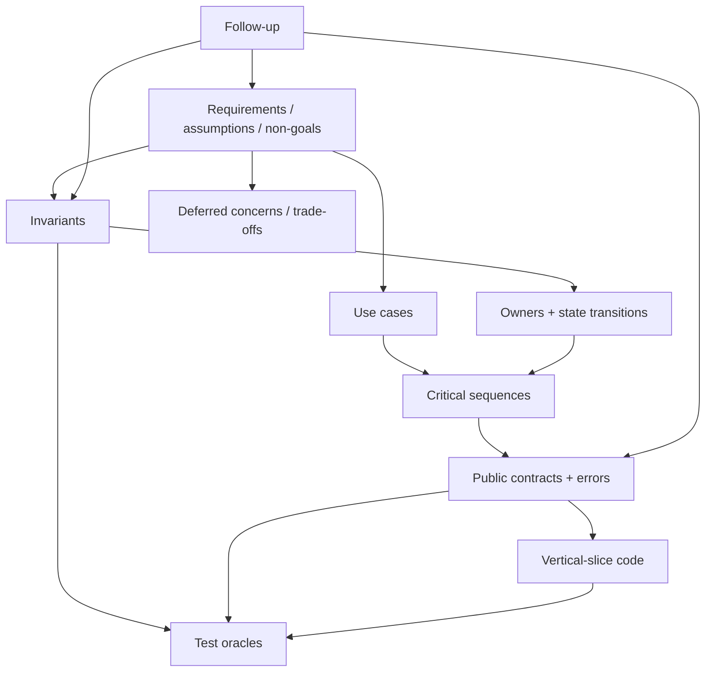
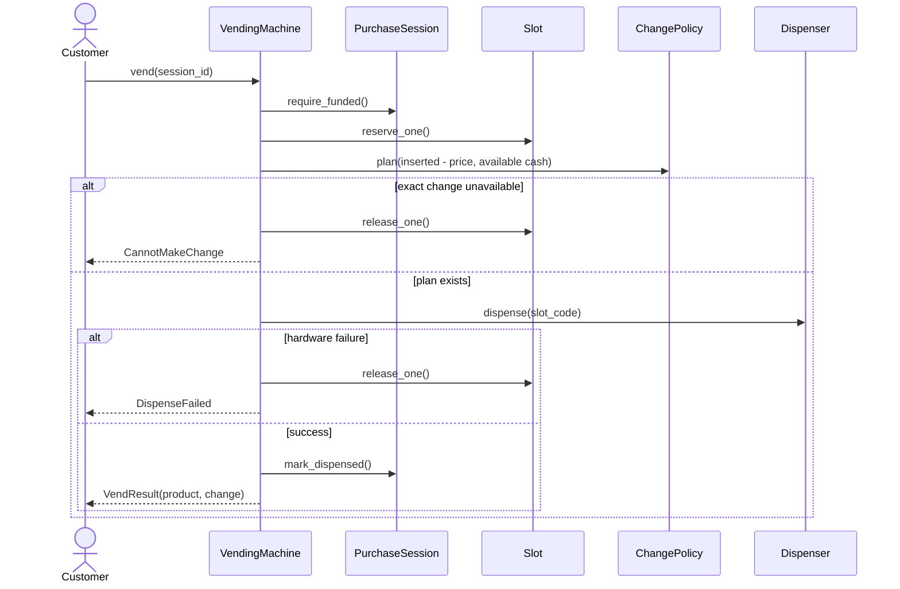

# Topic 15 - Interview Execution, Problem Practice, and Readiness

[Curriculum index](../README.md) | [Preparation roadmap](../roadmap.md) |
[Previous topic](./14-testing-low-level-designs.md)

- **Category:** Synthesis, deliberate practice, interview performance, and final
  assessment
- **Difficulty:** Advanced
- **Priority:** Essential
- **Prerequisites:** Topics 1-14 and repeated implementation practice
- **Running example:** Taking an unfamiliar Vending Machine prompt from a bounded
  interview contract to a tested vertical slice, then adapting it for refunds,
  exact change, and concurrent use
- **Output:** A repeatable 45-60 minute execution system, a balanced problem
  portfolio, scored mock evidence, a weakness-remediation loop, and an honest
  readiness decision

## Outcome

After completing this topic, you should be able to:

- identify the exact interview format, output, and time constraint before
  designing;
- convert an ambiguous prompt into bounded must-have use cases, assumptions,
  invariants, and explicit non-goals;
- select the smallest useful model and explain responsibility ownership;
- walk through the critical success and failure sequences before coding;
- implement a runnable vertical slice without losing the domain model;
- choose a few tests that prove the highest-risk behavior;
- discuss concurrency, persistence, APIs, and patterns only where the prompt
  makes them relevant;
- narrate decisions, uncertainties, and trade-offs without narrating every
  keystroke;
- detect when you are behind and reduce scope without breaking the core contract;
- recover from mistakes visibly and professionally;
- handle requirement changes by identifying affected contracts and invariants;
- choose practice problems by capability gap rather than product name;
- use deliberate practice, spaced repetition, and interleaving instead of passive
  solution consumption;
- run realistic mocks, score them consistently, and separate hints from
  independent performance;
- turn every weak mock category into a small targeted drill;
- measure trends without gaming scores or counting familiar repetitions as new
  evidence;
- distinguish topic completion from interview readiness; and
- decide whether you are ready using repeatable evidence rather than confidence
  alone.

## Core idea

An LLD interview is a constrained delivery exercise, not a memory test for class
diagrams. You must make the problem smaller, preserve its essential rules,
produce observable progress, and collaborate clearly while time and information
are limited.

Preparation therefore has two feedback loops:

```text
Knowledge loop: learn -> explain -> model -> implement -> test -> adapt
Performance loop: attempt -> score -> diagnose -> drill -> retry -> verify
```

The first develops capability. The second makes that capability reliable under
interview conditions. Reading all chapters completes the curriculum content; it
does not, by itself, pass the readiness gate.

## Scope boundary

This chapter covers low-level design, object modeling, machine-coding, and hybrid
rounds. It does not teach company-specific hiring processes, behavioral
interviews, resume strategy, compensation negotiation, or distributed-system
architecture. When a prompt becomes system design, state the boundary and adapt
the level of detail rather than pretending the rounds are identical.

## 1. Learn

### 1.1 Identify the interview contract first

Before solving, establish:

- total time and whether questions are included in it;
- expected output: discussion, UML, code sketch, runnable code, or tests;
- allowed language, editor, libraries, and execution environment;
- whether persistence, concurrency, APIs, or UI are expected;
- whether the interviewer will introduce follow-up changes; and
- how much correctness versus breadth the round rewards.

A beautiful design that misses the requested artifact is incomplete.

### 1.2 LLD formats require different allocations

| Format | Primary evidence | Typical adjustment |
|---|---|---|
| Discussion/design | responsibilities, relationships, flows, trade-offs | spend more time on model and alternatives |
| Code sketch | coherent contracts and critical methods | omit setup but keep types and invariants precise |
| Machine coding | runnable behavior, structure, tests | reserve most time for a vertical slice |
| Hybrid | model plus selected implementation | explicitly agree which path will be coded |
| Take-home | production-like quality and documentation | add tooling, packaging, broader tests, and polish |

Do not carry one fixed minute-by-minute plan into every format.

### 1.3 Know what is actually evaluated

Most rounds sample several dimensions:

- requirements and scope control;
- domain vocabulary and responsibility ownership;
- relationships, state, and interaction flow;
- interfaces and dependency direction;
- invariants, errors, and failure behavior;
- appropriate extensibility;
- language and code quality;
- test selection and testability;
- trade-offs and adaptation; and
- communication and time management.

The repository's [mock-interview rubric](../practice/mock-interview-rubric.md)
makes these dimensions explicit.

### 1.4 Correctness precedes elegance

Prioritize in this order:

1. satisfy the agreed must-have use case;
2. prevent the highest-damage invalid state;
3. make the critical path coherent and testable;
4. handle its important boundary/failure case;
5. add a genuine variation seam;
6. polish names and secondary structure.

An elegant hierarchy that cannot complete the core workflow scores poorly.

### 1.5 Completeness is contractual, not encyclopedic

A solution is complete for the interview when it satisfies the agreed boundary.
It need not implement every feature a real product has. State what is omitted and
why. Scope control is evidence of judgment, not lack of ambition.

### 1.6 Use a visible execution loop

At every stage, make four things observable:

```text
Current goal -> artifact produced -> decision made -> next highest-risk step
```

This lets the interviewer correct a misunderstanding early and gives partial
credit even if time ends.

### 1.7 A practical 45-60 minute budget

Use this default, then adapt to the interview contract:

| Stage | Target | Deliverable |
|---|---:|---|
| Restate and clarify | 5-8 min | bounded requirements, assumptions, non-goals |
| Model responsibilities | 8-10 min | objects, owners, relationships, state |
| Define interactions | 5-8 min | contracts and critical success/failure sequence |
| Implement critical path | 20-25 min | runnable or logically complete vertical slice |
| Test, review, adapt | 5-10 min | risk tests, trade-offs, follow-up impact |

Treat these as checkpoints, not timers that force an unfinished sentence.

### 1.8 Timebox uncertainty, not thinking

If a decision is reversible and low impact, state the assumption and continue.
Spend discussion time on decisions that affect invariants, public contracts,
data ownership, or the required output.

### 1.9 Start by restating the outcome

Use one or two sentences:

> I will design a vending machine that lets one customer select an available
> product, insert supported denominations, vend only after sufficient payment,
> return deterministic change when possible, and cancel before vending. I will
> keep hardware and durable accounting behind interfaces.

The restatement reveals misunderstandings before they become classes.

### 1.10 Ask high-information questions

Prefer questions whose answers change the model:

- Is one purchase active per machine or can sessions overlap?
- Must exact change be guaranteed before accepting payment?
- May product price change during an active purchase?
- What happens when dispensing fails after payment?
- Are refill and maintenance operations part of this round?

Avoid spending minutes on branding, UI labels, or speculative features.

### 1.11 Classify requirements while listening

Keep separate lists for:

- must-have use cases;
- business rules and invariants;
- alternate and failure flows;
- quality requirements;
- external dependencies;
- assumptions;
- out-of-scope behavior; and
- likely follow-ups.

The [design-brief template](../templates/design-brief-template.md) provides this
structure.

### 1.12 Convert ambiguity into an explicit assumption

A useful assumption is specific, visible, and reversible:

> For version one, the machine owns a single active purchase session. That makes
> operations serial. If concurrent sessions are required, I will introduce a
> session ID and protect inventory reservation per slot.

Silently guessing is risky; repeatedly asking permission for every detail stalls
the interview.

### 1.13 State non-goals early

Examples for a Vending Machine round:

- no remote fleet management;
- no dynamic promotions;
- no physical motor protocol implementation;
- no database schema unless persistence is requested;
- no optimal coin-change proof beyond the stated denomination policy.

Non-goals prevent the model from expanding accidentally.

### 1.14 Extract domain vocabulary before classes

Useful terms might be Product, Slot, Selection, PurchaseSession, Denomination,
CashInventory, Dispense, Change, Refund, and MachineState. Give each term one
meaning. Avoid generic names such as Manager, Data, Helper, or Processor until a
real responsibility demands them.

### 1.15 Write invariants as executable sentences

Examples:

- stock never becomes negative;
- one physical item is dispensed at most once;
- collected value plus returned change equals inserted value;
- a session cannot vend before sufficient valid payment;
- cancellation cannot occur after a successful dispense;
- a failed dispense does not silently become a completed sale.

These sentences guide owners, methods, errors, and tests.

### 1.16 Rank invariants by damage

Protect money loss, duplicate allocation, unauthorized transition, and corrupted
ownership before cosmetic ordering or reporting rules. Under time pressure, the
ranking determines which paths must be implemented and tested.

### 1.17 Identify the owner of each invariant

| Invariant | Likely owner |
|---|---|
| stock cannot be negative | Slot or Inventory |
| session transition legality | PurchaseSession |
| inserted/change conservation | Money/CashInventory or vending workflow |
| one active session | VendingMachine application boundary |
| hardware error translation | Dispenser adapter |

If everyone can update a rule's state directly, nobody truly owns it.

### 1.18 Model responsibilities, not nouns from the prompt

A noun becomes a class only when it owns state, behavior, identity, or a useful
contract. `Button`, `Display`, and `Customer` may be actors or adapters rather
than domain entities. `VendingMachineManager` is not justified merely because a
service layer feels familiar.

### 1.19 Separate entity, value, policy, and workflow roles

- **Entity:** identity and lifecycle, such as PurchaseSession.
- **Value:** immutable semantic value, such as Money or Selection.
- **Policy:** replaceable decision, such as ChangeStrategy.
- **Workflow/application service:** coordinates owners and external effects.

This vocabulary makes class choices explainable without pattern recitation.

### 1.20 Draw only relationships that affect behavior

Show ownership/composition, lifecycle dependency, important cardinality, and
direction of collaboration. Do not spend time drawing getters, primitive fields,
or every import.

### 1.21 Model lifecycle explicitly when order matters

For a purchase session:

```text
CREATED -> SELECTED -> FUNDED -> DISPENSED
   |          |          |
   +----------+----------+-> CANCELLED
                         +-> DISPENSE_FAILED
```

Then specify legal operations and terminal states. An enum without guarded
transitions is only a label.

### 1.22 Use a state table to expose missing behavior

| Current state | Operation | Guard | Outcome |
|---|---|---|---|
| CREATED | select | slot has stock | SELECTED; price snapshot |
| SELECTED | insert | denomination supported | balance increases |
| SELECTED | vend | balance below price | reject; state unchanged |
| FUNDED | vend | change possible | DISPENSED; stock decreases once |
| any pre-vend | cancel | not terminal | CANCELLED; refund inserted value |
| terminal | any mutation | always | reject or idempotent query |

Tables reveal illegal paths faster than prose alone.

### 1.23 Define narrow public contracts

For each important operation, state:

- inputs and semantic types;
- preconditions;
- returned result;
- state change;
- domain errors;
- external effects; and
- retry/idempotency behavior when relevant.

The signature is not the complete contract.

### 1.24 Walk one critical success sequence

Before coding, narrate:

1. caller selects a slot;
2. machine verifies availability and snapshots price;
3. caller inserts supported denominations;
4. session records value without exposing mutable collections;
5. vend verifies funding and change feasibility;
6. inventory reserves/decrements exactly one item;
7. dispenser performs the external effect;
8. cash and change are finalized;
9. session becomes terminal and result is returned.

This walk catches missing owners and bad dependency direction.

### 1.25 Walk one critical failure sequence

Choose the highest-risk boundary, such as dispense failure:

1. stock is reserved but not permanently consumed;
2. dispenser reports failure;
3. session records a retryable/failed state;
4. inserted money remains refundable or is compensated;
5. stock is released;
6. a repeated command cannot double-refund or double-dispense.

If you cannot explain failure ordering, implementation is premature.

### 1.26 Distinguish domain and infrastructure errors

`OutOfStock`, `InsufficientFunds`, and `CannotMakeChange` are domain outcomes.
Motor timeouts and database disconnects originate at adapters and should be
translated at the boundary. Do not expose raw technology exceptions as the
domain model.

### 1.27 Select patterns after variation appears

Use Strategy if change calculation genuinely varies, State if behavior is
complex enough to benefit from state objects, Adapter for hardware/provider
translation, Observer for requested notifications, and Repository for a real
persistence boundary. A simple guarded enum and one change policy may be enough.

### 1.28 Explain why a pattern is absent

Strong judgment often sounds like:

> The lifecycle has four small guarded transitions, so I will keep it in the
> entity. If state-specific behavior grows independently, State becomes useful.

This is more credible than forcing every named pattern into the model.

### 1.29 Choose a vertical slice

A vertical slice crosses the smallest set of layers needed to prove one valuable
behavior. For Vending Machine:

```text
select -> insert -> vend -> inventory update -> returned change -> exact tests
```

It is preferable to many empty classes and unfinished method signatures.

### 1.30 Build the walking skeleton first

Create only what the vertical slice requires:

1. semantic values and errors;
2. core entity with invariant-preserving operations;
3. one policy interface plus default implementation if variation is required;
4. application workflow;
5. controlled external adapter/fake;
6. one executable example/test.

Keep the program runnable after each small step.

### 1.31 Type semantic values early

Money, IDs, time ranges, coordinates, and quantities deserve explicit types when
primitive confusion would threaten correctness. Do not spend the whole interview
building a generic validation framework.

### 1.32 Make invalid states hard to construct

Validate at creation and transition boundaries. Use immutable values and
read-only views where possible. Do not build an object with placeholder `None`
fields and hope later steps make it valid.

### 1.33 Keep dependencies visible

Inject Clock, ID source, payment/hardware ports, repositories, and policies when
their behavior matters. Hidden global construction makes tests and follow-ups
hard. Avoid dependency injection containers in a small round; constructor
injection is usually sufficient.

### 1.34 Implement behavior before general infrastructure

Do not begin with BaseRepository, EventBus, abstract factories, configuration
loaders, or a package hierarchy. First prove the core rule. Extract a reusable
boundary only when the prompt or a follow-up makes it necessary.

### 1.35 Name for the domain while coding

Prefer `reserve_item`, `inserted_total`, `can_make_change`, and
`DispenseFailed` over `process`, `amount2`, `check`, and `Exception`. Good names
reduce the narration required to explain code.

### 1.36 Preserve one direction of control

Application workflow calls domain owners and ports; adapters implement ports;
domain objects do not import infrastructure. If the model requires circular
calls or public mutation across objects, pause and repair ownership.

### 1.37 Do not hide important effects in constructors

Constructors should establish valid objects, not charge money, vend products,
start threads, or connect to remote systems. Explicit commands make sequencing,
errors, and tests visible.

### 1.38 Compile or run early

Within the first half of implementation time, execute the smallest slice. Syntax,
imports, signatures, and false assumptions are cheaper to correct early than in
the final minute.

### 1.39 Test by risk under interview constraints

Usually select three to six exact tests:

- one critical success;
- one boundary;
- one illegal transition/invalid input;
- one external failure with no partial effect;
- one idempotency or concurrency case if required; and
- one policy/variation case.

State what a real database/provider/concurrency test would still be needed to
prove.

### 1.40 Use tests as communication

A compact test can explain the contract faster than prose:

```python
def test_vend_rejects_insufficient_funds_without_consuming_stock() -> None:
    machine = machine_with(slot="A1", price="1.50", stock=1)
    session = machine.start_purchase()
    session.select("A1")
    session.insert("1.00")

    with raises(InsufficientFunds):
        session.vend()

    assert machine.stock_for("A1") == 1
    assert session.inserted_total == Money("1.00")
```

In real `unittest`, use `self.assertRaises`; the example emphasizes the oracle.

### 1.41 Keep test helpers proportionate

Use one small builder/fake if it removes irrelevant setup. Do not create a test
framework during a 60-minute solution. Exact literals are acceptable when they
make the scenario clearer.

### 1.42 Discuss concurrency only after locating shared state

Name the resource, invalid interleaving, atomic boundary, and enforcement
mechanism. For example: two sessions can observe the last item; reservation plus
stock decrement must be one atomic operation protected in memory or by a durable
conditional update. Saying "make it thread-safe" is not a design.

### 1.43 Discuss persistence as a semantic boundary

If requested, explain aggregate save boundaries, unique constraints, optimistic
versioning or locks, transactions, idempotency keys, and what must be tested
against the real database. Avoid drawing tables before the domain rules are
clear.

### 1.44 State complexity where it informs a decision

Mention time/space complexity for scheduling, matching, cache eviction, change
selection, searches, or graph/tree operations. Do not mechanically report O(1)
for every getter.

### 1.45 Keep a parking lot for deferred concerns

Maintain a short visible list such as:

```text
Deferred: durable audit, multi-machine fleet, motor retries, admin authorization
```

This shows awareness without interrupting the critical path.

### 1.46 Narrate decisions, not keystrokes

Useful narration connects evidence:

> Stock owns the non-negative invariant, so the service requests an atomic
> reservation rather than decrementing a public field.

Low-value narration repeats syntax:

> Now I am writing an if statement and then returning false.

### 1.47 Use a decision sentence

A concise structure is:

```text
Because <requirement/risk>, I will <decision>, which gives <benefit>;
the trade-off is <cost/limitation>, and I would revisit it when <trigger>.
```

This makes reasoning easy to evaluate.

### 1.48 Surface uncertainty honestly

Say what you know, what is missing, and the safe assumption:

> Provider behavior after a timeout is unknown. I will treat the result as
> indeterminate and require an idempotency key/status lookup rather than retrying
> a charge blindly.

Do not invent certainty to sound confident.

### 1.49 Check alignment at natural boundaries

Ask concise questions after the brief or critical sequence:

> I have bounded version one to a single active purchase and isolated hardware.
> Does that match the intended scope before I implement the vend path?

Constantly asking "Is this okay?" transfers design responsibility to the
interviewer.

### 1.50 Treat hints as new information

Listen, restate the implication, and update the design. Do not defend sunk work.
For practice records, classify guidance honestly: clarification, minor nudge,
major hint, or solution-providing intervention.

### 1.51 Recover visibly from a wrong turn

Use this sequence:

1. name the violated requirement or invariant;
2. stop expanding the faulty design;
3. identify the smallest affected boundary;
4. state the correction and trade-off;
5. repair the critical path;
6. add or describe the regression test.

Professional recovery can be stronger evidence than hiding the mistake.

### 1.52 Use time checkpoints

At roughly 10, 20, 40, and 50 minutes ask:

- Is scope frozen?
- Is the critical sequence coherent?
- Does a runnable/logically complete slice exist?
- Is the highest-risk test present?
- What must be summarized or explicitly deferred?

Checkpoints prevent invisible overinvestment.

### 1.53 Apply a scope ladder when behind

Reduce in this order:

1. omit secondary use cases;
2. describe rather than implement peripheral adapters;
3. choose one concrete policy while preserving its seam only if required;
4. write fewer, higher-value tests;
5. simplify persistence/concurrency to a clearly stated boundary;
6. never remove the core invariant or pretend unfinished behavior works.

### 1.54 Finish a coherent slice before adding breadth

At minute 40, one tested workflow is better than ten disconnected classes.
Complete the state change, return value, and failure behavior before adding
search, reporting, admin operations, or secondary patterns.

### 1.55 Reserve a closing minute

Summarize:

- agreed scope and completed workflow;
- central objects and invariant owners;
- important boundary/failure treatment;
- test evidence;
- deliberate trade-offs/limitations; and
- how the design handles the requested follow-up.

Do not end with an unexplained cursor in an unfinished method.

### 1.56 Treat a follow-up as a change-impact test

Before editing, identify:

```text
new/changed rule -> affected owner -> public contract -> workflow/effect order
                 -> persistence/concurrency implication -> regression/new tests
```

Then make the smallest coherent change. A follow-up tests whether your boundaries
match reasons to change.

### 1.57 Classify follow-ups

Common types include:

- new policy or algorithm;
- new state/transition;
- optional feature or decorator;
- new external provider/adapter;
- persistence requirement;
- concurrency/scale requirement;
- audit/event requirement;
- API compatibility change; and
- failure/retry/idempotency requirement.

Classification helps locate the seam without guessing a pattern.

### 1.58 Do not claim every follow-up is easy

A good answer can say that a new requirement crosses the current boundary and
requires a deliberate redesign. Explain which assumptions changed. Honest impact
analysis is better than claiming unlimited extensibility.

### 1.59 Distinguish practice modes

| Mode | Time pressure | Help allowed | Primary goal |
|---|---:|---|---|
| Learn | none | chapters/solutions | understand a capability |
| Focused drill | 5-25 min | narrow references after attempt | repair one weakness |
| Full practice | flexible | review afterward | integrate end to end |
| Timed mock | realistic | interviewer only | measure performance |
| Assessment mock | realistic | no major hints | establish readiness evidence |

Do not count a guided learning attempt as an unseen assessment.

### 1.60 Choose problems by capability family

Product names can hide duplicates. Build coverage across:

- resource allocation/reservation;
- state machine/device workflow;
- strategy/policy calculation;
- scheduling/dispatch;
- ledger/money/accounting;
- hierarchy/composition;
- cache/data structure;
- file/tree system;
- event/notification/pub-sub;
- rate limiting/concurrency;
- persistence/transaction/recovery; and
- rules/workflow engine.

Uber and Ola are usually one family; a cache and an ATM are not.

### 1.61 Maintain a capability matrix

Track which attempt exercised which capabilities:

| Problem | Scope | Model | State | Money | Concurrency | Persistence | Tests | Follow-up |
|---|---:|---:|---:|---:|---:|---:|---:|---:|
| Vending Machine | ✓ | ✓ | ✓ | ✓ | partial | no | ✓ | exact change |
| Job Scheduler | ✓ | ✓ | ✓ | no | ✓ | partial | ✓ | recurring jobs |

A gap column should determine the next problem.

### 1.62 Count independent work, not exposure

Reading a repository solution, copying a tutorial, or reproducing memorized
classes is study, not independent problem evidence. Count a design when you
created it before comparison and can explain/adapt it without the source.

### 1.63 Use a three-pass problem method

For important problems:

1. **Design pass:** brief, model, sequence, contracts, tests, trade-offs.
2. **Implementation pass:** runnable critical workflows and tests.
3. **Timed adaptation pass:** unseen variation under interview conditions.

The passes may occur on different days to reduce memory effects.

### 1.64 Interleave problem families

Do not solve five reservation systems consecutively. Alternate stateful device,
allocation, ledger, scheduling, and reusable-component prompts. Interleaving
forces recognition instead of template matching.

### 1.65 Space repetitions

Revisit a weak problem after enough time that reconstruction is required. A
possible cadence is one day, one week, and three weeks, adjusted by performance.
Record whether the second attempt improved independently.

### 1.66 Compare only after committing your design

Before reading a reference:

- save the brief/model/code/tests;
- list uncertainties and trade-offs;
- predict where the reference may differ.

Afterward classify differences as correctness defects, missing cases, valid
alternatives, unnecessary complexity, or context-dependent choices.

### 1.67 Convert every mistake into a drill

Examples:

| Mock symptom | Root skill | Next drill |
|---|---|---|
| 15 minutes clarifying | prioritization | five 6-minute design briefs |
| god service | ownership | assign ten invariants to owners |
| unfinished code | slicing | three 20-minute vertical slices |
| weak tests | oracle selection | build risk matrices for five workflows |
| follow-up rewrite | change seams | apply three policy/state/boundary changes |
| silent interview | communication | record and review one narrated solution |

Do not prescribe another full problem when a 15-minute drill targets the cause.

### 1.68 Keep an error taxonomy

Useful categories:

- misunderstood requirement;
- missing invariant;
- wrong responsibility owner;
- invalid lifecycle;
- poor contract/error model;
- premature pattern/infrastructure;
- language/implementation defect;
- weak oracle/test gap;
- concurrency/persistence blind spot;
- time/scope failure; and
- unclear communication.

Trend the category, not merely the total score.

### 1.69 Run mocks under realistic constraints

Match the target format: time, editor, documentation access, execution ability,
screen sharing, interruption, and expected artifact. A relaxed two-hour exercise
does not predict a 50-minute machine-coding round.

### 1.70 Define interviewer behavior before a mock

The interviewer should:

- provide only the initial prompt and agreed clarifications;
- answer consistently without designing for the candidate;
- record timestamps, questions, hints, and observed evidence;
- introduce the planned follow-up at a fixed stage;
- avoid teaching during the attempt; and
- debrief only after time ends.

### 1.71 Distinguish clarification from a hint

- **Clarification:** supplies domain information unavailable in the prompt.
- **Minor nudge:** points attention to a missing area without giving the design.
- **Major hint:** supplies the key invariant, owner, algorithm, or correction.
- **Solution intervention:** provides enough design/code that independence is
  lost.

Readiness attempts may contain normal clarifications but no major hints.

### 1.72 Score behavior, not presentation style

Use observable artifacts and decisions. A charismatic explanation cannot replace
a missing invariant; quiet but clear reasoning should not be penalized for not
performing theatrically.

### 1.73 Use critical failures as gates

Regardless of total points, a mock fails when it cannot satisfy a must-have use
case, bypasses a major invariant, is incoherent in the chosen language, leaves a
serious double-booking/payment/data-loss path, cannot handle a small change, or
depends on solution-providing guidance.

### 1.74 Debrief facts before feelings

Immediately record:

- completed and missing artifacts;
- stage timestamps;
- tests run and results;
- hints received;
- rubric evidence;
- first critical failure or bottleneck;
- one thing to retain; and
- one highest-leverage repair.

Then add subjective notes such as stress or confidence.

### 1.75 Keep feedback specific and actionable

Weak feedback: "Model better."

Useful feedback: "Seat ownership was updated publicly from both BookingService
and Show; assign the hold invariant to ShowSeat and expose one atomic hold
operation. Drill ownership on three reservation prompts."

### 1.76 Track trends over multiple unseen mocks

One high score may reflect familiarity or luck. Look for:

- stable total and category scores;
- no recurring critical failure;
- fewer/lower-severity hints;
- completed critical paths;
- improved time distribution; and
- successful follow-up adaptation.

### 1.77 Separate speed from haste

Speed comes from a practiced workflow and reusable reasoning. Haste skips
invariants, uses primitives carelessly, or begins code without a critical
sequence. Track rework as well as finish time.

### 1.78 Readiness is repeatable independence

The final threshold in this repository is:

- every essential topic mastery gate passed;
- at least 12 varied problems designed independently;
- at least 8 implemented end to end with tests;
- at least 5 timed mocks;
- three consecutive unseen mocks scoring at least 80/100, with no critical
  failure and no major hint;
- at least 3 mocks with requirement-change follow-ups; and
- normal core work complete within 45-60 minutes.

These are minimum evidence requirements, not guarantees of a hiring outcome.

### 1.79 Topic completion and personal readiness differ

When this chapter is written, the Bible is structurally complete. Your own
checkboxes remain evidence tasks. Never convert repository progress into a claim
that an individual has passed the gates.

### 1.80 Adapt preparation to the target role

Increase emphasis based on the job:

- backend: transactions, APIs, concurrency, failure recovery;
- platform: reusable components, scheduling, resource ownership;
- application/product: workflows, state, integrations, change pressure;
- senior roles: ambiguity, trade-offs, evolution, coaching-level explanation;
- machine-coding rounds: runnable code, tests, package structure, finish rate.

Keep the core readiness gate; change the practice mix.

### 1.81 Know when to stop adding theory

If chapter quizzes are strong but mocks are weak, more reading is probably not
the bottleneck. Move to timed attempts and targeted drills. If repeated mocks
expose the same conceptual gap, return to that specific topic.

### 1.82 Use the day before an interview carefully

Prefer:

- one short workflow rehearsal;
- review of your own error log and decision vocabulary;
- environment/tool check;
- sleep and logistics; and
- no new large topic or marathon mock.

Cramming unfamiliar patterns can destabilize a reliable process.

### 1.83 Start the interview with operational clarity

Confirm audio/screen/editor, restate the requested output, keep time visible,
and write assumptions where both people can see them. Small operational friction
should not consume the modeling window.

### 1.84 When stuck, return to evidence

Ask:

1. What must the system do?
2. What must never happen?
3. Who owns that rule?
4. What is the smallest end-to-end sequence?
5. What result or test would prove it?

This is more reliable than searching memory for a diagram.

### 1.85 Close with limitations, not apologies

Say:

> The implemented slice covers selection, funding, exact vend, cancellation, and
> dispenser failure. Durable audit and multi-session reservation are explicit
> next boundaries; I would add a transaction/idempotency design before claiming
> those properties.

This communicates engineering judgment without pretending the system is
production-complete.

## 2. Recognize

### 2.1 Recognize the expected depth

| Prompt phrase | Likely emphasis | Confirm before proceeding |
|---|---|---|
| "Design the classes" | responsibilities and relationships | code sketch or diagram only? |
| "Implement" / "machine code" | runnable vertical slice and tests | packages, persistence, UI required? |
| "Extensible design" | named variation points and follow-up | which changes are expected? |
| "Production ready" | robustness and operational boundaries | what can fit in the allotted time? |
| "Thread safe" | shared resource and atomicity | threads, processes, or durable concurrency? |
| "Persistent" | repository/transaction semantics | real database or interface discussion? |
| "Scalable" | possible system-design crossover | local object design or distributed architecture? |

Ask rather than silently selecting the wrong level.

### 2.2 Recognize problem families

| Family | Common prompts | Central risks |
|---|---|---|
| allocation/reservation | Parking, Hotel, Ticketing | exclusivity, expiry, release, double allocation |
| device/state machine | ATM, Vending, Elevator | legal order, hardware failure, recovery |
| ledger/accounting | Splitwise, Wallet, Expense | exact money, conservation, settlement, idempotency |
| matching/dispatch | Cab, Delivery | eligibility, scoring, assignment race, retry |
| scheduling | Calendar, Jobs, Airline | overlap, priority, recurrence, cancellation |
| collection/cache | LRU/LFU/TTL, File System | invariants, complexity, eviction/expiry |
| rules/policies | Coupon, Pricing, Workflow | composition, precedence, explainability |
| event/notification | Pub-Sub, Logger, Alerts | fan-out, ordering, retry, observer failure |

The family predicts useful questions, not a class template.

### 2.3 Recognize invariant signals

Words such as exactly once, at most one, cannot exceed, must equal, only after,
until, expires, exclusive, atomic, refund, and retry usually imply an invariant,
state transition, or consistency boundary. Write the rule before choosing the
owner.

### 2.4 Recognize policy signals

Words such as nearest, cheapest, priority, fair, percentage, dynamic, pluggable,
different types, and configurable suggest a replaceable policy. Confirm whether
multiple implementations are required now or merely plausible later.

### 2.5 Recognize boundary signals

Payment provider, hardware, clock, filesystem, database, queue, email/SMS, map
service, and external API suggest ports/adapters and failure translation. They do
not automatically require a framework or remote implementation.

### 2.6 Recognize lifecycle signals

Status names, "after", "before", "once", cancel, expire, retry, activate, pause,
complete, and reopen imply a transition table. Ask which operations are legal
from each state and whether terminal commands are rejected or idempotent.

### 2.7 Recognize concurrency signals

The following indicate shared-state races:

- last seat/item/room;
- one driver/worker assigned once;
- limited campaign or rate-limit quota;
- duplicate callbacks/commands;
- simultaneous balance updates; and
- background expiry competing with confirmation.

Name the exact bad interleaving before proposing a lock.

### 2.8 Recognize persistence signals

Restart, durable, history, audit, resume, multiple instances, webhook retry,
migration, and exactly-once effect require more than in-memory collections.
Separate repository shape from transaction/recovery guarantees.

### 2.9 Recognize overengineering early

Warning signs include:

- more abstractions than behaviors;
- interfaces with one implementation and no requirement-driven seam;
- pattern names appearing before business rules;
- generic repositories/events/configuration before a working flow;
- inheritance mirroring every noun category; and
- explaining hypothetical scale while the core use case is incomplete.

### 2.10 Recognize an anemic model

If every domain object is a public data bag and one service validates every rule,
responsibility ownership is missing. Move state-dependent rules to the state
owner while keeping cross-aggregate/external coordination in the application
workflow.

### 2.11 Recognize false progress

Many files, a polished diagram, generated boilerplate, or a large test count can
hide a missing critical workflow. Observable progress is a satisfied contract,
preserved invariant, executable slice, or trustworthy test.

### 2.12 Recognize when clarification is complete enough

Begin modeling when you know:

- the primary actor/outcome;
- two to four must-have use cases;
- the highest-risk rules;
- major external boundaries;
- relevant quality constraints; and
- explicit version-one exclusions.

Unknown low-impact details can remain stated assumptions.

### 2.13 Recognize when the model is ready for code

You should be able to answer:

- who owns each critical state;
- which operation protects each invariant;
- what the critical sequence calls in order;
- which errors/results cross each boundary; and
- where a likely follow-up would change behavior.

If the sequence still mutates fields directly, repair the model first.

### 2.14 Recognize when to simplify

Simplify when the time checkpoint is missed, the same concept has multiple
representations, no runnable path exists halfway through coding time, or a
secondary feature blocks the primary behavior. Preserve correctness and state
what is deferred.

### 2.15 Recognize when to deepen

Deepen when the interviewer explicitly probes atomicity, provider failure,
durability, algorithm complexity, multi-instance behavior, API evolution, or a
specific follow-up. Answer the requested risk with an appropriate boundary and
evidence plan.

### 2.16 Recognize healthy interviewer collaboration

Healthy collaboration includes concise checkpoints, visible assumptions,
questions that affect the design, responsive adaptation, and independent
decisions. It does not mean waiting for approval before every class or debating
feedback.

### 2.17 Recognize a weak practice portfolio

A portfolio is weak when most problems are renamed reservations, implementations
were copied, concurrency/persistence are only discussed, tests are added after
reading solutions, or there are no timed follow-ups. More problem count will not
fix missing diversity or independence.

### 2.18 Recognize real readiness

Readiness looks like stable performance on unseen prompts, no recurring critical
failure, a complete critical slice, exact tests, bounded scope, recoverable
mistakes, clear trade-offs, and a follow-up handled without wholesale rewriting.
Feeling familiar with common diagrams is not sufficient.

## 3. Model the interview and preparation system

### 3.1 Interview execution flow

```mermaid
flowchart LR
    P[Prompt + interview contract] --> B[Bounded design brief]
    B --> M[Responsibilities + invariant owners]
    M --> S[Critical success/failure sequence]
    S --> V[Runnable vertical slice]
    V --> T[Risk-selected tests]
    T --> F[Follow-up impact + adaptation]
    F --> C[Closing summary]
    B -. alignment .-> P
    S -. repair model .-> M
    T -. defect found .-> V
```



Back edges are normal. Keep them small by validating each artifact early.

### 3.2 Artifact dependency map



Classes are downstream artifacts. Starting from classes severs these reasoning
links.

### 3.3 Default timeline with exit criteria

| By minute | Minimum exit evidence |
|---:|---|
| 5-8 | outcome, must-haves, assumptions, non-goals, top invariants |
| 15-18 | owners, relationships, state/lifecycle, selected seam |
| 20-25 | success/failure sequence and method contracts |
| 40-48 | critical path runnable or logically complete |
| 50-55 | highest-risk tests and defects addressed |
| 55-60 | follow-up/trade-offs/limitations and summary |

For a 45-minute round, compress the same stages; do not delete clarification or
the closing review entirely.

### 3.4 Prompt-triage decision table

| Condition | Action |
|---|---|
| output unspecified | ask whether discussion, sketch, or runnable code is expected |
| broad product prompt | propose two to four must-have flows and explicit non-goals |
| algorithm dominates | clarify complexity/data-size requirement before object model |
| external effect dominates | define port, failure result, idempotency/recovery expectation |
| concurrency named | identify shared state, race, atomic boundary, proof |
| persistence named | define transaction/constraint semantics before schema detail |
| follow-up promised | preserve time and keep decisions/change triggers visible |
| interviewer redirects | restate new priority and re-scope immediately |

### 3.5 Scope stack

Use four levels:

```text
Must implement  -> core acceptance path and major invariant
Should implement -> important boundary/failure if time permits
Will explain     -> relevant production boundary outside runnable slice
Out of scope     -> deliberately excluded for this contract
```

Move items between levels visibly when time or interviewer priority changes.

### 3.6 Requirement-to-evidence matrix

| Claim | Owner/boundary | Implementation evidence | Test/discussion evidence |
|---|---|---|---|
| no negative stock | Slot | guarded atomic reserve | last-item success + loser unchanged |
| insufficient funds cannot vend | PurchaseSession | state/amount precondition | exact rejection and unchanged stock |
| change conserves value | ChangePolicy/CashInventory | exact Decimal calculation | inserted = price + returned |
| dispenser failure is recoverable | workflow + adapter | explicit failure/compensation | failure injection, no completed sale |
| alternate change strategy | policy contract | injected implementation | shared postconditions |

This matrix prevents tests and trade-offs from becoming an afterthought.

### 3.7 Decision log

Record only consequential choices:

| Decision | Requirement/risk | Trade-off | Revisit when |
|---|---|---|---|
| one active session | version-one interaction model | serializes customers | multiple kiosks/sessions required |
| price snapshot on selection | price consistency | ignores mid-session price update | dynamic repricing is required |
| guarded enum lifecycle | four simple states | central conditional logic | states gain independent behavior |
| injected dispenser | hardware failure boundary | extra interface | always in-memory simulation only |

The log makes follow-up impact fast and defensible.

### 3.8 Risk register

Rank a few failure modes:

| Risk | Impact | Likelihood | Prevention | Evidence |
|---|---:|---:|---|---|
| duplicate vend | very high | medium | terminal transition/idempotency | repeated command test |
| stock below zero | high | medium | atomic reservation | last-item race/boundary test |
| wrong change | high | medium | exact value policy | conservation/property examples |
| motor fails after reserve | high | low | explicit release/recovery state | failing adapter test |
| unsupported coin | low | medium | value validation | boundary test |

Use the ranking to choose implementation and test order.

### 3.9 Critical-sequence worksheet

For each chosen sequence, list:

```text
Actor -> public command -> owner checks -> state mutation -> external effect
      -> result/error -> commit/rollback/compensation -> retry behavior
```

Create at most one success and one high-risk failure sequence before coding.

### 3.10 Change-impact map

| Follow-up | First affected seam | Secondary concerns |
|---|---|---|
| card payment | PaymentPort/workflow | unknown outcomes, refunds, idempotency |
| discounts | PricingPolicy/snapshot | audit and exact money |
| multi-session | session identity/inventory | reservation race, expiry, locking |
| persistent restart | repositories/transactions | recovery, migrations, hardware reconciliation |
| remote fleet | application/API boundary | authentication, events, distributed consistency |
| new coin system | denomination/change policy | contract tests and algorithm feasibility |

The map tests whether boundaries match real reasons to change.

### 3.11 Practice capability matrix

Use `0 = not attempted`, `1 = discussed`, `2 = modeled`, `3 = implemented and
tested`, `4 = demonstrated under a timed follow-up`.

| Capability | Target evidence |
|---|---|
| ambiguity/scope | at least three unseen prompts at level 4 |
| lifecycle/state | two different families at level 3+ |
| money/conservation | one ledger and one transaction workflow at level 3+ |
| allocation race | one deterministic concurrency implementation at level 3+ |
| policy variation | three distinct strategy/decision contexts at level 3+ |
| external failure | two compensation/idempotency workflows at level 3+ |
| persistence | one real transactional adapter at level 3+ |
| follow-up adaptation | three mock changes at level 4 |

Targets complement, not replace, the repository's overall count gates.

### 3.12 Attempt record

Keep one record per independent attempt:

```python
from dataclasses import dataclass, field
from datetime import date


@dataclass(frozen=True, slots=True)
class AttemptRecord:
    attempted_on: date
    problem: str
    family: str
    format: str
    minutes: int
    score: int | None
    unseen: bool
    major_hints: int
    critical_failure: bool
    follow_up: str | None
    strengths: tuple[str, ...] = field(default_factory=tuple)
    weaknesses: tuple[str, ...] = field(default_factory=tuple)
    next_drill: str = ""

    @property
    def independent_pass(self) -> bool:
        return (
            self.unseen
            and self.score is not None
            and self.score >= 80
            and self.major_hints == 0
            and not self.critical_failure
        )
```

Record facts immediately; write the repair before starting another full mock.

### 3.13 Rubric model

The repository rubric totals 100:

```python
RUBRIC_MAX = {
    "requirements_scope": 10,
    "domain_model": 15,
    "relationships_state_flow": 10,
    "interfaces_boundaries": 10,
    "invariants_failures": 10,
    "appropriate_extensibility": 10,
    "code_language": 15,
    "tests_testability": 10,
    "tradeoffs_adaptation": 5,
    "communication_time": 5,
}


def validated_score(points: dict[str, int]) -> int:
    if set(points) != set(RUBRIC_MAX):
        raise ValueError("score every rubric category exactly once")
    for category, maximum in RUBRIC_MAX.items():
        if not 0 <= points[category] <= maximum:
            raise ValueError(f"invalid score for {category}")
    return sum(points.values())
```

A numeric total never overrides a critical failure.

### 3.14 Consecutive-pass calculation

Only the most recent uninterrupted streak counts:

```python
from collections.abc import Iterable


def trailing_independent_passes(attempts: Iterable[AttemptRecord]) -> int:
    streak = 0
    for attempt in reversed(tuple(attempts)):
        if not attempt.independent_pass:
            break
        streak += 1
    return streak
```

A familiar prompt, major hint, critical failure, or score below 80 breaks the
assessment streak. It remains useful practice data.

### 3.15 Weakness-to-drill queue

Prioritize by:

```text
priority = recurrence x interview impact x uncertainty / drill cost
```

Keep one primary drill and at most one secondary drill active. A long backlog
encourages collecting weaknesses instead of fixing them.

### 3.16 Mock evidence bundle

For each assessment mock retain:

- prompt and interview contract;
- timestamped design brief;
- diagram/model and decision log;
- code and test output;
- follow-up request and change;
- rubric with evidence notes;
- hint log and critical-failure decision;
- debrief and next drill; and
- reviewer identity or self-review recording.

The bundle makes readiness auditable rather than aspirational.

## 4. Execute the running example

The goal is to demonstrate the workflow, not to present a universal Vending
Machine solution.

### 4.1 Establish the interview contract

Assume:

- 60 minutes;
- Python 3.10+ runnable core plus selected tests;
- in-memory version one;
- cash denominations provided by the interviewer;
- one active purchase per machine;
- dispenser represented by a port/fake;
- concurrency and durable accounting discussed unless introduced as follow-ups.

If any assumption changes, update the model before coding.

### 4.2 Produce the first-eight-minute brief

**Must-have use cases**

1. Load a slot with product, price, and stock.
2. Start a purchase and select an available slot.
3. Insert supported denominations.
4. Vend when sufficiently funded and change can be returned.
5. Cancel before vending and receive the inserted amount.

**Critical invariants**

- stock is non-negative and one item is consumed at most once;
- an active session has one price snapshot;
- inserted value is exact and never silently lost;
- vending is terminal and cannot repeat the physical effect;
- cancellation and vending are mutually exclusive terminal outcomes.

**Out of scope**

- UI, fleet management, remote telemetry, authentication, durable restart, and
  optimal change for arbitrary denomination systems.

### 4.3 Assign responsibilities

| Type | Responsibility |
|---|---|
| `Money` | exact non-negative amount operations |
| `Product` | immutable product identity/name |
| `Slot` | product/price and non-negative stock invariant |
| `PurchaseSession` | selection, inserted value, lifecycle |
| `ChangePolicy` | compute a feasible exact change plan |
| `CashInventory` | available denomination counts and atomic application plan |
| `Dispenser` | translate/perform the hardware effect |
| `VendingMachine` | coordinate session, slot, cash, and dispenser |

The application boundary coordinates; owners guard their own state.

### 4.4 Model the interaction



Real hardware can produce an unknown outcome after timeout; version one states
that limitation rather than claiming exactly-once physical delivery.

### 4.5 Define semantic values and failures

```python
from dataclasses import dataclass
from decimal import Decimal


class VendingError(Exception):
    pass


class InvalidTransition(VendingError):
    pass


class OutOfStock(VendingError):
    pass


class InsufficientFunds(VendingError):
    pass


class CannotMakeChange(VendingError):
    pass


class DispenseFailed(VendingError):
    pass


@dataclass(frozen=True, order=True, slots=True)
class Money:
    amount: Decimal

    def __post_init__(self) -> None:
        cent = Decimal("0.01")
        if (
            not self.amount.is_finite()
            or self.amount < 0
            or self.amount != self.amount.quantize(cent)
        ):
            raise ValueError("money must be finite, non-negative, and exact cents")

    @classmethod
    def of(cls, value: str) -> "Money":
        return cls(Decimal(value))

    def __add__(self, other: "Money") -> "Money":
        return Money(self.amount + other.amount)

    def __sub__(self, other: "Money") -> "Money":
        if other > self:
            raise ValueError("result cannot be negative")
        return Money(self.amount - other.amount)
```

The real implementation should also define currency if the scope is
multi-currency.

### 4.6 Guard slot stock

```python
from dataclasses import dataclass


@dataclass(frozen=True, slots=True)
class Product:
    product_id: str
    name: str


class Slot:
    def __init__(
        self,
        code: str,
        product: Product,
        price: Money,
        stock: int,
    ) -> None:
        if not code.strip() or stock < 0:
            raise ValueError("invalid slot")
        self.code = code
        self.product = product
        self.price = price
        self._stock = stock
        self._capacity = stock

    @property
    def stock(self) -> int:
        return self._stock

    def reserve_one(self) -> None:
        if self._stock == 0:
            raise OutOfStock(self.code)
        self._stock -= 1

    def release_one(self) -> None:
        if self._stock == self._capacity:
            raise InvalidTransition("no reserved item to release")
        self._stock += 1
```

For concurrent sessions, reserve/release must become one atomic inventory
boundary rather than relying on this unprotected in-memory mutation.

### 4.7 Guard session transitions

```python
from enum import Enum, auto


class PurchaseState(Enum):
    STARTED = auto()
    SELECTED = auto()
    DISPENSED = auto()
    CANCELLED = auto()


class PurchaseSession:
    def __init__(self, session_id: str) -> None:
        self.session_id = session_id
        self.state = PurchaseState.STARTED
        self.slot_code: str | None = None
        self.price: Money | None = None
        self._inserted: list[Money] = []

    @property
    def inserted_total(self) -> Money:
        return Money(sum((value.amount for value in self._inserted), Decimal("0")))

    def select(self, slot: Slot) -> None:
        if self.state is not PurchaseState.STARTED:
            raise InvalidTransition("selection is already fixed")
        if slot.stock == 0:
            raise OutOfStock(slot.code)
        self.slot_code = slot.code
        self.price = slot.price
        self.state = PurchaseState.SELECTED

    def insert(self, denomination: Money, supported: set[Money]) -> None:
        if self.state is not PurchaseState.SELECTED:
            raise InvalidTransition("select before inserting money")
        if denomination not in supported:
            raise ValueError("unsupported denomination")
        self._inserted.append(denomination)

    def require_funded(self) -> None:
        if self.state is not PurchaseState.SELECTED or self.price is None:
            raise InvalidTransition("purchase is not vendable")
        if self.inserted_total < self.price:
            raise InsufficientFunds()

    def mark_dispensed(self) -> None:
        self.require_funded()
        self.state = PurchaseState.DISPENSED

    def cancel(self) -> tuple[Money, ...]:
        if self.state not in {PurchaseState.STARTED, PurchaseState.SELECTED}:
            raise InvalidTransition("terminal purchase cannot be cancelled")
        refund = tuple(self._inserted)
        self._inserted.clear()
        self.state = PurchaseState.CANCELLED
        return refund
```

The selected price is a snapshot, so a later slot price update does not alter the
active purchase.

### 4.8 Define replaceable boundaries

```python
from collections.abc import Mapping
from typing import Protocol


class ChangePolicy(Protocol):
    def plan(
        self,
        amount: Money,
        available: Mapping[Money, int],
    ) -> tuple[Money, ...]: ...


class Dispenser(Protocol):
    def dispense(self, slot_code: str) -> None: ...
```

The change contract returns a plan without mutating inventory. The workflow can
apply it only after all required checks and effects succeed.

### 4.9 Implement one stated change policy

```python
from collections.abc import Mapping


class GreedyChangePolicy:
    """Valid only for denomination systems where greedy is an agreed policy."""

    def plan(
        self,
        amount: Money,
        available: Mapping[Money, int],
    ) -> tuple[Money, ...]:
        remaining = amount
        selected: list[Money] = []
        if remaining == Money.of("0"):
            return ()
        for denomination in sorted(available, reverse=True):
            for _ in range(available[denomination]):
                if denomination <= remaining:
                    selected.append(denomination)
                    remaining = remaining - denomination
                if remaining == Money.of("0"):
                    return tuple(selected)
        raise CannotMakeChange(str(amount.amount))
```

If arbitrary denominations require a complete solution, replace this with a
bounded-search/dynamic-programming strategy and state its complexity.

### 4.10 Keep the workflow order visible

```python
from dataclasses import dataclass


@dataclass(frozen=True, slots=True)
class VendResult:
    product: Product
    change: tuple[Money, ...]


class VendingMachine:
    def __init__(
        self,
        slots: dict[str, Slot],
        cash: dict[Money, int],
        supported: set[Money],
        change_policy: ChangePolicy,
        dispenser: Dispenser,
    ) -> None:
        self._slots = slots
        self._cash = cash
        self._supported = supported
        self._change_policy = change_policy
        self._dispenser = dispenser

    def select(self, session: PurchaseSession, slot_code: str) -> None:
        session.select(self._slots[slot_code])

    def insert(self, session: PurchaseSession, denomination: Money) -> None:
        session.insert(denomination, self._supported)

    def vend(self, session: PurchaseSession) -> VendResult:
        session.require_funded()
        if session.slot_code is None or session.price is None:
            raise InvalidTransition("selection missing")
        slot = self._slots[session.slot_code]
        pool = dict(self._cash)
        for inserted in session._inserted:
            pool[inserted] = pool.get(inserted, 0) + 1
        change_due = session.inserted_total - session.price
        change = self._change_policy.plan(change_due, pool)

        slot.reserve_one()
        try:
            self._dispenser.dispense(slot.code)
        except Exception as error:
            slot.release_one()
            raise DispenseFailed(slot.code) from error

        for inserted in session._inserted:
            self._cash[inserted] = self._cash.get(inserted, 0) + 1
        for returned in change:
            self._cash[returned] -= 1
        session.mark_dispensed()
        return VendResult(slot.product, change)
```

The example accesses `_inserted` within the same bounded module for brevity. A
production version should expose a read-only tender plan or move cash application
behind an atomic `CashInventory` operation.

### 4.11 Select high-value tests

```python
import unittest


class RecordingDispenser:
    def __init__(self, fail: bool = False) -> None:
        self.fail = fail
        self.dispensed: list[str] = []

    def dispense(self, slot_code: str) -> None:
        if self.fail:
            raise OSError("motor jam")
        self.dispensed.append(slot_code)


class VendingMachineTest(unittest.TestCase):
    def setUp(self) -> None:
        self.one = Money.of("1.00")
        self.half = Money.of("0.50")
        self.product = Product("p1", "Water")

    def make_machine(
        self,
        *,
        stock: int = 1,
        fail_dispense: bool = False,
    ) -> tuple[VendingMachine, Slot, RecordingDispenser]:
        slot = Slot("A1", self.product, Money.of("1.50"), stock)
        dispenser = RecordingDispenser(fail_dispense)
        machine = VendingMachine(
            {slot.code: slot},
            {self.half: 2, self.one: 0},
            {self.half, self.one},
            GreedyChangePolicy(),
            dispenser,
        )
        return machine, slot, dispenser

    def test_exact_funding_vends_once_and_consumes_one_item(self) -> None:
        machine, slot, dispenser = self.make_machine()
        session = PurchaseSession("s1")
        machine.select(session, "A1")
        machine.insert(session, self.one)
        machine.insert(session, self.half)

        result = machine.vend(session)

        self.assertEqual(self.product, result.product)
        self.assertEqual((), result.change)
        self.assertEqual(0, slot.stock)
        self.assertEqual(["A1"], dispenser.dispensed)
        self.assertEqual(PurchaseState.DISPENSED, session.state)

    def test_insufficient_funds_preserves_stock(self) -> None:
        machine, slot, dispenser = self.make_machine()
        session = PurchaseSession("s1")
        machine.select(session, "A1")
        machine.insert(session, self.one)

        with self.assertRaises(InsufficientFunds):
            machine.vend(session)

        self.assertEqual(1, slot.stock)
        self.assertEqual([], dispenser.dispensed)

    def test_dispenser_failure_releases_reserved_stock(self) -> None:
        machine, slot, _ = self.make_machine(fail_dispense=True)
        session = PurchaseSession("s1")
        machine.select(session, "A1")
        machine.insert(session, self.one)
        machine.insert(session, self.half)

        with self.assertRaises(DispenseFailed):
            machine.vend(session)

        self.assertEqual(1, slot.stock)
        self.assertEqual(PurchaseState.SELECTED, session.state)
```

Also describe tests for exact change, cancellation refund, repeated vend, last
item concurrency, and a failing/indeterminate real dispenser adapter.

### 4.12 Review the example honestly

Strengths:

- invariant owners and lifecycle are explicit;
- exact money is used;
- price is snapshotted;
- policy and hardware seams are narrow;
- workflow order and compensation are visible; and
- tests prove success, rejection with no partial effect, and hardware failure.

Limitations:

- cash and stock are not one durable transaction;
- a motor timeout may have dispensed physically despite the reported failure;
- in-memory mutation is not thread-safe;
- internal tender access should become a narrow contract;
- greedy change is intentionally policy-limited; and
- session lookup/identity and administrative workflows are omitted.

This is an interview-complete vertical slice for the agreed boundary, not a
production fleet controller.

## 5. Adapt under follow-up pressure

For every adaptation, begin with the changed assumption and impact map. Do not
immediately announce a pattern.

### Adaptation A - Support card payment

Changed assumption: the machine can authorize an external payment rather than
holding physical tender.

Affected areas:

- introduce a `PaymentPort` and payment attempt identity;
- distinguish authorized, declined, and unknown outcomes;
- decide whether authorization occurs before stock reservation/dispense;
- define capture/void/refund compensation;
- use an idempotency key for retries;
- keep cash change behavior separate; and
- test failure at every effect boundary.

The existing `Money`, `Slot`, session lifecycle, and dispenser boundary remain
useful; the workflow/effect order changes substantially.

### Adaptation B - Support multiple simultaneous sessions

Changed assumption: one machine may serve multiple logical kiosks or remote
clients.

Required changes:

- sessions need stable IDs and storage;
- selection must reserve stock, not merely observe it;
- reservation needs expiry/release;
- cash or payment ownership must be per session;
- reserve/confirm/cancel/expire must be atomic for each item; and
- deterministic tests must force two sessions to contend for the last item.

Adding a lock around the whole service may be a valid in-process version one,
but state the throughput and multi-process limitations.

### Adaptation C - Add dynamic pricing

Clarify whether price is determined at display, selection, first payment, or
vend. Preserve a `PriceQuote` snapshot with amount, rule/version, and expiry if
the quoted price must remain stable. Add a `PricingPolicy`; do not mutate the
session's price silently.

### Adaptation D - Add promotions

Separate eligibility from discount calculation when they vary independently.
Define stacking/precedence, rounding, minimum payable value, and audit data.
Tests should cover incompatible combinations and exact totals, not only one
percentage example.

### Adaptation E - Add refill and maintenance operations

Introduce authorized administrative commands and a machine availability state.
Refill must preserve slot/product compatibility and non-negative counts.
Maintenance should block new sessions and specify what happens to an active
session.

### Adaptation F - Persist across restart

The in-memory session/stock/cash changes become durable aggregates and
transactions. Define recovery for:

- committed money but unknown motor outcome;
- reservation expiry while offline;
- session state versus physical inventory mismatch;
- idempotent command replay; and
- schema migrations.

A repository interface alone does not prove these semantics.

### Adaptation G - Support another currency

`Money` must include currency, and mixed-currency arithmetic must reject or use
an explicit exchange operation. Denominations, rounding, change policy, prices,
and cash inventory become currency-specific. This is a domain-model change, not
just a display formatter.

### Adaptation H - Use arbitrary denominations

Greedy may fail even when exact change exists. Replace it with a bounded search
or dynamic-programming strategy that respects inventory counts. State the input
bounds and complexity, and reuse the policy contract plus counterexample tests.

### Adaptation I - Emit sale and failure events

Define event meaning, identity, ordering, payload snapshot, and publication
reliability. For durable atomicity, record an outbox item with the business
change, publish asynchronously, and make consumers idempotent.

### Adaptation J - Handle an indeterminate dispenser timeout

A timeout does not prove that no item was dispensed. Move from naive rollback to
an explicit `DISPENSE_UNKNOWN` recovery state, stable command ID, device status
query/manual reconciliation, and rules that prevent blind repeat/refund from
creating double loss.

### Adaptation K - Convert to a design-only 45-minute round

Keep the brief, owners, lifecycle, sequence, contracts, one code sketch, risk
tests, and follow-up. Spend less time on runnable setup and more on two important
trade-offs. Confirm this output change at the start.

### Adaptation L - Convert to a 90-minute machine-coding round

Add package structure, runnable demonstration, broader tests, explicit fakes,
input validation, type checks, formatting, and a README. Do not broaden product
scope until the core suite is green.

### Adaptation M - Interviewer removes change-making

Delete the unnecessary policy and cash-plan complexity if exact payment is now a
precondition. Good adaptation sometimes removes abstractions instead of adding
them.

### Adaptation N - Interviewer asks for a faster answer

State the scope ladder, complete one coherent path, describe—not pretend to
implement—the remaining boundaries, and close with exact limitations. Never
respond to time pressure by silently dropping invariant checks.

## 6. Test interview performance

### 6.1 A mock is a test with an oracle

The prompt/setup is input, the timed performance is execution, and the rubric
plus critical-failure rules are the oracle. A mock without preserved evidence or
consistent scoring is an experience, not a reliable assessment.

### 6.2 Define the mock protocol

Before starting, record:

- prompt visibility/familiarity;
- total time and stage expectations;
- expected artifact and execution environment;
- allowed references/tools;
- interviewer role and hint policy;
- follow-up timing;
- scoring rubric; and
- what makes the attempt invalid for a readiness streak.

### 6.3 Use unseen prompts correctly

An unseen prompt is not merely a new product name. Its central capability
combination and follow-up should not be a recently memorized solution. Familiar
domain vocabulary is acceptable; reconstructed architecture should still be
independent.

### 6.4 Preserve timestamps

Record when clarification ends, coding begins, first execution occurs, first
test passes, follow-up arrives, and the attempt ends. Timestamps reveal whether
the bottleneck is scope, modeling, implementation, debugging, or review.

### 6.5 Score each category with evidence

For each rubric score, note an artifact or observed behavior. Example:

```text
Invariants/failures: 7/10
Evidence: non-negative stock and insufficient funds guarded; motor failure
released stock; unknown motor outcome and retry semantics were not recognized.
```

Avoid scores based only on overall impression.

### 6.6 Calibrate reviewers

Two reviewers can independently score the same recorded mock, compare category
differences, and agree on concrete anchors. Calibration matters more than making
every point mathematically precise.

### 6.7 Self-review in two passes

If no interviewer is available:

1. immediately score without changing the solution;
2. later review the recording/code using the rubric and compare.

Self-scored readiness evidence is weaker than calibrated external mocks but far
better than an unrecorded feeling.

### 6.8 Record hints precisely

Example hint log:

| Minute | Intervention | Classification | Effect |
|---:|---|---|---|
| 12 | "Who prevents the last item being sold twice?" | minor nudge | candidate assigns owner |
| 29 | interviewer supplies reservation algorithm | major hint | independence lost |

The total score may guide practice, but a major hint invalidates an assessment
pass.

### 6.9 Separate a defect from its root cause

Observed: the same seat was booked twice.

Possible root causes:

- invariant never identified;
- state had two mutation paths;
- critical sequence skipped concurrency;
- lock protected the wrong scope;
- persistence constraint was absent; or
- test could not force the race.

Choose the drill only after identifying the cause.

### 6.10 Use the smallest repair loop

```text
one weakness -> one drill -> immediate retry -> spaced retry -> next mock
```

Do not bury the same weakness under five new full solutions.

### 6.11 Re-run an exact failed segment

After the debrief, redo only the weak 10-20 minute segment: requirements,
ownership, sequence, vertical slice, tests, or follow-up. Then revisit the full
prompt later without notes.

### 6.12 Require regression evidence

A weakness is closed when it no longer appears in a spaced attempt or later
unseen mock. Understanding feedback immediately is not the same as changing
performance.

### 6.13 Track category floors

An 80 total can hide a severe weakness offset by strong coding. In addition to
no critical failures, inspect whether any category remains repeatedly below half
its maximum. Target the weak category before assessment streak attempts.

### 6.14 Interpret score bands

- **90-100:** strong independent performance; maintain and diversify.
- **80-89:** ready range with explicit improvement areas.
- **70-79:** close but inconsistent; repair the lowest recurring categories.
- **Below 70:** return to focused topic/drill work before increasing mock volume.

One score is diagnostic; the trailing unseen streak is readiness evidence.

### 6.15 Do not game the streak

The streak resets after a failed unseen assessment. Do not reclassify a familiar
prompt, hide a major hint, ignore a critical failure, or discard inconvenient
attempts. The metric exists to protect you from false confidence.

### 6.16 Use confidence as secondary data

Record confidence before and after each attempt, but compare it with actual
evidence. Overconfidence suggests blind spots; low confidence with stable scores
suggests an emotional rather than technical constraint.

### 6.17 Test communication separately

Review whether you:

- restated the outcome;
- made assumptions visible;
- connected decisions to requirements;
- paused for alignment at useful boundaries;
- responded to hints without defensiveness;
- explained code at the right altitude; and
- closed with a coherent summary.

A transcript or recording is a better oracle than memory.

### 6.18 Test tool fluency separately

Run a 15-minute environment drill: create files, run one test, navigate an error,
rename safely, and execute the full relevant suite. Tool friction should not be
discovered during an assessment mock.

### 6.19 Test no-execution formats

Practice reasoning when code cannot run. Use typed signatures, small dry runs,
transition tables, and exact test cases. State what you would execute first if an
environment became available.

### 6.20 Test interruption recovery

Have a mock interviewer ask a question mid-code. Before answering, state the
current invariant/step; after answering, restate the next action. This avoids
losing the critical path during realistic conversation.

## 7. Build the practice portfolio

### 7.1 Use the repository implementations as laboratories

The current [solution catalogue](../../solutions/README.md) contains eleven
runnable systems and 154 tests. They cover allocation, workflows, state,
strategies, money, payment/refund, observers, scheduling/matching, and several
in-process concurrency cases.

They are reference laboratories, not automatic evidence that you personally can
produce the designs independently.

### 7.2 Recommended 12-design portfolio

Choose at least one from each row and avoid counting close variants twice:

| Slot | Family | Example choices |
|---:|---|---|
| 1 | allocation | Parking Lot, Meeting Rooms |
| 2 | reservation/expiry | Movie Ticket, Hotel |
| 3 | stateful device | ATM, Vending Machine |
| 4 | scheduling/control | Elevator, Job Scheduler |
| 5 | ledger/money | Splitwise, Wallet |
| 6 | matching/dispatch | Cab, Food Delivery |
| 7 | rules/policies | Coupon, Pricing Engine |
| 8 | hierarchy/tree | File System, Organization |
| 9 | cache/data structure | LRU/LFU/TTL Cache |
| 10 | event/fan-out | Notification, Pub-Sub, Logger |
| 11 | concurrency control | Rate Limiter, Inventory Quota |
| 12 | persistence/recovery | Key-Value Store, Workflow Engine |

The [problem catalogue](../practice/problem-catalog.md) lists repository and
recommended prompts.

### 7.3 Choose the eight implementations deliberately

Your eight end-to-end implementations should collectively include:

- two stateful workflows;
- two exact money/allocation problems;
- two genuine policy seams;
- one deterministic concurrency case;
- one real persistence/transaction boundary;
- external failure and compensation/idempotency evidence; and
- tests for success, boundary, invalid transition, and failure behavior.

One implementation can satisfy several capabilities.

### 7.4 A balanced five-mock sequence

A useful minimum sequence is:

1. design-heavy state/allocation prompt;
2. machine-coding policy/workflow prompt;
3. reusable component with complexity constraints;
4. concurrency/persistence follow-up prompt;
5. unseen role-targeted assessment.

More mocks may be necessary before the final three-pass streak.

### 7.5 Follow-up rotation

Across at least three mocks, include different change categories:

- policy addition;
- new state or lifecycle;
- external provider/failure;
- concurrency or scale;
- persistence/audit; or
- API/backward compatibility.

Repeatedly adding one subclass does not prove broad adaptability.

### 7.6 Study an existing solution actively

Use this sequence:

1. read only its requirements and invariants;
2. produce your own brief/model/sequence;
3. predict tests and follow-ups;
4. inspect the implementation;
5. classify differences;
6. run tests;
7. introduce one deliberate defect and observe evidence;
8. implement one extension without copying the guide's answer.

### 7.7 Graduate a problem through evidence levels

```text
Level 0: read
Level 1: explain
Level 2: model independently
Level 3: implement and test
Level 4: solve timed
Level 5: adapt unseen and defend trade-offs
```

Only levels 2+ count toward independent designs; level 3+ toward implementations.

### 7.8 Keep a compact weekly loop

Example:

| Day | Work |
|---|---|
| Monday | one weak-topic drill + spaced reconstruction |
| Tuesday | one independent design pass |
| Wednesday | implement/test its critical slice |
| Thursday | review error log + one follow-up drill |
| Friday | timed mock |
| Weekend | debrief repair, spaced retry, portfolio update |

Adjust volume to available time; protect the feedback loop.

### 7.9 Prefer quality-adjusted volume

Ten unreviewed mocks can reinforce bad habits. Every attempt should end with an
evidence record, one root-cause diagnosis, a repair, and later verification.

### 7.10 Stop when the gate is passed, then maintain

After meeting the readiness gate, switch from intensive preparation to periodic
unseen mocks, targeted role-specific prompts, and short error-log review. Do not
keep expanding the Bible instead of interviewing.

## Common mistakes

### Mistake 1 - Starting with remembered classes

**Symptom:** the design resembles a tutorial before requirements are bounded.

**Correction:** write must-haves, invariants, owners, and the critical sequence
first; let classes emerge.

### Mistake 2 - Clarifying forever

**Symptom:** ten minutes pass without a version-one boundary.

**Correction:** ask only model-changing questions, state safe assumptions, and
timebox the brief.

### Mistake 3 - Coding immediately

**Symptom:** public fields and cross-object mutation appear because ownership was
never decided.

**Correction:** spend a few minutes on invariant owners and one sequence.

### Mistake 4 - Designing the whole real product

**Symptom:** UI, analytics, distributed scale, and admin features crowd out the
core flow.

**Correction:** use the scope stack and parking lot.

### Mistake 5 - Pattern dumping

**Symptom:** Factory, Singleton, Observer, Strategy, and Repository appear without
requirement-driven variation.

**Correction:** name the changing decision/boundary first and justify the
smallest seam.

### Mistake 6 - Interfaces everywhere

**Symptom:** every class has an interface but few have multiple behaviors or
external boundaries.

**Correction:** abstract volatility, ownership boundaries, and testing seams—not
all nouns.

### Mistake 7 - An anemic domain plus god service

**Symptom:** the service changes every object's fields.

**Correction:** assign invariants and transitions to the state owners.

### Mistake 8 - Happy-path-only sequence

**Symptom:** payment, hardware, or inventory failure has undefined partial state.

**Correction:** walk the highest-damage failure before implementation.

### Mistake 9 - Saying "thread-safe" without a race

**Symptom:** a lock is added without identifying shared state or atomic scope.

**Correction:** state the invalid interleaving, protection boundary, and test.

### Mistake 10 - Drawing a database too early

**Symptom:** schema detail replaces domain/transaction semantics.

**Correction:** define ownership, constraints, transaction outcome, and recovery
first.

### Mistake 11 - Many skeletons, no vertical slice

**Symptom:** time ends with empty methods across numerous packages.

**Correction:** implement one end-to-end contract early.

### Mistake 12 - No execution until the end

**Symptom:** syntax/import/signature failures consume review time.

**Correction:** run a walking skeleton and tests incrementally.

### Mistake 13 - Weak or absent test oracles

**Symptom:** tests check only status or lack exact state/effect assertions.

**Correction:** derive three to six tests from top risks and invariants.

### Mistake 14 - Narrating syntax

**Symptom:** constant speech slows coding without revealing reasoning.

**Correction:** narrate decisions, risks, contracts, and transitions.

### Mistake 15 - Silent design

**Symptom:** the interviewer cannot distinguish intentional trade-offs from
omissions.

**Correction:** expose assumptions and use concise decision sentences.

### Mistake 16 - Treating a hint as criticism

**Symptom:** time is spent defending the first design.

**Correction:** restate the new information and adapt visibly.

### Mistake 17 - Hiding unfinished work

**Symptom:** claims exceed implemented/proven behavior.

**Correction:** close with exact completed scope and limitations.

### Mistake 18 - Counting copied solutions

**Symptom:** high problem count but weak unseen adaptation.

**Correction:** preserve independent artifacts before comparison.

### Mistake 19 - Repeating one family

**Symptom:** reservation prompts feel easy but caches, schedulers, or ledgers do
not.

**Correction:** select the next prompt from the capability matrix gap.

### Mistake 20 - Full mocks without drills

**Symptom:** the same category fails repeatedly.

**Correction:** insert focused root-cause drills and spaced verification.

### Mistake 21 - Gaming the rubric

**Symptom:** familiar prompts, hidden hints, or ignored critical failures produce
an artificial streak.

**Correction:** retain all attempts and apply gates consistently.

### Mistake 22 - Equating curriculum completion with readiness

**Symptom:** all chapters are read but timed independent evidence is absent.

**Correction:** finish the portfolio and mock gates before claiming readiness.

## Existing repository resources

Use the resources at different moments:

| Resource | Purpose |
|---|---|
| [Curriculum index](../README.md) | locate a conceptual weakness |
| [Preparation roadmap](../roadmap.md) | see the complete evidence definition |
| [Practice hub](../practice/README.md) | navigate practical assessment tools |
| [Design-brief template](../templates/design-brief-template.md) | structure the first 5-8 minutes |
| [Interview workflow](../practice/interview-workflow.md) | keep the 45-60 minute stages visible |
| [Problem catalogue](../practice/problem-catalog.md) | choose diverse prompts |
| [Solution catalogue](../../solutions/README.md) | compare after an independent attempt |
| [Mock rubric](../practice/mock-interview-rubric.md) | score observable performance |
| [Attempt-log template](../practice/attempt-log-template.md) | preserve mock evidence and repair history |
| [Readiness checklist](../practice/readiness-checklist.md) | make the final decision |
| [Solution README template](../templates/solution-readme-template.md) | document an end-to-end implementation |

Current repository evidence includes eleven implemented solutions and 154
passing tests. The repository intentionally cannot prove your personal design
count, independence, mock scores, hint history, timing, or follow-up performance;
those require your own attempt records.

## Practice exercises

### Exercise 1 - Core: five-minute contract gate

For three unseen prompts, spend at most five minutes each recording:

- format/time/output;
- one-sentence outcome;
- three must-have use cases;
- three invariants;
- two assumptions;
- two non-goals; and
- one highest-risk failure.

**Scoring (24):** 8 per prompt: output 1, outcome 1, use cases 2, invariants 2,
assumptions/non-goals 1, risk 1.

### Exercise 2 - Core: responsibility ownership gate

Use one reservation, one device, and one ledger prompt. Assign ten important
rules to owners and identify the public operation that protects each.

**Scoring (20):** correct owner 10, narrow operation 5, no bypass path 3,
explanation 2.

### Exercise 3 - Eight-minute model gate

For an unseen prompt, produce core objects, relationships/cardinality, lifecycle,
one policy/boundary seam, and one deferred concern in eight minutes.

**Scoring (20):** responsibilities 5, ownership 4, relationships 3, lifecycle 4,
seam 2, scope discipline 2.

### Exercise 4 - Critical-sequence gate

Write one success and one high-risk failure sequence including checks, state,
effects, result/error, recovery, and retry behavior.

**Scoring (20):** success order 5, failure injection 4, state/effects 4,
recovery 3, retry/idempotency 2, clarity 2.

### Exercise 5 - Core: 25-minute vertical slice

Implement the critical path of Vending Machine, Tic-Tac-Toe, or Logger in 25
minutes. It must compile/run and prevent one major invalid state.

**Scoring (25):** runnable 5, must-have path 6, ownership/invariant 5, contracts
3, errors 3, names/types 2, scope 1.

### Exercise 6 - Risk-selected test gate

In ten minutes, add or specify five exact tests for Exercise 5: success,
boundary, invalid transition, failure/no partial effect, and one relevant
property/idempotency/concurrency case.

**Scoring (20):** 3 per trustworthy oracle, 3 for risk prioritization, 2 for
determinism/diagnostics.

### Exercise 7 - Communication recording

Record a 15-minute narrated design. Transcribe decision sentences, assumptions,
alignment checks, and low-value syntax narration.

**Scoring (20):** visible scope 4, requirement-linked decisions 5, concise
altitude 4, uncertainty/trade-offs 3, alignment 2, coherent summary 2.

### Exercise 8 - Core: follow-up impact set

Apply four different follow-up types to one completed design: policy, state,
external failure, and concurrency/persistence. For each, map rule to owner,
contract, workflow, evidence, and limitation before editing.

**Scoring (24):** 6 per follow-up: changed assumption 1, impact path 3, test 1,
trade-off 1.

### Exercise 9 - Existing-solution blind review

Choose three repository solutions you did not write. Read only requirements,
create your own model/tests/follow-up, then compare and classify differences.

**Scoring (24):** independent artifacts 9, difference classification 6,
correctness discoveries 3, valid alternatives 3, adaptation 3.

### Exercise 10 - Capability portfolio

Create a matrix for at least 12 varied designs and eight implementations. Mark
capability levels honestly and choose the next three gap-closing activities.

**Scoring (20):** family diversity 5, independent evidence 4, implementation
depth 4, capability coverage 4, prioritized next actions 3.

### Exercise 11 - Mock protocol and calibration

Run one recorded mock scored independently by you and another reviewer. Compare
category differences, agree on evidence anchors, and classify every hint.

**Scoring (24):** realistic protocol 4, evidence bundle 5, two rubrics 4,
calibration 4, hint honesty 3, root cause/drill 4.

### Exercise 12 - Core: five timed mocks

Complete at least five realistic mocks across design, machine-coding, reusable
component, concurrency/persistence, and role-targeted formats. At least three
must include different follow-up categories.

**Scoring (30):** five completed evidence bundles 10, family/format variety 5,
follow-ups 6, repair loops 5, timing trend 2, hint/critical-failure integrity 2.

### Exercise 13 - Core: trailing readiness streak

Complete three consecutive unseen mocks with:

- at least 80/100 each;
- no critical failure;
- no major hint;
- core work complete within the agreed 45-60 minute range; and
- preserved evidence bundles.

**Scoring (30):** 10 per qualifying attempt. Any non-qualifying assessment resets
the streak; keep it as diagnostic evidence.

### Exercise 14 - Final readiness defense

In ten minutes, present your evidence: topic gates, 12 designs, eight
implementations, five mocks, three-pass streak, follow-ups, capability gaps,
current limitations, and maintenance plan. A reviewer may challenge any claim.

**Scoring (20):** traceable evidence 8, honest limitations 4, recurring weakness
status 3, role alignment 3, maintenance plan 2.

## Interview self-check

Answer without notes. Questions marked **Core** must be correct.

1. **Core:** What is the interview contract, and which details must you confirm?
2. How should discussion, code-sketch, machine-coding, hybrid, and take-home
   formats change execution?
3. **Core:** Which ten dimensions does the repository mock rubric evaluate?
4. Why does correctness precede elegance?
5. **Core:** What makes an interview solution complete without being a complete
   real product?
6. What four things should the visible execution loop expose?
7. **Core:** Give a reasonable 45-60 minute stage budget and deliverables.
8. What makes a clarification question high-information?
9. Which requirement categories should remain separate in the brief?
10. **Core:** What makes an assumption useful?
11. Why state non-goals early?
12. Why extract domain vocabulary before classes?
13. **Core:** What makes an invariant useful, and how should invariants be ranked?
14. **Core:** What does it mean to assign an invariant owner?
15. Distinguish entity, value, policy, and workflow roles.
16. Which relationships deserve diagram time?
17. **Core:** When must lifecycle/state be modeled explicitly?
18. What does a state-transition table reveal?
19. **Core:** What belongs in a public operation contract beyond its signature?
20. What should a critical success sequence contain?
21. **Core:** Why walk a high-risk failure sequence before coding?
22. Distinguish domain errors from infrastructure errors.
23. **Core:** When should you introduce a design pattern?
24. **Core:** What is a vertical slice, and why is it interview-friendly?
25. What belongs in the walking skeleton?
26. When should primitives become semantic values?
27. Which dependencies should be visible/injected?
28. Why compile or run before implementation is nearly complete?
29. **Core:** Which three to six tests should be prioritized under time pressure?
30. How can tests improve communication?
31. **Core:** What must a meaningful concurrency explanation identify?
32. **Core:** What persistence semantics matter before schema detail?
33. What is the deferred-concern parking lot for?
34. **Core:** What should and should not be narrated?
35. Give the structure of a decision sentence.
36. How should uncertainty be communicated?
37. When should you ask for alignment?
38. **Core:** How should you respond to an interviewer hint?
39. **Core:** How do you recover visibly from a wrong design turn?
40. What checkpoints and scope-ladder reductions help when behind?
41. **Core:** What belongs in the closing summary?
42. **Core:** Give the full follow-up change-impact path.
43. Name six common follow-up categories.
44. Distinguish learning, focused drill, full practice, timed mock, and assessment
    mock.
45. **Core:** Why choose problems by capability family rather than product name?
46. How should a capability matrix influence the next problem?
47. **Core:** What counts as an independent design or implementation?
48. What are the three passes for an important practice problem?
49. Why interleave families and space repetitions?
50. How should a reference solution be compared without creating false evidence?
51. **Core:** How do you convert a mock mistake into a repair loop?
52. Why keep an error taxonomy?
53. **Core:** What must be defined in a realistic mock protocol?
54. **Core:** Distinguish clarification, minor nudge, major hint, and solution
    intervention.
55. **Core:** How is the 100-point rubric used with critical failures?
56. What facts should an immediate debrief preserve?
57. **Core:** Which trends matter more than one high mock score?
58. **Core:** State the repository's complete personal-readiness thresholds.
59. **Core:** Why does completing all 15 Bible chapters not automatically make
    someone interview-ready?
60. **Core:** What should you do after the readiness gate is passed?

### Answer guide

1. The agreement on time, expected artifact/depth, language/editor/libraries,
   execution, persistence/concurrency/API/UI scope, follow-ups, and evaluation
   emphasis. It prevents solving the wrong round.
2. Discussion invests in model/trade-offs; sketch keeps coherent signatures and
   behavior without setup; machine coding reserves most time for runnable code
   and tests; hybrid agrees what to code; take-home adds production-like tooling,
   documentation, packaging, and broader validation.
3. Requirements/scope; domain modeling/ownership; relationships/state/flow;
   interfaces/boundaries; invariants/validation/failures; appropriate
   extensibility; code/language quality; tests/testability; trade-offs/adaptation;
   communication/time.
4. The agreed use case and major invariants are mandatory; elegant abstractions
   cannot compensate for a design that produces the wrong result or unsafe
   state.
5. It satisfies the explicitly agreed must-have boundary, proves the important
   rules, and states omissions/limitations. It need not implement every feature
   of the real product.
6. Current goal, artifact produced, decision made, and next highest-risk step.
7. Roughly 5-8 minutes brief; 8-10 model; 5-8 interactions/contracts; 20-25
   critical implementation; 5-10 test/review/follow-up. Outputs are bounded
   scope, owners/state, sequences/contracts, vertical slice, and risk evidence.
8. Its answer changes requirements, invariants, ownership, public contracts,
   effect ordering, or required output. Low-impact detail can use a visible
   assumption.
9. Must-have use cases, rules/invariants, alternate/failure flows, quality needs,
   external dependencies, assumptions, non-goals, open questions, and likely
   follow-ups.
10. It is specific, visible, simple, safe for version one, and reversible. It
    states how the design would change if the assumption changes.
11. They keep the solution bounded, prevent speculative classes, and make
    unfinished versus deliberately excluded behavior distinguishable.
12. Stable terms expose concepts and prevent synonym/primitive confusion;
    classes should arise from owned state/behavior/contracts, not every prompt
    noun.
13. It is precise enough to falsify, such as "stock never becomes negative."
    Rank by damage and likelihood so money, exclusivity, authorization, and data
    safety are protected first.
14. One object/boundary controls all state changes that can violate the rule and
    exposes invariant-preserving operations; callers cannot bypass it through
    public mutation.
15. Entity owns identity/lifecycle; value is immutable semantic data; policy is
    a replaceable decision; workflow coordinates owners and external effects.
16. Ownership/composition, lifecycle dependency, important cardinality, and
    collaboration direction. Omit primitive fields/getters/import noise.
17. When operation legality or behavior depends on order/status, especially
    terminal, retry, cancel, expire, pause, and recovery behavior.
18. Missing legal/illegal transitions, guards, effects, terminal behavior, and
    rejection/idempotency decisions.
19. Semantic inputs, preconditions, result, state change, domain errors, external
    effects, and retry/idempotency behavior.
20. Actor/command, owner checks, ordered state mutations and boundary effects,
    result, and final postconditions.
21. It exposes unsafe partial state, missing compensation, ambiguous effect
    order, and undefined retry behavior before those mistakes spread into code.
22. Domain errors describe business outcomes at public contracts; adapters catch
    technology failures and translate them into deliberate application/domain
    results without leaking raw infrastructure details.
23. After a real variation, boundary, construction problem, state complexity, or
    notification requirement appears. Use the smallest justified seam and state
    when it should be revisited.
24. The smallest end-to-end path that produces valuable observable behavior
    across needed layers. It creates runnable evidence and avoids ending with
    disconnected skeletons.
25. Semantic values/errors, core owner/entity, required policy/port, application
    workflow, controlled adapter/fake, and one executable behavior—only as needed
    for the selected slice.
26. When primitive confusion or invalid construction threatens correctness:
    typically money, identifiers, quantities, ranges/time, coordinates, and
    other domain semantics.
27. Time/IDs, external providers/hardware, repositories, and genuinely varying
    policies. Constructor injection is normally enough; avoid hidden globals and
    unnecessary containers.
28. It catches syntax, imports, signature mismatch, and false assumptions early,
    keeps a walking skeleton, and protects the review/test window.
29. Critical success, exact boundary, illegal transition/invalid input, external
    failure with no partial effect, and idempotency/concurrency or policy case
    when relevant. Choose by risk, not method count.
30. Exact scenarios reveal the contract, state/effect oracle, and failure meaning
    more quickly than vague prose, while also proving the implementation.
31. Shared resource, invalid interleaving, atomic boundary, chosen enforcement
    mechanism and scope, limitations across threads/processes/instances, and a
    deterministic proof strategy.
32. Aggregate/save boundary, uniqueness/constraints, transaction scope,
    isolation/conflict behavior, idempotency, unknown outcome/recovery, and which
    claims need a real database.
33. It records relevant secondary concerns and demonstrates awareness while
    keeping them from interrupting the critical path.
34. Narrate requirements, assumptions, invariant ownership, contracts, risks,
    trade-offs, transitions, and corrections—not each line or keystroke.
35. Because requirement/risk, choose decision, gaining benefit; accept
    cost/limitation; revisit when trigger/assumption changes.
36. State known fact, missing information, chosen safe assumption, resulting
    limitation, and recovery/revisit plan. Do not invent certainty.
37. After a bounded brief or critical sequence, or when a decision materially
    changes scope. Ask concise confirmation; do not seek approval for every
    implementation detail.
38. Listen, restate the new information/implication, update the affected decision
    and artifact, and continue without defending sunk work. Record its hint level
    honestly in practice.
39. Name the violated requirement/invariant, stop expanding, locate the smallest
    affected boundary, state the repair/trade-off, restore the critical path, and
    add/describe a regression test.
40. Check scope around minute 10, sequence around 20, runnable slice around 40,
    and tests/summary around 50. Drop secondary use cases, peripheral adapter
    implementation, optional policies, and redundant tests before core
    correctness.
41. Agreed scope, completed workflow, central owners, important failure/boundary,
    test evidence, deliberate trade-offs/limitations, and follow-up impact.
42. Changed/new rule -> affected owner -> public contract -> workflow/effect
    order -> persistence/concurrency implications -> regression/new evidence.
43. Policy/algorithm; state/lifecycle; optional feature; external adapter;
    persistence; concurrency/scale; event/audit; API compatibility; or
    retry/idempotency. Any six.
44. Learn allows sources; focused drill repairs one skill; full practice
    integrates flexibly; timed mock reproduces constraints; assessment mock is
    unseen, realistically scored, and permits no major hints.
45. Renamed products often exercise the same reservation/matching workflow.
    Families expose distinct capabilities and prevent a high count built from
    repeated templates.
46. Score each capability honestly and choose the next prompt/drill that closes
    the highest-impact gap rather than another comfortable problem.
47. Artifacts are created before reference comparison, without solution-providing
    help, and the candidate can explain and adapt them. Reading/copying is study,
    not independent evidence.
48. Independent design; end-to-end implementation/test; timed unseen adaptation,
    preferably spaced to require reconstruction.
49. Interleaving forces capability recognition instead of product-template
    matching; spacing tests retrieval/reconstruction rather than short-term
    memory.
50. Save independent artifacts and predicted differences first; afterward label
    differences as defects, missing cases, valid alternatives, unnecessary
    complexity, or context choices. Do not retroactively count the result as
    unseen.
51. Preserve the symptom/evidence, identify the root skill, run the smallest
    focused drill, retry immediately, verify later in a spaced/unseen attempt,
    then return to full mocks.
52. Categories reveal recurring causes across different prompts and select a
    precise remediation instead of adding undirected problem volume.
53. Familiarity, time, artifact, environment, tools/references, interviewer role,
    clarification/hint policy, follow-up timing, rubric, evidence capture, and
    invalidation rules.
54. Clarification supplies missing domain facts; minor nudge points to an area;
    major hint supplies a key invariant/owner/algorithm/correction; solution
    intervention removes meaningful independence.
55. Score ten categories to 100 using observable evidence. At least 80 is the
    pass range, but any critical failure makes the attempt fail regardless of
    total.
56. Artifacts completed/missing, timestamps, executed tests/results, hints,
    rubric evidence, first critical failure/bottleneck, one retained strength,
    and one highest-leverage repair; feelings are secondary.
57. Stable category/total scores, no recurring critical failure, declining hint
    severity, critical-path completion, better time allocation, exact test
    evidence, and successful varied follow-ups.
58. All essential topic gates; 12 varied independent designs; eight end-to-end
    tested implementations; five timed mocks; three consecutive unseen scores
    >=80 with no critical failure/major hint; three mocks with follow-ups; and
    normal core completion in 45-60 minutes.
59. Chapters provide knowledge and exercises, while readiness requires personal,
    timed, repeatable, independent production of bounded models, code/tests,
    communication, and adaptations. Repository completion cannot supply that
    evidence.
60. Begin interviewing while maintaining capability with periodic unseen mocks,
    role-specific prompts, and error-log drills; stop endlessly expanding theory
    or problem counts.

Score at least 53/60 and answer every Core question correctly.

## Quick review checklist

### Before an attempt

- [ ] The prompt is unseen/familiarity is recorded honestly.
- [ ] Time, format, artifact, language, tools, and execution expectations are
  explicit.
- [ ] Interviewer behavior, hint policy, follow-up, and rubric are defined.
- [ ] Editor, runtime, and test command work.
- [ ] Time and a visible place for assumptions/deferred concerns are available.

### Clarify and scope

- [ ] The system outcome is restated in one or two sentences.
- [ ] Two to four must-have use cases are agreed.
- [ ] High-information questions are asked first.
- [ ] Important rules/invariants are written as falsifiable statements.
- [ ] External dependencies and relevant quality requirements are identified.
- [ ] Missing low-impact details become explicit, reversible assumptions.
- [ ] Version-one non-goals prevent product-scope expansion.
- [ ] Risks are ranked by damage and likelihood.
- [ ] The brief is complete enough within roughly 5-8 minutes.

### Model

- [ ] Domain terms have one meaning.
- [ ] Every important invariant has one clear owner and guarded operation.
- [ ] Entity, value, policy, workflow, and adapter roles are not confused.
- [ ] Relationships show ownership, cardinality, lifecycle, or collaboration that
  affects behavior.
- [ ] State-dependent operations have a transition table or equivalent guards.
- [ ] Narrow public contracts define preconditions, results, changes, errors,
  effects, and retry behavior.
- [ ] Patterns exist only for a present variation/boundary/complexity.
- [ ] The model is small enough to implement the agreed critical path.

### Sequence and implementation

- [ ] One critical success sequence is walked before coding.
- [ ] One high-risk failure sequence exposes partial effects and recovery.
- [ ] The vertical slice is chosen and stated.
- [ ] Semantic values protect money, IDs, quantities, ranges, or time where
  necessary.
- [ ] Dependencies and effects are visible and controllable.
- [ ] Constructors do not hide important work.
- [ ] Domain owners—not a god service—preserve state rules.
- [ ] The program is compiled/run early and after small increments.
- [ ] A coherent workflow is complete before secondary breadth is added.
- [ ] Complexity is discussed where an algorithm/data structure makes it
  relevant.
- [ ] Deferred concerns remain visible and are not falsely claimed as complete.

### Tests and robustness

- [ ] A critical-success test asserts exact state/value/effects.
- [ ] A boundary or illegal-transition test preserves unchanged state.
- [ ] An external failure test proves no accidental partial effect.
- [ ] Idempotency or concurrency is tested when the requirement needs it.
- [ ] Time, IDs, randomness, and collaborators are deterministic.
- [ ] Real persistence/provider evidence still needed is named honestly.
- [ ] All implemented tests pass before the closing review.

### Communication and time

- [ ] Decisions are connected to requirements/risks and trade-offs.
- [ ] Syntax and keystrokes are not narrated.
- [ ] Uncertainty is visible without blocking progress.
- [ ] Alignment is checked at useful boundaries, not after every choice.
- [ ] Hints are heard, restated, and incorporated without defensiveness.
- [ ] Checkpoints reveal whether scope must be reduced.
- [ ] Scope is reduced from secondary features, not core invariants.
- [ ] Errors are acknowledged and repaired visibly.
- [ ] A final minute is preserved for a coherent summary.

### Follow-up

- [ ] The changed assumption/rule is stated before editing.
- [ ] Impact is traced through owner, contract, workflow/effects, durable/shared
  state, and evidence.
- [ ] Existing invariants and regression tests remain valid.
- [ ] The smallest coherent adaptation is made.
- [ ] New limitations and trade-offs are stated.
- [ ] Removing complexity is considered when the follow-up simplifies scope.

### Debrief and deliberate practice

- [ ] Stage timestamps, artifacts, executions, hints, and critical failures are
  preserved.
- [ ] Every rubric score cites observable evidence.
- [ ] The first/root bottleneck is separated from downstream symptoms.
- [ ] One highest-leverage targeted drill is selected.
- [ ] The failed segment is retried before another full mock.
- [ ] Improvement is verified later in a spaced or unseen attempt.
- [ ] The capability matrix—not comfort—selects the next problem.
- [ ] Reference solutions are viewed only after independent artifacts are saved.
- [ ] Familiar/copied/guided work is not counted as independent evidence.

### Final readiness

- [ ] Every essential topic mastery gate is passed.
- [ ] At least 12 varied problems are designed independently.
- [ ] At least eight problems are implemented end to end with tests.
- [ ] At least five realistic timed mocks are completed.
- [ ] At least three mocks include different requirement-change follow-ups.
- [ ] The latest three unseen mocks each score at least 80/100.
- [ ] Those three mocks contain no critical failure or major hint.
- [ ] Normal core work completes within 45-60 minutes.
- [ ] No category remains a recurring severe weakness.
- [ ] Evidence is preserved and another person could audit the readiness claim.

## Mastery gate

Topic 15 is passed only when knowledge, execution, portfolio, and consistency
evidence all pass. A high quiz score cannot replace mock performance.

### Knowledge and drill thresholds

- [ ] Score at least **53/60** on the self-check and answer every Core question
  correctly.
- [ ] Score at least **21/24** on Exercise 1.
- [ ] Score at least **18/20** on Exercise 2.
- [ ] Score at least **18/20** on Exercise 3.
- [ ] Score at least **18/20** on Exercise 4.
- [ ] Score at least **22/25** on Exercise 5.
- [ ] Score at least **18/20** on Exercise 6.
- [ ] Score at least **17/20** on Exercise 7.
- [ ] Score at least **21/24** on Exercise 8.
- [ ] Score at least **21/24** on Exercise 9.
- [ ] Score at least **18/20** on Exercise 10.
- [ ] Score at least **21/24** on Exercise 11.
- [ ] Score at least **27/30** on Exercise 12.
- [ ] Score **30/30** on Exercise 13.
- [ ] Score at least **18/20** on Exercise 14.

### Portfolio evidence

- [ ] Twelve independent designs span at least eight materially different
  capability families.
- [ ] Every design has a preserved brief, owners/invariants, critical sequence,
  contracts, test plan, and trade-offs.
- [ ] Eight implementations run end to end and have exact behavior tests.
- [ ] The implementations collectively cover state, exact money/allocation,
  policy variation, external failure, concurrency, and real persistence.
- [ ] Reference comparison occurred only after independent artifacts were saved.
- [ ] At least three implementations were revisited through a spaced unseen
  follow-up.

### Timed performance evidence

- [ ] Five timed mocks cover varied families and at least two target formats.
- [ ] At least three mocks include different requirement-change categories.
- [ ] Each mock has a complete evidence bundle and rubric notes.
- [ ] Clarifications and hints are classified honestly.
- [ ] Every failed/weak mock produces a targeted drill and later regression
  evidence.
- [ ] The latest three assessment mocks are unseen, consecutive, and at least
  80/100 each.
- [ ] None of those three contains a critical failure, major hint, or
  solution-providing intervention.
- [ ] Each qualifying attempt completes the normal core within the agreed 45-60
  minute limit.

### Quality evidence

- [ ] Must-have behavior and major invariants are never traded away for breadth.
- [ ] Designs consistently expose responsibility ownership and narrow contracts.
- [ ] Critical success/failure sequences precede implementation.
- [ ] Runnable vertical slices and risk-selected tests appear early enough.
- [ ] Concurrency and persistence claims identify real enforcement/proof
  boundaries.
- [ ] Decisions, uncertainty, corrections, and limitations are communicated
  clearly.
- [ ] Follow-ups change the appropriate seam without unnecessary rewriting.
- [ ] The current error log has no unaddressed recurring critical failure.
- [ ] The full repository suite remains green.

The final readiness sentence is:

> I can take an unfamiliar LLD prompt from interview-contract clarification to a
> bounded design brief, explicit invariant ownership, lifecycle and critical
> success/failure sequences, narrow contracts, a runnable vertical slice, and
> trustworthy risk-selected tests within the agreed time; communicate decisions,
> assumptions, uncertainty, trade-offs, corrections, and limitations at the
> right altitude; reason precisely about relevant patterns, concurrency,
> persistence, external effects, recovery, and complexity; adapt the design to a
> requirement change through an explicit impact path; and support that claim with
> a varied independent portfolio, calibrated mock records, targeted repair loops,
> and three consecutive unseen independent passes.

## Curriculum completion and next steps

Topic 15 completes the **LLD Preparation Bible's 15-topic content structure**.
That milestone means the curriculum is available; personal preparation is done
only after the mastery evidence above is yours.

Continue through the [practice hub](../practice/README.md): choose a gap from the
[problem catalogue](../practice/problem-catalog.md), run the
[interview workflow](../practice/interview-workflow.md), score it with the
[mock rubric](../practice/mock-interview-rubric.md), preserve it in the
[attempt log](../practice/attempt-log-template.md), and make the final decision
with the [readiness checklist](../practice/readiness-checklist.md). Once the gate
passes, begin interviewing and maintain with periodic unseen, role-targeted mocks
rather than adding theory indefinitely.
