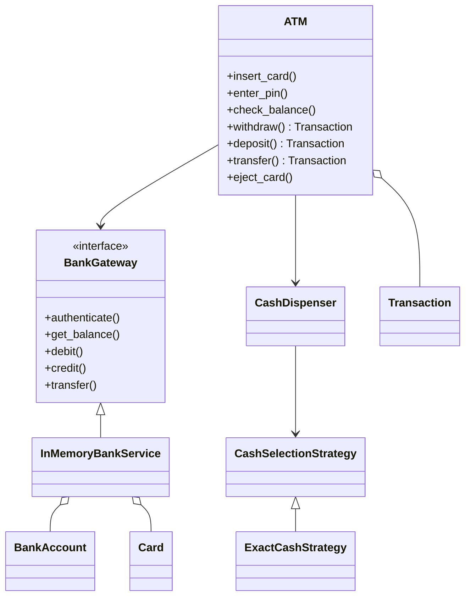
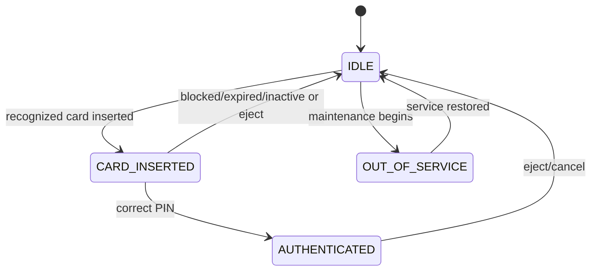
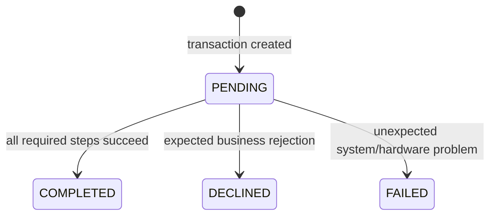
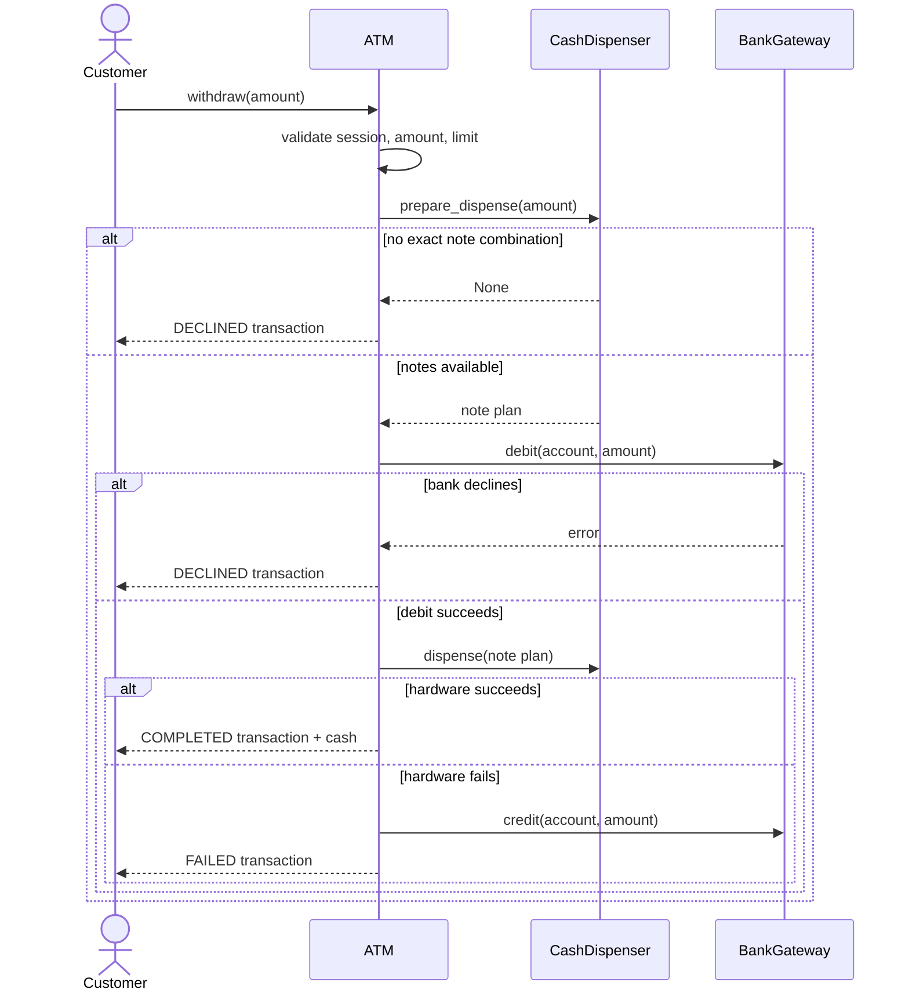

# ATM Low-Level Design

This project is a beginner-friendly, working implementation of an Automated
Teller Machine. It demonstrates card sessions, PIN authentication, bank
accounts, balance inquiries, cash withdrawal/deposit, transfers, exact-note
selection, transaction states, hardware failure compensation, and service
availability.

No previous knowledge of low-level design, OOP, SOLID, banking systems, or
design patterns is required.

> This is an educational software model, not production banking software. Real
> ATMs require certified hardware, encrypted networks, HSM-backed PIN handling,
> tamper detection, regulatory controls, reconciliation, and audited bank-host
> protocols.

## 1. The problem in everyday language

A customer inserts a card, enters a PIN, and starts an authenticated session.
They may check their balance, withdraw cash, deposit supported notes, or transfer
money. The ATM coordinates three kinds of state:

- Session state: card inserted/authenticated/out of service.
- Bank state: account balances, card/account status, transaction result.
- Physical cash state: denominations and note counts in the machine.

A withdrawal succeeds only when both the bank account and physical dispenser
can satisfy it. If the account has INR 10,000 but the ATM cannot make INR 300
from its notes, no money should leave the account.

The implementation supports:

- Account creation and card issuance.
- Salted PBKDF2 PIN hashes—no plaintext PIN storage.
- Three-attempt card blocking.
- Expired card and inactive account handling.
- Balance inquiry.
- Whole-currency withdrawals with a configurable transaction limit.
- Exact bounded-note selection from current inventory.
- Cash-recycler deposits using supported denominations.
- Atomic in-memory transfers between accounts.
- Completed, declined, and failed transaction outcomes.
- Compensation if hardware dispensing fails after an account debit.
- Card ejection/cancellation and ATM out-of-service transitions.
- Per-session account transaction history.

## 2. Start here: run it

Requirements:

- Python 3.10 or newer.
- No external packages.

From the `solutions/atm` directory:

```powershell
python main.py
python -m unittest discover -s tests -v
```

The demo creates two accounts, issues a card, authenticates it, checks the
balance, withdraws INR 1,300, transfers INR 750, deposits INR 700, checks the
closing balance, and ejects the card.

## 3. Scope and simplifying assumptions

- One card maps to one account.
- One currency (INR) is used.
- The ATM is a cash recycler: deposited notes join withdrawal inventory.
- Deposits are credited immediately after note validation.
- One withdrawal limit applies per transaction, not per day.
- The bank service and ATM run synchronously in one process.
- PIN verification is demonstrated locally; real ATM PIN blocks are verified by
  bank/HSM infrastructure.
- The simulation has no card reader, printer, network timeout, or journal device.

Stating these boundaries avoids confusing an educational LLD with a complete
banking platform.

## 4. Domain vocabulary

| Term | Meaning |
|---|---|
| ATM session | Time from card insertion until ejection/cancellation |
| Card | Account access credential with number, PIN verifier, status, and expiry |
| Bank account | Owner, balance, and account status |
| Bank gateway | Contract through which the ATM talks to bank-host operations |
| Cash dispenser | Tracks note inventory and physically dispenses/accepts notes |
| Transaction | Auditable attempt such as withdrawal, deposit, or transfer |
| Declined | Business rule prevented completion; no partial financial effect |
| Failed | Unexpected/system/hardware error interrupted processing |
| Compensation | Reversing an earlier step after a later step fails |

### Declined versus failed

An insufficient-balance withdrawal is `DECLINED`: the system behaved normally
and rejected it. A dispenser hardware error after bank debit is `FAILED`: an
unexpected operational problem occurred and compensation was required.

## 5. Requirements converted into rules

1. A card must be recognized before a session starts.
2. Transactions require successful authentication.
3. Three consecutive wrong PINs block the card and end the session.
4. Expired/blocked cards and blocked/closed accounts cannot authenticate.
5. Monetary amounts use exact decimal representation.
6. Withdrawals must be positive, whole-currency values within the limit.
7. The ATM must find an exact available note combination before debiting.
8. Cash is dispensed only after successful bank debit.
9. A dispensing failure compensates by crediting the account back.
10. Deposits accept only configured denominations with positive note counts.
11. Transfers require different active source/target accounts and sufficient
    source balance.
12. ATM maintenance mode can begin only without an active card session.

These invariants protect both logical account money and physical cash state.

## 6. Why money uses Decimal

Binary floating-point is unsafe for exact financial rules:

```python
0.1 + 0.2 == 0.3  # False
```

The project converts inputs to two-decimal `Decimal` values:

```python
Decimal("1300.00")
```

Prefer string inputs such as `"1300.50"`. Physical note denominations are
whole integer rupees, so fractional withdrawals are declined even though bank
balances retain two decimal places.

A production money type would also carry currency and define rounding/exchange
policies explicitly.

## 7. Project structure

```text
atm/
|-- main.py
|-- models/
|   |-- enums.py                      # atm/card/account/transaction states
|   |-- errors.py                     # AuthenticationError session policy
|   |-- money.py                      # Decimal conversion
|   |-- account.py                    # Debit/credit invariants
|   |-- card.py                       # PIN hash, attempts, expiry
|   `-- transaction.py                # Transaction lifecycle/audit data
|-- strategies/
|   |-- cash_selection_strategy.py    # Note-selection contract
|   `-- exact_cash_strategy.py        # Bounded exact combination search
|-- services/
|   |-- bank_gateway.py               # Bank-host abstraction
|   |-- in_memory_bank_service.py     # Demo bank implementation
|   |-- cash_dispenser.py             # Physical cash inventory abstraction
|   `-- atm.py                         # Session and transaction orchestrator
`-- tests/
    `-- test_atm.py                    # Executable requirements
```

Models own domain state, services coordinate workflows, and the strategy owns a
replaceable algorithm.

## 8. Architecture at a glance



The ATM never reaches directly into account dictionaries. It talks through the
bank gateway contract, which models a network/service boundary.

## 9. ATM session state machine



Operations check state before executing. For example, `withdraw()` requires
`AUTHENTICATED`, and another card cannot be inserted during an active session.

The enum-based implementation is an explicit finite state machine, but not the
GoF State Pattern. If each state accumulated large, different behavior classes,
separate state objects could become worthwhile.

## 10. PIN authentication and security concepts

### No plaintext PIN

Card issuance generates a random salt and derives a verifier using:

```text
PBKDF2-HMAC-SHA256(pin, salt, 100,000 iterations)
```

Verification derives a candidate and uses constant-time `hmac.compare_digest()`
to reduce timing leakage.

### Failed-attempt policy

- First/second wrong PIN: session stays at `CARD_INSERTED`, attempts remain.
- Third wrong PIN: card becomes `BLOCKED`, session ends.
- Successful PIN: failed-attempt count resets.
- Expired card or inactive linked account: session ends immediately.

`AuthenticationError` contains an `end_session` policy flag. This is safer than
the ATM inspecting error-message strings to decide whether the card session may
continue.

### Production reality

Real ATMs do not generally store/verify normal card PINs inside application
memory. Encrypted PIN blocks are handled through secure PIN pads, network
protocols, and Hardware Security Modules. Card numbers are sensitive data and
must be masked/tokenized and protected under standards such as PCI DSS.

## 11. Transaction lifecycle



Every transaction records:

- Unique ID and type.
- Source and optional target account.
- Amount.
- Creation/completion timestamps.
- Final status and reason.
- Cash note breakdown when applicable.

Input errors that prevent a meaningful attempt—such as a negative amount—raise
an error before transaction creation. Valid attempts rejected by balance,
limits, or inventory are stored as `DECLINED`.

## 12. Withdrawal workflow



The note plan is prepared before the debit. This avoids charging an account for
an amount the ATM already knows it cannot physically produce.

## 13. Exact bounded-note selection

A naive greedy algorithm always takes the largest note first. With limited
inventory, that can fail even when a valid combination exists:

```text
Request: INR 600
Inventory: one INR 500, three INR 200, zero INR 100
```

Greedy chooses INR 500 and gets stuck at INR 100. The valid solution is three
INR 200 notes.

`ExactCashStrategy` uses a memoized bounded search:

1. Sort denominations largest first.
2. Try possible counts from largest available down to zero.
3. Recursively solve the remaining amount using smaller denominations.
4. Cache `(denomination index, remaining amount)` results.
5. Return only a combination totaling the exact request.

It prefers larger notes when multiple valid combinations exist but backtracks
when that choice cannot complete the amount.

## 14. Strategy Pattern

`CashSelectionStrategy` defines:

```python
select_notes(amount, inventory) -> note_breakdown | None
```

`CashDispenser` depends on this abstraction rather than embedding an algorithm.
Future strategies might minimize note count, preserve scarce denominations, or
balance recycler inventory. The hardware/service workflow remains unchanged.

## 15. Cash dispenser and recycler

`CashDispenser` owns physical inventory:

```python
{500: 20, 200: 20, 100: 20}
```

It provides:

- `prepare_dispense()`: read-only note planning.
- `dispense()`: validate availability and subtract notes.
- `validate_notes()`: check deposit denominations/counts.
- `load_cash()`: add deposited/replenished notes.
- `total_cash`: calculate physical value.

Outside code should not perform cash arithmetic independently. This is
encapsulation: inventory rules stay beside inventory state.

## 16. Deposit workflow

The simulated ATM acts as a recycler:

1. Require authentication.
2. Validate supported denominations and positive integer counts.
3. Calculate the cash total.
4. Credit the linked account.
5. Load notes into recycler inventory.
6. Complete the transaction.

If loading fails after credit, the ATM compensates by debiting the account back
and marks the transaction `FAILED`.

Real deposits may be held pending until notes are counted, authenticated, and
reconciled. Envelope deposits are especially not immediate. This demo chooses
immediate credit to focus on orchestration.

## 17. Transfer workflow and atomicity

`InMemoryBankService.transfer()`:

1. Rejects identical source/target accounts.
2. Validates both accounts exist.
3. Debits the source.
4. Credits the target.
5. Credits the source back if target credit fails.

This is compensation in memory. In a real bank database, both account entries
and ledger records must commit in one ACID transaction. Banks generally use an
append-only double-entry ledger rather than treating a mutable `balance` field
as the authoritative audit record.

## 18. Bank Gateway and Dependency Inversion

The ATM depends on `BankGateway`, not `InMemoryBankService`:

```python
class BankGateway(ABC):
    def authenticate(...): ...
    def debit(...): ...
    def credit(...): ...
```

The in-memory class is one implementation for tests/demo. A production adapter
could call the bank host over ISO 8583 or another protocol.

This applies Dependency Inversion: high-level ATM workflow depends on an
abstraction at the external boundary. It also resembles the Gateway/Adapter
patterns by translating ATM needs into bank operations.

## 19. Controller/facade role

`ATM` provides one simple interface for a customer session while coordinating:

- Session state.
- Card authentication.
- Bank gateway operations.
- Cash dispenser operations.
- Transaction records.
- Compensation and card ejection.

It acts as an application controller/facade. It delegates account rules to
`BankAccount`, authentication to the bank service, and note selection/inventory
to cash components.

## 20. SOLID principles

| Principle | Meaning | Example |
|---|---|---|
| Single Responsibility | One main reason to change | Account handles balance rules; dispenser handles notes |
| Open/Closed | Extend without rewriting workflow | Add a cash-selection strategy |
| Liskov Substitution | Implementations honor a contract | Another `BankGateway` can replace the in-memory bank |
| Interface Segregation | Focused contracts | Cash selection exposes one algorithm method |
| Dependency Inversion | High-level code uses abstractions | `ATM` depends on `BankGateway` |

SOLID guides change boundaries. It does not require a separate class for every
line of code.

## 21. Error handling and compensation

Three categories are intentionally separated:

### Invalid operation

Examples: withdraw before authentication, negative amount, second card inserted.
The method raises `ValueError`; no transaction is created.

### Business decline

Examples: insufficient funds, transaction limit, unavailable note combination.
A transaction is created and returned with `DECLINED` and a reason.

### Operational failure

Example: account debit succeeds but dispenser hardware raises an error. The ATM
credits the account back and returns a `FAILED` transaction.

In production, compensation itself can fail because of network outages. The
system needs durable transaction journals, reconciliation jobs, idempotency
keys, and operator alerts rather than relying only on in-memory `try/except`.

## 22. Tests as executable requirements

The test suite covers:

- Authentication and balance inquiry.
- Three-strike card blocking.
- Successful withdrawal and exact note breakdown.
- Insufficient bank balance without cash mutation.
- Unavailable note combinations without account debit.
- Hardware failure and debit compensation.
- Deposit and recycler inventory.
- Successful/declined atomic transfers.
- Withdrawal limits and fractional requests.
- Bounded exact-cash search where greedy fails.
- Expired cards and blocked accounts.
- Session/out-of-service transitions.

Run one focused test:

```powershell
python -m unittest tests.test_atm.ATMTest.test_cash_hardware_failure_rolls_back_account_debit -v
```

Financial tests assert exact `Decimal` balances and verify both account state and
physical inventory state.

## 23. Complexity

Let `D` be denomination count, `A` requested whole amount, `N` transactions, and
`C` cards/accounts.

| Operation | Current complexity | Reason |
|---|---:|---|
| Account/card lookup | `O(1)` average | Dictionary by ID/number |
| PIN verification | Fixed configured PBKDF2 work | Deliberately expensive hash |
| Debit/credit/transfer | `O(1)` average | Direct account lookup |
| Exact note selection | Pseudo-polynomial/backtracking | Depends on amount, denominations, inventory; memoized states |
| Transaction history query | `O(N)` | ATM transaction list scan |
| Total physical cash | `O(D)` | Sum denomination × count |

Large-value cash selection can instead operate in units of the greatest common
divisor, use bounded dynamic programming, or use bank-configured heuristics.

## 24. Concurrency and distributed consistency

The demo is single-threaded. Real systems must handle:

- Concurrent ATM requests against one account.
- Bank authorization timeouts and duplicate retries.
- A crash after debit but before cash dispense.
- A dispenser reporting uncertain completion.
- Deposit count/reconciliation differences.
- ATM offline/stand-in authorization policies.

Typical mechanisms include database transactions, holds, immutable ledger
entries, idempotency keys, sequence numbers, reversal messages, durable ATM
journals, and reconciliation. An in-process lock alone cannot solve distributed
failure or uncertain hardware outcomes.

## 25. Current trade-offs

This educational LLD intentionally omits:

- HSM/PIN-block integration and encrypted bank protocols.
- Chip/EMV/contactless card workflows.
- Multiple accounts per card.
- Daily limits, fees, exchange rates, and multiple currencies.
- Receipts, mini statements, and printer failures.
- Cash retract/purge bins and partial-dispense sensors.
- Pending/counted deposit workflows.
- Double-entry ledger and reconciliation.
- Network timeouts, retries, reversals, and idempotency.
- Audit logging, masking, authorization roles, and compliance controls.
- Physical tamper, emergency, and maintenance hardware states.

These omissions are stated explicitly so extension decisions remain clear.

## 26. Advancement exercises

Try these in increasing difficulty:

1. Add printable/mask-safe transaction receipts.
2. Add a daily withdrawal limit per account/card.
3. Add fees through a configurable fee strategy.
4. Add multiple account selection after PIN authentication.
5. Add denomination-preserving cash selection.
6. Add mini statements with pagination.
7. Model deposits as `PENDING_VERIFICATION` before credit.
8. Add a durable append-only bank ledger.
9. Add idempotency keys for withdrawals/transfers.
10. Model network timeout and reversal messages.
11. Add cash retract and partial-dispense recovery.
12. Implement a bank gateway adapter with a mocked network protocol.

For each extension, ask:

- Which state changes first?
- What happens if the next step fails?
- Is compensation possible and durable?
- What must be idempotent?
- Which sensitive data must never be logged?
- Which tests prove both logical money and physical cash remain consistent?

## 27. Interview explanation template

When presenting this design:

1. Clarify transactions, cash denominations, limits, and bank boundary.
2. Draw the ATM session state machine.
3. Explain secure PIN-verifier concepts without claiming local hashing is a real
   ATM production architecture.
4. Walk through withdrawal in exact order.
5. Explain why note planning precedes debit.
6. Discuss Strategy and Gateway/Dependency Inversion.
7. Separate declines, failures, and compensation.
8. Explain `Decimal`, exact note selection, and complexity.
9. Discuss distributed failures, journaling, and reconciliation.
10. State current boundaries and production extensions.

The strongest ATM LLD discussion focuses on failure ordering and consistency—not
only classes named `Card`, `Account`, and `ATM`.
