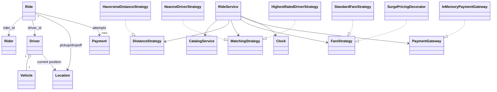

# Cab Booking Low-Level Design

Match one available driver to a rider, progress the trip, calculate fare, and settle payment without assigning a driver twice.

## Understanding the Problem

Match one available driver to a rider, progress the trip, calculate fare, and settle payment without assigning a driver twice.

The design starts with the business invariant and the critical workflow. Named patterns come later, only where a requirement creates a real variation or boundary.

## Requirements

### Clarifying Questions

- Is driver acceptance required or is assignment immediate?
- Which vehicle types and matching radius apply?
- Is fare estimated before the ride and finalized afterward?
- When may riders or drivers cancel?
- How are live locations supplied?

### Final Requirements

1. Find nearby eligible drivers.
2. Estimate fare and create a ride request.
3. Atomically assign one available driver.
4. Progress assigned, in-progress, completed, and cancelled states.
5. Charge the completed ride and record rating/history.

The detailed reference below records additional assumptions, exclusions, validation rules, and edge cases.

## Core Entities and Relationships

| Entity | Responsibility |
|---|---|
| Rider | Owns customer identity and ride history. |
| Driver | Owns availability, location, rating, and vehicle. |
| Ride | Owns assignment, route, fare, and lifecycle. |
| MatchingStrategy | Ranks eligible drivers. |
| DistanceStrategy | Calculates route/proximity distance. |
| FareStrategy | Calculates estimate and final fare. |
| PaymentGateway | Isolates payment processing. |

The object that owns mutable state also owns the invariant protecting that state. Coordinating services load collaborators and sequence the use case; they do not bypass entity behavior.

## Class Design

### Good Solution

Keep Driver availability separate from Ride lifecycle and inject matching/fare policies.

### Great Solution

Use conditional driver claim, idempotent ride requests and payment, offer timeout/retry semantics, and explicit failure recovery.

### Final Class Design

The critical collaboration is: request ride -> find candidates -> estimate -> atomically claim driver -> start -> complete -> calculate fare -> pay -> release driver.

The full class map, state transitions, method contracts, and design rationale are preserved in the detailed reference below.

## Implementation

Implement one vertical slice before filling every class:

    request ride -> find candidates -> estimate -> atomically claim driver -> start -> complete -> calculate fare -> pay -> release driver

### Complete Code Implementation

- [Models](./models/)
- [Services](./services/)
- [Strategies](./strategies/)
- [Demonstration](./main.py)
- [Tests](./tests/)

Run:

    python "solutions/cab-booking/main.py"
    python -m unittest discover -s "solutions/cab-booking/tests" -t "solutions/cab-booking" -v

## Verification

Verify the happy path, the highest-risk rejection, and state after failure. Then force two competing operations at the atomic boundary and assert the invariant, not thread timing.

The detailed reference lists problem-specific test cases and complexity.

## Extensibility

- Driver offers with timeout
- Pooling and scheduled rides
- Geospatial indexing and live-location streams

Each extension should enter through a named policy, boundary, or lifecycle change rather than a new conditional inside the main workflow.

## What Is Expected at Each Level?

### Junior

Deliver the agreed core workflow with coherent entities, valid state changes, and straightforward failure handling.

### Mid-level

Make invariants explicit, isolate real variations, cover failure paths with tests, and discuss the relevant concurrency boundary.

### Senior

Explain conditional driver assignment, stale location, offer races, idempotency, and payment/release ordering.

## Interview Walkthrough

1. Clarify the version-one scope and exclusions.
2. State the invariants before drawing classes.
3. Introduce the core entities and walk: request ride -> find candidates -> estimate -> atomically claim driver -> start -> complete -> calculate fare -> pay -> release driver.
4. Compare the good and great solution based on the stated requirements.
5. Implement a complete vertical slice and one failure test.
6. Handle a realistic follow-up through an explicit extension seam.

## Detailed Design Reference

<details>
<summary>Open the implementation-specific deep dive</summary>
This is a beginner-friendly, working Python design for an on-demand cab service.
It covers riders, drivers, vehicles, locations, nearby-cab discovery, driver
matching, fare estimates, surge pricing, dispatch concurrency, trip transitions,
final fare calculation, payment retry, ratings, and ride history.

No previous knowledge of low-level design (LLD), object-oriented programming
(OOP), SOLID principles, design patterns, geospatial calculations, or dispatch
systems is required.

> This is an educational in-memory model, not a production mobility platform.
> Real platforms need road-routing providers, live location streams, geographic
> partitioning, durable dispatch, fraud and safety systems, identity checks,
> asynchronous payments, privacy controls, and large-scale observability.

## 1. The problem in everyday language

A rider chooses a pickup, drop-off, and vehicle category. The system estimates
distance, duration, and fare, then searches for a compatible available driver
within a pickup radius. A matching policy selects one candidate and reserves
that driver so no other rider can receive the same cab.

The assigned driver starts the ride. At completion, the system uses actual
distance and duration to calculate the final fare, releases the driver for new
requests, accepts payment, and allows one rating.

The implementation supports:

- Riders, drivers, vehicles, and validated latitude/longitude locations.
- Mini, sedan, and SUV vehicle categories.
- Offline, available, and reserved/on-trip driver states.
- Haversine great-circle distance calculation.
- Nearby-driver discovery by type and radius.
- Nearest-driver and highest-rated-driver matching strategies.
- Unmatched ride requests that may be retried later.
- One active ride per rider.
- Atomic in-process dispatch so one driver is assigned only once.
- Vehicle-specific base, distance, time, and minimum fare rules.
- Composable surge pricing.
- Estimated versus final distance, duration, and fare.
- Assigned-driver authorization for start and completion.
- Cancellation before trip start with immediate driver release.
- Cash, card, UPI, and wallet payment attempts.
- Failed-payment retry and idempotent successful payment.
- Paid-trip driver ratings and rolling averages.
- Rider and driver ride history.
- Injectable time and deterministic tests.

## 2. Start here: run it

Requirements:

- Python 3.10 or newer.
- No third-party packages.

From the repository root:

```powershell
python "solutions/cab-booking/main.py"
python -m unittest discover -s "solutions/cab-booking/tests" -t "solutions/cab-booking" -v
```

Or from inside `solutions/cab-booking`:

```powershell
python main.py
python -m unittest discover -s tests -v
```

The demo registers two nearby mini drivers, assigns the nearest one, shows an
estimate, starts and completes an eight-kilometre ride, processes a UPI payment,
and records a five-star rating.

## 3. LLD and OOP in two minutes

**Low-level design** turns a requirement such as "book a cab" into code-level
decisions:

- What makes a driver eligible for a request?
- Who chooses among eligible drivers?
- When does an available driver become reserved?
- Which ride transitions are legal?
- Is an estimate the same as the final fare?
- What happens when no driver or no payment method succeeds?
- Which update must be atomic when riders request simultaneously?

**Object-oriented programming** gives each concept a focused owner:

- `Driver` owns current location, status, vehicle, and aggregate rating.
- `Ride` records the request, assignment, estimate, trip, and payment references.
- `CatalogService` manages registered people and vehicles.
- `RideService` coordinates dispatch and the trip lifecycle.
- `DistanceStrategy`, `MatchingStrategy`, and `FareStrategy` isolate algorithms.
- `PaymentGateway` isolates the external payment boundary.

Good OOP is not about creating many classes. It is about keeping important
rules explicit and preventing unrelated responsibilities from becoming tangled.

## 4. Scope and simplifying assumptions

- One ride has one rider, one driver, and one vehicle.
- Rides are immediate, not scheduled for later.
- Shared/pool rides and multiple stops are not included.
- Drivers explicitly go online or offline.
- Assignment is immediate; a separate driver accept/reject step is omitted.
- An assigned driver is marked `ON_TRIP` immediately, even before pickup. Here
  `ON_TRIP` means reserved and unavailable to other dispatches.
- Candidate drivers must be within a configurable ten-kilometre radius.
- Estimated duration assumes a configurable average speed of 30 km/h.
- Final distance is supplied by the trip tracker; the demo passes eight km.
- Cancellation is allowed before the trip starts and has no fee.
- Payment occurs after completion; failed payment does not undo the trip.
- One successful payment and one driver rating are allowed per ride.
- One currency is used; demo amounts are described as rupees.
- All state and locks exist only inside one Python process.

These choices make the core dispatch invariant visible. Real policies such as
driver acceptance, cancellation fees, scheduled rides, cash collection, and
safety escalation belong in explicit extensions.

## 5. Domain vocabulary

| Term | Meaning | Example |
|---|---|---|
| Rider | Customer requesting transport | Asha |
| Driver | Partner operating a vehicle | Deepa |
| Vehicle | Registered cab with category and capacity | Mini hatchback |
| Location | Latitude/longitude point | `12.9716, 77.5946` |
| Candidate | Available compatible driver inside pickup radius | Mini within 10 km |
| Dispatch | Atomic selection and reservation of a driver | Ride assigned to d1 |
| Estimate | Expected distance, duration, and fare before travel | INR 117.78 |
| Final fare | Price from actual distance and elapsed duration | INR 166.00 |
| Surge | Multiplier applied during high demand | 1.5x |
| Active ride | Requested, assigned, or in progress | Blocks a second request |

## 6. Driver state and ride state are different

A driver and a ride each have their own state machine. Combining both into one
status creates contradictions and makes dispatch difficult.

### Driver state

```text
OFFLINE <-------> AVAILABLE --------> ON_TRIP
                      ^                  |
                      |                  |
                      +-- cancel/end ----+
```

- `OFFLINE`: not accepting requests.
- `AVAILABLE`: eligible for matching.
- `ON_TRIP`: reserved for an assigned or active ride.

A driver cannot go offline while `ON_TRIP`.

### Ride state

```text
REQUESTED -> DRIVER_ASSIGNED -> IN_PROGRESS -> COMPLETED
    |               |
    +---------------+-----------------------> CANCELLED
```

- `REQUESTED` may remain unmatched when no driver exists.
- `DRIVER_ASSIGNED` owns one reserved driver.
- Only that assigned driver can start or complete the ride.
- Cancellation is allowed only before `IN_PROGRESS`.
- `COMPLETED` has actual trip measurements and a final fare.

The core cross-object invariant is:

> Every `DRIVER_ASSIGNED` or `IN_PROGRESS` ride owns exactly one `ON_TRIP`
> driver, and an `ON_TRIP` driver is owned by at most one active ride.

## 7. Request and retry behavior

No available driver is a normal business outcome, not necessarily an exception.
`request_ride()` therefore always creates a valid `REQUESTED` ride. If dispatch
finds a candidate, it immediately becomes `DRIVER_ASSIGNED`. Otherwise it stays
requested and may be retried after a matching driver comes online:

```text
request -> no candidate -> REQUESTED
                         -> retry later -> DRIVER_ASSIGNED
```

This preserves the user's request and makes waiting/notification features easier
to add. A production system would add an expiry deadline and continuously react
to driver-location events instead of requiring an explicit retry call.

## 8. Requirements mapped to responsibilities

| Requirement | Responsible type |
|---|---|
| Validate geographic coordinates | `Location` |
| Store riders, drivers, and unique vehicles | `CatalogService` |
| Control online/offline state and location | `RideService` under dispatch lock |
| Calculate point-to-point distance | `DistanceStrategy` |
| Select one eligible candidate | `MatchingStrategy` |
| Calculate estimated and final fare | `FareStrategy` |
| Atomically reserve a driver | `RideService` |
| Protect trip transitions | `RideService` |
| Charge completed rides | `PaymentGateway` |
| Update one rolling driver rating | `RideService.rate_driver()` |
| Supply controllable current time | `Clock` |

## 9. Project structure

```text
cab-booking/
|-- main.py
|-- models/
|   |-- enums.py
|   |-- money.py
|   |-- location.py
|   |-- rider.py
|   |-- vehicle.py
|   |-- driver.py
|   |-- ride.py
|   `-- payment.py
|-- strategies/
|   |-- distance_strategy.py
|   |-- haversine_distance_strategy.py
|   |-- matching_strategy.py
|   |-- nearest_driver_strategy.py
|   |-- highest_rated_driver_strategy.py
|   |-- fare_strategy.py
|   |-- standard_fare_strategy.py
|   `-- surge_pricing_decorator.py
|-- services/
|   |-- clock.py
|   |-- catalog_service.py
|   |-- payment_gateway.py
|   |-- in_memory_payment_gateway.py
|   `-- ride_service.py
`-- tests/
    `-- test_cab_booking.py
```

Models represent state, strategies represent interchangeable algorithms, and
services coordinate workflows spanning several objects.

## 10. Class relationships



`Ride` stores driver and rider IDs rather than deep copies. The catalog remains
the source used to resolve registered actors.

## 11. Distance calculation

`HaversineDistanceStrategy` calculates great-circle distance using latitude and
longitude on a spherical Earth approximation:

```text
a = sin²(delta-latitude / 2)
    + cos(start-latitude) * cos(end-latitude) * sin²(delta-longitude / 2)

distance = 2 * earth-radius * asin(sqrt(a))
```

This is appropriate for nearby-driver ordering in an educational design, but it
is **not road distance**. Roads have turns, one-way restrictions, bridges,
traffic, and closures. Production estimates use a maps/routing provider and
often separate:

- Straight-line distance for fast initial candidate filtering.
- Road ETA for final ranking and customer estimates.
- GPS route traces for actual trip billing and anomaly detection.

The `DistanceStrategy` interface lets that implementation change without
rewriting dispatch.

## 12. Dispatch and matching workflow

1. Validate rider and calculate pickup-to-drop-off distance.
2. Derive estimated duration using average speed.
3. Reject another active ride for the same rider.
4. Store a new `REQUESTED` ride and its fare estimate.
5. Filter drivers that are `AVAILABLE`, have the requested vehicle type, and
   are inside the pickup radius.
6. Ask the injected `MatchingStrategy` to choose one candidate.
7. In the same critical section, mark that driver `ON_TRIP`, assign the ID, and
   move the ride to `DRIVER_ASSIGNED`.

`NearestDriverStrategy` ranks by pickup distance, then rating, then stable driver
ID. `HighestRatedDriverStrategy` ranks by rating, then distance. Because matching
is behind an interface, business policy can change without editing ride state.

## 13. Preventing one driver from being assigned twice

This unsafe interleaving can occur without synchronization:

```text
Rider A sees driver d1 AVAILABLE
Rider B sees driver d1 AVAILABLE
Rider A assigns d1
Rider B assigns d1
```

`RideService` uses one reentrant dispatch lock around candidate selection and
reservation. The first request changes d1 to `ON_TRIP` before the second request
can build its candidate list. The second request remains `REQUESTED` if no other
driver exists.

The concurrent test starts two rider threads at a barrier with one mini driver.
It asserts exactly one assigned ride, one unmatched ride, and one ownership of
the driver's ID.

### Production limitation

One in-memory lock works only within one process and would serialize an entire
city. Production dispatch is usually geographically partitioned and relies on
shared atomic ownership:

- Geospatial indexing to find drivers by cell/radius.
- Compare-and-set from `AVAILABLE` to `RESERVED` with a version or lease.
- A driver-specific actor/partition that processes assignments sequentially.
- Durable reservation timeout and fencing token.
- Idempotency keys for rider requests and driver responses.

The atomic store must decide the winner. A location cache alone should not.

## 14. Estimated fare versus final fare

The same `FareStrategy` prices both stages, but their inputs differ.

### Estimate

- Distance: Haversine pickup-to-drop-off distance.
- Duration: distance divided by assumed average speed.
- Purpose: help the rider decide before travel.

### Final fare

- Distance: actual measured/tracked route distance supplied at completion.
- Duration: elapsed time from `start_ride()` to `complete_ride()`.
- Purpose: determine the payable amount.

`StandardFareStrategy` uses:

```text
calculated = base fare + per-km * distance + per-minute * duration
final = max(calculated, minimum fare)
```

| Vehicle | Base | Per km | Per minute | Minimum |
|---|---:|---:|---:|---:|
| Mini | 40 | 12 | 1.50 | 80 |
| Sedan | 60 | 16 | 2.00 | 120 |
| SUV | 90 | 22 | 2.50 | 180 |

All monetary results use `Decimal` and are rounded to two places.

## 15. Surge pricing

`SurgePricingDecorator` wraps any fare strategy and multiplies its result:

```python
fare = SurgePricingDecorator(StandardFareStrategy(), "1.5")
```

For an INR 166 standard fare, 1.5x produces INR 249. A multiplier below 1 is
rejected because this class represents surge, not discounting.

In production, another service derives the multiplier from supply, demand,
weather, traffic, geography, regulation, and caps. The quote should record the
accepted multiplier and expire after a defined time; recalculating it at trip
end could unfairly change an already accepted contract.

## 16. Trip workflow

### Start

1. Require `DRIVER_ASSIGNED`.
2. Verify the caller is the assigned driver.
3. Confirm that driver is reserved (`ON_TRIP`).
4. Record start time and move the driver's location to pickup.
5. Change the ride to `IN_PROGRESS`.

### Complete

1. Require `IN_PROGRESS` and the assigned driver.
2. Validate that completion is not before start.
3. Resolve actual distance and elapsed duration.
4. Calculate the final fare before changing state.
5. Record trip measurements and completion time.
6. Move the driver to drop-off and return them to `AVAILABLE`.

Calculating before mutation prevents a pricing error from half-completing the
ride.

### Cancel

- `REQUESTED`: mark cancelled; no driver needs release.
- `DRIVER_ASSIGNED`: release the driver, then mark cancelled.
- `IN_PROGRESS` or `COMPLETED`: reject cancellation.
- Repeated cancellation: return the already-cancelled ride.

A production service would distinguish rider/driver/system cancellation, apply
fees, detect unsafe trip termination, and preserve richer reason codes.

## 17. Payment and rating

Every payment attempt is stored:

```text
charge -> COMPLETED
      `-> FAILED -> retry -> COMPLETED
```

Only completed rides may be paid. A repeated call after successful payment
returns the same completed payment, preventing duplicate charges. Failed
attempts remain in history and may be retried with another method.

A rating is accepted only when:

- The ride is completed.
- At least one payment completed.
- The caller is the ride's rider.
- The value is from 1 through 5.
- The ride has not already rated its driver.

The rolling average is updated without storing every historic rating:

```text
new average = (old average * old count + new rating) / new count
```

A real system would retain individual reviews for moderation and auditing.

## 18. Design patterns used

### Strategy

Three variable algorithms use Strategy:

- `DistanceStrategy`: coordinate-to-distance calculation.
- `MatchingStrategy`: candidate selection.
- `FareStrategy`: price calculation.

Each can change independently from the ride lifecycle.

### Decorator

`SurgePricingDecorator` adds a multiplier around another fare strategy without
creating subclasses for every base-fare/surge combination.

### Gateway / Adapter boundary

`PaymentGateway` exposes the one operation the domain needs: charge. The
in-memory fake can be replaced by an adapter for a payment provider or cash
collection workflow.

### Dependency injection

`RideService` receives catalog, distance, matching, fare, payment, clock, radius,
and average-speed configuration. Tests can control every variable boundary.

### Service layer

The ride service coordinates multiple models and policies. `main.py` stays a
client instead of becoming the home of dispatch rules.

## 19. OOP and SOLID lessons

### Encapsulation

`Location` rejects invalid coordinates when created. `CatalogService` protects
unique people, phones, vehicle IDs, and registrations.

### Abstraction

The workflow asks for distance, a selected driver, a fare, and a payment without
knowing each implementation's internal algorithm.

### Composition over inheritance

A driver has a vehicle and location. A service has strategies. A surge decorator
has another fare strategy. These are natural composition relationships.

### Single Responsibility Principle

- Models represent domain state.
- Catalog handles stable registration data.
- Ride service handles live driver presence, dispatch, and trip workflow.
- Strategies handle independent algorithms.
- Gateway handles provider interaction.

### Open/Closed Principle

Road-network distance, ETA-based matching, or a different fare policy can be
added without editing central trip transitions.

### Liskov Substitution Principle

Any implementation honoring a strategy/gateway contract can substitute for the
current implementation.

### Interface Segregation Principle

Interfaces are small. Matching logic does not depend on payment methods, and
payment code does not depend on geospatial search.

### Dependency Inversion Principle

High-level ride policy depends on abstractions at variable or external
boundaries rather than concrete algorithms.

## 20. Validation and important edge cases

The implementation handles or rejects:

- Invalid, infinite, or out-of-range coordinates.
- Duplicate riders, emails, phones, drivers, vehicles, and registrations.
- Vehicles with non-positive capacity.
- Drivers going offline while reserved.
- Same pickup and drop-off.
- Non-positive search radius or configuration.
- No compatible nearby driver.
- Two active requests for one rider.
- Wrong vehicle type candidates.
- Wrong driver starting or completing a ride.
- Start without assignment and completion without start.
- Completion before start or non-positive actual distance.
- Cancellation without reason or after trip start.
- Payment before trip completion.
- Failed payment retry and repeated successful payment.
- Rating before payment, invalid rating, wrong rider, or duplicate rating.

## 21. Complexity

Let `D` be registered drivers and `R` stored rides.

| Operation | Time | Extra space |
|---|---:|---:|
| Nearby-driver search | `O(D log D)` | `O(D)` |
| Request and match | `O(R + D)` | `O(D)` candidates |
| Retry matching | `O(D)` | `O(D)` |
| Start/complete/cancel | `O(1)` average dictionary access | `O(1)` |
| Pay ride | `O(payment attempts)` | `O(1)` |
| Rate driver | `O(payment attempts)` | `O(1)` |
| Rider/driver history | `O(R log R)` | `O(R)` |

The current dispatcher scans every driver. Production systems use geospatial
indexes such as grid cells, geohashes, S2/H3, or database spatial indexes, then
rank only a small candidate set using road ETA and policy signals.

## 22. Test coverage

The 18-test suite verifies:

- Coordinate validation and Haversine distance.
- Nearby-driver type/radius filtering and distance ordering.
- Nearest matching and replaceable highest-rating matching.
- Vehicle-category compatibility.
- Unmatched request and later retry.
- One active ride per rider.
- Pre-trip cancellation and driver release.
- Driver authorization for start and completion.
- In-progress cancellation rejection.
- Actual distance/duration fare and driver location/status updates.
- Failed payment retry and idempotent completed payment.
- Paid-trip rating and rolling average.
- Surge fare calculation.
- Driver offline safety.
- New requests after terminal rides.
- Newest-first rider and driver history.
- A concurrent two-rider/one-driver race with exactly one assignment.

Tests are executable business rules. Add a test whenever a lifecycle, pricing,
dispatch, safety, or payment policy changes.

## 23. Production evolution

A practical evolution path is:

1. Add repository interfaces and durable storage.
2. Stream driver GPS updates into a geospatial index.
3. Partition dispatch by geographic cell and atomically claim drivers.
4. Add assignment offers, acceptance deadlines, rejection, and re-dispatch.
5. Integrate a road-routing/traffic provider for ETA and route distance.
6. Add quote IDs with surge, currency, components, and expiration.
7. Add cancellation fee and refund policy strategies.
8. Add scheduled, shared, rental, and multi-stop rides.
9. Add driver/rider identity, safety checks, SOS, masking, and fraud controls.
10. Process asynchronous payment webhooks with idempotency and reconciliation.
11. Use an outbox/event stream for notifications and trip analytics.
12. Add tracing, demand/supply metrics, alerts, audit logs, and privacy retention.

### Failures a production design must answer

- A driver was reserved but never received the offer.
- The driver accepted after their reservation lease expired.
- Rider and driver apps sent the same transition more than once.
- GPS events arrived late or out of order.
- Payment succeeded but the client timed out.
- The maps provider was unavailable during estimate or completion.
- A driver went offline or lost connectivity during the trip.
- Dispatch crashed after claiming a driver but before updating the ride.

These require durable state, idempotency, leases/fencing, event ordering,
reconciliation, and compensation—not merely more classes.

## 24. Suggested learning exercises

### Beginner

- Validate non-blank names, phones, and vehicle registrations.
- Add rider-visible driver/vehicle details to an assignment response.
- Search by passenger capacity.
- Print an itemized fare receipt.

### Intermediate

- Add driver accept/reject with an offer timeout.
- Add cancellation fee strategies by actor and timing.
- Add separate rider ratings and written reviews.
- Add scheduled ride requests and request expiry.
- Add tax, toll, waiting, and parking fare components.

### Advanced

- Build a geohash/H3 driver index.
- Implement driver reservation leases with fencing tokens.
- Consume out-of-order GPS events safely.
- Add an asynchronous dispatch saga and retry policy.
- Add a road-routing adapter with fallback and circuit breaker.
- Load-test thousands of riders and drivers across geographic partitions.

For every exercise, write an invariant first. Example: "One available driver may
be owned by at most one non-terminal ride." Then choose the object, atomic store
operation, timeout, and test that enforce it.

## 25. Interview discussion guide

A strong explanation usually follows this order:

1. Clarify immediate single-rider ride scope.
2. Separate driver state from ride state.
3. Explain distance, candidate filtering, and matching Strategy.
4. State the single-owner driver invariant and atomic dispatch boundary.
5. Walk through request, retry, start, completion, cancellation, and payment.
6. Explain estimate versus actual fare and surge Decorator.
7. Explain Gateway, Clock, and dependency injection.
8. Demonstrate the two-thread/one-driver race.
9. Admit the global in-process lock and straight-line-distance limitations.
10. Evolve toward geospatial partitions, leases, routing, and event-driven flows.

Strong LLD is shown through ownership, invariants, transitions, and failure
handling—not by memorizing a class diagram.

</details>
