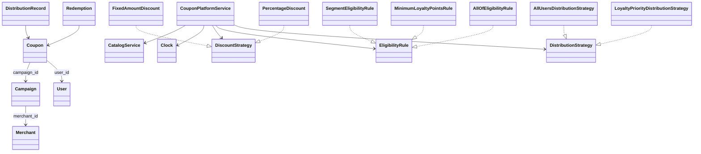

# Coupon Management and Distribution Platform Low-Level Design

This is a beginner-friendly, working Python design for creating coupon
campaigns, selecting eligible users, distributing unique coupon codes, enforcing
supply and per-user limits, reserving coupons during checkout, calculating
discounts, redeeming, releasing, revoking, expiring, and preserving audit records.

No previous knowledge of low-level design (LLD), object-oriented programming
(OOP), SOLID principles, design patterns, promotion engines, or concurrency is
required.

> This is an educational in-memory implementation. A production promotion
> platform requires durable databases, atomic distributed counters, secure code
> generation, abuse prevention, idempotency, event delivery, merchant access
> control, analytics, and reconciliation with order/payment systems.

## 1. The problem in everyday language

A merchant creates a promotion such as "20% off, maximum INR 250, on fashion
orders of at least INR 500." The campaign has a date range, a limited number of
coupons, and a per-user issuance limit. It may target premium users or users with
enough loyalty points.

The platform distributes unique codes proactively through app, email, or SMS,
or allows users to claim codes themselves. During checkout, a code is temporarily
reserved for an order. If checkout succeeds it is redeemed; if checkout fails or
times out, the reservation is released for another attempt.

The implementation supports:

- Merchant and user registration.
- User segments and loyalty points.
- Draft, active, paused, and ended campaigns.
- Start/end times, total supply, per-user limits, and code prefixes.
- Minimum order value and applicable-category rules.
- Fixed-amount discounts that never make payable amount negative.
- Percentage discounts with optional maximum cap.
- Everyone, segment, minimum-loyalty, and composable `AllOf` eligibility rules.
- All-user and loyalty-priority distribution strategies.
- App, email, SMS, and direct-claim distribution records.
- Unique per-user coupon codes.
- Concurrent claim protection for limited supply.
- Ten-minute checkout reservations with configurable duration.
- Reservation ownership by order ID.
- Release, redemption, idempotent retry, revocation, and expiry.
- Campaign and coupon state machines.
- Issued and redeemed counters.
- User coupon/redemption history and audit records.
- Injectable time and deterministic tests.

## 2. Start here: run it

Requirements:

- Python 3.10 or newer.
- No third-party packages.

From the repository root:

```powershell
python "solutions/coupon-management-and-distribution-platform/main.py"
python -m unittest discover -s "solutions/coupon-management-and-distribution-platform/tests" -t "solutions/coupon-management-and-distribution-platform" -v
```

Or from inside the solution directory:

```powershell
python main.py
python -m unittest discover -s tests -v
```

The demo creates a premium-user campaign, prioritizes high-loyalty recipients,
distributes two app coupons, reserves one for a fashion order, displays discount
and payable amount, and commits redemption.

## 3. LLD and OOP in two minutes

**Low-level design** converts "build a coupon platform" into concrete ownership
and invariants:

- Is a campaign the same thing as a coupon code?
- Is total supply counted at issuance or redemption?
- Which users qualify, and which strategy receives scarce coupons first?
- How can checkout prevent one code from being used by two orders?
- What happens when reservation time or campaign time expires?
- Which actions must be atomic under concurrent claims?

**Object-oriented programming** gives each responsibility a clear home:

- `Campaign` stores lifecycle, limits, applicability, and aggregate counts.
- `Coupon` stores one user's unique code and its own lifecycle.
- `Redemption` is an immutable record of applied commercial value.
- `CouponPlatformService` coordinates state and atomic workflows.
- Discount, eligibility, and distribution strategies isolate policies.
- `Clock` isolates time-dependent behavior.

The objective is understandable rules and safe transitions, not a large number
of classes.

## 4. Scope and simplifying assumptions

- Every issued code belongs to exactly one registered user.
- Codes are unique and are not public/shared promotion codes.
- Total supply means total codes ever issued, not currently available codes.
- Revoked and expired coupons do not restore campaign supply.
- Per-user limit also counts revoked or expired issued coupons.
- A campaign may be activated before its start, but cannot distribute or apply
  until current time reaches the start.
- Campaign validity uses `[start_time, end_time)`.
- Applicable categories require at least one intersection with order categories.
- The discount applies to the whole supplied order amount.
- One coupon is reserved/redeemed per order in this model.
- Reservation expiry returns the coupon to `AVAILABLE` while campaign is live.
- Campaign expiry makes unredeemed coupons `EXPIRED`.
- Paused campaigns cannot distribute, claim, reserve, or redeem.
- No payment service is included; an order system reserves before payment and
  commits or releases afterward.
- All state and synchronization exist inside one process.

These boundaries keep the design focused. Shared codes, stacking, product-level
discount allocation, budgets, and merchant billing are production extensions.

## 5. Domain vocabulary

| Term | Meaning | Example |
|---|---|---|
| Merchant | Business funding/owning a campaign | Design Store |
| User | Coupon recipient with segments and loyalty | Premium user, 700 points |
| Campaign | Promotion definition and limits | Premium Weekend |
| Coupon | Unique code issued from a campaign to one user | `SAVE-A1B2C3...` |
| Distribution | Audit record describing how a coupon was issued | APP, EMAIL, CLAIM |
| Eligibility | Whether a user may receive/use campaign coupons | Premium and 200+ points |
| Reservation | Temporary ownership by one checkout/order | Order 101 for ten minutes |
| Redemption | Immutable record of committed discount | INR 240 off order 101 |
| Supply | Maximum number of codes the campaign may issue | 10,000 |
| Cap | Maximum money a percentage strategy can discount | INR 250 |

## 6. Campaign, coupon, and redemption are different

Confusing these three concepts creates weak designs.

### Campaign

The campaign is the reusable promotion definition:

- Merchant and name.
- Time range and lifecycle.
- Total supply and per-user issue limit.
- Minimum order and categories.
- Discount, eligibility, and distribution policies.
- Issued/redeemed aggregate counters.

### Coupon

A coupon is one unique issued unit:

- Code and owner.
- Campaign reference.
- Issue time.
- Reservation ownership/deadline.
- Redeemed order and time.
- Available/reserved/redeemed/expired/revoked state.

### Redemption

A redemption is immutable audit evidence of applied value:

- Coupon, campaign, user, and order IDs.
- Original order amount.
- Discount and final payable amount.
- Redemption time.

```text
Campaign SAVE20
  |-- Coupon SAVE-AAA -> user u1 -> Redeemed -> Redemption r1
  |-- Coupon SAVE-BBB -> user u2 -> Available
  `-- Coupon SAVE-CCC -> user u3 -> Expired
```

## 7. Project structure

```text
coupon-management-and-distribution-platform/
|-- main.py
|-- models/
|   |-- enums.py
|   |-- money.py
|   |-- merchant.py
|   |-- user.py
|   |-- campaign.py
|   |-- coupon.py
|   |-- redemption_context.py
|   |-- coupon_quote.py
|   |-- distribution_record.py
|   `-- redemption.py
|-- strategies/
|   |-- discount_strategy.py
|   |-- fixed_amount_discount.py
|   |-- percentage_discount.py
|   |-- eligibility_rule.py
|   |-- everyone_eligibility_rule.py
|   |-- segment_eligibility_rule.py
|   |-- minimum_loyalty_points_rule.py
|   |-- all_of_eligibility_rule.py
|   |-- distribution_strategy.py
|   |-- all_users_distribution_strategy.py
|   `-- loyalty_priority_distribution_strategy.py
|-- services/
|   |-- clock.py
|   |-- catalog_service.py
|   `-- coupon_platform_service.py
`-- tests/
    `-- test_coupon_platform.py
```

Models represent domain state, strategies represent merchant/business policies,
and the service coordinates atomic use cases.

## 8. Requirements mapped to responsibilities

| Requirement | Responsible type |
|---|---|
| Register merchants and users | `CatalogService` |
| Store campaign limits and counts | `Campaign` |
| Calculate discount | `DiscountStrategy` |
| Decide user eligibility | `EligibilityRule` |
| Prioritize recipients | `DistributionStrategy` |
| Atomically issue/claim unique codes | `CouponPlatformService` |
| Protect checkout ownership | `CouponPlatformService.reserve_coupon()` |
| Commit immutable usage | `CouponPlatformService.redeem_coupon()` |
| Release/revoke/expire codes | `CouponPlatformService` |
| Provide deterministic current time | `Clock` |

## 9. Class relationships



Policy instances are stored by campaign ID inside the service. Domain models do
not import strategy modules, keeping the dependency direction clean.

## 10. State machines

### Campaign lifecycle

```text
DRAFT -> ACTIVE <-> PAUSED
  |        |          |
  +--------+----------+----> ENDED
```

- Draft is configured but not usable.
- Active may distribute, claim, reserve, and redeem inside its time range.
- Paused temporarily blocks those operations.
- Ended is terminal and expires all unredeemed coupons.
- Reaching `end_time` lazily synchronizes a campaign to `ENDED`.

### Coupon lifecycle

```text
                         checkout commits
AVAILABLE -> RESERVED --------------------> REDEEMED
   ^            |
   |            | release or reservation timeout
   +------------+

AVAILABLE/RESERVED -> EXPIRED   (campaign ends)
AVAILABLE/RESERVED/EXPIRED -> REVOKED
```

Redeemed coupons cannot be revoked. Redemption is an immutable business fact;
refund/reversal would need a separate compensation record rather than rewriting
history.

## 11. Discount strategies and exact money

All monetary values use `Decimal`, normalized to two decimal places with
`ROUND_HALF_UP`.

### Fixed amount

```python
FixedAmountDiscount("150")
```

For an INR 100 order, discount is capped at INR 100 and payable is zero. A coupon
never creates a negative payable amount.

### Percentage with cap

```python
PercentageDiscount("20", maximum_discount="50")
```

For an INR 400 order:

```text
raw discount = 20% * 400 = 80
capped discount = min(80, 50) = 50
payable = 400 - 50 = 350
```

The service does not change when a new discount algorithm is added. Future
policies may implement buy-one-get-one, tiered discounts, cashback, product-level
allocation, or cheapest-item-free.

## 12. Eligibility rules and composition

Eligibility is evaluated during both issue/claim and reservation/redemption.
Rechecking prevents a user whose state changed from silently using a policy they
no longer satisfy.

Available rules:

- `EveryoneEligibilityRule`: all registered users.
- `SegmentEligibilityRule`: any or all required segment tags.
- `MinimumLoyaltyPointsRule`: loyalty threshold.
- `AllOfEligibilityRule`: every contained rule must pass.

Example:

```python
rule = AllOfEligibilityRule(
    SegmentEligibilityRule({"premium"}),
    MinimumLoyaltyPointsRule(200),
)
```

Only premium users with at least 200 points qualify. This is the Composite idea:
a group of rules implements the same `EligibilityRule` interface as one rule.

Production engines often need `AnyOf`, `Not`, first-order/new-user status,
geography, devices, cohorts, purchase history, experimentation, and explainable
failure reasons rather than one boolean.

## 13. Distribution versus claim

### Proactive distribution

`distribute_campaign()`:

1. Validates campaign is active and currently live.
2. Calculates remaining total supply.
3. Filters eligible users below their per-user limit.
4. Asks the configured `DistributionStrategy` to prioritize them.
5. Issues unique coupons up to the requested/remaining limit.
6. Writes one immutable `DistributionRecord` per issued coupon.

Strategies included:

- `AllUsersDistributionStrategy`: stable user-ID order.
- `LoyaltyPriorityDistributionStrategy`: highest points first, then user ID.

### On-demand claim

`claim_coupon()` validates the same campaign, supply, per-user, and eligibility
rules, then atomically issues one code with channel `CLAIM`.

Both paths use `_issue_coupon()`, so counters, unique codes, and audit records
cannot drift between separate implementations.

## 14. Supply and per-user invariants

The core issuance rules are:

```text
campaign.issued_count <= campaign.total_supply
issued coupons for (campaign, user) <= campaign.per_user_limit
every coupon code is globally unique
```

The service's `RLock` covers checks, code generation, insertion, and count
increment. In the test, two threads claim the final coupon simultaneously. One
succeeds, one receives supply-exhausted, and `issued_count` remains exactly one.

### Why issued count does not decrease

Supply here means codes minted over the campaign lifetime. Revoking or expiring
a code does not return issuance budget. This is conservative and audit-friendly.
If the business wants reusable inventory, model a separate budget/restoration
policy explicitly.

## 15. Checkout reservation workflow

Directly redeeming before payment risks consuming a coupon when payment fails.
Redeeming after payment risks the coupon disappearing after the user accepted a
discount. Reservation separates those phases:

```text
Order validates coupon -> reserve for order -> attempt payment/order commit
                                      | success -> redeem
                                      ` failure -> release or timeout
```

`reserve_coupon()` validates:

- Campaign status and `[start, end)` time.
- Coupon owner and current state.
- Non-blank order ID and positive amount.
- Minimum order value.
- Current user eligibility.
- Applicable category intersection.

It then records `reserved_order_id`, `reserved_at`, and `reserved_until`. The
deadline is the earlier of configured duration and campaign end.

Repeated reserve from the same order returns the current quote without extending
the deadline. Another order is rejected while ownership is valid.

## 16. Reservation expiry, release, and redemption

### Timeout

When any operation refreshes a reserved coupon at/after `reserved_until`, it
clears reservation fields and returns to `AVAILABLE` if the campaign remains
live. A scheduler can also call `expire_stale_coupons()`.

### Manual release

The owning user/order may release after checkout failure. Releasing an already
available coupon is idempotent. A different order cannot release it.

### Redemption

1. Require a valid, unexpired reservation for the same user and order.
2. Recheck live campaign and all applicability.
3. Recalculate discount from the final order amount.
4. Mark coupon redeemed and increment campaign count.
5. Create immutable `Redemption` with order, discount, payable, and timestamp.

Repeated redemption for the same coupon/user/order returns the original record.
A different order receives already-redeemed error.

## 17. Category applicability

Campaign categories are normalized case-insensitively. If a campaign has no
categories, it applies to any order. If it has categories, the implementation
requires at least one overlap:

```text
campaign categories = {fashion, footwear}
order categories    = {fashion, electronics}
intersection        = {fashion} -> eligible
```

The discount still applies to the supplied whole order amount. Production
systems often calculate only on eligible line items and allocate discount across
them for returns, tax, merchant funding, and reporting.

## 18. Code generation and ownership

Codes use normalized campaign prefix plus a UUID-derived token:

```text
SAVE-9BE061D557
```

Generation checks the global code index and retries on collision. Lookup is
case-insensitive through normalization.

This is suitable for an educational model, but production code design must also
consider entropy, guess resistance, leakage, bulk generation throughput, human
typing, ambiguous characters, checksum, rate limiting, and secret rotation.
Database uniqueness remains the final collision guard.

## 19. Revocation and campaign expiry

`revoke_coupon()` supports operational invalidation of available, reserved, or
expired coupons. It clears any checkout reservation. Redeemed coupons reject
revocation because usage has already occurred.

`end_campaign()` and automatic end-time synchronization:

- Set campaign to `ENDED`.
- Change `AVAILABLE` and `RESERVED` coupons to `EXPIRED`.
- Clear active reservation ownership.
- Preserve `REDEEMED` and `REVOKED` states.

This distinction preserves an honest audit trail.

## 20. Audit records and counters

Each issuance writes a `DistributionRecord` containing campaign, coupon, user,
channel, and timestamp. Each committed use writes a `Redemption` containing all
commercial amounts.

Campaign counters answer different questions:

- `issued_count`: how many codes were minted.
- `redeemed_count`: how many codes were committed to orders.

The lists can be derived from records in this in-memory design, but explicit
counters demonstrate aggregate performance needs. Production counters should be
transactional with source records or treated as rebuildable projections.

## 21. Design patterns used

### Strategy

Three independent policy families use Strategy:

- `DiscountStrategy`: calculate monetary benefit.
- `EligibilityRule`: decide user eligibility.
- `DistributionStrategy`: prioritize scarce recipient slots.

### Composite

`AllOfEligibilityRule` contains several eligibility rules and itself behaves as
one rule, enabling nested policy composition.

### Service layer

`CouponPlatformService` coordinates cross-model atomic workflows and state
transitions. Models remain focused data representations.

### Dependency injection

Discount, eligibility, distribution, and clock are injected/configured rather
than constructed inside each operation. Tests control policies and time.

### Repository/index concepts

The in-memory dictionaries act as simple repositories and indexes: campaign ID,
coupon ID, and normalized coupon code. Production implementations would place
these behind repository interfaces.

## 22. OOP and SOLID lessons

### Encapsulation

The platform service is the only workflow that changes counts and coupon states,
so callers cannot forget part of an atomic issuance/redemption operation.

### Abstraction

The service asks policies to calculate, evaluate, or select without knowing
their concrete algorithms.

### Composition over inheritance

Campaign policy is composed from strategy objects; `AllOf` contains rules. Deep
campaign subclasses are unnecessary.

### Single Responsibility Principle

- Models represent domain state and audit facts.
- Catalog manages stable merchant/user registration.
- Platform service manages stateful workflows.
- Strategies handle independent policy decisions.

### Open/Closed Principle

New discount, eligibility, and distribution policies can be added without
rewriting issuance or redemption.

### Liskov Substitution Principle

Any implementation respecting a strategy contract can replace the current one.

### Interface Segregation Principle

Discount code does not depend on user distribution, and distribution code does
not depend on checkout amounts.

### Dependency Inversion Principle

High-level campaign workflow depends on policy abstractions, not concrete rules.

## 23. Validation and important edge cases

The implementation handles or rejects:

- Duplicate merchants, users, emails, and campaign IDs.
- Negative loyalty points.
- Invalid campaign dates, supply, per-user limit, prefix, and minimum order.
- Invalid fixed amount, percentage, cap, and eligibility configuration.
- Activation of ended campaigns.
- Distribution/claim before start, while paused, or after end.
- Distribution limit greater than remaining supply.
- Ineligible recipients and per-user limit exhaustion.
- Concurrent claims for final supply.
- Unknown, wrong-owner, revoked, expired, or redeemed codes.
- Non-positive order amount and missing order ID.
- Minimum-order and category mismatch.
- Reservation by another order.
- Reservation timeout and manual release.
- Redemption without reservation.
- Idempotent same-order redemption.
- Revocation of redeemed coupon.
- Automatic campaign and coupon expiry.

## 24. Complexity

Let `U` be users, `C` coupons, `R` redemption records, and `L` selected recipients.

| Operation | Time | Extra space |
|---|---:|---:|
| Create/activate campaign | `O(1)` | `O(1)` |
| Distribute | `O(U * C + U log U + L)` in simple scans | `O(U + L)` |
| Claim | `O(C)` for per-user count | `O(1)` |
| Reserve/release | `O(1)` average code lookup | `O(1)` |
| Redeem first time | `O(1)` average | `O(1)` |
| Idempotent redemption lookup | `O(R)` | `O(1)` |
| End campaign | `O(C)` | `O(1)` |
| User coupon/redemption history | `O(C log C)` / `O(R log R)` | result size |

The scans favor readability. Production storage would index `(campaign_id,
user_id)`, campaign/status/deadline, user histories, and coupon code, and would
use transactional counters or inventory rows.

## 25. Test coverage

The 18-test suite verifies:

- Campaign validation and activation.
- Segment-filtered distribution and globally unique prefixed codes.
- Loyalty-priority distribution.
- Composite segment-plus-points eligibility.
- Per-user and total supply limits.
- Concurrent final-coupon claims with exactly one winner.
- Percentage discount, cap, and payable amount.
- Fixed discount bounded by order amount.
- Minimum order and category applicability.
- Coupon ownership.
- Reservation conflict by another order.
- Reservation timeout and reuse.
- Manual release.
- Reservation-required and idempotent redemption.
- Pause/resume behavior.
- Campaign end and coupon expiry.
- Revocation.
- Distribution/redemption audit histories.

Tests are executable policy. Add tests whenever campaign limits, state,
eligibility, distribution priority, discount math, or checkout semantics change.

## 26. Production evolution

A practical evolution path is:

1. Add repository interfaces and a relational/durable data store.
2. Enforce unique codes with a database constraint.
3. Atomically claim supply using conditional updates or inventory rows.
4. Index campaign-user counts instead of scanning coupons.
5. Store versioned policy definitions and explainable eligibility results.
6. Add line-item applicability and discount allocation.
7. Add public/shared codes, stacking/exclusivity, budgets, and funding splits.
8. Add idempotency keys for distribution, claim, reserve, and redeem.
9. Use reservation TTL storage plus durable order reconciliation.
10. Publish distribution/redemption events through an outbox.
11. Add notification adapters for email, SMS, push, and partner channels.
12. Add merchant roles, approvals, audit logs, fraud controls, metrics, and alerts.

### Failures a production design must answer

- Order payment succeeded but coupon redemption timed out.
- Coupon redeemed but order creation failed.
- The same claim or redemption request arrived many times.
- Reservation TTL expired while payment provider was still processing.
- Distribution notification failed after issuance.
- A campaign policy was edited while coupons were outstanding.
- Counters drifted from source issuance/redemption rows.
- Bots attempted to enumerate or hoard codes.

These require durable idempotency, transactions/sagas, reconciliation, policy
versioning, abuse prevention, and operational tooling—not merely more classes.

## 27. Suggested learning exercises

### Beginner

- Validate non-blank campaign, merchant, and user fields.
- Add a human-readable campaign summary.
- Add `AnyOfEligibilityRule` and `NotEligibilityRule`.
- Search user coupons by status.

### Intermediate

- Add coupon stacking/exclusivity rules.
- Add eligible products/brands and line-level discount allocation.
- Add campaign budget separate from coupon supply.
- Add shared promo codes with global and per-user redemption limits.
- Add distribution notification adapters and retry records.

### Advanced

- Implement PostgreSQL repositories and atomic supply claims.
- Add Redis-like reservation TTL with durable reconciliation.
- Add policy versioning for already-issued coupons.
- Integrate an order service using idempotent reserve/commit/release APIs.
- Add fraud scoring, rate limits, and coupon-code enumeration defenses.
- Load-test a one-million-user flash distribution campaign.

Start every exercise with an invariant. Example: "A campaign must never issue
more than total supply, even under concurrent claims." Then choose the aggregate,
atomic storage operation, idempotency key, and test that enforce it.

## 28. Interview discussion guide

A strong explanation usually follows this order:

1. Clarify unique assigned coupons versus public shared codes.
2. Separate campaign, coupon, distribution, and redemption concepts.
3. Walk through campaign and coupon state machines.
4. Explain Discount Strategy, Eligibility Composite, and Distribution Strategy.
5. State total-supply and per-user invariants.
6. Explain atomic concurrent claim protection.
7. Explain checkout reserve/commit/release and timeout behavior.
8. Explain idempotent redemption and immutable audit records.
9. Admit the global one-process lock and scan limitations.
10. Evolve toward database constraints, TTL reservations, policies, and events.

Strong LLD is demonstrated through ownership, invariants, transitions, and
failure handling—not by memorizing a class diagram.
