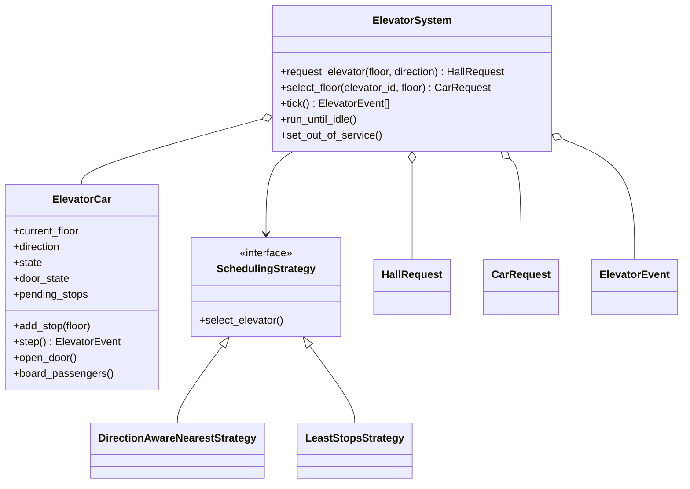
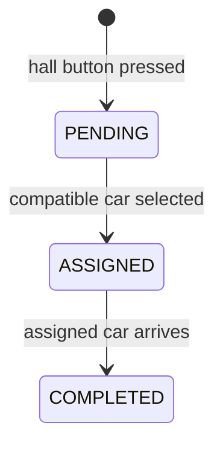
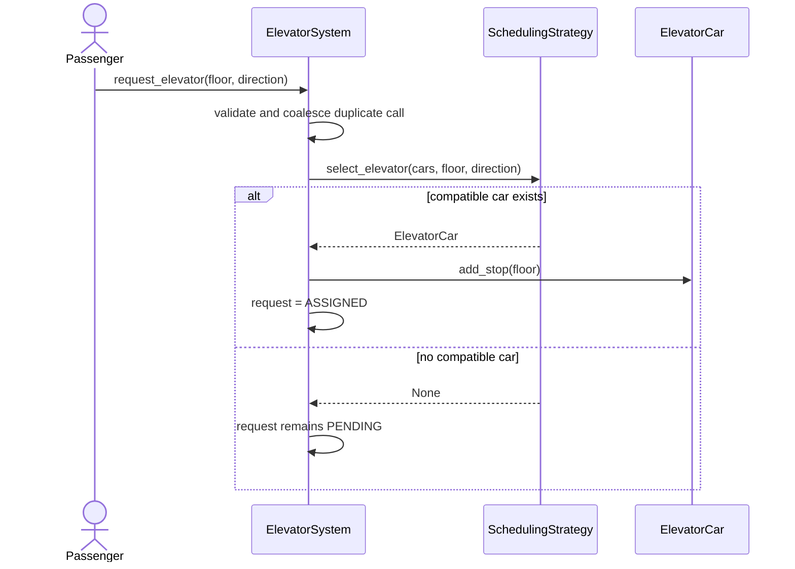

# Elevator Low-Level Design

Accept hall and car requests, choose a suitable elevator, and move each car through valid direction, stop, door, and service states.

## Understanding the Problem

Accept hall and car requests, choose a suitable elevator, and move each car through valid direction, stop, door, and service states.

The design starts with the business invariant and the critical workflow. Named patterns come later, only where a requirement creates a real variation or boundary.

## Requirements

### Clarifying Questions

- How many floors and cars exist?
- Are hall direction and internal destination distinct?
- Which scheduling goal matters most?
- Is capacity enforced?
- How are out-of-service and emergency modes handled?

### Final Requirements

1. Accept hall calls and internal destinations.
2. Assign hall calls using a direction-aware scheduling policy.
3. Move cars one floor per deterministic tick.
4. Serve stops in LOOK/SCAN-style order.
5. Protect door, capacity, floor-range, and service invariants.

The detailed reference below records additional assumptions, exclusions, validation rules, and edge cases.

## Core Entities and Relationships

| Entity | Responsibility |
|---|---|
| ElevatorSystem | Receives requests, dispatches, and advances the simulation. |
| ElevatorCar | Owns floor, direction, doors, capacity, and stops. |
| HallRequest | Represents floor plus desired direction. |
| CarRequest | Represents an internal destination. |
| SchedulingStrategy | Chooses a car for a hall call. |
| ElevatorEvent | Reports observable state changes. |

The object that owns mutable state also owns the invariant protecting that state. Coordinating services load collaborators and sequence the use case; they do not bypass entity behavior.

## Class Design

### Good Solution

Store distinct up/down stop sets and choose a direction-aware car rather than the absolute nearest car.

### Great Solution

Model request identity/type, coalesce duplicates, use LOOK ordering, isolate scheduling, and serialize each car's state transitions.

### Final Class Design

The critical collaboration is: accept hall call -> select/assign car -> record stops -> tick with doors closed -> arrive/open/complete -> choose next direction.

The full class map, state transitions, method contracts, and design rationale are preserved in the detailed reference below.

## Implementation

Implement one vertical slice before filling every class:

    accept hall call -> select/assign car -> record stops -> tick with doors closed -> arrive/open/complete -> choose next direction

### Complete Code Implementation

- [Models](./models/)
- [Services](./services/)
- [Strategies](./strategies/)
- [Demonstration](./main.py)
- [Tests](./tests/)

Run:

    python "solutions/elevator/main.py"
    python -m unittest discover -s "solutions/elevator/tests" -t "solutions/elevator" -v

## Verification

Verify the happy path, the highest-risk rejection, and state after failure. Then force two competing operations at the atomic boundary and assert the invariant, not thread timing.

The detailed reference lists problem-specific test cases and complexity.

## Extensibility

- Priority floors and express zones
- Request cancellation and aging
- Destination dispatch, maintenance, and emergency control

Each extension should enter through a named policy, boundary, or lifecycle change rather than a new conditional inside the main workflow.

## What Is Expected at Each Level?

### Junior

Deliver the agreed core workflow with coherent entities, valid state changes, and straightforward failure handling.

### Mid-level

Make invariants explicit, isolate real variations, cover failure paths with tests, and discuss the relevant concurrency boundary.

### Senior

Explain scheduling trade-offs, opposite-direction calls, starvation, per-car coordination, and the boundary to real hardware controllers.

## Interview Walkthrough

1. Clarify the version-one scope and exclusions.
2. State the invariants before drawing classes.
3. Introduce the core entities and walk: accept hall call -> select/assign car -> record stops -> tick with doors closed -> arrive/open/complete -> choose next direction.
4. Compare the good and great solution based on the stated requirements.
5. Implement a complete vertical slice and one failure test.
6. Handle a realistic follow-up through an explicit extension seam.

## Detailed Design Reference

<details>
<summary>Open the implementation-specific deep dive</summary>
This project is a beginner-friendly, working implementation of a multi-elevator
controller. It demonstrates elevator cars, hall buttons, internal floor
selection, direction-aware scheduling, pending requests, step-by-step movement,
door and capacity rules, and out-of-service handling.

No previous knowledge of low-level design, OOP, SOLID, scheduling algorithms,
or design patterns is required.

> This is a software design simulation, not safety-certified elevator control
> software. Real elevators require redundant hardware, certified controllers,
> brakes, sensors, emergency circuits, and jurisdiction-specific safety rules.

## 1. The problem in everyday language

A building contains multiple elevator cars. A person standing on a floor presses
UP or DOWN. The controller chooses a suitable car and sends it to that floor.
After entering, the passenger selects a destination inside the car. The car
serves stops in a sensible order, opens its doors at each stop, and eventually
becomes idle.

The system currently supports:

- Multiple cars sharing one building floor range.
- UP/DOWN hall requests.
- Internal destination requests.
- Direction-aware nearest-car scheduling.
- An alternative least-stops scheduler.
- LOOK-style stop ordering inside each car.
- Pending hall requests when no compatible car is available.
- Duplicate hall/internal request coalescing.
- Discrete `tick()` simulation with movement/arrival/door events.
- Door safety and passenger-capacity checks.
- Out-of-service and service-restoration workflows.
- Request status and event history.
- Floor, direction, identity, and configuration validation.

## 2. Start here: run it

Requirements:

- Python 3.10 or newer.
- No external packages.

From the `solutions/elevator` directory:

```powershell
python main.py
python -m unittest discover -s tests -v
```

The demonstration creates three cars, requests a pickup, boards one passenger,
selects a destination, advances the simulation, exits the passenger, and prints
movement and arrival events.

## 3. Scope and simplifying assumptions

Good LLD begins by stating what the system means and does not mean.

- Every car serves the same minimum and maximum floors.
- One `tick()` represents one controller step, not a specific number of seconds.
- A movement tick advances a car exactly one floor.
- An arrival opens the door; the following tick closes it.
- Travel time, door dwell time, acceleration, and floor height are simplified.
- Passenger boarding/exiting is invoked explicitly.
- Hall requests use conventional UP/DOWN buttons, not destination dispatch.
- Scheduling and simulation run synchronously in one process.

These assumptions keep attention on object collaboration and scheduling. The
advancement section explains how to make the model more realistic.

## 4. Domain vocabulary

| Term | Meaning |
|---|---|
| Elevator car | One physical cabin with position, direction, doors, and stops |
| Hall request | UP/DOWN call made outside a car |
| Car request | Destination selected from inside an assigned car |
| Scheduler | Algorithm that chooses a car for a hall request |
| Stop | A floor the car must serve |
| Controller | Coordinates requests, cars, scheduling, and completion |
| Tick | One discrete simulation/control-loop step |
| Event | Observable movement, arrival, or door-closing result |

### Hall request versus car request

They are separate because they contain different information and have different
assignment rules:

- Hall request: floor + desired direction; controller chooses the car.
- Car request: car ID + destination; the car is already known.

Trying to represent both with only a destination integer loses important domain
meaning.

## 5. Requirements converted into rules

1. Hall direction must be UP or DOWN, never IDLE.
2. UP cannot be requested from the highest floor.
3. DOWN cannot be requested from the lowest floor.
4. Floors must be inside the configured range.
5. A moving car cannot open its doors.
6. Passengers board or exit only while doors are open.
7. Passenger count cannot exceed capacity or fall below zero.
8. Out-of-service cars receive no new requests.
9. A car can leave service only when empty, stationary, and without stops.
10. Identical active hall calls are coalesced.
11. A moving car accepts a hall call only when direction and path are compatible.
12. Incompatible calls remain pending until a suitable car becomes available.

These invariants prevent many impossible or unsafe software states.

## 6. Project structure

```text
elevator/
|-- main.py
|-- models/
|   |-- enums.py                         # Directions, states, statuses, events
|   |-- request.py                       # HallRequest and CarRequest
|   |-- event.py                         # Immutable ElevatorEvent
|   `-- elevator_car.py                  # Car movement, routing, doors, capacity
|-- strategies/
|   |-- scheduling_strategy.py           # Scheduler contract
|   |-- direction_aware_nearest_strategy.py
|   `-- least_stops_strategy.py
|-- services/
|   `-- elevator_system.py               # Controller/orchestrator
`-- tests/
    `-- test_elevator_system.py           # Executable requirements
```

The car owns local physical state. A scheduler only selects a car. The system
controller owns cross-car request workflow.

## 7. Architecture at a glance



## 8. Modeling independent state dimensions

An elevator cannot be described by one status string. This model separates:

### Operational state

```text
IDLE, MOVING, OUT_OF_SERVICE
```

### Direction

```text
UP, DOWN, IDLE
```

### Door state

```text
OPEN, CLOSED
```

For example, a car may be operationally `IDLE` with doors `OPEN` at floor 3
while its planned direction is `UP` because more stops remain above. Combining
these concepts into a single enum would cause a large number of states such as
`IDLE_DOOR_OPEN_GOING_UP` and make transitions harder to reason about.

Enums prevent inconsistent magic strings such as `"up"`, `"UPWARD"`, and `1`.

## 9. Request lifecycle

Hall requests move through:



A request stays `PENDING` if every car is moving incompatibly, full, or out of
service. The controller retries pending requests before and after every tick and
when a car returns to service.

Car requests begin as `ASSIGNED` because the passenger is already inside a known
car. They become `COMPLETED` when that car reaches the destination.

## 10. Hall request workflow



If an eligible car is already stationary at the requested floor, the request is
completed immediately and its doors open.

## 11. Direction-aware scheduling

`DirectionAwareNearestStrategy` considers a car eligible when it is:

- Operational and not full; and
- Idle; or
- Moving in the requested direction with the floor still ahead.

Among eligible cars, it prefers:

1. Shortest floor distance.
2. A car already traveling in the requested direction.
3. Fewer pending stops.
4. Elevator ID as a deterministic tie-breaker.

### Why opposite-direction cars are not assigned immediately

Suppose E1 is traveling UP from floor 2 toward floor 8. A passenger at floor 5
wants to go DOWN. If floor 5 is inserted directly, the car would stop while
going UP and serve a directionally incompatible call. This design keeps the call
pending until E1 reverses/becomes idle or another compatible car is available.

Real controllers use more sophisticated cost functions, predicted passenger
destinations, zones, load, door time, and traffic patterns.

## 12. Strategy Pattern

Scheduling varies independently from the rest of the controller:

```python
class SchedulingStrategy(ABC):
    @abstractmethod
    def select_elevator(self, elevators, floor, direction):
        ...
```

Available implementations:

- `DirectionAwareNearestStrategy`: prioritizes physical closeness.
- `LeastStopsStrategy`: prioritizes the smallest compatible workload.

The controller calls the same method regardless of the algorithm. This is
polymorphism and the Strategy Pattern.

Inject another strategy without modifying request workflow:

```python
system = ElevatorSystem(cars, LeastStopsStrategy())
```

Future strategies could implement zoning, peak-hour rules, energy saving, or
destination dispatch.

## 13. Car routing: the LOOK algorithm

Each car stores pending stops in a set and follows a LOOK-style policy:

1. While going UP, serve stops above in ascending order.
2. Reverse only when no stops remain above.
3. While going DOWN, serve stops below in descending order.
4. When idle with stops on both sides, start toward the nearest stop.

Example from floor 0:

```text
Stops added: 5, 2, 4
Arrival order: 2, 4, 5
```

LOOK is related to the disk-scheduling algorithm. Unlike SCAN, it reverses at
the final requested stop rather than traveling to the physical end of the
building.

The pending-stop set automatically coalesces repeated internal stops.

## 14. Discrete tick simulation

The controller does not use real-time sleeps. Each call to `tick()` advances all
cars by at most one transition:

- Open door -> close door (`DOOR_CLOSED`).
- Closed, with stop -> move one floor (`MOVED`).
- Reach a stop -> open door (`ARRIVED`).
- No work -> no event.

```python
events = system.tick()
```

`run_until_idle()` repeatedly ticks until no active request, stop, or open door
remains. `max_ticks` protects tests and demos from infinite loops—for example,
if all cars remain out of service while a hall request is pending.

This deterministic simulation is easy to test because it does not depend on
wall-clock timing or background threads.

## 15. Arrival and request completion

When a car emits `ARRIVED`:

1. Its stop is removed.
2. Its operational state becomes `IDLE` at the floor.
3. Its door opens.
4. Assigned hall requests for that car/floor become `COMPLETED`.
5. Internal requests for that car/floor become `COMPLETED`.
6. Remaining stops determine the planned direction.
7. Pending hall calls are retried.

`event_history` provides an audit trail useful for tests, displays, logging, or
future observers.

## 16. Door and capacity encapsulation

`ElevatorCar` owns its safety-related software rules:

- `open_door()` rejects a moving/out-of-service car.
- Boarding and exiting require an open door.
- Boarding cannot exceed configured capacity.
- Exiting cannot remove more passengers than are present.

Outside code should call these methods rather than changing `door_state` or
`passenger_count` directly. This is encapsulation: the object that owns the
state enforces its valid transitions.

The scheduler excludes a full car from new hall assignments. Internal requests
remain usable so current passengers can leave.

## 17. Out-of-service workflow

A car may leave service only when:

- It is not moving.
- It has no pending stops.
- It contains no passengers.

The operation closes the door, clears direction, and sets
`OUT_OF_SERVICE`. Schedulers exclude the car. Restoring it sets `IDLE` and
immediately retries pending hall requests.

A production maintenance workflow would also evacuate requests safely, record a
reason, support emergency modes, and notify monitoring systems.

## 18. Controller/orchestrator pattern

`ElevatorSystem` coordinates objects across the whole building:

- Validates hall requests.
- Chooses scheduling strategy.
- Assigns calls.
- Advances cars.
- Completes requests on arrival.
- Retries pending calls.
- Maintains histories.

It delegates local movement/door logic to `ElevatorCar` and selection logic to a
strategy. This keeps the controller from becoming responsible for every detail.

## 19. Dependency injection

Cars and scheduler are supplied through the constructor:

```python
system = ElevatorSystem(
    elevators=[ElevatorCar("E1", 0, 10)],
    scheduling_strategy=DirectionAwareNearestStrategy(),
)
```

This makes dependencies visible and makes strategy replacement/testing simple.
`main.py` is the composition root where concrete objects are assembled.

## 20. SOLID principles

| Principle | Meaning | Example |
|---|---|---|
| Single Responsibility | One main reason to change | Car moves; scheduler selects; controller coordinates |
| Open/Closed | Extend without rewriting stable workflows | Add a scheduling strategy |
| Liskov Substitution | Implementations honor one contract | Either scheduler can be injected |
| Interface Segregation | Prefer focused contracts | Scheduler exposes one selection method |
| Dependency Inversion | High-level code uses abstractions | Controller depends on `SchedulingStrategy` |

The state enums are not the GoF State Pattern. They model explicit states while
behavior remains inside `ElevatorCar`. If transition logic grew dramatically,
separate state objects could become useful; introducing them now would add more
complexity than value.

## 21. Validation and defensive design

The implementation rejects:

- Empty elevator collections and duplicate elevator IDs.
- Cars configured with different building ranges.
- Invalid floor ranges, starting floors, and capacities.
- Hall calls outside the range or with IDLE direction.
- UP at the top and DOWN at the bottom.
- Internal selections for unknown/out-of-service cars.
- Door opening while moving.
- Boarding/exiting with closed doors.
- Capacity overflow and invalid passenger counts.
- Taking a busy or occupied car out of service.

Generic `ValueError` keeps the educational code small. A larger application
could use domain exceptions such as `InvalidFloorError`, `CapacityExceeded`, and
`ElevatorUnavailable`.

## 22. Tests as executable requirements

The suite covers:

- Nearest-car assignment.
- Pending opposite-direction calls and later completion.
- LOOK stop order.
- Immediate service at the current floor.
- Door and capacity safety.
- Out-of-service exclusion and restoration.
- Duplicate hall-call coalescing.
- Floor/direction validation.
- Common building-range validation.
- Scheduler interchangeability.
- Atomic rejection without leaving a partial internal request.

Run one focused test:

```powershell
python -m unittest tests.test_elevator_system.ElevatorSystemTest.test_opposite_direction_request_waits_then_completes -v
```

Tests call `tick()` directly, which makes every transition deterministic and
avoids slow timing-based assertions.

## 23. Complexity

Let `E` be elevator count, `S` stops in one car, and `R` active requests.

| Operation | Current complexity | Reason |
|---|---:|---|
| Schedule hall request | `O(E)` | Scheduler scans cars |
| Add/coalesce stop | `O(1)` average | Stops use a set |
| Choose next stop | `O(S log S)` | Stops above/below are sorted |
| Complete arrival requests | `O(R)` | Request dictionaries are scanned |
| One system tick | roughly `O(E * S log S + R)` | Each car advances; arrivals update requests |

Production optimization could use ordered stop sets/heaps and indexes by
`(elevator_id, floor)` for request completion.

## 24. Concurrency and real controllers

This simulation is intentionally single-threaded. In production, button events,
sensors, motor controllers, and network messages arrive concurrently.

Common designs include:

- One event loop/actor per elevator car, serializing its state changes.
- A dispatcher actor/service for hall calls.
- Durable event queues and idempotent request IDs.
- Hardware controllers that enforce safety independently of application code.
- State replication and failover for supervisory services.

Simply adding a Python lock is not enough for physical safety or distributed
coordination.

## 25. Current trade-offs

This focused LLD omits:

- Real-time travel/door timing and acceleration.
- Weight sensors and automatic passenger tracking.
- Destination-dispatch panels.
- Multiple shafts, express/zone-restricted cars, and sky lobbies.
- Emergency, fire, inspection, and evacuation modes.
- Door obstruction, overload alarm, and retry behavior.
- Request cancellation and fault reassignment.
- Energy-aware parking of idle cars.
- Traffic prediction and peak-hour policies.
- Persistence, monitoring, APIs, and distributed control.

The solution demonstrates application-level design concepts, not certified
electromechanical control logic.

## 26. Advancement exercises

Try these in increasing difficulty:

1. Add request cancellation before assignment.
2. Add door dwell-time ticks and obstruction retries.
3. Add weighted load rather than passenger count.
4. Reassign hall requests when a car fails.
5. Add floor display observers and event logging.
6. Add zone/express elevators with different served-floor sets.
7. Add a scheduler using estimated total wait time.
8. Add up-peak/down-peak traffic strategies.
9. Implement destination dispatch: passenger chooses destination in the hall.
10. Model fire-service and emergency states.
11. Replace scans with ordered stop queues and request indexes.
12. Convert each car into an actor with message-based concurrency.

For every extension, define:

- New states and legal transitions.
- Which object owns the state.
- Failure and recovery behavior.
- Scheduling impact.
- Deterministic tests for safety and fairness.

## 27. Interview explanation template

When presenting this design:

1. Clarify floors, cars, button type, capacity, and timing assumptions.
2. Separate hall and internal requests.
3. Explain car, door, direction, and request states.
4. Walk through hall assignment and one tick.
5. Explain direction compatibility and pending calls.
6. Describe LOOK stop ordering.
7. Explain the Strategy Pattern and injection.
8. Discuss safety validation, complexity, fairness, and starvation.
9. State concurrency limitations and production extensions.

The strongest LLD discussion explains why each state and class exists, not only
which pattern names appear in the diagram.

</details>
