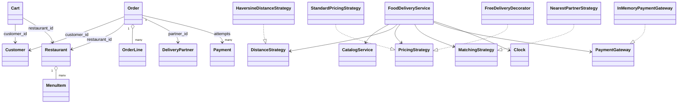

# Food Delivery Low-Level Design

This is a beginner-friendly, working Python design for restaurant discovery,
cart management, checkout, payment, kitchen preparation, delivery dispatch,
pickup, delivery, cancellation, and refunds. It demonstrates mutable menus,
immutable order snapshots, itemized pricing, geospatial matching, concurrent
partner assignment, and explicit state machines.

No previous knowledge of low-level design (LLD), object-oriented programming
(OOP), SOLID principles, design patterns, geospatial calculations, or delivery
platforms is required.

> This is an educational in-memory model, not a production ordering platform.
> Real systems require persistent inventory, restaurant tablets/POS integration,
> road routing, geographic dispatch, asynchronous workflows, food-safety and
> support operations, secure payments, fraud controls, and observability.

## 1. The problem in everyday language

A customer searches for an open nearby restaurant, selects available menu
items, and builds a cart. At checkout, the system freezes item names, prices,
and quantities into an order, calculates subtotal, delivery fee, tax, discount,
and total, then accepts payment.

The restaurant prepares the confirmed order and marks it ready. The system
finds a nearby available delivery partner and reserves that partner atomically.
Only the assigned partner may pick up and deliver the order. Before pickup, an
order may be cancelled; paid cancellation is refunded and any reserved partner
is released.

The implementation supports:

- Customers, restaurants, menu items, and delivery partners.
- Open/closed restaurants and available/unavailable items.
- Restaurant search by location, cuisine, and radius.
- Validated latitude and longitude plus Haversine distance.
- One-restaurant carts with add, update, remove, and clear behavior.
- Checkout-time menu revalidation.
- Immutable order-line snapshots.
- Itemized subtotal, delivery fee, tax, discount, and total.
- Standard distance-based delivery pricing.
- A composable free-delivery decorator.
- Failed-payment retry and idempotent successful payment.
- Restaurant preparation and ready-for-pickup states.
- Nearest available delivery-partner matching.
- Retryable assignment when no partner is available.
- Atomic in-process partner reservation.
- Assigned-partner authorization for pickup and delivery.
- Cancellation, refund, and partner release before pickup.
- Customer and restaurant order histories.
- Injectable time and deterministic tests.

## 2. Start here: run it

Requirements:

- Python 3.10 or newer.
- No third-party packages.

From the repository root:

```powershell
python "solutions/food-delivery/main.py"
python -m unittest discover -s "solutions/food-delivery/tests" -t "solutions/food-delivery" -v
```

Or from inside `solutions/food-delivery`:

```powershell
python main.py
python -m unittest discover -s tests -v
```

The demo finds a restaurant, orders two burgers and fries, displays itemized
pricing, pays with UPI, advances preparation, assigns the nearest partner, and
completes delivery.

## 3. LLD and OOP in two minutes

**Low-level design** translates "build food delivery" into concrete questions:

- Is a cart item the same as an ordered line item?
- What happens if a menu price changes after checkout?
- Which order states are legal and who may advance them?
- When may cancellation refund money?
- How is one delivery partner protected from two simultaneous assignments?
- Which calculations and external systems should be replaceable?

**Object-oriented programming** gives each rule a natural owner:

- `Restaurant` owns its current `MenuItem` objects.
- `Cart` owns a customer's editable item quantities.
- `Order` owns frozen `OrderLine` snapshots and lifecycle timestamps.
- `CatalogService` manages registered catalog data.
- `FoodDeliveryService` coordinates ordering, payment, dispatch, and delivery.
- Strategies isolate distance, pricing, and matching algorithms.
- `PaymentGateway` isolates provider behavior.

The aim is not maximum class count. It is clear ownership and testable rules.

## 4. Scope and simplifying assumptions

- One cart and order contain items from exactly one restaurant.
- Quantity is an integer; item-level stock count is not modeled.
- Restaurant and menu availability are checked at cart add and checkout.
- Checkout immediately snapshots and clears the cart.
- A failed payment is retried on the pending order, not the cart.
- One currency is used; demo amounts are described as rupees.
- Tax is five percent of food subtotal in the standard strategy.
- Delivery fee is a base fee plus straight-line distance fee.
- Payment is required before preparation starts.
- Partner assignment occurs after the order is ready.
- A reserved partner is unavailable to other orders.
- Cancellation is allowed until pickup and uses a full refund.
- Cash is simulated through the same fake gateway for simplicity.
- Ratings, tips, coupons, restaurant capacity, and item inventory are omitted.
- All data, payments, and locks live in one Python process.

These are deliberate boundaries. Production policies belong in explicit
objects and durable workflows instead of hidden assumptions.

## 5. Domain vocabulary

| Term | Meaning | Example |
|---|---|---|
| Customer | Person placing an order | Asha |
| Restaurant | Food provider with a menu and location | Design Diner |
| Menu item | Current sellable catalog item | Burger, INR 200 |
| Cart | Editable pre-checkout selection | Two burgers and fries |
| Order line | Frozen checkout snapshot | Burger at INR 200 x 2 |
| Order | Payment, preparation, and delivery lifecycle | Ready for pickup |
| Price breakdown | Subtotal plus fees, tax, discount, total | INR 596.48 |
| Delivery partner | Courier who picks up and delivers | Deepa |
| Dispatch | Selection and reservation of one partner | dp1 assigned |
| Terminal state | State with no later business transition | Delivered/cancelled |

## 6. Cart versus order snapshot

This is the most important modeling distinction in the solution.

### Cart

A cart is editable and refers to the restaurant's current menu item IDs. The
customer can change quantities, remove items, or clear it. Availability and
price may still change before checkout.

### Order

An order is a commercial record. Each `OrderLine` copies:

- Item ID.
- Item name.
- Unit price.
- Quantity.
- Line total.

```text
Menu today: Burger = INR 200
       |
       +--- checkout -> OrderLine(Burger, INR 200, quantity 2)
       |
Menu tomorrow: Burger = INR 250

Existing order remains INR 200 per burger.
```

If an order stored only a live `MenuItem` reference and recomputed later, a menu
edit could silently alter money the customer already accepted. Snapshotting is
common in orders, invoices, tickets, shipments, and financial records.

## 7. Project structure

```text
food-delivery/
|-- main.py
|-- models/
|   |-- enums.py
|   |-- money.py
|   |-- location.py
|   |-- customer.py
|   |-- menu_item.py
|   |-- restaurant.py
|   |-- cart.py
|   |-- price_breakdown.py
|   |-- order.py
|   |-- delivery_partner.py
|   `-- payment.py
|-- strategies/
|   |-- distance_strategy.py
|   |-- haversine_distance_strategy.py
|   |-- pricing_strategy.py
|   |-- standard_pricing_strategy.py
|   |-- free_delivery_decorator.py
|   |-- matching_strategy.py
|   `-- nearest_partner_strategy.py
|-- services/
|   |-- clock.py
|   |-- catalog_service.py
|   |-- payment_gateway.py
|   |-- in_memory_payment_gateway.py
|   `-- food_delivery_service.py
`-- tests/
    `-- test_food_delivery.py
```

Models express business state, strategies express variable algorithms, and
services coordinate workflows involving several models.

## 8. Requirements mapped to responsibilities

| Requirement | Responsible type |
|---|---|
| Validate coordinates | `Location` |
| Store customers, restaurants, menus, partners | `CatalogService` |
| Protect unique menu/partner data | `Restaurant`, `CatalogService` |
| Find open nearby restaurants | `FoodDeliveryService` + `DistanceStrategy` |
| Enforce one-restaurant cart | `FoodDeliveryService.add_to_cart()` |
| Snapshot and price checkout | `FoodDeliveryService.checkout()` |
| Calculate itemized total | `PricingStrategy` |
| Charge/refund provider | `PaymentGateway` |
| Protect preparation transitions | `FoodDeliveryService` |
| Select one available courier | `MatchingStrategy` |
| Atomically reserve/release courier | `FoodDeliveryService` |
| Supply controllable current time | `Clock` |

## 9. Class relationships



## 10. State machines

### Order lifecycle

```text
PENDING_PAYMENT -> CONFIRMED -> PREPARING -> READY_FOR_PICKUP
       |               |           |                |
       |               |           |                | assigned partner picks up
       |               |           |                v
       +---------------+-----------+-------> OUT_FOR_DELIVERY -> DELIVERED
                       |
                       +----------------------------> CANCELLED
```

More precisely:

- Failed payment keeps `PENDING_PAYMENT` for retry.
- Successful payment moves to `CONFIRMED`.
- Restaurant moves confirmed to `PREPARING`, then `READY_FOR_PICKUP`.
- Partner assignment does not change order state; it records ownership.
- Assigned partner moves ready to `OUT_FOR_DELIVERY`, then `DELIVERED`.
- Cancellation is allowed from pending through ready, but not after pickup.

### Delivery-partner lifecycle

```text
OFFLINE <-------> AVAILABLE -------> ON_DELIVERY
                       ^                  |
                       |                  |
                       +-- cancel/deliver-+
```

`ON_DELIVERY` begins at assignment, not pickup. It means the partner is reserved
and must not be assigned another order.

### Payment lifecycle

```text
charge -> COMPLETED -> REFUNDED
      `-> FAILED -> retry -> COMPLETED
```

Every attempt remains in history. A repeated successful payment call returns
the existing completed payment instead of charging again.

## 11. Restaurant search and distance

Restaurant search filters:

1. `OPEN` status.
2. Optional case-insensitive cuisine.
3. Maximum delivery radius.
4. Sort by distance, then restaurant name.

`HaversineDistanceStrategy` computes great-circle distance between latitude and
longitude points. It is useful for an educational radius filter, but it does
not follow roads, traffic, one-way restrictions, or bridges.

Production systems typically use:

- Fast straight-line/geospatial filtering for candidates.
- A road-routing provider for realistic delivery distance and ETA.
- Live traffic and preparation time for promised delivery windows.
- Serviceable polygons instead of a single circular radius.

The distance interface lets that implementation change independently.

## 12. Cart and checkout workflow

### Add to cart

1. Validate customer, restaurant, quantity, and menu item.
2. Require the restaurant to be open and item available.
3. If the cart already contains another restaurant, reject the operation.
4. Add to the existing quantity for the same item.

`update_cart_item()` changes quantity; zero or negative removes the line. When
the last item is removed, restaurant ownership is cleared.

### Checkout

1. Reject an empty cart.
2. Recheck restaurant status.
3. Recheck every item's availability and use its current price.
4. Build immutable order-line snapshots.
5. Calculate restaurant-to-customer delivery distance.
6. Ask the pricing strategy for an itemized total.
7. Store a `PENDING_PAYMENT` order.
8. Clear the cart.

Clearing at order creation means a failed payment retries the exact order
snapshot. New cart edits cannot accidentally change the pending payment amount.

## 13. Pricing and exact money

Money uses `Decimal` rather than binary floating point and is normalized to two
places with `ROUND_HALF_UP`.

The standard pricing strategy calculates:

```text
subtotal     = sum(order line totals)
delivery fee = INR 30 + INR 8 * distance in km
tax          = 5% * subtotal
discount     = INR 0
total        = subtotal + delivery fee + tax - discount
```

The demo cart has an INR 500 subtotal. Its exact delivery fee depends on
restaurant-to-customer distance, and tax is INR 25.

`FreeDeliveryDecorator` wraps any pricing strategy and waives delivery fee when
subtotal reaches a configured threshold:

```python
pricing = FreeDeliveryDecorator(StandardPricingStrategy(), "500")
```

The same INR 500 cart becomes INR 525: subtotal plus tax, with zero delivery fee.
Future strategies could handle coupons, membership, packaging, surge, small-cart
fees, restaurant-funded discounts, tips, and region-specific taxes.

## 14. Payment and restaurant workflow

### Pay

1. Look for an existing completed payment for idempotency.
2. Require `PENDING_PAYMENT` if no success exists.
3. Record the new gateway attempt whether it succeeds or fails.
4. On success, move the order to `CONFIRMED` and record time.
5. On failure, leave it pending for another method.

### Prepare

The restaurant transition is intentionally strict:

```text
CONFIRMED -> PREPARING -> READY_FOR_PICKUP
```

It cannot mark an unpaid order ready or skip preparation. Repeated requests for
the current state are idempotent.

In production, restaurant acceptance/rejection, preparation estimates, stock
reservation, partial unavailability, and substitution require additional states.

## 15. Partner dispatch and concurrency

When an order is ready:

1. Filter partners that are `AVAILABLE` and inside the restaurant pickup radius.
2. Ask `NearestPartnerStrategy` to choose by distance, then stable partner ID.
3. In the same lock, mark the partner `ON_DELIVERY` and store ownership on order.
4. If no candidate exists, leave the order ready and return `None` for retry.

Without atomicity, two ready orders could both observe one partner as available:

```text
Order A sees dp1 AVAILABLE
Order B sees dp1 AVAILABLE
Order A assigns dp1
Order B assigns dp1
```

The service uses one `RLock` around live partner state and order transitions.
The two-thread test races two orders against one partner and asserts only one
assignment succeeds.

### Production limitation

A global in-memory lock works in one process only and serializes unrelated
regions. Production dispatch commonly uses:

- Geographic partitions/cells.
- Geospatial partner indexes.
- Atomic compare-and-set from available to reserved.
- Partner reservation leases and fencing tokens.
- Partner-specific actors or ordered event partitions.
- Idempotent offer/accept workflows and timeouts.

The durable ownership system must choose the winner, not a location cache.

## 16. Pickup, delivery, and authorization

Only the order's `delivery_partner_id` may pick up or deliver it.

### Pickup

- Require `READY_FOR_PICKUP`.
- Require assigned partner and `ON_DELIVERY` partner state.
- Move partner location to restaurant.
- Change order to `OUT_FOR_DELIVERY` and record pickup time.

### Delivery

- Require `OUT_FOR_DELIVERY`.
- Require assigned partner.
- Move partner location to customer.
- Release partner to `AVAILABLE`.
- Change order to `DELIVERED` and record delivery time.

Idempotent retries still validate partner identity. A wrong caller cannot obtain
success merely because the legitimate partner already advanced the state.

## 17. Cancellation and refund ordering

Cancellation is allowed before pickup:

- Pending payment: cancel without refund.
- Confirmed/preparing: refund completed payment, then cancel.
- Ready with assigned partner: refund, release partner, then cancel.
- Out for delivery/delivered: reject.
- Already cancelled: return the same order.

Refund occurs before cancellation state and partner release. If an external
refund fails, the order remains in its existing paid state instead of falsely
claiming that cancellation completed.

Real policies depend on restaurant progress, responsibility, time, food waste,
support decisions, and partial refunds. A `CancellationPolicy` Strategy would be
a natural extension.

## 18. Design patterns used

### Strategy

- `DistanceStrategy`: geographic calculation.
- `PricingStrategy`: itemized order pricing.
- `MatchingStrategy`: delivery-partner selection.

Each algorithm can vary independently from order state transitions.

### Decorator

`FreeDeliveryDecorator` wraps a pricing strategy and adds threshold behavior
without creating subclasses for every base-pricing/promotion combination.

### Gateway / Adapter boundary

`PaymentGateway` exposes only charge and refund. A provider adapter can replace
the in-memory fake without changing order workflow.

### Dependency injection

The delivery service receives catalog, distance, pricing, matching, gateway,
clock, and radius configuration. Tests control all variable boundaries.

### Service layer

`FoodDeliveryService` coordinates cross-model business transactions. Models
remain focused, and `main.py` remains only a client.

## 19. OOP and SOLID lessons

### Encapsulation

`Location` protects coordinate ranges. `Restaurant.add_menu_item()` protects
unique IDs/names and positive prices. The service protects legal transitions.

### Abstraction

Ordering depends on distance, pricing, matching, time, and payment contracts,
not their concrete implementation details.

### Composition over inheritance

A restaurant contains menu items, an order contains lines, and a pricing
decorator contains another strategy. These are natural composition relationships.

### Single Responsibility Principle

- Models represent business state.
- Catalog manages stable registrations and menu data.
- Delivery service manages transactional workflow and live ownership.
- Strategies calculate/select.
- Gateway handles payment-provider behavior.

### Open/Closed Principle

Road distance, coupon pricing, or different dispatch policies can be added
without editing the order state machine.

### Liskov Substitution Principle

Any correct strategy or gateway implementation can replace the current one.

### Interface Segregation Principle

Interfaces stay small. Pricing does not know pickup logic, and matching does not
know payment behavior.

### Dependency Inversion Principle

High-level delivery rules depend on abstractions at external or variable
boundaries.

## 20. Validation and important edge cases

The implementation handles or rejects:

- Invalid, infinite, or out-of-range coordinates.
- Duplicate customers, restaurants, menu IDs/names, partners, and phones.
- Non-positive prices, quantities, or search radii.
- Closed restaurants and unavailable items.
- Mixing restaurants in one cart.
- Empty cart checkout.
- Items becoming unavailable between cart and checkout.
- Later menu price changes affecting old orders.
- Payment retry and repeated successful payment.
- Preparation before payment or skipping preparation.
- Assignment before ready state.
- No nearby partner and later assignment retry.
- Partner going offline while reserved.
- Wrong-partner pickup or delivery, including repeated calls.
- Cancellation without reason or after pickup.
- Paid cancellation refund and partner release.

## 21. Complexity

Let `R` be restaurants, `M` items in the cart, `P` delivery partners, and `O`
stored orders.

| Operation | Time | Extra space |
|---|---:|---:|
| Search restaurants | `O(R log R)` | `O(R)` |
| Add/update cart item | `O(1)` average | `O(1)` |
| Checkout | `O(M)` | `O(M)` immutable lines |
| Pay/cancel | `O(payment attempts)` | `O(1)` |
| Assign partner | `O(P)` | `O(P)` candidates |
| Pickup/deliver | `O(1)` average | `O(1)` |
| Customer/restaurant history | `O(O log O)` | `O(O)` |

Production search and dispatch use indexes, geographic partitions, restaurant
availability caches, event streams, and purpose-built query stores instead of
scanning every object.

## 22. Test coverage

The 18-test suite verifies:

- Coordinate validation and restaurant search filters.
- Cart quantity accumulation and one-restaurant invariant.
- Item unavailability at cart and checkout.
- Frozen order lines and exact itemized totals.
- Menu price mutation not affecting placed orders.
- Free-delivery threshold behavior.
- Failed-payment retry and idempotent success.
- Strict preparation transition order.
- Nearest partner assignment and idempotency.
- No-partner result and later retry.
- Pickup/delivery authorization, including terminal retries.
- Delivery completion, location update, and partner release.
- Pending cancellation and paid cancellation/refund.
- Cancellation rejection after pickup.
- Partner offline safety while reserved.
- Newest-first customer and restaurant history.
- A two-thread/two-order/one-partner race with exactly one assignment.

Tests are executable business requirements. Add a test whenever state, pricing,
inventory, dispatch, payment, or cancellation policy changes.

## 23. Production evolution

A practical evolution path is:

1. Add repository interfaces and durable transactional storage.
2. Add restaurant operating hours, service polygons, capacity, and item stock.
3. Reserve inventory during checkout with expiry and compensation.
4. Integrate restaurant POS/tablet acceptance and preparation events.
5. Add road-routing ETA and live partner GPS streams.
6. Partition partner dispatch geographically with atomic reservation leases.
7. Add coupons, membership, taxes, packaging, tips, surge, and fee line items.
8. Add cancellation/refund policies and support overrides.
9. Process signed payment webhooks with idempotency and reconciliation.
10. Publish reliable events with an outbox for notifications and analytics.
11. Add ratings, reviews, substitutions, partial refunds, and missing-item flows.
12. Add authentication, authorization, privacy, fraud, tracing, and alerts.

### Failures a production design must answer

- Payment succeeded but confirmation response was lost.
- Restaurant rejected after payment.
- An item sold out during checkout.
- Partner reservation succeeded but assignment notification failed.
- Partner accepted after the reservation lease expired.
- GPS and order events arrived late or out of order.
- Refund succeeded remotely but local status update failed.
- An order was delivered partially or to the wrong location.

These need durable workflows, idempotency, leases, event ordering,
reconciliation, and compensation—not merely more classes.

## 24. Suggested learning exercises

### Beginner

- Validate non-blank customer, restaurant, and item fields.
- Search vegetarian items and maximum price.
- Add item notes such as "no onions".
- Print an itemized receipt.

### Intermediate

- Add item stock reservation and release.
- Add restaurant accept/reject and preparation estimate.
- Add coupon, tax, tip, packaging, and small-cart pricing decorators.
- Add cancellation policy strategies and partial refunds.
- Add customer, restaurant, and partner ratings.

### Advanced

- Add geospatial partner indexing and reservation leases.
- Model asynchronous restaurant and partner offer workflows.
- Implement payment webhooks and reconciliation.
- Add an outbox and event-driven notifications.
- Handle substitutions, missing items, and split refunds.
- Load-test high-demand ordering and dispatch by geographic partition.

Start every exercise with an invariant. Example: "One available partner may be
owned by at most one non-terminal delivery assignment." Then choose the object,
atomic store operation, timeout, and test that enforce it.

## 25. Interview discussion guide

A strong explanation usually follows this order:

1. Clarify browse, cart, payment, preparation, dispatch, and cancellation scope.
2. Explain mutable menu items versus immutable order-line snapshots.
3. Walk through order, partner, and payment state machines.
4. Explain the itemized Pricing Strategy and free-delivery Decorator.
5. Explain distance filtering and partner Matching Strategy.
6. State the exclusive-partner invariant and atomic dispatch boundary.
7. Explain retry/idempotency and refund-before-release ordering.
8. Explain Gateway, Clock, and dependency injection.
9. Admit the global one-process lock and straight-line-distance limitations.
10. Evolve toward inventory, geospatial partitions, events, and reconciliation.

Strong LLD is demonstrated by ownership, invariants, transitions, and failure
handling—not by memorizing a class diagram.
