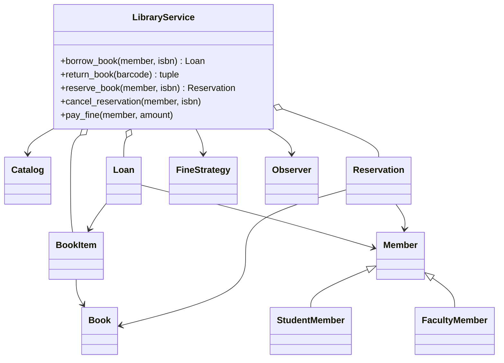

# Library Management Low-Level Design

This project is a beginner-friendly, working implementation of a library
management system. It demonstrates how books, physical copies, members, loans,
reservations, fines, notifications, and business rules can be modeled with
object-oriented design.

No previous knowledge of low-level design, OOP, SOLID, or design patterns is
required. The guide starts with the real-world problem and gradually connects
it to the code.

## 1. The problem in everyday language

A library stores book information and one or more physical copies of each book.
Members search the catalog, borrow an available copy, return it by a due date,
pay overdue fines, or join a reservation queue when all copies are unavailable.

The system currently supports:

- Search by title, author, category, and ISBN.
- Multiple physical copies of the same book.
- Student and faculty members with different limits and loan periods.
- Active, blocked, and closed accounts.
- Borrowing and returning physical copies.
- Daily overdue fines and no-fine configuration.
- FIFO reservation queues.
- Reservation cancellation and protected pickup copies.
- Email-style notifications and event logging through observers.
- Duplicate ISBN, barcode, and reservation validation.

This is an in-memory design. Restarting the program clears all data.

## 2. Start here: run it

Requirements:

- Python 3.10 or newer.
- No external packages.

From the `solutions/library-management` directory:

```powershell
python main.py
python -m unittest discover -s tests -v
```

The demonstration creates a book and copy, creates student/faculty members,
borrows the copy, queues a reservation, returns it overdue, pays the fine,
notifies the waiting member, and completes the reserved borrowing.

## 3. The most important modeling distinction

### Book versus BookItem

A `Book` is bibliographic information shared by every copy:

- Title
- ISBN
- Author
- Category
- Publisher

A `BookItem` is one physical copy:

- Barcode
- Shelf location
- Availability status
- Current borrower
- Member for whom it is reserved

Suppose a library owns three copies of the same novel. There is one `Book`
record and three `BookItem` objects with different barcodes.

```text
Book: Clean Code, ISBN 978-0132350884
|-- BookItem: barcode C001, shelf A-10, AVAILABLE
|-- BookItem: barcode C002, shelf A-10, ISSUED
`-- BookItem: barcode C003, shelf B-02, RESERVED
```

If availability were stored directly on `Book`, the system could not represent
one issued copy and one available copy at the same time. Recognizing this
difference is a classic LLD interview insight.

## 4. Domain vocabulary

| Term | Meaning |
|---|---|
| Author | Person who wrote a book |
| Catalog | Searchable collection of book metadata |
| Member | Account allowed to borrow/reserve books |
| Librarian | Staff account represented in the model |
| Loan | One physical copy borrowed for a period |
| Reservation | A member's place in the waiting queue for a book |
| Notification | Message sent to a member |
| Fine strategy | Rule used to calculate overdue charges |

## 5. Requirements converted into rules

1. Only active members can borrow or reserve.
2. Students may borrow at most 5 books for 14 days.
3. Faculty may borrow at most 20 books for 30 days.
4. Only an available copy—or a copy reserved for that member—can be borrowed.
5. A member cannot create duplicate active reservations for the same book.
6. A currently available book does not need a reservation.
7. Reservations are processed in first-in, first-out order.
8. A returned copy is protected for the first waiting member.
9. An overdue return increases the member's outstanding fine.
10. Fine payments must be positive and cannot exceed the outstanding balance.

LLD is not just listing classes. These rules determine which methods exist and
where validations belong.

## 6. Project structure

```text
library-management/
|-- main.py                         # Composition root and demonstration
|-- models/
|   |-- author.py, book.py          # Bibliographic metadata
|   |-- book_item.py                # Physical copy state
|   |-- person.py, account.py       # Shared identity/account data
|   |-- member.py                   # Abstract member contract
|   |-- student_member.py           # Student borrowing policy
|   |-- faculty_member.py           # Faculty borrowing policy
|   |-- librarian.py                # Librarian account model
|   |-- catalog.py                  # Search behavior
|   |-- loan.py                     # Borrowing record
|   |-- reservation.py              # Reservation lifecycle
|   |-- notification.py             # Member message
|   `-- enum.py                     # Fixed types and statuses
|-- factories/
|   `-- member_factory.py            # Student/faculty construction
|-- strategies/
|   |-- fine_strategy.py             # Fine contract
|   |-- daily_fine_strategy.py       # INR 2 per overdue day
|   `-- no_fine_strategy.py          # Zero-fine policy
|-- observers/
|   |-- observer.py, subject.py      # Observer infrastructure
|   |-- email_observer.py            # Human-readable event output
|   `-- logger_observer.py           # Timestamped event logging
|-- services/
|   |-- library_service.py           # Main workflow/orchestrator
|   `-- notification_service.py      # Notification delivery abstraction
`-- tests/
    `-- test_library_service.py       # Executable requirements
```

## 7. Architecture at a glance



`LibraryService` is the orchestrator. It coordinates models and delegates
specialized rules instead of implementing everything as one giant method.

## 8. OOP foundations in this design

### Encapsulation

Objects group related state and behavior. `Catalog` owns search behavior;
`LibraryService` owns workflow validation; member subclasses own their borrowing
limits.

### Abstraction

`FineStrategy`, `Observer`, and `Member` define contracts. Callers can work with
those contracts without knowing which concrete implementation is present.

### Inheritance

`StudentMember` and `FacultyMember` inherit common account/member state and
provide different policy values:

```python
class StudentMember(Member):
    MAX_BOOKS = 5
    LOAN_PERIOD_DAYS = 14
```

Inheritance is appropriate here because both types truly are members and honor
the same behavior contract. If policies became configurable per member, policy
composition could be better than adding many subclasses.

### Polymorphism

`LibraryService` calls `member.get_loan_period()` and receives 14 or 30 without
checking whether the object is a student or faculty member. The same method call
behaves according to the concrete object.

### Composition

A `Loan` contains references to a `Member` and `BookItem`. A `BookItem` contains
a `Book`. These “has-a” relationships are composition/association rather than
inheritance.

## 9. Search workflow

`LibraryService` exposes search methods and delegates them to `Catalog`:

```python
matches = library.search_by_title("harry potter")
book = library.search_by_isbn("978-0439708180")
```

Title and author searches are case-insensitive partial matches. Category is a
case-insensitive exact match. ISBN is exact and unique.

This implementation scans an in-memory list. A production implementation would
delegate to repository/database queries and indexes.

## 10. Borrowing workflow

```mermaid
sequenceDiagram
    actor Member
    participant Library as LibraryService
    participant Catalog
    participant Copy as BookItem

    Member->>Library: borrow_book(member, isbn)
    Library->>Library: verify ACTIVE account and borrowing limit
    Library->>Catalog: search_by_isbn(isbn)
    Catalog-->>Library: Book
    Library->>Library: find AVAILABLE or member-reserved copy
    Library->>Copy: status = ISSUED; set borrower
    Library->>Library: create Loan with member-specific due date
    Library-->>Member: Loan
```

If the copy was `RESERVED` for this member, the related ready reservation moves
to `COMPLETED`. Another member cannot borrow that protected copy.

### Why Loan is a separate object

The current state of a copy cannot answer historical questions such as who
borrowed it last month or whether it was returned late. `Loan` records the
relationship and timestamps for one borrowing session.

## 11. Return and fine workflow

On return, the service:

1. Finds the active loan by barcode.
2. Sets `return_date`.
3. Delegates fine calculation to `FineStrategy`.
4. Adds the fine to `member.total_fine`.
5. Removes the copy from the member's borrowed list.
6. Marks the copy available.
7. Emits `BOOK_RETURNED`.
8. Processes the next waiting reservation, if any.

`DailyFineStrategy` calculates:

```text
overdue days = max(0, return date - due date)
fine = overdue days * INR 2
```

Examples:

- Returned on/before due date: INR 0.
- Returned 3 calendar days late: `3 * 2 = INR 6`.

## 12. Reservation state machine

Reservations use explicit states:

```mermaid
stateDiagram-v2
    [*] --> WAITING: all copies unavailable
    WAITING --> READY: a copy is returned
    READY --> COMPLETED: member borrows held copy
    WAITING --> CANCELLED: member cancels
    READY --> CANCELLED: member cancels; copy offered to next member
```



The waiting queue is a `deque`, which provides efficient FIFO `append()` and
`popleft()` operations.

When a copy becomes ready:

- `BookItem.status` becomes `RESERVED`.
- `BookItem.reserved_for_id` identifies the allowed member.
- A notification is sent.
- Observers receive `RESERVATION_AVAILABLE`.

If a ready reservation is cancelled, the same copy is immediately offered to
the next waiting member. This is a good example of coordinating two related
state machines: reservation state and physical-copy state.

## 13. Strategy Pattern: fines

`FineStrategy` is a contract:

```python
class FineStrategy(ABC):
    @abstractmethod
    def calculate_fine(self, loan: Loan) -> float:
        ...
```

Available implementations:

- `DailyFineStrategy`: INR 2 for each overdue calendar day.
- `NoFineStrategy`: always returns zero.

The return workflow does not change when the policy changes. It only depends on
the abstraction. Future strategies could vary by membership tier, book type, or
progressive overdue slabs.

## 14. Factory Pattern: member creation

Creating a member requires several inherited fields. `MemberFactory` provides
one place to select the concrete subtype and construct it correctly:

```python
student = MemberFactory.create_member(
    account_id="student-1",
    name="Aarav",
    email="aarav@example.com",
    phone="+91-9000000001",
    member_type=MemberType.STUDENT,
)
```

The factory currently creates students and faculty. `Librarian` has a different
role and is modeled separately rather than being returned from this member
factory.

Use a factory when construction includes subtype selection, validation, default
values, or dependencies. A factory is unnecessary for a trivial constructor
with no variation.

## 15. Observer Pattern: domain events

`LibraryService` is a `Subject`. Observers subscribe with `attach()`:

```python
library.attach(EmailObserver())
library.attach(LoggerObserver())
```

The service emits events such as:

- `BOOK_BORROWED`
- `BOOK_RETURNED`
- `BOOK_RESERVED`
- `RESERVATION_AVAILABLE`
- `FINE_PAID`

Observers react without the core workflow directly calling email/logger code.
This reduces coupling and allows new reactions—analytics, audit storage, push
notifications—to be added independently.

The current observers run synchronously. If an observer were slow or failed, it
could affect the request. Production systems often publish events to a durable
queue and process them asynchronously.

## 16. Dependency injection and composition root

Concrete dependencies are selected in `main.py`:

```python
library = LibraryService(
    catalog=Catalog(),
    book_items=[],
    loans=[],
    notification_service=NotificationService(),
    fine_strategy=DailyFineStrategy(),
)
```

This is dependency injection. The service receives collaborators instead of
creating hidden global objects. Tests can provide controlled implementations.

`main.py` is called the composition root because it assembles the object graph.

## 17. SOLID principles in this design

| Principle | Meaning | Example |
|---|---|---|
| Single Responsibility | One main reason to change | Catalog searches; fine strategy calculates fines |
| Open/Closed | Extend behavior without rewriting stable workflow | Add another `FineStrategy` or `Observer` |
| Liskov Substitution | Subtypes honor their parent contract | Student/faculty both behave as `Member` |
| Interface Segregation | Prefer small focused contracts | `Observer.update()` and `FineStrategy.calculate_fine()` |
| Dependency Inversion | High-level code uses abstractions | `LibraryService` depends on `FineStrategy` |

Patterns and SOLID are tools for managing change. They are not goals by
themselves, and more classes do not automatically mean a better design.

## 18. Validation and defensive design

The implementation rejects:

- Borrow/reserve operations from blocked or closed accounts.
- Borrowing beyond the member limit.
- Missing books or unavailable copies.
- Duplicate ISBNs and barcodes.
- Copies whose metadata does not match the catalog.
- Reservations while a copy is already available.
- Duplicate active reservations.
- Returning a barcode without an active loan.
- Invalid, negative, or excessive fine payments.

These checks keep the object graph in valid states. In a larger system,
domain-specific exceptions could replace generic `ValueError`.

## 19. Tests as executable requirements

The suite covers:

- Catalog search and duplicate ISBN validation.
- Borrowing state and member-specific due dates.
- Blocked members and borrowing limits.
- Correct reservation ownership and completion.
- Overdue fine calculation and payment.
- Queue advancement after reservation cancellation.

Run a focused test:

```powershell
python -m unittest tests.test_library_service.LibraryServiceTest.test_return_makes_reservation_ready_for_correct_member -v
```

Read tests using Arrange, Act, Assert:

1. Arrange the catalog, copies, and members.
2. Act by borrowing/returning/reserving.
3. Assert statuses, collections, notifications, and errors.

## 20. Complexity

Let `B` be books, `C` copies, `L` loans, and `R` reservation history.

| Operation | Current complexity | Reason |
|---|---:|---|
| Search title/author/category | `O(B)` | Catalog list scan |
| Search ISBN | `O(B)` | Catalog list scan |
| Find available copy | `O(C)` | Copy list scan |
| Find active loan | `O(L)` | Loan list scan |
| Queue next reservation | `O(1)` | `deque.popleft()` |
| Duplicate reservation check | `O(R)` | History scan |

A production implementation would use database indexes for ISBN, barcode,
active loans, and active reservations.

## 21. Concurrency considerations

Unlike the Parking Lot example, this service does not yet contain locking.
Concurrent borrow requests could both observe the same copy as available before
either marks it issued.

Within one process, a lock around borrow/return/reserve transitions could help.
Across servers, use database transactions and conditional updates, for example:

```sql
UPDATE book_item
SET status = 'ISSUED'
WHERE barcode = ? AND status = 'AVAILABLE';
```

The operation succeeds only if one row changes. This turns availability checking
and claiming into one atomic database operation.

## 22. Current trade-offs

This focused LLD intentionally omits:

- Database repositories and persistence.
- Authentication and authorization.
- Librarian-only commands for inventory/account management.
- Renewal limits and loan extensions.
- Reservation expiry/pickup windows.
- Lost/damaged copy workflows.
- Fine waivers, receipts, and payment providers.
- Due-date reminder scheduling.
- Asynchronous notification delivery.
- Multi-branch libraries and copy transfers.
- REST APIs and cross-process concurrency.

The unused `LOST`, `EXPIRED`-style future states should only be activated when a
real workflow and tests are added for them.

## 23. Advancement exercises

Try these in increasing difficulty:

1. Add search by publisher.
2. Add a flat fine strategy.
3. Add a child member type with different limits.
4. Add loan renewal with maximum renewal count.
5. Add reservation pickup expiry and offer the copy to the next member.
6. Add lost/damaged copy handling.
7. Add librarian authorization for adding/removing inventory.
8. Add scheduled due reminders using observer/events.
9. Introduce repositories and persist data in a database.
10. Make borrow/return/reservation transitions transaction-safe.
11. Add multiple branches and transfer requests.
12. Expose the system through a REST API.

For every feature, identify:

- New state and who owns it.
- Allowed state transitions.
- Validation/error cases.
- Whether the rule is fixed or interchangeable.
- Tests that prove success and failure behavior.

## 24. Interview explanation template

When presenting this design:

1. Clarify scope: copies, members, limits, fines, and reservations.
2. Explain why `Book` and `BookItem` are separate.
3. Identify main entities and statuses.
4. Walk through borrow and return.
5. Draw the reservation state machine.
6. Explain Strategy, Factory, Observer, and dependency injection.
7. Discuss validations and data structures.
8. Mention concurrency and persistence trade-offs.
9. State how the design can be extended.

The best LLD explanation connects every class to a requirement and every
pattern to a real source of variation.
