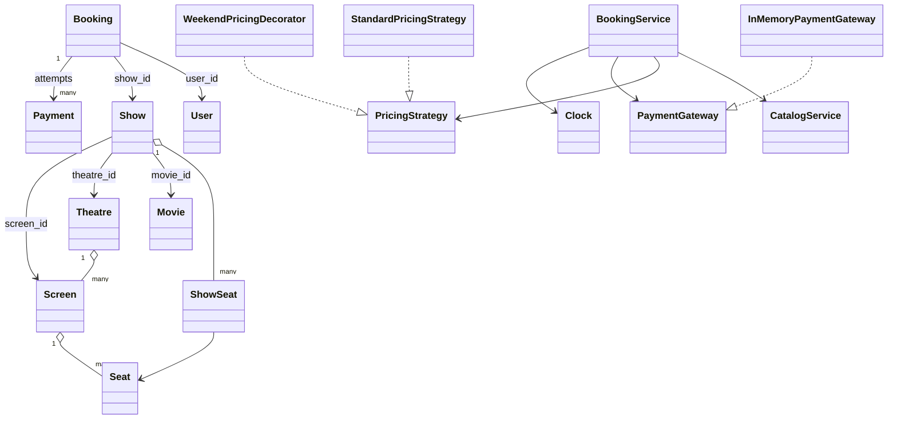

# Movie Ticket Booking Low-Level Design

Search shows, temporarily hold selected show seats, take payment, and confirm a booking without double-selling a seat.

## Understanding the Problem

Search shows, temporarily hold selected show seats, take payment, and confirm a booking without double-selling a seat.

The design starts with the business invariant and the critical workflow. Named patterns come later, only where a requirement creates a real variation or boundary.

## Requirements

### Clarifying Questions

- Are seats selected explicitly?
- How long does a hold last?
- Can payment be retried during the hold?
- Which cancellation/refund window applies?
- Are seat categories and dynamic prices required?

### Final Requirements

1. Search shows by city, movie, and date.
2. Hold selected seats for a bounded time.
3. Calculate and freeze an exact quote.
4. Confirm after successful payment.
5. Cancel eligible bookings and release seats.

The detailed reference below records additional assumptions, exclusions, validation rules, and edge cases.

## Core Entities and Relationships

| Entity | Responsibility |
|---|---|
| Movie | Catalog metadata. |
| Theatre and Screen | Physical venue and seat layout. |
| Show | Owns per-show seat inventory. |
| ShowSeat/Seat state | Tracks availability for one show. |
| Booking | Owns selected seats, quote, and lifecycle. |
| Payment | Records charge/refund. |
| BookingService | Coordinates hold, confirm, and cancel. |

The object that owns mutable state also owns the invariant protecting that state. Coordinating services load collaborators and sequence the use case; they do not bypass entity behavior.

## Class Design

### Good Solution

Separate a physical Seat from its availability in one Show.

### Great Solution

Use expiring holds, atomic multi-seat claim, exact quote snapshots, idempotent payment, explicit cancellation/refund, and overlap validation for screens.

### Final Class Design

The critical collaboration is: search -> atomically hold show seats -> create pending booking/quote -> pay -> confirm, or expire/cancel and release.

The full class map, state transitions, method contracts, and design rationale are preserved in the detailed reference below.

## Implementation

Implement one vertical slice before filling every class:

    search -> atomically hold show seats -> create pending booking/quote -> pay -> confirm, or expire/cancel and release

### Complete Code Implementation

- [Models](./models/)
- [Services](./services/)
- [Strategies](./strategies/)
- [Demonstration](./main.py)
- [Tests](./tests/)

Run:

    python "solutions/movie-ticket-booking/main.py"
    python -m unittest discover -s "solutions/movie-ticket-booking/tests" -t "solutions/movie-ticket-booking" -v

## Verification

Verify the happy path, the highest-risk rejection, and state after failure. Then force two competing operations at the atomic boundary and assert the invariant, not thread timing.

The detailed reference lists problem-specific test cases and complexity.

## Extensibility

- Seat categories and dynamic pricing
- Waitlists and partial cancellation
- Multi-cinema search and loyalty

Each extension should enter through a named policy, boundary, or lifecycle change rather than a new conditional inside the main workflow.

## What Is Expected at Each Level?

### Junior

Deliver the agreed core workflow with coherent entities, valid state changes, and straightforward failure handling.

### Mid-level

Make invariants explicit, isolate real variations, cover failure paths with tests, and discuss the relevant concurrency boundary.

### Senior

Explain multi-seat atomicity, hold expiry races, payment/confirmation failure, unique active-seat constraints, and idempotency.

## Interview Walkthrough

1. Clarify the version-one scope and exclusions.
2. State the invariants before drawing classes.
3. Introduce the core entities and walk: search -> atomically hold show seats -> create pending booking/quote -> pay -> confirm, or expire/cancel and release.
4. Compare the good and great solution based on the stated requirements.
5. Implement a complete vertical slice and one failure test.
6. Handle a realistic follow-up through an explicit extension seam.

## Detailed Design Reference

<details>
<summary>Open the implementation-specific deep dive</summary>
This is a beginner-friendly, working Python design for a cinema booking system.
It covers movie discovery, theatres and screens, show scheduling, seat selection,
temporary seat holds, pricing, payment retry, confirmation, cancellation,
refunds, and protection against two users reserving the same seat.

No previous knowledge of low-level design (LLD), object-oriented programming
(OOP), SOLID principles, design patterns, or booking systems is required.

> This is an educational in-memory implementation. A production ticketing
> platform also needs persistent databases, distributed locks or database
> transactions, authentication, external payment webhooks, observability,
> security controls, and failure recovery across services.

## 1. The problem in everyday language

A theatre contains physical screens, and each screen contains physical seats.
A movie is played on a screen at a particular time; that scheduled occurrence
is a **show**. A user searches for a show, selects available seats, pays, and
receives a confirmed booking.

The deceptively hard part is contention. If Asha and Ravi choose seat A1 at the
same instant, only one should obtain it. Payment also takes time, so the system
cannot immediately mark A1 permanently booked. It first places a short-lived
hold on A1. The hold becomes a booking after successful payment or returns to
the available pool after expiry, cancellation, or an abandoned checkout.

This implementation supports:

- Users, movies, theatres, screens, and typed physical seats.
- Show scheduling with same-screen overlap prevention.
- Search by city, movie, and date.
- Independent seat inventory for every show.
- Regular, premium, and recliner show-specific prices.
- Pluggable pricing, including an optional weekend surcharge decorator.
- Five-minute seat holds with configurable duration.
- Automatic release of expired holds.
- In-process locking to prevent concurrent double booking.
- Failed-payment retry while the hold remains valid.
- Idempotent booking confirmation.
- Pending and confirmed booking cancellation.
- Refunds for confirmed bookings cancelled before show time.
- User booking history and deterministic time-based tests.

## 2. Start here: run it

Requirements:

- Python 3.10 or newer.
- No third-party packages.

From the repository root:

```powershell
python "solutions/movie-ticket-booking/main.py"
python -m unittest discover -s "solutions/movie-ticket-booking/tests" -t "solutions/movie-ticket-booking" -v
```

Or from inside `solutions/movie-ticket-booking`:

```powershell
python main.py
python -m unittest discover -s tests -v
```

The demo creates a cinema catalog, searches for a show, holds one regular and
one premium seat, pays with UPI, confirms the booking, and displays the remaining
available seats.

## 3. LLD and OOP in two minutes

**Low-level design** decides which classes exist, what each class owns, how
objects interact, and where business rules live. It turns a broad requirement
such as "build movie booking" into code-sized responsibilities.

**Object-oriented programming** models the system using objects that combine
data with meaningful behavior:

- A `Screen` owns its physical `Seat` objects.
- A `Show` owns the changing status of those seats for one performance.
- `CatalogService` manages discovery and scheduling rules.
- `BookingService` coordinates a multi-object business workflow.
- A `PricingStrategy` hides how a total is calculated.
- A `PaymentGateway` hides how an external provider is called.

The aim is not to create as many classes as possible. The aim is to give every
important rule one obvious home.

## 4. Scope and assumptions

- One currency is used; the sample output describes amounts as rupees.
- A show's end time is movie start time plus movie duration. Advertisements and
  cleaning buffers are not included.
- Seat prices are configured per seat type for each show.
- A booking may contain seats from exactly one show.
- A failed payment does not release the hold immediately; it may be retried
  until the hold expires.
- Cancellation is allowed only before the show starts.
- A confirmed cancellation receives a full refund.
- The payment gateway is a controllable in-memory fake.
- Data survives only while the Python process is running.
- Locks protect threads inside one process, not multiple application instances.

These choices keep the learning example focused. They are explicit extension
points rather than hidden claims about a real ticketing platform.

## 5. Domain vocabulary

| Term | Meaning | Example |
|---|---|---|
| Movie | Content being screened | `The Design`, 150 minutes |
| Theatre | Cinema venue in a city | Cine Design, Bengaluru |
| Screen | Auditorium inside a theatre | Audi 1 |
| Seat | Physical chair and permanent metadata | A1, regular |
| Show | One movie scheduled on one screen | Friday at 6:00 PM |
| ShowSeat | A seat's availability for one show | A1 is held for the 6 PM show |
| Hold | Temporary exclusive right to pay for seats | Valid for five minutes |
| Booking | User's checkout and ticket lifecycle | Pending, confirmed, cancelled, expired |
| Payment | One charge attempt for a booking | Failed card attempt or completed UPI attempt |

### The most important modeling decision

`Seat` and `ShowSeat` are different concepts.

The physical A1 chair exists once on a screen. Its row, number, and type rarely
change. Its availability does change independently for every show. A1 can be
booked for the 3 PM show and available for the 7 PM show at the same time.

Putting `is_booked` directly on `Seat` would incorrectly make the chair
unavailable for every show. Therefore each new `Show` receives its own map of
`ShowSeat` objects:

```text
Screen s1
  Seat A1 (physical metadata)
       |---------------- Show 3 PM -> ShowSeat A1: BOOKED
       |---------------- Show 7 PM -> ShowSeat A1: AVAILABLE
       `---------------- Show 10 PM -> ShowSeat A1: HELD
```

This distinction is useful far beyond cinemas: a hotel room versus room-night
inventory, an aircraft seat versus flight-seat inventory, or a doctor versus a
dated appointment slot.

## 6. Requirements translated into responsibilities

| Requirement | Responsible type |
|---|---|
| Store permanent movie/venue data | `Movie`, `Theatre`, `Screen`, `Seat` |
| Prevent duplicate physical seat positions | `Screen.add_seat()` |
| Create independent show inventory | `CatalogService.create_show()` |
| Reject screen schedule overlaps | `CatalogService.create_show()` |
| Search shows | `CatalogService.search_shows()` |
| Calculate a seat total | `PricingStrategy` |
| Atomically check and hold seats | `BookingService.create_booking()` |
| Expire unpaid holds | `BookingService.expire_stale_bookings()` |
| Charge and refund | `PaymentGateway` |
| Confirm, retry, and cancel | `BookingService` |
| Supply testable time | `Clock` |

## 7. Project structure

```text
movie-ticket-booking/
|-- main.py
|-- models/
|   |-- enums.py
|   |-- money.py
|   |-- user.py
|   |-- movie.py
|   |-- seat.py
|   |-- screen.py
|   |-- theatre.py
|   |-- show.py
|   |-- booking.py
|   `-- payment.py
|-- strategies/
|   |-- pricing_strategy.py
|   |-- standard_pricing_strategy.py
|   `-- weekend_pricing_decorator.py
|-- services/
|   |-- clock.py
|   |-- catalog_service.py
|   |-- payment_gateway.py
|   |-- in_memory_payment_gateway.py
|   `-- booking_service.py
`-- tests/
    `-- test_movie_ticket_booking.py
```

Models describe domain state. Strategies describe interchangeable calculations.
Services coordinate use cases involving several models or external boundaries.

## 8. Class relationships



IDs are used between aggregate-like objects instead of holding a deep, mutable
object graph everywhere. The catalog is the source used to resolve those IDs.

## 9. State machines

State machines make legal transitions explicit and prevent vague booleans such
as `is_paid` plus `is_cancelled` plus `is_expired` from contradicting each other.

### Booking lifecycle

```text
                         payment succeeds
PENDING_PAYMENT --------------------------------> CONFIRMED
      |                                                |
      | hold timeout                                   | cancel + refund
      v                                                v
   EXPIRED                                         CANCELLED
      ^
      |
      +--- payment attempted after hold/show deadline

PENDING_PAYMENT -------------------------------> CANCELLED
                    user cancels
```

The current code deliberately keeps a failed charge in `PENDING_PAYMENT`, so a
user can choose another payment method before the hold expires.

### Per-show seat lifecycle

```text
AVAILABLE -- create booking --> HELD -- payment succeeds --> BOOKED
    ^                          /   |                         /
    |                         /    |                        /
    +-- cancel or timeout ---+     +--- cancel + refund ---+
```

`held_by_booking_id` records ownership. Releasing one booking therefore cannot
accidentally release a seat owned by another booking.

### Payment lifecycle

```text
charge --> COMPLETED --> REFUNDED
       `-> FAILED
```

Every retry creates a new `Payment`. This preserves an audit-friendly history
instead of overwriting a failed attempt.

## 10. Important workflows

### Search and schedule

1. `CatalogService` resolves the movie, theatre, and screen.
2. It derives the end time from movie duration.
3. It rejects any interval that overlaps another show on the same screen.
4. It validates prices for every seat type present on that screen.
5. It creates fresh `ShowSeat` state for each physical seat.
6. `search_shows()` filters by normalized city, optional movie, and optional date.

The interval rule is:

```python
new_start < existing_end and existing_start < new_end
```

Two shows may touch at an endpoint, but may not occupy the screen simultaneously.

### Hold seats

1. Validate user, show, non-empty selection, and duplicate IDs.
2. Acquire the lock belonging to the show.
3. Release any expired holds for that show.
4. Verify that the show has not started and all seats are `AVAILABLE`.
5. Calculate the price through the injected strategy.
6. Create a pending booking and mark every selected seat `HELD`.
7. Release the lock and return the booking.

All seat checks and state updates occur in one critical section. It is not
enough to check availability, release the lock, and update later; another thread
could pass the same check in between.

### Pay and confirm

1. Recheck expiry while holding the same per-show lock.
2. Return the existing successful payment if already confirmed. This makes a
   duplicate confirm call idempotent.
3. Ask the `PaymentGateway` to charge the exact `Decimal` amount.
4. Record the payment attempt whether it succeeds or fails.
5. On success, change the seats from `HELD` to `BOOKED` and confirm the booking.
6. On failure, leave the booking pending for a possible retry.

### Cancel

- Pending booking: release held seats and mark it cancelled.
- Confirmed booking: refund its completed payment, release booked seats, and
  mark it cancelled.
- Already cancelled booking: safely return it again.
- Expired booking or a show that has started: reject the request.

The refund happens before seats are released. If refunding fails, the confirmed
booking remains intact instead of reporting cancellation without returning money.

## 11. Preventing double booking

Consider two threads executing this unsafe sequence:

```text
Thread A checks A1 -> available
Thread B checks A1 -> available
Thread A marks A1 held
Thread B marks A1 held
```

The solution keeps an `RLock` per show. Requests for the same show serialize,
so the first requester changes A1 to `HELD` before the second can inspect it.
Requests for different shows can still proceed independently.

The concurrent unit test starts two threads at a barrier and makes both request
A1. It asserts one success and one rejection.

### Why this is not enough in production

An in-memory lock protects only one Python process. If server instance 1 and
server instance 2 both receive A1, their locks know nothing about each other.
A production design commonly uses one of these approaches:

- A database transaction with a row lock (`SELECT ... FOR UPDATE`).
- An atomic conditional update such as `UPDATE ... WHERE status = AVAILABLE`.
- Optimistic locking with a version column and retry.
- A distributed lock with careful lease/fencing-token semantics.

The durable database must remain the final source of truth. A cache may speed up
reads, but should not independently decide that a seat was sold.

## 12. Time and expiry design

Calling `datetime.now()` throughout business logic makes timeout tests slow and
unreliable. `BookingService` instead depends on a `Clock` interface:

- `SystemClock` returns real local time in the demo.
- Tests inject `MutableClock` and advance it instantly.

Expired bookings are cleaned lazily when availability, booking, confirmation,
or cancellation touches a show. `expire_stale_bookings()` is also public so a
scheduler can run cleanup periodically.

In production, store timestamps in UTC, use timezone-aware values, and persist
the expiry deadline. A background worker may improve freshness, but every write
path must still validate expiry because schedulers can be delayed.

## 13. Pricing and money

Prices use `Decimal`, not binary `float`. For example, binary floating-point
cannot represent many decimal fractions exactly, which is risky for money.
`to_money()` normalizes values to two decimal places using `ROUND_HALF_UP`.

`StandardPricingStrategy` adds the configured show price for each selected seat
type. `WeekendPricingDecorator` wraps any strategy and adds a percentage on
Saturday or Sunday:

```python
pricing = WeekendPricingDecorator(StandardPricingStrategy(), "25")
```

The booking service does not change when pricing changes. More strategies could
support matinee discounts, dynamic demand, coupons, loyalty tiers, taxes, and
convenience fees. A production bill should represent each component explicitly
rather than storing only one total.

## 14. Design patterns used

### Strategy

`PricingStrategy` defines `calculate(show, seat_ids)`. The service depends on
this abstraction, while `StandardPricingStrategy` supplies one algorithm.

Use Strategy when a rule varies independently and should be selected or replaced
without editing the workflow that consumes it.

### Decorator

`WeekendPricingDecorator` receives another `PricingStrategy`, calls it, and adds
behavior. Decorators can be composed without creating classes such as
`WeekendPremiumCouponPricingStrategy` for every rule combination.

### Gateway / Adapter boundary

`PaymentGateway` describes only what the domain needs: charge and refund.
`InMemoryPaymentGateway` is a local implementation. A Razorpay, Stripe, or bank
adapter could translate this interface into an external SDK or HTTP API.

### Dependency injection

`BookingService` receives its catalog, pricing strategy, payment gateway, and
clock through the constructor. It does not construct them internally. This
makes policy replaceable and tests deterministic.

### Service layer

`BookingService` coordinates rules spanning booking, show seats, payment, time,
and locking. Putting this orchestration in a service avoids bloated data objects
and avoids dumping all logic into `main.py`.

## 15. OOP and SOLID lessons

### Encapsulation

`Screen.add_seat()` protects the invariant that a seat ID and row/number pair
are unique. Callers do not need to repeat that rule.

### Abstraction

The booking workflow knows the `PaymentGateway` contract, not provider-specific
API details. It knows `Clock`, not how current time is obtained.

### Composition over inheritance

A theatre contains screens, a screen contains seats, and a weekend decorator
contains another pricing strategy. These are "has-a" relationships, so
composition expresses them more naturally than inheritance.

### Single Responsibility Principle

- Domain models represent state.
- `CatalogService` handles catalog and scheduling.
- `BookingService` handles the transactional booking lifecycle.
- Pricing classes calculate amounts.
- The gateway handles payment-provider behavior.

### Open/Closed Principle

New pricing and gateway implementations can be added without rewriting the
booking flow.

### Liskov Substitution Principle

Any correct `PricingStrategy` can replace `StandardPricingStrategy`; any correct
`PaymentGateway` can replace the in-memory gateway while preserving the service
contract.

### Interface Segregation Principle

The abstractions are intentionally small. Pricing consumers do not depend on
refund methods, and payment providers do not depend on seat-search behavior.

### Dependency Inversion Principle

High-level booking policy depends on `PricingStrategy`, `PaymentGateway`, and
`Clock` abstractions instead of concrete external mechanisms.

## 16. Validation and important edge cases

The implementation rejects or handles:

- Duplicate user IDs and duplicate email addresses.
- Duplicate movies, theatres, screens, seat IDs, and seat positions.
- Empty screens and non-positive movie durations.
- Missing or non-positive show prices.
- Overlapping shows on the same screen.
- Empty seat selections and duplicate selection entries.
- Unknown users, shows, or seats.
- Booking or payment after show start.
- Selecting held or booked seats.
- Paying an expired or cancelled booking.
- Cancelling an expired booking or after show start.
- Repeated confirmation and repeated cancellation calls.
- Multiple failed payment attempts before one success.

Validation close to the responsible operation makes failures early and clear.

## 17. Complexity

Let `S` be seats on a screen, `H` shows in the catalog, `K` seats selected in a
booking, and `B` bookings held by the service.

| Operation | Time | Extra space |
|---|---:|---:|
| Create show inventory | `O(S + H)` | `O(S)` |
| Search shows | `O(H log H)` due to sorting | `O(H)` |
| Create booking | `O(B + K)` in this in-memory cleanup design | `O(K)` |
| Price selected seats | `O(K)` | `O(1)` |
| Confirm or cancel | `O(B + K)` | `O(1)` |
| List available seats | `O(B + S log S)` | `O(S)` |

The `O(B)` scan is deliberately simple for an educational in-memory system.
A production store would index pending bookings by show and expiry time, often
using a database index, priority queue, or delayed-message mechanism.

## 18. Test coverage

The test suite verifies:

- Search normalization and filters.
- Show overlap rejection and endpoint-touching schedules.
- Independent availability across shows.
- Seat holds and exact totals.
- Duplicate and unavailable-seat rejection.
- Hold expiry and release.
- Successful, failed, retried, and idempotent payments.
- Pending cancellation and confirmed cancellation with refund.
- Restrictions after show start.
- Weekend pricing.
- Newest-first user history.
- A concurrent same-seat race with exactly one winner.

Tests describe the contract of the design. When extending the system, add a test
for the desired business rule before or alongside the implementation.

## 19. Production evolution

A practical next architecture could evolve in stages:

1. Replace dictionaries with repositories backed by a relational database.
2. Use a transaction or atomic compare-and-set for seat holds.
3. Store a unique constraint on `(show_id, seat_id)` inventory rows.
4. Persist booking and payment state transitions with an audit trail.
5. Introduce an idempotency key on checkout and payment requests.
6. Process asynchronous payment webhooks and verify provider signatures.
7. Use an outbox pattern to publish booking-confirmed events reliably.
8. Send tickets through notification subscribers after confirmation.
9. Add a scheduler/delayed queue for hold expiry.
10. Add timezone-aware scheduling, taxes, fees, offers, and cancellation policy.
11. Add authentication, authorization, rate limits, encryption, metrics, and logs.
12. Partition or route seat writes by show to handle high-demand releases.

### Failure cases a production design must answer

- Payment succeeded, but the application crashed before confirmation.
- The client retried because its response timed out.
- A payment webhook arrived twice or out of order.
- Refund succeeded at the provider but the local update failed.
- Hold-expiry worker ran late.
- A show was cancelled after thousands of tickets were sold.
- The theatre changed the screen and seat map.

These require durable state, idempotency, reconciliation jobs, and explicit
eventual-consistency rules—not merely more classes.

## 20. Suggested learning exercises

### Beginner

- Add phone number to `User` with validation.
- Search by language or genre.
- Add a `SOLD_OUT` result to the demo.
- Prevent seat number zero or blank row names.

### Intermediate

- Add taxes and convenience fees as itemized bill lines.
- Add coupon and loyalty pricing decorators.
- Add configurable cancellation/refund policies.
- Create a notification observer for email/SMS ticket delivery.
- Add multiple currencies without mixing them accidentally.

### Advanced

- Introduce repository interfaces and SQLite/PostgreSQL implementations.
- Implement optimistic locking using a version field.
- Model asynchronous payment webhooks and reconciliation.
- Use an outbox plus message broker for reliable notifications.
- Build a waitlist that receives released seats fairly.
- Load-test thousands of users competing for a small seat set.

For every exercise, state the invariant first. Example: "At most one active
hold or confirmed booking may own `(show_id, seat_id)` at any instant." Then
choose the class, database constraint, and test that enforce it.

## 21. Interview discussion guide

When explaining this LLD, a strong sequence is:

1. Clarify scope: search, holds, payments, cancellation, and concurrency.
2. Identify stable entities and changing state.
3. Explain why `Seat` and `ShowSeat` must be separate.
4. Walk through booking and payment state transitions.
5. State the double-booking invariant and locking boundary.
6. Explain Strategy, Gateway, Clock, and dependency injection.
7. Discuss failed payments, expiry, retries, and idempotency.
8. Be honest that an in-memory lock is not distributed protection.
9. Evolve the design toward transactions, persistence, webhooks, and events.

The quality of an LLD comes from clear invariants, ownership, and failure
handling—not from memorizing a class diagram.

</details>
