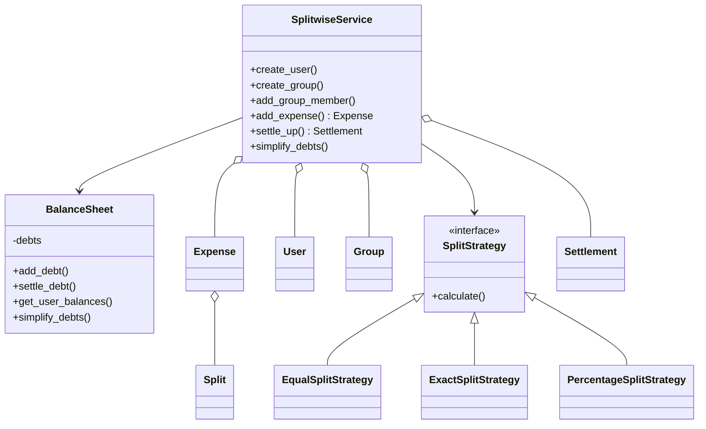
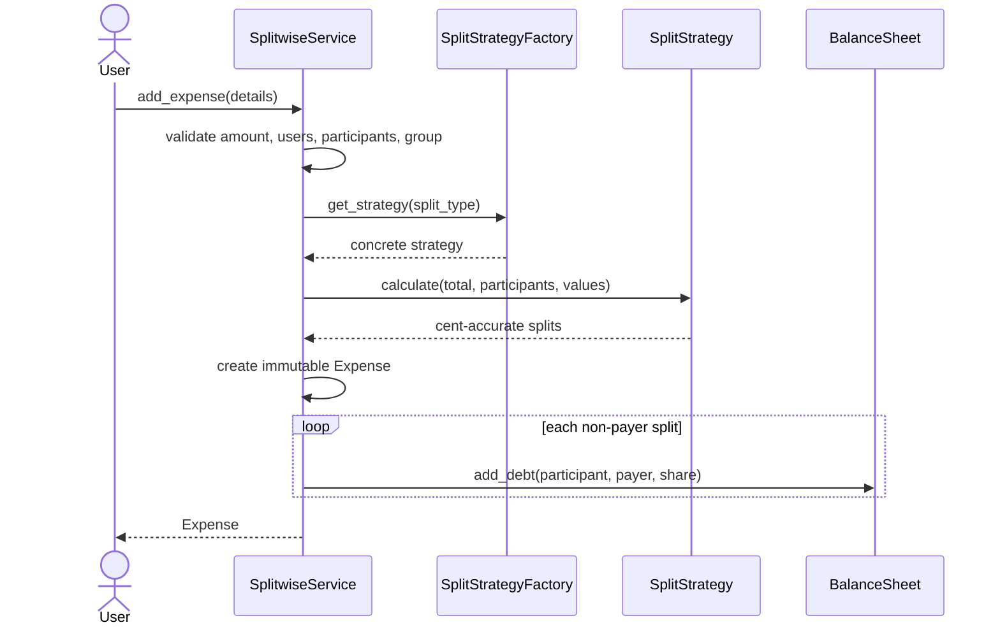

# Splitwise Low-Level Design

Record shared expenses, compute exact participant shares, maintain pairwise net balances, and settle debts without rounding drift.

## Understanding the Problem

Record shared expenses, compute exact participant shares, maintain pairwise net balances, and settle debts without rounding drift.

The design starts with the business invariant and the critical workflow. Named patterns come later, only where a requirement creates a real variation or boundary.

## Requirements

### Clarifying Questions

- Which split types are supported?
- Is one currency enough per group?
- Can expenses be edited or deleted?
- Is debt simplification required?
- Are settlements recorded internally or paid externally?

### Final Requirements

1. Create users and groups.
2. Add equal, exact, and percentage expenses.
3. Require shares to equal the expense exactly.
4. Maintain antisymmetric pairwise balances.
5. Record partial/full settlements and provide simplified suggestions.

The detailed reference below records additional assumptions, exclusions, validation rules, and edge cases.

## Core Entities and Relationships

| Entity | Responsibility |
|---|---|
| User | Participant identity. |
| Group | Membership and expense history. |
| Expense | Immutable payer, total, splits, and description. |
| Split | One participant's exact share. |
| SplitStrategy | Calculates and validates shares. |
| BalanceSheet | Owns pairwise net ledger. |
| Settlement | Records repayment. |
| SplitwiseService | Coordinates expense and settlement workflows. |

The object that owns mutable state also owns the invariant protecting that state. Coordinating services load collaborators and sequence the use case; they do not bypass entity behavior.

## Class Design

### Good Solution

Use exact Money and isolate equal/exact/percentage calculations behind strategies.

### Great Solution

Make expense plus ledger update atomic and idempotent, preserve immutable history, and treat debt simplification as a derived view.

### Final Class Design

The critical collaboration is: validate group/participants -> calculate exact splits -> create Expense -> atomically update antisymmetric balances -> record settlement or derive simplification.

The full class map, state transitions, method contracts, and design rationale are preserved in the detailed reference below.

## Implementation

Implement one vertical slice before filling every class:

    validate group/participants -> calculate exact splits -> create Expense -> atomically update antisymmetric balances -> record settlement or derive simplification

### Complete Code Implementation

- [Models](./models/)
- [Services](./services/)
- [Strategies](./strategies/)
- [Demonstration](./main.py)
- [Tests](./tests/)

Run:

    python "solutions/splitwise/main.py"
    python -m unittest discover -s "solutions/splitwise/tests" -t "solutions/splitwise" -v

## Verification

Verify the happy path, the highest-risk rejection, and state after failure. Then force two competing operations at the atomic boundary and assert the invariant, not thread timing.

The detailed reference lists problem-specific test cases and complexity.

## Extensibility

- Multi-currency groups
- Recurring/editable expenses with audit history
- Payment integration and optimized settlement

Each extension should enter through a named policy, boundary, or lifecycle change rather than a new conditional inside the main workflow.

## What Is Expected at Each Level?

### Junior

Deliver the agreed core workflow with coherent entities, valid state changes, and straightforward failure handling.

### Mid-level

Make invariants explicit, isolate real variations, cover failure paths with tests, and discuss the relevant concurrency boundary.

### Senior

Explain rounding remainder, immutable history, ledger invariants, concurrent/idempotent expense creation, settlement versions, and simplification trade-offs.

## Interview Walkthrough

1. Clarify the version-one scope and exclusions.
2. State the invariants before drawing classes.
3. Introduce the core entities and walk: validate group/participants -> calculate exact splits -> create Expense -> atomically update antisymmetric balances -> record settlement or derive simplification.
4. Compare the good and great solution based on the stated requirements.
5. Implement a complete vertical slice and one failure test.
6. Handle a realistic follow-up through an explicit extension seam.

## Detailed Design Reference

<details>
<summary>Open the implementation-specific deep dive</summary>
This project is a beginner-friendly, working implementation of a shared-expense
system similar to Splitwise. It shows how to model users, groups, expenses,
multiple split rules, balances, settlements, and debt simplification using
object-oriented design.

No previous knowledge of low-level design, OOP, SOLID, accounting, or design
patterns is required.

## 1. The problem in everyday language

Friends often pay for one another. If Alice pays INR 900 for dinner shared
equally by Alice, Bob, and Charlie, each person's share is INR 300. Alice has
already paid INR 900, so:

- Alice owes nothing for her own INR 300 share.
- Bob owes Alice INR 300.
- Charlie owes Alice INR 300.

A shared-expense system must record expenses, calculate each share accurately,
combine opposing debts, show balances, accept repayments, and optionally reduce
the number of transfers needed to settle the group.

This implementation supports:

- Users and groups.
- Group and non-group expenses.
- Equal, exact-amount, and percentage splits.
- Cent-accurate calculations with Python `Decimal`.
- Automatic netting of opposing debts.
- Per-user and global balances.
- Partial and complete settlements.
- Group and user expense history.
- Global debt simplification while preserving net positions.
- Validation for identities, memberships, participants, amounts, percentages,
  duplicate IDs, and excessive settlements.

The system is in memory. Restarting the program clears its data.

## 2. Start here: run it

Requirements:

- Python 3.10 or newer.
- No third-party packages.

From the `solutions/splitwise` directory:

```powershell
python main.py
python -m unittest discover -s tests -v
```

The demo creates Alice, Bob, and Charlie; creates a Goa Trip group; adds equal,
exact, and percentage expenses; then prints balances before and after debt
simplification.

## 3. Domain vocabulary

| Term | Meaning |
|---|---|
| User | A person who can pay, participate, owe, or receive money |
| Group | A named collection of users and group expenses |
| Expense | A payment made by one user for one or more participants |
| Split | One participant's share of an expense |
| Payer | User who paid the original expense |
| Debtor | User who currently owes money |
| Creditor | User who should receive money |
| Balance | A normalized debt from one user to another |
| Settlement | A repayment that reduces an existing balance |
| Net position | Total amount a user should receive minus total they owe |

### Expense versus settlement

An expense creates or changes obligations. A settlement is actual repayment of
an existing obligation. Keeping them as separate models preserves a meaningful
history.

## 4. Requirements converted into rules

1. An expense amount must be positive.
2. Every payer and participant must be a registered user.
3. Participants must be unique and non-empty.
4. For group expenses, payer and participants must belong to the group.
5. Equal splits must distribute every cent.
6. Exact splits must sum exactly to the expense amount.
7. Percentage splits must sum to exactly 100%.
8. Split amounts and percentages cannot be negative.
9. A payer never owes money to themself for their own share.
10. Opposing debts are automatically netted.
11. A settlement must follow the current debt direction.
12. A settlement cannot exceed the outstanding balance.

These invariants keep the ledger trustworthy. An LLD is incomplete if it models
only successful scenarios and ignores invalid state transitions.

## 5. Why money uses Decimal instead of float

Binary floating-point cannot represent many decimal fractions exactly:

```python
0.1 + 0.2 == 0.3  # False
```

Money must be deterministic to the cent. The project converts input through
`to_money()` and stores two-decimal `Decimal` values:

```python
Decimal("100.00")
```

Prefer strings or `Decimal` for monetary input:

```python
service.add_expense(..., amount="100.50")
```

The helper accepts floats for convenience, but strings avoid carrying an
already-rounded binary value into the conversion.

Production financial systems may store integer minor units (paise/cents) or use
currency-aware money objects. They must also record currency and exchange-rate
rules; this educational version assumes INR and one currency.

## 6. Project structure

```text
splitwise/
|-- main.py                              # Composition root and demo
|-- models/
|   |-- enums.py                         # SplitType
|   |-- money.py                         # Decimal conversion/rounding
|   |-- user.py                          # User identity
|   |-- group.py                         # Membership and group expense IDs
|   |-- split.py                         # One participant's share
|   |-- expense.py                       # Immutable expense record
|   |-- balance.py                       # Debtor -> creditor amount
|   `-- settlement.py                    # Repayment history
|-- strategies/
|   |-- split_strategy.py                # Split algorithm contract
|   |-- equal_split_strategy.py          # Equal shares + remainder cents
|   |-- exact_split_strategy.py          # Caller-provided amounts
|   |-- percentage_split_strategy.py     # Caller-provided percentages
|   `-- split_strategy_factory.py        # SplitType -> strategy selection
|-- services/
|   |-- balance_sheet.py                 # Debt netting and simplification
|   `-- splitwise_service.py             # Main application workflow
`-- tests/
    `-- test_splitwise.py                 # Executable requirements
```

Models represent domain state. Strategies calculate shares. `BalanceSheet`
maintains accounting invariants. `SplitwiseService` coordinates use cases.

## 7. Architecture at a glance



## 8. Data models and immutability

`User`, `Split`, `Expense`, `Balance`, and `Settlement` are frozen dataclasses.
Once created, their fields cannot be reassigned normally. Historical financial
records should not silently mutate.

For example, editing an old expense directly would make the current balance
incorrect unless its old ledger effect were reversed. A production application
normally implements an explicit edit/cancel workflow that creates audit entries
or rebuilds affected balances transactionally.

`Group` remains mutable because members and expense IDs are added over time.

## 9. Adding an expense: complete workflow



All split validation happens before the expense or ledger is changed. This
prevents a partially recorded invalid expense.

## 10. Strategy Pattern: split algorithms

All algorithms implement one contract:

```python
class SplitStrategy(ABC):
    @abstractmethod
    def calculate(total, participant_ids, values=None) -> list[Split]:
        ...
```

`SplitwiseService` does not contain a large `if/elif` block with every formula.
It asks the factory for a strategy and uses the common method. This is
polymorphism.

### Equal split

For INR 100 shared by three people, an exact mathematical share is repeating:
INR 33.333.... Currency cannot represent fractions smaller than one paise, so
the strategy deterministically distributes the remainder:

```text
Alice   INR 33.34
Bob     INR 33.33
Charlie INR 33.33
Total   INR 100.00
```

The first participants receive the remainder cents. A different valid policy
could rotate the recipient or use largest historical rounding loss.

### Exact split

The caller supplies every participant's amount:

```python
split_values={"alice": "100", "bob": "200", "charlie": "300"}
```

The keys must match participants and values must sum exactly to the total.

### Percentage split

The caller supplies percentages totaling 100:

```python
split_values={"alice": "50", "bob": "30", "charlie": "20"}
```

Raw percentage amounts are rounded down to cents. Remaining cents are assigned
to the shares with the largest discarded fractional values, making the final
amounts add up exactly to the expense total.

## 11. Factory Pattern: choosing the strategy

`SplitStrategyFactory` maps `SplitType` to an implementation:

```text
EQUAL      -> EqualSplitStrategy
EXACT      -> ExactSplitStrategy
PERCENTAGE -> PercentageSplitStrategy
```

The factory centralizes selection. To add a weighted-share type, implement a new
strategy, add an enum value, register the strategy, and add tests. The service's
expense workflow stays unchanged.

## 12. The balance ledger invariant

`BalanceSheet` stores only positive normalized debts:

```text
(debtor_id, creditor_id) -> positive amount
```

It never intentionally stores both:

```text
Bob owes Alice INR 100
Alice owes Bob INR 40
```

Instead, the opposing debts are netted immediately:

```text
Bob owes Alice INR 60
```

### Netting algorithm

When adding `debtor -> creditor`:

1. Look for the reverse `creditor -> debtor` balance.
2. If no reverse exists, add to the direct debt.
3. If reverse is larger, reduce the reverse debt.
4. If equal, remove the reverse debt completely.
5. If new debt is larger, remove reverse and store the difference directly.

This invariant makes displaying and settling pairwise balances simpler.

## 13. Payer and participant examples

The payer may be included among participants:

```text
Alice pays INR 900; Alice, Bob, Charlie split equally.
```

Each share is INR 300. The ledger ignores Alice owing herself and records only:

```text
Bob -> Alice: INR 300
Charlie -> Alice: INR 300
```

The payer may also pay fully for other people without participating:

```text
Alice pays INR 500 for Bob only.
Bob -> Alice: INR 500
```

Both are valid real-world cases.

## 14. Settlements

A settlement reduces an existing debt in its current direction:

```python
service.settle_up(
    paid_by_id="bob",
    paid_to_id="alice",
    amount="40",
)
```

If Bob owed Alice INR 100, INR 60 remains. Paying another INR 60 removes the
balance. Paying INR 101 or trying `Alice -> Bob` is rejected because it does not
match the current ledger.

Every successful repayment creates an immutable `Settlement` history record.
Actual bank/payment-gateway integration is outside this in-memory LLD.

## 15. Debt simplification

Pairwise netting removes opposite debts between two users, but groups can still
contain redundant chains:

```text
Alice owes Bob INR 50
Bob owes Charlie INR 50
```

Bob's net position is zero, so this can become:

```text
Alice owes Charlie INR 50
```

The algorithm:

1. Computes each user's net position.
2. Separates debtors (negative) and creditors (positive).
3. Greedily matches each debtor with creditors.
4. Rebuilds the ledger.

It preserves exactly how much every user should ultimately pay or receive and
often reduces transfers. It does not preserve original pairwise relationships,
so simplification should be an explicit group/system policy. The greedy result
is deterministic here but is not claimed to be the theoretical minimum number
of transactions for every possible constraint.

## 16. Groups and histories

The group creator becomes its first member. `add_group_member()` validates that
the user exists and is not already a member.

For a group expense, both payer and all participants must be members. This
prevents unrelated users from being silently included.

The service provides:

- `get_group_expenses(group_id)` in insertion order.
- `get_user_expenses(user_id)` where the user paid or participated.
- `settlements` as repayment history.

The current balance ledger is global. Production systems may additionally keep
group-scoped ledgers so users can view/simplify balances within one group without
combining unrelated expenses.

## 17. OOP concepts in this design

### Encapsulation

`BalanceSheet` owns debt netting and settlement rules. Callers do not manipulate
its private `_debts` dictionary directly.

### Abstraction

`SplitStrategy` describes what all split algorithms must do without exposing
their formulas.

### Polymorphism

Equal, exact, and percentage strategy objects respond to the same `calculate()`
method differently.

### Composition

An `Expense` contains multiple `Split` values. `SplitwiseService` contains and
coordinates its users, groups, expenses, settlements, and balance sheet.

### Immutability

Frozen financial records reduce accidental state corruption and encourage
explicit correction workflows.

## 18. SOLID principles

| Principle | Meaning | Example |
|---|---|---|
| Single Responsibility | One main reason to change | Split math is separate from ledger netting |
| Open/Closed | Extend behavior without rewriting stable workflows | Add another `SplitStrategy` |
| Liskov Substitution | Implementations honor the shared contract | Any split strategy returns valid `Split` values |
| Interface Segregation | Prefer focused contracts | Split calculation has one small interface |
| Dependency Inversion | High-level workflow uses an abstraction | Expense workflow works through `SplitStrategy` |

The service is still an application orchestrator with several related use
cases. If it grows substantially, user/group/expense services and repositories
could be separated.

## 19. Error handling and defensive design

The service rejects:

- Empty names, descriptions, participants, and malformed emails.
- Duplicate user emails/IDs, group IDs, expense IDs, and group members.
- Unknown users or groups.
- Non-positive expense amounts.
- Duplicate participants.
- Group expenses containing non-members.
- Missing/mismatched exact or percentage values.
- Negative shares or percentages.
- Exact values that do not total the expense.
- Percentages that do not total 100.
- Invalid or excessive settlements.

In a web application, domain-specific exception types could be translated into
clear HTTP status codes and error bodies.

## 20. Tests as executable requirements

The suite covers:

- Equal-split remainder cents.
- Exact-split debt netting.
- Percentage totals accurate to one cent.
- Atomic rejection of invalid splits.
- Group membership validation.
- Partial and complete settlements.
- Debt simplification and net-position preservation.
- Group/user expense histories.
- Duplicate validation.

Run one focused test:

```powershell
python -m unittest tests.test_splitwise.SplitwiseServiceTest.test_exact_split_nets_opposing_debts -v
```

Financial tests should assert exact `Decimal` values, not approximate floats.

## 21. Complexity

Let `U` be users, `P` participants, `D` current debt edges, and `E` expenses.

| Operation | Current complexity | Reason |
|---|---:|---|
| Create user/email uniqueness | `O(U)` | Existing users are scanned |
| Calculate equal/exact split | `O(P)` | One pass over participants |
| Calculate percentage split | `O(P log P)` | Fractional remainders are sorted |
| Add/net one debt | `O(1)` average | Dictionary lookup |
| Show all balances | `O(D log D)` | Debt keys are sorted for stable output |
| User expense history | `O(E * P)` worst case | Expenses and their splits are scanned |
| Simplify debts | roughly `O(D + U log U)` | Positions built, users sorted/matched |

Production systems would index email, expense participants, memberships, and
balances in persistent storage.

## 22. Concurrency and transactions

The current service is single-process and does not use locks. Concurrent expense
or settlement requests could race while updating the ledger.

A production implementation should use database transactions. Adding an expense
should atomically store:

- Expense record.
- Participant splits.
- Group history reference.
- Balance changes.

If one step fails, all steps should roll back. Idempotency keys are also needed
to prevent a retried API request from creating the same expense twice.

## 23. Current trade-offs

This educational LLD intentionally omits:

- Persistence and repository abstractions.
- Authentication, invitations, and authorization roles.
- Multiple currencies and exchange rates.
- Expense editing/deletion and audit reversal.
- Attachments, comments, categories, and recurring expenses.
- Group-scoped balance sheets and simplification.
- Payment-gateway integration and settlement confirmation.
- Notifications and activity feeds.
- Database transactions and idempotent APIs.
- Optimal settlement under real-world constraints.

Clear boundaries are part of good design. These are advancement opportunities,
not hidden claims of completeness.

## 24. Advancement exercises

Try these in increasing difficulty:

1. Add weighted shares such as 1:2:3.
2. Add expense categories and category summaries.
3. Add group-scoped balance views.
4. Add comments and receipt attachments.
5. Add recurring monthly expenses.
6. Add expense editing using reversal entries and an audit trail.
7. Add multiple currencies with stored exchange rates.
8. Add repository interfaces and database persistence.
9. Make expense creation transactional and idempotent.
10. Add asynchronous activity/notification events.
11. Add group invitation and authorization rules.
12. Explore minimum-transaction settlement with additional constraints.

For each feature, ask:

- What new state is required?
- Which object owns it?
- What validations and state transitions exist?
- Does the rule vary enough to need a strategy?
- What happens on retries or concurrent requests?
- Which tests prove exact monetary correctness?

## 25. Interview explanation template

When presenting this design:

1. Clarify users, groups, split types, currency, and settlement scope.
2. Explain why `Decimal` is required for money.
3. Separate expense records, participant splits, balances, and settlements.
4. Walk through adding an expense.
5. Explain the Strategy and Factory patterns.
6. Demonstrate opposing-debt netting with numbers.
7. Explain settlement and simplification separately.
8. Discuss validation, complexity, transactions, and concurrency.
9. State production extensions and current boundaries.

The strongest LLD explanation connects every class and pattern to a concrete
business rule rather than only naming diagrams or principles.

</details>
